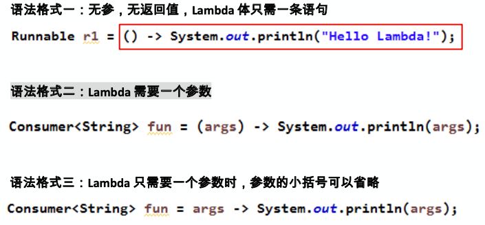
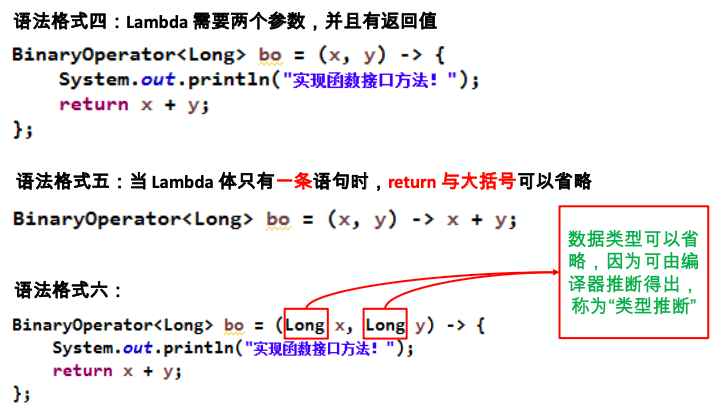
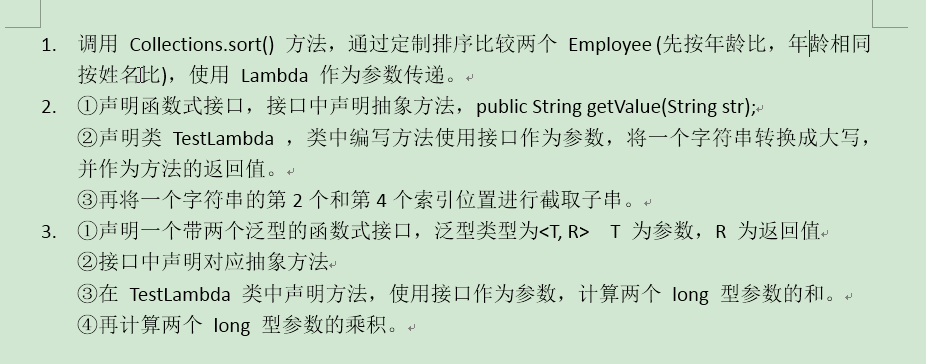
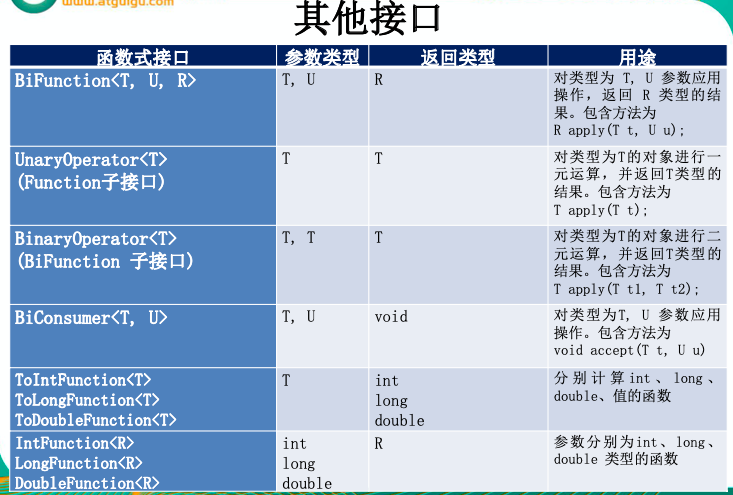

## JAVA8

1. Lambda 表达式
2. 函数式接口
3. 方法引用与构造器引用
4. Stream API
5. 接口中的默认方法与静态方法
6. 新时间日期API
7. 其他新特性

### Lambda 表达式

​		Lambda 是一个匿名函数，我们可以把 Lambda 表达式理解为是一段可以传递的代码(将代码 像数据一样进行传递)。可以写出更简洁、更 灵活的代码。作为一种更紧凑的代码风格，使 Java的语言表达能力得到了提升。

- 从匿名类到 Lambda 的转换

```java
        // 匿名内部类
        Runnable r1 = new Runnable() {
            public void run() {
                System.out.println("hello");
            }
        };
        // lambda
        Runnable r2 = () -> System.out.println("hello lambda");

        new Thread(r1).start();
        new Thread(r2).start();
```

```java
        // 使用匿名内部类作为参数传递
        TreeSet<String> ts = new TreeSet<>(new Comparator<String>() {
            @Override
            public int compare(String o1, String o2) {
                // 如果返回值为负数意味着o1比o2小，
                // 否则返回为零意味着o1等于o2，返回为正数意味着o1大于o2
                //return Integer.compare(o1.length(), o2.length());
                return o1.compareTo(o2);
            }
        });

        TreeSet<String> ts2 = new TreeSet<>(
                (o1, o2) -> Integer.compare(o1.length(), o2.length())
        );
        ts.add("w");
        ts.add("xx");
        System.out.printf(ts.toString());
```

“->”：

左侧:指定了 Lambda 表达式需要的所有参数 右侧:指定了 Lambda 体，即 Lambda 表达式要执行 的功能。

**Lambda** 表达式语法





​		Lambda 表达式中无需指定类型，程序依然可 以编译，这是因为 javac 根据程序的上下文，在后台 推断出了参数的类型。Lambda 表达式的类型依赖于上 下文环境，是由编译器推断出来的。这就是所谓的 “类型推断”。


需求：获取公司中年龄小于 35 的员工信息

```java
//需求：获取公司中年龄小于 35 的员工信息
    List<Employee> emps = Arrays.asList(
            new Employee(101, "张三", 18, 9999.99),
            new Employee(102, "李四", 59, 6666.66),
            new Employee(103, "王五", 28, 3333.33),
            new Employee(104, "赵六", 8, 7777.77),
            new Employee(105, "田七", 38, 5555.55)
    );

    public List<Employee> filterEmployees(List<Employee> list) {
        List<Employee> listx = new ArrayList<>();

        for (Employee emp : emps) {
            if(emp.getAge() <= 35){
                listx.add(emp);
            }
        }
        return listx;
    }

    @Test
    public void test3(){
        List<Employee> list = filterEmployees(emps);

        for (Employee employee : list) {
            System.out.println(employee);
        }
    }
```

新需求：获取公司中工资大于 5000 的员工信息

```
//需求：获取公司中工资大于 5000 的员工信息
public List<Employee> filterEmployeeSalary(List<Employee> emps){
    List<Employee> list = new ArrayList<>();

    for (Employee emp : emps) {
        if(emp.getSalary() >= 5000){
            list.add(emp);
        }
    }

    return list;
}
```

 以上两个需求 只有一个地方改变，因此可以采用一些方法优化

1.用接口

```java
public interface MyPredicate<T> {
    public boolean test(T t);
}
```


```java
public class FilterEmployeeForAge implements MyPredicate<Employee>{
    @Override
    public boolean test(Employee employee) {
        return employee.getAge() <= 35;
    }
}
```


```java
public class FilterEmployeeForSalary implements MyPredicate<Employee> {
    @Override
    public boolean test(Employee employee) {
        return employee.getSalary() > 5000;
    }
}
```

```java
@Test
public void test4() {
    // 用接口 将需要采用的方法传入
    //List<Employee> list = filterEmployee(emps,new FilterEmployeeForAge());
    List<Employee> list = filterEmployee(emps,new FilterEmployeeForSalary());


    for (Employee employee : list) {
        System.out.println(employee);
    }
}

// 以上两个需求 只有一个地方改变，因此可以采用一些方法优化

// 优化方式一：策略设计模式
public List<Employee> filterEmployee(List<Employee> emps, MyPredicate<Employee> mp) {
    List<Employee> list = new ArrayList<>();

    for (Employee employee : emps) {
        if (mp.test(employee)) {
            list.add(employee);
        }
    }
    return list;
}
```


```java
// 优化方式二：匿名内部类
@Test
public void test5() {
    List<Employee> list = filterEmployee(emps, new MyPredicate<Employee>() {
        @Override
        public boolean test(Employee employee) {
            return employee.getSalary() >= 5000;
        }
    });

    for (Employee employee : list) {
        System.out.println(employee);
    }
}
```


```java
一、Lambda 表达式的基础语法：Java8中引入了一个新的操作符 "->" 该操作符称为箭头操作符或 Lambda 操作符
箭头操作符将 Lambda 表达式拆分成两部分：
左侧：Lambda 表达式的参数列表
右侧：Lambda 表达式中所需执行的功能， 即 Lambda 体

语法格式一：无参数，无返回值
 		() -> System.out.println("Hello Lambda!");

 语法格式二：有一个参数，并且无返回值
 		(x) -> System.out.println(x)

 语法格式三：若只有一个参数，小括号可以省略不写
 		x -> System.out.println(x)

 语法格式四：有两个以上的参数，有返回值，并且 Lambda 体中有多条语句
		Comparator<Integer> com = (x, y) -> {
			System.out.println("函数式接口");
			return Integer.compare(x, y);
		};

 语法格式五：若 Lambda 体中只有一条语句， return 和 大括号都可以省略不写
 		Comparator<Integer> com = (x, y) -> Integer.compare(x, y);

 语法格式六：Lambda 表达式的参数列表的数据类型可以省略不写，因为JVM编译器通过上下文推断出，数据类型，即“类型推断”
 		(Integer x, Integer y) -> Integer.compare(x, y);
```

语法格式一：无参数，无返回值

```java
// 无参数 无返回值
public void test1() {

    Runnable r = new Runnable() {
        @Override
        public void run() {
            System.out.println("Hello World!");
        }
    };

    r.run();

    System.out.println("-------------------------------");

    Runnable r1 = () -> System.out.println("Hello Lambda!");
    r1.run();
}
```

Consumer中有一个接口accept函数

语法格式二：有一个参数，并且无返回值

语法格式三：若只有一个参数，小括号可以省略不写

```java
@Test
public void test2() {
    Consumer<String> con = x -> System.out.println(x);
    con.accept("hello！");
}
```

语法格式四：有两个以上的参数，有返回值，并且 Lambda 体中有多条语句，箭号后面一定加大括号

```java
@Test
public void test3() {
    Comparator<Integer> com = (x, y) -> {
        System.out.println("函数式接口");
        return Integer.compare(x, y);
    };
}
```

语法格式五：若 Lambda 体中只有一条语句， return 和 大括号都可以省略不写

```
@Test
public void test4() {
    Comparator<Integer> com = (x, y) -> Integer.compare(x, y);
}
```




```java
public class TestLambda {

    List<Employee> emps = Arrays.asList(
            new Employee(101, "张三", 18, 9999.99),
            new Employee(102, "李四", 59, 6666.66),
            new Employee(103, "王五", 28, 3333.33),
            new Employee(104, "赵六", 8, 7777.77),
            new Employee(105, "田七", 38, 5555.55)
    );

    // 定制sort方法 年龄相同比名字
    @Test
    public void test1() {
        Collections.sort(emps, (e1, e2) -> {
            if (e1.getAge() == e2.getAge()) {
                return e1.getName().compareTo(e2.getName());
            } else {
                return Integer.compare(e1.getAge(), e2.getAge());
            }
        });
        for (Employee employee : emps) {
            System.out.println(employee);
        }
    }

    @Test
    public void test2() {
        String trimStr = strHandler("  ni", (e) -> e.trim());
    }


    // 处理字符串
    public String strHandler(String str, MyFunction mf) {
        return mf.getValue(str);
    }

    // 处理运算
    @Test
    public void test3() {
        op(100L, 200L, (x, y) -> x + y);
    }

    public void op(Long l1, Long l2, MyFunction2<Long, Long> mf) {
        System.out.println(mf.getValue(l1, l2));
    }

    @Test
    public void test4() {
        int re = operate(100, 200, (x, y) -> x + y);
        System.out.println(re);
    }

    // 定义接口 -》 操作函数 -》 传参调用
    public int operate (int a, int b, MathOperation my) {
        return my.operation(a,b);
    }


}

// 处理字符串接口
@FunctionalInterface
interface MyFunction {

    public String getValue(String str);

}

// T是参数类型 R是返回值类型
@FunctionalInterface
interface MyFunction2<T, R> {

    public R getValue(T t1, T t2);

}

interface MathOperation {
    int operation(int a, int b);
}
```

#### Java8 内置的四大核心函数式接口

- Consumer<T> : 消费型接口
  - void accept(T t);

- Supplier<T> : 供给型接口
  - T get(); 

- Function<T, R> : 函数型接口
  - R apply(T t);

- Predicate<T> : 断言型接口
  - boolean test(T t);

```java
public class TestLambda3 {

    // Consumer<T> 消费型接口 :
    public void happy(double money, Consumer<Double> con) {
        con.accept(money);
    }

    @Test
    public void test1() {
        happy(10000, (m) -> System.out.println("你们刚哥喜欢大宝剑，每次消费：" + m + "元"));
    }

    //Supplier<T> 供给型接口 : 产生一些对象
    //需求：产生指定个数的整数，并放入集合中
    public List<Integer> getNumList(int num, Supplier<Integer> sup) {
        List<Integer> list = new ArrayList<>();

        for (int i = 0; i < num; i++) {
            Integer n = sup.get();
            list.add(n);
        }

        return list;
    }

    @Test
    public void test2() {
        List<Integer> numList = getNumList(10, () -> (int) (Math.random() * 100));

        for (Integer num : numList) {
            System.out.println(num);
        }
    }

    //Function<T, R> 函数型接口：
    //需求：用于处理字符串
    public String strHandler(String str, Function<String, String> fun) {
        return fun.apply(str);
    }

    @Test
    public void test3() {
        System.out.println(strHandler(" hello" , (str) -> str.trim()));
    }

    //Predicate<T> 断言型接口：
    //需求：将满足条件的字符串，放入集合中
    public List<String> filterStr(List<String> list, Predicate<String> pre){
        List<String> strList = new ArrayList<>();

        for (String str : list) {
            if (pre.test(str)) {
                strList.add(str);
            }
        }
        return strList;
    }

    @Test
    public void test4() {
        List<String> list = Arrays.asList("Hello", "atguigu", "Lambda", "www", "ok");
        List<String> strList = filterStr(list, (s) -> s.length() > 3);

        for (String str : strList) {
            System.out.println(str);
        }
    }
}
```



