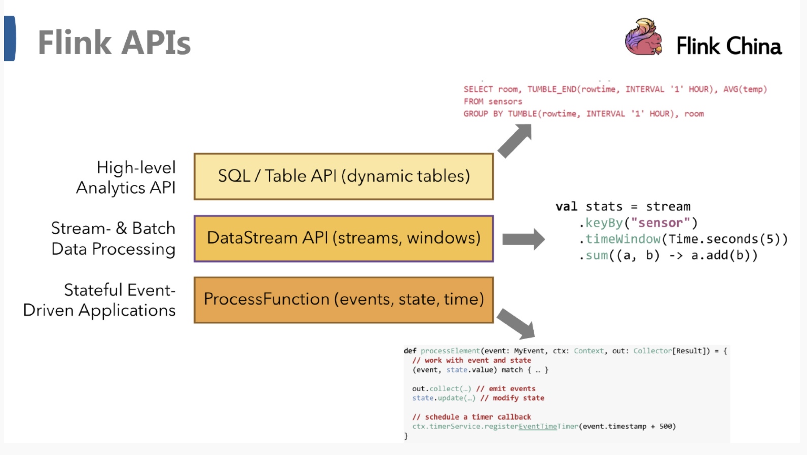
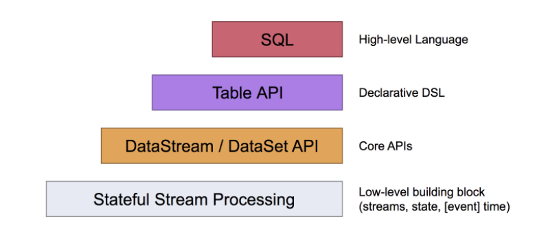
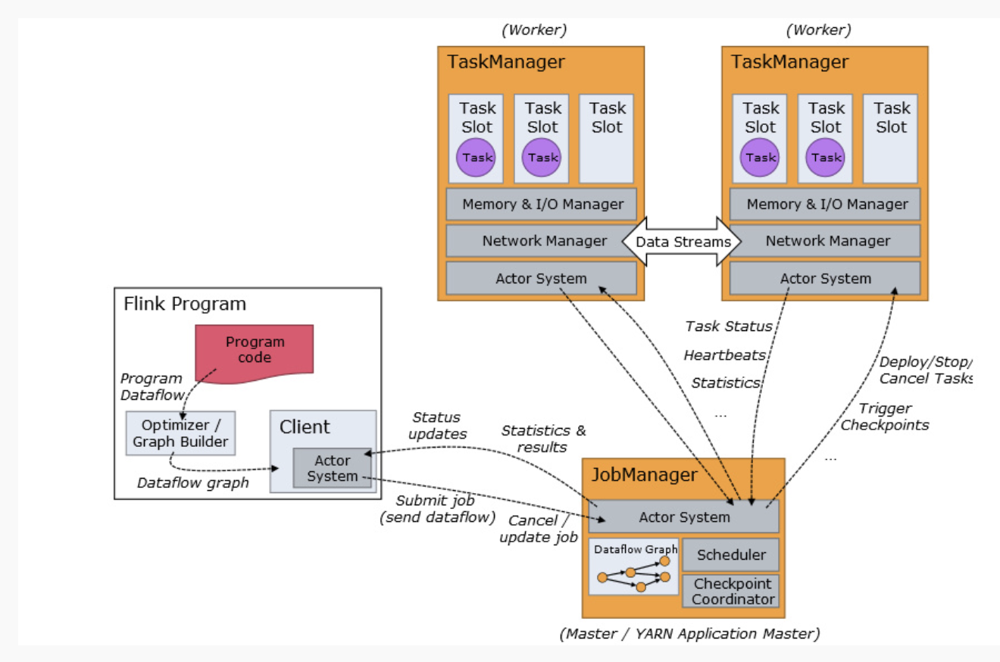
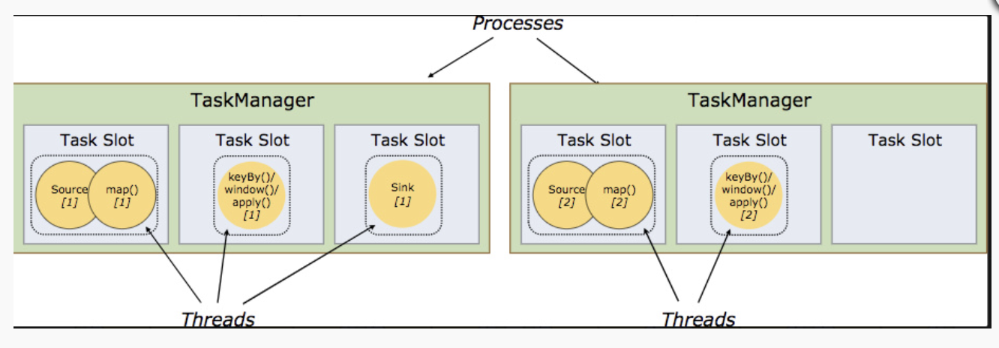
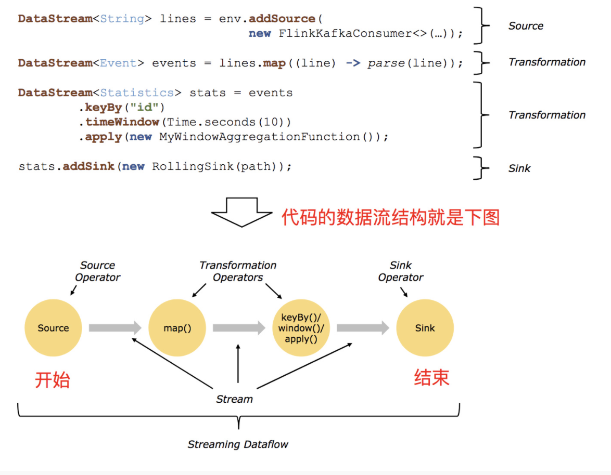
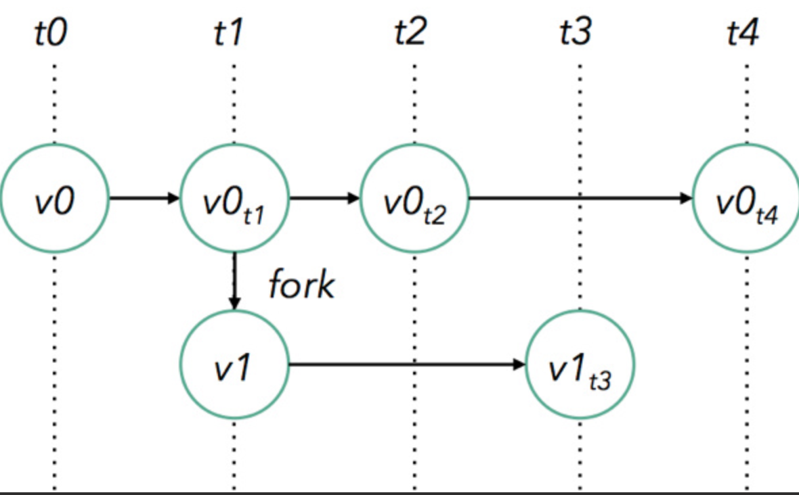
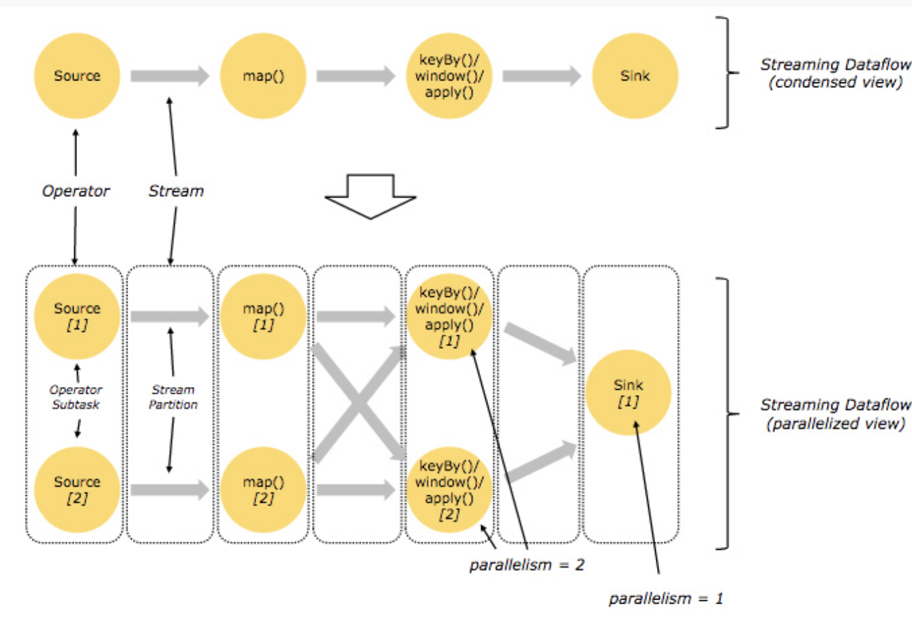

# Flink基础

来源：

[Flink 从 0 到 1 学习 —— Apache Flink 介绍](http://www.54tianzhisheng.cn/2018/10/13/flink-introduction/)

拉勾教育


[toc]

## Apache Flink 介绍

​	Flink 项目的理念是:“Apache Flink 是为分布式、高性能、随时可用以及准确的流处理应用程序打造的开源流处理框架”。

### Flink 的重要特点

#### 事件驱动型(Event-driven)

​		事件驱动型应用是一类具有状态的应用，它从一个或多个事件流提取数据，并 根据到来的事件触发计算、状态更新或其他外部动作。比较典型的就是以 kafka 为 代表的消息队列几乎都是事件驱动型应用。


事件驱动型:


​	在 spark 的世界观中，一切都是由批次组成的，离线数据是一个大批次，而实 时数据是由一个一个无限的小批次组成的。

而在 flink 的世界观中，一切都是由流组成的，离线数据是有界限的流，实时数 据是一个没有界限的流，这就是所谓的有界流和无界流。

**无界数据流**:无界数据流有一个开始但是没有结束，它们不会在生成时终止并 提供数据，必须连续处理无界流，也就是说必须在获取后立即处理 event。对于无界 数据流我们无法等待所有数据都到达，因为输入是无界的，并且在任何时间点都不 会完成。处理无界数据通常要求以特定顺序(例如事件发生的顺序)获取 event，以 便能够推断结果完整性。

**有界数据流**:有界数据流有明确定义的开始和结束，可以在执行任何计算之前 通过获取所有数据来处理有界流，处理有界流不需要有序获取，因为可以始终对有 界数据集进行排序，有界流的处理也称为批处理。

### 数据集类型有哪些呢：

- 无穷数据集：无穷的持续集成的数据集合
- 有界数据集：有限不会改变的数据集合

数据运算模型有哪些呢：

- 流式：只要数据一直在产生，计算就持续地进行
- 批处理：在预先定义的时间内运行计算，当完成时释放计算机资源

运用于：

批处理 --历史数据结果集

流计算 -- 处理实时数据流

事件驱动应用 --监控事件的服务


Flink的基石：

- Checkpoint
- State
- Time
- Window



#### 抽象级别



**最底层提供了有状态流：**它将通过过程函数（Process Function）嵌入到 DataStream API 中。它允许用户可以自由地处理来自一个或多个流数据的事件，并使用一致、容错的状态。除此之外，用户可以注册事件时间和处理事件回调，从而使程序可以实现复杂的计算。


**DataStream / DataSet API：** 是 Flink 提供的核心 API ，**DataSet 处理有界的数据集，DataStream 处理有界或者无界的数据流**。用户可以通过各种方法（map / flatmap / window / keyby / sum / max / min / avg / join 等）将数据进行转换 / 计算。


**Table API** 是以表为中心的声明式 DSL，其中表可能会动态变化（在表达流数据时）。Table API提供了例如 select、project、join、group-by、aggregate 等操作，使用起来却更加简洁（代码量更少）。


Flink 提供的最高层级的抽象是 **SQL** 。这一层抽象在语法与表达能力上与 Table API 类似，但是是以 SQL查询表达式的形式表现程序。SQL 抽象与 Table API 交互密切，同时 SQL 查询可以直接在 Table API 定义的表上执行。

### Flink 运行架构

#### Flink 运行时的组件

​		Flink 运行时架构主要包括四个不同的组件，它们会在运行流处理应用程序时协同工作: **作业管理器(JobManager)、资源管理器(ResourceManager)、任务管理器(TaskManager)， 以及分发器(Dispatcher)**。因为 Flink 是用 Java 和 Scala 实现的，所以所有组件都会运行在 Java 虚拟机上。每个组件的职责如下:

- 作业管理器(JobManager)

  ​	控制一个应用程序执行的主进程，也就是说，**每个应用程序都会被一个不同的 JobManager 所控制执行。**JobManager 会先接收到要执行的应用程序，这个应用程序会包括: 作业图(JobGraph)、逻辑数据流图(logical dataflow graph)和打包了所有的类、库和其它资源的 JAR 包。JobManager 会把 JobGraph 转换成一个物理层面的数据流图，这个图被叫做 “执行图”(ExecutionGraph)，包含了所有可以并发执行的任务。JobManager 会向资源管理器(ResourceManager)请求执行任务必要的资源，也就是任务管理器(TaskManager)上 的插槽(slot)。一旦它获取到了足够的资源，就会将执行图分发到真正运行它们的 TaskManager 上。而在运行过程中，JobManager 会负责所有需要中央协调的操作，比如说检 查点(checkpoints)的协调。	

- 资源管理器(ResourceManager)

  ​	**主要负责管理任务管理器(TaskManager)的插槽(slot)**，TaskManger 插槽是 Flink 中 定义的处理资源单元。Flink 为不同的环境和资源管理工具提供了不同资源管理器，比如 YARN、Mesos、K8s，以及 standalone 部署。当 JobManager 申请插槽资源时，ResourceManager 会将有空闲插槽的 TaskManager 分配给 JobManager。如果 ResourceManager 没有足够的插槽 来满足 JobManager 的请求，它还可以向资源提供平台发起会话，以提供启动 TaskManager 进程的容器。另外，ResourceManager 还负责终止空闲的 TaskManager，释放计算资源。

- 任务管理器(TaskManager)

  ​	Flink 中的工作进程。通常**在 Flink 中会有多个 TaskManager 运行，每一个 TaskManager都包含了一定数量的插槽(slots)。**插槽的数量限制了 TaskManager 能够执行的任务数量。 启动之后，TaskManager 会向资源管理器注册它的插槽;收到资源管理器的指令后， TaskManager 就会将一个或者多个插槽提供给 JobManager 调用。JobManager 就可以向插槽 分配任务(tasks)来执行了。在执行过程中，一个 TaskManager 可以跟其它运行同一应用程 序的 TaskManager 交换数据。

- 分发器(Dispatcher)

  ​	可以跨作业运行，它为应用提交提供了 REST 接口。当一个应用被提交执行时，分发器 就会启动并将应用移交给一个 JobManager。由于是 REST 接口，所以 Dispatcher 可以作为集 群的一个 HTTP 接入点，这样就能够不受防火墙阻挡。Dispatcher 也会启动一个 Web UI，用 来方便地展示和监控作业执行的信息。Dispatcher 在架构中可能并不是必需的，这取决于应 用提交运行的方式。

#### 任务提交流程


​		上图是从一个较为高层级的视角，来看应用中各组件的交互协作。如果部署的集群环境 不同(例如 YARN，Mesos，Kubernetes，standalone 等)，其中一些步骤可以被省略，或是 有些组件会运行在同一个 JVM 进程中。

​		具体地，如果我们将 Flink 集群部署到 YARN 上，那么就会有如下的提交流程:


- Flink 任务提交后，Client 向 HDFS 上传 Flink 的 Jar 包和配置;
- 向 Yarn ResourceManager 提交任务;
- ResourceManager 分配 Container 资源并通知对应的 NodeManager 启动 ApplicationMaster;
- ApplicationMaster 启动后加载 Flink 的 Jar 包 和配置构建环境，然后启动 JobManager, ApplicationMaster 向 ResourceManager 申 请 资 源 启 动 TaskManager ;
-  ResourceManager 分 配 Container 资 源 后 ， 由 ApplicationMaster 通 知 资 源 所 在 节 点 的 NodeManager 启 动 TaskManager ， 
- NodeManager 加载 Flink 的 Jar 包和配置构建环境并启动 TaskManager，TaskManager 启动后向 JobManager 发送心跳包，并等待 JobManager 向其分配任务。

#### 任务调度原理



1、**Program Code**：我们编写的 Flink 应用程序代码

2、**Job Client**：Job Client 不是 Flink 程序执行的内部部分，但**它是任务执行的起点**。 **Job Client 负责接受用户的程序代码，然后创建数据流，将数据流提交给 Job Manager 以便进一步执行。 执行完成后，Job Client 将结果返回给用户。**提交 Job 后，Client 可以结束进程(Streaming 的任务)，也可以不 结束并等待结果返回。



3、**Job Manager**：主进程（也称为作业管理器）协调和管理程序的执行。 它的**主要职责包括安排任务**，**管理checkpoint ，故障恢复等**。机器集群中至少要有一个 master，master 负责调度 task，协调 checkpoints 和容灾，高可用设置的话可以有多个 master，但要保证一个是 leader, 其他是 standby; Job Manager 包含 Actor system、Scheduler、Check pointing 三个重要的组件

4、**Task Manager**：从 Job Manager 处接收需要部署的 Task。**Task Manager 是在 JVM 中的一个或多个线程中执行任务的工作节点**。 任务执行的并行性由每个 Task Manager 上可用的任务槽决定。 每个任务代表分配给任务槽的一组资源。在启动的时候就设置好了槽位数(Slot)，每个 slot 能启动一个 Task。 例如，如果 Task Manager 有四个插槽，那么它将为每个插槽分配 25％ 的内存。 可以在任务槽中运行一个或多个线程。**同一插槽中的线程共享相同的 JVM。同一 JVM 中的任务共享 TCP 连接和心跳消息** 。Task Manager 的一个Slot代表一个可用线程，该线程具有固定的内存，注意 **Slot 只对内存隔离**，没有对 CPU 隔离**。默认情况下，Flink 允许子任务共享 Slot，即使它们是不同 task 的 subtask，只要它们来自相同的 job。**这种共享可以有更好的资源利用率。

Flink 中每一个 worker(TaskManager)都是一个 JVM 进程，它可能会在独立的线 程上执行一个或多个 subtask。为了控制一个 worker 能接收多少个 task，worker 通 过 task slot 来进行控制(一个 worker 至少有一个 task slot)。

每个 task slot 表示 TaskManager 拥有资源的一个固定大小的子集。假如一个 TaskManager 有三个 slot，那么它会将其管理的内存分成三份给各个 slot。资源 slot 化意味着一个 subtask 将不需要跟来自其他 job 的 subtask 竞争被管理的内存，取而 代之的是它将拥有一定数量的内存储备。需要注意的是，这里不会涉及到 CPU 的隔 离，slot 目前仅仅用来隔离 task 的受管理的内存。

通过调整 task slot 的数量，允许用户定义 subtask 之间如何互相隔离。如果一个 TaskManager 一个 slot，那将意味着每个 task group 运行在独立的 JVM 中(该 JVM 可能是通过一个特定的容器启动的)，而一个 TaskManager 多个 slot 意味着更多的 subtask 可以共享同一个 JVM。而在同一个 JVM 进程中的 task 将共享 TCP 连接(基 于多路复用)和心跳消息。它们也可能共享数据集和数据结构，因此这减少了每个 task 的负载。


​		Task Slot 是静态的概念，是指 TaskManager 具有的并发执行能力，可以通过 参数 taskmanager.numberOfTaskSlots 进行配置;而并行度 parallelism 是动态概念， 即 TaskManager 运行程序时实际使用的并发能力，可以通过参数 parallelism.default 进行配置。

​		也就是说，假设一共有 3 个 TaskManager，每一个 TaskManager 中的分配 3 个 TaskSlot，也就是每个 TaskManager 可以接收 3 个 task，一共 9 个 TaskSlot，如果我 们设置 parallelism.default=1，即运行程序默认的并行度为 1，9 个 TaskSlot 只用了 1 个，有 8 个空闲，因此，设置合适的并行度才能提高效率。


##### 程序与数据流结构



所有的 Flink 程序都是由三部分组成的: Source 、Transformation 和 Sink。

1、**Source: 数据源**：Flink 在流处理和批处理上的 source 大概有 4 类：

- 基于本地集合的 source；

- 基于文件的 source；

- 基于网络套接字的 source；

- 自定义的 source。

  自定义的 source 常见的有 Apache kafka、Amazon Kinesis Streams、RabbitMQ、Twitter Streaming API、Apache NiFi 等，当然你也可以定义自己的 source。

2、**Transformation**：数据转换的各种操作，有 Map / FlatMap / Filter / KeyBy / Reduce / Fold / Aggregations / Window / WindowAll / Union / Window join / Split / Select / Project 等，操作很多，可以将数据转换计算成你想要的数据。

3、**Sink**：接收器，**Flink 将转换计算后的数据发送的地点** ，你可能需要存储下来，Flink 常见的 Sink 大概有如下几类：写入文件、打印出来、写入 socket 、自定义的 sink 。自定义的 sink 常见的有 Apache kafka、RabbitMQ、MySQL、ElasticSearch、Apache Cassandra、Hadoop FileSystem 等，同理你也可以定义自己的 sink。

Flink 保存点提供了一个**状态化**的版本机制，**使得能以无丢失状态和最短停机时间的方式更新应用或者回退历史数据。**



Flink 的程序内在是并行和分布式的，数据流可以被分区成 **stream partitions**，operators 被划分为**operator subtasks**; 这些 subtasks **在不同的机器或容器中分不同的线程独立运行**；operator subtasks 的数量在具体的 operator 就是并行计算数，**程序不同的 operator 阶段可能有不同的并行数**；如下图所示，source operator 的并行数为 2，但最后的 sink operator 为1；



自己的内存管理

**Flink 在 JVM 中提供了自己的内存管理，使其独立于 Java 的默认垃圾收集器。 它通过使用散列，索引，缓存和排序有效地进行内存管理。**

##### 执行图

​		由 Flink 程序直接映射成的数据流图是 StreamGraph，也被称为逻辑流图，表示的是计算逻辑的高级视图。为了执行一个流处理程序，Flink 需要将逻辑流 图转换为物理数据流图(也叫执行图)，详细说明程序的执行方式。

Flink 中的执行图可以分成四层:StreamGraph -> JobGraph -> ExecutionGraph -> 物理执行图。

- **StreamGraph**:是根据用户通过 StreamAPI 编写的代码生成的最初的图。用来 表示程序的拓扑结构。

- **JobGraph**:StreamGraph 经过优化后生成了 JobGraph，提交给 JobManager 的 数据结构。主要的优化为，将多个符合条件的节点 chain 在一起作为一个节点，这 样可以减少数据在节点之间流动所需要的序列化/反序列化/传输消耗。

- **ExecutionGraph** : JobManager 根 据 JobGraph 生 成 ExecutionGraph 。 ExecutionGraph 是 JobGraph 的并行化版本，是调度层最核心的数据结构。

- **物理执行图**:JobManager 根据 ExecutionGraph 对 Job 进行调度后，在各个 TaskManager 上部署 Task 后形成的“图”，并不是一个具体的数据结构。


##### 窗口和时间

窗口和时间是 Flink 中的核心概念之一。Flink 支持了多种窗口模型比如滚动窗口（Tumbling Window）、滑动窗口（Sliding Window）及会话窗口（Session Window）等。


​		同时，Flink 支持了事件时间（Event Time）、摄取时间（Ingestion Time）和处理时间（Processing Time）三种时间语义用来满足实际生产中对于时间的特殊需求。


​		Flink 自身还支持了有状态的算子操作、容错机制、Checkpoint、Exactly-once 语义等更多高级特性，来支持用户在不同的业务场景中的需求。

##### 并行度

​		Flink 程序的执行具有并行、分布式的特性。

​		在执行过程中，一个流(stream)包含一个或多个分区(stream partition)，而 每一个算子(operator)可以包含一个或多个子任务(operator subtask)，这些子任 务在不同的线程、不同的物理机或不同的容器中彼此互不依赖地执行。

​		**一个特定算子的子任务(subtask)的个数被称之为其并行度(parallelism)**。 一般情况下，一个流程序的并行度，可以认为就是其所有算子中最大的并行度。一 个程序中，不同的算子可能具有不同的并行度。


​		Stream 在算子之间传输数据的形式可以是 one-to-one(forwarding)的模式也可以是 redistributing 的模式，具体是哪一种形式，取决于算子的种类。

​		**One-to-one**:stream(比如在 source 和 map operator 之间)维护着分区以及元素的顺序。那意味着 map 算子的子任务看到的元素的个数以及顺序跟 source 算子的子 任务生产的元素的个数、顺序相同，**map、fliter、flatMap 等算子都是 one-to-one 的 对应关系**。

​		:hear_no_evil:类似于 spark 中的窄依赖

​		**Redistributing**:stream(map()跟 keyBy/window 之间或者 keyBy/window 跟 sink 之间)的分区会发生改变。每一个算子的子任务依据所选择的 transformation 发送数 据到不同的目标任务。例如，keyBy() 基于 hashCode 重分区、broadcast 和 rebalance 会随机重新分区，这些算子都会引起 redistribute 过程，而 redistribute 过程就类似于 Spark 中的 shuffle 过程。

​		:m:类似于 spark 中的宽依赖

##### 任务链

​		相同并行度的 one-to-one 操作，Flink 这样相连的算子链接在一起形成一个 task,原来的算子成为里面的一部分。将算子链接成 task 是非常有效的优化:**它能减少线程之间的切换和基于缓存区的数据交换，在减少时延的同时提升吞吐量。**链接的行为可以在编程 API 中进行指定。


### Flink流处理 API

Environment -> source -> transform -> sink

#### Environment

 	**getExecutionEnvironment**：创建一个执行环境，表示当前执行程序的上下文。如果程序是独立调用的，则此方法返回本地执行环境；如果是从命令行客户端调用程序提交到集群的，则此方法返回集群的执行环境。getExecutionEnvironment会根据查询运行的方式决定返回什么样的运行环境，是最常用的一种创建执行环境的方式。

```scala
val env: ExecutionEnvironment = ExecutionEnvironment.getExecutionEnvironment
val env = StreamExecutionEnvironment.getExecutionEnvironment
```

如果没有设置并行度，会以 flink-conf.yaml 中的配置为准，默认是 1。

​	**createLocalEnvironment**：返回本地执行环境，需要在调用时指定默认的并行度。

```scala
val env = StreamExecutionEnvironment.createLocalEnvironment(1)
```

​	**createRemoteEnvironment**：返回集群执行环境，将 Jar 提交到远程服务器。需要在调用时指定 JobManager的 IP 和端口号，并指定要在集群中运行的 Jar 包。

```scala
val env = ExecutionEnvironment.createRemoteEnvironment("jobmanage-hostname", 6123,"YOURPATH//wordcount.jar")
```

#### Source

从集合读取数据

```scala
// 定义样例类，传感器 id，时间戳，温度
case class SensorReading(id: String, timestamp: Long, temperature: Double)

object Sensor {
  def main(args: Array[String]): Unit = {
    val env = StreamExecutionEnvironment.getExecutionEnvironment
    val stream1 = env .fromCollection(List(
    SensorReading("sensor_1", 1547718199, 35.80018327300259), 				SensorReading("sensor_6", 1547718201, 15.402984393403084), 				SensorReading("sensor_7", 1547718202, 6.720945201171228), 				SensorReading("sensor_10", 1547718205, 38.101067604893444)
    ))
    stream1.print("stream1:").setParallelism(1)
    env.execute() 
  }
}
```

从文件读取数据

```scala
val stream2 = env.readTextFile("YOUR_FILE_PATH")
```

以 kafka 消息队列的数据作为来源

```xml
<dependency>
  <groupId>org.apache.flink</groupId> 
  <artifactId>flink-connector-kafka-0.11_2.11</artifactId>
  <version>1.7.2</version>
</dependency>
```

```scala
val properties = new Properties() properties.setProperty("bootstrap.servers", "localhost:9092") properties.setProperty("group.id", "consumer-group") properties.setProperty("key.deserializer", "org.apache.kafka.common.serialization.StringDeserializer") properties.setProperty("value.deserializer",
"org.apache.kafka.common.serialization.StringDeserializer") 
properties.setProperty("auto.offset.reset", "latest")

val stream3 = env.addSource(new FlinkKafkaConsumer011[String]("sensor", new SimpleStringSchema(), properties))
```

自定义 Source

需要做的，只是传入一个 SourceFunction 就可以

```
val stream4 = env.addSource( new MySensorSource() )
```

```scala
class MySensorSource extends SourceFunction[SensorReading]{
  // flag: 表示数据源是否还在正常运行 var running: Boolean = true
  override def cancel(): Unit = { 
    running = false
  }
  override def run(ctx: SourceFunction.SourceContext[SensorReading]): Unit ={
    // 初始化一个随机数发生器 val rand = new Random()
    var curTemp = 1.to(10).map(
    i => ( "sensor_" + i, 65 + rand.nextGaussian() * 20 )
    )
    while(running){ // 更新温度值
      curTemp = curTemp.map(
      t => (t._1, t._2 + rand.nextGaussian() )
      )
      // 获取当前时间戳
      val curTime = System.currentTimeMillis()
      curTemp.foreach(
      t => ctx.collect(SensorReading(t._1, curTime, t._2))
      )
      Thread.sleep(100) 
    }
  } 
}
```

#### Transform

**map**

```scala
val streamMap = stream.map { x => x * 2 }
```

**flatMap**

flatMap 的函数签名:def flatMap[A,B](as: List[A])(f: A ⇒ List[B]): List[B] 例如: flatMap(List(1,2,3))(i ⇒ List(i,i))
结果是 List(1,1,2,2,3,3),
而 List("a b", "c d").flatMap(line ⇒ line.split(" "))结果是 List(a, b, c, d)。

```scala
val streamFlatMap = stream.flatMap{ 
		x => x.split(" ")
}
```

**Filter**

```scala
val streamFilter = stream.filter{ 
  x => x == 1
}
```

**KeyBy**

**DataStream → KeyedStream**:逻辑地将一个流拆分成不相交的分区，每个分 区包含具有相同 key 的元素，在内部以 hash 的形式实现的。

**滚动聚合算子**

这些算子可以针对 KeyedStream 的每一个支流做聚合。

sum()、min()、max()、minBy()、maxBy()

**Reduce**

**KeyedStream → DataStream**:**一个分组数据流的聚合操作**，合并当前的元素和上次聚合的结果，产生一个新的值，返回的流中包含每一次聚合的结果，而不是只返回最后一次聚合的最终结果。

```scala
val stream2 = env.readTextFile("YOUR_PATH\\sensor.txt") .map( data => {
  val dataArray = data.split(",")
  SensorReading(dataArray(0).trim, dataArray(1).trim.toLong, dataArray(2).trim.toDouble)
}).keyBy("id")
	.reduce( (x, y) => SensorReading(x.id, x.timestamp + 1, y.
                                   temperature))
```

**Split**


​	**DataStream → SplitStream:**根据某些特征把一个 DataStream 拆分成两个或者

多个 DataStream。

**Select**


​		**SplitStream→DataStream:**从一个 SplitStream 中获取一个或者多个 DataStream。

需求:传感器数据按照温度高低(以 30 度为界)，拆分成两个流。

```scala
val splitStream = stream2 .split( sensorData => {
		if (sensorData.temperature > 30) Seq("high") else Seq("low")
})
val high = splitStream.select("high")
val low = splitStream.select("low")
val all = splitStream.select("high", "low")
```

**Connect**


​		**DataStream,DataStream → ConnectedStreams:**连接两个保持他们类型的数据流，两个数据流被 Connect 之后，**只是被放在了一个同一个流中，内部依然保持各 自的数据和形式不发生任何变化，两个流相互独立。**

**CoMap,CoFlatMap**


​		**ConnectedStreams → DataStream:**作用于 ConnectedStreams上，功能与 map和flatMap一样，对 ConnectedStreams中的每一个 Stream 分别进行 map 和 flatMap 处理。

```scala
val warning = high.map( 
  sensorData => (sensorData.id, sensorData.temperature) )
  val connected = warning.connect(low)

val coMap = connected.map(
  warningData => (warningData._1, warningData._2, "warning"), 			lowData => (lowData.id, "healthy")
)
```

**Union**


​	**DataStream → DataStream:**对两个或者两个以上的 DataStream 进行 union 操作，产生一个包含所有 DataStream 元素的新 DataStream。

```scala
//合并以后打印
val unionStream: DataStream[StartUpLog] = appStoreStream.union(otherStream) unionStream.print("union:::")
```

**Connect 与 Union 区别:**

1. Union 之前两个流的类型必须是一样，Connect 可以不一样，在之后的 coMap 中再去调整成为一样的。

2. Connect 只能操作两个流，Union 可以操作多个。

##### 支持的数据类型

**基础数据类型**

​	Flink 支持所有的 Java 和 Scala 基础数据类型，Int, Double, Long, String, ...

```scala
val numbers: DataStream[Long] = env.fromElements(1L, 2L, 3L, 4L) numbers.map( n => n + 1 )
```

**Java 和 Scala 元组**

```scala
val persons: DataStream[(String, Integer)] = env.fromElements( ("Adam", 17),
("Sarah", 23) ) persons.filter(p => p._2 > 18)
```

 **Scala 样例类(case classes)**

```scala
case class Person(name: String, age: Int)
val persons: DataStream[Person] = env.fromElements( 
  Person("Adam", 17),
	Person("Sarah", 23) )
persons.filter(p => p.age > 18)
```

 **Java 简单对象(POJOs)**

```scala
public class Person {
	public String name;
  public int age;
  public Person() {}
  public Person(String name, int age) {
    this.name = name;
    this.age = age; 
  }
}
DataStream<Person> persons = env.fromElements(
new Person("Alex", 42), new Person("Wendy", 23));
```

##### 实现 UDF 函数

user define function

更细粒度的控制流

**函数类**

下面例子实现了 FilterFunction 接口:

```scala
class FilterFilter extends FilterFunction[String] {
  override def filter(value: String): Boolean = { 	value.contains("flink")
} }
val flinkTweets = tweets.filter(new FlinkFilter)
```

还可以将函数实现成匿名类

```scala
val flinkTweets = tweets.filter(
  new RichFilterFunction[String] {
  override def filter(value: String): Boolean = {
    value.contains("flink") }
} )
```

filter 的字符串"flink"还可以当作参数传进去。

```scala
val tweets: DataStream[String] = ...
val flinkTweets = tweets.filter(new KeywordFilter("flink"))
class KeywordFilter(keyWord: String) extends 					FilterFunction[String] { 
  override def filter(value: String): Boolean = {
	value.contains(keyWord) }
}
```

**匿名函数** 

```scala
val tweets: DataStream[String] = ...
val flinkTweets = tweets.filter(_.contains("flink"))
```

**富函数**

​		“富函数”是 DataStream API 提供的一个函数类的接口，所有 Flink 函数类都 有其 Rich 版本。**它与常规函数的不同在于，可以获取运行环境的上下文，并拥有一 些生命周期方法，所以可以实现更复杂的功能。**

RichMapFunction、RichFlatMapFunction、RichFilterFunction...

Rich Function 有一个生命周期的概念。典型的生命周期方法有:

- open()方法是 rich function 的**初始化方法**，当一个算子例如 map 或者 filter

被调用之前 open()会被调用。

- close()方法是生命周期中的最后一个调用的方法，做一些清理工作。

- getRuntimeContext()方法提供了函数的 RuntimeContext 的一些信息，例如函

数执行的并行度，任务的名字，以及 state 状态

```scala
class MyFlatMap extends RichFlatMapFunction[Int, (Int, Int)] { 
  var subTaskIndex = 0
  override def open(configuration: Configuration): Unit = {
    subTaskIndex = getRuntimeContext.getIndexOfThisSubtask // 以下可以做一些初始化工作，例如建立一个和 HDFS 的连接
  }
  override def flatMap(in: Int, out: Collector[(Int, Int)]): Unit = { 
    if (in % 2 == subTaskIndex) {
      out.collect((subTaskIndex, in)) }
  }
  override def close(): Unit = {
  // 以下做一些清理工作，例如断开和 HDFS 的连接。 }
  }
```

#### Sink

​		Flink 没有类似于 spark 中 foreach 方法，让用户进行迭代的操作。虽有对外的 输出操作都要利用 Sink 完成。最后通过类似如下方式完成整个任务最终输出操作。

```scala
stream.addSink(new MySink(xxxx))
```

​		官方提供了一部分的框架的 sink。除此以外，需要用户自定义实现 sink。

**Kafka**

主函数中添加 sink:

```xml
<dependency>
  <groupId>org.apache.flink</groupId> 
  <artifactId>flink-connector-kafka-0.11_2.11</artifactId>
  <version>1.7.2</version>
</dependency>
```

```scala
val union1 = high.union(low).map(_.temperature.toString)
union1.addSink(new FlinkKafkaProducer011[String]("localhost:9092", "test", new SimpleStringSchema()))
```

**Redis**

```xml
<dependency>
  <groupId>org.apache.bahir</groupId> 
  <artifactId>flink-connector-redis_2.11</artifactId>
  <version>1.0</version>
</dependency>
```

定义一个 redis 的 mapper 类，用于定义保存到 redis 时调用的命令:

```scala
class MyRedisMapper extends RedisMapper[SensorReading]{
  override def getCommandDescription: RedisCommandDescription = {
  new RedisCommandDescription(RedisCommand.HSET, "sensor_temperature") 
  }
  override def getValueFromData(t: SensorReading): String = t.temperature.toString
  override def getKeyFromData(t: SensorReading): String = t.id 
}
```

```scala
val conf = new FlinkJedisPoolConfig.Builder().setHost("localhost").setPort(6379).build() dataStream.addSink(new RedisSink[SensorReading](conf, new MyRedisMapper) )
```

**Elasticsearch**

```xml
<dependency>
  <groupId>org.apache.flink</groupId> 
  <artifactId>flink-connector-elasticsearch6_2.11</artifactId>
  <version>1.7.2</version>
</dependency>
```

在主函数中调用:

```scala
val httpHosts = new util.ArrayList[HttpHost]() 
httpHosts.add(new HttpHost("localhost", 9200))

val esSinkBuilder = new ElasticsearchSink.Builder[SensorReading]( httpHosts, new ElasticsearchSinkFunction[SensorReading] {
		override def process(t: SensorReading, runtimeContext: RuntimeContext, requestIndexer: RequestIndexer): Unit = {
		println("saving data: " + t)
		val json = new util.HashMap[String, String]() json.put("data", t.toString)
		val indexRequest =
Requests.indexRequest().index("sensor").`type`("readingData").source(json) 
    requestIndexer.add(indexRequest)
		println("saved successfully")
}})
dataStream.addSink( esSinkBuilder.build() )
```

**JDBC自定义sink**

```xml
<dependency>
  <groupId>org.apache.bahir</groupId> 
  <artifactId>flink-connector-redis_2.11</artifactId>
  <version>1.0</version>
</dependency>
```

添加 MyJdbcSink

```scala
class MyJdbcSink() extends RichSinkFunction[SensorReading]{ 
  var conn: Connection = _
  var insertStmt: PreparedStatement = _
  var updateStmt: PreparedStatement = _
	// open 主要是创建连接
	override def open(parameters: Configuration): Unit = {
super.open(parameters)
	conn =  DriverManager.getConnection("jdbc:mysql://localhost:3306/test", "root", "123456")
	insertStmt = conn.prepareStatement("INSERT INTO temperatures (sensor, temp) VALUES (?, ?)")
	updateStmt = conn.prepareStatement("UPDATE temperatures SET temp = ? WHERE
sensor = ?") }
	//调用连接，执行 sql
	override def invoke(value: SensorReading, context: 						SinkFunction.Context[_]): Unit = {
    updateStmt.setDouble(1, value.temperature)
    updateStmt.setString(2, value.id) updateStmt.execute()
if (updateStmt.getUpdateCount == 0) { 
      insertStmt.setString(1, value.id) 
      insertStmt.setDouble(2, value.temperature) 
      insertStmt.execute()
		} 
  }
override def close(): Unit = { 
    insertStmt.close() 
    updateStmt.close() 
    conn.close()
  } 
}
```

在 main 方法中增加，把明细保存到 mysql 中

```scala
dataStream.addSink(new MyJdbcSink())
```

## Flink 入门程序 WordCount 和 SQL 实现

### DataSet WordCount

```java
public class BatchJob {


	public static void main(String[] args) throws Exception {

		final ExecutionEnvironment env = ExecutionEnvironment.getExecutionEnvironment();
		env.setParallelism(5);
		// get input data 使用fromElements函数创建一个DataSet对象
		DataSet<String> text = env.fromElements(
				"Flink Spark Storm",
				"Flink Flink Flink",
				"Spark Spark Spark",
				"Storm Storm Storm"
		);


		DataSet<Tuple2<String, Integer>> counts =
				text.flatMap(new LineSplitter())
						.groupBy(0)
						.sum(1).setParallelism(1);

		counts.printToErr();

	}

	// 分割规则
	public static final class LineSplitter implements FlatMapFunction<String, Tuple2<String, Integer>> {

		@Override
		public void flatMap(String value, Collector<Tuple2<String, Integer>> out) {
			// normalize and split the line
			String[] tokens = value.toLowerCase().split("\\W+");

			for (String token : tokens) {
				if (token.length() > 0) {
					out.collect(new Tuple2<String, Integer>(token, 1));
				}
			}
		}
	}
}
```

### DataStream WordCount

​		选择监听一个本地的 Socket 端口，并且使用 Flink 中的滚动窗口，每 5 秒打印一次计算结果。代码如下：

```
nc -lk 9000
```


```java
public class StreamingJob {

    public static void main(String[] args) throws Exception {

        // get the execution environment
        final StreamExecutionEnvironment env = StreamExecutionEnvironment.getExecutionEnvironment();

        // get input data by connecting to the socket
        DataStream<String> text = env.socketTextStream("127.0.0.1", 9000, "\n");

        // parse the data, group it, window it, and aggregate the counts
        DataStream<WordWithCount> windowCounts = text
                .flatMap(new FlatMapFunction<String, WordWithCount>() {
                    @Override
                    public void flatMap(String value, Collector<WordWithCount> out) {
                        for (String word : value.split("\\s")) {
                            out.collect(new WordWithCount(word, 1L));
                        }
                    }
                })
                .keyBy("word")
                .timeWindow(Time.seconds(5), Time.seconds(1))
                .reduce(new ReduceFunction<WordWithCount>() {
                    @Override
                    public WordWithCount reduce(WordWithCount a, WordWithCount b) {
                        return new WordWithCount(a.word, a.count + b.count);
                    }
                });

        // print the results with a single thread, rather than in parallel
        windowCounts.print().setParallelism(1);

        env.execute("Socket Window WordCount");
    }

    // Data type for words with count
    public static class WordWithCount {

        public String word;
        public long count;

        public WordWithCount() {}

        public WordWithCount(String word, long count) {
            this.word = word;
            this.count = count;
        }

        @Override
        public String toString() {
            return word + " : " + count;
        }
    }
}
```

### Flink Table & SQL WordCount

Flink SQL 是 Flink 实时计算为简化计算模型，降低用户使用实时计算门槛而设计的一套符合标准 SQL 语义的开发语言。

一个完整的 Flink SQL 编写的程序包括如下三部分。

- **Source Operator：**是对外部数据源的抽象, 目前 Apache Flink 内置了很多常用的数据源实现，比如 MySQL、Kafka 等。
- **Transformation Operators：**算子操作主要完成比如查询、聚合操作等，目前 Flink SQL 支持了 Union、Join、Projection、Difference、Intersection 及 window 等大多数传统数据库支持的操作。
- **Sink Operator：**是对外结果表的抽象，目前 Apache Flink 也内置了很多常用的结果表的抽象，比如 Kafka Sink 等。


```java
public class WordCountSQL {
    public static void main(String[] args) throws Exception {
        //获取运行环境
        ExecutionEnvironment fbEnv = ExecutionEnvironment.getExecutionEnvironment();

        //创建一个tableEnvironment
        BatchTableEnvironment fbTableEnv = BatchTableEnvironment.create(fbEnv);

        String text = "hello flink hello lagou";
        String[] words = text.split("\\W+");
        ArrayList<WC> wordList = new ArrayList<>();

        for (String word : words) {
            WC wc = new WC(word, 1);
            wordList.add(wc);
        }

      	 // 通过集合创建DataSet
        DataSet<WC> input = fbEnv.fromCollection(wordList);

        //DataSet 转sql, 指定字段名
        Table table = fbTableEnv.fromDataSet(input, "word,frequency");
        table.printSchema();

        // 注册为一个表
        fbTableEnv.createTemporaryView("WordCount", table);

        // 查询
        Table queryTable = fbTableEnv.sqlQuery("select word as word, sum(frequency) as frequency from WordCount GROUP BY word");

        //将表转换DataSet
        DataSet<WC> ds3 = fbTableEnv.toDataSet(queryTable, WC.class);
        ds3.printToErr();

    }


    public static class WC {
        public String word;
        public long frequency;

        public WC() {
        }

        public WC(String word, long frequency) {
            this.word = word;
            this.frequency = frequency;
        }

        @Override
        public String toString() {
            return word + ", " + frequency;
        }
    }
}

```


## Flink 的核心语义和架构模型

### Flink 核心概念

- **Streams（流）**，流分为有界流和无界流。有界流指的是有固定大小，不随时间增加而增长的数据，比如我们保存在 Hive 中的一个表；而无界流指的是数据随着时间增加而增长，计算状态持续进行，比如我们消费 Kafka 中的消息，消息持续不断，那么计算也会持续进行不会结束。
- **State（状态）**，所谓的状态指的是在进行流式计算过程中的信息。一般用作**容错恢复和持久化**，流式计算在本质上是增量计算，也就是说需要不断地查询过去的状态。状态在 Flink 中有十分重要的作用，例如为了确保 Exactly-once 语义需要将数据写到状态中；此外，状态的持久化存储也是集群出现 Fail-over 的情况下自动重启的前提条件。
- **Time（时间）**，Flink 支持了 Event time、Ingestion time、Processing time 等多种时间语义，时间是我们在进行 Flink 程序开发时判断业务状态是否滞后和延迟的重要依据。
- **API**：Flink 自身提供了不同级别的抽象来支持我们开发流式或者批量处理程序，由上而下可分为 SQL / Table API、DataStream API、ProcessFunction 三层，开发者可以根据需要选择不同层级的 API 进行开发。

### Flink 编程模型和流式处理

​		Flink 程序的基础构建模块是流（Streams）和转换（Transformations），每一个数据流起始于一个或多个 Source，并终止于一个或多个 Sink。数据流类似于有向无环图（DAG）。


​		在分布式运行环境中，**Flink 提出了算子链的概念，Flink 将多个算子放在一个任务中，由同一个线程执行，减少线程之间的切换、消息的序列化/反序列化、数据在缓冲区的交换，减少延迟的同时提高整体的吞吐量。**

​		官网中给出的例子如下，在并行环境下，Flink 将多个 operator 的子任务链接在一起形成了一个task，每个 task 都有一个独立的线程执行。


### Flink 集群模型和角色

- **JobManager**：它扮演的是集群管理者的角色，负责调度任务、协调 checkpoints、协调故障恢复、收集 Job 的状态信息，并**管理 Flink 集群中的从节点 TaskManager**。
- **TaskManager**：实际负责执行计算的 Worker，在其上执行 Flink Job 的一组 Task；TaskManager 还是所在节点的管理员，它负责把该节点上的服务器信息比如内存、磁盘、任务运行情况等向 JobManager 汇报。
- **Client**：用户在提交编写好的 Flink 工程时，会先创建一个客户端再进行提交，这个客户端就是 Client，Client 会根据用户传入的参数选择使用 yarn per job 模式、stand-alone 模式还是 yarn-session 模式将 Flink 程序提交到集群。


### Flink 资源和资源组

​		在 Flink 集群中，一个 TaskManger 就是一个 JVM 进程，并且会用独立的线程来执行 task，为了控制一个 TaskManger 能接受多少个 task，Flink 提出了 Task Slot 的概念。

​		可以简单的把 Task Slot 理解为 TaskManager 的计算资源子集。假如一个 TaskManager 拥有 5 个 slot，那么该 TaskManager 的计算资源会被平均分为 5 份，不同的 task 在不同的 slot 中执行，避免资源竞争。但是需要注意的是，slot 仅仅用来做内存的隔离，对 CPU 不起作用。那么运行在同一个 JVM 的 task 可以共享 TCP 连接，减少网络传输，在一定程度上提高了程序的运行效率，降低了资源消耗。


​		与此同时，Flink 还允许将不能形成算子链的两个操作，比如下图中的 flatmap 和 key&sink 放在一个 TaskSlot 里执行以达到资源共享的目的。


### Flink 的优势及与其他框架的区别

#### 架构

		- Stom 的架构是经典的主从模式，并且强依赖 ZooKeeper；
		- Spark Streaming 的架构是基于 Spark 的，它的本质是微批处理，每个 batch 都依赖 Driver，我们可以把 Spark Streaming 理解为时间维度上的 Spark DAG。
		-  Flink 也采用了经典的主从模式，DataFlow Graph 与 Storm 形成的拓扑 Topology 结构类似，Flink 程序启动后，会根据用户的代码处理成 Stream Graph，然后优化成为 JobGraph，JobManager 会根据 JobGraph 生成 ExecutionGraph。ExecutionGraph 才是 Flink 真正能执行的数据结构，当很多个 ExecutionGraph 分布在集群中，就会形成一张网状的拓扑结构。

### Flink常用的 DataSet 和 DataStream API

#### DataStream

​		对于 DataSet 而言，Source 部分来源于文件、表或者 Java 集合；而 DataStream 的 Source 部分则一般是消息中间件比如 Kafka 等。

自定义实时数据源

```java
public class MyDataStreamSource implements SourceFunction<MyDataStreamSource.Item> {

    /**
    * @Name: run
    * @Description:  重写run方法产生一个源源不断的数据发送源
    * @Param: [ctx]
    * @return: void
    * @Author: Wangfulin
    * @Date: 2020/7/8
    */

    @Override
    public void run(SourceContext<Item> ctx) throws Exception {
        while (true) {
            Item item = generateItem();
            ctx.collect(item);

            // 每秒产生一条数据
            Thread.sleep(1000);
        }
    }

    @Override
    public void cancel() {

    }

    //随机产生一条商品数据
    private Item generateItem() {
        int i = new Random().nextInt(100);

        Item item = new Item();
        item.setName("name" + i);
        item.setId(i);
        return item;
    }


    class Item {
        private String name;
        private Integer id;

        public Item() {
        }

        public String getName() {
            return name;
        }

        public void setName(String name) {
            this.name = name;
        }

        public Integer getId() {
            return id;
        }

        public void setId(Integer id) {
            this.id = id;
        }

        @Override
        public String toString() {
            return "Item{" +
                    "name='" + name + '\'' +
                    ", id=" + id +
                    '}';
        }
    }
}
```

​		在自定义的数据源中，实现了 Flink 中的 SourceFunction 接口，同时实现了其中的 run 方法，在 run 方法中每隔一秒钟随机发送一个自定义的 Item。

```java
public class DataStreamDemo {
    public static void main(String[] args) throws Exception {
        StreamExecutionEnvironment env = StreamExecutionEnvironment.getExecutionEnvironment();

        // 获取数据源 并行度设置为1,
        DataStreamSource<MyDataStreamSource.Item> text =
                env.addSource(new MyDataStreamSource()).setParallelism(1);

        DataStream<MyDataStreamSource.Item> item = text.map(
                (MapFunction<MyDataStreamSource.Item, MyDataStreamSource.Item>) value -> value);


        //打印结果
        item.print().setParallelism(1);
        String jobName = "user defined streaming source";
        env.execute(jobName);
    }
}

```

#### Map

Map 接受一个元素作为输入，并且根据开发者自定义的逻辑处理后输出。


```java
SingleOutputStreamOperator<Object> mapItems = items.map(new MapFunction<MyStreamingSource.Item, Object>() {
            @Override
            public Object map(MyStreamingSource.Item item) throws Exception {
                return item.getName();
            }
        });
```

或者

```java
SingleOutputStreamOperator<Object> mapItems = items.map(
      item -> item.getName()
);
```

自定义自己的 Map 函数。通过重写 MapFunction 或 RichMapFunction 来自定义自己的 map 函数。

```java
class StreamingDemo {
    public static void main(String[] args) throws Exception {

        StreamExecutionEnvironment env = StreamExecutionEnvironment.getExecutionEnvironment();
        //获取数据源
        DataStreamSource<MyStreamingSource.Item> items = env.addSource(new MyStreamingSource()).setParallelism(1);
        SingleOutputStreamOperator<String> mapItems = items.map(new MyMapFunction());
        //打印结果
        mapItems.print().setParallelism(1);
        String jobName = "user defined streaming source";
        env.execute(jobName);
    }

    static class MyMapFunction extends RichMapFunction<MyStreamingSource.Item,String> {

        @Override
        public String map(MyStreamingSource.Item item) throws Exception {
            return item.getName();
        }
    }
}

```

#### FlatMap

​		接受一个元素，返回零到多个元素。FlatMap 和 Map 有些类似，但是当返回值是列表的时候，FlatMap 会将列表“平铺”，也就是以单个元素的形式进行输出。

```java
SingleOutputStreamOperator<Object> item = text.flatMap(new FlatMapFunction<MyDataStreamSource.Item, Object>() {
            @Override
            public void flatMap(MyDataStreamSource.Item item, org.apache.flink.util.Collector<Object> collector) throws Exception {
                String name = item.getName();
                collector.collect(name);
            }
        });
```

#### Filter

Fliter 的意思就是过滤掉不需要的数据，每个元素都会被 filter 函数处理，如果 filter 函数返回 true 则保留，否则丢弃。

```java
SingleOutputStreamOperator<MyDataStreamSource.Item> item = text.filter(new FilterFunction<MyDataStreamSource.Item>() {
    @Override
    public boolean filter(MyDataStreamSource.Item item) throws Exception {
        return item.getId() % 2 == 0;
    }
});
```

```java
SingleOutputStreamOperator<MyDataStreamSource.Item> item = text.filter(
        item1 -> item1.getId() % 2 == 0
);
```

#### KeyBy

​		该函数会把数据按照用户指定的 key 进行分组，那么相同分组的数据会被分发到一个 subtask 上进行处理，在大数据量和 key 分布不均匀的时非常容易出现数据倾斜和反压，导致任务失败。

#### Aggregations

Aggregations 为聚合函数的总称，常见的聚合函数包括但不限于 sum、max、min 等。Aggregations 也需要指定一个 key 进行聚合，官网给出了几个常见的例子：

```java
keyedStream.sum(0);
keyedStream.sum("key");
keyedStream.min(0);
keyedStream.min("key");
keyedStream.max(0);
keyedStream.max("key");
keyedStream.minBy(0);
keyedStream.minBy("key");
keyedStream.maxBy(0);
keyedStream.maxBy("key");
```

min 和 minBy 的区别在于，min 会返回我们制定字段的最大值，minBy 会返回对应的元素（max 和 maxBy 同理）。

```java
//获取数据源
List data = new ArrayList<Tuple3<Integer, Integer, Integer>>();
data.add(new Tuple3<>(0, 1, 0));
data.add(new Tuple3<>(0, 1, 1));
data.add(new Tuple3<>(0, 2, 2));
data.add(new Tuple3<>(0, 1, 3));
data.add(new Tuple3<>(1, 2, 5));
data.add(new Tuple3<>(1, 2, 9));
data.add(new Tuple3<>(1, 2, 11));
data.add(new Tuple3<>(1, 2, 13));
DataStreamSource<MyDataStreamSource.Item> item = env.fromCollection(data);
// 按照 Tuple3 的第一个元素进行聚合，并且按照第三个元素取最大值。
item.keyBy(0).max(2).printToErr();
```

​		min 和 minBy 都会返回整个元素，只是 **min 会根据用户指定的字段取最小值，并且把这个值保存在对应的位置，而对于其他的字段，并不能保证其数值正确。**max 和 maxBy 同理。

事实上，对于 Aggregations 函数，Flink 帮助我们封装了状态数据，这些状态数据不会被清理，所以在实际生产环境中**应该尽量避免在一个无限流上使用 Aggregations。而且，对于同一个 keyedStream ，只能调用一次 Aggregation 函数。**

#### Reduce

​		Reduce 函数的原理是，**会在每一个分组的 keyedStream 上生效**，它会按照用户自定义的聚合逻辑进行分组聚合。

```java
DataStreamSource<Tuple3<Integer, Integer, Integer>> item = env.fromCollection(data);
SingleOutputStreamOperator<Tuple3<Integer, Integer, Integer>> reduceItem = item.keyBy(0).reduce(
        new ReduceFunction<Tuple3<Integer, Integer, Integer>>() {
            @Override
            public Tuple3<Integer, Integer, Integer> reduce(Tuple3<Integer, Integer, Integer> t1, Tuple3<Integer, Integer, Integer> t2) throws Exception {
                Tuple3<Integer, Integer, Integer> newTuple = new Tuple3<>();
                newTuple.setFields(0, 0, (Integer) t1.getField(2) + (Integer) t2.getField(2));
                return newTuple;
            }
        });
```


### Flink 常见核心概念