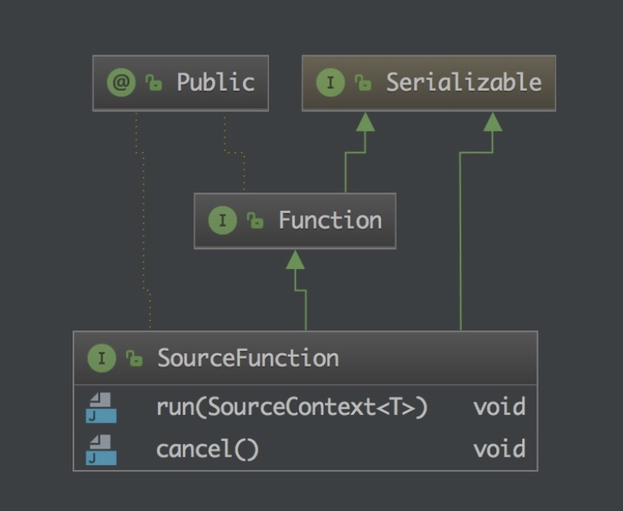
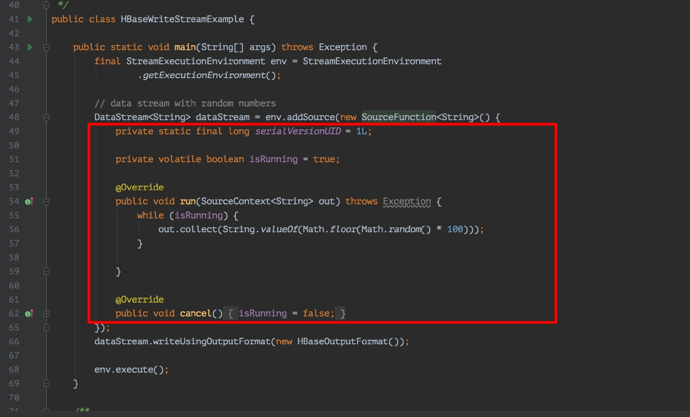

# 数据来源Data Sources

文章来源：[Flink 从 0 到 1 学习 —— 如何自定义 Data Source ？](http://www.54tianzhisheng.cn/2018/10/30/flink-create-source/)

Flink 中你可以使用 `StreamExecutionEnvironment.addSource(sourceFunction)` 来为你的程序添加数据来源。

分为以下几类：

### 基于集合

1、fromCollection(Collection) - 从 Java 的 Java.util.Collection 创建数据流。集合中的所有元素类型必须相同。

2、fromCollection(Iterator, Class) - 从一个迭代器中创建数据流。Class 指定了该迭代器返回元素的类型。

3、fromElements(T …) - 从给定的对象序列中创建数据流。所有对象类型必须相同。

```java
StreamExecutionEnvironment env = StreamExecutionEnvironment.getExecutionEnvironment();

DataStream<Event> input = env.fromElements(
	new Event(1, "barfoo", 1.0),
	new Event(2, "start", 2.0),
	new Event(3, "foobar", 3.0),
	...
);
```

4、fromParallelCollection(SplittableIterator, Class) - 从一个迭代器中创建并行数据流。Class 指定了该迭代器返回元素的类型。

5、generateSequence(from, to) - 创建一个生成指定区间范围内的数字序列的并行数据流。

### 基于文件

1、readTextFile(path) - 读取文本文件，即符合 TextInputFormat 规范的文件，并将其作为字符串返回。

```java
final StreamExecutionEnvironment env = StreamExecutionEnvironment.getExecutionEnvironment();

DataStream<String> text = env.readTextFile("file:///path/to/file");
```

2、readFile(fileInputFormat, path) - 根据指定的文件输入格式读取文件（一次）。

3、readFile(fileInputFormat, path, watchType, interval, pathFilter, typeInfo) - 这是上面两个方法内部调用的方法。

它根据给定的 fileInputFormat 和读取路径读取文件。根据提供的 **watchType**，这个 source 可以**定期**（每隔 interval 毫秒）监测给定路径的新数据（FileProcessingMode.PROCESS_CONTINUOUSLY），或者处理一次路径对应文件的数据并退出（FileProcessingMode.PROCESS_ONCE）。**可以通过 pathFilter 进一步排除掉需要处理的文件。**

```java
final StreamExecutionEnvironment env = StreamExecutionEnvironment.getExecutionEnvironment();

DataStream<MyEvent> stream = env.readFile(
        myFormat, myFilePath, FileProcessingMode.PROCESS_CONTINUOUSLY, 100,
        FilePathFilter.createDefaultFilter(), typeInfo);
```

在具体实现上，Flink 把文件读取过程分为两个子任务，即**目录监控和数据读取**。每个子任务都由单独的实体实现。目录监控由单个非并行（并行度为1）的任务执行，而数据读取由并行运行的多个任务执行。后者的并行性等于作业的并行性。单个目录监控任务的作用是扫描目录（根据 watchType 定期扫描或仅扫描一次），查找要处理的文件并把文件分割成切分片（splits），然后将这些切分片分配给下游 reader。reader 负责读取数据。每个切分片只能由一个 reader 读取，但一个 reader 可以逐个读取多个切分片。

### 基于 Socket：

socketTextStream(String hostname, int port) - 从 socket 读取。元素可以用分隔符切分。

```java
StreamExecutionEnvironment env = StreamExecutionEnvironment.getExecutionEnvironment();

DataStream<Tuple2<String, Integer>> dataStream = env
        .socketTextStream("localhost", 9999) // 监听 localhost 的 9999 端口过来的数据
        .flatMap(new Splitter())
        .keyBy(0)
        .timeWindow(Time.seconds(5))
        .sum(1);
```

#### 自定义：

addSource - 添加一个新的 source function。例如，你可以 `addSource(new FlinkKafkaConsumer011<>(…))` 以从 Apache Kafka 读取数据

1、基于集合：有界数据集，更偏向于本地测试用

2、基于文件：适合监听文件修改并读取其内容

3、基于 Socket：监听主机的 host port，从 Socket 中获取数据

4、自定义 addSource：大多数的场景数据都是无界的，会源源不断的过来。

FlinkKafkaConsumerBase 这个基础类，它是 Flink Kafka 消费的最根本的类。

```java
StreamExecutionEnvironment env = StreamExecutionEnvironment.getExecutionEnvironment();

DataStream<KafkaEvent> input = env
		.addSource(
			new FlinkKafkaConsumer011<>(
				parameterTool.getRequired("input-topic"), //从参数中获取传进来的 topic 
				new KafkaEventSchema(),
				parameterTool.getProperties())
			.assignTimestampsAndWatermarks(new CustomWatermarkExtractor()));
```

自定义自己的 Source ，需要去了解一下 SourceFunction 接口。它是所有 stream source 的根接口，它继承自一个标记接口（空接口）Function。



1、run ： 启动一个 source，即对接一个外部数据源然后 emit 元素形成 stream（大部分情况下会通过在该方法里运行一个 while 循环的形式来产生 stream）。

2、cancel ： 取消一个 source，也即将 run 中的循环 emit 元素的行为终止。



自定义数据源:

[Flink 从 0 到 1 学习 —— 如何自定义 Data Source ？](http://www.54tianzhisheng.cn/2018/10/30/flink-create-source/)

代码:

[flink-examples](../icoding/flink-examples)

