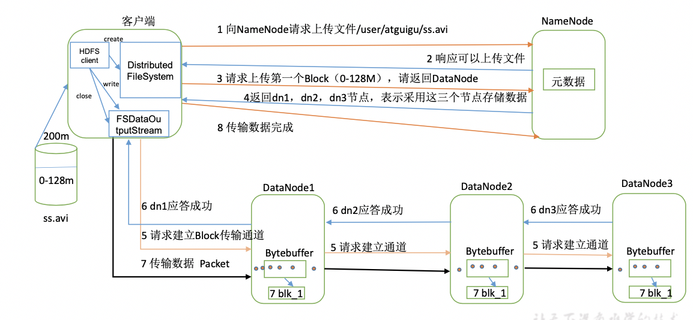
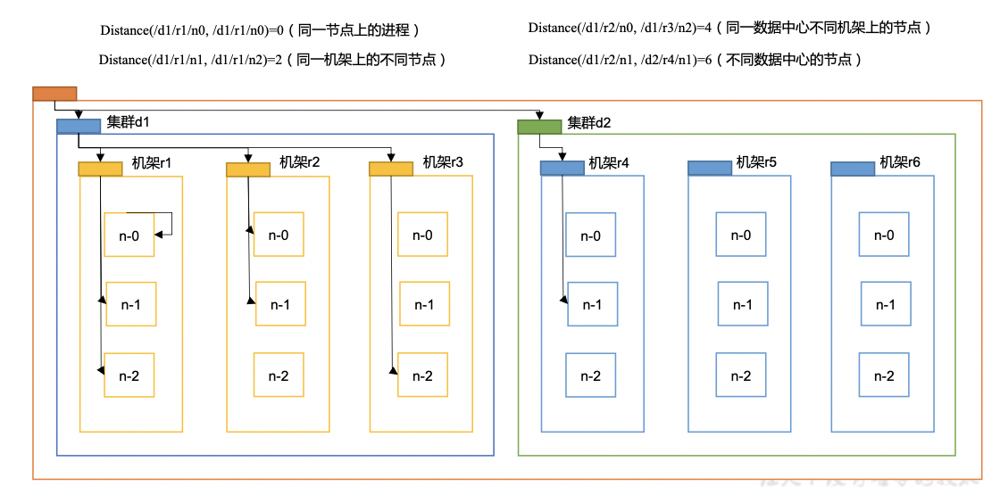
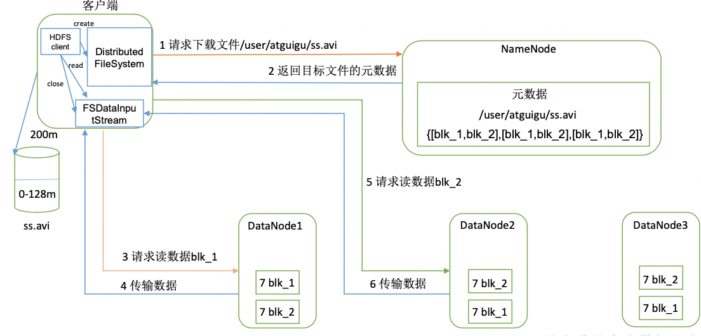
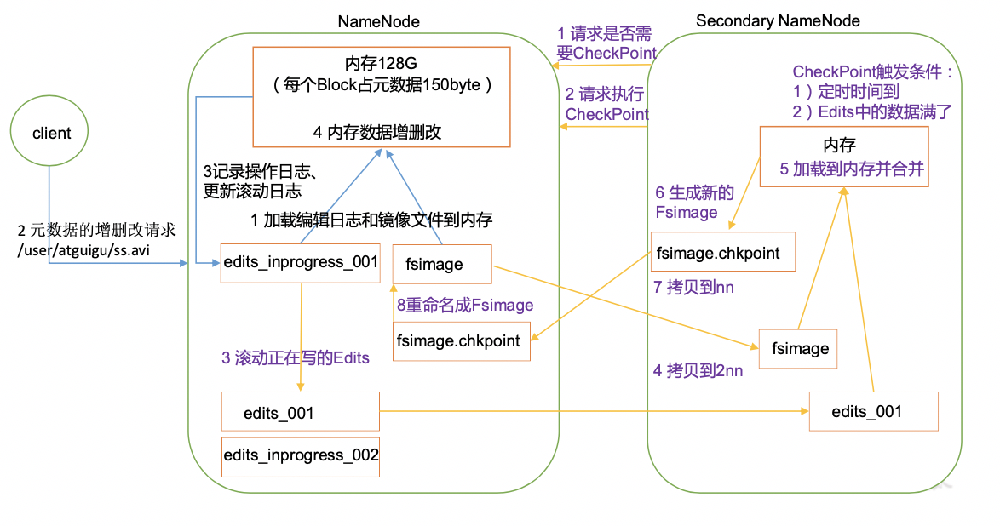
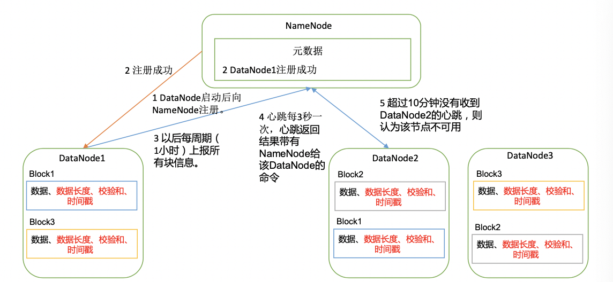
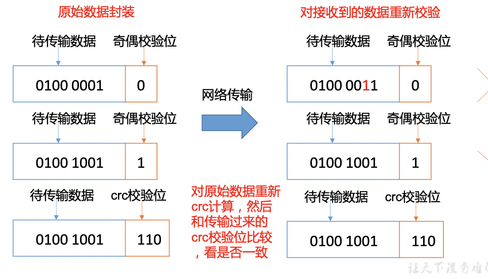
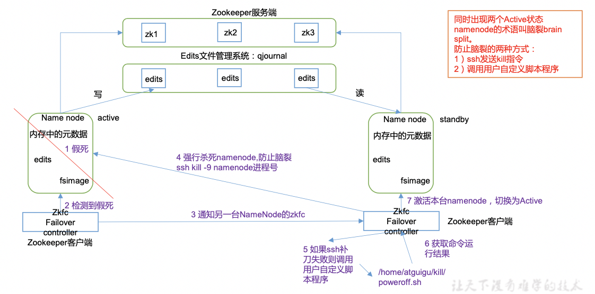

# Hadoop-HDFS

[toc]

## 海量数据

### 求 TopN 

数据量小：先排序，然后limit 3
数据量大：先分区/分桶（把数据先分成多个小的组成部分），
		          每个小的部分都单独计算出来 N 个最大的
			  最终把每个小部分计算出来的 N 个最大的，做最终的汇总
			如果现在有1W张扑克牌。给我找出最大的10张扑克牌

分布式的计算应用程序应该要分成两个阶段：
1、映射阶段； mapper
	一个大文件切分成了多个小文件，可以进行并行计算
2、聚合阶段： reducer
	最重要得到统一的结果，必须要聚合！

### 求交集

​	假如 文件 a 和 文件b 都特别大： 
​	现在求出共同的元素：
​	1、采用的思路依然是分治法
​	2、关键在于怎么分治（随机，范围，Hash散列，....）
​		做Hash散列（行业通用的默认做法）
​		a文件拆分成 10个文件：
​		b文件拆分成10个文件： 
​		a1 和 b1 找共同元素就可以
​		a2 和 b2 找共同元素
​		.....

### 判断元素是否存在

数据量小： 

- java中的hashset

- redis的set

    如果数据量很大：
  		布隆过滤器（更强大的位图算法）
  			实现快速判断一个元素是否存在
  			优点：快速判断（爬虫: url判重）
  			缺点：误判

2、深层次思考：怎么设计一个分布式文件系统解决海量数据的存储问题
               怎么设计一个分布式计算引擎来解决来解决海量数据的计算
	1、HDFS怎么设计呢？
		目的；解决海量数据的存储
		难点? 怎么存，怎么保证安全，要不要实现针对单条记录的增删改查？
			一个服务器节点存储一个大文件存不下，磁盘不够，加磁盘
			但是磁盘不是可以无限制增加的。理论上，一个服务器存不下所以的数据
			加磁盘：纵向扩展
			横向扩展；人多力量大（一个服务器存不下，使用更多的服务器来存储）
			既然要使用很多的服务器去存数据，企业是否有足够的资金来支撑购买这么多服务器呢。
			摩尔定律
			HDFS的要考虑到：这些服务器出现问题是常态，而不是异常
			不要试图通过高昂的硬件来容错，而是通过软件的策略来容错
			架构在廉价的商用机器上

怎么保证数据安全？
			HDFS的设计者采取了一种最简单也是最蠢的方式：
				存一份不够，存多份

2、MapReduce怎么设计呢？
	设计成两个阶段执行：
	1、第一个阶段执行任务拆分和任务并行运行，提高效率
		一车砖头
		100个小伙伴： 100台服务器
	2、第二个阶段, 收取所有并行运行的任务的执行结果执行最终的汇总
		......

任务运行的监控，调度，重试等等，怎么实现呢？
需要一个技术去实现：mapreduce

HBase:  OLTP(刚开始的时候)  OLAP(现在的重点应用) ?
	RDBMS: TP系统

BigTable开源实现：进行倒排索引

## 客户端操作

```java
public class HDFSClient {
    public static void main(String[] args) throws IOException, Exception, URISyntaxException {

        Configuration conf = new Configuration();
        //conf.set("fs.defaultFS", "XXX:9000");

        // 1 获取hdfs客户端对象
        //FileSystem fs = FileSystem.get(conf );
        FileSystem fs = FileSystem.get(new URI("hdfs://XXX:9000"), conf, "wangfulin");

        // 2 在hdfs上创建路径
        fs.mkdirs(new Path("/0521/dashen/banzhang"));

        // 3 关闭资源
        fs.close();

        System.out.println(System.getProperty("java.class.path"));
        System.out.println(System.getProperty("user.dir"));

        System.out.println("over");
    }

    // 1 文件上传
    @Test
    public void testCopyFromLocalFile() throws IOException, InterruptedException, URISyntaxException {

        // 1 获取fs对象
        Configuration conf = new Configuration();
        conf.set("dfs.replication", "0");
        FileSystem fs = FileSystem.get(new URI("hdfs://XXX:9000"), conf, "wangfulin");

        // 2 执行上传API /Users/wangfulin/warehouse/hdfs
        fs.copyFromLocalFile(new Path("/Users/wangfulin/warehouse/hdfs/upload.md"), new Path("/upload2.md"));

        // 3 关闭资源
        fs.close();
    }


    // 2 文件下载
    @Test
    public void testCopyToLocalFile() throws IOException, InterruptedException, URISyntaxException {

        // 1 获取对象
        Configuration conf = new Configuration();
        FileSystem fs = FileSystem.get(new URI("hdfs://XXX:9000"), conf, "wangfulin");

        // 2 执行下载操作
//		fs.copyToLocalFile(new Path("/banhua.txt"), new Path("e:/banhua.txt"));
        fs.copyToLocalFile(false, new Path("/upload1.md"), new Path("/Users/wangfulin/warehouse/hdfs/download.md"), true);

        // 3 关闭资源
        fs.close();
    }

    // 3 文件删除
    @Test
    public void testDelete() throws IOException, InterruptedException, URISyntaxException {

        // 1 获取对象
        Configuration conf = new Configuration();
        FileSystem fs = FileSystem.get(new URI("hdfs://XXX:9000"), conf, "wangfulin");

        // 2 文件删除
        fs.delete(new Path("/0521"), true);

        // 3 关闭资源
        fs.close();
    }

    // 4 文件更名
    @Test
    public void testRename() throws IOException, InterruptedException, URISyntaxException {

        // 1 获取对象
        Configuration conf = new Configuration();
        FileSystem fs = FileSystem.get(new URI("hdfs://XXX:9000"), conf, "wangfulin");

        // 2 执行更名操作
        fs.rename(new Path("/upload1.md"), new Path("/upload1-plus.md"));

        // 3 关闭资源
        fs.close();
    }

    // 5 文件详情查看
    @Test
    public void testListFiles() throws IOException, InterruptedException, URISyntaxException {

        // 1 获取对象
        Configuration conf = new Configuration();
        FileSystem fs = FileSystem.get(new URI("hdfs://XXX:9000"), conf, "wangfulin");

        // 2 查看文件详情
        RemoteIterator<LocatedFileStatus> listFiles = fs.listFiles(new Path("/"), true);

        while (listFiles.hasNext()) {
            LocatedFileStatus fileStatus = listFiles.next();

            // 查看文件名称、权限、长度、块信息
            System.out.println(fileStatus.getPath().getName());// 文件名称
            System.out.println(fileStatus.getPermission());// 文件权限
            System.out.println(fileStatus.getLen());// 文件长度

            BlockLocation[] blockLocations = fileStatus.getBlockLocations();

            for (BlockLocation blockLocation : blockLocations) {

                String[] hosts = blockLocation.getHosts();

                for (String host : hosts) {
                    System.out.println(host);
                }
            }

            System.out.println("------分割线--------");
        }

        // 3 关闭资源
        fs.close();
    }


    // 6 判断是文件还是文件夹
    @Test
    public void testListStatus() throws IOException, InterruptedException, URISyntaxException {

        // 1 获取对象
        Configuration conf = new Configuration();
        FileSystem fs = FileSystem.get(new URI("hdfs://XXX:9000"), conf, "wangfulin");

        // 2 判断操作
        FileStatus[] listStatus = fs.listStatus(new Path("/"));

        for (FileStatus fileStatus : listStatus) {

            if (fileStatus.isFile()) {
                // 文件
                System.out.println("f:" + fileStatus.getPath().getName());
            } else {
                // 文件夹
                System.out.println("d:" + fileStatus.getPath().getName());
            }
        }

        // 3 关闭资源
        fs.close();
    }


    /* -----------IO操作---------*/
    // 把本地文件上传到HDFS根目录
    @Test
    public void putFileToHDFS() throws IOException, InterruptedException, URISyntaxException {

        // 1 获取对象
        Configuration conf = new Configuration();
        FileSystem fs = FileSystem.get(new URI("hdfs://XXX:9000"), conf, "wangfulin");

        // 2 获取输入流
        FileInputStream fis = new FileInputStream(new File("/Users/wangfulin/warehouse/hdfs/upload.md"));

        // 3 获取输出流
        FSDataOutputStream fos = fs.create(new Path("/upload-io.md"));

        // 4 流的对拷
        IOUtils.copyBytes(fis, fos, conf);

        // 5 关闭资源
        IOUtils.closeStream(fos);
        IOUtils.closeStream(fis);
        fs.close();
    }


    // 从HDFS上下载到本地
    @Test
    public void getFileFromHDFS() throws IOException, InterruptedException, URISyntaxException {

        // 1 获取对象
        Configuration conf = new Configuration();
        FileSystem fs = FileSystem.get(new URI("hdfs://XXX:9000"), conf, "wangfulin");

        // 2 获取输入流
        FSDataInputStream fis = fs.open(new Path("/upload-io.md"));

        // 3 获取输出流
        FileOutputStream fos = new FileOutputStream(new File("/Users/wangfulin/warehouse/hdfs/upload-download.md"));

        // 4 流的对拷
        IOUtils.copyBytes(fis, fos, conf);

        // 5 关闭资源
        IOUtils.closeStream(fos);
        IOUtils.closeStream(fis);
        fs.close();
    }

    // 下载第一块
    @Test
    public void readFileSeek1() throws IOException, InterruptedException, URISyntaxException {

        // 1 获取对象
        Configuration conf = new Configuration();
        FileSystem fs = FileSystem.get(new URI("hdfs://XXX:9000"), conf, "wangfulin");

        // 2 获取输入流
        FSDataInputStream fis = fs.open(new Path("/hadoop-2.7.7.tar.gz"));

        // 3 获取输出流
        FileOutputStream fos = new FileOutputStream(new File("/Users/wangfulin/warehouse/hdfs/hadoop-2.7.7.tar.gz.part1"));

        // 4 流的对拷（只拷贝128M）
        byte[] buf = new byte[1024];
        for (int i = 0; i < 1024 * 128; i++) {
            fis.read(buf);
            fos.write(buf);
        }

        // 5 关闭资源
        IOUtils.closeStream(fos);
        IOUtils.closeStream(fis);
        fs.close();
    }

    // 下载第二块
    @SuppressWarnings("resource")
    @Test
    public void readFileSeek2() throws IOException, InterruptedException, URISyntaxException {

        // 1 获取对象
        Configuration conf = new Configuration();
        FileSystem fs = FileSystem.get(new URI("hdfs://XXX:9000"), conf, "wangfulin");

        // 2 获取输入流
        FSDataInputStream fis = fs.open(new Path("/hadoop-2.7.7.tar.gz"));

        // 3 设置指定读取的起点!
        fis.seek(1024 * 1024 * 128);

        // 4 获取输出流
        FileOutputStream fos = new FileOutputStream(new File("/Users/wangfulin/warehouse/hdfs/hadoop-2.7.7.tar.gz.part2"));

        // 5 流的对拷
        IOUtils.copyBytes(fis, fos, conf);

        // 6 关闭资源
        IOUtils.closeStream(fos);
        IOUtils.closeStream(fis);
        fs.close();
    }
}

```

pom.xml

```xml
        <dependency>
            <groupId>junit</groupId>
            <artifactId>junit</artifactId>
            <version>RELEASE</version>
        </dependency>
        <dependency>
            <groupId>org.apache.logging.log4j</groupId>
            <artifactId>log4j-core</artifactId>
            <version>2.8.2</version>
        </dependency>
        <dependency>
            <groupId>org.apache.hadoop</groupId>
            <artifactId>hadoop-common</artifactId>
            <version>2.7.2</version>
        </dependency>
        <dependency>
            <groupId>org.apache.hadoop</groupId>
            <artifactId>hadoop-client</artifactId>
            <version>2.7.2</version>
        </dependency>
        <dependency>
            <groupId>org.apache.hadoop</groupId>
            <artifactId>hadoop-hdfs</artifactId>
            <version>2.7.2</version>
        </dependency>
```


## HDFS的数据流

### HDFS写数据流程

    

- 1）客户端通过Distributed FileSystem模块向NameNode请求上传文件，NameNode检查目标文件是否已存在，父目录是否存在。

- 2）NameNode返回是否可以上传。

- 3）客户端请求第一个 Block上传到哪几个DataNode服务器上。

- 4）NameNode返回3个DataNode节点，分别为dn1、dn2、dn3。

- 5）客户端通过FSDataOutputStream模块请求dn1上传数据，**dn1收到请求会继续调用dn2，然后dn2调用dn3，将这个通信管道建立完成**。

- 6）dn1、dn2、dn3逐级应答客户端。

- 7）客户端开始往dn1上传第一个Block（**先从磁盘读取数据放到一个本地内存缓存**），以Packet为单位，dn1收到一个Packet就会传给dn2，dn2传给dn3；**dn1每传一个packet会放入一个应答队列等待应答。**

- 8）当一个Block传输完成之后，客户端再次请求NameNode上传第二个Block的服务器。（重复执行3-7步）。


### 网络拓扑-节点距离计算

写数据时，NameNode会选择距离待上传数据最近距离的DataNode接收数据。

节点距离：两个节点到达最近的共同祖先的距离总和。



### HDFS读数据流程



- 1）客户端通过Distributed FileSystem向NameNode请求下载文件，NameNode通过查询元数据，找到文件块所在的DataNode地址。

- 2）挑选一台DataNode（**就近原则，然后随机**）服务器，请求读取数据。

- 3）DataNode开始传输数据给客户端（从磁盘里面读取数据输入流，**以Packet为单位**来做校验）。

4）客户端以Packet为单位接收，**先在本地缓存，然后写入目标文件**。


## NameNode和SecondaryNameNode

### NN和2NN工作机制

**磁盘中备份元数据的FsImage。**

**Edits文件(只进行追加操作，效率很高)。每当元数据有更新或者添加元数据时，修改内存中的元数据并追加到Edits中。**

**节点SecondaryNamenode，专门用于FsImage和Edits的合并。**



- 1. 第一阶段：NameNode启动

（1）第一次启动NameNode格式化后，**创建Fsimage和Edits文件**。如果不是第一次启动，直接加载编辑日志和镜像文件到内存。

（2）客户端对元数据进行增删改的请求。

（3）NameNode记录操作日志，更新滚动日志。

（4）NameNode在内存中对数据进行增删改。

- 2. 第二阶段：Secondary NameNode工作

​    （1）Secondary NameNode询问NameNode是否需要CheckPoint。直接带回NameNode是否检查结果。

​    （2）Secondary NameNode请求执行CheckPoint。

​    （3）NameNode滚动正在写的Edits日志。

​    （4）**将滚动前的编辑日志和镜像文件拷贝到Secondary NameNode。**

​    （5）**Secondary NameNode加载编辑日志和镜像文件到内存，并合并。**

​    （6）生成新的镜像文件fsimage.chkpoint。

​    （7）拷贝fsimage.chkpoint到NameNode。

​    （8）**NameNode将fsimage.chkpoint重新命名成fsimage。**

#### NN和2NN工作机制详解

**Fsimage**：NameNode内存中元数据序列化后形成的文件。

**Edits**：记录客户端更新元数据信息的每一步操作（可通过Edits运算出元数据）。

NameNode启动时，先滚动Edits并生成一个空的edits.inprogress，然后加载Edits和Fsimage到**内存**中，此时NameNode内存就持有最新的元数据信息。Client开始对NameNode发送元数据的**增删改**的请求，这些**请求的操作首先会被记录到edits.inprogress中**（查询元数据的操作不会被记录在Edits中，因为查询操作不会更改元数据信息），如果此时NameNode挂掉，重启后会从Edits中读取元数据的信息。然后，NameNode会在内存中执行元数据的增删改的操作。

由于Edits中记录的操作会越来越多，Edits文件会越来越大，导致NameNode在启动加载Edits时会很慢，所以需要对Edits和Fsimage进行合并（所谓合并，就是**将Edits和Fsimage加载到内存中，照着Edits中的操作一步步执行，最终形成新的Fsimage**）。**SecondaryNameNode的作用就是帮助NameNode进行Edits和Fsimage的合并工作。**

SecondaryNameNode首先会询问NameNode是否需要CheckPoint（触发CheckPoint需要满足两个条件中的任意一个，**定时时间到和Edits中数据写满了**）。直接带回NameNode是否检查结果。SecondaryNameNode执行CheckPoint操作，首先会**让NameNode滚动Edits并生成一个空的edits.inprogress，滚动Edits的目的是给Edits打个标记，以后所有新的操作都写入edits.inprogress，**其他未合并的Edits和Fsimage会拷贝到SecondaryNameNode的本地，然后将拷贝的Edits和Fsimage加载到内存中进行合并，生成fsimage.chkpoint，然后**将fsimage.chkpoint拷贝给NameNode，重命名为Fsimage后替换掉原来的Fsimage。**NameNode在启动时就只需要加载之前未合并的Edits和Fsimage即可，因为合并过的Edits中的元数据信息已经被记录在Fsimage中。


###  Fsimage和Edits解析

### NameNode故障处理

NameNode故障后，可以采用如下两种方法恢复数据。

**方法一：将SecondaryNameNode**中数据拷贝到NameNode存储数据的目录；

- 1. kill -9 NameNode进程

- 2. 删除NameNode存储的数据（/opt/module/hadoop-2.7.2/data/tmp/dfs/name）

```shell
[atguigu@hadoop102 hadoop-2.7.2]$ rm -rf /opt/module/hadoop-2.7.2/data/tmp/dfs/name/*
```

- 3. 拷贝SecondaryNameNode中数据到原NameNode存储数据目录

```shell
[atguigu@hadoop102 dfs]$ scp -r atguigu@hadoop104:/opt/module/hadoop-2.7.2/data/tmp/dfs/namesecondary/* ./name/
```

- 4. 重新启动NameNode

```shell
[atguigu@hadoop102 hadoop-2.7.2]$ sbin/hadoop-daemon.sh start namenode
```

**方法二：使用-importCheckpoint**选项启动NameNode守护进程，从而将SecondaryNameNode中数据拷贝到NameNode目录中。

- 1. 修改hdfs-site.xml中的

```xml
<property>

 <name>dfs.namenode.checkpoint.period</name>

 <value>120</value>

</property>

<property>

 <name>dfs.namenode.name.dir</name>

 <value>/opt/module/hadoop-2.7.2/data/tmp/dfs/name</value>

</property>
```

- 2. kill -9 NameNode进程

- 3. 删除NameNode存储的数据（/opt/module/hadoop-2.7.2/data/tmp/dfs/name）

```shell
[atguigu@hadoop102 hadoop-2.7.2]$ rm -rf /opt/module/hadoop-2.7.2/data/tmp/dfs/name/*
```

- 4. 如果SecondaryNameNode不和NameNode在一个主机节点上，需要将SecondaryNameNode存储数据的**目录**拷贝到NameNode存储数据的**平级目**录，并删除in_use.lock文件

```shell
[atguigu@hadoop102 dfs]$ scp -r atguigu@hadoop104:/opt/module/hadoop-2.7.2/data/tmp/dfs/namesecondary ./
[atguigu@hadoop102 namesecondary]$ rm -rf in_use.lock

[atguigu@hadoop102 dfs]$ pwd

/opt/module/hadoop-2.7.2/data/tmp/dfs

[atguigu@hadoop102 dfs]$ ls

data name namesecondary
```

- 5. 导入检查点数据（等待一会ctrl+c结束掉）

```shell
[atguigu@hadoop102 hadoop-2.7.2]$ bin/hdfs namenode -importCheckpoint
```

- 6. 启动NameNode

```shell
[atguigu@hadoop102 hadoop-2.7.2]$ sbin/hadoop-daemon.sh start namenode
```


## DataNode

### DataNode工作机制



- 1）一个数据块在DataNode上以文件形式存储在磁盘上，包括两个文件，一个是数据本身，一个是元数据包括数据块的长度，块数据的校验和，以及时间戳。

- 2）DataNode启动后向NameNode注册，通过后，周期性（1小时）的向NameNode上报所有的块信息。

- 3）心跳是每3秒一次，心跳返回结果带有NameNode给该DataNode的命令如复制块数据到另一台机器，或删除某个数据块。如果**超过10分钟没有收到某个DataNode的心跳，则认为该节点不可用**。

- 4）集群运行中可以安全加入和退出一些机器。

### 数据完整性

DataNode节点保证数据完整性的方法。

1）当DataNode读取Block的时候，它会计算CheckSum。

2）如果计算后的CheckSum，与Block创建时值不一样，说明Block已经损坏。

3）Client读取其他DataNode上的Block。

4）DataNode在其文件创建后**周期验证CheckSum**



## HDFS HA高可用

### HDFS-HA工作机制

通过双NameNode消除单点故障

### HDFS-HA工作要点

- 1. 元数据管理方式需要改变

  **内存中各自保存一份元数据**；

  Edits日志**只有Active状态**的NameNode节点可以做写操作；

  两个NameNode都可以读取Edits；

  共享的Edits放在一个共享存储中管理（qjournal和NFS两个主流实现）；

- 2. 需要一个状态管理功能模块

  实现了一个zkfailover，常驻在每一个namenode所在的节点，**每一个zkfailover负责监控自己所在NameNode节点**，**利用zk进行状态标识**，当需要进行状态切换时，由zkfailover来负责切换，切换时需要防止brain split现象的发生。

- 3. **必须保证两个NameNode之间能够ssh无密码登录**

- 4. 隔离（Fence），即**同一时刻仅仅有一个NameNode对外提供服务**

### HDFS-HA自动故障转移工作机制

自动故障转移为HDFS部署增加了两个新组件：**ZooKeeper和ZKFailoverController（ZKFC）进程**。**ZooKeeper是维护少量协调数据，通知客户端这些数据的改变和监视客户端故障的高可用服务**。HA的自动故障转移依赖于ZooKeeper的以下功能：

- 1）**故障检测**：集群中的每个NameNode在ZooKeeper中维护了一个持久会话，如果机器崩溃，ZooKeeper中的会话将终止，**ZooKeeper通知另一个NameNode需要触发故障转移**。

- 2）**现役NameNode选择**：ZooKeeper提供了一个简单的机制用于唯一的选择一个节点为active状态。如果目前现役NameNode崩溃，另一个节点可能**从ZooKeeper获得特殊的排外锁以表明它应该成为现役NameNode。**

  

  ZKFC是自动故障转移中的另一个新组件，是ZooKeeper的客户端，也监视和管理NameNode的状态。每个运行NameNode的主机也运行了一个ZKFC进程，ZKFC负责：

- 1）**健康监测**：ZKFC使用一个健康检查命令**定期地ping与之在相同主机的NameNode**，只要该NameNode及时地回复健康状态，ZKFC认为该节点是健康的。如果该节点崩溃，冻结或进入不健康状态，健康监测器标识该节点为非健康的。

- 2）**ZooKeeper会话管理**：当本地NameNode是健康的，ZKFC保持一个在ZooKeeper中打开的会话。如果本地NameNode处于active状态，ZKFC也保持一个特殊的znode锁，该锁使用了ZooKeeper对短暂节点的支持，如果会话终止，锁节点将自动删除。

- 3）**基于ZooKeeper的选择**：如果本地NameNode是健康的，且ZKFC发现没有其它的节点当前持有znode锁，它将为自己获取该锁。如果成功，则它已经赢得了选择，并负责运行故障转移进程以使它的本地NameNode为Active。故障转移进程与前面描述的手动故障转移相似，首先如果必要保护之前的现役NameNode，然后本地NameNode转换为Active状态。




