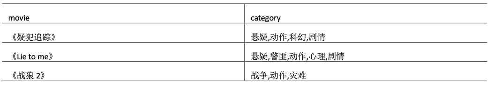
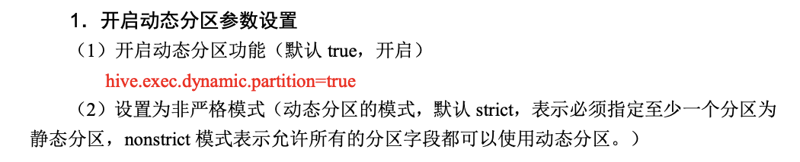

## Hive

[toc]

### Hive基本概念

Hive:由 Facebook 开源用于解决海量结构化日志的数据统计。

Hive 是基于 Hadoop 的一个数据仓库工具，可以将结构化的数据文件映射为一张表，并 提供类 SQL 查询功能。

**本质是:将 HQL 转化成 MapReduce 程序**


1)Hive 处理的数据存储在 HDFS

2)Hive 分析数据底层的默认实现是 MapReduce

3)执行程序运行在 Yarn 上

SQL    driver     compiler     AST  抽象语法树      解析树      QueryBlock  独立执行的子查询     

 解析树 ---> logic plan逻辑执行执行 optimizer 优化器  物化：物理执行计划 executor  把物理执行计划进行提交

#### 分隔符

要在创建表的时候 告诉hive数据中的列分隔符和行分隔符，hive就可以解析数据 

Hive的默认列分隔符:控制符 Ctrl + A，\x01 

Hive的默认行分隔符:换行符 \n 

Hive的默认集合分隔符:Ctrl + B 

Hive的默认key-value之间的分隔符:Ctrl + C 

#### hive中的数据模型 

database :数据库 

table :数据表 

managed table:内建表，管理表。

 external table ：外建表，与table类似，不过数据可以存放的位置可以是hdfs上的任意位置 

partition table:分区表，在hdfs中表现为table目录下的子目录 

bucket table ：分桶表，在hdfs中表现为同一个表或者分区下根据某个字段的值进行hash散列之后的多个文件，其中，一个文件便是一个分桶。

#### hive表的类型

managed内部表、external外部表、partition分区表、bucket分桶表。 

内部表和外部表的区别：删除内部表，会删除元数据和表数据，删除外部表，会删除元数据，不会删除表数据。 

内部表和外部表的选择：如果数据的所有处理都是在hive中进行，适合建内部表，如果hive和其他工具需要针对相同的数据集进行处理，外部表合适。 

### Hive 的优缺点

#### 优点

1. 操作接口采用**类 SQL 语法**，提供快速开发的能力(简单、容易上手)。
2.  避免了去写 MapReduce，减少开发人员的学习成本。
3. **Hive 的执行延迟比较高**，因此 Hive 常用于数据分析，对实时性要求不高的场合。
4. Hive 优势在于处理大数据，对于处理小数据没有优势，因为 Hive 的执行延迟比较高。
5. Hive **支持用户自定义函数**，用户可以根据自己的需求来实现自己的函数。

#### 缺点

1.Hive 的 HQL 表达能力有限

- (1)迭代式算法无法表达

- (2)数据挖掘方面不擅长

2.Hive 的效率比较低

- (1)Hive 自动生成的 MapReduce 作业，通常情况下不够智能化

- (2)Hive 调优比较困难，粒度较粗

### Hive 架构原理


1.用户接口:Client

​		CLI(hive shell)、JDBC/ODBC(java 访问 hive)、WEBUI(浏览器访问 hive)

 2.元数据:Metastore

​		元数据包括:表名、表所属的数据库(默认是 default)、表的拥有者、列/分区字段、表的类型(是否是外部表)、表的数据所在目录等;**默认存储在自带的 derby 数据库中，推荐使用 MySQL 存储 Metastore**

3.Hadoop

​		使用 HDFS 进行存储，使用 MapReduce 进行计算。 

4.驱动器:Driver

- (1) 解析器(SQL Parser):将 SQL 字符串转换成**抽象语法树 AST**，这一步一般都用 第三方工具库完成，比如 antlr;对 AST 进行语法分析，比如表是否存在、字段是否存在、SQL语义是否有误。
- (2) 编译器(Physical Plan):将 AST 编译生成逻辑执行计划。
- (3) 优化器(Query Optimizer):对逻辑执行计划进行优化。

- (4) 执行器(Execution):把逻辑执行计划转换成可以运行的物理计划。对于 Hive 来 说，就是 MR/Spark。


​		Hive 通过给用户提供的一系列交互接口，接收到用户的指令(SQL)，使用自己的 Driver，

​		结合元数据(MetaStore)，将这些指令翻译成 MapReduce，提交到 Hadoop 中执行，最后，将执行返回的结果输出到用户交互接口。

​		数据仓库的内容是读多写少的。因此，Hive 中不建议对数据的改写，所有的数据都是在加载的时候确定好的。

​		Hive 要访问数据中满足条件的特定值时，需要暴力扫描整个数据，因此访问延迟较高。由于 MapReduce 的引入， Hive 可以并行访问数据，因 此即使没有索引，对于大数据量的访问，Hive 仍然可以体现出优势。

#### hive配置

hive的参数的指定方式其实有三种：
1、也可以在hive-site.xml中配置。
2、进入hive shell客户端之前， hive -hiveconf key=value
3、进入之后：
	hive > set key=value;


如果以上三种方式都进行了配置，请问，到底最后那种生效？优先级是什么?
1 < 2 < 3 

按照生效顺序；
1 > 2 > 3

### 启动hive

遇到

Could not create ServerSocket on address 0.0.0.0/0.0.0.0:9083

jps


kill -9 PID

删除所有的RunJar

之后再运行`hive --service metastore &` 

新开一个窗口运行 hive


**为初始化原始表，可能会出现很多问题，可以参考：**

https://www.cnblogs.com/zwgblog/p/6063993.html

### Hive基本操作

```
(1)启动 hive

bin/hive

(2)查看数据库
 hive> show databases;

(3)打开默认数据库 hive> use default;

(4)显示 default 数据库中的表 hive> show tables;

(5)创建一张表
 hive> create table student(id int, name string);

(6)显示数据库中有几张表 hive> show tables;

(7)查看表的结构
 hive> desc student;

(8)向表中插入数据
 hive> insert into student values(1000,"ss");

(9)查询表中数据
 hive> select * from student;

(10)退出 hive hive> quit;
```

#### 将本地文件导入Hive 案例

创建 student 表, 并声明文件分隔符’\t’

```sql
hive> create table student(id int, name string) ROW FORMAT DELIMITED FIELDS TERMINATED
BY '\t';
```

加载/opt/module/data/student.txt 文件到 student 数据库表中。

```sql
hive> load data local inpath '/opt/module/data/student.txt' into table student;
```

#### 参数配置方式 

1.查看当前所有的配置信息

```sql
hive>set;
```

2.参数的配置三种方式

- (1)配置文件方式

```shell
[atguigu@hadoop102 conf]$ pwd
 /opt/module/hive/conf
 [atguigu@hadoop102 conf]$ mv hive-log4j.properties.template hive-log4j.properties
```

默认配置文件:hive-default.xml
​用户自定义配置文件:**hive-site.xml** 注意:用户自定义配置会覆盖默认配置。

另外，Hive 也会读入 Hadoop 的配置，因为 Hive 是作为 Hadoop 的客户端启动的，**Hive 的配置会覆盖Hadoop 的配置**。配置文件的设定对本机启动的所有 Hive 进程都有效。

- (2) 命令行参数方式

启动 Hive 时，可以在命令行添加-hiveconf param=value 来设定参数。 例如:

注意:仅对本次 hive 启动有效 查看参数设置:

```
hive (default)> set mapred.reduce.tasks;
```

- (3)参数声明方式

可以在 HQL 中使用 SET 关键字设定参数

例如:

```sql
hive (default)> set mapred.reduce.tasks=100;
```

注意: 仅对本次 hive 启动有效。 查看参数设置

**hive (default)> set mapred.reduce.tasks;**

上述三种设定方式的优先级依次递增。即

配置文件<命令行参数<参数声明。

注意某些系统级的参数，例如 log4j 相关的设定，必须用前两种方式设定，因为那些参数的读取在会话建立以前已经完成了。

### Hive数据类型


​		对于 Hive 的 String 类型相当于数据库的 varchar 类型，该类型是一个可变的字符串，不过它不能声明其中最多能存储多少个字符，理论上它可以存储 2GB 的字符数。

#### 集合数据类型


​		Hive 有三种复杂数据类型 ARRAY、MAP 和 STRUCT。ARRAY 和 MAP 与 Java 中的 Array 和 Map 类似，而 STRUCT 与 C 语言中的 Struct 类似，它封装了一个命名字段集合， 复杂数据类型允许任意层次的嵌套。

```sql
create table test(
    name string,
    friends array<string>,
    children map<string, int>,
    address struct<street:string, city:string> )
    row format delimited
    fields terminated by ',' 
    collection items terminated by '_' // 集合里的多个元素，用的是_这个分隔符
    map keys terminated by ':'
    lines terminated by '\n';
)
```

字段解释:

```sql
row format delimited fields terminated by ',' -- 列分隔符

collection items terminated by '_'  --MAP STRUCT 和 ARRAY 的分隔符(数据分割符号)

map keys terminated by ':' -- MAP 中的 key 与 value 的分隔符

lines terminated by '\n';  -- 行分隔符
```

##### array

数据:table_array.txt

```
huangbo-beijing,shanghai,tianjin,hangzhou
xuzheng-changchu,chengdu,wuhan
wangbaoqiang-dalian,shenyang,jilin 	
```

建表语句:

```sql
create table table_array(name string, work_locations array<string>) 
row format delimited fields terminated by '-'  
collection items terminated by ','; 								
```

导入数据:

```sql
load data local inpath '/home/bigdata/table_array.txt' into table table_array;
```

##### map

数据:table_map.txt

```
huangbo-yuwen:80,shuxue:89,yingyu:95
xuzheng-yuwen:70,shuxue:65,yingyu:81
wangbaoqiang-yuwen:75,shuxue:100,yingyu:75
```

导入数据:

```sql
load data local inpath '/home/bigdata/table_map.txt' into table table_map;
```

##### struct

数据:table_struct.txt

```
1-english,80,3.3 
2-math,89,3.9 
3-chinese,95,4.7
```

建表语句:

```sql
create table table_struct(id int, course struct<name:string, score:int, jidian:float>)
row format delimited fields terminated by '-'
collection items terminated by ',';
```

#### 类型转化

​		Hive 的原子数据类型是可以进行隐式转换的，类似于 Java 的类型转换，例如某表达式使用 INT 类型，TINYINT会自动转换为 INT 类型，但是 Hive 不会进行反向转化，例如，某表达式使用TINYINT类型，INT 不会自动转换为TINYINT类型，它会返回错误，除非使用CAST操作。(可以小到大，不能大到小)

1.隐式类型转换规则如下 

- 任何整数类型都可以隐式地转换为一个范围更广的类型，如 TINYINT 可以转换成 INT，INT 可以转换成 BIGINT。

- 所有整数类型、FLOAT 和 STRING 类型都可以隐式地转换成DOUBLE。

- TINYINT、SMALLINT、INT 都可以转换为 FLOAT。

- BOOLEAN 类型不可以转换为任何其它的类型。

  2.可以使用 CAST 操作显示进行数据类型转换
   例如 CAST('1' AS INT)将把字符串'1' 转换成整数 1;如果强制类型转换失败，如执行CAST('X' AS INT)，表达式返回空值 NULL。

### Hive语法操作 

1、DDL	定义 create drop alter  

2、DML	操纵 insert (导出，导入) (update delete ) load 

3、DQL	查询 select 

4、DCL   访问控制 添加用户，赋予权限

### DDL

1)创建一个数据库，数据库在 HDFS 上的默认存储路径是/user/hive/warehouse/*.db。

```sql
hive (default)> create database db_hive;
```

2)避免要创建的数据库已经存在错误，增加 if not exists 判断。(标准写法)

```sql
create database if not exists db_hive;
```

3)创建一个数据库，指定数据库在 HDFS 上存放的位置

```sql
 hive (default)> create database db_hive2 location '/db_hive2.db';
```

#### 查询数据库

```
// 查看数据库
show databases;
// 查看什么名字命名类似的数据库
show databases like 'db_hive'

// 查看某个数据库详情
desc database extended db_hive;
```

​		用户可以使用 ALTER DATABASE 命令为某个数据库的 DBPROPERTIES 设置键-值对 属性值，来描述这个数据库的属性信息。**数据库的其他元数据信息都是不可更改的，包括数 据库名和数据库所在的目录位置。**

```sql
alter database hive set dbproperties('createtime'='20170830');
```

```sql
// 删除数据库
drop database db_hive2;
drop database if exists db_hive2;
```

#### 建表

1.建表

```sql
## CREATE TABLE 创建一个指定名字的表。如果相同名字的表已经存在，则抛出异常;用户可以用 IFNOTEXISTS 选项来忽略这个异常
CREATE [EXTERNAL] TABLE [IF NOT EXISTS] table_name
[(col_name data_type [COMMENT col_comment], ...)]
[COMMENT table_comment]
[PARTITIONED BY (col_name data_type [COMMENT col_comment], ...)] [CLUSTERED BY (col_name, col_name, ...)
[SORTED BY (col_name [ASC|DESC], ...)] INTO num_buckets BUCKETS]
[ROW FORMAT row_format]
[STORED AS file_format]
[LOCATION hdfs_path]
```

2.字段解释说明

- CREATE TABLE 创建一个指定名字的表。如果相同名字的表已经存在，则抛出异常;用户可以用 IFNOTEXISTS 选项来忽略这个异常
- EXTERNAL 关键字可以让用户**创建一个外部表**，在建表的同时指定一个指向实际 数据的路径(LOCATION)，Hive 创建内部表时，会将数据移动到数据仓库指向的路径;若创建外部表仅记录数据所在的路径，不对数据的位置做任何改变。在删除表的 时候，内部表的元数据和数据会被一起删除，**而外部表只删除元数据，不删除数据**。 
- COMMENT:为表和列添加注释。
- PARTITIONED BY 创建分区表
- CLUSTERED BY 创建分桶表
- SORTED BY 不常用
- ROW FORMAT：

```
DELIMITED [FIELDS TERMINATED BY char] [COLLECTION ITEMS TERMINATED BY char]

[MAP KEYS TERMINATED BY char] [LINES TERMINATED BY char]
 | SERDE serde_name [WITH SERDEPROPERTIES (property_name=property_value,

property_name=property_value, ...)]
```

 	用户在建表的时候可以自定义 SerDe 或者使用自带的 SerDe。如果没有指定 ROW FORMAT 或者 ROW FORMAT DELIMITED，将会使用自带的 SerDe。在建表的时候，用户还需要为表指定列，用户在指定表的列的同时也会指定自定义的 SerDe，Hive 通过 SerDe 确定表的具体的列的数据。SerDe 是 Serialize/Deserilize 的简称，目的是用于序列化和反序列化。

- STORED AS **指定存储文件类型**,常用的存储文件类型:SEQUENCEFILE(二进制序列文件)、TEXTFILE(文本)、 RCFILE(列式存储格式文件)
   如果文件数据是纯文本，可以使用 STORED AS TEXTFILE。如果数据需要压缩， 使用 STORED AS SEQUENCEFILE。

- LOCATION :指定表在 HDFS 上的存储位置。 
- LIKE 允许用户复制现有的表结构，但是不复制数据

实例：

```sql
create table if not exists student2(
id int, name string
)
row format delimited fields terminated by '\t' -- 按\t分隔行
stored as textfile  # 保存类型
location '/user/hive/warehouse/student2'; -- 存储地址
```

```
LINES: "\n" 换行符 
FIELDS:"\t" 字段分隔符 
COLLECTION ITEMS:","集合元素分隔符 
MAP KEYS:":", map中的一个key-value之间的key和value的分隔符 
```

```sql
create table page_view (id int,userId bigint,page_url) 
comment 'first hive table' -- 注释
partitioned by (partition_day date)   -- 分区
clusted by(userId) sort by(id) into 10 buckets  -- 分桶
row format delimited fields terminated by '\t'  -- 行中字段分隔符
collection item terminated by ',',  -- 集合分隔符号 array
map keys terminated by '\n'     -- map集合分隔符
LINES TERMINATED BY '\n'        -- 换行符
stored as textfile -- 存储格式
location '/myhive';
```

SERDE 形式为:序列化组件，就是一种解析数据的方式，非切割方式，比如正则

```sql
SERDE serde_name [WITH SERDEPROPERTIES (property_name=property_value, property_name=property_value, ...)]
```

STORED AS TEXTFILE | SEQUENCEFILE | RCFILE | PARQUETFILE

如果文件数据是纯文本，可以使用 STORED AS TEXTFILE，默认也是TextFile格式，可以通过执行 命令:

```sql
set hive.default.fileformat;
```

进行查看
如果数据需要压缩，使用 STORED AS SEQUENCEFILE。支持的数据格式有:SequenceFile， RCFile，PaquetFile 等
LOCATION：
如果创建内部表请最好不要指定location，就存储在默认的仓库路径 如果创建表时要指定location，请创建外部表。
LIKE：允许用户复制现有的表结构，但是不复制数据。

```sql
create table tableA like tableB 
```

创建一张tableA空表复制tableB的结构

内部表:

```
create table student_mng (id int, name string, sex string, age int, department string) 
row format delimited fields terminated by ',' 
stored as textfile;
```

外部表

```
create external table student_ext (id int , name string, sex string, age int, department string)
row format delimited fields terminated by '','
location '/myhive';
```

因为表是外部表，所以 Hive 并非认为其完全拥有这份数据。**删除该表并不会删除掉这 份数据，不过描述表的元数据信息会被删除掉。**

分区表

```
create table student_ptn(id int, name string, sex string, age int, department
string) 
partitioned by(city string) row format delimited fields terminated by',' 
stored as textfile;
```

分桶表

```
create table student_ptn(id int, name string, sex string, age int, department string)
clustered by(department) stored by(age desc) int 4 buckets
row format fields terminated by ',';
```


#### 管理表和外部表的使用场景

每天将收集到的网站日志定期流入 HDFS 文本文件。在外部表(原始日志表)的基础

上做大量的统计分析，用到的中间表、结果表使用内部表存储，数据通过 SELECT+INSERT 进入内部表。

实例

```sql
## 部门表
create external table if not exists dept( 
  deptno int,
  dname string,
  loc int
)
row format delimited fields terminated by '\t';

10	ACCOUNTING	1700
20	RESEARCH	1800
30	SALES	1900
40	OPERATIONS	1700

## 员工表
create external table if not exists emp (
  empno int,
  ename string,
  job string,
  mgr int,
  hiredate string,
  sal double,
  deptno int)
row format delimited fields terminated by '\t';

7369	SMITH	CLERK	7902	1980-12-17	800.00		20
7499	ALLEN	SALESMAN	7698	1981-2-20	1600.00	300.00	30
7521	WARD	SALESMAN	7698	1981-2-22	1250.00	500.00	30
7566	JONES	MANAGER	7839	1981-4-2	2975.00		20
7654	MARTIN	SALESMAN	7698	1981-9-28	1250.00	1400.00	30
7698	BLAKE	MANAGER	7839	1981-5-1	2850.00		30
7782	CLARK	MANAGER	7839	1981-6-9	2450.00		10
7788	SCOTT	ANALYST	7566	1987-4-19	3000.00		20
7839	KING	PRESIDENT		1981-11-17	5000.00		10
7844	TURNER	SALESMAN	7698	1981-9-8	1500.00	0.00	30
7876	ADAMS	CLERK	7788	1987-5-23	1100.00		20
7900	JAMES	CLERK	7698	1981-12-3	950.00		30
7902	FORD	ANALYST	7566	1981-12-3	3000.00		20
7934	MILLER	CLERK	7782	1982-1-23	1300.00		10
```

```sql
-- 导入数据
load data local inpath '/Users/wangfulin/bigdata/data/hive/dept.txt' into table default.dept;
load data local inpath '/Users/wangfulin/bigdata/data/hive/emp.txt' into table default.emp;
-- 查看表格式化数据
desc formatted dept;
```

管理表与外部表的互相转换

```
# 修改内部表 student2 为外部表
alter table student2 set tblproperties('EXTERNAL'='TRUE');
# 修改外部表 student2 为内部表
alter table student2 set tblproperties('EXTERNAL'='FALSE');
```

#### 修改表

重命名

```
alter table table_name rename to new_table_name
```

修改表属性

```
// 语法
ALTER TABLE table_name SET TBLPROPERTIES table_properties; table_properties: (property_name = property_value, property_name = property_value, ... )
// 实例
ALTER TABLE table_name SET TBLPROPERTIES ('comment' = 'my new students table');
```

增加/删除/改变/替换字段

```
// 语法结构(注意:ADD是代表新增一字段，字段位置在所有列后面(partition列前)，REPLACE则是表示 替换表中所有字段)
ALTER TABLE name ADD COLUMNS (col_spec[, col_spec ...])
ALTER TABLE name CHANGE c_name new_name new_type [FIRST|AFTER c_name]
ALTER TABLE name REPLACE COLUMNS (col_spec[, col_spec ...])
// 实例
alter table student add columns(course string);
alter table student change column id ids int;
alter table student replace columns(id int, name string, address string);
```

修改分区

```
// 语法结构
ALTER TABLE table_name ADD [IF NOT EXISTS] partition_spec [ LOCATION 'location1' ] partition_spec [ LOCATION 'location2' ] ...
// 语法结构
partition_spec
: PARTITION (partition_col1 = partition_col_value1, partition_col2 = partiton_col_value2, ...)
// 实例
ALTER TABLE student_ptn ADD partition(part='a') partition(part='b'); ALTER TABLE student_ptn ADD IF NOT EXISTS partition(part='bb') location '/myhive_bb' partition(part='cc') location '/myhive_cc';
ALTER TABLE student_ptn partition (part='bb') SET location '/myhive_bbbbb';
// 修改分区路径
```

删除分区

```
// 语法结构
ALTER TABLE table_name DROP partition_spec, partition_spec, ...
// 实例
ALTER TABLE student_ptn DROP if exists partition(part='aa'); 
ALTER TABLE student_ptn DROP if exists partition(part='aa')
                             if exists partition(part='bb');
// 实例
alter table student_ptn partition (part='aa') enable no_drop; // 防止分区被删除
alter table student_ptn partition (part='aa') enable offline; // 防止分区被查询
```

删除表
drop table [if exists] table_name;
实例
drop table if exists student;

清空表

```
语法结构
TRUNCATE TABLE table_name [PARTITION partition_spec];
实例:
truncate table student; // 清空表
truncate table student_ptn partition(city=’beijing’);  // 清空表的city=beijing分区
```

### DML

#### 数据导入

##### load方式装载数据

1. 语法

```sql
hive> load data [local] inpath 'filepath' [overwrite] | into table student [partition (partcol1=val1,...)];
```

(1) load data:表示加载数据

(2) local:表示从本地加载数据到 hive 表;否则从 HDFS 加载数据到 hive 表 

(3) inpath:表示加载数据的路径

(4) FilePath:相对路径，例如:project/data1. 绝对路径，例如:/user/home/project/data1包含模式的完整 URI，列如:hdfs://namenode_host:9000/user/home/project/data1 

注意:inpath子句中的文件路径下，不能再有文件夹。

(5) overwrite:表示覆盖表中已有数据，否则表示追加

(6) into table:表示加载到哪张表

(7) student:表示具体的表

(8) partition:表示上传到指定分区

2. 实操

加载本地相对路径数据：

```sql
load data local inpath "./student.txt" into table student;
```

加载本地绝对路径数据

```sql
load data local inpath "/home/bigdata/student.txt" into table student;
```

使用HDFS的shell命令直接往Hive的student表中的HDFS目录导入数据

```sql
hadoop fs -put student.txt /user/hive/warehouse/hive_test.db/student/
```

加载HDFS上完整模式数据

```sql
load data inpath "hdfs://hadoop277ha/student/student.txt" into table student;
```

overwrite关键字使用

```sql
load data local inpath "/home/bigdata/stu.txt" overwrite into table student;
```

案例：students.txt

```sql
95001,李勇,男,20,CS
95002,刘晨,女,19,IS
95003,王敏,女,22,MA
95004,张立,男,19,IS
95005,刘刚,男,18,MA
95006,孙庆,男,23,CS
95007,易思玲,女,19,MA
95008,李娜,女,18,CS
95009,梦圆圆,女,18,MA
95010,孔小涛,男,19,CS
95011,包小柏,男,18,MA
95012,孙花,女,20,CS
95013,冯伟,男,21,CS
95014,王小丽,女,19,CS
95015,王君,男,18,MA
95016,钱国,男,21,MA
95017,王风娟,女,18,IS
95018,王一,女,19,IS
95019,邢小丽,女,19,IS
95020,赵钱,男,21,IS
95021,周二,男,17,MA
95022,郑明,男,20,MA
```

创建表:

```sql
create table if not exists student(id bigint, name string,sex string,age int,department string) row format delimited fields terminated by ',' stored as textfile;
```

导入数据

```sql
hive> load data local inpath '/Users/wangfulin02/bigdata/hive/data/student.txt' into table student;
```


##### 通过查询语句向表中插入数据

第一:单条记录，多条记录

```
// 语法:
INSERT INTO TABLE table_name VALUES(XX,YY,ZZ);
//示例:
insert into table student(id,name,sex,age,department) values (1,”huangbo”,”F”,18,”CS”), (2,”xuzheng”,”F”,28,”MS”)
```

第二:单重插入
insert ... select...

```
// 语法:
INSERT OVERWRITE [INTO] TABLE table_name [PARTITION (partcol1=val1, partcol2=val2 ...)] select_statement1 FROM from_statement
// 示例:
insert into table student_copy select * from student where age <= 18;
```

需要：select中的字段和student_copy的字段名称一致，可以使用别名

第三:多重插入
最大的好处，就是可以将多条相类似的HQL语句合并成一条来处理，这样from语句扫描hive表数据的操 作就只会做一次，提高效率。

```
// 语法结构:
FROM from_statement
INSERT OVERWRITE TABLE table_name1 [PARTITION (partcol1=val1, partcol2=val2 ...)] select_statement1
INSERT OVERWRITE TABLE table_name2 [PARTITION (partcol1=val1, partcol2=val2 ...)] select_statement2]
....
// 实例:
from student
insert into table student_ptn partition(city='MA') select id,name,sex,age,department where department='MA'
insert into table student_ptn partition(city='IS') select id,name,sex,age,department where department='IS'
insert into table student_ptn partition(city='CS') select id,name,sex,age,department where department='CS';
```

多重语法的优点:多个同种模式的HQL语句合并成，主要省略了from table的扫描一次，如果是三个语 句独立执行，该表需要被扫描三次，但是如果是多重模式的HQL语句，那么只需要扫描一次。必然提高 了效率

第四:分区插入
分区插入有两种，一种是静态分区，另一种是动态分区。如果混合使用静态分区和动态分区，则静态分 区必须出现在动态分区之前。

静态分区: A)、创建静态分区表 B)、从查询结果中导入数据 C)、查看插入结果

```sql
create table if not exists student_ptn(id bigint, name string,sex string,age int) 
partitioned by(department string)
row format delimited fields terminated by ',' 
stored as textfile;
-- 分区字段不能出现在表字段当中

load data local inpath "/Users/wangfulin02/bigdata/hive/data/student.txt" into table student_ptn (department="CS");

insert into table student_ptn partition(department='CS') select id,name,sex,age from student;
```

出问题

```sql
hive> load data local inpath "/Users/wangfulin02/bigdata/hive/data/student.txt" into table student_ptn (department=CS);
FAILED: ParseException line 1:97 missing EOF at '(' near 'student_ptn'
```

注意事项：
1、不能直接往分区表中导入数据。
分区表中的任何一条数据，都必须属于其中的某个分区
2、分区字段，可以有多个，但是不能是表字段中的某一个或者多个


动态分区:
静态分区需要创建非常多的分区，那么用户就需要写非常多的SQL!Hive提供了一个动态分区功能，其 可以基于查询参数推断出需要创建的分区名称。
A)、创建分区表，和创建静态分区表是一样的
B)、参数设置

```sql
set hive.exec.dynamic.partition=true;
set hive.exec.dynamic.partition.mode=nonstrict;
```

 注意:动态分区默认情况下是开启的。但是却以默认是 "strict" 模式执行的，在这种模式下要求至少有 一列分区字段是静态的。这有助于阻止因设计错误导致查询产生大量的分区。但是此处我们不需要静态 分区字段，故将其设为 "nonstrict"。
 对应还有一些参数可设置:

```sql
set hive.exec.max.dynamic.partitions.pernode=100;   //每个节点生成动态分区最大个数
set hive.exec.max.dynamic.partitions=1000; //生成动态分区最大个数，如果自动分区数大于这个参数，将会报错
set hive.exec.max.created.files=100000;  //一个任务最多可以创建的文件数目
set dfs.datanode.max.xcievers=4096; //限定一次最多打开的文件数
set hive.error.on.empty.partition=false;  //表示当有空分区产生时，是否抛出异常
```

reset 命令执行恢复

动态分区实例：

```sql
# 一个分区字段
insert into table student_ptn1 partition (age) select name,address,school,age from students;
# 两个分区字段
insert into table student_ptn2 partition(city='sa',zipcode) select id, name, sex, age, department, department as zipcode from studentss;
```

注意：查询语句select查询出来的动态分区 age 和 zipcode 必须放最后，和分区字段对应，不然结果会出错
第五:分桶插入

```sql
create table student_bck(id int, name string, sex string, age int, department string) 
clustered by(department) sorted by(age desc) into 4 buckets
row format delimited fields terminated by ',';
```

```sql
# 设置分桶操作的开关，默认是打开的
set hive.enforce.bucketing = true; set mapreduce.job.reduces = 2;
# insert...select....方式导入数据
insert into table student_bck select id, name, sex, age, department from student distribute by age sort by age desc, id asc;
```

把每一条记录中的 分桶字段通过 hash函数 计算得到一个 hash值。
通过用这个hash值去 除以 分桶个数 得到的余数来决定

分桶的作用

1. 获得更高的查询处理效率。桶为表加上了额外的结构，Hive在处理有些查询时能利用这个结构。具体而 言，连接两个在(包含连接列的)相同列上划分了桶的表，可以使用Map端连接(Map-side join)高效的 实现。比如JOIN操作。对于JOIN操作两个表有一个相同的列，如果对这两个表都进行了桶操作。那么将保存 相同列值的桶进行JOIN操作就可以，可以大大较少JOIN的数据量。
2. 使取样(sampling)更高效。在处理大规模数据集时，在开发和修改查询的阶段，如果能在数据集的一小 部分数据上试运行查询，会带来很多方便。

**Hive分区:按照指定字段，每个分区，只有这个字段值的其中一个，该分区只包含了该值，比如按照日期分区，每个分区都只包含了这个这一天的数据内容，一定不会包含该字 段的其他值的记录。**
** Hive分桶:关注的重点是桶的个数，不在乎那些数据进入到那个桶。只是按照一定的规则，分散成我想要的桶 数。**
选用规则：
1、如果一个表中的某个字段经常用来做where过滤，那么请把这张表变成分区表		
	select * from table where xxx = ?

2、如果某一个表，经常用来做join查询。
	select a.*, b.* from a join b on a.id = b.id;
	那么就应该吧 a 表变成分桶表，链接查询的 链接字段 就当做分桶字段！

	这个SQL如果要能提高效率，就必须都按照 id 分桶。
	而且他们两个表的分桶个数 要成倍数

一个表既能是 分区表 也能是 分桶表
一个表如果是内部表，就肯定不能是外部表

#### hadoop fs命令插入数据

```sql
hadoop fs -put /home/bigdata/student.txt /user/hive/warehouse/bigdata_hive.db/student/
```

##### 查询语句中创建表并加载数据

```sql
## 根据查询结果创建表
create table if not exists student3
as select id, name from student1;
```

##### 创建表时通过 Location 指定加载数据路径

```sql
# 创建表，并指定在 hdfs 上的位置
create table if not exists student5( id int, name string)
row format delimited fields terminated by '\t' location '/user/hive/warehouse/student5';
# 上传数据到 hdfs 上
dfs -put /opt/module/datas/student.txt /user/hive/warehouse/student5;
## 查询数据
select * from student5;
```

##### Import数据到指定Hive表中

```sql
import table student2 partition(month='201709') from
'/user/hive/warehouse/export/student';
```

#### 数据导出

 Insert 导出

```sql
## 将查询的结果导出到本地
insert overwrite local directory '/opt/module/datas/export/student' select * from student;
## 将查询的结果格式化导出到本地
insert overwrite local directory '/opt/module/datas/export/student1'
ROW FORMAT DELIMITED FIELDS TERMINATED BY '\t'
select * from student;
## 将查询的结果导出到 HDFS 上(没有 local)
insert overwrite directory '/user/atguigu/student2'
ROW FORMAT DELIMITED FIELDS TERMINATED BY '\t' select * from student;
## Hadoop 命令导出到本地
dfs -get /user/hive/warehouse/student/month=201709/000000_0 /opt/module/datas/export/student3.txt;
## Hive Shell 命令导出
bin/hive -e 'select * from default.student;' >
/opt/module/datas/export/student4.txt;
## Export 导出到 HDFS 上
export table default.student to '/user/hive/warehouse/export/student';
```


### DQL

查询语句语法:

```sql
SELECT [ALL | DISTINCT] select_ condition, select_ condition, ... FROM table_name a
[JOIN table_other b ON a.id = b.id]
[WHERE where_condition]
[GROUP BY col_list
[HAVING condition]]
[CLUSTER BY col_list | [DISTRIBUTE BY col_list] [SORT BY col_list | ORDER BY
col_list] ]
[LIMIT number]
```

- order by(字段) 全局排序，因此只有一个reducer，只有一个reduce task的结果，比如文件名是 000000_0，会导致当输入规模较大时，需要较长的计算时间。
- sort by(字段) 局部排序，不是全局排序，其在数据进入reducer前完成排序。因此，如果用sort by 进行排序，并且设置mapred.reduce.tasks>1，则sort by只保证每个reducer的输出有序，不保证全局 有序。那万一，我要对我的所有处理结果进行一个综合排序，而且数据量又非常大，那么怎么解决?我们不适 用order by进行全数据排序，我们适用sort by对数据进行局部排序，完了之后，再对所有的局部排序结果 做一个归并排序
- distribute by(字段) 根据指定的字段将数据分到不同的reducer，且分发算法是hash散列。
- cluster by(字段) 除了具有Distribute by的功能外，还会对该字段进行排序。因此，如果分桶和 sort字段是同一个时，此时，cluster by = distribute by + sort by，如果我们要分桶的字段和要 排序的字段不一样，那么我们就不能使用clustered by

```sql
# 获取年龄最大的三个学生 order by
select * from student order by age desc limit 3;
# 查询学生年龄按降序排序 sort by
set mapred.reduce.tasks=3; 或者 set mapreduce.job.reduces=3;
select id, age, name, sex, department from student sort by age desc;

# 分桶查询 distribute by
set hive.enforce.bucketing = true; // 在旧版本中需要开启分桶查询的开关
set mapreduce.job.reduces=3; // 指定ReduceTask数量，也就是指定桶的数量 
select id, age, name, sex, department from student distribute by age;

# 分桶排序查询 Distribute By + Sort By
set mapred.reduce.tasks=3; // 设置桶的数量，如果不设置，则就是创建分桶表时指定的桶的 数量
insert overwrite local directory '/home/bigdata/output_ds/' select * from student distribute by id sort by age desc, id desc; // 这是分桶和排序的组合操作，对id进行分桶，对age，id进行降序排序

# 分桶查询 cluster by
insert overwrite local directory '/home/bigdata/output_c/' select * from student cluster by id;

# 聚合查询 group by
# 求出每个部门的总人数和平均年龄
select department, count(*) as total, avg(age) as avg_age from student group by department;
```

**与mysql相似**

以下仅列出不同

##### Like 和 RLike

% 代表零个或多个字符(任意个字符)。

_ 代表一个字符。

RLIKE 子句是 Hive 中这个功能的一个扩展，其可以通过 Java 的正则表达式这个更强大的语言来指定匹配条件。

```
## 查找薪水中含有 2 的员工信息
select * from emp where sal RLIKE '[2]';
```

#### Hive Join查询

```
join_table:
table_reference JOIN table_factor [join_condition] | table_reference {LEFT|RIGHT|FULL} [OUTER] JOIN table_reference
join_condition | table_reference LEFT SEMI JOIN table_reference join_condition
```

第一:只支持等值链接，支持and，不支持or
可以join多于2个表

```
SELECT a.val, b.val, c.val FROM a JOIN b ON (a.key = b.key1) JOIN c ON (c.key = b.key2)
```

如果join中多个表的 join key 是同一个，则 join 会被转化为单个 map/reduce 任务

3、Join时，每次map/reduce任务的逻辑
**Reducer 会缓存 join 序列中除了最后一个表的所有表的记录**，再通过最后一个表将结果序列化到文件 系统。这一实现有助于在 reduce 端减少内存的使用量。实践中，应该把 最大的那个表写在最后(否则 会因为缓存浪费大量内存)。例如:

```
SELECT a.val, b.val, c.val FROM a JOIN b ON (a.key = b.key1) JOIN c ON (c.key = b.key1)
```

所有表都使用同一个 Join key(使用 1 次 map/reduce 任务计算)。Reduce 端会缓存 a 表和 b 表的记 录，然后每次取得一个 c 表的记录就计算一次 Join 结果，类似的还有:

```
SELECT a.val, b.val, c.val FROM a JOIN b ON (a.key = b.key1) JOIN c ON (c.key = b.key2)
```

这里用了 2 次 map/reduce 任务:第一次缓存a表，用b表序列化;第二次缓存第一次 map/reduce 任 务的结果，然后用c表序列化。

##### Hive Join分类详解

建表

```
create table tablea (id int, name string) row format delimited fields terminated by ',';
create table tableb (id int, age int) row format delimited fields terminated by ',';
```

tablea.txt 

```
1,huangbo
2,xuzheng
4,wangbaoqiang
6,huangxiaoming
7,fengjie
10,liudehua
```

tableb.txt 

```
2,20
4,50
7,80
10,22
12,33
15,44
```

导数据

```sql
load data local inpath "/Users/wangfulin02/bigdata/hive/data/tablea.txt" into table tablea;
load data local inpath "/Users/wangfulin02/bigdata/hive/data/tableb.txt" into table tableb;
```

```sql
inner join:
select * from tablea a inner join tableb b on a.id=b.id;
left join:
select * from tablea a left join tableb b on a.id=b.id;
right join:
select * from tablea a right join tableb b on a.id=b.id;
left semi join:
select * from tablea a left semi join tableb b on a.id=b.id;
2	xuzheng
4	wangbaoqiang
7	fengjie
10	liudehua
full join:
select * from tablea a full outer join tableb b on a.id=b.id;
```

##### 等值join

Hive 支持通常的 SQL JOIN 语句，但是只支持等值连接，不支持非等值连接。

多表连接

注意:连接 n 个表，至少需要 n-1 个连接条件。例如:连接三个表，至少需要两个连接条件。

```sql
## 建表
create table if not exists default.location(
loc int,
loc_name string
)
row format delimited fields terminated by '\t';
## 导入
load data local inpath '/Users/wangfulin/bigdata/data/hive/location.txt' into table default.location;

SELECT e.ename, d.deptno, l.loc_name FROM emp e
JOIN dept d 
ON d.deptno = e.deptno
JOIN location l
ON d.loc = l.loc;
```

Hive 会对每对 JOIN 连接对象启动一个 MapReduce 任务。本例中会首 先启动一个 MapReduce job 对表 e 和表 d 进行连接操作，然后会再启动一个 MapReduce job 将第一个 MapReduce job 的输出和表 l;进行连接操作。


##### 排序

**Order By:全局排序，一个 Reducer**

```
## 查询员工信息按工资升序排列
select * from emp order by sal;
## 查询员工信息按工资降序排列
select * from emp order by sal desc;
```

每个 MapReduce 内部排序

**Sort By:每个 Reducer 内部进行排序，对全局结果集来说不是排序。**

```sql
# 设置 reduce 个数
set mapreduce.job.reduces=3;
# 查看设置 reduce 个数
set mapreduce.job.reduces;
# 根据部门编号降序查看员工信息
select * from emp sort by empno desc;
# 将查询结果导入到文件中(按照部门编号降序排序)
insert overwrite local directory '/opt/module/datas/sortby-result'
select * from emp sort by deptno desc;
```

**分区排序(Distribute By)**

**Distribute By:类似MR 中 partition，进行分区，结合 sort by 使用。注意，Hive 要求 DISTRIBUTE BY 语句要写在 SORT BY 语句之前。**

对于 distribute by 进行测试，一定要分配多 reduce 进行处理，否则无法看到 distribute by的效果。

```
# 先按照部门编号分区，再按照员工编号降序排序。
set mapreduce.job.reduces=3;
insert overwrite local directory '/opt/module/datas/distribute-result' select * from emp distribute by deptno sort by empno desc;
```

**Cluster By**

当 distribute by 和 sorts by 字段相同时，可以使用 cluster by 方式。cluster by 除了具有 distribute by 的功能外还兼具 sort by 的功能。但是**排序只能是升序排序**，不能指定排序规则为 ASC 或者 DESC。

```
select * from emp cluster by deptno;
select * from emp distribute by deptno sort by deptno;
```

##### 分桶及抽样查询

**分区针对的是数据的存储路径;分桶针对的是数据文件。**

```
## 创建分桶表
create table stu_buck(id int, name string)
clustered by(id) into 4 buckets
row format delimited fields terminated by '\t';
## 导入数据
load data local inpath '/Users/wangfulin/bigdata/data/hive/student.txt' into table stu_buck;

## 需要设置一个属性
set hive.enforce.bucketing=true;
set mapreduce.job.reduces=-1;
insert into table stu_buck select id, name from stu;
```

**分桶抽样查询**

对于非常大的数据集，有时用户需要使用的是一个具有代表性的查询结果而不是全部结果。Hive 可以通过对表进行抽样来满足这个需求。

```
select * from stu_buck tablesample(bucket 1 out of 4 on id);
```

注:tablesample 是抽样语句，语法:**TABLESAMPLE(BUCKET x OUT OF y)** 。

y 必须是 table 总 bucket 数的倍数或者因子。hive 根据 y 的大小，决定抽样的比例。例 如，table 总共分了 4 份，当 y=2 时，抽取(4/2=)2 个 bucket 的数据，当 y=8 时，抽取(4/8=)1/2 个 bucket 的数据。

x 表示从哪个 bucket 开始抽取，如果需要取多个分区，以后的分区号为当前分区号加上

y。例如，table 总 bucket 数为 4，tablesample(bucket 1 out of 2)，表示总共抽取(4/2=)2 个 bucket 的数据，抽取第 1(x)个和第 3(x+y)个 bucket 的数据。

注意:x 的值必须小于等于 y 的值，否则会出错

**分桶和分区**

Hive数据表可以根据某些字段进行分区操作，细化数据管理，可以让部分查询更快。同时表和分 区也可以进一步被划分为Buckets，分桶表的原理和MapReduce编程中的HashPartitioner的原理类似。 分区和分桶都是细化数据管理，但是分区表是手动添加区分，由于Hive是读模式，所以对添加进分区的数据不做模式校验，分桶表中的数据是按照某些分桶字段进行hash散列形成的多个文件，所以数据的准确性也高很多

#### 其它重要函数

**空字段赋值**

​	NVL:给值为 NULL 的数据赋值，它的格式是 **NVL( string1, replace_with)**。它的功能是如果 string1 为 NULL，则 NVL 函数返回 replace_with 的值，否则返回 string1 的值，如果两个参 数都为 NULL ，则返回 NULL。

**时间类**

```
# date_format:格式化时间
select date_format('2019-06-29','yyyy-MM-dd');
# date_add:时间跟天数相加
select date_add('2019-06-29',5);
# date_sub:时间跟天数相减
select date_sub('2019-06-29',5);
# datediff:两个时间相减
select datediff('2019-06-29','2019-06-24');
```

**CASE WHEN**


求出不同部门男女各多少人。结果如下:

```
A  2  1 
B  1  2
```

```sql
# 创建 hive 表并导入数据
create table emp_sex(
name string,
dept_id string,
sex string
)
row format delimited fields terminated by '\t';
## 导入数据
load data local inpath '/Users/wangfulin/bigdata/data/hive/emp_sex.txt' into table emp_sex;
## 按需求查询
select dept_id,
sum(case sex when '男' then 1 else 0 end) male_count,
sum(case sex when '女' then 1 else 0 end) female_count
from 
	emp_sex
group by
	dept_id;
	
## 或者if
select
   dept_id,
   sum(if(sex='男',1,0)) male_count,
   sum(if(sex='女',1,0)) female_count
from 
  emp_sex
group by
  dept_id;
```

行转列


需求

把星座和血型一样的人归类到一起。结果如下:

```
射手座,A 大海|凤姐
白羊座,A 孙悟空|猪八戒
白羊座,B 宋宋
```

```sql
create table person_info(
name string,
constellation string,
blood_type string
)
row format delimited fields terminated by '\t';

load data local inpath '/Users/wangfulin/bigdata/data/hive/person_info.txt' into table person_info;
# 查询
select t1.base,concat_ws('|',collect_set(t1.name)) name from (select name concat(constellation,',',blood_type) base from person_info) t1 group by t1.base;
```

**行转列**

1.相关函数说明
 		CONCAT(string A/col, string B/col...):返回输入字符串连接后的结果，支持任意个输入 字符串;
 		CONCAT_WS(separator, str1, str2,...):它是一个特殊形式的 CONCAT()。第一个参数剩 余参数间的分隔符。分隔符可以是与剩余参数一样的字符串。如果分隔符是 NULL， 返回值也将为 NULL。这个函数会跳过分隔符参数后的任何 NULL 和空字符串。分隔 符将被加到被连接的字符串之间; 	

​		COLLECT_SET(col):函数只接受基本数据类型，它的主要作用是将某字段的值进行去重汇总，产生 array 类型字段。

2.数据准备


3.需求

把星座和血型一样的人归类到一起。结果如下:

```
射手座,A  大海|凤姐
白羊座,A  孙悟空|猪八戒
白羊座,B  宋宋
```

4.创建本地 constellation.txt，导入数据

```
vi constellation.txt 
孙悟空 白羊座 A
大海 射手座A
宋宋 白羊座B 
猪八戒 白羊座 A 
凤姐 射手座A
```

5.创建 hive 表并导入数据

```sql
create table person_info(
name string,
constellation string,
blood_type string)
row format delimited fields terminated by "\t";
load data local inpath "/opt/module/data/person_info.txt" into table person_info;
```

6.按需求查询数据

```sql
select t1.base,
concat_ws('|', collect_set(t1.name)) name from
   (select
     name,
		concat(constellation, ",", blood_type) base from person_info) t1
group by
t1.base;
```

**列转行**

1.函数说明
	 EXPLODE(col):将 hive 一列中复杂的 array 或者 map 结构拆分成多行。

​	LATERAL VIEW

​	用法:LATERAL VIEW udtf(expression) tableAlias AS columnAlias

​	解释:用于和 split, explode 等 UDTF 一起使用，它能够将一列数据拆成多行数据，在此 基础上可以对拆分后的数据进行聚合。

2.数据准备



3.需求

将电影分类中的数组数据展开。结果如下:

```
《疑犯追踪》 悬疑 
《疑犯追踪》 动作 
《疑犯追踪》 科幻 
《疑犯追踪》 剧情 
《Lie to me》 悬疑 
《Lie to me》 警匪 
《Lie to me》 动作 
《Lie to me》 心理 
《Lie to me》 剧情 
《战狼 2》 战争 
《战狼 2》 动作 
《战狼 2》 灾难
```

4.创建本地 movie.txt，导入数据

```
vi movie.txt
《疑犯追踪》 悬疑,动作,科幻,剧情
《Lie to me》 悬疑,警匪,动作,心理,剧情 
《战狼 2》 战争,动作,灾难
```

5.创建 hive 表并导入数据

```SQL
create table movie_info(
   movie string,
category array<string>)
row format delimited fields terminated by "\t" collection items terminated by ",";
load data local inpath "/opt/module/datas/movie.txt" into table movie_info;
```

6.按需求查询数据

```sql
select
	 movie,
   category_name
from
movie_info lateral view explode(category) table_tmp as category_name;
```

**窗口函数**

OVER():指定分析函数工作的数据窗口大小，这个数据窗口大小可能会随着行的变化而变化;

over函数一定加在聚合函数后面，对所有的数据开了一个窗口，开出来的数据集是给前面的聚合函数用的。over函数，如果不加参数，是对所有的数据开窗。group by 一组里面只有一条数据；开窗，是针对每一条数据开的。

```
business.txt name，orderdate，cost：
jack,2017-01-01,10
tony,2017-01-02,15
jack,2017-02-03,23
tony,2017-01-04,29
jack,2017-01-05,46
jack,2017-04-06,42
tony,2017-01-07,50
jack,2017-01-08,55
mart,2017-04-08,62
neil,2017-05-10,12
mart,2017-04-11,75
neil,2017-06-12,80
mart,2017-04-13,94
```

```sql
# 建表：
create table business(
name string,
orderdate string,
cost int
) ROW FORMAT DELIMITED FIELDS TERMINATED BY ',';
# 导入
load data local inpath "/Users/wangfulin/bigdata/data/hive/business.txt" into table business;
# 查询在 2017 年 4 月份购买过的顾客及总人数
select name,count(*) over()
from business 
where substring(orderdate,1,7) = '2017-04' 
group by name;
## mart	2 jack	2
# 查询顾客的购买明细及购买总额
select *,sum(cost) over()
from business;
# 上述的场景,要将 cost 按照日期进行累加
select name,orderdate,cost ,sum(cost) over(order by orderdate) from business;
select name,orderdate,cost ,sum(cost) over(order by name) from business;
```


```
# 上述的场景,要将 cost 按照日期进行累加
select name,orderdate,cost ,sum(cost) over(order by orderdate) from business;
```


```sql
# 按人累加 按日期递增 (sort by 区内排序)
select 
name,
orderdate,
cost,
sum(cost) over(distribute by name sort by orderdate)
from business;
```


实战1:

```sql
create table action
(userId string,
visitDate string,
visitCount int) 
row format delimited fields terminated by "\t";

load data local inpath '/Users/wangfulin/bigdata/data/hive/visit.txt' into table action;
```

```
u01     2017/1/21       5
u02     2017/1/23       6
u03     2017/1/22       8
u04     2017/1/20       3
u01     2017/1/23       6
u01     2017/2/21       8
u02     2017/1/23       6
u01     2017/2/22       4
```

针对同一个人，按照时间的先后顺序做的累加

```sql
select
    userId,
    mn,
    sum_visitCount,
    sum(sum_visitCount) over(partition by userId order by mn)
from
    (select
    userId,
    mn,
    sum(visitCount) sum_visitCount
from
    (select
    userId,
    date_format(regexp_replace(visitDate,'/','-'),'yyyy-MM') mn,
    visitCount
from
    action)t1
group by
    userId,mn)t2;
```

实战2：

​		有50W个京东店铺，每个顾客访问任何一个店铺的任何一个商品时都会产生一条访问日志，访问日志存储的表名为visit，访客的用户id为user_id，被访问的店铺名称为shop，请统计jd.txt：

1）每个店铺的UV（访客数）

2）每个店铺访问次数top3的访客信息。输出店铺名称、访客id、访问次数

```sql
create table visit(user_id string,shop string) row format delimited fields terminated by '\t';

load data local inpath '/Users/wangfulin/bigdata/data/hive/jd.txt' into table  visit;


# 每个店铺的UV（访客数）
select shop , count(distinct user_id) uv
from visit
group by shop; #(不推荐这么写，因为distinct是将所有的数据拿来去重)
# 1.去重
select
    shop,
    user_id
from
    visit
group by
    shop,user_id;t1
# 2.计数
select
    shop,
    count(*) uv
from
    (select
    shop,
    user_id
from
    visit
group by
    shop,user_id)t1
group by
    shop;
    
## 每个店铺访问次数top3的访客信息。输出店铺名称、访客id、访问次数
1.计算每个人访问每个店铺的总次数
select
    shop,
    user_id,
    count(*) ct
from
    visit
group by
    shop,user_id;
    
2.针对同一店铺，对访问次数进行逆序排序（从大到小），并添加rank值
select
    shop,
    user_id,
    ct,
    row_number() over(partition by shop order by ct desc) rk
from
    (select
    shop,
    user_id,
    count(*) ct
from
    visit
group by
    shop,user_id)t1;
3.去店铺访问前三名的用户
select
    shop,
    user_id,
    ct
from
    (select
    shop,
    user_id,
    ct,
    row_number() over(partition by shop order by ct desc) rk
from
    (select
    shop,
    user_id,
    count(*) ct
from
    visit
group by
    shop,user_id)t1)t2
where
    rk<=3;
```

实战：蚂蚁森林

----题目
1.蚂蚁森林植物申领统计
问题：假设2017年1月1日开始记录低碳数据（user_low_carbon），假设2017年10月1日之前满足申领条件的用户都申领了一颗p004-胡杨，
剩余的能量全部用来领取“p002-沙柳” 。
统计在10月1日累计申领“p002-沙柳” 排名前10的用户信息；以及他比后一名多领了几颗沙柳。
得到的统计结果如下表样式：

```
user_id  plant_count less_count(比后一名多领了几颗沙柳)
u_101    1000         100
u_088    900          400
u_103    500          …
```

1.创建表

```sql
create table user_low_carbon(user_id String,data_dt String,low_carbon int) row format delimited fields terminated by '\t';
create table plant_carbon(plant_id string,plant_name String,low_carbon int) row format delimited fields terminated by '\t';
```

2.加载数据

```sql
load data local inpath "/Users/wangfulin/bigdata/data/hive/user_low_carbon.txt" into table user_low_carbon;
load data local inpath "/Users/wangfulin/bigdata/data/hive/plant_carbon.txt" into table plant_carbon;
```

3.设置本地模式(速度会比较快)

```sql
set hive.exec.mode.local.auto=true;
```

```sql
一：
1.统计每个用户截止到2017/10/1日期总低碳量
select
    user_id,
    sum(low_carbon) sum_low_carbon
from
    user_low_carbon
where
    date_format(regexp_replace(data_dt,'/','-'),'yyyy-MM')<'2017-10'
group by
    user_id
order by
    sum_low_carbon desc
limit 11;t1

2.取出胡杨的能量
select low_carbon from plant_carbon where plant_id='p004';t2

3.取出沙柳的能量
select low_carbon from plant_carbon where plant_id='p002';t3

4.计算每个人申领沙柳的棵数
select
    user_id,
    floor((sum_low_carbon-t2.low_carbon)/t3.low_carbon) plant_count
from
    t1,t2,t3;t4

5.按照申领沙柳棵数排序,并将下一行数据中的plant_count放置当前行
select
    user_id,
    plant_count,
    lead(plant_count,1,'9999-99-99') over(order by plant_count desc) lead_plant_count
from
    t4
limit 10;t5

6.求相差的沙柳棵数
select
    user_id,
    plant_count,
    (plant_count-lead_plant_count) plant_count_diff
from
    t5;

select
    user_id,
    plant_count,
    lead(plant_count,1,'9999-99-99') over(order by plant_count desc) lead_plant_count
from
    (select
    user_id,
    floor((sum_low_carbon-t2.low_carbon)/t3.low_carbon) plant_count
from
    (select
    user_id,
    sum(low_carbon) sum_low_carbon
from
    user_low_carbon
where
    date_format(regexp_replace(data_dt,'/','-'),'yyyy-MM')<'2017-10'
group by
    user_id)t1,
    (select low_carbon from plant_carbon where plant_id='p004')t2,
    (select low_carbon from plant_carbon where plant_id='p002')t3)t4
limit 10;t5


select
    user_id,
    plant_count,
    (plant_count-lead_plant_count) plant_count_diff
from
    (select
    user_id,
    plant_count,
    lead(plant_count,1,'9999-99-99') over(order by plant_count desc) lead_plant_count
from
    (select
    user_id,
    floor((sum_low_carbon-t2.low_carbon)/t3.low_carbon) plant_count
from
    (select
    user_id,
    sum(low_carbon) sum_low_carbon
from
    user_low_carbon
where
    date_format(regexp_replace(data_dt,'/','-'),'yyyy-MM')<'2017-10'
group by
    user_id)t1,
    (select low_carbon from plant_carbon where plant_id='p004')t2,
    (select low_carbon from plant_carbon where plant_id='p002')t3)t4
order by
    plant_count desc
limit 10)t5;
```

2、蚂蚁森林低碳用户排名分析
问题：查询user_low_carbon表中每日流水记录，条件为：
用户在2017年，连续三天（或以上）的天数里，
每天减少碳排放（low_carbon）都超过100g的用户低碳流水。
需要查询返回满足以上条件的user_low_carbon表中的记录流水。
例如用户u_002符合条件的记录如下，因为2017/1/2~2017/1/5连续四天的碳排放量之和都大于等于100g：

```
seq（key） user_id data_dt  low_carbon
xxxxx10    u_002  2017/1/2  150
xxxxx11    u_002  2017/1/2  70
xxxxx12    u_002  2017/1/3  30
xxxxx13    u_002  2017/1/3  80
xxxxx14    u_002  2017/1/4  150
xxxxx14    u_002  2017/1/5  101
```

备注：统计方法不限于sql、procedure、python,java等

### 函数

#### Hive内置函数

```
查看内置函数:show functions; 
显示函数的详细信息:desc function abs; 
显示函数的扩展信息:desc function extended concat;
```

#### 自定义函数

根据用户自定义函数类别分为以下三种:

(1) UDF(User-Defined-Function)一进一出

(2) UDAF(User-Defined Aggregation Function)

 聚集函数，多进一出
 类似于:count/max/min

(3) UDTF(User-Defined Table-Generating Functions)

 一进多出

如 lateral view explore()

| 函数类型 | 解释                                                         |
| -------- | ------------------------------------------------------------ |
| UDF      | (user-defined function)作用于单个数据行，产生一个数据行作为输出。数学函数， 字符串函数，相当于一个映射操作，一个输入，一个输出 |
| UDAF     | (用户定义聚集函数User- Defined Aggregation Funcation):接收多个输入数据行， 并产生一个输出数据行，count，max等，相当于聚合操作，多个输入，一个输出 |
| UDTF     | (表格生成函数User-Defined Table Functions):接收一行输入，输出多行 (explode)。相当于炸裂操作，一个输入，多个输出 |

（4）官方文档

https://cwiki.apache.org/confluence/display/Hive/HivePlugins

5. 编程步骤

- 继承org.apache.hadoop.hive.ql.UDF

- 需要实现evaluate函数；evaluate函数支持重载；

- 在hive的命令行窗口创建函数

  - 添加 jar

    ```
    add jar linux_jar_path;
    ```

  - 创建 function

    ```
    create [temporary] function [dbname.] function_name AS class_name;
    ```

- 在hive的命令行删除函数

  ```
  Drop [tempoary] function [if exists] [dbname.] function_name;
  ```

注意：UDF必须要有返回类型，可以返回null，但返回的类型不能为void。

#### 自定义 UDF 函数

导入依赖

```xml
<dependencies>
    <dependency>
        <groupId>org.apache.hive</groupId>
        <artifactId>hive-exec</artifactId>
        <version>1.2.1</version>
    </dependency>
</dependencies>
```


temporary临时的，切换客户端之后 会断掉

建议把jar添加到lib里面

#### 自定义 UDTF 函数

1)需求说明

自定义一个 UDTF 实现将一个任意分割符的字符串切割成独立的单词，例如

```
Line:"hello,world,hadoop,hive" Myudtf(line, ",")
hello
world
hadoop
hive
```

2)代码实现

```java
public class Udtf extends GenericUDTF {
    private ArrayList<String> outList = new ArrayList<>();

    @Override
    public StructObjectInspector initialize(StructObjectInspector argOIs) throws UDFArgumentException {
        //1.定义输出数据的列名和类型
        List<String> fieldNames = new ArrayList<>();
        List<ObjectInspector> fieldOIs = new ArrayList<>();
        //2.添加输出数据的列名和类型
        fieldNames.add("lineToWord");
        fieldOIs.add(PrimitiveObjectInspectorFactory.javaStringObjectInspector);
        return ObjectInspectorFactory.getStandardStructObjectInspector(fieldNames, fieldOIs);
    }

    @Override
    public void process(Object[] args) throws HiveException {
        //1.获取原始数据
        String arg = args[0].toString();
        //2.获取数据传入的第二个参数，此处为分隔符
        String splitKey = args[1].toString();
        //3.将原始数据按照传入的分隔符进行切分
        String[] fields = arg.split(splitKey);
        //4.遍历切分后的结果，并写出
        for (String field : fields) {
            //集合为复用的，首先清空集合 outList.clear();
            //将每一个单词添加至集合
            outList.add(field);
            //将集合内容写出
            forward(outList);
        }
    }

    @Override
    public void close() throws HiveException {
    }
}
```


### Transform实现

Hive 的 Transform 关键字提供了在 SQL 中调用自写脚本的功能。适合实现 Hive 中没有的功能又不想

写 UDF 的情况。

```json
{"movie":"1193","rate":"5","timeStamp":"978300760","uid":"1"}
```

需求:把 timestamp 的值转换成日期编号

1、先加载 rating.json 文件到hive的一个原始表 rate_json

```sql
create table rate_json(line string) row format delimited;
load data local inpath '/home/bigdata/rating.json' into table rate_json;
```

2、创建 rate 这张表用来存储解析 json 出来的字段:

```sql
create table rate(movie int, rate int, unixtime int, userid int) row format
delimited fields terminated by '\t';
```

解析 json，得到结果之后存入 rate 表:

```sql
insert into table rate select get_json_object(line,'$.movie') as moive, get_json_object(line,'$.rate') as rate, get_json_object(line,'$.timeStamp') as unixtime, get_json_object(line,'$.uid') as userid
from rate_json;
```

3、使用 transform+python 的方式去转换 unixtime 为 weekday

先编辑一个 python 脚本文件:weekday_mapper.py

```python
#!/bin/python
import sys
import datetime
for line in sys.stdin:
  line = line.strip()
  movie,rate,unixtime,userid = line.split('\t')
  weekday = datetime.datetime.fromtimestamp(float(unixtime)).isoweekday() print '\t'.join([movie, rate, str(weekday), userid])
```

将文件加入 hive 的 classpath:

```sql
hive> add file /home/bigdata/weekday_mapper.py;
```

创建最后的用来存储调用python脚本解析出来的数据的表:lastjsontable

```sql
create table lastjsontable(movie int, rate int, weekday int, userid int) row
format delimited fields terminated by '\t';
```

```sql

hive> insert into table lastjsontable select transform(movie,rate,unixtime,userid)
using 'python weekday_mapper.py' as(movie,rate,weekday,userid) from rate;
```


### 视图

Hive的视图和关系型数据库的区别:

1、只有逻辑视图，没有物化视图;

2、视图只能查询，不能 Load/Insert/Update/Delete 数据; 

3、视图在创建时候，只是保存了一份元数据，当查询视图的时候，才开始执行视图对应的那些子查询

**创建视图**

```sql
create view view_name as select * from carss;
create view carss_view as select * from carss limit 500;
```

**查看视图**

```sql
show views; -- 在新版中可以使用这个命令查看视图列表 
show tables; -- 可以查看表，也可以查看视图
desc view_name; -- 查看某个具体视图的信息
desc carss_view; -- 查看carss视图的信息
```

**删除视图**

```sql
drop view view_name
drop view if exists carss_view
```

**使用视图**

```sql
create view sogou_view as select * from sogou_table where rank > 3 ;
select count(distinct uid) from sogou_view;
```


### 调优

#### 数据倾斜

| 关键词         | 情形                                            | 后果                                                         |
| -------------- | ----------------------------------------------- | ------------------------------------------------------------ |
| join           | 其中一个表较小，但是key集中                     | 分发到某一个或某几个reduceTask的数据远高于平均值             |
| join           | 大表和大表，但是分桶的判断字段的0值或者空值过多 | 这些0值或者空值都由一个reduceTask处理，  造成数据热点，所以非常慢 |
| group by       | group by维度过小，某值过多                      | 处理该热点值的reduceTask非常慢                               |
| count distinct | 某特殊值过多                                    | 处理此特殊值的reduceTask特别慢                               |

A、group by不和聚集函数搭配使用的时候，hive不能转化hql到marepduce执行时实施mapper端预聚合 

B、count(distinct)，在数据量很大的情况下，容易数据倾斜，因为count(distinct)是按照group

by字段分组，按distinct字段排序 

C、Join关联查询，特别是超大表

**场景：**

 **A:空值或无意义值产生的数据倾斜**

场景说明:在日志中，常会有信息丢失的问题，比如日志中的 user_id，如果取其中的 user_id 和用户 表中的user_id 相关联，就会碰到数据倾斜的问题。

```sql
select * from log a left join user b on a.userid = b.userid;
# 如果log表有1E条数据，其中100W条数据的USERID为空，那么底层的mapreduce在执行和shffle过程中 的时候，就会把所有的为空的记录的都会发送到同一个redueTask
```

解决方案1:user_id为空的不参与关联

```sql
select * from log a join user b on a.user_id is not null and a.user_id = b.user_id
union all
select * from log c where c.user_id is null;
```

解决方案2:赋予空值新的key值

```sql
select * from log a left outer join user b on
case when a.user_id is null then concat('hive',rand()) else a.user_id end = b.user_id;
# 要让着100W条记录被分散到所有的reduceTask中，而且，分散了之后，还不能影响最终的业务结果
```

总结:方法2比方法1效率更好，不但IO少了，而且作业数也少了，方案1中，log表读了两次，jobs肯定 是2，而方案2是1。这个优化适合无效id(比如-99，""，null)产生的数据倾斜，把空值的 key 变成一 个字符串加上一个随机数，就能把造成数据倾斜的数据分到不同的 reduce 上解决数据倾斜的问题，

改变之处:使本身为 null 的所有记录不会拥挤在同一个 reduceTask 了，会由于有替代的随机字符串 值，而分散到了多个 reduceTask中 了，由于 null 值关联不上，处理后并不影响最终结果。

**B:不同数据类型关联产生数据倾斜**

场景说明:用户表中user_id 字段为 int，log 表中user_id为既有 string 也有 int 的类型，当按照两个表的user_id 进行 join 操作的时候，默认的 hash 操作会按照 int 类型的 id 进行分配，这样就会导致所有的string 类型的 id 就被分到同一个 reducer 当中就有可能造成数据倾斜。

**解决方案**:把数字类型 id 转换成 string 类型的 id

```sql
select * from user a left outer join log b on b.user_id = cast(a.user_id as string)
-- user表中的userid是int类型， log表中的userid是string类型
```

**C:大小表关联查询产生数据倾斜**

mapreduce实现join逻辑有两种方式:

- 1、reduceJoin:通用的join实现，不用关系数量的大小。但是可能造成数据倾斜。

- 2、mapJoin:场景有限:大小表做join, 没有reducer阶段，所以就没有数据倾斜

注意:使用 MapJoin 解决小表关联大表造成的数据倾斜问题。这个方法使用的频率很高。 

MapJoin 概念:

```
将其中做连接的小表(全量数据)分发到所有 mapTask 端进行 Join，从而避免了 reduceTask，前提要求是内存足以装下该全量数据。
```

以大表a和小表b为例，所有的 mapTask 节点都装载小表b的所有数据，然后大表a的一个数据块数据比 如说是a1去跟 b 全量数据做链接，就省去了 reduceTask 做汇总的过程。所以相对来说，在内存允许的 条件下使用 MapJoin 比直接使用 MapReduce 效率还高些，当然这只限于做 join 查询的时候。

在 Hive 中，直接提供了能够在HQL语句指定该次查询使用 MapJoin ，MapJoin 的用法是在查询/子查 询的 SELECT 关键字后面添加 **/\*+ mapjoin(tablelist) \*/** 提示优化器转化为 MapJoin (早期的Hive版 本的优化器是不能自动优化 MapJoin 的)。其中 tablelist 可以是一个表，或以逗号连接的表的列表。 tablelist 中的表将会读入内存，通常应该是将小表写在这里。

```sql
select /* +mapjoin(a) */ a.*, b.* from a join b on a.id = b.id;
```

MapJoin具体用法:

```sql
select /* +mapjoin(a) */ a.id aid, name, age from a join b on a.id = b.id; 
select /* +mapjoin(movies) */ a.title, b.rating from movies a join ratings b on a.movieid = b.movieid;
```

在 Hive-0.11 版本以后会自动开启 MapJoin 优化，由两个参数控制:

```sql
set hive.auto.convert.join=true; //设置MapJoin优化自动开启 set hive.mapjoin.smalltable.filesize=25000000 //设置小表不超过多大时开启 mapjoin优化
```

**D:那么如果小表不大不小，那该如何处理呢?**

使用 MapJoin 解决小表(记录数少)关联大表的数据倾斜问题，这个方法使用的频率非常高，但如果小表 很大，大到MapJoin 会出现 bug 或异常，这时就需要特别的处理。

举一例:日志表和用户表做链接

```sql
select * from log a left outer join users b on a.user_id = b.user_id;
```

users 表有 600w+ 的记录，把 users 分发到所有的 map 上也是个不小的开销，而且 MapJoin 不支持 这么大的小表。如果用普通的 join，又会碰到数据倾斜的问题。

改进方案:

```sql
select /*+mapjoin(x)*/ * from log a
left outer join (
select /*+mapjoin(c)*/ d.*
from ( select distinct user_id from log ) c join users d on c.user_id =
d.user_id
)x
on a.user_id = x.user_id;
```

这个方法能解决很 多场景下的数据倾斜问题。

#### Hive执行过程实例分析

**SQL** **转换成** **MapReduce** **的完整流程:**

1、Antlr定义SQL的语法规则，完成SQL词法，语法解析，将SQL转化为抽象语法树AST Tree 

2、遍历AST Tree，抽象出查询的基本组成单元QueryBlock 

3、遍历QueryBlock，翻译为执行操作树OperatorTree 

4、逻辑层优化器进行OperatorTree变换，合并不必要的ReduceSinkOperator，减少shuffle数据量 

5、遍历OperatorTree，翻译为MapReduce任务 

6、物理层优化器进行MapReduce任务的变换，生成最终的执行计划

**Hive** **编译器的工作职责**:

Parser:将HQL语句转换成抽象语法树(AST:Abstract Syntax Tree) 

Semantic Analyzer:将抽象语法树转换成查询块

Logic Plan Generator:将查询块转换成逻辑查询计划

Physical Plan Gernerator:将逻辑计划转化成物理计划(MapReduce Jobs) 

Physical Optimizer:选择最佳的Join策略，优化物理执行计划

大致过程：

1、Hive将HQL转换成一组操作符(Operator)，比如GroupByOperator, JoinOperator等 

2、操作符Operator是Hive的最小处理单元，每个操作符代表一个 HDFS 操作或者 MapReduce 作业 

3、Hive 通过 ExecMapper 和 ExecReducer 执行 MapReduce 程序，执行模式有本地模式和分布式两 种模式。

#### Fetch 抓取

​		Fetch 抓取是指，Hive 中对某些情况的查询可以不必使用 MapReduce 计算。例如: SELECT  *  FROM  employees;在这种情况下，Hive可以简单地读取 employee 对应的存储目录下的文件，然后输出查询结果到控制台。

​		在 hive-default.xml.template 文件中 hive.fetch.task.conversion 默认是 more，老版本 hive 默认是 minimal，该属性修改为 more 以后，在全局查找、字段查找、limit 查找等都不走 mapreduce。


#### 本地模式

​		对于大多数这种情况，Hive 可以通过本地模式在单台机器上处理所有的任务。对于小数据集，执行时间可以明显被缩短。

​		用户可以通过设置 hive.exec.mode.local.auto 的值为 true，来让 Hive 在适当的时候自动 启动这个优化。

```shell
set hive.exec.mode.local.auto=true; //开启本地 mr
 //设置 local mr 的最大输入数据量，当输入数据量小于这个值时采用 local mr 的

方式，默认为 134217728，即 128M
 set hive.exec.mode.local.auto.inputbytes.max=50000000;
 //设置 local mr 的最大输入文件个数，当输入文件个数小于这个值时采用 local mr

的方式，默认为 4
 set hive.exec.mode.local.auto.input.files.max=10;
```


#### 表的优化

##### 小表、大表 Join

​		将 key 相对分散，并且数据量小的表放在 join 的左边，这样可以有效减少内存溢出错误 发生的几率;再进一步，可以使用 map join 让小的维度表(1000 条以下的记录条数)**先进内存**。在 map 端完成 reduce。

​		**实际测试发现:新版的 hive 已经对小表 JOIN 大表和大表 JOIN 小表进行了优化。小表 放在左边和右边已经没有明显区别。**

总体原则:

```
1、优先过滤后再进行Join操作，最大限度的减少参与join的数据量 
2、小表join大表，最好启动mapjoin
3、Join on的条件相同的话，最好放入同一个job，并且join表的排列顺序从小到大
```


```sql
// 创建大表
create table bigtable(id bigint, time bigint, uid string, keyword string, url_rank int, click_num int, click_url string) row format delimited fields terminated by '\t';
// 创建小表
create table smalltable(id bigint, time bigint, uid string, keyword string, url_rank int, click_num int, click_url string) row format delimited fields terminated by '\t';
// 创建 join 后表的语句
create table jointable(id bigint, time bigint, uid string, keyword string, url_rank int, click_num int, click_url string) row format delimited fields terminated by '\t';
// 导数据
hive (default)> load data local inpath '/opt/module/data/bigtable' into table bigtable;
hive (default)>load data local inpath '/opt/module/data/smalltable' into table smalltable;
// 关闭mapjoin
set hive.auto.convert.join = false;
// 执行小表 JOIN 大表语句
insert overwrite table jointable
select b.id, b.time, b.uid, b.keyword, b.url_rank, b.click_num, b.click_url
from smalltable s
left join bigtable b
on b.id = s.id;

// 执行大表 JOIN 小表语句
insert overwrite table jointable
select b.id, b.time, b.uid, b.keyword, b.url_rank, b.click_num, b.click_url
from bigtable b
left join smalltable s on s.id = b.id
```

Join操作在Map阶段完成，不再需要Reduce，有多少个Map Task，就有多少个结果文件。

规避笛卡尔积的方法是， 给 Join 添加一个 Join key，原理很简单:将小表扩充一列 join key，并将小表的条目复制数倍，join key 各不相同;将大表扩充一列 join key 为随机数。

**精髓就在于复制几倍，最后就有几个** **reduce** **来做，而且大表的数据是前面小表扩张** **key** **值范围里面随机出来的，所以复制了几倍** n，就相当于这个随机范围就有多大n，那么相应的，大表的数据就被随机 的分为了 **n** **份。并且最后处理所用的** **reduce** **数量也是** n，而且也不会出现数据倾斜。

##### 大表 Join 大表

总体原则:

```
1、优先过滤后再进行Join操作，最大限度的减少参与join的数据量 
2、小表join大表，最好启动mapjoin
3、Join on的条件相同的话，最好放入同一个job，并且join表的排列顺序从小到大
```

​	在最常见的 Hash Join 方法中，一般总有一张相对小的表和一张相对大的表，小表叫 build table，大表 叫 probe table。Hive 在解析带 join 的 SQL 语句时，会默认将最后一个表作为 probe table，将前面的 表作为 build table并试图将它们读进内存。如果表顺序写反，probe table 在前面，引发 OOM 的风险 就高了。在维度建模数据仓库中，事实表就是 probe table，维度表就是 build table。

​	在使用写有 Join 操作的查询语句时有一条原则:应该将条目少的表/子查询放在 Join 操作符的左边。原 因是在 Join操作的 Reduce 阶段，位于 Join 操作符左边的表的内容会被加载进内存，将条目少的表放在 左边，可以有效减少发生 OOM 错误的几率。对于一条语句中有多个 Join 的情况，如果 Join 的条件相 同，比如查询

```sql
INSERT OVERWRITE TABLE pv_users
SELECT pv.pageid, u.age FROM page_view p JOIN user u ON (pv.userid = u.userid) JOIN newuser x ON (u.userid = x.userid);
```

​	如果 Join 的 key 相同，不管有多少个表，都会则会合并为一个Map-Reduce任务，而不是”n”个，在做 OUTER JOIN的时候也是一样

如果 Join 的条件不相同，比如:

```sql
INSERT OVERWRITE TABLE pv_users
SELECT pv.pageid, u.age FROM page_view p JOIN user u ON (pv.userid = u.userid) JOIN newuser x on (u.age = x.age);
```

​	Map-Reduce 的任务数目和 Join 操作的数目是对应的，上述查询和以下查询是等价的.

```sql
-- 先page_view表和user表做链接
INSERT OVERWRITE TABLE tmptable SELECT * FROM page_view p JOIN user u ON (pv.userid = u.userid);
-- 然后结果表temptable和newuser表做链接
INSERT OVERWRITE TABLE pv_users SELECT x.pageid, x.age FROM tmptable x JOIN newuser y ON (x.age = y.age);
```

在编写 Join 查询语句时，如果确定是由于 join 出现的数据倾斜，那么请做如下设置:

```shell
set hive.skewjoin.key=100000; #join的键对应的记录条数超过这个值则会进行分拆，值根据具 体数据量设置
set hive.optimize.skewjoin=false; #如果是join过程出现倾斜应该设置为true
```

如果开启了，在 Join 过程中 Hive 会将计数超过阈值 hive.skewjoin.key(默认100000)的倾斜key对应 的行临时写进文件中，然后再启动另一个 job 做 map join 生成结果。

通过 hive.skewjoin.mapjoin.map.tasks 参数还可以控制第二个job的mapper数量，默认10000。

1.空 KEY 过滤

​		有时 join 超时是因为某些 key 对应的数据太多，而相同 key 对应的数据都会发送到相同 的 reducer 上，从而导致内存不够。此时我们应该仔细分析这些异常的 key，很多情况下，这些 key 对应的数据是异常数据，我们需要在 SQL 语句中进行过滤。例如 key 对应的字段 为空，操作如下:  							

```sql
## 创建原始表
create table ori(id bigint, time bigint, uid string, keyword string, url_rank int, click_num int, click_url string) row format delimited fields terminated by '\t';
## 创建空 id 表
create table nullidtable(id bigint, time bigint, uid string, keyword string, url_rank int, click_num int, click_url string) row format delimited fields terminated by '\t';
## 创建 join 后表的语句
create table jointable(id bigint, time bigint, uid string, keyword string, url_rank int, click_num int, click_url string) row format delimited fields terminated by '\t';
## 分别加载原始数据和空 id 数据到对应表中
load data local inpath '/opt/module/datas/ SogouQ1.txt' into table ori;
load data local inpath '/opt/module/data/nullid' into table nullidtable;
## 测试不过滤空 id
insert overwrite table jointable
select n.* from nullidtable n left join ori o on n.id = o.id;
## 测试过滤空 id
insert overwrite table jointable
select n.* from (select * from nullidtable where id is not null ) n left join ori o on n.id = o.id;
```

2. 空 key 转换

有时虽然某个 key 为空对应的数据很多，但是相应的数据不是异常数据，必须要包含在

join 的结果中，此时我们可以表 a 中 key 为空的字段赋一个随机的值，使得数据随机均匀地 分不到不同的 reducer 上。例如

```sql
# 不随机分布空 null 值: 
# (1)设置 5 个 reduce 个数
set mapreduce.job.reduces = 5;
# (2)JOIN 两张表
insert overwrite table jointable
select n.* from nullidtable n left join ori b on n.id = b.id;
## 出现了数据倾斜，某些 reducer 的资源消耗远大 于其他 reducer。
## 随机分布空 null 值
(1)设置 5 个 reduce 个数
set mapreduce.job.reduces = 5;
insert overwrite table jointable
(2)JOIN 两张表
select n.* from nullidtable n full join ori o on
case when n.id is null then concat('hive', rand()) else n.id end = o.id;
```

#####  MapJoin

​		Hive 会将 build table(小表)和 probe table (大表)在 map 端直接完成 join 过程，消灭了 reduce，效率很高。而且 MapJoin 还支持非等值连接。表 Join 的顺序(大表放在后面)如果不指定 MapJoin 或者不符合 MapJoin 的条件，那么 Hive 解析器会将 Join 操作转换 成 Common Join，即:在 Reduce 阶段完成 join。容易发生数据倾斜。可以用 MapJoin 把小表全部加载到内存在 map 端进行 join，避免 reducer 处理。

Hive 将 JOIN 语句中的最后一个表用于流式传输，因此我们需要确保这个流表在两者之间是最大的。如果要在 不同的 key 上 join 更多的表，那么对于每个 join 集，只需在 ON 条件右侧指定较大的表。

**Sort-Merge-Bucket(SMB) Map Join**，它是另一种Hive Join优化技术，使用这个技术的前提是所有的 表都必须是桶分区(bucket)和排序了的(sort)。

```shell
# 1.开启 MapJoin 参数设置
# (1)设置自动选择 MapJoin
set hive.auto.convert.join = true; 默认为 true
# (2)大表小表的阈值设置(默认25M 一下认为是小表):
set hive.mapjoin.smalltable.filesize=25000000;
```

MapJoin 工作机制


从图中可以看出MapJoin分为两个阶段:

```
(1)通过MapReduce Local Task，将小表读入内存，生成内存HashTableFiles上传至Distributed Cache中，这里会对HashTableFiles进行压缩。
(2)MapReduce Job在Map阶段，每个Mapper从Distributed Cache读取HashTableFiles到内存 中，顺序扫描大表，在Map阶段直接进行Join，将数据传递给下一个MapReduce任务。也就是在map端进行 join避免了shuffle。
```

实例

```shell
set hive.auto.convert.join = true; 默认为 true
# 执行小表 JOIN 大表语句
insert overwrite table jointable
select b.id, b.time, b.uid, b.keyword, b.url_rank, b.click_num, b.click_url
from smalltable s
join bigtable b
on s.id = b.id;
# 执行大表 JOIN 小表语句
insert overwrite table jointable
select b.id, b.time, b.uid, b.keyword, b.url_rank, b.click_num, b.click_url
from bigtable b
join smalltable s
on s.id = b.id;
```

Join操作在Map阶段完成，不再需要Reduce，有多少个Map Task，就有多少个结果文件。

##### Group By

​		默认情况下**，Map 阶段同一 Key 数据分发给一个 reduce**，当一个 key 数据过大时就倾 斜了。并不是所有的聚合操作都需要在 Reduce 端完成，很多聚合操作都可以先在 Map 端进行 部分聚合，最后在 Reduce 端得出最终结果。

1.开启 Map 端聚合参数设置

(1)是否在 Map 端进行聚合，默认为 True

```sql
hive.map.aggr = true
```

(2)在 Map 端进行聚合操作的条目数目

```sql
hive.groupby.mapaggr.checkinterval = 100000
```

(3)有数据倾斜的时候进行负载均衡(默认是 false)

```sql
hive.groupby.skewindata = true
```

​		当选项设定为 true，生成的查询计划会有两个 MR Job,策略就是把 MapReduce 任务拆分成两个:**第一个先做预汇总，第二个再做最终汇总**。第一个 MR Job 中，**Map 的输出结果会随机分布到 Reduce 中，每个 Reduce 做部分聚合操作，并输出结果，这样处理的结果是相同的 Group By Key 有可能被分发到不同的 Reduce 中，从而达到负载均衡的目的;**第二个 MR Job 再根据预处理的数据结果按照 Group By Key 分布到 Reduce 中(这个过程可以 保证相同的 Group By Key 被分布到同一个 Reduce 中)，最后完成最终的聚合操作.

当要统计某一列去重数时，如果数据量很大，count(distinct) 就会非常慢，原因与 order by 类似， count(distinct) 逻辑只会有很少的 reducer 来处理。这时可以用 group by 来改写.

```sql
select count(1) from (
    select age from student
    where department >= "MA"
    group by age
) t;
```

但是这样写会启动两个MR job(单纯 distinct 只会启动一个)，所以要确保数据量大到启动 job 的 overhead 远小于计算耗时，才考虑这种方法。当数据集很小或者 key 的倾斜比较明显时，group by 还 可能会比 distinct 慢。

如何用 group by 方式同时统计多个列?

```sql
select t.a,sum(t.b),count(t.c),count(t.d) from ( 
  select a,b,null c,null d from some_table
	union all
	select a,0 b,c,null d from some_table group by a,c 
  union all
  select a,0 b,null c,d from some_table group by a,d
) t;
```

例子：

```sql
-- 优化前
select count(distinct id) from tablename;
-- 优化后
select count(1) from (select distinct id  from tablename) tmp;
select count(1) from (select id from  tablename group by id) tmp;
```


##### Count(Distinct) 去重统计

数据量小的时候无所谓，数据量大的情况下，**由于 COUNT DISTINCT 操作需要用一个 Reduce Task 来完成，这一个 Reduce 需要处理的数据量太大，就会导致整个 Job 很难完成**， 一般 `COUNT DISTINCT` **使用先 GROUP BY 再 COUNT 的方式替换,GROUP BY分组后发到一个单独的reduce处理。**:

```shell
# 创建一张大表
create table bigtable(id bigint, time bigint, uid string, keyword
string, url_rank int, click_num int, click_url string) row format delimited
fields terminated by '\t';
# 加载数据
load data local inpath '/opt/module/datas/bigtable' into table
bigtable;
# 设置 5 个 reduce 个数
set mapreduce.job.reduces = 5;
# 执行去重 id 查询
select count(distinct id) from bigtable;
# 采用 GROUP by 去重 id
select count(id) from (select id from bigtable group by id) a;
```

​		尽量避免笛卡尔积，join 的时候不加 on 条件，或者无效的 on 条件，Hive 只能使用 1 个 reducer 来完成笛卡尔积。

##### 怎样做笛卡尔积

当Hive设定为严格模式(hive.mapred.mode=strict)时，不允许在HQL语句中出现笛卡尔积，这实际 说明了Hive对笛卡尔积支持较弱。因为找不到 Join key，Hive 只能使用 1 个 reducer 来完成笛卡尔 积。

当然也可以使用 limit 的办法来减少某个表参与 join 的数据量，但对于需要笛卡尔积语义的需求来说， 经常是一个大表和一个小表的 Join 操作，结果仍然很大(以至于无法用单机处理)，这时 MapJoin 才 是最好的解决办法。MapJoin，顾名思义，会在 Map 端完成 Join 操作。这需要将 Join 操作的一个或多 个表完全读入内存。

PS:MapJoin 在子查询中可能出现未知 BUG。在大表和小表做笛卡尔积时，规避笛卡尔积的方法是， 给 Join 添加一个 Join key，原理很简单:将小表扩充一列 join key，并将小表的条目复制数倍，join key 各不相同;将大表扩充一列 join key 为随机数。

**精髓就在于复制几倍，最后就有几个** **reduce** **来做，而且大表的数据是前面小表扩张** **key** **值范围里面随 机出来的，所以复制了几倍** **n****，就相当于这个随机范围就有多大** **n****，那么相应的，大表的数据就被随机 的分为了** **n** **份。并且最后处理所用的** **reduce** **数量也是** **n****，而且也不会出现数据倾斜。**

##### 行列过滤

列处理:在 SELECT 中，只拿需要的列，如果有，尽量使用分区过滤，少用 SELECT *。

行处理:在分区剪裁中，当使用外关联时，如果将副表的过滤条件写在 Where 后面， 那么就会先全表关联，之后再过滤，比如:

```sql
# 测试先关联两张表，再用 where 条件过滤
select o.id from bigtable b join ori o on o.id = b.id
where o.id <= 10;
# 通过子查询后，再关联表
select b.id from bigtable b
join (select id from ori where id <= 10 ) o on b.id = o.id;
```

##### 动态分区调整




实例：将 ori 中的数据按照时间(如:20111230000008)，插入到目标表 ori_partitioned_target的相应分区中。

```sql
# (1)创建分区表
create table ori_partitioned(id bigint, time bigint, uid string, keyword string, url_rank int, click_num int, click_url string) partitioned by (p_time bigint) row format delimited fields terminated by '\t';
# (2)加载数据到分区表中
load data local inpath '/home/atguigu/ds1' into table
ori_partitioned partition(p_time='20111230000010') ;
load data local inpath '/home/atguigu/ds2' into table ori_partitioned partition(p_time='20111230000011') 
# (3)创建目标分区表
create table ori_partitioned_target(id bigint, time bigint, uid string, keyword string, url_rank int, click_num int, click_url string) PARTITIONED BY (p_time STRING) row format delimited fields terminated by '\t';
# (4)设置动态分区
set hive.exec.dynamic.partition = true;
set hive.exec.dynamic.partition.mode = nonstrict; 
set hive.exec.max.dynamic.partitions = 1000;
set hive.exec.max.dynamic.partitions.pernode = 100; 
set hive.exec.max.created.files = 100000;
set hive.error.on.empty.partition = false;
hive (default)> insert overwrite table ori_partitioned_target partition (p_time)
select id, time, uid, keyword, url_rank, click_num, click_url, p_time from ori_partitioned;
```

#### 排序选择

```
sort by:单机排序，单个reduce结果有序
order by:全局排序，缺陷是只能使用一个reduce
cluster by:对同一字段分桶并排序，不能和sort by连用
distribute by + sort by:分桶，保证同一字段值只存在一个结果文件当中，结合sort by保证每个 reduceTask结果有序
```

如果使用sort by，那么还是会视情况启动多个reducer进行排序，并且保证每个reducer内部局部有序。为了控制map端数据分配到reducer的key，往往还要配合distribute by一同使用，如果不加的话，map端数据就会随机分配到reducer。

```sql
create table if not exists student(id int, name string, sex string, age int, department string) row format delimited fields terminated by ",";

load data local inpath "/home/bigdata/students.txt" into table student;
-- 多个reduceTask，每个reduceTask分别有序

set mapreduce.job.reduces=3;
drop table student_orderby_result;
create table student_orderby_result as select * from student distribute by (case when age > 20 then 0 when age < 18 then 2 else 1 end) sort by (age desc);
```

#### 写in/exists语句

In/exists高效替代方案：

```sql
select a.id, a.name from a where a.id in (select b.id from b);
select a.id, a.name from a where exists (select id from b where a.id = b.id);
-- 替换成
select a.id, a.name from a left semi join b on a.id = b.id;
-- 参考链接：https://blog.csdn.net/HappyRocking/article/details/79885071
```


#### MR 优化

#### 合理设置 Map 数

​		在 MapReduce 的编程案例中，我们得知，一个MapReduce Job 的 MapTask 数量是由输入分片 InputSplit 决定的。而输入分片是由 FileInputFormat.getSplit() 决定的。一个输入分片对应一个 MapTask，而输入分片是由三个参数决定的:

```
long splitSize = Math.max(minSize, Math.min(maxSize, blockSize))
```

​		默认情况下，输入分片大小和 HDFS 集群默认数据块大小一致，也就是默认一个数据块，启用一个 MapTask 进行处理，这样做的好处是避免了服务器节点之间的数据传输，提高 job 处理效率

两种经典的控制MapTask的个数方案:减少MapTask数或者增加MapTask数

```
1、减少 MapTask 数是通过合并小文件来实现，这一点主要是针对数据源 
2、增加 MapTask 数可以通过控制上一个 job 的 reduceTask 个数
```

**1)通常情况下，作业会通过 input 的目录产生一个或者多个 map 任务。**

​		主要的决定因素有:input 的文件总个数，input 的文件大小，集群设置的文件块大小。

**2)是不是 map 数越多越好?**

​		答案是否定的。如果一个任务有很多小文件(远远小于块大小 128m)，则每个小文件 也会被当做一个块，用一个 map 任务来完成，而**一个 map 任务启动和初始化的时间远远大 于逻辑处理的时间，就会造成很大的资源浪费**。而且，同时可执行的 map 数是受限的。

**3)是不是保证每个 map 处理接近 128m 的文件块，就高枕无忧了?**

​		答案也是不一定。比如有一个 127m 的文件，正常会用一个 map 去完成，但这个文件只 有一个或者两个小字段，却有几千万的记录，如果 map 处理的逻辑比较复杂，用一个 map 任务去做，肯定也比较耗时。

​		针对上面的问题 2 和 3，我们需要采取两种方式来解决:即减少 map 数和增加 map 数;

##### 小文件进行合并

​		在 map 执行前合并小文件，减少 map 数:CombineHiveInputFormat 具有对小文件进行 合并的功能(系统默认的格式)。HiveInputFormat 没有对小文件合并功能。

```sql
set hive.input.format= org.apache.hadoop.hive.ql.io.CombineHiveInputFormat;
```

##### 复杂文件增加 Map 数

​		当 input 的文件都很大，任务逻辑复杂，map 执行非常慢的时候，可以考虑增加 Map 数，来使得每个 map 处理的数据量减少，从而提高任务的执行效率。

增加 map 的方法为:根据 `computeSliteSize(Math.max(minSize,Math.min(maxSize,blocksize)))=blocksize=128M`公式，调 整 maxSize 最大值。让 maxSize 最大值低于 blocksize 就可以增加 map 的个数。

```
# 1.执行查询
>> select count(*) from emp;
Hadoop job information for Stage-1: number of mappers: 1; number of reducers: 1
# 2.设置最大切片值为 100 个字节
>> set mapreduce.input.fileinputformat.split.maxsize=100;
>> select count(*) from emp;
Hadoop job information for Stage-1: number of mappers: 6; number of reducers: 1

```

##### 合理设置 Reduce 数

不指定 reducerTask 个数的情况下，Hive 会猜测确定 一个reducerTask 个数，基于以下两个设定:

```sql
1、hive.exec.reducers.bytes.per.reducer    -- 默认为256000000
2、hive.exec.reducers.max   -- 默认为1009
3、mapreduce.job.reduces=-1   -- 设置一个常量reducetask数量
```

计算reducer数的公式很简单

```
N = min(参数2，总输入数据量/参数1)
```

可以将参数 2 设定为 **0.95\* N** (N为集群中 NodeManager 个数)。

**1.调整 reduce 个数方法一**

```
(1)每个 Reduce 处理的数据量默认是 256MB
hive.exec.reducers.bytes.per.reducer=256000000
(2)每个任务最大的 reduce 数，默认为 1009
hive.exec.reducers.max=1009
(3)计算 reducer 数的公式
N=min(参数 2，总输入数据量/参数 1)
```

**2.调整 reduce 个数方法二**

```
在hadoop的 mapred-default.xml 文件中修改设置每个 job 的 Reduce 个数
set mapreduce.job.reduces = 15;

```

**3.reduce 个数并不是越多越好**

1) 过多的启动和初始化 reduce 也会消耗时间和资源;
2) 另外，有多少个 reduce，就会有多少个输出文件，如果生成了很多个小文件，那么如果这些小文件作为下一个任务的输入，则也会出现小文件过多的问题;
 在设置 reduce 个数的时候也需要考虑这两个原则:

- 处理大数据量利用合适的 reduce 数;

- 使单个 reduce 任务处理数据量大小要合适;

#### 并行执行

​		Hive 会将一个查询转化成一个或者多个阶段。这样的阶段可以是 MapReduce 阶段、抽样阶段、合并阶段、limit 阶段。或者 Hive 执行过程中可能需要的其他阶段。默认情况下， Hive 一次只会执行一个阶段。不过，某个特定的 job 可能包含众多的阶段，而这些阶段可能 并非完全互相依赖的，也就是说有些阶段是可以并行执行的，这样可能使得整个 job 的执行 时间缩短。不过，如果有更多的阶段可以并行执行，那么 job 可能就越快完成。

​		通过设置参数 hive.exec.parallel 值为 true，就可以开启并发执行。不过，在共享集群中， 需要注意下，如果 job 中并行阶段增多，那么集群利用率就会增加。

```
set hive.exec.parallel=true; //打开任务并行执行
set hive.exec.parallel.thread.number=16; //同一个 sql 允许最大并行度， 默认为 8。
```

#### 合理利用分桶

Bucket 是指将数据以指定列的值为 key 进行 hash，hash 到指定数目的桶中。这样就可以支持高效采 样了。如下例就是以 userid 这一列为 bucket 的依据，共设置 32 个 buckets。

```sql
CREATE TABLE page_view(viewTime INT, userid BIGINT,
                    page_url STRING, referrer_url STRING,
                    ip STRING COMMENT 'IP Address of the User')
COMMENT 'This is the page view table'
PARTITIONED BY(dt STRING, country STRING)
CLUSTERED BY(userid) SORTED BY(viewTime) INTO 32 BUCKETS
ROW FORMAT DELIMITED
            FIELDS TERMINATED BY '1'
            COLLECTION ITEMS TERMINATED BY '2'
            MAP KEYS TERMINATED BY '3'
STORED AS SEQUENCEFILE;
```

两个表以相同方式划分桶，两个表的桶个数是倍数关系

```sql
create table order(cid int,price float) clustered by(cid) into 32 buckets;
create table customer(id int,first string) clustered by(id) into 32 buckets; select price from order t join customer s on t.cid = s.id
```

如下例所示就是采样了 page_view 中 32 个桶中的第三个桶的全部数据:

```sql
SELECT * FROM page_view TABLESAMPLE(BUCKET 3 OUT OF 32);
```

如下例所示就是采样了 page_view 中 32 个桶中的第三个桶的一半数据:

```sql
SELECT * FROM page_view TABLESAMPLE(BUCKET 3 OUT OF 64);
```

因为64 分桶，每个桶有1/2簇数据

详细说明:http://blog.csdn.net/zhongqi2513/article/details/74612701

总结三种采样方式:

```sql
-- 随机采样:rand() 函数
select * from student distribute by rand() sort by rand() limit 100; select * from student order by rand() limit 100;
数据块抽样:tablesample()函数
select * from student tablesample(10 percent); # 百分比
select * from student tablesample(5 rows);  # 行数
select * from student tablesample(5 M); # 大小
-- 分桶抽样:
select * from student tablesample(bucket 3 out of 32);
```

#### 合理利用分区

当要查询某一分区的内容时可以采用 where 语句，形似 where tablename.partition_column = a 来实现。

```sql
-- 创建含分区的表
CREATE TABLE page_view(viewTime INT, userid BIGINT,
                    page_url STRING, referrer_url STRING,
                    ip STRING COMMENT 'IP Address of the User')
PARTITIONED BY(date STRING, country STRING)
ROW FORMAT DELIMITED FIELDS TERMINATED BY '1'
STORED AS TEXTFILE;
-- 载入内容，并指定分区标志
load data local inpath '/home/bigdata/pv_2008-06-08_us.txt' into table page_view partition(date='2008-06-08', country='US');
-- 查询指定标志的分区内容
SELECT page_views.* FROM page_views
WHERE page_views.date >= '2008-03-01'
AND page_views.date <= '2008-03-31'
AND page_views.referrer_url like '%xyz.com;
-- 列裁剪就是在查询时只读取需要的列，分区裁剪就是只读取需要的分区。
-- Hive 中与列裁剪优化相关的配置项
set hive.optimize.cp=true; -- 默认是true
-- Hive中与分区裁剪优化相关的则是:
set hive.optimize.pruner=true; -- 默认是true
```


#### 合并MapReduce操作

Multi-Group by 是 Hive 的一个非常好的特性，它使得 Hive 中利用中间结果变得非常方便

```sql
FROM (SELECT a.status, b.school, b.gender FROM status_updates a JOIN profiles b ON (a.userid = b.userid and a.ds='2009-03-20' ) ) subq1
INSERT OVERWRITE TABLE gender_summary PARTITION(ds='2009-03-20')
SELECT subq1.gender, COUNT(1) GROUP BY subq1.gender
INSERT OVERWRITE TABLE school_summary PARTITION(ds='2009-03-20') SELECT subq1.school, COUNT(1) GROUP BY subq1.school;
```

​		查询语句使用了 Multi-Group by 特性连续 group by 了 2 次数据，使用不同的 Multi-Group by。 这一特性可以减少一次 MapReduce 操作。

#### 合理利用文件存储格式

​		Hive表支持的存储格式有 TextFile、SequenceFile、RCFile、Avro、ORC、Parquet等。 存储格式一般需要根据业务进行选择， 在我们的实操中，绝大多数表都采用TextFile与Parquet两种存储格式之一。extFile是最简单的存储格 式，它是纯文本记录，也是Hive的默认格式。虽然它的磁盘开销比较大，查询效率也低，但它更多地是 作为跳板来使用。RCFile、ORC、Parquet等格式的表都不能由文件直接导入数据，必须由TextFile来做 中转。 Parquet和ORC都是Apache旗下的开源列式存储格式。列式存储比起传统的行式存储更适合批 量OLAP查询，并且也支持更好的压缩和编码。

​		创建表时，特别是宽表，尽量使用 ORC、Parquet 这些列式存储格式，因为列式存储的表，每一列的数 据在物理上是存储在一起的，Hive查询时会只遍历需要列数据，大大减少处理的数据量。

一些常用的文件格式:

```
1、Text File format 默认格式textfile，数据不做压缩，磁盘开销大，数据解析开销大。
2、Sequence File format
SequenceFile是Hadoop API 提供的一种二进制文件支持，其具有使用方便、可分割、可压缩的特点。 SequenceFile 支持三种压缩选择:NONE, RECORD, BLOCK。Record压缩率低，一般建议使用BLOCK压 缩。
3、RC file format RCFILE是一种行列存储相结合的存储方式。首先，其将数据按行分块，保证同一个record在一个块上，避免 读一个记录需要读取多个block。其次，块数据列式存储，有利于数据压缩和快速的列存取。RCFile目前没 有性能优势，只有存储上能省10%的空间。
4、Parquet 列式数据存储。
5、AVRO
avro Schema 数据序列化。
6、ORC 对RCFile做了一些优化，支持各种复杂的数据类型。ORC将行的集合存储在一个文件中，并且集合内的行数据 将以列式存储。采用列式格式，压缩非常容易，从而降低了大量的存储成本。当查询时，会查询特定列而不是 查询整行，因为记录是以列式存储的。ORC会基于列创建索引，当查询的时候会很快。
```

#### 设置压缩存储

1、压缩的原因

```
Hive最终是转为MapReduce程序来执行的，而MapReduce的性能瓶颈在于网络IO和磁盘IO，要解决性能瓶 颈，最主要的是减少数据量，对数据进行压缩是个好的方式。压缩虽然是减少了数据量，但是压缩过程要消耗 CPU的，但是在Hadoop中， 往往性能瓶颈不在于CPU，CPU压力并不大，所以压缩充分利用了比较空闲的CPU
```

2、常用压缩方法对比

| 压缩格式 | 是否可拆分 | 是否自带 | 压缩率 |  速度  | 是否hadoop自带 |
| :------: | :--------: | :------: | :----: | :----: | :------------: |
|   gzip   |     否     |    是    |  很高  | 比较快 |       是       |
|   lzo    |     是     |    是    | 比较高 |  很快  |   否，要安装   |
|  snappy  |     否     |    是    | 比较高 |  很快  |   否，要安装   |
|  bzip2   |     是     |    否    |  最高  |   慢   |       是       |

各个压缩方式所对应的Class类:

| 压缩格式 |                     类                     |
| :------: | :----------------------------------------: |
|   zlib   | org.apache.hadoop.io.compress.DefaultCodec |
|   gzip   |  org.apache.hadoop.io.compress.GzipCodec   |
|  bzip2   |  org.apache.hadoop.io.compress.Bzip2Codec  |
|   lzo    | org.apache.hadoop.io.compress.lzo.LzoCodec |
|   lz4    |   org.apache.hadoop.io.compress.LzoCodec   |
|  snappy  | org.apache.hadoop.io.compress.SnappyCodec  |

 **压缩方式的选择:**

压缩比率

压缩解压缩速度

是否支持Split

**压缩使用**

 Job输出文件按照block以GZip的方式进行压缩:

```shell
set mapreduce.output.fileoutputformat.compress=true # 默认值是false 
set mapreduce.output.fileoutputformat.compress.type=BLOCK # 默认值是Record 
set mapreduce.output.fileoutputformat.compress.codec=org.apache.hadoop.io.compress.G zipCodec # 默认值是 org.apache.hadoop.io.compress.DefaultCodec
```

 Map输出结果也以Gzip进行压缩:

```shell
set mapred.map.output.compress=true
set mapreduce.map.output.compress.codec=org.apache.hadoop.io.compress.GzipCodec 
#默认值是 org.apache.hadoop.io.compress.DefaultCodec
```

对Hive输出结果和中间都进行压缩:

```shell
set hive.exec.compress.output=true       # 默认值是false，不压缩
set hive.exec.compress.intermediate=true # 默认值是false，为true时MR设置的压缩才 启用
```


#### JVM 重用

​		JVM 重用是 Hadoop 调优参数的内容，其对 Hive 的性能具有非常大的影响，特别是对 于很难避免小文件的场景或 task 特别多的场景，这类场景大多数执行时间都很短。

​		Hadoop 的默认配置通常是使用派生 JVM 来执行 map 和 Reduce 任务的。这时 JVM 的 启动过程可能会造成相当大的开销，尤其是执行的 job 包含有成百上千 task 任务的情况。JVM 重用可以使得 JVM 实例在同一个 job 中重新使用 N 次。N 的值可以在 Hadoop 的mapred-site.xml 文件中进行配置。通常在 10-20 之间，具体多少需要根据具体业务场景测试 得出。默认情况下， MapReduce中一个MapTask或者一个 ReduceTask 就 会启动一个 JVM 进程，一个 Task 执行完毕后， JVM 进程就退出。这样如果任务花费时间很短，又要多 次启动 JVM 的情况下， JVM 的启动时间会变成一个比较大的消耗。

```sql
set mapred.job.reuse.jvm.num.tasks=5
```

或

```xml
<property>
  <name>mapreduce.job.jvm.numtasks</name>
  <value>10</value>
  <description>How many tasks to run per jvm. If set to -1, there is
  no limit. </description>
</property>
```

​		这个功能的缺点是，开启 JVM 重用将一直占用使用到的 task 插槽，以便进行重用，直 到任务完成后才能释放。如果某个“不平衡的”job 中有某几个 reduce task 执行的时间要比其 他 Reduce task 消耗的时间多的多的话，那么保留的插槽就会一直空闲着却无法被其他的 job 使用，直到所有的 task 都结束了才会释放。

#### 小文件合并

```sql
-- 执行Map前进行小文件合并
set hive.input.format=org.apache.hadoop.hive.ql.io.CombineHiveInputFormat;
set hive.merge.mapfiles=true -- 在map only的任务结束时合并小文件 
set hive.merge.mapredfiles=false  -- true时在MapReduce的任务结束时合并小文件
set hive.merge.size.per.task=256000000  --  合并文件的大小
set mapred.max.split.size=256000000;    --  每个Map最大分割大小
set mapred.min.split.size.per.node=1;   -- 一个节点上split的最少值
set mapred.min.split.size.per.rack=1;   -- 一个机架上split的最少值
```


#### 执行计划

1.基本语法

EXPLAIN [EXTENDED | DEPENDENCY | AUTHORIZATION] query

2.案例实操 

```
(1)查看下面这条语句的执行计划
hive (default)> explain select * from emp;
hive (default)> explain select deptno, avg(sal) avg_sal from emp group by deptno;
(2)查看详细执行计划
hive (default)> explain extended select * from emp;
hive (default)> explain extended select deptno, avg(sal) avg_sal from emp group by deptno;
```

### 辅助命令

查看数据库列表

```sql
show databases;
show databases like 'my*';
```

查看数据表

```sql
show tables;
show tables in db_name;
```

查看数据表的建表语句

```sql
show create table table_name;
```

查看hive函数列表

```sql
show functions;
```

查看某函数(比如:substring)的详细使用方式

```sql
desc function extended substring;
```

查看hive表的分区

```sql
show partitions table_name;
show partitions table_name partition(city='beijing');
```

查看表的详细信息(元数据信息) 常用！

```sql
desc table_name;
desc extended table_name;
desc formatted table_name;
```

查看数据库的详细属性信息

```sql
desc database db_name;
desc database extended db_name;
```

### 辅助技能

1、进入到用户的主目录，使用命令可以查看到hive执行的历史命令

```shell
cat /home/bigdata/.hivehistory
```

执行log中，会有如下三个重要的信息:

```
In order to change the average load for a reducer (in bytes): set hive.exec.reducers.bytes.per.reducer=<number>

In order to limit the maximum number of reducers: set hive.exec.reducers.max=<number>

In order to set a constant number of reducers: set mapreduce.job.reduces=<number>
```

hive.exec.reducers.bytes.per.reducer:

一次hive查询中，每一个reduce任务它处理的平均数据量， 默认：256000000。

hive.exec.reducers.max：

一次hive查询中，最多使用的reduce hive.exec.reducers.max task的数量 默认：1009

mapreduce.job.reduces：

设置的reducetask数量，默认：-1


**set hive.exec.reducers.bytes.per.reducer=**每个reduce task的平均负载数据量 

Hive会估算总数据量，然后用该值除以上述参数值，就能得出需要运行的reduceTask数 

**set hive.exec.reducers.max=**设置reduce task数量的上限

**set mapreduce.job.reduces=** 指定固定的reduce task数量

但是，这个参数在必要时<业务逻辑决定只能用一个reduce task> hive会忽略，比如在设置了set mapreduce.job.reduces = 3，但是HQL语句当中使用了order by 的话，那么就会忽略该参数的设置， 因为order by 是全局排序，所以会使用一个 reduceTask 进行排序。

### Hive 实战之谷粒影音

统计硅谷影音视频网站的常规指标，各种 TopN 指标: 

- 统计视频观看数 Top10
- 统计视频类别热度 Top10
- 统计视频观看数 Top20 所属类别以及类别包含的 Top20 的视频个数 
- 统计视频观看数 Top50 所关联视频的所属类别 Rank 
- 统计每个类别中的视频热度 Top10
- 统计每个类别中视频流量 Top10
- 统计上传视频最多的用户 Top10 以及他们上传的观看次数在前 20 视频 
- 统计每个类别视频观看数 Top10

| 字段        | 备注       | 描述                 |
| ----------- | ---------- | -------------------- |
| video_id    | 视频id     | 11位字符串           |
| uploader    | 上传者     | 用户名               |
| age         | 视频年龄   | 视频在平台上的整天数 |
| category    | 类别       | 类别                 |
| length      | 长度       | 长度                 |
| views       | 次数       |                      |
| rate        | 评分       |                      |
| ratings     | 流量       |                      |
| conments    | 评论数     |                      |
| related_ids | 相关视频id | 最多20个             |

用户表：

| 字段     | 备注       | 字段类型 |
| -------- | ---------- | -------- |
| uploader | 上传者     | String   |
| Videos   | 上传视频数 | int      |
| friends  | 朋友数量   | int      |

#### ETL 原始数据

​		通过观察原始数据形式，可以发现，视频可以有多个所属分类，每个所属分类用&符号 分割，且分割的两边有空格字符，同时相关视频也是可以有多个元素，多个相关视频又用“\t” 进行分割。为了分析数据时方便对存在多个子元素的数据进行操作，我们首先进行数据重组 清洗操作。即:将所有的类别用“&”分割，同时去掉两边空格，多个相关视频 id 也使用 “&”进行分割。

```java
public class ETLMapper extends Mapper<LongWritable, Text, NullWritable, Text> {
    Text text = new Text();

    @Override
    protected void map(LongWritable key, Text value, Context context) throws IOException, InterruptedException {
        // 获取数据
        // 过滤数据
        String etlString = ETLUtil.oriString2ETLString(value.toString());

        if (etlString == null) {
            return;
        }
        text.set(etlString);
        // 写出
        context.write(NullWritable.get(), text);
    }

}

```

数据处理逻辑

```java
public class ETLUtil {
    /**
     * 数据清洗
     * 1.过滤长度不够的
     * 2.去掉类别字段中的空格
     * 3.修改相关视频ID字段的分隔符，由'\t'转为'&'
     * @param ori
     * @return
     */
    public static String oriString2ETLString(String ori) {
        StringBuilder sb = new StringBuilder();
        String[] oriArr = ori.split("\t");
        // 个数不足9个
        if (oriArr.length < 9) {
            return null;
        }
        // 替换空格
        oriArr[3] = oriArr[3].replaceAll(" ","");
        for (int i = 0; i < oriArr.length; i++) {
            // 对非相关id处理 对前面9个字段处理
            if (i < 9) {
                // 如果恰好只有九个字段 则最后面不加'\t'
                if (i == oriArr.length - 1) {
                    sb.append(oriArr[i]);
                }else{
                    sb.append(oriArr[i] + "\t");
                }
            } else {// 处理相关的id
                if (i == oriArr.length - 1) {
                    sb.append(oriArr[i]);
                } else {
                    sb.append(oriArr[i] + '&');
                }
            }
        }
        return sb.toString();
    }
}

```


```java
public class ETLDriver implements Tool {
    private Configuration conf = null;

    public int run(String[] args) throws Exception {
        String basePath = "/Users/wangfulin/bigdata/data/hive/";
        args = new String[]{basePath + "guiliVideo/video/2008/0222" , basePath + "gulioutput"};

        // 1 获取配置信息以及封装任务

        // 1.job对象
        Job job = Job.getInstance(conf);
        // 2.设置jar路径
        job.setJarByClass(ETLDriver.class);
        // 设置mapper输出的kv类型
        job.setMapperClass(ETLMapper.class);
        job.setMapOutputKeyClass(NullWritable.class);
        job.setMapOutputValueClass(Text.class);
        // 设置输入输出路径
        // 5 设置最终输出kv类型
        job.setOutputKeyClass(NullWritable.class);
        job.setOutputValueClass(Text.class);
        // 6 设置输入和输出路径
        FileInputFormat.setInputPaths(job, new Path(args[0]));
        FileOutputFormat.setOutputPath(job, new Path(args[1]));
        // 7 提交
        boolean result = job.waitForCompletion(true);

        return result ? 0 : 1;

    }

    public void setConf(Configuration conf) {
        this.conf = conf;
    }

    public Configuration getConf() {
        return this.conf;
    }

    public static void main(String[] args) throws Exception {
        Configuration configuration = new Configuration();
        ToolRunner.run(configuration,new ETLDriver(),args);
    }
}
```

#### 创建表

创建表:gulivideo_ori，gulivideo_user_ori,

创建表:gulivideo_orc，gulivideo_user_orc

gulivideo_ori:

```sql
create table gulivideo_ori(
   videoId string,
   uploader string,
   age int,
   category array<string>,
   length int,
   views int,
   rate float,
ratings int,
comments int,
relatedId array<string>)
row format delimited fields terminated by "\t"
collection items terminated by "&"
stored as textfile;
```

gulivideo_user_ori:

```sql
create table gulivideo_user_ori( uploader string,
videos int,
friends int)
row format delimited
fields terminated by "\t"
stored as textfile;
```

然后把原始数据插入到 orc 表中

gulivideo_orc:

```sql
create table gulivideo_orc(
   videoId string,
   uploader string,
   age int,
   category array<string>,
   length int,
    views int,
    rate float,
    ratings int,
    comments int,
    relatedId array<string>)
    row format delimited fields terminated by "\t" 
    collection items terminated by "&"
    stored as orc;
```

gulivideo_user_orc:

```sql
create table gulivideo_user_orc( uploader string,
videos int,
friends int)
row format delimited
fields terminated by "\t"
stored as orc;
```

导入 ETL 后的数据

gulivideo_ori:

```
load data local inpath "/Users/wangfulin/bigdata/data/hive/gulioutput/part-r-00000" into table gulivideo_ori;
```

gulivideo_user_ori:

```
load data local inpath "/Users/wangfulin/bigdata/data/hive/guiliVideo/user/2008/0903/user.txt" into table gulivideo_user_ori;
```

向 ORC 表插入数据

```
insert into table gulivideo_orc select * from gulivideo_ori;
insert into table gulivideo_user_orc select * from gulivideo_user_ori;
```

**统计视频观看数 Top10**

```sql
select videoid,views from gulivideo_orc
order by views desc limit 10;
```

**统计视频类别热度 Top10**

思路:
 1) 即统计每个类别有多少个视频，显示出包含视频最多的前 10 个类别。
 2) 我们需要按照类别 group by 聚合，然后 count 组内的 videoId 个数即可。
 3) 因为当前表结构为:一个视频对应一个或多个类别。所以如果要 group by 类别，需要先 将类别进行列转行(展开)，然后再进行 count 即可。
 4) 最后按照热度排序，显示前 10 条。
 最终代码:

```sql
1.因为电影所属的分类可能有多个，因此要行转列
select videoid,category_name from gulivideo_orc lateral view explode(category) tem_catetory as category_name; t1
2.按照category_name进行分组，统计每种类别视频的总数，同时按照该总数进行倒序排名，取前10
select category_name,count(*) category_count from (select videoid,category_name from gulivideo_orc lateral view explode(category) tem_catetory as category_name)t1 group by t1.category_name
order by category_count desc limit 10;
```

**统计出视频观看数最高的 20 个视频的所属类别以及类别包含 Top20 视频的个数**

"类别包含 Top20 视频的个数"的含义是，在这个最高的20个视频当中，每个类别有多少个视频。

思路:
1) 先找到观看数最高的 20 个视频所属条目的所有信息，降序排列 

2) 把这 20 条信息中的 category 分裂出来(列转行)

3) 最后查询视频分类名称和该分类下有多少个 Top20 的视频

```sql
1.统计前20的视频
select videoid, views, category from gulivideo_orc
order by views desc
limit 20;t1
2.对t1表中的category进行行变列操作
select videoid,category_name from (select videoid, views, category from gulivideo_orc
order by views desc
limit 20)t1 lateral view explode(category) tem_catetory as category_name;t2
3.对t2表进行分组(category_name)求和(总数)
select category_name,count(*) category_count from (select videoid,category_name from (select videoid, views, category from gulivideo_orc
order by views desc
limit 20)t1 lateral view explode(category) tem_catetory as category_name)t2 group by category_name order by category_count desc;
```

**统计视频观看数 Top50 所关联视频的所属类别 Rank**

思路:
 1) 查询出观看数最多的前 50 个视频的所有信息(当然包含了每个视频对应的关联视频)，记

为临时表 t1 t1:观看数前 50的视频

```
select relatedId, views from gulivideo_orc
order by views desc limit 50;t1
```

2)对t1表的relatedId进行行转列并去重

```
select related_id from (select relatedId, views from gulivideo_orc
order by views desc limit 50)t1 lateral view explode(relatedId) tmp_related as related_id group by related_id; t2
```

3)取出观看数前50视频关联ID视频的类别

将相关视频的 id 和 gulivideo_orc 表进行 inner join 操作

```sql
select category from (select related_id from (select relatedId, views from gulivideo_orc
order by views desc limit 50)t1 lateral view explode(relatedId) tmp_related as related_id group by related_id)t2 join gulivideo_orc
on t2.related_id = gulivideo_orc.videoId;
```

4)对t3表中的category进行炸裂

```
select
    explode(category) category_name
from
    (select category from (select related_id from (select relatedId, views from gulivideo_orc
order by views desc limit 50)t1 lateral view explode(relatedId) tmp_related as related_id group by related_id)t2 join gulivideo_orc
on t2.related_id = gulivideo_orc.videoId)t3; t4
```

5.分组(类别)求和(总数)

```sql
select category_name,count(*) category_count
from (select
    explode(category) category_name
from
    (select category from (select related_id from (select relatedId, views from gulivideo_orc
order by views desc limit 50)t1 lateral view explode(relatedId) tmp_related as related_id group by related_id)t2 join gulivideo_orc
on t2.related_id = gulivideo_orc.videoId)t3)t4 
group by
    category_name
order by
    category_count desc;
```

**统计每个类别中的视频热度Top10**
**统计每个类别中视频流量Top10**
**统计每个类别视频观看数Top10**

如果分类用的很多，把行变列操作单独写一个表。

思路:
 1) 要想统计Music类别中的视频热度Top10，需要先找到Music类别，那么就需要将category 展开，所以可以创建一张表用于存放 categoryId 展开的数据。
 2) 向 category 展开的表中插入数据。
 3) 统计对应类别(Music)中的视频热度。
 最终代码:
 创建表类别表:

```sql
create table gulivideo_category( videoId string,
uploader string,
age int,
categoryId string, length int,
views int,
rate float,
ratings int,
comments int,
relatedId array<string>)
row format delimited
fields terminated by "\t"
collection items terminated by "&"
stored as orc;
```

向类别表中插入数据:

```
insert into table gulivideo_category select
       videoId,
       uploader,
       age,
       categoryId,
       length,
       views,
       rate,
       ratings,
       comments,
       relatedId
from
   gulivideo_orc lateral view explode(category) catetory as categoryId;
```

--统计每个类别中的视频热度Top10
--统计每个类别中视频流量Top10
--统计每个类别视频观看数Top10

```sql
1.给每一种类别根据视频观看数添加rank值(倒序)
//按类别分组，降序排列
select videoId, views, categoryId, rank() over(partition by categoryId order by views desc) rk from gulivideo_category;

2.过滤前十
select
    categoryId,
    videoId,
    views
from
    (select
    categoryId,
    videoId,
    views,
    rank() over(partition by categoryId order by views desc) rk
from
    gulivideo_category)t1
where
    rk<=10;
```

**统计上传视频最多的用户Top10以及他们上传的观看次数在前20视频**

1.上传视频最多的用户Top10

```
select uploader,videos
from
    gulivideo_user_orc
order by
    videos desc
limit 10;t1
```

2.取出这10个人上传的所有视频,按照观看次数进行排名,取前20

```
select
    video.videoId,
    video.views
from
    t1
join
    gulivideo_orc video
on
    t1.uploader=video.uploader
order by
    views desc
limit 20;
```

