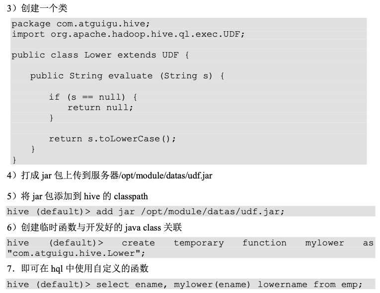
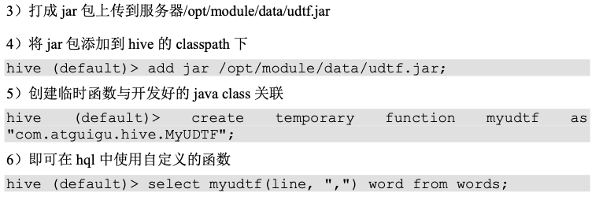
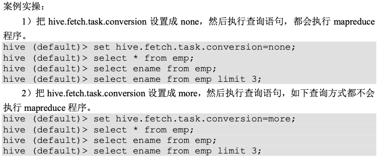
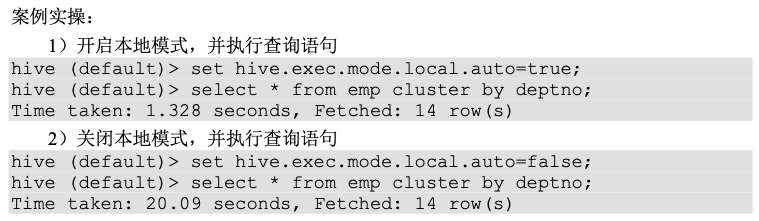
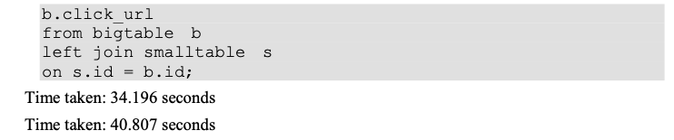
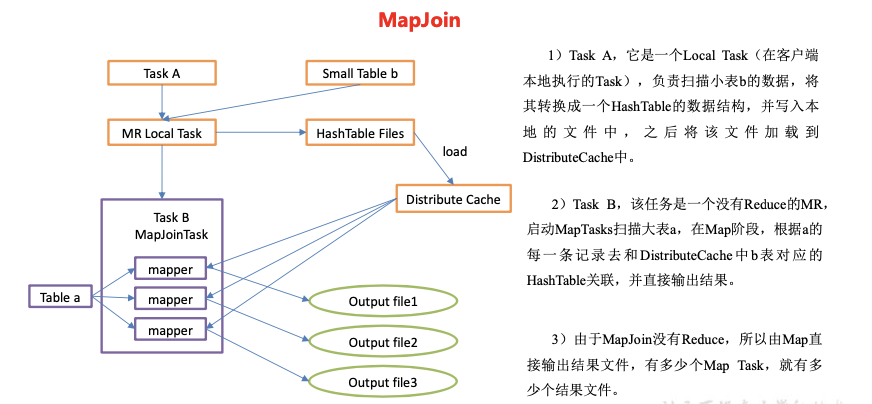

## Hive进阶实战

[toc]

实战1:

```sql
create table action
(userId string,
visitDate string,
visitCount int) 
row format delimited fields terminated by "\t";

load data local inpath '/Users/wangfulin/bigdata/data/hive/visit.txt' into table action;
```

```
u01     2017/1/21       5
u02     2017/1/23       6
u03     2017/1/22       8
u04     2017/1/20       3
u01     2017/1/23       6
u01     2017/2/21       8
u02     2017/1/23       6
u01     2017/2/22       4
```

针对同一个人，按照时间的先后顺序做的累加

```sql
select
    userId,
    mn,
    sum_visitCount,
    sum(sum_visitCount) over(partition by userId order by mn)
from
    (select
    userId,
    mn,
    sum(visitCount) sum_visitCount
from
    (select
    userId,
    date_format(regexp_replace(visitDate,'/','-'),'yyyy-MM') mn,
    visitCount
from
    action)t1
group by
    userId,mn)t2;
```

实战2：

​		有50W个京东店铺，每个顾客访问任何一个店铺的任何一个商品时都会产生一条访问日志，访问日志存储的表名为visit，访客的用户id为user_id，被访问的店铺名称为shop，请统计jd.txt：

1）每个店铺的UV（访客数）

2）每个店铺访问次数top3的访客信息。输出店铺名称、访客id、访问次数

```sql
create table visit(user_id string,shop string) row format delimited fields terminated by '\t';

load data local inpath '/Users/wangfulin/bigdata/data/hive/jd.txt' into table  visit;


# 每个店铺的UV（访客数）
select shop , count(distinct user_id) uv
from visit
group by shop; #(不推荐这么写，因为distinct是将所有的数据拿来去重)
# 1.去重
select
    shop,
    user_id
from
    visit
group by
    shop,user_id;t1
# 2.计数
select
    shop,
    count(*) uv
from
    (select
    shop,
    user_id
from
    visit
group by
    shop,user_id)t1
group by
    shop;
    
## 每个店铺访问次数top3的访客信息。输出店铺名称、访客id、访问次数
1.计算每个人访问每个店铺的总次数
select
    shop,
    user_id,
    count(*) ct
from
    visit
group by
    shop,user_id;
    
2.针对同一店铺，对访问次数进行逆序排序（从大到小），并添加rank值
select
    shop,
    user_id,
    ct,
    row_number() over(partition by shop order by ct desc) rk
from
    (select
    shop,
    user_id,
    count(*) ct
from
    visit
group by
    shop,user_id)t1;
3.去店铺访问前三名的用户
select
    shop,
    user_id,
    ct
from
    (select
    shop,
    user_id,
    ct,
    row_number() over(partition by shop order by ct desc) rk
from
    (select
    shop,
    user_id,
    count(*) ct
from
    visit
group by
    shop,user_id)t1)t2
where
    rk<=3;
```

实战：蚂蚁森林

----题目
1.蚂蚁森林植物申领统计
问题：假设2017年1月1日开始记录低碳数据（user_low_carbon），假设2017年10月1日之前满足申领条件的用户都申领了一颗p004-胡杨，
剩余的能量全部用来领取“p002-沙柳” 。
统计在10月1日累计申领“p002-沙柳” 排名前10的用户信息；以及他比后一名多领了几颗沙柳。
得到的统计结果如下表样式：

```
user_id  plant_count less_count(比后一名多领了几颗沙柳)
u_101    1000         100
u_088    900          400
u_103    500          …
```

1.创建表

```sql
create table user_low_carbon(user_id String,data_dt String,low_carbon int) row format delimited fields terminated by '\t';
create table plant_carbon(plant_id string,plant_name String,low_carbon int) row format delimited fields terminated by '\t';
```

2.加载数据

```sql
load data local inpath "/Users/wangfulin/bigdata/data/hive/user_low_carbon.txt" into table user_low_carbon;
load data local inpath "/Users/wangfulin/bigdata/data/hive/plant_carbon.txt" into table plant_carbon;
```

3.设置本地模式(速度会比较快)

```sql
set hive.exec.mode.local.auto=true;
```

```sql
一：
1.统计每个用户截止到2017/10/1日期总低碳量
select
    user_id,
    sum(low_carbon) sum_low_carbon
from
    user_low_carbon
where
    date_format(regexp_replace(data_dt,'/','-'),'yyyy-MM')<'2017-10'
group by
    user_id
order by
    sum_low_carbon desc
limit 11;t1

2.取出胡杨的能量
select low_carbon from plant_carbon where plant_id='p004';t2

3.取出沙柳的能量
select low_carbon from plant_carbon where plant_id='p002';t3

4.计算每个人申领沙柳的棵数
select
    user_id,
    floor((sum_low_carbon-t2.low_carbon)/t3.low_carbon) plant_count
from
    t1,t2,t3;t4

5.按照申领沙柳棵数排序,并将下一行数据中的plant_count放置当前行
select
    user_id,
    plant_count,
    lead(plant_count,1,'9999-99-99') over(order by plant_count desc) lead_plant_count
from
    t4
limit 10;t5

6.求相差的沙柳棵数
select
    user_id,
    plant_count,
    (plant_count-lead_plant_count) plant_count_diff
from
    t5;

select
    user_id,
    plant_count,
    lead(plant_count,1,'9999-99-99') over(order by plant_count desc) lead_plant_count
from
    (select
    user_id,
    floor((sum_low_carbon-t2.low_carbon)/t3.low_carbon) plant_count
from
    (select
    user_id,
    sum(low_carbon) sum_low_carbon
from
    user_low_carbon
where
    date_format(regexp_replace(data_dt,'/','-'),'yyyy-MM')<'2017-10'
group by
    user_id)t1,
    (select low_carbon from plant_carbon where plant_id='p004')t2,
    (select low_carbon from plant_carbon where plant_id='p002')t3)t4
limit 10;t5


select
    user_id,
    plant_count,
    (plant_count-lead_plant_count) plant_count_diff
from
    (select
    user_id,
    plant_count,
    lead(plant_count,1,'9999-99-99') over(order by plant_count desc) lead_plant_count
from
    (select
    user_id,
    floor((sum_low_carbon-t2.low_carbon)/t3.low_carbon) plant_count
from
    (select
    user_id,
    sum(low_carbon) sum_low_carbon
from
    user_low_carbon
where
    date_format(regexp_replace(data_dt,'/','-'),'yyyy-MM')<'2017-10'
group by
    user_id)t1,
    (select low_carbon from plant_carbon where plant_id='p004')t2,
    (select low_carbon from plant_carbon where plant_id='p002')t3)t4
order by
    plant_count desc
limit 10)t5;
```

2、蚂蚁森林低碳用户排名分析
问题：查询user_low_carbon表中每日流水记录，条件为：
用户在2017年，连续三天（或以上）的天数里，
每天减少碳排放（low_carbon）都超过100g的用户低碳流水。
需要查询返回满足以上条件的user_low_carbon表中的记录流水。
例如用户u_002符合条件的记录如下，因为2017/1/2~2017/1/5连续四天的碳排放量之和都大于等于100g：

```
seq（key） user_id data_dt  low_carbon
xxxxx10    u_002  2017/1/2  150
xxxxx11    u_002  2017/1/2  70
xxxxx12    u_002  2017/1/3  30
xxxxx13    u_002  2017/1/3  80
xxxxx14    u_002  2017/1/4  150
xxxxx14    u_002  2017/1/5  101
```

备注：统计方法不限于sql、procedure、python,java等

备注：统计方法不限于sql、procedure、python,java等

### 函数

#### 自定义函数

根据用户自定义函数类别分为以下三种:

(1) UDF(User-Defined-Function)一进一出

(2) UDAF(User-Defined Aggregation Function)

 聚集函数，多进一出
 类似于:count/max/min

(3) UDTF(User-Defined Table-Generating Functions)

 一进多出

如 lateral view explore()

（4）官方文档

https://cwiki.apache.org/confluence/display/Hive/HivePlugins

5. 编程步骤

- 继承org.apache.hadoop.hive.ql.UDF

- 需要实现evaluate函数；evaluate函数支持重载；

- 在hive的命令行窗口创建函数

  - 添加 jar

    ```
    add jar linux_jar_path;
    ```

  - 创建 function

    ```
    create [temporary] function [dbname.] function_name AS class_name;
    ```

- 在hive的命令行删除函数

  ```
  Drop [tempoary] function [if exists] [dbname.] function_name;
  ```

注意：UDF必须要有返回类型，可以返回null，但返回的类型不能为void。

#### 自定义 UDF 函数

导入依赖

```xml
<dependencies>
    <dependency>
        <groupId>org.apache.hive</groupId>
        <artifactId>hive-exec</artifactId>
        <version>1.2.1</version>
    </dependency>
</dependencies>
```



temporary临时的，切换客户端之后 会断掉

建议把jar添加到lib里面

#### 自定义 UDTF 函数

1)需求说明

自定义一个 UDTF 实现将一个任意分割符的字符串切割成独立的单词，例如

```
Line:"hello,world,hadoop,hive" Myudtf(line, ",")
hello
world
hadoop
hive
```

2)代码实现

```java
public class Udtf extends GenericUDTF {
    private ArrayList<String> outList = new ArrayList<>();

    @Override
    public StructObjectInspector initialize(StructObjectInspector argOIs) throws UDFArgumentException {
        //1.定义输出数据的列名和类型
        List<String> fieldNames = new ArrayList<>();
        List<ObjectInspector> fieldOIs = new ArrayList<>();
        //2.添加输出数据的列名和类型
        fieldNames.add("lineToWord");
        fieldOIs.add(PrimitiveObjectInspectorFactory.javaStringObjectInspector);
        return ObjectInspectorFactory.getStandardStructObjectInspector(fieldNames, fieldOIs);
    }

    @Override
    public void process(Object[] args) throws HiveException {
        //1.获取原始数据
        String arg = args[0].toString();
        //2.获取数据传入的第二个参数，此处为分隔符
        String splitKey = args[1].toString();
        //3.将原始数据按照传入的分隔符进行切分
        String[] fields = arg.split(splitKey);
        //4.遍历切分后的结果，并写出
        for (String field : fields) {
            //集合为复用的，首先清空集合 outList.clear();
            //将每一个单词添加至集合
            outList.add(field);
            //将集合内容写出
            forward(outList);
        }
    }

    @Override
    public void close() throws HiveException {
    }
}
```



### 调优

#### Fetch 抓取

​		Fetch 抓取是指，Hive 中对某些情况的查询可以不必使用 MapReduce 计算。例如: SELECT  *  FROM  employees;在这种情况下，Hive可以简单地读取 employee 对应的存储目录 下的文件，然后输出查询结果到控制台。

​		在 hive-default.xml.template 文件中 hive.fetch.task.conversion 默认是 more，老版本 hive 默认是 minimal，该属性修改为 more 以后，在全局查找、字段查找、limit 查找等都不走 mapreduce。



#### 本地模式

​		对于大多数这种情况，Hive 可以通过本地模式在单台机器上处理所有的任务。对于小数据集，执行时间可以明显被缩短。

​		用户可以通过设置 hive.exec.mode.local.auto 的值为 true，来让 Hive 在适当的时候自动 启动这个优化。

```shell
set hive.exec.mode.local.auto=true; //开启本地 mr
 //设置 local mr 的最大输入数据量，当输入数据量小于这个值时采用 local mr 的

方式，默认为 134217728，即 128M
 set hive.exec.mode.local.auto.inputbytes.max=50000000;
 //设置 local mr 的最大输入文件个数，当输入文件个数小于这个值时采用 local mr

的方式，默认为 4
 set hive.exec.mode.local.auto.input.files.max=10;
```



#### 表的优化

##### 小表、大表 Join

​		将 key 相对分散，并且数据量小的表放在 join 的左边，这样可以有效减少内存溢出错误 发生的几率;再进一步，可以使用 map join 让小的维度表(1000 条以下的记录条数)**先进内存**。在 map 端完成 reduce。

​		**实际测试发现:新版的 hive 已经对小表 JOIN 大表和大表 JOIN 小表进行了优化。小表 放在左边和右边已经没有明显区别。**




```
// 创建大表
create table bigtable(id bigint, time bigint, uid string, keyword string, url_rank int, click_num int, click_url string) row format delimited fields terminated by '\t';
// 创建小表
create table smalltable(id bigint, time bigint, uid string, keyword string, url_rank int, click_num int, click_url string) row format delimited fields terminated by '\t';
// 创建 join 后表的语句
create table jointable(id bigint, time bigint, uid string, keyword string, url_rank int, click_num int, click_url string) row format delimited fields terminated by '\t';
// 导数据
hive (default)> load data local inpath '/opt/module/data/bigtable' into table bigtable;
hive (default)>load data local inpath '/opt/module/data/smalltable' into table smalltable;
// 关闭mapjoin
set hive.auto.convert.join = false;
// 执行小表 JOIN 大表语句
insert overwrite table jointable
select b.id, b.time, b.uid, b.keyword, b.url_rank, b.click_num, b.click_url
from smalltable s
left join bigtable b
on b.id = s.id;

// 执行大表 JOIN 小表语句
insert overwrite table jointable
select b.id, b.time, b.uid, b.keyword, b.url_rank, b.click_num, b.click_url
from bigtable b
left join smalltable s on s.id = b.id
```

##### 大表 Join 大表

1.空 KEY 过滤

​		有时 join 超时是因为某些 key 对应的数据太多，而相同 key 对应的数据都会发送到相同 的 reducer 上，从而导致内存不够。此时我们应该仔细分析这些异常的 key，很多情况下，这些 key 对应的数据是异常数据，我们需要在 SQL 语句中进行过滤。例如 key 对应的字段 为空，操作如下:  							

```sql
## 创建原始表
create table ori(id bigint, time bigint, uid string, keyword string, url_rank int, click_num int, click_url string) row format delimited fields terminated by '\t';
## 创建空 id 表
create table nullidtable(id bigint, time bigint, uid string, keyword string, url_rank int, click_num int, click_url string) row format delimited fields terminated by '\t';
## 创建 join 后表的语句
create table jointable(id bigint, time bigint, uid string, keyword string, url_rank int, click_num int, click_url string) row format delimited fields terminated by '\t';
## 分别加载原始数据和空 id 数据到对应表中
load data local inpath '/opt/module/datas/ SogouQ1.txt' into table ori;
load data local inpath '/opt/module/data/nullid' into table nullidtable;
## 测试不过滤空 id
insert overwrite table jointable
select n.* from nullidtable n left join ori o on n.id = o.id;
## 测试过滤空 id
insert overwrite table jointable
select n.* from (select * from nullidtable where id is not null ) n left join ori o on n.id = o.id;
```

2. 空 key 转换

有时虽然某个 key 为空对应的数据很多，但是相应的数据不是异常数据，必须要包含在

join 的结果中，此时我们可以表 a 中 key 为空的字段赋一个随机的值，使得数据随机均匀地 分不到不同的 reducer 上。例如

```sql
# 不随机分布空 null 值: 
# (1)设置 5 个 reduce 个数
set mapreduce.job.reduces = 5;
# (2)JOIN 两张表
insert overwrite table jointable
select n.* from nullidtable n left join ori b on n.id = b.id;
## 出现了数据倾斜，某些 reducer 的资源消耗远大 于其他 reducer。
## 随机分布空 null 值
(1)设置 5 个 reduce 个数
set mapreduce.job.reduces = 5;
insert overwrite table jointable
(2)JOIN 两张表
select n.* from nullidtable n full join ori o on
case when n.id is null then concat('hive', rand()) else n.id end = o.id;
```

#####  MapJoin

如果不指定 MapJoin 或者不符合 MapJoin 的条件，那么 Hive 解析器会将 Join 操作转换 成 Common Join，即:在 Reduce 阶段完成 join。容易发生数据倾斜。可以用 MapJoin 把小 表全部加载到内存在 map 端进行 join，避免 reducer 处理。

```
# 1.开启 MapJoin 参数设置
# (1)设置自动选择 MapJoin
set hive.auto.convert.join = true; 默认为 true
# (2)大表小表的阈值设置(默认25M 一下认为是小表):
set hive.mapjoin.smalltable.filesize=25000000;
```

MapJoin 工作机制



实例

```
set hive.auto.convert.join = true; 默认为 true
# 执行小表 JOIN 大表语句
insert overwrite table jointable
select b.id, b.time, b.uid, b.keyword, b.url_rank, b.click_num, b.click_url
from smalltable s
join bigtable b
on s.id = b.id;
# 执行大表 JOIN 小表语句
insert overwrite table jointable
select b.id, b.time, b.uid, b.keyword, b.url_rank, b.click_num, b.click_url
from bigtable b
join smalltable s
on s.id = b.id;
```

##### Group By

​		默认情况下**，Map 阶段同一 Key 数据分发给一个 reduce**，当一个 key 数据过大时就倾 斜了。并不是所有的聚合操作都需要在 Reduce 端完成，很多聚合操作都可以先在 Map 端进行 部分聚合，最后在 Reduce 端得出最终结果。

1.开启 Map 端聚合参数设置

(1)是否在 Map 端进行聚合，默认为 True

```sql
hive.map.aggr = true
```

(2)在 Map 端进行聚合操作的条目数目

```sql
hive.groupby.mapaggr.checkinterval = 100000
```

(3)有数据倾斜的时候进行负载均衡(默认是 false)

```sql
hive.groupby.skewindata = true
```

​		当选项设定为 true，生成的查询计划会有两个 MR Job。第一个 MR Job 中，**Map 的输出结果会随机分布到 Reduce 中，每个 Reduce 做部分聚合操作，并输出结果，这样处理的结果是相同的 Group By Key 有可能被分发到不同的 Reduce 中，从而达到负载均衡的目的;**第二个 MR Job 再根据预处理的数据结果按照 Group By Key 分布到 Reduce 中(这个过程可以 保证相同的 Group By Key 被分布到同一个 Reduce 中)，最后完成最终的聚合操作


##### Count(Distinct) 去重统计

数据量小的时候无所谓，数据量大的情况下，**由于 COUNT DISTINCT 操作需要用一个 Reduce Task 来完成，这一个 Reduce 需要处理的数据量太大，就会导致整个 Job 很难完成**， 一般 `COUNT DISTINCT` **使用先 GROUP BY 再 COUNT 的方式替换,GROUP BY分组后发到一个单独的reduce处理。**:

```sql
# 创建一张大表
create table bigtable(id bigint, time bigint, uid string, keyword
string, url_rank int, click_num int, click_url string) row format delimited
fields terminated by '\t';
# 加载数据
load data local inpath '/opt/module/datas/bigtable' into table
bigtable;
# 设置 5 个 reduce 个数
set mapreduce.job.reduces = 5;
# 执行去重 id 查询
select count(distinct id) from bigtable;
# 采用 GROUP by 去重 id
 select count(id) from (select id from bigtable 
group by id) a;
```

​		尽量避免笛卡尔积，join 的时候不加 on 条件，或者无效的 on 条件，Hive 只能使用 1 个 reducer 来完成笛卡尔积。

##### 行列过滤

列处理:在 SELECT 中，只拿需要的列，如果有，尽量使用分区过滤，少用 SELECT *。

行处理:在分区剪裁中，当使用外关联时，如果将副表的过滤条件写在 Where 后面， 那么就会先全表关联，之后再过滤，比如:

```sql
# 测试先关联两张表，再用 where 条件过滤
select o.id from bigtable b join ori o on o.id = b.id
where o.id <= 10;
# 通过子查询后，再关联表
select b.id from bigtable b
join (select id from ori where id <= 10 ) o on b.id = o.id;
```

##### 动态分区调整


实例：将 ori 中的数据按照时间(如:20111230000008)，插入到目标表 ori_partitioned_target的相应分区中。

```sql
# (1)创建分区表
create table ori_partitioned(id bigint, time bigint, uid string, keyword string, url_rank int, click_num int, click_url string) partitioned by (p_time bigint) row format delimited fields terminated by '\t';
# (2)加载数据到分区表中
load data local inpath '/home/atguigu/ds1' into table
ori_partitioned partition(p_time='20111230000010') ;
load data local inpath '/home/atguigu/ds2' into table ori_partitioned partition(p_time='20111230000011') 
# (3)创建目标分区表
create table ori_partitioned_target(id bigint, time bigint, uid string, keyword string, url_rank int, click_num int, click_url string) PARTITIONED BY (p_time STRING) row format delimited fields terminated by '\t';
# (4)设置动态分区
set hive.exec.dynamic.partition = true;
set hive.exec.dynamic.partition.mode = nonstrict; 
set hive.exec.max.dynamic.partitions = 1000;
set hive.exec.max.dynamic.partitions.pernode = 100; 
set hive.exec.max.created.files = 100000;
set hive.error.on.empty.partition = false;
hive (default)> insert overwrite table ori_partitioned_target partition (p_time)
select id, time, uid, keyword, url_rank, click_num, click_url, p_time from ori_partitioned;
```

#### MR 优化

#### 合理设置 Map 数

**1)通常情况下，作业会通过 input 的目录产生一个或者多个 map 任务。**

​		主要的决定因素有:input 的文件总个数，input 的文件大小，集群设置的文件块大小。

**2)是不是 map 数越多越好?**

​		答案是否定的。如果一个任务有很多小文件(远远小于块大小 128m)，则每个小文件 也会被当做一个块，用一个 map 任务来完成，而**一个 map 任务启动和初始化的时间远远大 于逻辑处理的时间，就会造成很大的资源浪费**。而且，同时可执行的 map 数是受限的。

**3)是不是保证每个 map 处理接近 128m 的文件块，就高枕无忧了?**

​		答案也是不一定。比如有一个 127m 的文件，正常会用一个 map 去完成，但这个文件只 有一个或者两个小字段，却有几千万的记录，如果 map 处理的逻辑比较复杂，用一个 map 任务去做，肯定也比较耗时。

​		针对上面的问题 2 和 3，我们需要采取两种方式来解决:即减少 map 数和增加 map 数;

##### 小文件进行合并

​		在 map 执行前合并小文件，减少 map 数:CombineHiveInputFormat 具有对小文件进行 合并的功能(系统默认的格式)。HiveInputFormat 没有对小文件合并功能。

```sql
set hive.input.format= org.apache.hadoop.hive.ql.io.CombineHiveInputFormat;
```

##### 复杂文件增加 Map 数

​		当 input 的文件都很大，任务逻辑复杂，map 执行非常慢的时候，可以考虑增加 Map 数，来使得每个 map 处理的数据量减少，从而提高任务的执行效率。

增加 map 的方法为:根据 `computeSliteSize(Math.max(minSize,Math.min(maxSize,blocksize)))=blocksize=128M`公式，调 整 maxSize 最大值。让 maxSize 最大值低于 blocksize 就可以增加 map 的个数。

```
# 1.执行查询
>> select count(*) from emp;
Hadoop job information for Stage-1: number of mappers: 1; number of reducers: 1
# 2.设置最大切片值为 100 个字节
>> set mapreduce.input.fileinputformat.split.maxsize=100;
>> select count(*) from emp;
Hadoop job information for Stage-1: number of mappers: 6; number of reducers: 1

```

##### 合理设置 Reduce 数

**1.调整 reduce 个数方法一**

```
(1)每个 Reduce 处理的数据量默认是 256MB
hive.exec.reducers.bytes.per.reducer=256000000
(2)每个任务最大的 reduce 数，默认为 1009
hive.exec.reducers.max=1009
(3)计算 reducer 数的公式
N=min(参数 2，总输入数据量/参数 1)
```

**2.调整 reduce 个数方法二**

```
在hadoop的 mapred-default.xml 文件中修改设置每个 job 的 Reduce 个数
set mapreduce.job.reduces = 15;

```

**3.reduce 个数并不是越多越好**

1) 过多的启动和初始化 reduce 也会消耗时间和资源;
2) 另外，有多少个 reduce，就会有多少个输出文件，如果生成了很多个小文件，那么如果这些小文件作为下一个任务的输入，则也会出现小文件过多的问题;
 在设置 reduce 个数的时候也需要考虑这两个原则:

- 处理大数据量利用合适的 reduce 数;

- 使单个 reduce 任务处理数据量大小要合适;

#### 并行执行

​		Hive 会将一个查询转化成一个或者多个阶段。这样的阶段可以是 MapReduce 阶段、抽 样阶段、合并阶段、limit 阶段。或者 Hive 执行过程中可能需要的其他阶段。默认情况下， Hive 一次只会执行一个阶段。不过，某个特定的 job 可能包含众多的阶段，而这些阶段可能 并非完全互相依赖的，也就是说有些阶段是可以并行执行的，这样可能使得整个 job 的执行 时间缩短。不过，如果有更多的阶段可以并行执行，那么 job 可能就越快完成。

​		通过设置参数 hive.exec.parallel 值为 true，就可以开启并发执行。不过，在共享集群中， 需要注意下，如果 job 中并行阶段增多，那么集群利用率就会增加。

```
set hive.exec.parallel=true; //打开任务并行执行
set hive.exec.parallel.thread.number=16; //同一个 sql 允许最大并行度， 默认为 8。
```

#### JVM 重用

​		JVM 重用是 Hadoop 调优参数的内容，其对 Hive 的性能具有非常大的影响，特别是对 于很难避免小文件的场景或 task 特别多的场景，这类场景大多数执行时间都很短。

​		Hadoop 的默认配置通常是使用派生 JVM 来执行 map 和 Reduce 任务的。这时 JVM 的 启动过程可能会造成相当大的开销，尤其是执行的 job 包含有成百上千 task 任务的情况。JVM 重用可以使得 JVM 实例在同一个 job 中重新使用 N 次。N 的值可以在 Hadoop 的mapred-site.xml 文件中进行配置。通常在 10-20 之间，具体多少需要根据具体业务场景测试 得出。

```xml
<property>
  <name>mapreduce.job.jvm.numtasks</name>
  <value>10</value>
  <description>How many tasks to run per jvm. If set to -1, there is
  no limit. </description>
</property>
```

​		这个功能的缺点是，开启 JVM 重用将一直占用使用到的 task 插槽，以便进行重用，直 到任务完成后才能释放。如果某个“不平衡的”job 中有某几个 reduce task 执行的时间要比其 他 Reduce task 消耗的时间多的多的话，那么保留的插槽就会一直空闲着却无法被其他的 job 使用，直到所有的 task 都结束了才会释放。

#### 执行计划

1.基本语法

EXPLAIN [EXTENDED | DEPENDENCY | AUTHORIZATION] query

2.案例实操 

```
(1)查看下面这条语句的执行计划
hive (default)> explain select * from emp;
hive (default)> explain select deptno, avg(sal) avg_sal from emp group by deptno;
(2)查看详细执行计划
hive (default)> explain extended select * from emp;
hive (default)> explain extended select deptno, avg(sal) avg_sal from emp group by deptno;
```

### Hive 实战之谷粒影音

统计硅谷影音视频网站的常规指标，各种 TopN 指标: 

- 统计视频观看数 Top10
- 统计视频类别热度 Top10
- 统计视频观看数 Top20 所属类别以及类别包含的 Top20 的视频个数 
- 统计视频观看数 Top50 所关联视频的所属类别 Rank 
- 统计每个类别中的视频热度 Top10
- 统计每个类别中视频流量 Top10
- 统计上传视频最多的用户 Top10 以及他们上传的观看次数在前 20 视频 
- 统计每个类别视频观看数 Top10

| 字段        | 备注       | 描述                 |
| ----------- | ---------- | -------------------- |
| video_id    | 视频id     | 11位字符串           |
| uploader    | 上传者     | 用户名               |
| age         | 视频年龄   | 视频在平台上的整天数 |
| category    | 类别       | 类别                 |
| length      | 长度       | 长度                 |
| views       | 次数       |                      |
| rate        | 评分       |                      |
| ratings     | 流量       |                      |
| conments    | 评论数     |                      |
| related_ids | 相关视频id | 最多20个             |

用户表：

| 字段     | 备注       | 字段类型 |
| -------- | ---------- | -------- |
| uploader | 上传者     | String   |
| Videos   | 上传视频数 | int      |
| friends  | 朋友数量   | int      |

#### ETL 原始数据

​		通过观察原始数据形式，可以发现，视频可以有多个所属分类，每个所属分类用&符号 分割，且分割的两边有空格字符，同时相关视频也是可以有多个元素，多个相关视频又用“\t” 进行分割。为了分析数据时方便对存在多个子元素的数据进行操作，我们首先进行数据重组 清洗操作。即:将所有的类别用“&”分割，同时去掉两边空格，多个相关视频 id 也使用 “&”进行分割。

```java
public class ETLMapper extends Mapper<LongWritable, Text, NullWritable, Text> {
    Text text = new Text();

    @Override
    protected void map(LongWritable key, Text value, Context context) throws IOException, InterruptedException {
        // 获取数据
        // 过滤数据
        String etlString = ETLUtil.oriString2ETLString(value.toString());

        if (etlString == null) {
            return;
        }
        text.set(etlString);
        // 写出
        context.write(NullWritable.get(), text);
    }

}

```

数据处理逻辑

```java
public class ETLUtil {
    /**
     * 数据清洗
     * 1.过滤长度不够的
     * 2.去掉类别字段中的空格
     * 3.修改相关视频ID字段的分隔符，由'\t'转为'&'
     * @param ori
     * @return
     */
    public static String oriString2ETLString(String ori) {
        StringBuilder sb = new StringBuilder();
        String[] oriArr = ori.split("\t");
        // 个数不足9个
        if (oriArr.length < 9) {
            return null;
        }
        // 替换空格
        oriArr[3] = oriArr[3].replaceAll(" ","");
        for (int i = 0; i < oriArr.length; i++) {
            // 对非相关id处理 对前面9个字段处理
            if (i < 9) {
                // 如果恰好只有九个字段 则最后面不加'\t'
                if (i == oriArr.length - 1) {
                    sb.append(oriArr[i]);
                }else{
                    sb.append(oriArr[i] + "\t");
                }
            } else {// 处理相关的id
                if (i == oriArr.length - 1) {
                    sb.append(oriArr[i]);
                } else {
                    sb.append(oriArr[i] + '&');
                }
            }
        }
        return sb.toString();
    }
}

```


```java
public class ETLDriver implements Tool {
    private Configuration conf = null;

    public int run(String[] args) throws Exception {
        String basePath = "/Users/wangfulin/bigdata/data/hive/";
        args = new String[]{basePath + "guiliVideo/video/2008/0222" , basePath + "gulioutput"};

        // 1 获取配置信息以及封装任务

        // 1.job对象
        Job job = Job.getInstance(conf);
        // 2.设置jar路径
        job.setJarByClass(ETLDriver.class);
        // 设置mapper输出的kv类型
        job.setMapperClass(ETLMapper.class);
        job.setMapOutputKeyClass(NullWritable.class);
        job.setMapOutputValueClass(Text.class);
        // 设置输入输出路径
        // 5 设置最终输出kv类型
        job.setOutputKeyClass(NullWritable.class);
        job.setOutputValueClass(Text.class);
        // 6 设置输入和输出路径
        FileInputFormat.setInputPaths(job, new Path(args[0]));
        FileOutputFormat.setOutputPath(job, new Path(args[1]));
        // 7 提交
        boolean result = job.waitForCompletion(true);

        return result ? 0 : 1;

    }

    public void setConf(Configuration conf) {
        this.conf = conf;
    }

    public Configuration getConf() {
        return this.conf;
    }

    public static void main(String[] args) throws Exception {
        Configuration configuration = new Configuration();
        ToolRunner.run(configuration,new ETLDriver(),args);
    }
}
```

#### 创建表

创建表:gulivideo_ori，gulivideo_user_ori,

创建表:gulivideo_orc，gulivideo_user_orc

gulivideo_ori:

```sql
create table gulivideo_ori(
   videoId string,
   uploader string,
   age int,
   category array<string>,
   length int,
   views int,
   rate float,
ratings int,
comments int,
relatedId array<string>)
row format delimited fields terminated by "\t"
collection items terminated by "&"
stored as textfile;
```

gulivideo_user_ori:

```sql
create table gulivideo_user_ori( uploader string,
videos int,
friends int)
row format delimited
fields terminated by "\t"
stored as textfile;
```

然后把原始数据插入到 orc 表中

gulivideo_orc:

```sql
create table gulivideo_orc(
   videoId string,
   uploader string,
   age int,
   category array<string>,
   length int,
    views int,
    rate float,
    ratings int,
    comments int,
    relatedId array<string>)
    row format delimited fields terminated by "\t" 
    collection items terminated by "&"
    stored as orc;
```

gulivideo_user_orc:

```sql
create table gulivideo_user_orc( uploader string,
videos int,
friends int)
row format delimited
fields terminated by "\t"
stored as orc;
```

导入 ETL 后的数据

gulivideo_ori:

```
load data local inpath "/Users/wangfulin/bigdata/data/hive/gulioutput/part-r-00000" into table gulivideo_ori;
```

gulivideo_user_ori:

```
load data local inpath "/Users/wangfulin/bigdata/data/hive/guiliVideo/user/2008/0903/user.txt" into table gulivideo_user_ori;
```

向 ORC 表插入数据

```
insert into table gulivideo_orc select * from gulivideo_ori;
insert into table gulivideo_user_orc select * from gulivideo_user_ori;
```

**统计视频观看数 Top10**

```sql
select videoid,views from gulivideo_orc
order by views desc limit 10;
```

**统计视频类别热度 Top10**

思路:
 1) 即统计每个类别有多少个视频，显示出包含视频最多的前 10 个类别。
 2) 我们需要按照类别 group by 聚合，然后 count 组内的 videoId 个数即可。
 3) 因为当前表结构为:一个视频对应一个或多个类别。所以如果要 group by 类别，需要先 将类别进行列转行(展开)，然后再进行 count 即可。
 4) 最后按照热度排序，显示前 10 条。
 最终代码:

```sql
1.因为电影所属的分类可能有多个，因此要行转列
select videoid,category_name from gulivideo_orc lateral view explode(category) tem_catetory as category_name; t1
2.按照category_name进行分组，统计每种类别视频的总数，同时按照该总数进行倒序排名，取前10
select category_name,count(*) category_count from (select videoid,category_name from gulivideo_orc lateral view explode(category) tem_catetory as category_name)t1 group by t1.category_name
order by category_count desc limit 10;
```

**统计出视频观看数最高的 20 个视频的所属类别以及类别包含 Top20 视频的个数**

"类别包含 Top20 视频的个数"的含义是，在这个最高的20个视频当中，每个类别有多少个视频。

思路:
1) 先找到观看数最高的 20 个视频所属条目的所有信息，降序排列 

2) 把这 20 条信息中的 category 分裂出来(列转行)

3) 最后查询视频分类名称和该分类下有多少个 Top20 的视频

```sql
1.统计前20的视频
select videoid, views, category from gulivideo_orc
order by views desc
limit 20;t1
2.对t1表中的category进行行变列操作
select videoid,category_name from (select videoid, views, category from gulivideo_orc
order by views desc
limit 20)t1 lateral view explode(category) tem_catetory as category_name;t2
3.对t2表进行分组(category_name)求和(总数)
select category_name,count(*) category_count from (select videoid,category_name from (select videoid, views, category from gulivideo_orc
order by views desc
limit 20)t1 lateral view explode(category) tem_catetory as category_name)t2 group by category_name order by category_count desc;
```

**统计视频观看数 Top50 所关联视频的所属类别 Rank**

思路:
 1) 查询出观看数最多的前 50 个视频的所有信息(当然包含了每个视频对应的关联视频)，记

为临时表 t1 t1:观看数前 50的视频

```
select relatedId, views from gulivideo_orc
order by views desc limit 50;t1
```

2)对t1表的relatedId进行行转列并去重

```
select related_id from (select relatedId, views from gulivideo_orc
order by views desc limit 50)t1 lateral view explode(relatedId) tmp_related as related_id group by related_id; t2
```

3)取出观看数前50视频关联ID视频的类别

将相关视频的 id 和 gulivideo_orc 表进行 inner join 操作

```sql
select category from (select related_id from (select relatedId, views from gulivideo_orc
order by views desc limit 50)t1 lateral view explode(relatedId) tmp_related as related_id group by related_id)t2 join gulivideo_orc
on t2.related_id = gulivideo_orc.videoId;
```

4)对t3表中的category进行炸裂

```
select
    explode(category) category_name
from
    (select category from (select related_id from (select relatedId, views from gulivideo_orc
order by views desc limit 50)t1 lateral view explode(relatedId) tmp_related as related_id group by related_id)t2 join gulivideo_orc
on t2.related_id = gulivideo_orc.videoId)t3; t4
```

5.分组(类别)求和(总数)

```sql
select category_name,count(*) category_count
from (select
    explode(category) category_name
from
    (select category from (select related_id from (select relatedId, views from gulivideo_orc
order by views desc limit 50)t1 lateral view explode(relatedId) tmp_related as related_id group by related_id)t2 join gulivideo_orc
on t2.related_id = gulivideo_orc.videoId)t3)t4 
group by
    category_name
order by
    category_count desc;
```

**统计每个类别中的视频热度Top10**
**统计每个类别中视频流量Top10**
**统计每个类别视频观看数Top10**

如果分类用的很多，把行变列操作单独写一个表。

思路:
 1) 要想统计Music类别中的视频热度Top10，需要先找到Music类别，那么就需要将category 展开，所以可以创建一张表用于存放 categoryId 展开的数据。
 2) 向 category 展开的表中插入数据。
 3) 统计对应类别(Music)中的视频热度。
 最终代码:
 创建表类别表:

```sql
create table gulivideo_category( videoId string,
uploader string,
age int,
categoryId string, length int,
views int,
rate float,
ratings int,
comments int,
relatedId array<string>)
row format delimited
fields terminated by "\t"
collection items terminated by "&"
stored as orc;
```

向类别表中插入数据:

```
insert into table gulivideo_category select
       videoId,
       uploader,
       age,
       categoryId,
       length,
       views,
       rate,
       ratings,
       comments,
       relatedId
from
   gulivideo_orc lateral view explode(category) catetory as categoryId;
```

--统计每个类别中的视频热度Top10
--统计每个类别中视频流量Top10
--统计每个类别视频观看数Top10

```sql
1.给每一种类别根据视频观看数添加rank值(倒序)
//按类别分组，降序排列
select videoId, views, categoryId, rank() over(partition by categoryId order by views desc) rk from gulivideo_category;

2.过滤前十
select
    categoryId,
    videoId,
    views
from
    (select
    categoryId,
    videoId,
    views,
    rank() over(partition by categoryId order by views desc) rk
from
    gulivideo_category)t1
where
    rk<=10;
```

**统计上传视频最多的用户Top10以及他们上传的观看次数在前20视频**

1.上传视频最多的用户Top10

```
select uploader,videos
from
    gulivideo_user_orc
order by
    videos desc
limit 10;t1
```

2.取出这10个人上传的所有视频,按照观看次数进行排名,取前20

```
select
    video.videoId,
    video.views
from
    t1
join
    gulivideo_orc video
on
    t1.uploader=video.uploader
order by
    views desc
limit 20;
```

