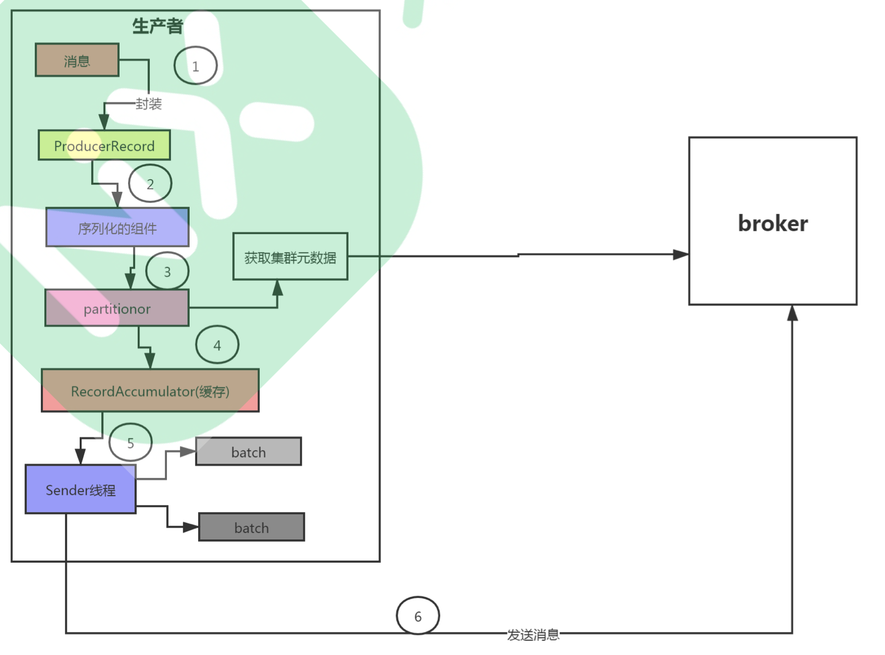
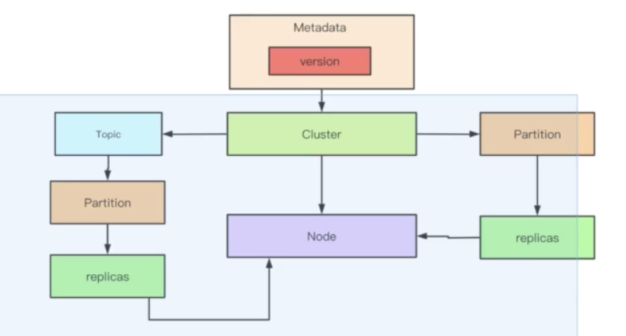
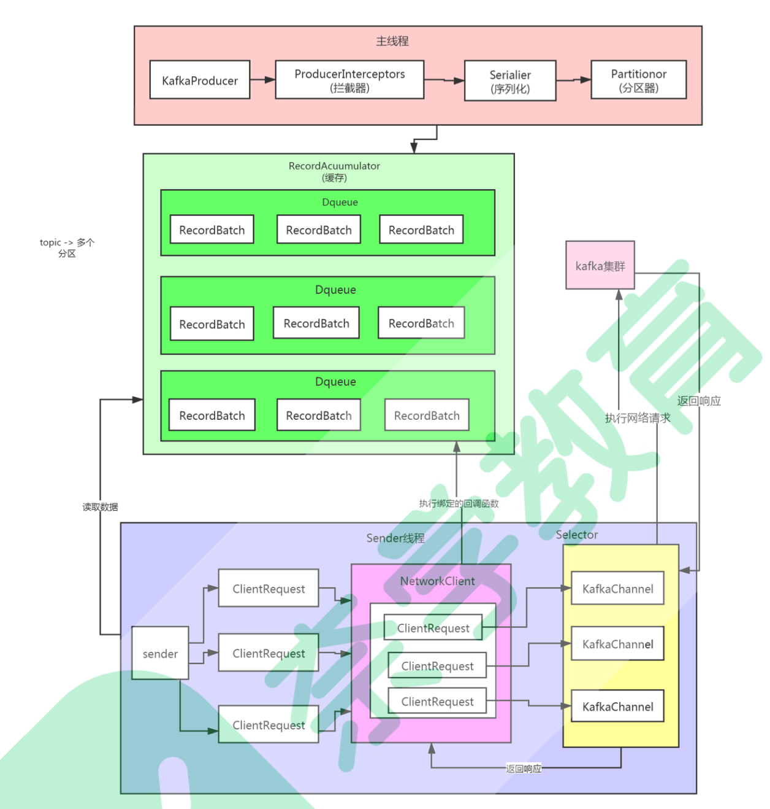
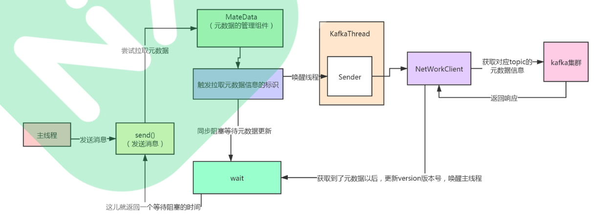
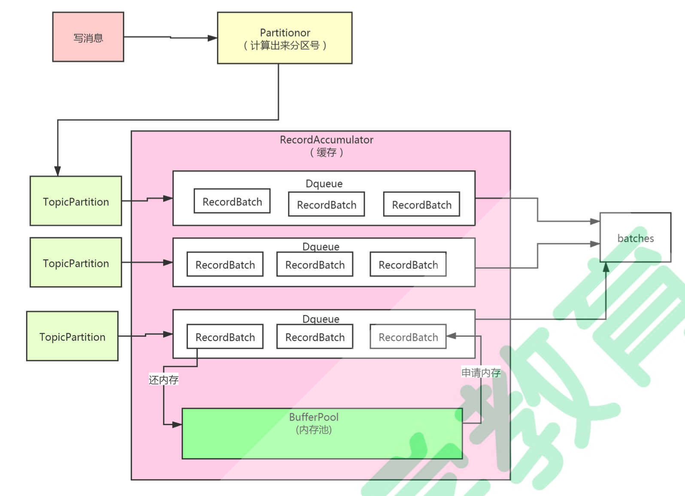
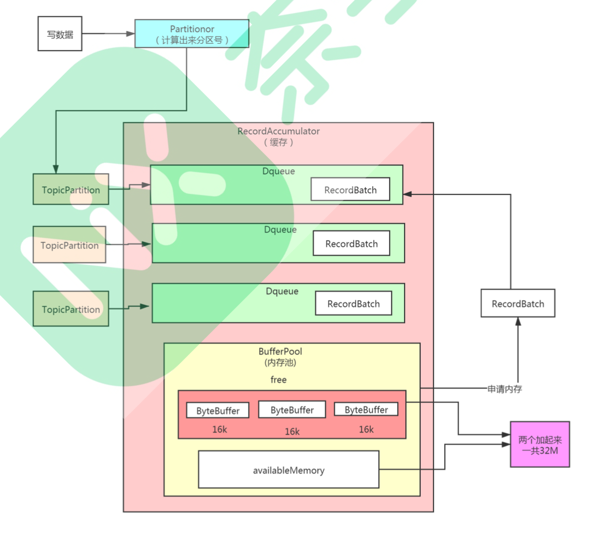

## Kafka源码阅读

### 目标

基于kafka 1.0.10

client：

- 生产者发送数据的流程
- 消费者消费数据的流程

server：

- kafka的网络架构是如何设计
- kafka的数据是如何存储的
- kafka的副本是如何同步的
- kafka的元数据信息是如何管理的

### 生产者发送信息



1. 封装producerRecord对象
2. 对象序列化，生产者发送到服务端，需要跨网络传输
3. 数据发送哪个分区，需要先获取集群中的元数据，根据元数据信息，计算小心放到哪个分区。
4. 消息发送到RecordAccumulator缓存
5. Sender线程，获取缓存消息，按一定批次发送到broker

```java
public class Producer extends Thread {
    private final KafkaProducer<Integer, String> producer;
    private final String topic;
    private final Boolean isAsync;

    public Producer(String topic, Boolean isAsync) {
        Properties props = new Properties();
        // 用户拉取元数据
        props.put("bootstrap.servers", "localhost:9092");
        props.put("client.id", "DemoProducer");
        // 设置序列化的类 二进制的格式
        props.put("key.serializer", "org.apache.kafka.common.serialization.IntegerSerializer");
        props.put("value.serializer", "org.apache.kafka.common.serialization.StringSerializer");
        // 创建生产者。 消费数据时需要反序列化
        producer = new KafkaProducer<>(props);
        this.topic = topic;
        this.isAsync = isAsync;
    }

    public void run() {
        int messageNo = 1;
        while (true) {
            String messageStr = "Message_" + messageNo;
            long startTime = System.currentTimeMillis();
            // isAsync： 1：true 异步发送 2：false 同步发送
            if (isAsync) { // Send asynchronously
                producer.send(new ProducerRecord<>(topic,
                    messageNo,
                    messageStr),
                        // 回调函数
                        new DemoCallBack(startTime, messageNo, messageStr));
            } else { // Send synchronously
                try {// 同步发送
                    // 发送一条消息，等这条发送完成才发送下一条消息
                    producer.send(new ProducerRecord<>(topic,
                        messageNo,
                        messageStr)).get();
                    System.out.println("Sent message: (" + messageNo + ", " + messageStr + ")");
                } catch (InterruptedException | ExecutionException e) {
                    e.printStackTrace();
                }
            }
            ++messageNo;
        }
    }
}

class DemoCallBack implements Callback {

    private final long startTime;
    private final int key;
    private final String message;

    public DemoCallBack(long startTime, int key, String message) {
        this.startTime = startTime;
        this.key = key;
        this.message = message;
    }
 
    public void onCompletion(RecordMetadata metadata, Exception exception) {
        long elapsedTime = System.currentTimeMillis() - startTime;
        if (metadata != null) {
            System.out.println(
                "message(" + key + ", " + message + ") sent to partition(" + metadata.partition() +
                    "), " +
                    "offset(" + metadata.offset() + ") in " + elapsedTime + " ms");
        } else {
            exception.printStackTrace();
        }
    }
}
```


初始化流程

```java
KafkaProducer
	- Metadata
		- Cluster
  		- Node
  		- PartitionInfo
```

KafkaProducer<K, V>：

```java
...
// 设置拦截器 类似一个过滤器
List<ProducerInterceptor<K, V>> interceptorList = (List) (new ProducerConfig(userProvidedConfigs)).getConfiguredInstances(ProducerConfig.INTERCEPTOR_CLASSES_CONFIG,
        ProducerInterceptor.class);
this.interceptors = interceptorList.isEmpty() ? null : new ProducerInterceptors<>(interceptorList);

ClusterResourceListeners clusterResourceListeners = configureClusterResourceListeners(keySerializer, valueSerializer, interceptorList, reporters);
// 生产者要从服务端拉取kafka元数据
// 生产者发送请求 ，会有失败重试
// metadata.max.age.ms (默认五分钟)
// 生产者每隔一段时间都会去更新一下集群的元数据
this.metadata = new Metadata(retryBackoffMs, config.getLong(ProducerConfig.METADATA_MAX_AGE_CONFIG), true, clusterResourceListeners);
// maxRequestSize 消息最大值 默认1M 一般需要修改
// 一般设置为10M
this.maxRequestSize = config.getInt(ProducerConfig.MAX_REQUEST_SIZE_CONFIG);
// 缓存大小 默认为32M
this.totalMemorySize = config.getLong(ProducerConfig.BUFFER_MEMORY_CONFIG);
// 设置压缩的格式，提高吞吐量 但是耗费更多的cpu
this.compressionType = CompressionType.forName(config.getString(ProducerConfig.COMPRESSION_TYPE_CONFIG));
...

```

```java
...
/**
 * 初始化网络
 * 1。CONNECTIONS_MAX_IDLE_MS_CONFIG 默认值为9分钟
 * 一个网络连接的最多空闲多久，超过这个空闲时间，就关闭这个网络连接。
 * 2。MAX_IN_FLIGHT_REQUESTS_PER_CONNECTION 默认是5
 * producer向broker发送数据的时候，其实是多个网络连接，
 * 每个网络连接可以忍受producer端发送给broker消息后，消息没有响应的个数。
 * 如果5个消息没有响应，发送第六的消息不能发送
 *
 * 因为kafka有重试机制，所以可能会造成数据乱序，如果想要保证有序，可以设置为1
 * 3。SEND_BUFFER_CONFIG socket缓冲区大小 默认128k
 * 4。RECEIVE_BUFFER_CONFIG socket接受数据缓冲区的大小 默认为32K
* */
NetworkClient client = new NetworkClient(
        new Selector(config.getLong(ProducerConfig.CONNECTIONS_MAX_IDLE_MS_CONFIG), this.metrics, time, "producer", channelBuilder),
        this.metadata,
        clientId,
        config.getInt(ProducerConfig.MAX_IN_FLIGHT_REQUESTS_PER_CONNECTION),
        config.getLong(ProducerConfig.RECONNECT_BACKOFF_MS_CONFIG),
        config.getInt(ProducerConfig.SEND_BUFFER_CONFIG),
        config.getInt(ProducerConfig.RECEIVE_BUFFER_CONFIG),
        this.requestTimeoutMs, time);
/**
 * 设置发送线程
 * 1。RETRIES_CONFIG 重试次数
 * 2。ACKS_CONFIG：
 *     0：producer发送数据到broker后，就完了，没有返回值
 *     1：producer发送数据到broker后 数据写入leader partition以后返回响应
 *     -1：producer发送数据到broker后 数据写入leader partition,并且数据同步到follower
 *     partition里面以后，才返回响应
 */
this.sender = new Sender(client,
        this.metadata,
        this.accumulator,
        config.getInt(ProducerConfig.MAX_IN_FLIGHT_REQUESTS_PER_CONNECTION) == 1,
        config.getInt(ProducerConfig.MAX_REQUEST_SIZE_CONFIG),
        (short) parseAcks(config.getString(ProducerConfig.ACKS_CONFIG)),
        config.getInt(ProducerConfig.RETRIES_CONFIG),
        this.metrics,
        new SystemTime(),
        clientId,
        this.requestTimeoutMs);
String ioThreadName = "kafka-producer-network-thread" + (clientId.length() > 0 ? " | " + clientId : "");
// 创建一个线程，然后里面出入一个sender对象
// 把业务代码和线程的代码给隔离开
this.ioThread = new KafkaThread(ioThreadName, this.sender, true);
this.ioThread.start();
...
```

元数据

Metadata:

```java
// 两个更新元数据请求的最小时间间隔 默认是100ms
// 目的是减少网络压力
private final long refreshBackoffMs;
// 多久自动更新一次元数据，默认是5分钟
private final long metadataExpireMs;
// 对于producer端来说，元数据是有版本号的
// 每次更新元数据，都会修改这个版本号
private int version;
// 上一次更新元数据的时间
// 正常情况下，每次更新成功，lastRefreshMs，lastSuccessfulRefreshMs应该一致
private long lastRefreshMs;
private long lastSuccessfulRefreshMs;
// kafka集群本身的元数据
private Cluster cluster;
// 这是一个标识，用来判断是否更新元数据的标识之一
private boolean needUpdate;
/* Topics with expiry time */
// 记录了当前已有的topics
private final Map<String, Long> topics;
```

Cluster:

```java
private final boolean isBootstrapConfigured;
// 一个集群里面有多个list，这个参数代表了kafka的服务器的信息
private final List<Node> nodes;
// 没有授权的topic
private final Set<String> unauthorizedTopics;
private final Set<String> internalTopics;
// 代表的是一个partition和partition对应的信息
// 是因为partition有副本
private final Map<TopicPartition, PartitionInfo> partitionsByTopicPartition;
// 一个topic对应哪些分区
private final Map<String, List<PartitionInfo>> partitionsByTopic;
// 一个topic对应哪些可用的partition
private final Map<String, List<PartitionInfo>> availablePartitionsByTopic;
// 一台服务器上有哪些partition（服务器用的是服务器编号）
private final Map<Integer, List<PartitionInfo>> partitionsByNode;
// 服务器编号和服务器对应关系
// 0，node
private final Map<Integer, Node> nodesById;
private final ClusterResource clusterResource;
```

Node:

```java
// id编号 是配置参数的时候指定的
private final int id;
private final String idString;
// 主机名
private final String host;
// 端口号
private final int port;
// 机架
private final String rack;
```

PartitionInfo：

```
// 主题
private final String topic;
// 分区编号
private final int partition;
// leader partition 在哪台服务器上
private final Node leader;
// 这个分区的所有的replica都在哪些节点上
private final Node[] replicas;
// isr列表
private final Node[] inSyncReplicas;
```



元数据里面有个version，每次更新都会发生变化。



### send流程

```
producer.send()
	- Send
		-doSend
			- waitOnMetadata()
```

doSend


waitOnMetadata

```java
private ClusterAndWaitTime waitOnMetadata(String topic, Integer partition, long maxWaitMs) throws InterruptedException {
    // add topic to metadata topic list if it is not there already and reset expiry
    // 把当前的topic存入到元数据中
    metadata.add(topic);
    // 第一次这里是没有元数据的 只是初始化对象
    Cluster cluster = metadata.fetch();
    // 根据当前的topic从这个集群的cluster元数据信息里查看分区数据
    // 第一次执行是没有分区数据的 第一次partitionsCount = null
    Integer partitionsCount = cluster.partitionCountForTopic(topic);
    // Return cached metadata if we have it, and if the record's partition is either undefined
    // or within the known partition range
    // 如果元数据获取到了分区数据，第一次是null 不会进入这一段
    if (partitionsCount != null && (partition == null || partition < partitionsCount))
        return new ClusterAndWaitTime(cluster, 0);
    // 如果执行到这里 说明需要去服务端拉取数据了
    // 记录当前时间
    long begin = time.milliseconds();
    // 剩余多少时间去等待，默认是给最多可以等待的时间
    long remainingWaitMs = maxWaitMs;
    long elapsed;
    // Issue metadata requests until we have metadata for the topic or maxWaitTimeMs is exceeded.
    // In case we already have cached metadata for the topic, but the requested partition is greater
    // than expected, issue an update request only once. This is necessary in case the metadata
    // is stale and the number of partitions for this topic has increased in the meantime.
    do {
        log.trace("Requesting metadata update for topic {}.", topic);
        // 获取当前元数据的版本 每次更新元数据成功 会递增这个版本号
        // 把 needUpdate 标识为ture
        int version = metadata.requestUpdate();
        /***
         * 这里唤醒sender线程
         * 拉取元数据的操作是由sender线程完成的
         */
        sender.wakeup();
        try {
            // 同步等待 获取完成元数据
            metadata.awaitUpdate(version, remainingWaitMs);
        } catch (TimeoutException ex) {
            // Rethrow with original maxWaitMs to prevent logging exception with remainingWaitMs
            throw new TimeoutException("Failed to update metadata after " + maxWaitMs + " ms.");
        }
```

awaitUpdate

```java
public synchronized void awaitUpdate(final int lastVersion, final long maxWaitMs) throws InterruptedException {
    if (maxWaitMs < 0) {
        throw new IllegalArgumentException("Max time to wait for metadata updates should not be < 0 milli seconds");
    }
    // 获取当前时间
    long begin = System.currentTimeMillis();
    // 剩余可使用时间
    long remainingWaitMs = maxWaitMs;
    // 如果当前版本号小于等于上一次的version
    // 说明元数据没有更新
    // 如果更新成功 sender线程肯定会去累加这个version
    while (this.version <= lastVersion) {
        // 如果还有剩余时间
        if (remainingWaitMs != 0)
            // 让当前线程阻塞等待
            // 如果更新成功了，会唤醒这个线程
            // 唤醒有两个情况：获取元数据，sender线程唤醒，要么时间到了
            wait(remainingWaitMs);
        // 计算花了多少时间 计算是否超时
        long elapsed = System.currentTimeMillis() - begin;
        // 已经超时
        if (elapsed >= maxWaitMs)
            // 报超时异常
            throw new TimeoutException("Failed to update metadata after " + maxWaitMs + " ms.");
        remainingWaitMs = maxWaitMs - elapsed;
    }
}
```



获取元数据信息之后，使用notifyAll()，唤醒主线程的wait。

1. 获取元数据
2. 根据元数据信息，计算partition发送到哪个分区

RecordAccumulator原理



1.分区算法计算分区号

2.RecordAccumulator缓冲区，有很多队列，每个队列都代表一个分区

队列里面有一个一个批次

处理fullGc的操作，里面设计了一个连接池

**内存池设计原理**

插入到RecordAccumulator缓冲区

1.计算分区号，根据分区信息获取对应的队列

2.this.batchs = new CopyOnWriteMap()读写分离//是kafka自己设计

本质上这个只是一个map，每次插入一条数据都是开辟一个新的内存空间，往新的内存空间插入，读数据从老的内存中读取，实现读写分离。

内存池设计原理



**今日总结**

01 源码阅读准备之基础知识准备
 02 源码阅读准备之源码环境准备
 03 源码阅读准备之源码剖析思路介绍
 04 源码阅读准备之从一个demo入手
 05 生产者源码之Producer核心流程介绍
 06 生产者源码之Producer初始化
 07 生产者源码之Producer端元数据管理
 08 生产者源码之Producer源码核心流程初探
 09 生产者源码之Producer加载元数据
 10 生产者源码之分区选择
 11 生产者源码之RecordAccumulator封装消息程初探 

 12 生产者源码之CopyOnWriteMap数据结构使用
 13 生产者源码之把数据写入对应批次(分段加锁)
 14 生产者源码之内存池设计