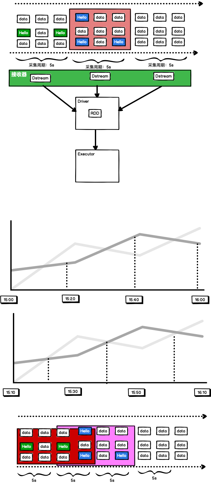
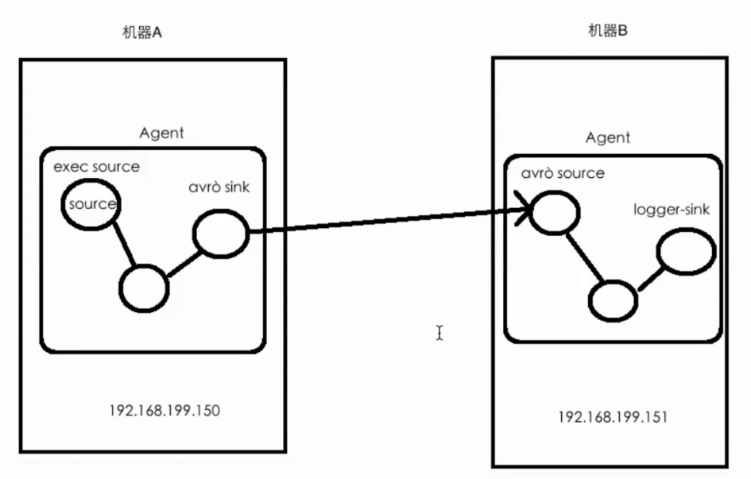
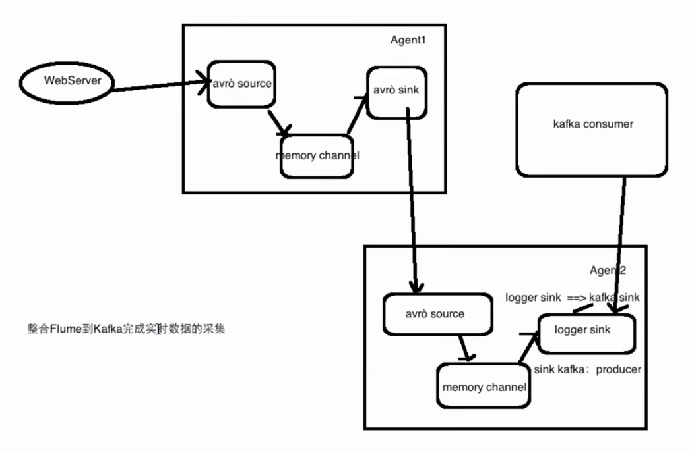
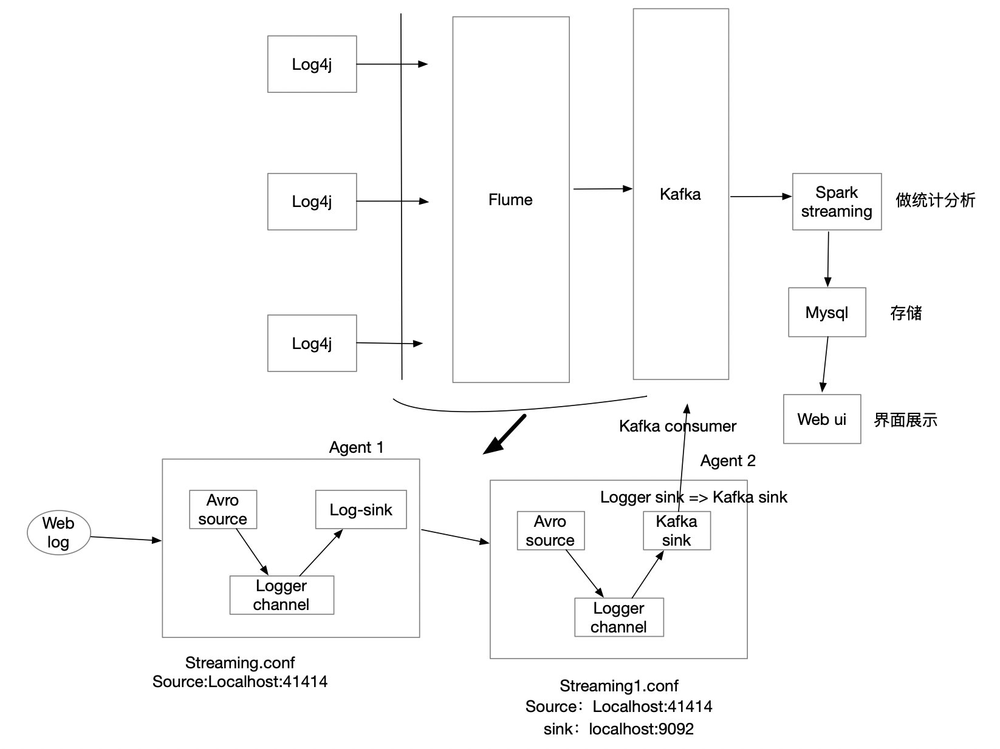

# Spark -Streaming

[toc]

### Spark Streaming是什么

​		Spark Streaming用于流式数据的处理。Spark Streaming支持的数据输入源很多，例如：Kafka、Flume、Twitter、ZeroMQ和简单的TCP套接字等等。数据输入后可以用Spark的高度抽象原语如：map、reduce、join、window等进行运算。而结果也能保存在很多地方，如HDFS，数据库等

​		Spark Streaming使用离散化流(discretized stream)作为抽象表示，叫作DStream。**DStream 是随时间推移而收到的数据的序列**。在内部，**每个时间区间收到的数据都作为 RDD 存在**，而DStream是由这些RDD所组成的序列(因此得名“离散化”)。



### SparkStreaming架构


### 自定义数据源

​		需要继承Receiver，并实现onStart、onStop方法来自定义数据源采集。

```scala
class CustomerReceiver(host: String, port: Int) extends Receiver[String](StorageLevel.MEMORY_ONLY) {

  //最初启动的时候，调用该方法，作用为：读数据并将数据发送给Spark
  override def onStart(): Unit = {
    new Thread("Socket Receiver") {
      override def run() {
        receive()
      }
    }.start()
  }

  //读数据并将数据发送给Spark
  def receive(): Unit = {

    //创建一个Socket
    var socket: Socket = new Socket(host, port)

    //定义一个变量，用来接收端口传过来的数据
    var input: String = null

    //创建一个BufferedReader用于读取端口传来的数据
    val reader = new BufferedReader(new InputStreamReader(socket.getInputStream, StandardCharsets.UTF_8))

    //读取数据
    input = reader.readLine()

    //当receiver没有关闭并且输入数据不为空，则循环发送数据给Spark
    while (!isStopped() && input != null) {
      store(input)
      input = reader.readLine()
    }

    //跳出循环则关闭资源
    reader.close()
    socket.close()

    //重启任务
    restart("restart")
  }

  override def onStop(): Unit = {
    if (socket != null) {
      socket.close()
      socket = null
    }
  }
}
```

使用自定义的接收器：

```scala
//3.创建自定义receiver的Streaming
val lineStream = ssc.receiverStream(new CustomerReceiver("hadoop102", 9999))
```


### Flume


#### Flume概述

Flume is a distributed, reliable,
and available service for efficiently collecting(收集),
aggregating(聚合), and moving(移动) large amounts of log data


webserver(源端) => flume => hdfs(目的地)


Flume架构及核心组件

- 1) Source 收集

- 2) Channel 聚集

- 3) Sink 输出


#### Flume安装前置条件

Java Runtime Environment - Java 1.7 or later
Memory - Sufficient memory for configurations used by sources, channels or sinks
Disk Space - Sufficient disk space for configurations used by channels or sinks
Directory Permissions - Read/Write permissions for directories used by agent

#### 安装jdk

下载
解压到~/app
将java配置系统环境变量中: ~/.bash_profile
export JAVA_HOME=/home/hadoop/app/jdk1.8.0_144
export PATH=$JAVA_HOME/bin:$PATH
source下让其配置生效
检测: java -version


#### 安装Flume

下载
解压到~/app
将java配置系统环境变量中: ~/.bash_profile

```shell
export FLUME_HOME=/home/hadoop/app/apache-flume-1.6.0-cdh5.7.0-bin
export PATH=$FLUME_HOME/bin:$PATH
```

source下让其配置生效
**flume-env.sh的配置JAVA_HOME：export JAVA_HOME=/home/hadoop/app/jdk1.8.0_144**
**检测是否安装成功，在bin里面: flume-ng version**

source下让其配置生效
**flume-env.sh的配置JAVA_HOME：export JAVA_HOME=/home/hadoop/app/jdk1.8.0_144**
**检测是否安装成功，在bin里面: flume-ng version**

```shell
wangfulindeMacBook-Pro:bin wangfulin$ flume-ng version
Flume 1.6.0-cdh5.7.0
Source code repository: https://git-wip-us.apache.org/repos/asf/flume.git
Revision: 8f5f5143ae30802fe79f9ab96f893e6c54a105d1
Compiled by jenkins on Wed Mar 23 11:38:48 PDT 2016
From source with checksum 50b533f0ffc32db9246405ac4431872e
```


flume配置文件

```
example.conf: A single-node Flume configuration

使用Flume的关键就是写配置文件

A） 配置Source
B） 配置Channel
C） 配置Sink
D） 把以上三个组件串起来

a1: agent名称
r1: source的名称 
k1: sink的名称
c1: channel的名称

\# Name the components on this agent
a1.sources = r1
a1.sinks = k1
a1.channels = c1

\# Describe/configure the source
a1.sources.r1.type = netcat
a1.sources.r1.bind = hadoop000
a1.sources.r1.port = 44444

\# Describe the sink
a1.sinks.k1.type = logger

\# Use a channel which buffers events in memory
a1.channels.c1.type = memory

\# Bind the source and sink to the channel
a1.sources.r1.channels = c1
a1.sinks.k1.channel = c1
```


```
启动agent // a1就是配置文件的名称
flume-ng agent \
--name a1 \
--conf $FLUME_HOME/conf \
--conf-file $FLUME_HOME/conf/example.conf \
-Dflume.root.logger=INFO,console

使用telnet进行测试： telnet localhost 44444
mac使用 nc localhost 44444


Event: { headers:{} body: 68 65 6C 6C 6F 0D hello. }
Event是FLume数据传输的基本单元
Event = 可选的header + byte array
```

 需求二：

实时监控某文件内容 输出到控制台

Agent选型：exec source + memory channel + logger sink

```
example.conf: A single-node Flume configuration

使用Flume的关键就是写配置文件

A） 配置Source
B） 配置Channel
C） 配置Sink
D） 把以上三个组件串起来

a1: agent名称
r1: source的名称 
k1: sink的名称
c1: channel的名称

\# Name the components on this agent
a1.sources = r1
a1.sinks = k1
a1.channels = c1

\# Describe/configure the source
a1.sources.r1.type = exec
a1.sources.r1.command = tail -F /home/hadoop/data..文件路径
a1.sources.r1.shell = /bin/sh -c

\# Describe the sink
a1.sinks.k1.type = logger

\# Use a channel which buffers events in memory
a1.channels.c1.type = memory

\# Bind the source and sink to the channel
a1.sources.r1.channels = c1
a1.sinks.k1.channel = c1
```

```
启动agent
flume-ng agent \
--name a1 \
--conf $FLUME_HOME/conf \
--conf-file $FLUME_HOME/conf/exec-memory-logger.conf \
-Dflume.root.logger=INFO,console
```

 需求三：

将A服务器的日志实时采集到B服务器上



机器A：exec source + memory channel + avro sink
机器B：avro source + memory channel + logger sink

机器A: exec-memory-avro.conf配置

```conf
exec-memory-avro.sources = exec-source
exec-memory-avro.sinks = avro-sink
exec-memory-avro.channels = memory-channel

exec-memory-avro.sources.exec-source.type = exec
exec-memory-avro.sources.exec-source.command = tail -F /Users/wangfulin/bigdata/data/test.log
exec-memory-avro.sources.exec-source.shell = /bin/sh -c

## sink改了 这里sink的目的地就是下一台机子的source
exec-memory-avro.sinks.avro-sink.type = avro
exec-memory-avro.sinks.avro-sink.hostname = localhost
exec-memory-avro.sinks.avro-sink.port = 44444

exec-memory-avro.channels.memory-channel.type = memory

exec-memory-avro.sources.exec-source.channels = memory-channel
exec-memory-avro.sinks.avro-sink.channel = memory-channel
```

机器B，avro-memory-logger.conf配置：

```
avro-memory-logger.sources = avro-source
avro-memory-logger.sinks = logger-sink
avro-memory-logger.channels = memory-channel

avro-memory-logger.sources.avro-source.type = avro
avro-memory-logger.sources.avro-source.bind = localhost
avro-memory-logger.sources.avro-source.port = 44444

avro-memory-logger.sinks.logger-sink.type = logger

avro-memory-logger.channels.memory-channel.type = memory

avro-memory-logger.sources.avro-source.channels = memory-channel
avro-memory-logger.sinks.logger-sink.channel = memory-channel
```


### 单结点单broke

配置server.properties

```
$KAFKA_HOME/config/server.properties
broker.id=0
listeners
host.name
log.dirs
zookeeper.connect
```

#### 启动Kafka

```
kafka-server-start.sh
USAGE: /home/hadoop/app/kafka_2.11-0.9.0.0/bin/kafka-server-start.sh [-daemon] server.properties [--override property=value]*

kafka-server-start.sh $KAFKA_HOME/config/server.properties
```

#### 创建topic: zk

```
kafka-topics.sh --create --zookeeper localhost:2181 --replication-factor 1 --partitions 1 --topic hello_topic
```

#### 查看所有topic

```
kafka-topics.sh --list --zookeeper localhost:2181
```

#### 发送消息:指定 broker地址

重点：发送消息是生产者发送，

```
kafka-console-producer.sh --broker-list localhost:9092 --topic hello_topic
```

#### 消费消息: 指定zk地址

重点

```
kafka-console-consumer.sh --zookeeper localhost:2181 --topic hello_topic --from-beginning
```

#### from-beginning的使用

查看**所有topic**的详细信息：kafka-topics.sh --describe --zookeeper localhost:2181
查看**指定topic**的详细信息：kafka-topics.sh --describe --zookeeper localhost:2181 --topic hello_topic

### 单节点多broker

拷贝server.properties，重新配置

```
server-1.properties
log.dirs=/home/hadoop/app/tmp/kafka-logs-1
listeners=PLAINTEXT://:9093
broker.id=1

server-2.properties
log.dirs=/home/hadoop/app/tmp/kafka-logs-2
listeners=PLAINTEXT://:9094
broker.id=2

server-3.properties
log.dirs=/home/hadoop/app/tmp/kafka-logs-3
listeners=PLAINTEXT://:9095
broker.id=3
```

#### 启动

```
kafka-server-start.sh -daemon $KAFKA_HOME/config/server-1.properties &
kafka-server-start.sh -daemon $KAFKA_HOME/config/server-2.properties &
kafka-server-start.sh -daemon $KAFKA_HOME/config/server-3.properties &
```

#### 创建topic

```
kafka-topics.sh --create --zookeeper localhost:2181 --replication-factor 3 --partitions 1 --topic my-replicated-topic
```

#### 查看topic

所有topic

```
kafka-console-producer.sh --broker-list 
```

生产者

```
kafka-console-producer.sh --broker-list  localhost:9093,localhost:9094,localhost:9095 --topic my-replicated-topic
```

消费者

```
kafka-console-consumer.sh --zookeeper localhost:2181 --topic my-replicated-topic
```

查看指定topic

kafka-topics.sh --describe --zookeeper localhost:2181 --topic my-replicated-topic 

### 从kafka中采集数据

```scala
object KafkaSparkStreaming {

  def main(args: Array[String]): Unit = {

    //1.创建SparkConf并初始化SSC
    val sparkConf: SparkConf = new SparkConf().setMaster("local[*]").setAppName("KafkaSparkStreaming")
    val ssc = new StreamingContext(sparkConf, Seconds(5))

    //2.定义kafka参数
    val brokers = "hadoop102:9092,hadoop103:9092,hadoop104:9092"
    val topic = "source"
    val consumerGroup = "spark"

    //3.将kafka参数映射为map
    val kafkaParam: Map[String, String] = Map[String, String](
      ConsumerConfig.KEY_DESERIALIZER_CLASS_CONFIG -> "org.apache.kafka.common.serialization.StringDeserializer",
      ConsumerConfig.VALUE_DESERIALIZER_CLASS_CONFIG -> "org.apache.kafka.common.serialization.StringDeserializer",
      ConsumerConfig.GROUP_ID_CONFIG -> consumerGroup,
      ConsumerConfig.BOOTSTRAP_SERVERS_CONFIG -> brokers
    )

    //4.通过KafkaUtil创建kafkaDSteam
    val kafkaDSteam: ReceiverInputDStream[(String, String)] = KafkaUtils.createStream[String, String, StringDecoder, StringDecoder](
      ssc,
      kafkaParam,
      Set(topic),
      StorageLevel.MEMORY_ONLY
    )

    //5.对kafkaDSteam做计算（WordCount）
    kafkaDSteam.foreachRDD {
      rdd => {
        val word: RDD[String] = rdd.flatMap(_._2.split(" "))
        val wordAndOne: RDD[(String, Int)] = word.map((_, 1))
        val wordAndCount: RDD[(String, Int)] = wordAndOne.reduceByKey(_ + _)
        wordAndCount.collect().foreach(println)
      }
    }

    //6.启动SparkStreaming
    ssc.start()
    ssc.awaitTermination()
  }
}
```


### 整合kafka-flume



整合Flume和Kafka的综合使用

avro-memory-kafka.conf

```
avro-memory-kafka.sources = avro-source
avro-memory-kafka.sinks = kafka-sink
avro-memory-kafka.channels = memory-channel

avro-memory-kafka.sources.avro-source.type = avro
avro-memory-kafka.sources.avro-source.bind = localhost
avro-memory-kafka.sources.avro-source.port = 44444

avro-memory-kafka.sinks.kafka-sink.type = org.apache.flume.sink.kafka.KafkaSink
avro-memory-kafka.sinks.kafka-sink.brokerList = localhost:9092
avro-memory-kafka.sinks.kafka-sink.topic = hello_topic
avro-memory-kafka.sinks.kafka-sink.batchSize = 5
avro-memory-kafka.sinks.kafka-sink.requiredAcks =1

avro-memory-kafka.channels.memory-channel.type = memory

avro-memory-kafka.sources.avro-source.channels = memory-channel
avro-memory-kafka.sinks.kafka-sink.channel = memory-channel
```


```shell
先启动avro-memory-kafka
flume-ng agent \
--name avro-memory-kafka \
--conf $FLUME_HOME/conf \
--conf-file $FLUME_HOME/conf/avro-memory-kafka.conf \
-Dflume.root.logger=INFO,console


flume-ng agent \
--name exec-memory-avro \
--conf $FLUME_HOME/conf \
--conf-file $FLUME_HOME/conf/exec-memory-avro.conf \
-Dflume.root.logger=INFO,console
```


### sparkStreaming数据流程

工作原理：粗粒度

Spark Streaming接收到实时数据流，把数据按照指定的**时间段**切成一片片小的数据块，
然后把小的数据块传给Spark Engine处理。

 


### DStream转换

​		DStream上的原语与RDD的类似，分为Transformations（转换）和Output Operations（输出）两种，此外转换操作中还有一些比较特殊的原语，如：updateStateByKey()、transform()以及各种Window相关的原语。

#### 无状态转化操作

​		无状态转化操作就是把简单的RDD转化操作应用到每个批次上，也就是转化DStream中的每一个RDD。部分无状态转化操作列在了下表中。注意，针对键值对的DStream转化操作(比如 reduceByKey())要添加import StreamingContext._才能在Scala中使用。


​		需要记住的是，尽管这些函数看起来像作用在整个流上一样，但事实上每个DStream在内部是**由许多RDD(批次)组成**，且无状态转化操作是分别应用到每个RDD上的。例如，reduceByKey()会归约每个时间区间中的数据，但不会归约不同区间之间的数据。 

​		举个例子，在之前的wordcount程序中，**只会统计5秒内接收到**的数据的单词个数，而不会累加。

​		无状态转化操作也能在多个DStream间整合数据，不过也是在各个时间区间内。例如，键-值对DStream拥有和RDD一样的与连接相关的转化操作，也就是cogroup()、join()、leftOuterJoin() 等。我们可以在DStream上使用这些操作，这样就对每个批次分别执行了对应的RDD操作。

​		还可以像在常规的Spark 中一样使用 DStream的union() 操作将它和另一个DStream 的内容合并起来，也可以使用StreamingContext.union()来合并多个流

#### 有状态转化操作

​		UpdateStateByKey用于记录历史记录，有时，我们需要在 DStream 中**跨批次维护状态**(例如流计算中累加wordcount)。针对这种情况，updateStateByKey() 为我们提供了对一个状态变量的访问，用于键值对形式的 DStream。给定一个由(键，事件)对构成的 DStream，并传递一个指定如何根据新的事件 更新每个键对应状态的函数，它可以构建出一个新的 DStream，其内部数据为(键，状态) 对。 

​		**updateStateByKey() 的结果会是一个新的 DStream，其内部的 RDD 序列是由每个时间区间对应的(键，状态)对组成的。**

​		updateStateByKey操作使得我们可以在用新信息进行更新时保持任意的状态。为使用这个功能，你需要做下面两步： 

1. 定义状态，状态可以是一个任意的数据类型。 
2. 定义状态更新函数，用此函数阐明如何使用之前的状态和来自输入流的新值对状态进行更新。


**重点：**

 **使用updateStateByKey需要对检查点目录进行配置，会使用检查点来保存状态**。


### Window Operations

​		Window Operations可以**设置窗口的大小和滑动窗口的间隔来动态的获取当前Steaming的允许状态**。基于窗口的操作会在一个比 StreamingContext 的批次间隔更长的时间范围内，通过整合多个批次的结果，计算出整个窗口的结果。


​		**注意：所有基于窗口的操作都需要两个参数，分别为窗口时长以及滑动步长，两者都必须是 StreamContext 的批次间隔的整数倍。**


​		窗口时长控制每次计算最近的多少个批次的数据，其实就是最近的 windowDuration/batchInterval 个批次。如果有一个以 10 秒为批次间隔的源 DStream，要创建一个最近 30 秒的时间窗口(即最近 3 个批次)，就应当把 windowDuration 设为 30 秒。而滑动步长的默认值与批次间隔相等，用来控制对新的 DStream 进行计算的间隔。如果源 DStream 批次间隔为 10 秒，并且我们只希望每两个批次计算一次窗口结果， 就应该把滑动步长设置为 20 秒。 

​		假设，你想拓展前例从而每隔十秒对持续30秒的数据生成word count。为做到这个，我们需要在持续30秒数据的(word,1)对DStream上应用reduceByKey。使用操作reduceByKeyAndWindow.

```
# reduce last 30 seconds of data, every 10 second

windowedWordCounts = pairs.reduceByKeyAndWindow(lambda x, y: x + y, lambda x, y: x -y, 30, 20)
```


（1）window(windowLength, slideInterval): 基于对源DStream窗化的批次进行计算返回一个新的Dstream

（2）countByWindow(windowLength, slideInterval)：返回一个滑动窗口计数流中的元素。

（3）reduceByWindow(func, windowLength, slideInterval)：通过使用自定义函数整合滑动区间流元素来创建一个新的单元素流。

（4）reduceByKeyAndWindow(func, windowLength, slideInterval, [numTasks])：当在一个(K,V)对的DStream上调用此函数，会返回一个新(K,V)对的DStream，此处通过对滑动窗口中批次数据使用reduce函数来整合每个key的value值。Note:默认情况下，这个操作使用Spark的默认数量并行任务(本地是2)，在集群模式中依据配置属性(spark.default.parallelism)来做grouping。你可以通过设置可选参数numTasks来设置不同数量的tasks。

（5）reduceByKeyAndWindow(func, invFunc, windowLength, slideInterval, [numTasks])：这个函数是上述函数的更高效版本，每个窗口的reduce值都是通过用前一个窗的reduce值来递增计算。通过reduce进入到滑动窗口数据并”反向reduce”离开窗口的旧数据来实现这个操作。一个例子是随着窗口滑动对keys的“加”“减”计数。通过前边介绍可以想到，这个函数只适用于”可逆的reduce函数”，也就是这些reduce函数有相应的”反reduce”函数(以参数invFunc形式传入)。如前述函数，reduce任务的数量通过可选参数来配置。注意：为了使用这个操作，[检查点](#checkpointing)必须可用。 

（6）countByValueAndWindow(windowLength,slideInterval, [numTasks])：对(K,V)对的DStream调用，返回(K,Long)对的新DStream，其中每个key的值是其在滑动窗口中频率。如上，可配置reduce任务数量。

reduceByWindow() 和 reduceByKeyAndWindow() 让我们可以对每个窗口更高效地进行归约操作。它们接收一个归约函数，在整个窗口上执行，比如 +。除此以外，它们还有一种特殊形式，通过只考虑新进入窗口的数据和离开窗口的数据，让 Spark 增量计算归约结果。这种特殊形式需要提供归约函数的一个逆函数，比 如 + 对应的逆函数为 -。对于较大的窗口，提供逆函数可以大大提高执行效率 

### Transform

​		Transform允许DStream上执行任意的RDD-to-RDD函数。即使这些函数并没有在DStream的API中暴露出来，通过该函数可以方便的扩展Spark API。该函数每一批次调度一次。其实也就是对DStream中的RDD应用转换


### DStream输出

（1）print()：在运行流程序的驱动结点上打印DStream中每一批次数据的最开始10个元素。这用于开发和调试。在Python API中，同样的操作叫print()。

（2）saveAsTextFiles(prefix, [suffix])：以text文件形式存储这个DStream的内容。**每一批次的存储文件名基于参数中的prefix和suffix**。”prefix-Time_IN_MS[.suffix]”. 

（3）saveAsObjectFiles(prefix, [suffix])：以Java对象序列化的方式将Stream中的数据保存为 SequenceFiles . 每一批次的存储文件名基于参数中的为"prefix-TIME_IN_MS[.suffix]". Python中目前不可用。

（4）saveAsHadoopFiles(prefix, [suffix])：将Stream中的数据保存为 Hadoop files. 每一批次的存储文件名基于参数中的为"prefix-TIME_IN_MS[.suffix]"。
Python API Python中目前不可用。

（5）foreachRDD(func)：**这是最通用的输出操作**，即将函数 func 用于产生于 stream的每一个RDD。其中参数传入的函数func应该实现将每一个RDD中数据推送到外部系统，如将RDD存入文件或者通过网络将其写入数据库。注意：函数func在运行流应用的驱动中被执行，同时其中一般函数RDD操作从而强制其对于流RDD的运算。（把每个RDD做遍历）

​		通用的输出操作foreachRDD()，它用来对DStream中的RDD运行任意计算。这和transform() 有些类似，都可以让我们访问任意RDD。在foreachRDD()中，可以重用我们在Spark中实现的所有行动操作。


**比如，常见的用例之一是把数据写到诸如MySQL的外部数据库中。 注意**：

（1）连接不能写在driver层面；（因为无法序列化）

（2）如果写在foreach则每个RDD都创建，得不偿失；

（3）增加foreachPartition，在分区创建。

## 实战

### 基本概念

#### StreamingContext

```java
def this(sparkContext: SparkContext, batchDuration: Duration) = {
this(sparkContext, null, batchDuration)
}

def this(conf: SparkConf, batchDuration: Duration) = {
this(StreamingContext.createNewSparkContext(conf), null, batchDuration)
}
```

batch interval可以根据你的应用程序需求的延迟要求以及集群可用的资源情况来设置


一旦StreamingContext定义好之后，就可以做一些事情

##### Points to remember:

- Once a context has been started, no new streaming computations can be set up or added to it.
- Once a context has been stopped, it cannot be restarted.
- Only one StreamingContext can be active in a JVM at the same time.
- stop() on StreamingContext also stops the SparkContext. To stop only the StreamingContext, set the optional parameter of `stop()` called `stopSparkContext` to false.
- A SparkContext can be re-used to create multiple StreamingContexts, as long as the previous StreamingContext is stopped (without stopping the SparkContext) before the next StreamingContext is created.

- 一旦上下文已启动，就无法设置新的流计算或将其添加到其中。

- 上下文停止后，将无法重新启动。

- JVM中只能同时激活一个StreamingContext。

- StreamingContext上的stop（）也会停止SparkContext。要仅停止StreamingContext，请将名为stopSparkContext的stop（）的可选参数设置为false。

- 只要在创建下一个StreamingContext之前停止了上一个StreamingContext（不停止SparkContext），就可以重新使用SparkContext创建多个StreamingContext。

#### DStreams

Internally, a DStream is represented by a continuous series of RDDs
Each RDD in a DStream contains data from a certain interval

在内部，DStream由一系列连续的RDD表示DStream中的每个RDD都包含特定间隔的数据

对DStream操作算子，比如map/flatMap，其实底层会被翻译为对DStream中的每个RDD都做相同的操作；
因为一个DStream是由不同批次的RDD所构成的。


#### Input DStreams and Receivers

Every input DStream (except file stream, discussed later in this section)
is associated with a Receiver object which receives the data from a source and stores it
in Spark’s memory for processing.

 每一个input DStream都需要关联一个Receiver，除了文件系统。因为以网络传输的steam 的返回值是ReceiverInputDStream。ReceiverInputDStream继承InputDStream。而TextFileStream，返回就是DStream。

不要使用local或者local[1],这样意味着，只有一个线程可以使用。

Hence, when running locally, always use “local[*n*]” as the master URL, where *n* > number of receivers to run 


#### 处理socket数据实战

这两个jar包很重要

```xml
    <dependency>
      <groupId>com.fasterxml.jackson.module</groupId>
      <artifactId>jackson-module-scala_2.11</artifactId>
      <version>2.6.5</version>
    </dependency>

    <dependency>
      <groupId>net.jpountz.lz4</groupId>
      <artifactId>lz4</artifactId>
      <version>1.3.0</version>
    </dependency>
```


```scala
import org.apache.spark.SparkConf
import org.apache.spark.streaming.{Seconds, StreamingContext}
object NetworkWordCount {

  def main(args: Array[String]): Unit = {


    val sparkConf = new SparkConf().setMaster("local[4]").setAppName("NetworkWordCount")

    /**
     * 创建StreamingContext需要两个参数：SparkConf和batch interval
     */
    val ssc = new StreamingContext(sparkConf, Seconds(5))

    val lines = ssc.socketTextStream("localhost", 6339)

    val result = lines.flatMap(_.split(" ")).map((_,1)).reduceByKey(_+_)

    result.print()

    ssc.start()
    ssc.awaitTermination()
  }
}

```

#### 处理文件系统数据实战

```scala
import org.apache.spark.SparkConf
import org.apache.spark.streaming.{Seconds, StreamingContext}

object FileWordCount {
  def main(args: Array[String]): Unit = {
    val sparkConf = new SparkConf().setMaster("local").setAppName("FileWordCount")
    val ssc = new StreamingContext(sparkConf, Seconds(5))

    // 监控的是目录
    val lines = ssc.textFileStream("file:///Users/wangfulin/bigdata/ss/")

    val result = lines.flatMap(_.split(" ")).map((_,1)).reduceByKey(_+_)
    result.print()

    ssc.start()
    ssc.awaitTermination()
  }
}
```

#### updateStateByKey算子

带状态的算子，**必须设置checkpoint**

需求：统计到目前为止累积出现的单词的个数(需要保持住以前的状态)

```scala
object StatefulWordCount {
  def main(args: Array[String]): Unit = {
    val sparkConf = new SparkConf().setMaster("local[2]").setAppName("StatefulWordCount")
    val ssc = new StreamingContext(sparkConf, Seconds(5))

    // 如果使用了stateful的算子，必须要设置checkpoint
    // 在生产环境中，建议大家把checkpoint设置到HDFS的某个文件夹中
    ssc.checkpoint(".")

    val lines = ssc.socketTextStream("localhost", 6789)

    val result = lines.flatMap(_.split(" ")).map((_, 1))

    val state = result.updateStateByKey(updateFunction _)
    state.print()

    ssc.start()
    ssc.awaitTermination()
  }

  /**
   * update函数
   * 把当前的数据去更新已有的或者是老的数据
   *
   * @param currentValues 当前的
   * @param preValues     老的
   * @return
   */
  def updateFunction(currentValues: Seq[Int], preValues: Option[Int]): Option[Int] = {
    val current = currentValues.sum
    val pre = preValues.getOrElse(0)

    Some(current + pre)
  }
}
```

官网代码（两个重要参数：newValues、running）：

```scala
def updateFunction(newValues: Seq[Int], runningCount: Option[Int]): Option[Int] = {  val newCount = ... // add the new values with the previous running count to get the new count 
                                                                                   Some(newCount)
}
```

自定义代码

```scala
def updateFunction(currentValues: Seq[Int], preValues: Option[Int]): Option[Int] = {
  val current = currentValues.sum
  val pre = preValues.getOrElse(0)
  Some(current + pre)
 }
```

The update function will be called for each word, with `newValues` having a sequence of 1’s (from the `(word, 1)` pairs) and the `runningCount` having the previous count.

将为每个单词调用update函数，其中newValues的序列为1（从（word，1）对开始），而runningCount具有先前的计数。

Note that using `updateStateByKey` requires the checkpoint directory to be configured, which is discussed in detail in the [checkpointing](https://spark.apache.org/docs/latest/streaming-programming-guide.html#checkpointing) section.

必须配置检查点目录

请注意，使用`updateStateByKey`需要配置检查点目录，这在[checkpointing]（https://spark.apache.org/docs/latest/streaming-programming-guide.html#checkpointing）部分中进行了详细讨论 。


#### 计算到目前为止累计出现的单词个数写到mysql中

表

```mysql
CREATE TABLE wordcount(
word varchar(50) DEFAULT null,
wordcount int(10) DEFAULT null
);
```


```scala
object ForeachRDDApp {
  def main(args: Array[String]): Unit = {
    val sparkConf = new SparkConf().setAppName("ForeachRDDApp").setMaster("local[2]")
    val ssc = new StreamingContext(sparkConf, Seconds(5))


    val lines = ssc.socketTextStream("localhost", 6789)

    val result = lines.flatMap(_.split(" ")).map((_, 1)).reduceByKey(_ + _)

    // 报错 org.apache.spark.SparkException: Task not serializable
    /*    result.foreachRDD(rdd => {
          val connection = createConnection() // executed at the driver
          rdd.foreach { record =>
            val sql = "insert into wordcount(word, wordcount) values('" + record._1 + "'," + record._2 + ")"
            connection.createStatement().execute(sql)
          }
        })*/

    result.print()

    result.foreachRDD(rdd => {
      rdd.foreachPartition(partitionOfRecords => {
        // 在每个Partition里面做连接
        val connection = createConnection()
        partitionOfRecords.foreach(record => {
          val sql = "insert into wordcount(word, wordcount) values('" + record._1 + "'," + record._2 + ")"
          connection.createStatement().execute(sql)
        })

        connection.close()
      })
    })

    ssc.start()
    ssc.awaitTermination()
  }

  /**
   * 获取MySQL的连接
   */
  def createConnection() = {
    Class.forName("com.mysql.jdbc.Driver")
    DriverManager.getConnection("jdbc:mysql://localhost:3306/imooc_project", "root", "123456")
  }
}
```

报错分析：

1、connection.createStatement().execute(sql)//没有驱动包，自己引入

2、第一种官网连接会报序列化错误，自己改成partition式连接，如上面代码

3、重复执行，mysql数据库的列名会重复出现，自行使用Hbase或redis等数据库

4、改成连接池的方式

改进版，用set存储key，不存在set中，

```scala
object ForeachRDDAppPro {
  def main(args: Array[String]): Unit = {
    val sparkConf = new SparkConf().setAppName("ForeachRDDApp").setMaster("local[2]")
    val ssc = new StreamingContext(sparkConf, Seconds(5))


    val lines = ssc.socketTextStream("localhost", 6789)

    val result = lines.flatMap(_.split(" ")).map((_, 1)).reduceByKey(_ + _)

    result.print()


    var rs: ResultSet = null
    var stmt: PreparedStatement = null
    var supdate: PreparedStatement = null

    result.foreachRDD(rdd => {
      rdd.foreachPartition(partitionOfRecords => {

        partitionOfRecords.foreach(record => {
          val connection = JDBCConnectePools.getConn()
          // 在集合set中是否有这个key，如果有的话，则从数据库中取对应的值，并更新数据
          if (Remenber.keySet.contains(record._1)) {
            var preWordCount = 0
            var newWordCount = 0
            val querySql = "select wordcount from wordcount where word = ?"
            stmt = connection.prepareStatement(querySql)
            stmt.setString(1, record._1)
            rs = stmt.executeQuery()
            if (rs.next()) {
              preWordCount = rs.getInt("wordcount")
              newWordCount = preWordCount + record._2
            }
            val updateSql = "update wordcount set wordcount = ? where word = ?"
            supdate = connection.prepareStatement(updateSql)
            supdate.setInt(1, newWordCount)
            supdate.setString(2, record._1)
            supdate.executeUpdate()
          } else {
            Remenber.keySet += record._1
            val sql = "insert into wordcount(word, wordcount) values('" + record._1 + "'," + record._2 + ")"
            connection.createStatement().execute(sql)
          }
          JDBCConnectePools.returnConn(connection)

        })
      })
    })


    ssc.start()
    ssc.awaitTermination()
  }

  /**
   * 获取MySQL的连接
   */
/*  def createConnection() = {
    Class.forName("com.mysql.jdbc.Driver")
    DriverManager.getConnection("jdbc:mysql://localhost:3306/imooc_project", "root", "123456")
  }*/
}

object Remenber{
  var keySet: Set[String] = Set()
}

object JDBCConnectePools {
  private val max = 10 //设置连接最大数
  private val ConnectionNum = 10 //设置 每次可以获取几个Connection
  private var conNum = 0 //连接数
  private val pool = new util.LinkedList[Connection]() //连接池

  def getDriver(): Unit = { //加载Driver
    //加载
    //这里判断的两个空不能去掉
    //可能有人以为在调用getDriver方法时已经判断过pool.isEmpty了，
    //在进行判断是没有意义的，而且当 连接数已经大于等于max时，会死循环
    //但是要考虑到运行过成中，在spark中是多线程运行的，在调用
    //getConnection方法时，可能当时pool中是空的，但是在调用后，
    //可能其他线程的数据运行完了，会还连接，
    //那么此时再进行判断时pool就不是空了，两个调教都不成立，
    //才能跳出循环，此时的情况是，获取的连接数已经大于等最大（max）的值
    //并且 已经有人把连接换了， 就可以直接取连接了，不用再创建
    //，也不能再创建
    if (conNum < max && pool.isEmpty) { //
      Class.forName("com.mysql.jdbc.Driver")

    } else if (conNum >= max && pool.isEmpty) {
      print("当前暂无可用Connection")
      Thread.sleep(2000)
      getDriver()
    }
  }

  def getConn(): Connection = {
    if (pool.isEmpty) {
      getDriver()
      for (i <- 1 to ConnectionNum) { //创建10个连接
        val conn = DriverManager.getConnection("jdbc:mysql://localhost:3306/imooc_project", "root", "123456")
        pool.push(conn) //  把连接放到连接池中，push是LinkedList中的方法
        conNum += 1
      }
    }
    val conn: Connection = pool.pop() //从线程池所在LinkedList中弹出一个Connection,pop 是LinkedList的方法
    conn //返回一个Connection
  }

  def returnConn(conn: Connection): Unit = { //还连接
    pool.push(conn)
  }

}

```

参考：https://blog.csdn.net/Lu_Xiao_Yue/article/details/83997833


#### 实战：窗口函数的使用

```scala
val windowedWordCounts = pairs.reduceByKeyAndWindow((a:Int,b:Int) => (a + b), Seconds(30), Seconds(10))
```

window：定时的进行一个时间段内的数据处理


- *window length* - The duration of the window (3 in the figure).
- *sliding interval* - The interval at which the window operation is performed (2 in the figure).

#### Transform实战

Transform允许DStream上执行任意的RDD-to-RDD函数。

需求：黑名单过滤

访问日志 ==> DStream
20180808,zs
20180808,ls
20180808,ww

转成 ==> (zs: 20180808,zs)(ls: 20180808,ls)(ww: 20180808,ww)

黑名单列表 ==> RDD
zs
ls
转成 ==>(zs: true)(ls: true)


==> 20180808,ww

leftjoin
(zs: [<20180808,zs>, <true>]) x
(ls: [<20180808,ls>, <true>]) x
(ww: [<20180808,ww>, <false>]) ==> tuple 1

```scala
/**
 * 黑名单过滤 Transform操作
 */

object TransformApp {
  def main(args: Array[String]): Unit = {
    val sparkConf = new SparkConf().setMaster("local[2]").setAppName("TransformApp")

    /**
     * 创建StreamingContext需要两个参数：SparkConf和batch interval
     */
    val ssc = new StreamingContext(sparkConf, Seconds(5))

    /**
     * 构建黑名单
     */
    val blacks = List("zs", "ls")
    // ==>(zs: true)(ls: true)
    val blacksRDD = ssc.sparkContext.parallelize(blacks).map(x => (x, true))

    val lines = ssc.socketTextStream("localhost", 6789)

    // 输入 20180808,zs
    val clickLog = lines.map(x => (x.split(",")(1), x)) //(zs: 20180808,zs) DStream ==> RDD
      .transform(rdd => {
        rdd.leftOuterJoin(blacksRDD) // (zs: [<20180808,zs>, <true>])
          .filter(x => x._2._2.getOrElse(false) != true) //第二位里面的第二位 不等于true的留下
          .map(x => x._2._1) // 只需要第二个里面的第一个数据
      })
    clickLog.print()

    ssc.start()
    ssc.awaitTermination()
  }
}
```

输入

```
20180808,zs
20180808,ls
20180808,ww
```

#### Spark Streaming整合Spark SQL完成词频统计操作

```scala
object SqlNetworkWordCount {

  def main(args: Array[String]): Unit = {
    val sparkConf = new SparkConf().setAppName("ForeachRDDApp").setMaster("local[2]")
    val ssc = new StreamingContext(sparkConf, Seconds(5))

    val lines = ssc.socketTextStream("localhost", 6789)
    val words = lines.flatMap(_.split(" "))

    // Convert RDDs of the words DStream to DataFrame and run SQL query
    words.foreachRDD { (rdd: RDD[String], time: Time) =>
      val spark = SparkSessionSingleton.getInstance(rdd.sparkContext.getConf)
      import spark.implicits._

      // Convert RDD[String] to RDD[case class] to DataFrame
      val wordsDataFrame = rdd.map(w => Record(w)).toDF()

      // Creates a temporary view using the DataFrame
      wordsDataFrame.createOrReplaceTempView("words")

      // Do word count on table using SQL and print it
      val wordCountsDataFrame =
        spark.sql("select word, count(*) as total from words group by word")
      println(s"========= $time =========")
      wordCountsDataFrame.show()
    }


    ssc.start()
    ssc.awaitTermination()
  }


  /** Case class for converting RDD to DataFrame */
  case class Record(word: String)


  /** Lazily instantiated singleton instance of SparkSession */
  object SparkSessionSingleton {

    @transient  private var instance: SparkSession = _

    def getInstance(sparkConf: SparkConf): SparkSession = {
      if (instance == null) {
        instance = SparkSession
          .builder
          .config(sparkConf)
          .getOrCreate()
      }
      instance
    }
  }
}
```


### Spark Streaming整合Flume

#### Flume-style Push-based Approach 模式

Due to the push model, **the streaming application needs to be up**, with the receiver scheduled and listening on the chosen port, for Flume to be able to push data.


**Push方式整合**

Flume Agent的编写： flume_push_streaming.conf

```
simple-agent.sources = netcat-source
simple-agent.sinks = avro-sink
simple-agent.channels = memory-channel

simple-agent.sources.netcat-source.type = netcat
simple-agent.sources.netcat-source.bind = localhost
simple-agent.sources.netcat-source.port = 44444

simple-agent.sinks.avro-sink.type = avro
simple-agent.sinks.avro-sink.hostname = localhost
simple-agent.sinks.avro-sink.port = 41414

simple-agent.channels.memory-channel.type = memory

simple-agent.sources.netcat-source.channels = memory-channel
simple-agent.sinks.avro-sink.channel = memory-channel
```

```
flume-ng agent \
--name simple-agent \
--conf $FLUME_HOME/conf \
--conf-file $FLUME_HOME/conf/flume_push_streaming.conf \
-Dflume.root.logger=INFO,console
```


```scala
object FlumePushWordCount {
  def main(args: Array[String]): Unit = {
    val sparkConf = new SparkConf().setMaster("local[2]").setAppName("FlumePushWordCount")
    val ssc = new StreamingContext(sparkConf, Seconds(5))

    //TODO... 如何使用SparkStreaming整合Flume
    val flumeStream = FlumeUtils.createStream(ssc, "localhost", 41414)

    flumeStream.map(x => new String(x.event.getBody.array()).trim)
      .flatMap(_.split(" ")).map((_, 1)).reduceByKey(_ + _).print()
    
    ssc.start()
    ssc.awaitTermination()

  }
}
```

**注意点：先启动启动Spark Streaming应用程序,后启动flume** 


#### Approach 2: Pull-based Approach using a Custom Sink

**（推荐）**

Pull**方式整合**

这种方法不是运行Flume将数据直接推送到Spark Streaming，而是运行自定义的Flume接收器，该接收器可以执行以下操作。

- Flume将数据推入接收器，并且数据保持缓冲状态。
- Spark Streaming使用[可靠的Flume接收器](https://spark.apache.org/docs/latest/streaming-programming-guide.html#receiver-reliability) 和事务从[接收器](https://spark.apache.org/docs/latest/streaming-programming-guide.html#receiver-reliability)中提取数据。只有在Spark Streaming接收并复制了数据之后，事务才能成功。

与以前的方法相比，这确保了更强的可靠性和 [容错保证](https://spark.apache.org/docs/latest/streaming-programming-guide.html#fault-tolerance-semantics)。但是，这需要将Flume配置为运行自定义接收器

Flume Agent的编写： flume_pull_streaming.conf

```
simple-agent.sources = netcat-source
simple-agent.sinks = spark-sink
simple-agent.channels = memory-channel

simple-agent.sources.netcat-source.type = netcat
simple-agent.sources.netcat-source.bind = localhost
simple-agent.sources.netcat-source.port = 44444

simple-agent.sinks.spark-sink.type = org.apache.spark.streaming.flume.sink.SparkSink
simple-agent.sinks.spark-sink.hostname = localhost
simple-agent.sinks.spark-sink.port = 41414

simple-agent.channels.memory-channel.type = memory

simple-agent.sources.netcat-source.channels = memory-channel
simple-agent.sinks.spark-sink.channel = memory-channel
```

**注意点：先启动flume 后启动Spark Streaming应用程序**

启动

```
flume-ng agent \
--name simple-agent \
--conf $FLUME_HOME/conf \
--conf-file $FLUME_HOME/conf/flume_pull_streaming.conf \
-Dflume.root.logger=INFO,console
```


### Spark Streaming整合Kafka

#### Approach 1: Receiver-based Approach

The Receiver is implemented using the Kafka high-level consumer API. As with all receivers, the data received from Kafka through a Receiver is stored in Spark executors, and then jobs launched by Spark Streaming processes the data.

接收器是使用Kafka高级消费者API实现的。 与所有接收器一样，通过接收器从Kafka接收的数据存储在Spark执行器中，然后由Spark Streaming启动的作业将处理数据。

但是，在默认配置下，此方法可能会在发生故障时丢失数据（请参阅[接收器可靠性](https://spark.apache.org/docs/latest/streaming-programming-guide.html#receiver-reliability)。为确保零数据丢失，您还必须在Spark Streaming（Spark 1.2中引入）中另外**启用预写日志**，从而同步保存所有接收到的日志。

操作步骤：

```
1.先启动zk：./zkServer.sh start

2.启动kafka：./kafka-server-start.sh -daemon $KAFKA_HOME/config/server.properties

3.创建topic

./kafka-topics.sh --create --zookeeper localhost:2181 --replication-factor 1 --partitions 1 --topic kafka_streaming_topic

./kafka-topics.sh --list --zookeeper localhost:2181

4.通过控制台测试是否能正常生产与消费

./kafka-console-producer.sh --broker-list localhost:9092 --topic kafka_streaming_topic

./kafka-console-consumer.sh --zookeeper localhost:2181 --topic kafka_streaming_topic

 
```


```scala
object KafkaReceiverWordCount {

  def main(args: Array[String]): Unit = {

    if (args.length != 4) {
      System.err.println("Usage: KafkaReceiverWordCount <zkQuorum> <group> <topics> <numThreads>")
    }

    val Array(zkQuorum, group, topics, numThreads) = args

    val sparkConf = new SparkConf() .setAppName("KafkaReceiverWordCount").setMaster("local[2]")

    val ssc = new StreamingContext(sparkConf, Seconds(5))

    val topicMap = topics.split(",").map((_, numThreads.toInt)).toMap

    // TODO... Spark Streaming如何对接Kafka
    val messages = KafkaUtils.createStream(ssc, zkQuorum, group, topicMap)

    // TODO... 自己去测试为什么要取第二个 注意是第二位参数
    messages.map(_._2).flatMap(_.split(" ")).map((_, 1)).reduceByKey(_ + _).print()

    ssc.start()
    ssc.awaitTermination()
  }
}
```

上生产：


### Direct Approach（常用 spark1.3引入）

**（推荐）**

特点：

- 1、简化了并行度，不需要多个Input Stream，只需要一个DStream

- 2、加强了性能，真正做到了0数据丢失，而Receiver方式需要写到WAL才可以（即副本存储），Direct方式没有Receiver

- 3、只执行一次

缺点：基于ZooKeeper的Kafka监控工具，无法展示出来，所以需要周期性地访问offset才能更新到ZooKeeper去

操作：

参数只需要传brokers与topics，注意查看源码与泛型看返回类型并构造出来

关键代码：

```scala
val topicsSet = topics.split(",").toSet
val kafkaParams = Map[String,String]("metadata.broker.list"-> brokers)
  // TODO... Spark Streaming如何对接Kafka
val messages = KafkaUtils.createDirectStream[String,String,StringDecoder,StringDecoder](ssc,kafkaParams,topicsSet)
```


```scala
import org.apache.spark.SparkConf
import org.apache.spark.streaming.kafka.KafkaUtils
import org.apache.spark.streaming.{Seconds, StreamingContext}
import kafka.serializer.StringDecoder

/**
 * Spark Streaming对接Kafka的方式二
 */
object KafkaDirectWordCount {

  def main(args: Array[String]): Unit = {

    if (args.length != 2) {
      System.err.println("Usage: KafkaDirectWordCount <brokers> <topics>")
      System.exit(1)
    }

    val Array(brokers, topics) = args

    val sparkConf = new SparkConf().setAppName("KafkaReceiverWordCount").setMaster("local[2]")

    val ssc = new StreamingContext(sparkConf, Seconds(5))

    // topic需要set类型
    val topicsSet = topics.split(",").toSet
    // kafkaParams map类型
    val kafkaParams = Map[String, String]("metadata.broker.list" -> brokers)

//    val directKafkaStream = KafkaUtils.createDirectStream[
//      [key class], [value class], [key decoder class], [value decoder class] ](
//      streamingContext, [map of Kafka parameters], [set of topics to consume])
    // TODO... Spark Streaming如何对接Kafka
    val messages = KafkaUtils.createDirectStream[String, String, StringDecoder, StringDecoder](
      ssc, kafkaParams, topicsSet
    )

    // TODO... 自己去测试为什么要取第二个
    messages.map(_._2).flatMap(_.split(" ")).map((_, 1)).reduceByKey(_ + _).print()

    ssc.start()
    ssc.awaitTermination()
  }
}
```

参数


遇到问题

Spark Streaming 报错:kafka.cluster.BrokerEndPoint cannot be cast to kafka.cluster.Broker

解决：

pom文件的问题，版本要对应，再重新reimport一下，参考：https://www.geek-share.com/detail/2662900883.html


整合flume + kafka + spark streaming



#### log4j到flume

flume配置streaming.conf

```
agent1.sources=avro-source
agent1.channels=logger-channel
agent1.sinks=log-sink

\#define source
agent1.sources.avro-source.type=avro
agent1.sources.avro-source.bind=0.0.0.0
agent1.sources.avro-source.port=41414

\#define channel
agent1.channels.logger-channel.type=memory

\#define sink
agent1.sinks.log-sink.type=logger

agent1.sources.avro-source.channels=logger-channel
agent1.sinks.log-sink.channel=logger-channel
```

 启动

```
flume-ng agent \
--conf $FLUME_HOME/conf \
--conf-file $FLUME_HOME/conf/streaming.conf \
--name agent1 \
-Dflume.root.logger=INFO,console
```

日志

Log4j.properties

```
log4j.rootLogger=INFO,stdout,flume

log4j.appender.stdout = org.apache.log4j.ConsoleAppender
log4j.appender.stdout.target = System.out
log4j.appender.stdout.layout=org.apache.log4j.PatternLayout
log4j.appender.stdout.layout.ConversionPattern=%d{yyyy-MM-dd HH:mm:ss,SSS} [%t] [%c] [%p] - %m%n


log4j.appender.flume = org.apache.flume.clients.log4jappender.Log4jAppender
log4j.appender.flume.Hostname = localhost
log4j.appender.flume.Port = 41414
log4j.appender.flume.UnsafeMode = true
```


```java
import org.apache.log4j.Logger;

/**
 * 模拟日志产生
 */
public class LoggerGenerator {

    private static Logger logger = Logger.getLogger(LoggerGenerator.class.getName());

    public static void main(String[] args) throws Exception {

        int index = 0;
        while (true) {
            Thread.sleep(1000);
            logger.info("value : " + index++);
        }
    }
}
```


kafka创建topic

```
/kafka-topics.sh --create --zookeeper hadoop000:2181 --replication-factor 1 --partitions 1 --topic streamingtopic
```

streaming2.conf

```
agent1.sources=avro-source
agent1.channels=logger-channel
agent1.sinks=kafka-sink

#define source
agent1.sources.avro-source.type=avro
agent1.sources.avro-source.bind=localhost
agent1.sources.avro-source.port=41414

#define channel
agent1.channels.logger-channel.type=memory

#define sink
agent1.sinks.kafka-sink.type=org.apache.flume.sink.kafka.KafkaSink
agent1.sinks.kafka-sink.topic = streamingtopic
agent1.sinks.kafka-sink.brokerList = localhost:9092
agent1.sinks.kafka-sink.requiredAcks = 1
agent1.sinks.kafka-sink.batchSize = 20

agent1.sources.avro-source.channels=logger-channel
agent1.sinks.kafka-sink.channel=logger-channel
```

启动

```
flume-ng agent \
--conf $FLUME_HOME/conf \
--conf-file $FLUME_HOME/conf/streaming2.conf \
--name agent1 \
-Dflume.root.logger=INFO,console
```

用kafka消费

```
kafka-console-consumer.sh --zookeeper localhost:2181 --topic streamingtopic
```


Spark Streaming对接Kafka

```scala
object KafkaStreamingApp {

  def main(args: Array[String]): Unit = {

    if(args.length != 4) {
      System.err.println("Usage: KafkaStreamingApp <zkQuorum> <group> <topics> <numThreads>")
    }

    val Array(zkQuorum, group, topics, numThreads) = args

    val sparkConf = new SparkConf().setAppName("KafkaReceiverWordCount")
      .setMaster("local[2]")

    val ssc = new StreamingContext(sparkConf, Seconds(5))

    val topicMap = topics.split(",").map((_, numThreads.toInt)).toMap

    // TODO... Spark Streaming如何对接Kafka
    val messages = KafkaUtils.createStream(ssc, zkQuorum, group,topicMap)

    // TODO... 自己去测试为什么要取第二个
    messages.map(_._2).count().print()

    ssc.start()
    ssc.awaitTermination()
  }
}

```


现在是在本地进行测试的，在IDEA中运行LoggerGenerator，
然后使用Flume、Kafka以及Spark Streaming进行处理操作。

在生产上肯定不是这么干的，怎么干呢？
1) 打包jar，执行LoggerGenerator类
2) Flume、Kafka和我们的测试是一样的
3) Spark Streaming的代码也是需要打成jar包，然后使用spark-submit的方式进行提交到环境上执行
可以根据你们的实际情况选择运行模式：local/yarn/standalone/mesos

在生产上，整个流处理的流程都一样的，区别在于业务逻辑的复杂性


### 综合实战

行为日志分析：

1.访问量的统计

2.网站黏性

3.推荐

Python实时产生数据

访问URL->IP信息->referer和状态码->日志访问时间->写入到文件中

linux crontab 定时

定时的执行这个py文件，产生日志数据，写入到文件当中。

指令为：crontab -e

然后在里面编辑：*/1 * * * *　　　　//“1”代表1分钟

*/1 * * * *  /Users/wangfulin/bigdata/data/project/generate_log.sh


使用Flume实时收集日志信息：

streaming_project.conf(exec-memory-logger)：先输出到控制台测试一下

exec source：

type:exec 从文本文件中抽取数据就是用exec

```
exec-memory-logger.sources = exec-source
exec-memory-logger.sinks = logger-sink
exec-memory-logger.channels = memory-channel

exec-memory-logger.sources.exec-source.type = exec
exec-memory-logger.sources.exec-source.command = tail -F /Users/wangfulin/bigdata/data/project/log/access.log
exec-memory-logger.sources.exec-source.shell = /bin/sh -c


exec-memory-logger.channels.memory-channel.type = memory

exec-memory-logger.sinks.logger-sink.type = logger

exec-memory-logger.sources.exec-source.channels = memory-channel
exec-memory-logger.sinks.logger-sink.channel = memory-channel
```

启动

```
flume-ng agent \
--name exec-memory-logger \
--conf $FLUME_HOME/conf \
--conf-file $FLUME_HOME/conf/streaming_project.conf \
-Dflume.root.logger=INFO,console
```

日志 ==》 Flume ==》kafka

启动zk、启动kafka、终端上确认kafka能消费生产者的东西

启动zk:./zkServer.sh start

启动Kafka server：kafka-server-start.sh -daemon $KAFKA_HOME/config/server.properties

修改flume配置文件，使得flume sink数据到kafka

```
exec-memory-kafka.sources = exec-source
exec-memory-kafka.sinks = kafka-sink
exec-memory-kafka.channels = memory-channel

exec-memory-kafka.sources.exec-source.type = exec
exec-memory-kafka.sources.exec-source.command = tail -F /Users/wangfulin/bigdata/data/project/log/access.log
exec-memory-kafka.sources.exec-source.shell = /bin/sh -c


exec-memory-kafka.channels.memory-channel.type = memory

exec-memory-kafka.sinks.kafka-sink.type = org.apache.flume.sink.kafka.KafkaSink
exec-memory-kafka.sinks.kafka-sink.brokerList = localhost:9092
exec-memory-kafka.sinks.kafka-sink.topic = streamingtopic
exec-memory-kafka.sinks.kafka-sink.batchSize = 5
exec-memory-kafka.sinks.kafka-sink.requiredAcks = 1


exec-memory-kafka.sources.exec-source.channels = memory-channel
exec-memory-kafka.sinks.kafka-sink.channel = memory-channel
```

 启动：

```
flume-ng agent \
--name exec-memory-kafka \
--conf $FLUME_HOME/conf \
--conf-file $FLUME_HOME/conf/streaming_project2.conf \
-Dflume.root.logger=INFO,console
```

数据范例：

ip 时间 url status 来源 五部分。

```
82.88.45.123 2020-05-23 19:06:00  "GET /class/112.html HTTP/1.1" 404  http://www.sogou.com/web?query=hadoop
```

对接收的数据清洗，只留下class的内容

```scala
  // 82.88.45.123 2020-05-23 19:06:00  "GET /class/112.html HTTP/1.1" 404  http://www.sogou.com/web?query=hadoop
  // infos(2) = "GET /class/130.html HTTP/1.1"
  // url = /class/130.html
  val url = infos(2).split(" ")(1)
  var courseId = 0

  if (url.startsWith("/class")) {
    val courseIdHtml = url.split("/")(2)
    courseId = courseIdHtml.substring(0, courseIdHtml.lastIndexOf(".")).toInt
  }
  ClickLog(infos(0), DateUtils.parseToMinute(infos(1)), courseId, infos(3).toInt, infos(4))
}).filter(clicklog => clicklog.courseId != 0)
```

清洗完

```
Time: 1590233400000 ms
-------------------------------------------
ClickLog(6.54.82.88,20200523192900,128,200,-)
ClickLog(34.54.9.23,20200523192900,141,404,-)
ClickLog(67.23.123.82,20200523192900,128,500,-)
ClickLog(54.32.34.9,20200523192900,128,404,-)
ClickLog(32.23.67.76,20200523192900,112,200,-)
ClickLog(1.123.34.6,20200523192900,112,200,-)
ClickLog(32.88.76.9,20200523192900,128,404,-)
ClickLog(1.34.67.32,20200523192900,112,200,-)
```


参数-f使tail不停地去读最新的内容，这样有实时监视的效果

 

map(_._2) 等价于 map(t => t._2) //t是个2项以上的元组
map(_._2, _) 等价与 map(t => t._2, t) //这会返回第二项为首后面项为旧元组的新元组 

 

启动hbase

./start-hbase.sh

./hbase shell

创建数据库

Hbase表设计

创建表：

​	create "cource_clickcount","info"

​	rowkey设计

​		day_courseid

```java
/**
 * HBase操作工具类：Java工具类建议采用单例模式封装
 */
public class HBaseUtils {


    HBaseAdmin admin = null;
    Configuration configuration = null;


    /**
     * 私有改造方法
     */
    private HBaseUtils() {
        configuration = new Configuration();
        // zookeeper地址
        configuration.set("hbase.zookeeper.quorum", "localhost:2181");
        configuration.set("hbase.rootdir", "hdfs://localhost:9000/hbase");

        try {
            admin = new HBaseAdmin(configuration);
        } catch (IOException e) {
            e.printStackTrace();
        }
    }

    private static HBaseUtils instance = null;

    public static synchronized HBaseUtils getInstance() {
        if (null == instance) {
            instance = new HBaseUtils();
        }
        return instance;
    }


    /**
     * 根据表名获取到HTable实例
     */
    public HTable getTable(String tableName) {

        HTable table = null;

        try {
            table = new HTable(configuration, tableName);
        } catch (IOException e) {
            e.printStackTrace();
        }

        return table;
    }

    /**
     * 添加一条记录到HBase表
     *
     * @param tableName HBase表名
     * @param rowkey    HBase表的rowkey
     * @param cf        HBase表的columnfamily
     * @param column    HBase表的列
     * @param value     写入HBase表的值
     */
    public void put(String tableName, String rowkey, String cf, String column, String value) {
        HTable table = getTable(tableName);

        Put put = new Put(Bytes.toBytes(rowkey));
        put.add(Bytes.toBytes(cf), Bytes.toBytes(column), Bytes.toBytes(value));

        try {
            table.put(put);
        } catch (IOException e) {
            e.printStackTrace();
        }
    }

    public static void main(String[] args) {

        //HTable table = HBaseUtils.getInstance().getTable("course_clickcount");
        //System.out.println(table.getName().getNameAsString());

        String tableName = "course_clickcount";
        String rowkey = "20171111_88";
        String cf = "info";
        String column = "click_count";
        String value = "2";

        HBaseUtils.getInstance().put(tableName, rowkey, cf, column, value);
    }
}
```

功能二：功能一+搜索过来的


hbase设计

​	create 'course_search_clickcount','info'

​	rowkey:20171111 +search+ 1

清数据：truncate + '表名'

---

**代码有实现**


----

代码：

- [sparkstreaming](../../icoding/spark-examples/sparkstreaming)
