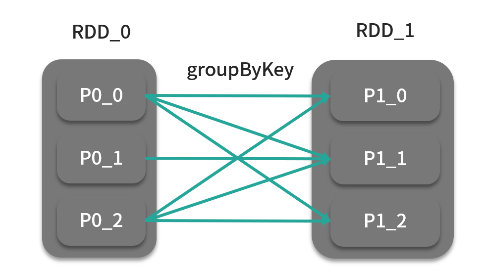
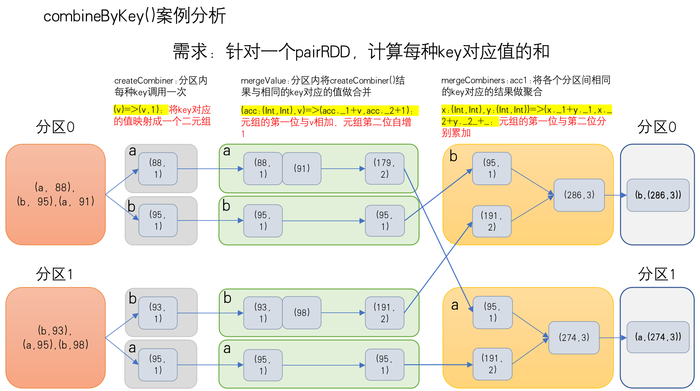

# Spark-基础篇

[toc]

## YARN的资源管理和调度

​		YARN 的架构是典型的主从架构，主节点是 ResourceManger。所有的资源的空闲和使用情况都由 ResourceManager 管理。ResourceManager 也负责监控任务的执行，从节点是 NodeManager，主要**负责管理 Container 生命周期**，监控资源使用情况等 ，Container 是 YARN 的资源表示模型，Task 是计算框架的计算任务，会运行在 Container 中，ApplicationMaster 可以暂时认为是二级调度器，比较特殊的是它同样运行在 Container 中。


YARN 启动一个 MapReduce 作业的流程，如图所示：


第 1 步：客户端向 ResourceManager 提交自己的应用，这里的应用就是指 MapReduce 作业。

第 2 步：ResourceManager 向 NodeManager 发出指令，为该应用启动第一个 Container，并在其中启动 ApplicationMaster。

第 3 步：ApplicationMaster 向 ResourceManager 注册。

第 4 步：ApplicationMaster 采用轮询的方式向 ResourceManager 的 YARN Scheduler 申领资源。

第 5 步：当 ApplicationMaster 申领到资源后（其实是获取到了空闲节点的信息），便会与对应 NodeManager 通信，请求启动计算任务。

第 6 步：NodeManager 会根据资源量大小、所需的运行环境，在 Container 中启动任务。

第 7 步：各个任务向 ApplicationMaster 汇报自己的状态和进度，以便让 ApplicationMaster 掌握各个任务的执行情况。

第 8 步：应用程序运行完成后，ApplicationMaster 向 ResourceManager 注销并关闭自己。

​		Spark 与 MapReduce 相比，是一种 DAG 计算框架，包含一系列的计算任务，比较特殊，所以 Spark 自己实现了一个集中式调度器  Driver，用来调用作业内部的计算任务。申请到的资源可以看成是申请分区资源，在该分区内，所有资源由 Driver 全权使用，以客户端方式提交的 Spark on Yarn 这种方式可以看成是 Driver 首先在资源管理和调度系统中注册为框架调度器（二级调度器），接收到需要得资源后，再开始进行作业调度。

## Spark 数据处理与分析场景


## Spark 架构

在运行时，Driver 是主节点，Executor 是从节点


​		在 Spark 的架构中，Driver 主要负责作业调度工作，Executor 主要负责执行具体的作业计算任务，Driver 中的 SparkSession 组件，是 Spark 2.0 引入的一个新的组件，SparkContext、SqlContext、HiveContext 都是 SparkSession 的成员变量。

​		因此，用户编写的 Spark 代码是从新建 SparkSession 开始的。其中 SparkContext 的作用是连接用户编写的代码与运行作业调度以及任务分发的代码。当用户提交作业启动一个 Driver 时，会通过 SparkContext 向集群发送命令，Executor 会遵照指令执行任务。一旦整个执行过程完成，Driver 就会结束整个作业。


- Driver 会根据用户编写的代码生成一个计算任务的**有向无环图**（Directed Acyclic Graph，DAG），这个有向无环图是 Spark 区别 Hadoop MapReduce 的重要特征；
- 接着，DAG 会根据 RDD（弹性分布式数据集，图中第 1 根虚线和第 2 根虚线中间的圆角方框）之间的依赖关系被 DAG Scheduler 切分成由 Task 组成的 Stage，这里的 Task 就是我们所说的计算任务，Stage 它表示的是一个计算任务的集合；
- 最后 TaskScheduler 会通过 ClusterManager 将 Task 调度到 Executor 上执行。

## Spark 抽象

Driver 会根据用户的代码生成一个有向无环图。下面这张图就是根据用户逻辑生成的一个有向无环图。


​		大概反推出计算逻辑：A 和 C 都是两张表，在分别进行分组聚合和筛选的操作后，做了一次 join 操作。

​		在上图中，灰色的方框就是我们所说的分区（partition），它和计算任务是一一对应的，也就是说，**有多少个分区，就有多少个计算任务**，显然的，**一个作业，会有多个计算任务**，这也是分布式计算的意义所在，**可以通过设置分区数量来控制每个计算任务的计算量**。在 DAG 中，**每个计算任务的输入就是一个分区，一些相关的计算任务所构成的任务集合可以被看成一个 Stage**，这里"相关"指的是某个标准。**RDD 则是分区的集合**（图中 A、B、C、D、E），用户只需要操作 RDD 就可以构建出整个 DAG，从某种意义上来说，它就是为了掩盖上面的概念而存在的。

​		一个 Executor 同时只能执行一个计算任务，但一个 Worker（物理节点）上可以同时运行多个 Executor。Executor 的数量决定了同时处理任务的数量，一般来说，分区数远大于 Executor 数量才是合理的。所以同一个作业，在计算逻辑不变的情况下，分区数和 Executor 的数量很大程度上决定了作业运行的时间。

## WordCount执行过程

数据流分析：

```
textFile("input")：读取本地文件input文件夹数据；一行一行读

flatMap(_.split(" "))：压平操作，按照空格分割符将一行数据映射成一个个单词；

map((_,1))：对每一个元素操作，将单词映射为元组；

reduceByKey(_+_)：按照key将值进行聚合，相加；

collect：将数据收集到Driver端展示。
```


## RDD


RDD将数据处理的逻辑进行封装


​		RDD（Resilient Distributed Dataset）叫做弹性分布式数据集，是Spark中最基本的数据抽象。代码中是一个抽象类，它代表一个**不可变、可分区、里面的元素可并行计算的集合**。不可变决定了它是只读的，所以RDD在经过变换产生新的RDD时，原有的RDD不会改变。

​		移动不如计算：优先位置，将计算移动到数据区。

弹性主要表现在两个方面：

- 在对出错的情况下，Spark能通过RDD之间的依赖关系恢复任意出错的RDD
- 经过转换算子处理时，RDD中的分区数以及分区所在的位置随时都可能改变。


### RDD的属性

1) 一组分区（Partition），即数据集的基本组成单位;

2) 一个计算每个分区的函数（算子）;

3) RDD之间的依赖关系;

4) 一个Partitioner，即RDD的分片函数;

5) 一个列表，存储存取每个Partition的优先位置（preferred location）。


​		输入可能以多个文件的形式存储在HDFS上，每个File都包含了很多块，称为Block。当Spark读取这些文件作为输入时，会根据具体数据格式对应的InputFormat进行解析，一般是**将若干个Block合并成一个输入分片，称为InputSplit**，**注意**InputSplit不能跨越文件（不同的file里的block不会到同一个分片当中）。随后将为这些输入分片生成具体的Task。InputSplit与Task是**一一对应**的关系。**这些具体的Task每个都会被分配到集群上的某个节点的某个Executor去执行。**

1) 每个节点可以起一个或多个Executor。

2) 每个Executor由若干core组成，每个Executor的每个core一次只能执行一个Task。

3) 每个Task执行的结果就是生成了目标RDD的一个partiton。


注意: 这里的core是虚拟的core而不是机器的物理CPU核，**可以理解为就是Executor的一个工作线程**。而 **Task被执行的并发度 = Executor数目 * 每个Executor核数**。

至于partition的数目：

​	1) 对于数据读入阶段，例如sc.textFile，**输入文件被划分为多少InputSplit就会需要多少初始Task**。

​	2) 在Map阶段partition数目保持不变。

​	3) 在Reduce阶段，RDD的聚合会触发shuffle操作，聚合后的RDD的partition数目跟具体操作有关，例如repartition操作会聚合成指定分区数，还有一些算子是可配置的。

​		RDD在计算的时候，每个分区都会起一个task，所以**rdd的分区数目决定了总的的task数目**。申请的计算节点（Executor）数目和每个计算节点核数（core），决定了你同一时刻可以并行执行的task。

​		比如RDD有100个分区，那么计算的时候就会生成100个task，资源配置为10个计算节点，每个两2个核，同一时刻可以并行的task数目为20，计算这个RDD就需要5个轮次。如果计算资源不变，你有101个task的话，就需要6个轮次，在最后一轮中，只有一个task在执行，其余核都在空转。如果资源不变，RDD只有2个分区，那么同一时刻只有2个task运行，其余18个核空转，造成资源浪费。**这就是在spark调优中，增大RDD分区数目，增大任务并行度的做法。**

 

### RDD的创建

​		在Spark中创建RDD的创建方式可以分为三种：**从集合中创建RDD；从外部存储创建RDD；从其他RDD创建。**

#### 从集合中创建

​		从集合中创建RDD，spark主要提供了两种函数：parallelize和makeRDD

1）使用parallelize()从集合创建

```scala
scala> val rdd = sc.parallelize(Array(1,2,3,4,5,6,7,8))

rdd: org.apache.spark.rdd.RDD[Int] = ParallelCollectionRDD[0] at parallelize at <console>:24
```

2）使用makeRDD()从集合创建

```scala
scala> val rdd1 = sc.makeRDD(Array(1,2,3,4,5,6,7,8))

rdd1: org.apache.spark.rdd.RDD[Int] = ParallelCollectionRDD[1] at makeRDD at <console>:24
```

makeRDD底层使用的是parallelize


#### 由外部存储系统的数据集创建

比如hdfs、hbase、本地文件等

如：

hdfs：

```scala
scala> val rdd2= sc.textFile("hdfs://hadoop102:9000/RELEASE")
rdd2: org.apache.spark.rdd.RDD[String] = hdfs:// hadoop102:9000/RELEASE MapPartitionsRDD[4] at textFile at <console>:24
```

​		读取文件时，传递的分区参数为最小分区数，但是不一定是这个分区数，取决于hadoop读取文件时，分片规则

jdbc

```scala
//val spark: SparkSession = .......
val lowerBound = 1
val upperBound = 1000
val numPartition = 10
val rdd = new JdbcRDD(spark.sparkcontext,() => {
       Class.forName("com.mysql.jdbc.Driver").newInstance()
       DriverManager.getConnection("jdbc:mysql://localhost:3306/db", "root", "123456")
   },
   "SELECT content FROM mysqltable WHERE ID >= ? AND ID <= ?",
   lowerBound, 
   upperBound, 
   numPartition,
   r => r.getString(1)
)

```

​		从代码可以看出，这种方式的原理是利用多个 Executor 同时查询互不交叉的数据范围，从而达到并行抽取的目的。但是这种方式的抽取性能受限于 MySQL 的并发读性能，单纯提高 Executor 的数量到某一阈值后，再提升对性能影响不大。

hBase:

```scala
//val spark: SparkSession = .......
val sc = spark.sparkcontext
val tablename = "your_hbasetable"
val conf = HBaseConfiguration.create()
conf.set("hbase.zookeeper.quorum", "zk1,zk2,zk3")
conf.set("hbase.zookeeper.property.clientPort", "2181")
conf.set(TableInputFormat.INPUT_TABLE, tablename)
val rdd= sc.newAPIHadoopRDD(conf, classOf[TableInputFormat],
classOf[org.apache.hadoop.hbase.io.ImmutableBytesWritable],
classOf[org.apache.hadoop.hbase.client.Result]) 
// 利用HBase API解析出行键与列值
rdd_three.foreach{case (_,result) => {
    val rowkey = Bytes.toString(result.getRow)
    val value1 = Bytes.toString(result.getValue("cf".getBytes,"c1".getBytes))
}
```

### 算子

​		RDD 算子主要分为两类，一类为转换（transform）算子，一类为行动（action）算子，转换算子主要负责改变 RDD 中数据、切分 RDD 中数据、过滤掉某些数据等，并按照一定顺序组合。Spark 会将转换算子放入一个计算的有向无环图中，并不立刻执行，当 Driver 请求某些数据时，才会真正提交作业并触发计算，而行动算子就会触发 Driver 请求数据。这种机制与函数式编程思想的惰性求值类似。**这样设计的原因首先是避免无谓的计算开销，更重要的是 Spark 可以了解所有执行的算子，从而设定并优化执行计划。**

RDD 转换算子大概有 20~30 多个，按照 DAG 中分区与分区之间的映射关系来分组，有如下 3 类：

- 一对一，如 map；

- 多对一，如 union；

- 多对多，如 groupByKey。

而按照 RDD 的结构可以分为两种：

- Value 型 RDD；

- Key-Value 型 RDD（PairRDD）。

按照转换算子的用途，我将其分为以下 4 类：

- 通用类；

- 数学/统计类；

- 集合论与关系类；

- 数据结构类。

​		通常两个功能相似的算子，如 groupBy 与 groupByKey，底层都是先将 Value 型 RDD 转换成 Key Value 型 RDD，再直接利用 Key Value 型 RDD 完成转换功能。

​		几乎所有的算子，都可以用 map、reduce、filter 这三个算子通过组合进行实现。

### RDD的转换

​		RDD整体上分为**Value类型和Key-Value类型**。

​		所有算子的计算功能都是由Executor执行。

例如：

```scala
		val i = 10
    val mapRdd = listRdd.map(_ * i)
```

这里的i是在Driver中

_*i的计算在Executor中，需要在网络中传输这个i，因此**需要考虑序列化，否则不能传输过去**。


#### Value类型

##### map(func)案例

```scala
def map[U: ClassTag](f: T => U): RDD[U]
```

它的作用是将原RDD分区中T类型的数据元素转换为U类型，并返回一个新的RDD。 


```scala
    // map算子
    val listRdd = sc.makeRDD(1 to 10)

    val mapRdd = listRdd.map(_ * 2)

    mapRdd.collect().foreach(println)
```


**mapPartitionsRdd&map：**

```scala
    // 可以对一个RDD中的所有分区进行遍历
    // 效率高于map算子，减少发送到执行器的交互次数
    // 但是可能因为整个Partition都在内存中的问题，造成OOM
    // 假设有N个元素，有M个分区，那么map的函数的将被调用N次,
    // 而mapPartitions被调用M次,一个函数一次处理所有分区。
    val mapPartitionsRdd = listRdd.mapPartitions(datas => {
      datas.map(_ * 2)
    })

    mapPartitionsRdd.collect().foreach(println)
```


**mapPartitionsWithIndex**

```scala
    // mapPartitionsWithIndex带分区号
    val tupleRDD = listRdd.mapPartitionsWithIndex((index, items) => {
      items.map((index, _))
    })
    val tupleRDD1 = listRdd.mapPartitionsWithIndex {
      case (index, items) => {
        items.map((index, _))
      }
    }

    tupleRDD.collect().foreach(println)
    tupleRDD1.collect().foreach(println)
```

以分区作为index


分区和任务有关

##### flatMap(func) 案例

​    是每一个输入元素可以被映射为0或多个输出元素（func应该返回一个序列，而不是单一元素）,结合映射[mapping]和扁平化[flattening]

```scala
    // flatMap
    val listRdd2 : RDD[List[Int]] = sc.makeRDD(Array(List(1, 2), List(3, 4)))

    val flatMapRDD = listRdd2.flatMap(x => x.map(_ * 2))

    flatMapRDD.collect().foreach(println)
```

可以把它看做是“先映射后扁平化”的快捷操作

> `flatMap`是一种常用的组合子，结合映射[mapping]和扁平化[flattening]。 flatMap需要一个处理嵌套列表的函数，然后将结果串连起来。
>
> ```
> scala> val nestedNumbers = List(List(1, 2), List(3, 4))
> nestedNumbers: List[List[Int]] = List(List(1, 2), List(3, 4))
> 
> scala> nestedNumbers.flatMap(x => x.map(_ * 2))
> res0: List[Int] = List(2, 4, 6, 8)
> ```
>
> 可以把它看做是“先映射后扁平化”的快捷操作：
>
> ```
> scala> nestedNumbers.map((x: List[Int]) => x.map(_ * 2)).flatten
> res1: List[Int] = List(2, 4, 6, 8)
> ```
>
> 这个例子先调用map，然后调用flatten，这就是“组合子”的特征，也是这些函数的本质。

来源：[https://twitter.github.io/scala_school/zh_cn/collections.html#flatMap](https://twitter.github.io/scala_school/zh_cn/collections.html#flatMap)


##### glom案例

​		将每一个分区形成一个数组，形成新的RDD类型时RDD[Array[T]]

```scala
// glom 算子 将每一个分区形成一个数组，形成新的RDD类型时RDD[Array[T]] 4个分区
    val listRdd2 = sc.makeRDD(1 to 10,4)
    val glamRDD = listRdd2.glom()
    glamRDD.collect().foreach(array => println(array.mkString(",")))
```


##### groupBy(func)案例

​		分组，按照传入函数的返回值进行分组。将相同的key对应的值放入一个迭代器。

```scala
    // groupBy 算子
    // 分组后的数据，形成对偶元组，(k-v)
    val listRdd3 = sc.makeRDD(List(1, 2))
    val groupByRDD = listRdd3.groupBy(x => x % 2)
    groupByRDD.collect.foreach(println)
```

##### filter(func) 案例

```scala
def filter(f: T => Boolean): RDD[T]
```

​		filter算子可以通过用户自定义规则过滤掉某些数据，f 返回值为 true 则保留，false 则丢弃，如图：


```scala
    // filter算子，数据过滤
    val filterRDD = listRdd3.filter(x => x % 2 == 0)
    filterRDD.collect().foreach(println)
```

​		该算子作用之后，可能会造成大量零碎分区，不利于后面计算过程，需要在这之前进行合并。

##### sample(withReplacement, fraction, seed) 案例

​		以指定的随机种子随机抽样出数量为fraction的数据，withReplacement表示是抽出的数据是否放回，true为有放回的抽样，false为无放回的抽样，seed用于指定随机数生成器种子。

```scala
    // sample(withReplacement, fraction, seed)
    val sampleRDD = listRdd.sample(false, 0.4, 1)
    sampleRDD.collect().foreach(println)
```

##### distinct([numTasks])) 案例

​		对源RDD进行去重后返回一个新的RDD。默认情况下，只有8个并行任务来操作，但是可以传入一个可选的numTasks参数改变它。


```scala
    // distinct
    val distinctRDD = listRdd.distinct()
    distinctRDD.collect().foreach(println)
```

##### coalesce(numPartitions) 案例

​		作用：缩减分区数，用于大数据集过滤后，提高小数据集的执行效率。

```scala
// coalesce算子 缩减分区 原先是4个分区 改为3个 
val coalesceRDD = listRdd2.coalesce(3)

println(coalesceRDD.partitions.size)
```

##### repartition(numPartitions) 案例

​	根据分区数，重新通过网络随机洗牌所有数据。

```scala
    // repartition
    val repartitionRDD = listRdd2.repartition(3)
    repartitionRDD.collect().foreach(println)
```

##### coalesce和repartition的区别

1. coalesce重新分区，可以选择是否进行shuffle过程。由参数shuffle: Boolean = false/true决定。

2. repartition实际上是调用的coalesce，默认是进行shuffle的。源码如下：

```scala
def repartition(numPartitions: Int)(implicit ord: Ordering[T] = null): RDD[T] = withScope {
 coalesce(numPartitions, shuffle = true)
}
```

##### sortBy(func,[ascending], [numTasks]) 案例

```scala
// sortBy
val sortByRdd = listRdd.sortBy(x => x)
sortByRdd.collect().foreach(println)
```

​		改变分区等效于改变任务，用true ， false 升降序

##### union(otherDataset) 案例

```scala
    //  union(otherDataset)
    val listRdd4 = sc.makeRDD(10 to 15)
    listRdd.union(listRdd4).collect().foreach(println)
```

##### subtract (otherDataset) 案例

​		作用：计算差的一种函数，去除两个RDD中相同的元素，不同的RDD将保留下来

```scala
    // subtract
    listRdd.subtract(listRdd4).collect().foreach(println)

```

##### intersection(otherDataset) 案例

​		交集后返回一个新的RDD

```scala
    // intersection
    listRdd.intersection(listRdd4).collect().foreach(println)

```

##### zip(otherDataset)案例

​		将两个RDD组合成Key/Value形式的RDD,这里默认两个RDD的partition数量以及元素数量都相同，否则会抛出异常。

要求：分区数相等，每个分区中的数据量相等，不能含有相同的数字

```scala
    // zip
    listRdd.zip(listRdd4).collect().foreach(println)

```


#### Key-Value类型

**（重点）**

##### partitionBy案例

​		作用：对pairRDD进行分区操作，如果原有的partionRDD和现有的partionRDD是一致的话就不进行分区， 否则会生成ShuffleRDD，即会产生shuffle过程。

```scala
    val kvRDD = sc.parallelize(Array((1, "aaa"), (2, "bbb"), (3, "ccc"), (4, "ddd")), 4)

    // 对RDD重新分区
    var kvRDD2 = kvRDD.partitionBy(new org.apache.spark.HashPartitioner(2))

    println(kvRDD2.partitions.size)
```

##### groupByKey案例

```scala
def groupByKey(): RDD[(K, Iterable[V])]
```

​	它默认按照哈希分区器进行分发，将同一个键的数据元素放入到一个迭代器中供后面的汇总操作做准备，它的可选参数分区数、分区器，如下图：	

	

​	groupByKey也是对每个key进行操作，但只生成一个sequence（序列）。

```scala
// groupByKey算子
val words = Array("one", "two", "two", "three", "three", "three")
val wordPairsRDD = sc.parallelize(words).map(word => (word, 1))
wordPairsRDD.groupByKey().map(t=>(t._1,t._2.sum))
  .collect().foreach(println)
```

##### reduceByKey(func, [numTasks]) 案例

```scala
def reduceByKey(func: (V, V) => V): RDD[(K, V)]
```

​		在一个(K,V)的RDD上调用，返回一个(K,V)的RDD，使用指定的reduce函数，将相同key的值聚合到一起，reduce任务的个数可以通过第二个可选的参数来设置。

​		reduceByKey 算子执行的是归约操作，针对相同键的数据元素两两进行合并。在合并之前，reduceByKey 算子需要将相同键的元素分发到一个分区中去，分发规则可以自定义，分发的分区数量也可以自定义，所以该算子还可以接收分区器或者分区数作为参数，分区器在没有指定时，采用的是 RDD 内部的哈希分区器，如下图：


```scala
// reduceByKey算子
wordPairsRDD.reduceByKey((x,y)=> x+y).collect().foreach(println)
```

##### reduceByKey和groupByKey的区别

1. reduceByKey：按照key进行聚合，在shuffle之前有combine（预聚合）操作，返回结果是RDD[k,v].**（推荐）**

2. groupByKey：按照key进行分组，直接进行shuffle。每个数据都需要写入文件，之后再读取文件。

3. 开发指导：reduceByKey比groupByKey更建议使用。但是需要注意是否会影响业务逻辑。


##### aggregateByKey案例

参数：(zeroValue:U,[partitioner: Partitioner]) (seqOp: (U, V) => U,combOp: (U, U) => U)

1. 作用：在kv对的RDD中，按key将value进行分组合并，合并时，**将每个value和初始值作为seq函数的参数，进行计算，返回的结果作为一个新的kv对，然后再将结果按照key进行合并，最后将每个分组的value传递给combine函数进行计算**（先将前两个value进行计算，将返回结果和下一个value传给combine函数，以此类推），将key与计算结果作为一个新的kv对输出。

2. 参数描述：

（1）zeroValue：给每一个分区中的每一个key一个**初始值**；

（2）seqOp：函数用于在每一个分区中用初始值逐步迭代value；分区内运算规则。

（3）combOp：函数用于合并每个分区中的结果。分区间运算规则。

需求：创建一个pairRDD，取出每个分区相同key对应值的最大值，然后相加


```scala
    // aggregateByKey算子 出每个分区相同key对应值的最大值，然后相加
    val aggregateByKeyRdd = sc.parallelize(List(("a", 3), ("a", 2), ("c", 4), ("b", 3), ("c", 6), ("c", 8)), 2)
		// 初值0 分区内求相同值的最大值 分区间相同值相加
    aggregateByKeyRdd.aggregateByKey(0)(Math.max(_, _), _ + _).collect().foreach(println)
```

##### foldByKey案例

参数：(zeroValue: V)(func: (V, V) => V): RDD[(K, V)]

分区内和分区间 采用相同的运算规则。

```scala
// foldByKey算子
aggregateByKeyRdd.foldByKey(0)(_+_).collect().foreach(println)
```

##### combineByKey[C] 案例

参数：(createCombiner: V => C, mergeValue: (C, V) => C, mergeCombiners: (C, C) => C) 

1. 作用：对相同K，把V合并成一个集合。

2. 参数描述：

（1）createCombiner: combineByKey() 会遍历分区中的所有元素，因此每个元素的键要么还没有遇到过，要么就和之前的某个元素的键相同。如果这是一个新的元素,**combineByKey()会使用一个叫作createCombiner()的函数来创建那个键对应的累加器的初始值**

（2）mergeValue: 如果这是一个在处理当前分区之前已经遇到的键，它会使用mergeValue()方法将该键的累加器对应的当前值与这个新的值进行合并

（3）mergeCombiners: 由于**每个分区都是独立处理的**， 因此对于同一个键可以有多个累加器。如果有两个或者**更多的分区都有对应同一个键的累加器**， 就需要使用用户提供的 mergeCombiners() 方法将各个分区的结果进行合并。



```scala
    // combineByKey算子 区间内统计 区间内求和 区间间求除法
    val input = sc.parallelize(Array(("a", 88), ("b", 95), ("a", 91), ("b", 93), ("a", 95), ("b", 98)), 2)
    val combine = input.combineByKey((_, 1), (acc: (Int, Int), v) => (acc._1 + v, acc._2 + 1), (acc1: (Int, Int), acc2: (Int, Int)) => (acc1._1 + acc2._1, acc1._2 + acc2._2))
    combine.collect

```

##### sortByKey([ascending], [numTasks]) 案例

​		作用：在一个(K,V)的RDD上调用，K必须实现Ordered接口，返回一个按照key进行排序的(K,V)的RDD

按照key的正序

```scala
input.sortByKey(true).collect().foreach(println)
```

##### mapValues案例

​		针对于(K,V)形式的类型只对V进行操作

```scala 
input.mapValues(_+"|||").collect().foreach(println)
```

##### join(otherDataset, [numTasks]) 案例

​		作用：在类型为(K,V)和(K,W)的RDD上调用，返回一个相同key对应的所有元素对在一起的(K,(V,W))的RDD

##### cogroup(otherDataset, [numTasks]) 案例

作用：在类型为(K,V)和(K,W)的RDD上调用，返回一个(K,(Iterable<V>,Iterable<W>))类型的RDD,将key相同的数据聚合到一个迭代器。

##### 案例实操

```scala
input.cogroup(input2).collect().foreach(println)
```

1. 数据结构：时间戳，省份，城市，用户，广告，中间字段使用空格分割。

```
1516609143867 6 7 64 16

1516609143869 9 4 75 18

1516609143869 1 7 87 12
```

2. 需求：统计出每一个省份广告被点击次数的TOP3


```scala
 // 统计出每一个省份广告被点击次数的TOP3
    val line = sc.textFile("/Users/wangfulin/bigdata/data/agent.log")
    val provinceAdToOne = line.map(x => {
      val datas = x.split(" ")
      ((datas(1), datas(4)), 1)
    })
    // 每个省中  相同的key被点击的总数
    val provinceAdSum = provinceAdToOne.reduceByKey(_ + _)
    provinceAdSum.take(5).foreach(println)
    // ((省，广告),总数) 返回 (省，（广告,总数）)
    val provinceToAdSum = provinceAdSum.map(x => {
      (x._1._1, (x._1._2, x._2))
    })

    provinceToAdSum.take(5).foreach(println)

    // 按省分类
    val provinceGroup = provinceToAdSum.groupByKey()

    provinceGroup.take(5).foreach(println)
    val provinceAdTop3 = provinceGroup.mapValues { x =>
      x.toList.sortWith((x, y) => x._2 > y._2).take(3) //list 里面两两相互比较
    }.foreach(println)
```


#### 行动算子

​		行动算子从功能上来说作为一个触发器，**会触发提交整个作业并开始执行。**从代码上来说，它与转换算子的最大不同之处在于：转换算子返回的还是 RDD，行动算子返回的是非 RDD 类型的值，如整数，或者根本没有返回值。

​		行动算子可以分为 Driver 和分布式两类。

- Driver：这种算子返回值通常为 Driver 内部的内存变量，如 collect、count、countByKey 等。这种算子会在远端 Executor 执行计算完成后将结果数据传回 Driver。这种算子的缺点是，如果返回的数据太大，很容易会突破 Driver 内存限制，因此使用这种算子作为作业结束需要谨慎，主要还是用于调试与开发场景。

- 分布式：与前一类算子将结果回传到 Driver 不同，这类算子会在集群中的节点上“就地”分布式执行，如 saveAsTextFile。这是一种最常用的分布式行动算子。

#### reduce(func)案例

​		作用：通过func函数聚集RDD中的**所有元素**，先聚合分区内数据，再聚合分区间数据。

```scala
// reduce
println(actionRdd.reduce(_ + _))
```

##### collect()案例

​		作用：在驱动程序中，以数组的形式返回数据集的所有元素。

```scala
actionRdd.collect().foreach(println)
```

##### count()案例

​		返回RDD中元素的个数

##### first()案例

​		返回RDD中的第一个元素

##### take(n)案例

​		返回一个由RDD的前n个元素组成的数组

##### takeOrdered(n)案例

​		返回该RDD排序后的前n个元素组成的**数组**

##### aggregate案例

1. 参数：(zeroValue: U)(seqOp: (U, T) ⇒ U, combOp: (U, U) ⇒ U)

2. 作用：aggregate函数将每个分区里面的元素通过seqOp和初始值进行聚合，然后用combine函数将每个分区的结果和初始值(zeroValue)进行combine操作。这个函数最终返回的类型不需要和RDD中元素类型一致。

分区内会加上初始值，分区间也会加上初始值

##### fold(num)(func)案例

1. 作用：折叠操作，aggregate的简化操作，seqop和combop一样

##### saveAsTextFile(path)

作用：将数据集的元素以textfile的形式保存到HDFS文件系统或者其他支持的文件系统，对于每个元素，Spark将会调用toString方法，将它装换为文件中的文本

##### saveAsSequenceFile(path) 

作用：将数据集中的元素以Hadoop sequencefile的格式保存到指定的目录下，可以使HDFS或者其他Hadoop支持的文件系统。

##### countByKey()案例

作用：针对(K,V)类型的RDD，返回一个(K,Int)的map，表示每一个key对应的元素个数。

##### foreach(func)案例

作用：在数据集的每一个元素上，运行函数func进行更新。


#### RDD中的函数传递

​		在实际开发中我们往往需要自己定义一些对于RDD的操作，那么此时需要主要的是，**初始化工作是在Driver端进行的，而实际运行程序是在Executor端进行的，**这就涉及到了跨进程通信，**是需要序列化的**。

类继承scala.Serializable即可。

#### RDD依赖关系

​		RDD只支持粗粒度转换，即在大量记录上执行的单个操作。**将创建RDD的一系列Lineage（血统）记录下来，以便恢复丢失的分区。**RDD的Lineage会记录RDD的元数据信息和转换行为，当该RDD的部分分区数据丢失时，它可以根据这些信息来重新运算和恢复丢失的数据分区。

RDD和它依赖的父RDD（s）的关系有两种不同的类型，即窄依赖（narrow dependency）和宽依赖（wide dependency）。

##### 窄依赖

​		窄依赖指的是每一个父RDD的Partition最多被子RDD的一个Partition使用,窄依赖我们形象的比喻为独生子女。


#### 宽依赖

​		宽依赖指的是多个子RDD的Partition会依赖同一个父RDD的Partition，会引起**shuffle**。总结：宽依赖我们形象的比喻为超生


#### DAG

DAG(Directed Acyclic Graph)叫做有向无环图，原始的RDD通过一系列的转换就就形成了DAG，**根据RDD之间的依赖关系的不同将DAG划分成不同的Stage（阶段）**，**对于窄依赖，partition的转换处理在Stage中完成计算。对于宽依赖，由于有Shuffle的存在，只能在parent RDD处理完成后，才能开始接下来的计算**，**因此宽依赖是划分Stage的依据**。（宽依赖是，目标RDD的Partition引用多个父Partition）


#### 任务划分

RDD任务切分中间分为：Application、Job、Stage和Task

1）Application：初始化一个SparkContext即生成一个Application

2）Job：一个Action算子就会生成一个Job

3）Stage：根据RDD之间的依赖关系的不同将Job划分成不同的Stage，遇到一个宽依赖则划分一个Stage。


反向推，**到底有多少阶段 = 1 + shuffle个数，1是这个整体**

4）Task：Stage是一个TaskSet，将Stage划分的结果发送到不同的Executor执行即为一个Task。

注意：Application->Job->Stage-> Task每一层都是1对n的关系。

#### RDD缓存

​		Spark 缓存技术是加速 Spark 作业执行的关键技术之一，尤其是在迭代计算的场景，效果非常好。

​		RDD通过persist方法或cache方法可以将前面的计算结果缓存，默认情况下 persist() 会把数据以序列化的形式缓存在 JVM 的堆空间中。 

​		但是并不是这两个方法被调用时立即缓存，而是**触发后面的action时，该RDD将会被缓存在计算节点的内存中，并供后面重用。**

 

通过查看源码发现cache最终也是调用了persist方法，默认的存储级别都是仅在内存存储一份，Spark的存储级别还有好多种，存储级别在object StorageLevel中定义的。

 

在存储级别的末尾加上“_2”来把持久化数据存为两份


​		缓存有可能丢失，或者存储在内存的数据由于内存不足而被删除，RDD的缓存容错机制保证了即使缓存丢失也能保证计算的正确执行。通过基于RDD的一系列转换，丢失的数据会被重算，由于RDD的各个Partition是相对独立的，因此只需要计算丢失的部分即可，并不需要重算全部Partition。

​		如果内存足够大，使用 MEMORY_ONLY 无疑是性能最好的选择，想要节省点空间的话，可以采取 MEMORY_ONLY_SER，可以序列化对象使其所占空间减少一点。DISK是在重算的代价特别昂贵时的不得已的选择。MEMORY_ONLY_2 与 MEMORY_AND_DISK_2 拥有最佳的可用性，但是会消耗额外的存储空间。

#### RDD CheckPoint

（重要）

​		Spark中对于数据的保存除了持久化操作之外，还提供了一种检查点的机制，检查点（本质是通过将RDD写入Disk做检查点）**是为了通过lineage做容错的辅助**，lineage过长会造成容错成本过高，这样就不如在中间阶段做检查点容错，**如果之后有节点出现问题而丢失分区，从做检查点的RDD开始重做Lineage，就会减少开销。**检查点通过将数据写入到HDFS文件系统实现了RDD的检查点功能。

​		为当前RDD设置检查点。该函数将会创建一个二进制的文件，并存储到checkpoint目录中，该目录是用[Spark](https://www.iteblog.com/archives/tag/spark/)Context.setCheckpointDir()设置的。在checkpoint的过程中，该RDD的所有依赖于父RDD中的信息将全部被移除。对RDD进行checkpoint操作并不会马上被执行，必须执行Action操作才能触发。

```scala
 sc.setCheckpointDir("hdfs://hadoop102:9000/checkpoint")
```

#### RDD数据分区器

​		Spark目前**支持Hash分区和Range分区**，用户也可以自定义分区，Hash分区为当前的默认分区，**Spark中分区器直接决定了RDD中分区的个数、RDD中每条数据经过Shuffle过程属于哪个分区和Reduce的个数**

**注意：**

(1) 只有Key-Value类型的RDD才有分区器的，非Key-Value类型的RDD分区器的值是None
(2) 每个RDD的分区ID范围：0~numPartitions-1，决定这个值是属于那个分区的。

##### 获取RDD分区

```scala
val pairs = sc.parallelize(List((1,1),(2,2),(3,3)))
// 查看分区
pairs.partitioner
// 导入HashPartitioner类
import org.apache.spark.HashPartitioner
// 使用HashPartitioner对RDD进行重新分区
val partitioned = pairs.partitionBy(new HashPartitioner(2))
partitioned.partitioner
```

##### Hash分区

​		HashPartitioner分区的原理：对于给定的key，计算其hashCode，并除以分区的个数取余，如果余数小于0，则用余数+分区的个数（否则加0），最后返回的值就是这个key所属的分区ID。

##### Ranger分区

​		HashPartitioner分区弊端：**可能导致每个分区中数据量的不均匀，极端情况下会导致某些分区拥有RDD的全部数据。**

​		RangePartitioner作用：将一定范围内的数映射到某一个分区内，**尽量保证每个分区中数据量的均匀，而且分区与分区之间是有序的**，**一个分区中的元素肯定都是比另一个分区内的元素小或者大，但是分区内的元素是不能保证顺序的。**简单的说就是将一定范围内的数映射到某一个分区内。实现过程为：

​		第一步：先从整个RDD中抽取出样本数据，将样本数据排序，计算出每个分区的最大key值，形成一个Array[KEY]类型的数组变量rangeBounds；

​		第二步：判断key在rangeBounds中所处的范围，给出该key值在下一个RDD中的分区id下标；该分区器要求RDD中的KEY类型必须是可以排序的

##### 自定义分区

要实现自定义的分区器，需要继承 org.apache.spark.Partitioner 类并实现下面三个方法。 

（1）numPartitions: Int:返回创建出来的分区数。

（2）getPartition(key: Any): Int:返回给定键的分区编号(0到numPartitions-1)。 

（3）equals():Java 判断相等性的标准方法。这个方法的实现非常重要，Spark 需要用这个方法来检查你的分区器对象是否和其他分区器实例相同，这样 Spark 才可以判断两个 RDD 的分区方式是否相同。

需求：将相同后缀的数据写入相同的文件，通过将相同后缀的数据分区到相同的分区并保存输出来实现。

### 数据读取与保存

#### HBase数据库

```scala
    //构建HBase配置信息
    val conf: Configuration = HBaseConfiguration.create()
    conf.set("hbase.zookeeper.quorum", "hadoop102,hadoop103,hadoop104")
    conf.set(TableInputFormat.INPUT_TABLE, "rddtable")

    //从HBase读取数据形成RDD
    val hbaseRDD: RDD[(ImmutableBytesWritable, Result)] = sc.newAPIHadoopRDD(
      conf, //配置
      classOf[TableInputFormat], //format的类型
      classOf[ImmutableBytesWritable], // key类型 rowkey
      classOf[Result]) // value类型 Result 查询结果
```


Spark三大数据结构

RDD：分布式数据集

广播变量：分布式只读共享变量

累加器：分布式只写共享变量

共享变量是 Spark 中进阶特性之一，一共有两种：

- 广播变量；
- 累加器。

​        在 Spark 作业中，用户编写的高阶函数会在集群中的 Executor 里执行，这些 Executor 可能会用到相同的变量，这些变量被复制到每个 Executor 中，而 Executor 对变量的更新不会传回 Driver。

### 累加器

（只写共享变量）

​		累加器用来对信息进行聚合，通常在向 Spark传递函数时，比如使用 map() 函数或者用 filter() 传条件时，可以使用驱动器程序中定义的变量，但是集群中运行的每个任务都会得到这些变量的一份新的副本，更新这些副本的值也不会影响驱动器中的对应变量。如果我们想实现所有分片处理时更新共享变量的功能，那么累加器可以实现我们想要的效果。

累加器使用之前


使用累加器之后：


Spark 内置的累加器有如下几种。

- LongAccumulator：长整型累加器，用于求和、计数、求均值的 64 位整数。
- DoubleAccumulator：双精度型累加器，用于求和、计数、求均值的双精度浮点数。
- CollectionAccumulator[T]：集合型累加器，可以用来收集所需信息的集合。

所有这些累加器都是继承自 AccumulatorV2。

##### 自定义累加器

实现自定义类型累加器需要继承AccumulatorV2并至少覆写下例中出现的方法。

参数是in, out

1.继承AccumulatorV2

2.实现抽象方法

3.创建累加器

```scala
class LogAccumulator extends org.apache.spark.util.AccumulatorV2[String, java.util.Set[String]] {
  private val _logArray: java.util.Set[String] = new java.util.HashSet[String]()

  // 初始化
  override def isZero: Boolean = {
    _logArray.isEmpty
  }

  override def reset(): Unit = {
    _logArray.clear()
  }

  // 添加
  override def add(v: String): Unit = {
    _logArray.add(v)
  }

  // 合并
  override def merge(other: org.apache.spark.util.AccumulatorV2[String, java.util.Set[String]]): Unit = {
    other match {
      case o: LogAccumulator => _logArray.addAll(o.value)
    }

  }

  override def value: java.util.Set[String] = {
    java.util.Collections.unmodifiableSet(_logArray)
  }

  override def copy():org.apache.spark.util.AccumulatorV2[String, java.util.Set[String]] = {
    val newAcc = new LogAccumulator()
    _logArray.synchronized{
      newAcc._logArray.addAll(_logArray)
    }
    newAcc
  }
}
```

调用：

创建累加器：

```scala
val logAccumulator = new LogAccumulator
```

注册累加器:

```scala
sc.register(logAccumulator)
```

例：


这个表只有两列，需要统计 A 列与 B 列的汇总值。下面来看看根据上面的逻辑如何实现一个自定义累加器。代码如下：

```scala
	import org.apache.spark.util.AccumulatorV2
	import org.apache.spark.SparkConf
	import org.apache.spark.SparkContext
	import org.apache.spark.SparkConf
	 
	// 构造一个保存累加结果的类
	case class SumAandB(A: Long, B: Long)
	 
	class FieldAccumulator extends AccumulatorV2[SumAandB,SumAandB] {
	
      private var A:Long = 0L
      private var B:Long = 0L
	    // 如果A和B同时为0，则累加器值为0
	    override def isZero: Boolean = A == 0 && B == 0L
	    // 复制一个累加器
	    override def copy(): FieldAccumulator = {
	        val newAcc = new FieldAccumulator
	        newAcc.A = this.A
	        newAcc.B = this.B
	        newAcc
	    }
	    // 重置累加器为0
	    override def reset(): Unit = { A = 0 ; B = 0L }
	    // 用累加器记录汇总结果
	    override def add(v: SumAandB): Unit = {
	        A += v.A
	        B += v.B
	    }
	    // 合并两个累加器
	    override def merge(other: AccumulatorV2[SumAandB, SumAandB]): Unit = {
	        other match {
	        case o: FieldAccumulator => {
	            A += o.A
	            B += o.B}
	        case _ =>
	        }
	    }
	    // 当Spark调用时返回结果
	    override def value: SumAandB = SumAandB(A,B)
	}

```

调用

```scala
package com.spark.examples.rdd
 
import org.apache.spark.SparkConf
import org.apache.spark.SparkContext
 
class Driver extends App{

  val conf = new SparkConf
  val sc = new SparkContext(conf)
  val filedAcc = new FieldAccumulator
  sc.register(filedAcc, " filedAcc ")
  // 过滤掉表头
  val tableRDD = sc.textFile("table.csv").filter(_.split(",")(0) != "A")
  tableRDD.map(x => {
     val fields = x.split(",")
     val a = fields(1).toInt
     val b = fields(2).toLong
     filedAcc.add(SumAandB (a, b))
     x
  }).count
}

```


### 广播变量

（只读共享变量）

​		**广播变量用来高效分发较大的对象**。向所有工作节点发送一个较大的只读值，以供一个或多个Spark操作使用。 在多个并行操作中使用同一个变量，但是 Spark会为每个任务分别发送。

变量只会被发到各个节点一次，应作为只读值处理(修改这个值不会影响到别的节点)。

​		Spark 广播机制运作方式是这样的：Driver 将已序列化的数据切分成小块，然后将其存储在自己的块管理器 BlockManager 中，当 Executor 开始运行时，每个 Executor 首先从自己的内部块管理器中试图获取广播变量，如果以前广播过，那么直接使用；如果没有，Executor 就会从 Driver 或者其他可用的 Executor 去拉取数据块。Executor 采用的是通过 HTTP 连接去拉取数据，类似于 BitTorrent 点对点传输。这样的方式更具扩展性，避免了所有 Executor 都去向 Driver 请求数据而造成 Driver 故障。一旦拿到数据块，就会放到自己的块管理器中。供自己和其他需要拉取的 Executor 使用。这就很好地防止了 Driver 单点的性能瓶颈，如下图所示。


```scala
scala> val rdd_one = sc.parallelize(Seq(1,2,3))
rdd_one: org.apache.spark.rdd.RDD[Int] = ParallelCollectionRDD[101] at
parallelize at <console>:25
    scala> val i = 5
    i: Int = 5
scala> val bi = sc.broadcast(i)
bi: org.apache.spark.broadcast.Broadcast[Int] = Broadcast(147)
scala> bi.value
res166: Int = 5
scala> rdd_one.take(5)
res164: Array[Int] = Array(1, 2, 3)
scala> rdd_one.map(j => j + bi.value).take(5)
res165: Array[Int] = Array(6, 7, 8)

```

广播变量会持续占用内存，当我们不需要的时候，可以用 unpersist 算子将其移除，这时，如果计算任务又用到广播变量，那么就会重新拉取数据，如下：

```scala
    ...
scala> val rdd_one = sc.parallelize(Seq(1,2,3))
rdd_one: org.apache.spark.rdd.RDD[Int] = ParallelCollectionRDD[101] at
parallelize at <console>:25
scala> val k = 5
k: Int = 5
scala> val bk = sc.broadcast(k)
bk: org.apache.spark.broadcast.Broadcast[Int] = Broadcast(163)
scala> rdd_one.map(j => j + bk.value).take(5)
res184: Array[Int] = Array(6, 7, 8)
scala> bk.unpersist
scala> rdd_one.map(j => j + bk.value).take(5)
res186: Array[Int] = Array(6, 7, 8)

```

​		还可以使用 destroy 方法彻底销毁广播变量，调用该方法后，如果计算任务中又用到广播变量，则会抛出异常。

​		广播变量在一定数据量范围内可以有效地使作业避免 Shuffle，使计算尽可能本地运行，Spark 的 Map 端连接操作就是用广播变量实现的。

例：

	表 A：校验码，内容

也就是说，我们需要根据校验码的不同，对内容采取不同规则的校验，而检验码与校验规则的映射则存储在另外一个数据库：

```
表 B：校验码，规则
```

这样，情况就比较清楚了，如果不考虑广播变量，我们有这么两种做法：

1. 直接使用 map 算子，在 map 算子中的自定义函数中去查询数据库，那么有多少行，就要查询多少次数据库，这样性能非常差。
2. 先将表 B 查出来转化为 RDD，使用 join 算子进行连接操作后，再使用 map 算子进行处理，这样做性能会比前一种方式好很多，但是会引起大量的 Shuffle 操作，对资源消耗不小。

考虑广播变量。相当于先将小表进行广播，广播到每个 Executor 的内存中，供 map 函数使用，这就避免了 Shuffle，虽然语义上还是 join（小表放内存），但无论是资源消耗还是执行时间，都要远优于前面两种方式。


## Shuffle原理

​		Shuffle 一般被翻译为数据混洗，是类 MapReduce 分布式计算框架独有的机制，也是这类分布式计算框架最重要的执行机制。

- 逻辑层面；
- 物理层面。

#### 逻辑层面

​		血统的表现形式主要分为宽依赖（wide dependency）与窄依赖（narrow dependency），如下图所示：


​		窄依赖的准确定义是：子 RDD 中的分区与父 RDD 中的分区只存在一对一的映射关系，而宽依赖则是子 RDD 中的分区与父 RDD 中的分区存在一对多的映射关系，那么从这个角度来说，map、 filter、 union 等就是窄依赖，而 groupByKey、 coGroup 就是典型的宽依赖。

​		**宽依赖还有个名字，叫 Shuffle 依赖，也就是说宽依赖必然会发生 Shuffle 操作**，在前面也提到过 **Shuffle 也是划分 Stage 的依据**。而窄依赖由于不需要发生 Shuffle，所有计算都是在分区所在节点完成，它类似于 MapReduce 中的 ChainMapper。所以说，**在你自己的 DAG 中，如果你选取的算子形成了宽依赖，那么就一定会触发 Shuffle**。

​		所以用户可以在计算过程中，适时调用 RDD 的 checkpoint 方法，保存当前算好的中间结果，这样依赖链就会大大缩短。**RDD 的血统机制就是 RDD 的容错机制。**

在 Spark 应用执行的过程中，可能会遇到以下几种失败的情况：

- Driver 报错；
- Executor 报错；
- Task 执行失败。

​        Driver 执行失败是 Spark 应用最严重的一种情况，标志整个作业彻底执行失败，需要开发人员手动重启 Driver；Executor 报错通常是因为 Executor 所在的机器故障导致，这时 Driver 会将执行失败的 Task 调度到另一个 Executor 继续执行，重新执行的 Task 会根据 RDD 的依赖关系继续计算，并将报错的 Executor 从可用 Executor 的列表中去掉；Spark 会对执行失败的 Task 进行重试，重试 3 次后若仍然失败会导致整个作业失败。在这个过程中，Task 的数据恢复和重新执行都用到了 RDD 的血统机制。

#### 物理层面

​		很多算子都会引起 RDD 中的数据进行重分区，新的分区被创建，旧的分区被合并或者被打碎，在重分区的过程中，如果数据发生了跨节点移动，就被称为 Shuffle。**Shuffle 体现了从函数式编程接口到分布式计算框架的实现。**Spark 对 Shuffle 的实现方式有两种：Hash Shuffle 与 Sort-based Shuffle

##### Hash Shuffle

​		Shuffle 的过程一般分为两个部分：Shuffle Write 和 Shuffle Fetch，前者是 Map 任务划分分区、输出中间结果，而后者则是 Reduce 任务获取到的这些中间结果。Hash Shuffle 的过程如下图所示：


​		在图中，Shuffle Write 发生在一个节点上，该节点用来执行 Shuffle 任务的 CPU 核数为 2，每个核可以同时执行两个任务，每个任务输出的分区数与 Reducer（这里的 Reducer 指的是 Reduce 端的 Executor）数相同，即为 3，每个分区都有一个缓冲区（bucket）用来接收结果，每个缓冲区的大小由配置 spark.shuffle.file.buffer.kb 决定。这样每个缓冲区写满后，就会输出到一个文件段（filesegment），而 Reducer 就会去相应的节点拉取文件。这样的实现很简单，但是问题也很明显。主要有两个：

- 生成的中间结果文件数太大。理论上，每个 Shuffle 任务输出会产生 R 个文件（ R为Reducer 的个数），而 Shuffle 任务的个数往往由 Map 任务个数 M 决定，所以总共会生成 M * R 个中间结果文件，而往往在一个作业中 M 和 R 都是很大的数字，在大型作业中，经常会出现文件句柄数突破操作系统限制。
- 缓冲区占用内存空间过大。单节点在执行 Shuffle 任务时缓存区大小消耗为 m * R * spark.shuffle.file.buffer.kb，m 为该节点运行的 Shuffle 任务数，如果一个核可以执行一个任务，m 就与 CPU 核数相等。这对于动辄有 32、64 物理核的服务器来说，是比不小的内存开销。

为了解决第一个问题， Spark 推出过 **File Consolidation** 机制，旨在通过共用输出文件以降低文件数，如下图所示：

​		每当 Shuffle 任务输出时，**同一个 CPU 核心处理的 Map 任务的中间结果会输出到同分区的一个文件中，然后 Reducer 只需一次性将整个文件拿到即可。**这样，Shuffle 产生的文件数为 C（CPU 核数）* R。 Spark 的 FileConsolidation 机制默认开启，可以通过 spark.shuffle.consolidateFiles 配置项进行配置。

##### Sort-based Shuffle

Sort-based Shuffle，才真正解决了 Shuffle 的问题，再加上 Tungsten 计划的优化， Spark 的 Sort-based Shuffle 比 MapReduce 的 Sort-based Shuffle 青出于蓝。如下图所示：


​		每个 Map 任务会最后只会输出两个文件（其中一个是索引文件），其中间过程采用的是与 MapReduce 一样的归并排序，但是会用索引文件记录每个分区的偏移量，输出完成后，Reducer 会根据索引文件得到属于自己的分区，在这种情况下，Shuffle 产生的中间结果文件数为 2 * M（M 为 Map 任务数）。

​		在基于排序的 Shuffle 中， Spark 还提供了一种折中方案——Bypass Sort-based Shuffle，当 Reduce 任务小于 spark.shuffle.sort.bypassMergeThreshold 配置（默认 200）时，Spark Shuffle 开始按照 Hash Shuffle 的方式处理数据，而不用进行归并排序，只是在 Shuffle Write 步骤的最后，将其合并为 1 个文件，并生成索引文件。这样实际上还是会生成大量的中间文件，只是最后合并为 1 个文件并省去排序所带来的开销，该方案的准确说法是 Hash Shuffle 的Shuffle Fetch 优化版。

## SparkCore总结


----

代码：

- [sparkRdd](../../icoding/spark-examples/sparkRdd)

