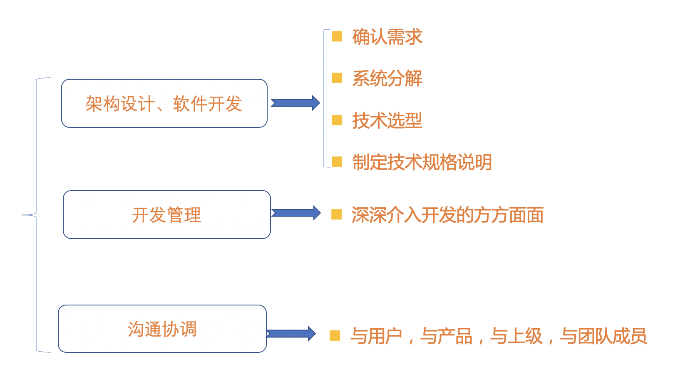
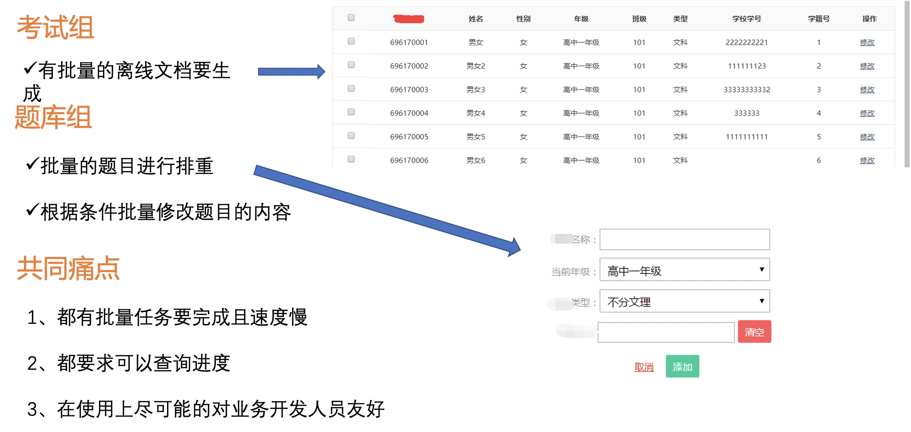
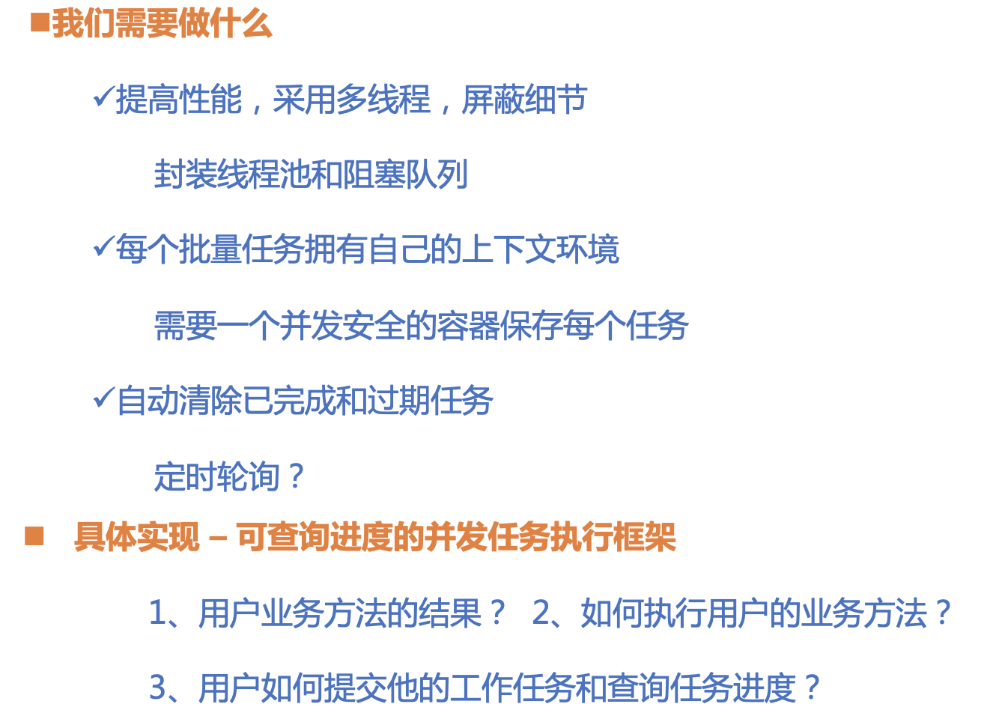
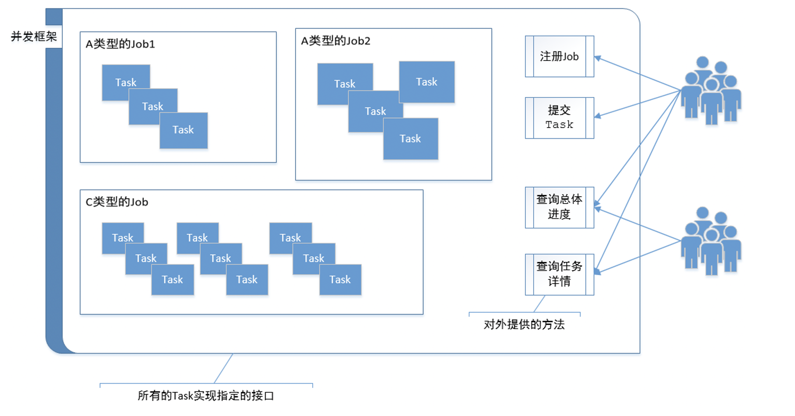
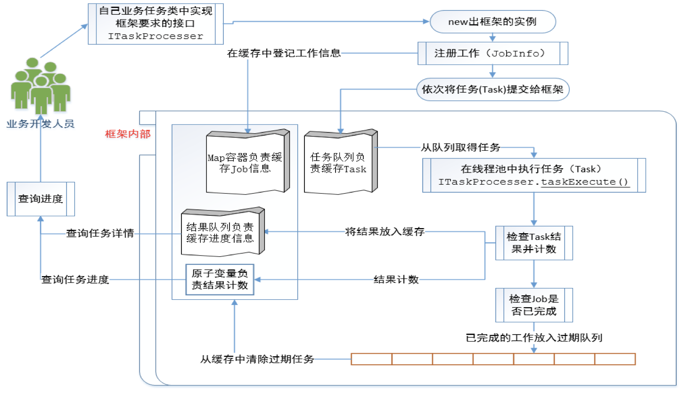

# 实战项目-并发任务执行框架



**需求：批量处理生成文档**



**怎么改进**



**框架业务示意图**





```JAVA
public interface ITaskProcesser<T, R> {
    /**
     * @param data 调用方法需要使用的业务数据
     * @return 方法执行后业务方法的结果
     */
    TaskResult<R> taskExecute(T data);
}
```

```JAVA
public class ItemVo<T> implements Delayed {
    private long activeTime;//到期时间，单位毫秒
    private T date;

    //activeTime是个过期时长
    public ItemVo(long activeTime, T date) {
        super();
        this.activeTime = TimeUnit.NANOSECONDS.convert(activeTime,
                TimeUnit.MILLISECONDS) + System.nanoTime();//将传入的时长转换为超时的时刻
        this.date = date;
    }

    public long getActiveTime() {
        return activeTime;
    }

    public T getDate() {
        return date;
    }

    //按照剩余时间排序
    @Override
    public int compareTo(Delayed o) {
        long d = getDelay(TimeUnit.NANOSECONDS) - o.getDelay(TimeUnit.NANOSECONDS);
        return (d == 0) ? 0 : ((d > 0) ? 1 : -1);
    }

    //返回元素的剩余时间
    @Override
    public long getDelay(TimeUnit unit) {
        long d = unit.convert(this.activeTime - System.nanoTime(),
                TimeUnit.NANOSECONDS);
        return d;
    }
}
```

```JAVA
public class JobInfo<R> {
    //区分唯一的工作
    private final String jobName;
    //工作的任务个数
    private final int jobLength;
    //执行工作的任务处理器
    private final ITaskProcesser<?, ?> taskProcesser;
    //成功处理的任务数
    private final AtomicInteger successCount;
    //已处理的任务数 总计数
    private final AtomicInteger taskProcesserCount;
    //结果队列，拿结果从头拿，放结果从尾部放
    private final LinkedBlockingDeque<TaskResult<R>> taskDetailQueue;

    //工作的完成保存的时间，超过这个时间从缓存中清除 过期时间
    private final long expireTime;

    public JobInfo(String jobName, int jobLength,
                   ITaskProcesser<?, ?> taskProcesser,
                   long expireTime) {

        this.jobName = jobName;
        this.jobLength = jobLength;
        this.taskProcesser = taskProcesser;
        this.successCount = new AtomicInteger(0);
        this.taskProcesserCount = new AtomicInteger(0);
        this.taskDetailQueue = new LinkedBlockingDeque<TaskResult<R>>(jobLength);
        this.expireTime = expireTime;
    }

    public ITaskProcesser<?, ?> getTaskProcesser() {
        return taskProcesser;
    }

    //返回成功处理的结果数
    public int getSuccessCount() {
        return successCount.get();
    }

    //返回当前已处理的结果数
    public int getTaskProcesserCount() {
        return taskProcesserCount.get();
    }

    //提供工作中失败的次数，为了方便调用者使用
    public int getFailCount() {
        return taskProcesserCount.get() - successCount.get();
    }


    // 把所有的处理结果都返回
    public String getTotalProcess() {
        return "Success[" + successCount.get() + "]/Current["
                + taskProcesserCount.get() + "] Total[" + jobLength + "]";
    }

    //获得工作中每个任务的处理详情
    public List<TaskResult<R>> getTaskDetail() {
        List<TaskResult<R>> taskList = new LinkedList<>();
        TaskResult<R> taskResult;
        // 从阻塞队列中拿任务的结果，反复取，一直取到null为止，说明目前队列中最新的任务结果已经取完，可以不取了
        while ((taskResult = taskDetailQueue.pollFirst()) != null) {
            taskList.add(taskResult);
        }
        return taskList;
    }


    // 放任务的结果，从业务应用角度来说，保证最终一致性即可，不需要对方法加锁.
    public void addTaskResult(TaskResult<R> result, CheckJobProcesser checkJob) {
        if (TaskResultType.Success.equals(result.getResultType())) {
            successCount.incrementAndGet();
        }
        taskDetailQueue.addLast(result);
        taskProcesserCount.incrementAndGet();

        if (taskProcesserCount.get() == jobLength) { // 如果完成了任务，则在检查业务中，添加任务，并设定过期时间。
            checkJob.putJob(jobName, expireTime);
        }

    }
}
```

```JAVA
public class TaskResult<R> {
    //方法本身运行是否正确的结果类型
    private final TaskResultType resultType;
    //方法的业务结果数据；
    private final R returnValue;
    //这里放方法失败的原因
    private final String reason;

    public TaskResult(TaskResultType resultType, R returnValue, String reason) {
        super();
        this.resultType = resultType;
        this.returnValue = returnValue;
        this.reason = reason;
    }

    //方便业务人员使用，这个构造方法表示业务方法执行成功返回的结果
    public TaskResult(TaskResultType resultType, R returnValue) {
        super();
        this.resultType = resultType;
        this.returnValue = returnValue;
        this.reason = "Success";
    }

    public TaskResultType getResultType() {
        return resultType;
    }

    public R getReturnValue() {
        return returnValue;
    }

    public String getReason() {
        return reason;
    }

    @Override
    public String toString() {
        return "TaskResult{" +
                "resultType=" + resultType +
                ", returnValue=" + returnValue +
                ", reason='" + reason + '\'' +
                '}';
    }
}
```

```JAVA
public enum TaskResultType {
    //方法成功执行并返回了业务人员需要的结果
    Success,
    //方法成功执行但是返回的是业务人员不需要的结果
    Failure,
    //方法执行抛出了Exception
    Exception;
}
```

```JAVA
public class PendingJobPool {

    //保守估计 使用cpu的核心数作为线程数
    private static final int THREAD_COUNTS =
            Runtime.getRuntime().availableProcessors();

    //任务队列
    private static BlockingQueue<Runnable> taskQueue
            = new ArrayBlockingQueue<>(5000);

    // 检查业务
    private static CheckJobProcesser checkJob
            = CheckJobProcesser.getInstance();


    //线程池，固定大小，有界队列
    private static ExecutorService taskExecutor =
            new ThreadPoolExecutor(THREAD_COUNTS, THREAD_COUNTS, 60,
                    TimeUnit.SECONDS, taskQueue);


    //job的存放容器
    private static ConcurrentHashMap<String, JobInfo<?>> jobInfoMap
            = new ConcurrentHashMap<>();

    public static Map<String, JobInfo<?>> getMap() {
        return jobInfoMap;
    }

    //单例模式------
    private PendingJobPool() {
    }

    private static class JobPoolHolder {
        private static PendingJobPool pool = new PendingJobPool();
    }

    public static PendingJobPool getInstance() {
        return JobPoolHolder.pool;
    }
    //单例模式------

    //调用者注册工作，如工作名，任务的处理器，过期时间等等
    public <R> void registerJob(String jobName, int jobLength,
                                ITaskProcesser<?, ?> taskProcesser, long expireTime) {
        JobInfo<R> jobInfo = new JobInfo(jobName, jobLength,
                taskProcesser, expireTime);
        // 防止重复注册
        if (jobInfoMap.putIfAbsent(jobName, jobInfo) != null) {
            throw new RuntimeException(jobName + "已经注册了！");
        }
    }

    //调用者提交工作中的任务
    public <T, R> void putTask(String jobName, T t) {
        JobInfo<R> jobInfo = getJob(jobName);
        PendingTask<T, R> task = new PendingTask<T, R>(jobInfo, t);
        // 提交给线程池处理
        taskExecutor.execute(task);
    }

    //根据工作名称检索工作
    @SuppressWarnings("unchecked")
    private <R> JobInfo<R> getJob(String jobName) {
        JobInfo<R> jobInfo = (JobInfo<R>) jobInfoMap.get(jobName);
        if (null == jobInfo) {
            throw new RuntimeException(jobName + "是个非法任务。");
        }
        return jobInfo;
    }

    //对工作中的任务进行包装，提交给线程池使用，并处理任务的结果，写入缓存以供查询
    private static class PendingTask<T, R> implements Runnable {

        private JobInfo<R> jobInfo;
        private T processData;

        public PendingTask(JobInfo<R> jobInfo, T processData) {
            super();
            this.jobInfo = jobInfo;
            this.processData = processData;
        }

        @SuppressWarnings("unchecked")
        @Override
        public void run() {
            R r = null;
            // 获取提交的任务处理器
            ITaskProcesser<T, R> taskProcesser =
                    (ITaskProcesser<T, R>) jobInfo.getTaskProcesser();
            TaskResult<R> result = null;

            try {
                //调用业务人员实现的具体方法
                result = taskProcesser.taskExecute(processData);
                //要做检查，防止开发人员处理不当
                if (result == null) {
                    result = new TaskResult<R>(TaskResultType.Exception, r,
                            "result is null");
                }
                if (result.getResultType() == null) {
                    if (result.getReason() == null) {
                        result = new TaskResult<R>(TaskResultType.Exception, r, "reason is null");
                    } else {
                        result = new TaskResult<R>(TaskResultType.Exception, r,
                                "result is null,but reason:" + result.getReason());
                    }
                }
            } catch (Exception e) {
                e.printStackTrace();
                result = new TaskResult<R>(TaskResultType.Exception, r,
                        e.getMessage());
            } finally {
                jobInfo.addTaskResult(result, checkJob);
            }
        }
    }


    //获得每个任务的处理详情
    public <R> List<TaskResult<R>> getTaskDetail(String jobName) {
        JobInfo<R> jobInfo = getJob(jobName);
        return jobInfo.getTaskDetail();
    }

    //获得工作的整体处理进度
    public <R> String getTaskProgess(String jobName) {
        JobInfo<R> jobInfo = getJob(jobName);
        return jobInfo.getTotalProcess();
    }

}
```

```JAVA
public class CheckJobProcesser {
    private static DelayQueue<ItemVo<String>> queue
            = new DelayQueue<ItemVo<String>>();//存放已完成任务等待过期的队列

    //单例模式------
    private CheckJobProcesser() {
    }

    private static class ProcesserHolder {
        public static CheckJobProcesser processer = new CheckJobProcesser();
    }

    public static CheckJobProcesser getInstance() {
        return ProcesserHolder.processer;
    }
    //单例模式------

    //处理队列中到期任务的实行
    private static class FetchJob implements Runnable {

        @Override
        public void run() {
            while (true) {
                try {
                    //拿到已经过期的任务
                    ItemVo<String> item = queue.take();
                    String jobName = (String) item.getDate();
                    PendingJobPool.getMap().remove(jobName);
                    System.out.println(jobName + " is out of date,remove from map!");
                } catch (InterruptedException e) {
                    e.printStackTrace();
                }
            }
        }
    }

    /*任务完成后，放入队列，经过expireTime时间后，从整个框架中移除*/
    public void putJob(String jobName, long expireTime) {
        ItemVo<String> item = new ItemVo<String>(expireTime, jobName);
        queue.offer(item);
        System.out.println("Job[" + jobName + "已经放入了过期检查缓存，过期时长：" + expireTime);
    }

    static {
        Thread thread = new Thread(new FetchJob());
        thread.setDaemon(true);
        thread.start();
        System.out.println("开启任务过期检查守护线程................");
    }

}
```

```JAVA
public class MyTask implements ITaskProcesser<Integer, Integer> {
    @Override
    public TaskResult<Integer> taskExecute(Integer data) {
        Random r = new Random();
        int flag = r.nextInt(500);
        SleepTools.ms(flag);
        if (flag <= 300) {//正常处理的情况
            Integer returnValue = data.intValue() + flag;
            return new TaskResult<Integer>(TaskResultType.Success, returnValue);
        } else if (flag > 301 && flag <= 400) {//处理失败的情况
            return new TaskResult<Integer>(TaskResultType.Failure, -1, "Failure");
        } else {//发生异常的情况
            try {
                throw new RuntimeException("异常发生了！！");
            } catch (Exception e) {
                return new TaskResult<Integer>(TaskResultType.Exception,
                        -1, e.getMessage());
            }
        }
    }
}
```

```JAVA
public class AppTest {
    private final static String JOB_NAME = "计算数值";
    private final static int JOB_LENGTH = 1000;

    //查询任务进度的线程
    private static class QueryResult implements Runnable {

        private PendingJobPool pool;

        public QueryResult(PendingJobPool pool) {
            super();
            this.pool = pool;
        }

        @Override
        public void run() {
            int i = 0; //查询次数
            while (i < 350) {
                List<TaskResult<String>> taskDetail = pool.getTaskDetail(JOB_NAME);
                if (!taskDetail.isEmpty()) {
                    System.out.println(pool.getTaskProgess(JOB_NAME));
                    System.out.println(taskDetail);
                }
                SleepTools.ms(100);
                i++;
            }
        }

    }

    public static void main(String[] args) {
        MyTask myTask = new MyTask();
        //拿到框架的实例
        PendingJobPool pool = PendingJobPool.getInstance();
        //注册job
        pool.registerJob(JOB_NAME, JOB_LENGTH, myTask, 1000 * 5);
        Random r = new Random();
        for (int i = 0; i < JOB_LENGTH; i++) {
            //依次推入Task
            pool.putTask(JOB_NAME, r.nextInt(1000));
        }
        Thread t = new Thread(new QueryResult(pool));
        t.start();
    }
}
```

