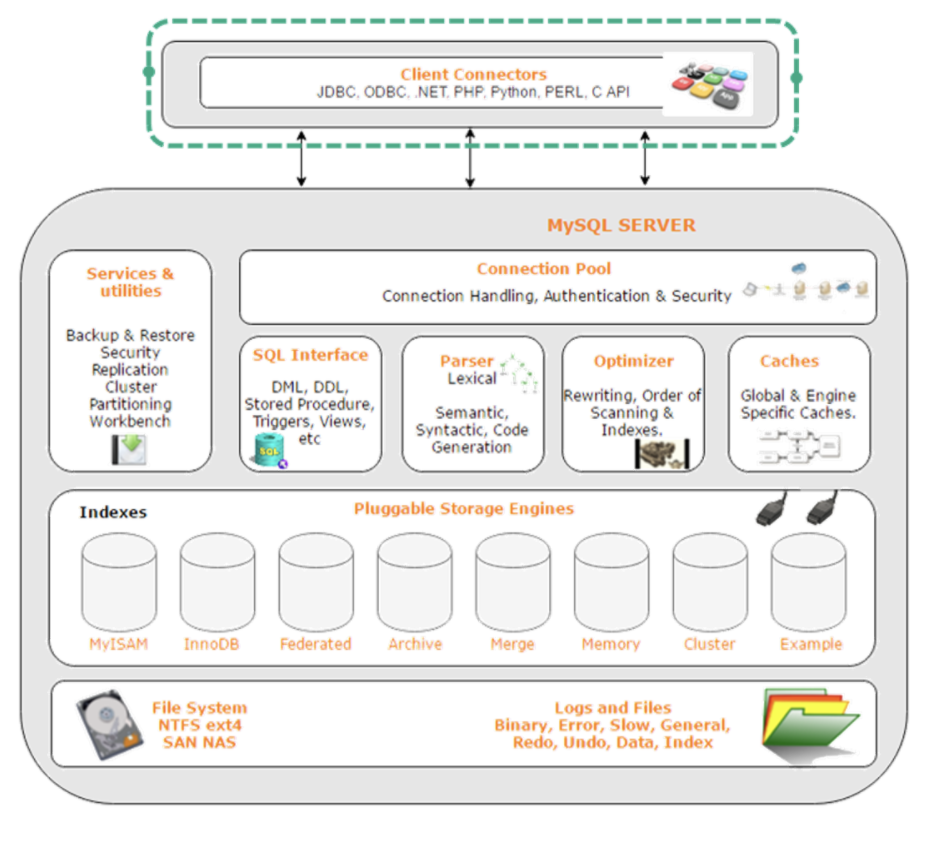
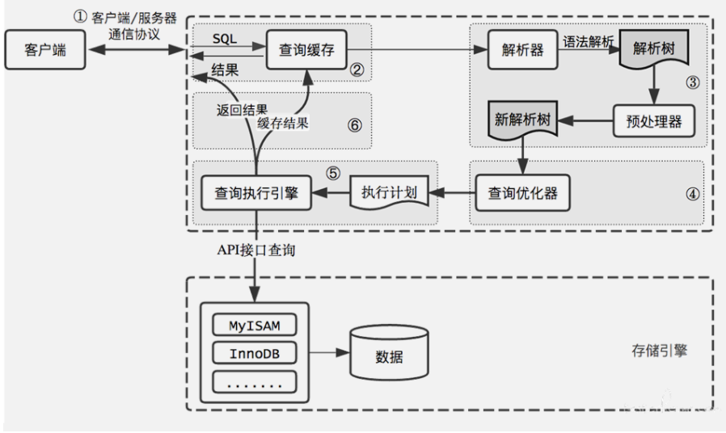
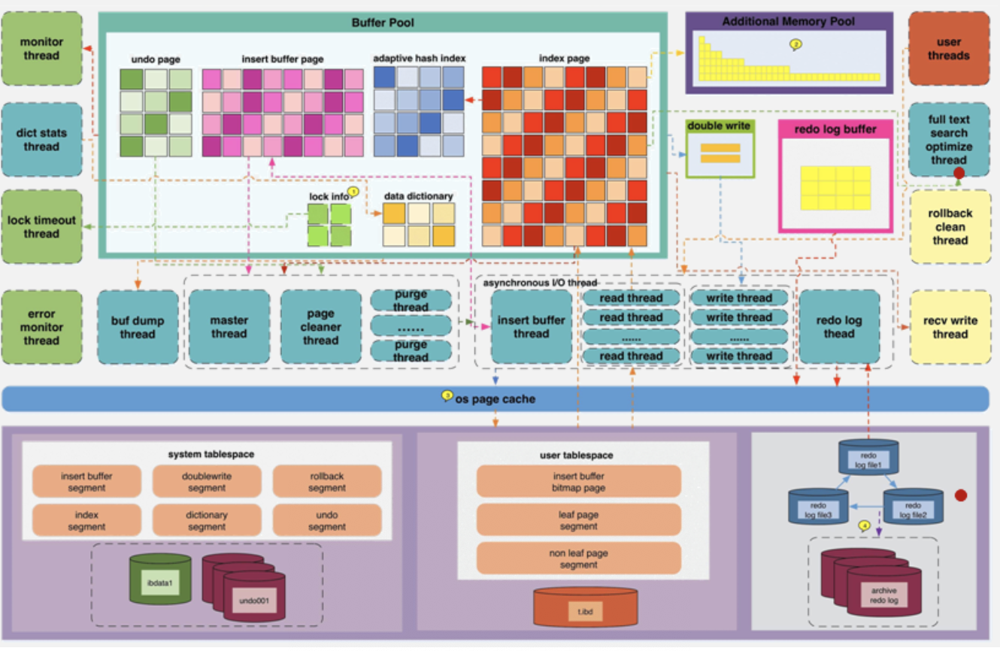
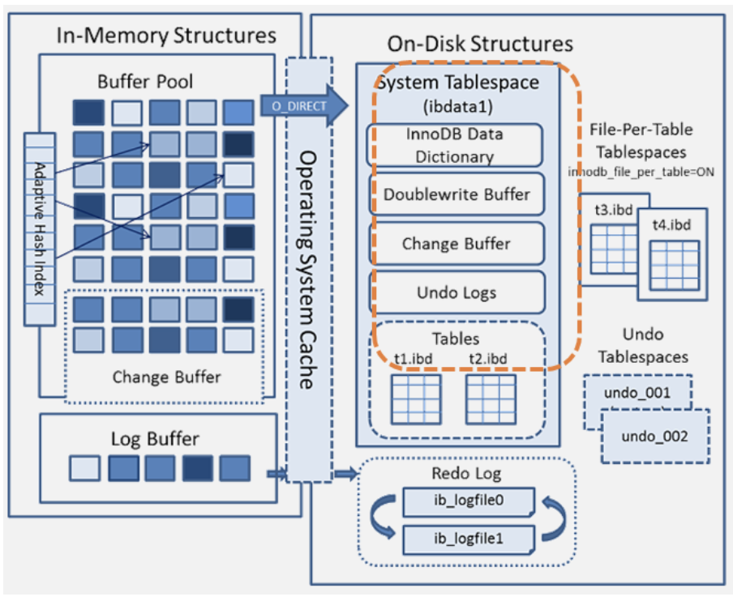
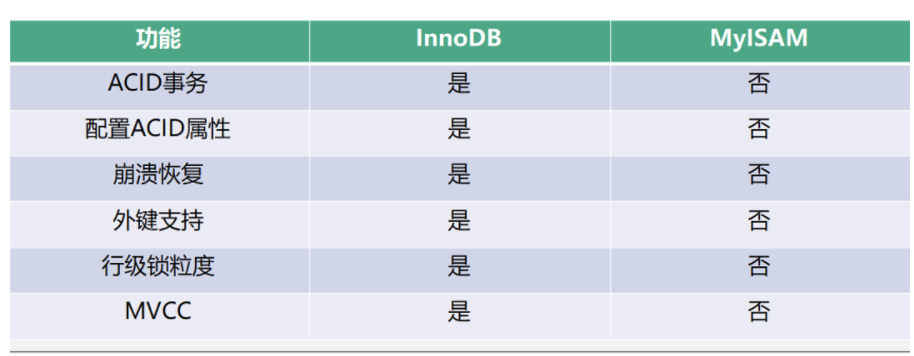
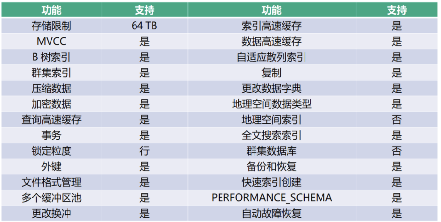
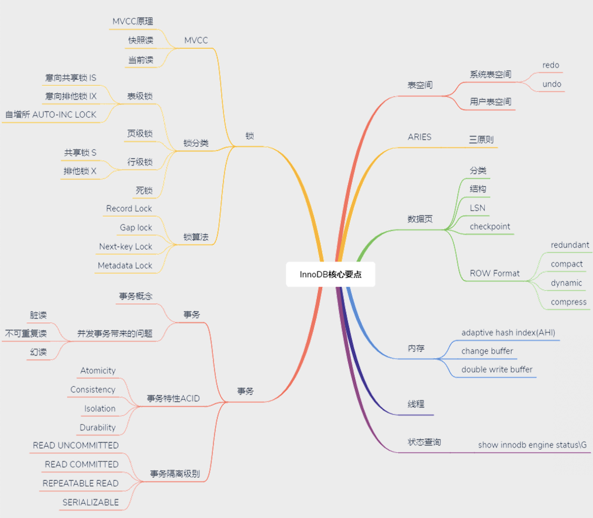

## MySql体系结构和存储引擎

[toc]

### MySQL 体系结构

MySQL 体系结构由 Client Connectors 层、MySQL Server 层及存储引擎层组成。

- Client Connectors 层

  负责处理客户端的连接请求，与客户端创建连接。目前 MySQL 几乎支持所有的连接类型，例如常见的 JDBC、Python、Go 等。

- MySQL Server 层

  MySQL Server 层主要包括 Connection Pool、Service & utilities、SQL interface、Parser解析器、Optimizer 查询优化器、Caches 缓存等模块。

  - Connection Pool

  负责处理和存储数据库与客户端创建的连接，一个线程负责管理一个连接。Connection Pool 包括了用户认证模块，就是用户登录身份的认证和鉴权及安全管理，也就是用户执行操作权限校验。

  - Caches

  缓存包括各个存储引擎的缓存部分，比如：InnoDB 存储的 Buffer Pool、MyISAM 存储引擎的 key buffer 等，Caches 中也会缓存一些权限，也包括一些 Session 级别的缓存。

  - Parser解析器

  对 SQL 语句进行语法解析生成解析树。

  - Optimizer

  查询优化器会根据解析树生成执行计划，并选择合适的索引，然后按照执行计划执行 SQL 语言并与各个存储引擎交互。

  - SQL interface

  负责接收客户端发送的各种 SQL 语句，比如 DML、DDL 和存储过程等。

  - Service & utilities 是管理服务&工具集，

  包括备份恢复、安全管理、集群管理服务和工具。

- 存储引擎层

  存储引擎包括 MyISAM、InnoDB，以及支持归档的 Archive 和内存的 Memory 等。MySQL是插件式的存储引擎，只要正确定义与 MySQL Server 交互的接口，任何引擎都可以访问MySQL。

### 一条select的执行过程

①通过客户端/服务器通信协议与 MySQL 建立连接。

②查询缓存，这是 MySQL 的一个可优化查询的地方，如果开启了 Query Cache 且在查询缓存过程中查询到完全相同的 SQL 语句，则将查询结果直接返回给客户端；如果没有开启Query Cache 或者没有查询到完全相同的 SQL 语句则会由解析器进行语法语义解析，并生成解析树。

③预处理器生成新的解析树。

④查询优化器生成执行计划。

⑤查询执行引擎执行 SQL 语句，此时查询执行引擎会根据SQL 语句中表的存储引擎类型，以及对应的 API 接口与底层存储引擎缓存或者物理文件的交互情况，得到查询结果，由MySQL Server 过滤后**将查询结果缓存并返回给客户端**。若开启了 Query Cache，这时也会将SQL 语句和结果完整地保存到 Query Cache 中，以后若有相同的 SQL 语句执行则直接返回结果。

### InnoDB 存储引擎

上半部分是实例层（计算层），位于内存中，下半部分是物理层，位于文件系统中。

#### **实例层**

实例层分为线程和内存。InnoDB 重要的线程有 Master Thread，Master Thread 是 InnoDB 的主线程，负责调度其他各线程。

Master Thread 的优先级最高, 其内部包含几个循环：主循环（loop）、后台循环（background loop）、刷新循环（flush loop）、暂停循环（suspend loop）。Master Thread 会根据其内部运行的相关状态在各循环间进行切换。

大部分操作在主循环（loop）中完成，其包含 1s 和 10s 两种操作。

- 1s 操作主要包括如下。

- - 日志缓冲刷新到磁盘（这个操作总是被执行，即使事务还没有提交）。
  - 最多可能刷 100 个新脏页到磁盘。
  - 执行并改变缓冲的操作。
  - 若当前没有用户活动，可能切换到后台循环（background loop）等。

- 10s 操作主要包括如下。

- - 最多可能刷新 100 个脏页到磁盘。
  - 合并至多 5 个被改变的缓冲（总是）。
  - 日志缓冲刷新到磁盘（总是）。
  - 删除无用的 Undo 页（总是）。
  - 刷新 100 个或者 10 个脏页到磁盘（总是）产生一个检查点（总是）等。
  - buf_dump_thread 负责将 buffer pool 中的内容 dump 到物理文件中，以便再次启动 MySQL 时，可以快速加热数据。
  - page_cleaner_thread 负责将 buffer pool 中的脏页刷新到磁盘，在 5.6 版本之前没有这个线程，刷新操作都是由主线程完成的，所以在刷新脏页时会非常影响 MySQL 的处理能力，在5.7 版本之后可以通过参数设置开启多个 page_cleaner_thread。
  - purge_thread 负责将不再使用的 Undo 日志进行回收。
  - read_thread 处理用户的读请求，并负责将数据页从磁盘上读取出来，可以通过参数设置线程数量。
  - write_thread 负责将数据页从缓冲区写入磁盘，也可以通过参数设置线程数量，page_cleaner 线程发起刷脏页操作后 write_thread 就开始工作了。
  - redo_log_thread 负责把日志缓冲中的内容刷新到 Redo log 文件中。
  - insert_buffer_thread 负责把 Insert Buffer 中的内容刷新到磁盘。实例层的内存部分主要包含 InnoDB Buffer Pool，这里包含 InnoDB 最重要的缓存内容。数据和索引页、undo 页、insert buffer 页、自适应 Hash 索引页、数据字典页和锁信息等。additional memory pool 后续已不再使用。Redo buffer 里存储数据修改所产生的 Redo log。double write buffer 是 double write 所需的 buffer，主要解决由于宕机引起的物理写入操作中断，数据页不完整的问题。

#### **物理层**

​	物理层在逻辑上分为系统表空间、用户表空间和 Redo日志。

​	系统表空间里有 ibdata 文件和一些 Undo，ibdata 文件里有 insert buffer 段、double write段、回滚段、索引段、数据字典段和 Undo 信息段。

​	用户表空间是指以 .ibd 为后缀的文件，文件中包含 insert buffer 的 bitmap 页、叶子页（这里存储真正的用户数据）、非叶子页。InnoDB 表是索引组织表，采用 B+ 树组织存储，数据都存储在叶子节点中，分支节点（即非叶子页）存储索引分支查找的数据值。

​	Redo 日志中包括多个 Redo 文件，这些文件循环使用，当达到一定存储阈值时会触发checkpoint 刷脏页操作，同时也会在 MySQL 实例异常宕机后重启，InnoDB 表数据自动还原恢复过程中使用。

#### **内存和物理结构**

**用户读取或者写入的最新数据都存储在 Buffer Pool 中**，如果 Buffer Pool 中没有找到则会读取物理文件进行查找，之后存储到 Buffer Pool 中并返回给 MySQL Server。**Buffer Pool 采用LRU 机制**，具体的内存队列和刷新机制。

Buffer Pool 决定了一个 SQL 执行的速度快慢。在单机单实例情况下，我们可以配置 Buffer Pool 为物理内存的 60%~80%，剩余内存用于 session 产生的 sort 和 join 等，以及运维管理使用。

如果是单机多实例，所有实例的buffer pool总量也不要超过物理内存的80%。

根据 show global status like '%buffer_pool_wait%' 的值来看是否需要调整 Ber Pool 的大小。

Redo log 是一个循环复用的文件集，负责记录 InnoDB 中所有对 Buffer Pool的物理修改日志。当 Redo log文件空间中，检查点位置的 LSN 和最新写入的 LSN 差值（checkpoint_age）达到 Redo log 文件总空间的 75% 后，InnoDB 会进行异步刷新操作，直到降至 75% 以下，并释放 Redo log 的空间；当 checkpoint_age 达到文件总量大小的 90% 后，会触发同步刷新，此时 InnoDB 处于挂起状态无法操作。

#### **新版本特性**

MySQL 5.7 版本新特性如下：

- 将 Undo 从共享表空间 ibdata 文件中分离出来，可以在安装 MySQL 时由用户自行指定文件大小和数量。
- 增加了 temporary 临时表空间，里面存储着临时表或临时查询结果集的数据。
- Buffer Pool 大小可以动态修改，无需重启数据库实例，这是 DBA 的福音。

MySQL 8.0 版本新特性如下：

- 将 InnoDB 表的数据字典和 Undo 都从共享表空间 ibdata 中彻底分离出来了，以前需要ibdata 文件中数据字典与独立表空间 ibd 文件中数据字典一致才行，8.0 版本就不需要了。
- temporary 临时表空间也可以配置多个物理文件，而且均为 InnoDB 存储引擎并能创建索引，这样加快了处理的速度。
- 用户可以像 Oracle 数据库那样设置一些表空间，每个表空间对应多个物理文件，每个表空间可以给多个表使用，但一个表只能存储在一个表空间中。

### **InnoDB 和 MyISAM**

#### **功能对比**

- InnoDB 支持 ACID 的事务 4 个特性，而 MyISAM 不支持；
- InnoDB 支持 4 种事务隔离级别，默认是可重复读 Repeatable Read 的，MyISAM 不支持；
- InnoDB 支持 crash 安全恢复，MyISAM 不支持；
- InnoDB 支持外键，MyISAM 不支持；
- InnoDB 支持行级别的锁粒度，MyISAM 不支持，只支持表级别的锁粒度；
- InnoDB 支持 MVCC，MyISAM 不支持；

InnoDB 表最大还可以支持 64TB，支持聚簇索引、支持压缩数据存储，支持数据加密，支持查询/索引/数据高速缓存，支持自适应hash索引、空间索引，支持热备份和恢复等，如下图所示。

#### 性能对比

在性能对比上，InnoDB 也完胜 MyISAM，如下图所示。

1. 读写混合模式下，随着 CPU 核数的增加，InnoDB 的读写能力呈线性增长，
2. 在测试用例里，最高可达近 9000 的 TPS，但 MyISAM 因为读写不能并发，它的处理能力跟核数没关系，呈一条水平线，TPS 低于 500。
3. 只读模式下，随着 CPU 核数的增加，InnoDB 的读写能力呈线性增长，最高可达近 14000 的 TPS，但 MyISAM 的处理能力不到 3000 TPS。

以上测试仅为说明 InnoDB 比 MyISAM 的处理能力强大，具体 TPS 测试数据跟硬件和测试条件不同而有很大差异。

### **InnoDB 存储引擎特性**

#### **核心特性**

InnoDB 存储引擎的核心特性包括：MVCC、锁、锁算法和分类、事务、表空间和数据页、内存线程以及状态查询。其中锁和事务会在下一节课时讲解。本课时我们已经学习了 InnoDB 的表空间和实例等。

#### ARIES 三原则

ARIES 三原则，是指 Write Ahead Logging（WAL）。

1. 先写日志后写磁盘，日志成功写入后事务就不会丢失，后续由 checkpoint 机制来保证磁盘物理文件与 Redo 日志达到一致性；
2. 利用 Redo 记录变更后的数据，即 Redo 记录事务数据变更后的值；
3. 利用 Undo 记录变更前的数据，即 Undo 记录事务数据变更前的值，用于回滚和其他事务多版本读。

show engine innodb status\G 的结果里面有详细的 InnoDB 运行态信息，分段记录的，包括内存、线程、信号、锁、事务等