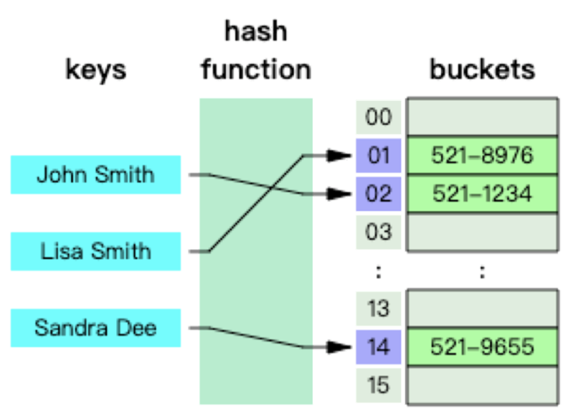
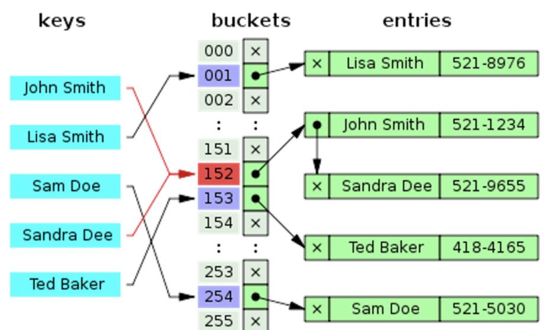
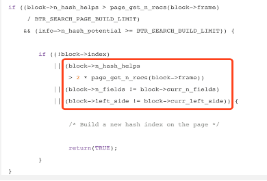
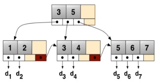
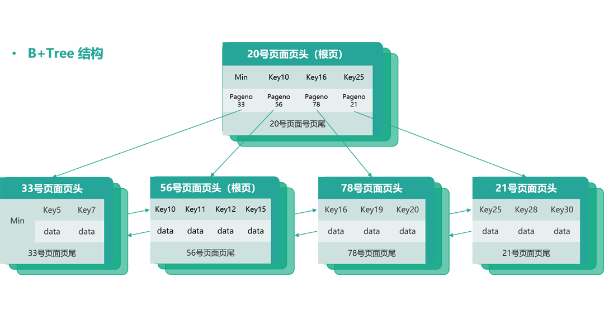
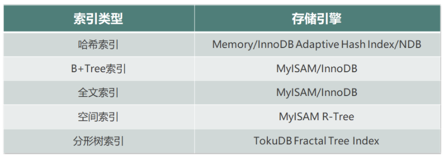
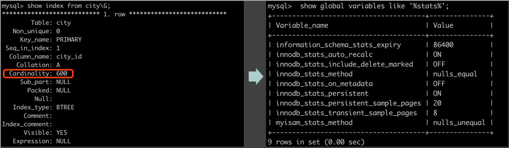
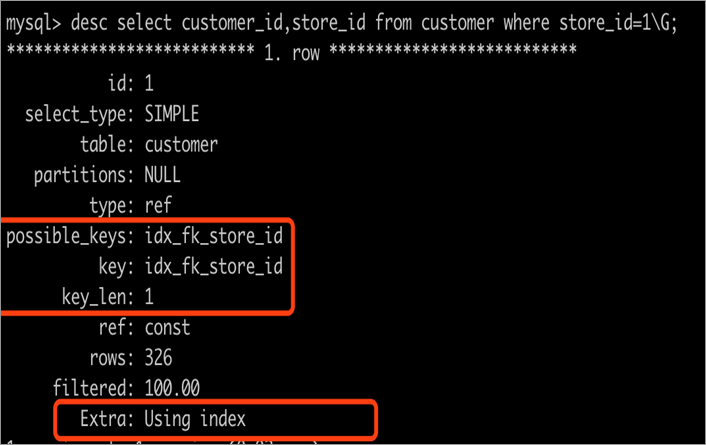
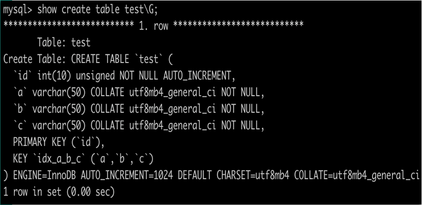
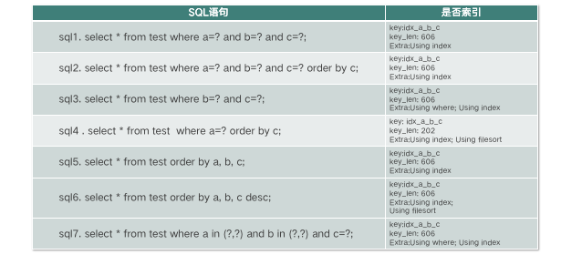

# 高性能索引设计

[toc]

## 索引设计和工作原理

MySQL 官方对索引（Index）的定义是存储引擎用于快速查找记录的一种数据结构。

- 索引是物理数据页，数据库页大小（Page Size）决定了一个页可以存储多少个索引行，以及需要多少页来存储指定大小的索引。
- 索引可以加快检索速度，但同时也降低索引列插入、删除、更新的速度，索引维护需要代价。

索引涉及的理论知识有二分查找法、哈希表及 B+Tree。

### 二分查找法

它的优点是等值查询、范围查询性能优秀，缺点是更新数据、新增数据、删除数据维护成本高。二分查找是索引实现的理论基础。

## 索引原理

在数据库中大部分索引都是通过 B+Tree 来实现的。当然也涉及其他数据结构，在 MySQL 中除了 B+Tree 索引外我们还需要关注下 Hash 索引。

### Hash索引

哈希表是数据库中哈希索引的基础，是根据键值 <key,value> 存储数据的结构。简单说，哈希表是使用哈希函数将索引列计算到桶或槽的数组，实际存储是根据哈希函数将 key 换算成确定的存储位置，并将 value 存放到该数组位置上。访问时，只需要输入待查找的 key，即可通过哈希函数计算得出确定的存储位置并读取数据。

数据库中哈希索引是基于哈希表实现的，对于哈希索引列的数据通过 Hash 算法计算，得到对应索引列的哈希码形成哈希表，由哈希码及哈希码指向的真实数据行的指针组成了哈希索引。哈希索引的应用场景是**只在对哈希索引列的等值查询才有效**。通过 Hash 算法对每一行 字段的数据进行计算，得出 Hash 码。由 Hash 码及 Hash 码指向真实数据行的指针组成了哈希索引。

**哈希索引只存储哈希值和行指针，不存储实际字段值，所以其结构紧凑，查询速度也非常快，在无哈希冲突的场景下访问哈希索引一次即可命中。**但是哈希索引只适用于等值查询，包括 =、IN()、<=> （安全等于， select null <=> null 和 select null=null 是不一样的结果) ，不支持范围查询。

另外，哈希索引的性能跟哈希冲突数量成反比，哈希冲突越多其维护代价越大性能越低。 

### Hash碰撞处理

Hash 碰撞是指不同索引列值计算出相同的哈希码。 对于 Hash 碰撞通用的处理方法是使用链表，将 Hash 冲突碰撞的元素形成一个链表，发生冲突时在链表上进行二次遍历找到数据。

- Hash 碰撞跟选择的 Hash 算法有关系，为了减少 Hash 碰撞的概率，优先选择避免 Hash 冲突的 Hash 算法，例如，使用 Percona Server 的函数 FNV64() ，其哈希值为 64 位，出现 Hash 冲突的概率要比 CRC32 小很多。
- 其次是考虑性能，优先选择数字类型的 Hash 算法，因为字符串类型的 Hash 算法不仅浪费空间而且不方便进行比较。 

建议 Hash 算法使用优先级为：FNV64 > CRC32 （大数据量下 Hash 冲突概率较大）> MD5 > SHA1。 

### 如何使用 Hash 索引

在 MySQL 中主要是分为 Memory 存储引擎原生支持的 Hash 索引 、InnoDB 自适应哈希索引及 NDB 集群的哈希索引3类。

InnoDB 自适应哈希索引是为了提升查询效率，**InnoDB 存储引擎会监控表上各个索引页的查询，当 InnoDB 注意到某些索引值访问非常频繁时，会在内存中基于 B+Tree 索引再创建一个哈希索引，使得内存中的 B+Tree 索引具备哈希索引的功能，即能够快速定值访问频繁访问的索引页。**

当满足下面三个条件时，InnoDB 为整个 block 构建 AHI 记录项：

- 分析使用自适应哈希索引（AHI）可以成功查询的次数是否超过 block 上记录数的1/16；
- btr_search_info::n_hash_potential大于或等于BTR_SEARCH_BUILD_LIMIT (100)，表示为 SQL 查询能够连续 100 次成功使用 AHI；
- 尚未为当前 block 构造索引或者当前 block 上已经构建了 AHI 索引且 block->n_hash_helps 大于 page 上记录数的两倍或者当前 block上 推荐的前缀索引列发生了变化 。

为什么要为 B+Tree 索引页二次创建自适应哈希索引呢？因为B+Tree 索引的查询效率取决于 B+Tree 的高度，在数据库系统中通常 B+Tree 的高度为 3～4 层，所以访问数据需要做 3～4 次的查询。而 Hash 索引访问通常一次查找就能定位数据（无 Hash 碰撞的情况），其等值查询场景 Hash 索引的查询效率要优于 B+Tree。

自适应哈希索引是在内存中基于 B+Tree 索引构建的

## B+Tree索引

一个简单的、标准的 B+tree，每个节点有 K 个键值和 K+1 个指针。

每一个叶子节点都包含指向下一个叶子节点的指针。

在 MySQL 中，索引是在存储引擎层而非服务器层实现的，所以**不同存储引擎层支持的索引类型可以不同**。例如，**虽然 MyISAM 和 InnoDB 的索引都是使用 B+Tree 实现的，但是其实际数据存储结构有不少差异**。下图中 B+Tree 示例一共2层，图中每个页面都已经被随机编号（编号可以认定为页面号），其中页面号为 20 的页面是 B+Tree 的根页面（根页面通常是存放在内存中的），**根页面存储了 <key+pageno>**，pageno 是指向具体叶子节点的页面号。**其他页面都是叶子节点，存放了具体的数据 <key+data>**。    

B+Tree 索引能够快速访问数据，就是**因为存储引擎可以不再需要通过全表扫描来获取数据，而是从索引的根结点（通常在内存中）开始进行二分查找**，**根节点的槽中都存放了指向子节点的指针**，存储引擎根据这些指针能够快速遍历数据。例如，通过页面号为 20 的根节点可以快速得知 Key<10 的数据在 pageno 33 的页面，key在 [10,16) 范围的数据在 pageno 56 的页面。

叶子节点存放的 <key+data> ，**对于真正要存放哪些数据还得取决于该 B+Tree 是聚簇索引（Clustered Index）还是辅助索引（Secondary Index）。**

### 聚簇索引和辅助索引

聚簇索引是一种数据存储方式，**它表示表中的数据按照主键顺序存储，是索引组织表。InnoDB 的聚簇索引就是按照主键顺序构建 B+Tree，B+Tree 的叶子节点就是行记录，数据行和主键值紧凑地存储在一起。** 这也意味着 InnoDB 的主键索引就是数据表本身，它按主键顺序存放了整张表的数据。

而 InnoDB 辅助索引（也叫作二级索引）只是根据索引列构建 B+Tree，但在 B+Tree 的每一行都存了主键信息，加速回表操作。 

聚簇索引占用的空间就是整个表数据量的大小，而二级索引会比聚簇索引小很多， 通常创建辅助索引就是为了提升查询效率。

InnoDB 只能创建一个聚簇索引,但可以创建多个辅助索引。

相比索引组织表，还有一种堆表类型，堆表是根据数据写入的顺序直接存储在磁盘上的。对于堆表而言，其主键和辅助索引唯一的区别就是键值是否唯一，两者都是根据索引列排序构建 B+Tree 的，在每个叶子节点加上指向堆表的行指针（row data pointer） 。堆表在各类数据库中也被广泛使用，MyISAM 存储引擎的表就是堆表。

### 索引类型

在 MySQL 中不同存储引擎间支持的常见索引类型有：哈希索引（Memory/InnoDB adaptive Hash index/NDB）、 B+Tree 索引（MyISAM/InnoDB）、全文索引（MyISAM/InnoDB）、空间索引（MyISAM R-Tree）、分形树索引（TokuDB Fractal Tree Index），如下表所示。

在 MySQL InnoDB 中索引通常可以分为两大类：主键索引（即聚簇索引）和辅助索引（非聚簇索引） 。

对于没有指定主键的表，InnoDB 会自己选择合适字段为主键，其选择顺序如下：

1. 显式主键；
2. 第一个唯一索引（要求唯一索引所有列都非 NULL）；
3. 内置的 6 字节 ROWID。

根据索引列个数和功能描述不同索引也可以分为：联合索引和覆盖索引。

- 联合索引是指在多个字段联合组建索引的。
- 当通过索引即可查询到所有记录，不需要回表到聚簇索引时，这类索引也叫作覆盖索引。
- 主键查询是天然的覆盖索引，联合索引可以是覆盖索引。

通常在查看执行计划时， Extra 列为 Using index 则表示优化器使用了覆盖索引。

通常建议优先考虑使用覆盖索引，这是因为如果 SQL 需要查询辅助索引中不包含的数据列时，就需要先通过辅助索引查找到主键值，然后再回表通过主键查询到其他数据列（即回表查询），需要查询两次。而覆盖索引能从索引中直接获取查询需要的所有数据，从⽽避免回表进行二次查找，节省IO，效率较⾼。

SELECT email，uid FROM user_email WHERE uid=xx，如果 uid 不是主键，那可以将索引添加为 index(uid，email)，以获得查询性能提升。

### 索引使用技巧

谓词、过滤因子、基数（Cardinality）、选择率和回表概念。

先来看谓词。谓词本身就是条件表达式，通俗讲就是过滤字段。如下图中这句SQL语句，可以拆解为下面所示：

   

- 简单谓词：city和 last_updata。
- 组合谓词：city and last_updata。

过滤因子直接描述了谓词的选择性，表示满足谓词条件的记录行数所占比例，过滤因子越小意味着能过滤越多数据，你需要在这类谓词字段上创建索引。

过滤因子的计算算法，就是满足谓词条件的记录行数除以表总行数。

- 简单谓词的过滤因子 = 谓词结果集的数量 / 表总行数
- 组合谓词的过滤因子 = 谓词 1 的过滤因子 × 谓词 2 的过滤因子 

基数是某个键值去重后的行数。

选择率是 count(distinct city) / count(*)，选择率越接近 1 则越适合创建索引，例如主键和唯一键的选择率都是 1。回表是指无法通过索引扫描访问所有数据，需要回到主表进行数据扫描并返回。

如何快速根据 SQL 语句计算谓词、过滤因子、基数和选择率。

1. 根据 SQL 语句可以快速得到谓词信息：简单谓词 city 和 last_update，组合谓词 city and last_update。
2. 计算每个谓词信息的过滤因子，过滤因子越小表示选择性越强，字段越适合创建索引。例如：

3. city 的过滤因子 = 谓词 city 结果集的数量 / 表总行数 = select count(*) from city where city = ‘BeiJing’ / select count(*) from city =20% ；

4. last_update 的过滤因子 = 谓词 last_update 结果集的数量 / 表总行数 = select count(*) from city where last_update = ‘2019-08-01’/ select count(*) from city = 10%；

5. 组合谓词 = city 过滤因子 * last_update 过滤因子 = 20% × 10% = 2%，组合谓词的过滤因子为 2%，即只有表总行数的 2% 匹配过滤条件，可以考虑创建组合索引 (city，last_update)。

MySQL InnoDB 的统计信息参考基数 Cardinality 的信息。

#### Cardinality

Cardinality 能快速告知字段的选择性，高选择性字段有利于创建索引。优化器在选择执行计划时会依赖该信息，通常这类信息也叫作统计信息，数据库中对于统计信息的采集是在存储引擎层进行的。

 

执行 show index from table_name 会看到 Cardinality，同时也会触发 MySQL 数据库对 Cardinaltiy 值的统计。除此之外，还有三种更新策略。

- 触发统计：Cardinality 统计信息更新发生在 INSERT 和 UPDATE 时，InnoDB 存储引擎内部更新的 Cardinality 信息的策略为：

表中超过1/16的数据发生变化；

stat_modified_counter > 2000 000 000 （20亿）。

- 采样统计（sample）：为了减少统计信息更新造成的资源消耗，数据库对Cardinality 通过采样来完成统计信息更新，每次随机获取 innodb_stats_persistent_sample_pages 页的数量进行 Cardinality 统计。
- 手动统计：alter table table_name engine=innodb 或 analyze table table_name，当发现优化器选择错误的执行计划或没有走理想的索引时，执行 SQL 语句来手动统计信息有时是一种有效的方法。

由于采样统计的信息是随机获取8个（8是由innodb_stats_transient_sample_pages参数指定）页面数进行分析，这就意味着下一次随机的 8 个页面可能是其他页面，其采集页面的 Carinality 也不同。因此当表数据无变化时也会出现 Cardinality 发生变化的情况，如下图所示。

关于统计信息的采集涉及如下主要参数。

- information_schema_stats_expiry:86400，Cardinality 存放过期时间，设置为 0 表示实时获取统计信息，严重影响性能，建议设置默认值并通过手动刷新统计信息；
- innodb_stats_auto_recalc:ON，是否自动更新统计信息，默认即可；
- innodb_stats_include_delete_marked :OFF，计算持久化统计信息时 InnoDB 是否包含 Delete-marked 记录，默认即可；
- innodb_stats_method:nulls_equal，用来判断如何对待索引中出现的 NULL 值记录，默认为 nulls_equal，表示将 NULL 值记录视为相等的记录；
- innodb_stats_on_metadata， 默认值 OFF，执行 SQL 语句 ANALYZE TABLE、SHOW TABLE STATUS、SHOQ INDEX，以及访问 INFORMATION_SCHEMA 架构下表 tables和statistics 时，是否重新计算索引的 Cardinality 值；
- innodb_stats_persistent:ON，表示通过 ANALYZE TABLE 计算得到的 Cardinality值存放到磁盘上；
- innodb_stats_persistent_sample_pages:20，表示 ANALYZE TABLE 更新Cardinality 值时采样页的数量；
- innodb_stats_transient_sample_pages:8，表示每次统计 Cardinality 时采样页的数量，默认为 8。

### 索引使用细节

首先是创建索引后如何确认 SQL 语句是否走索引了呢？创建索引后通过查看执行 SQL 语句的执行计划即可知道 SQL 语句是否走索引。执行计划重点关注跟索引相关的关键项，有 type、possible_keys、key、key_len、ref、Extra 等。

其中，possible_keys 表示查询可能使用的索引，key表示真正实际使用的索引，key_len 表示使用索引字段的长度。

另外执行计划中 Extra 选项也值得关注，例如 Extra 显示 use index 时就表示该索引是覆盖索引，通常**性能排序的结果是 usd index > use where > use filsort**，如下图所示。

当索引选择组合索引时，通过计算 key_len 来了解有效索引长度对索引优化也是非常重要的，接下来重点讲解 key_len 计算规则。

key_len 表示得到结果集所使用的选择索引的长度[字节数]，不包括 order by，也就是说如果 order by 也使用了索引则 key_len 不计算在内。

key_len 计算规则从两个方面考虑，一方面是索引字段的数据类型，另一方面是表、字段所使用的字符集。

1. 索引字段的数据类型，根据索引字段的定义可以分为变长和定长两种数据类型：

- 索引字段为定长数据类型，比如 char、int、datetime，**需要有是否为空的标记**，这个标记需要占用 1 个字节；
- 对于变长数据类型，比如 Varchar，**除了是否为空的标记外，还需要有长度信息，需要占用 2 个字节**；（备注：当字段定义为非空的时候，是否为空的标记将不占用字节）。

2. 表所使用的字符集，不同的字符集计算的 key_len 不一样，例如，GBK 编码的是一个占用 2 个字节大小的字符，UTF8 编码的是一个占用 3 个字节大小的字符。

举例说明：在四类字段上创建索引后的 key_len 如何计算呢？

- Varchar(10) 变长字段且允许 NULL:10*(Character Set：utf8=3，gbk=2，latin1=1)+1（标记是否为 NULL 需要 1 个字节）+ 2（变长字段存储长度信息需要 2 个字节）。
- Varchar(10) 变长字段且不允许 NULL:10*(Character Set：utf8=3，gbk=2，latin1=1)+2（变长字段存储长度信息需要2个字节），非空不再需要占用字节来标记是否为空。
- Char(10) 固定字段且允许 NULL:10*(Character Set：utf8=3，gbk=2，latin1=1)+1（标记是否为 NULL 需要 1 个字节）。 
- Char(10) 固定字段且不允许 NULL:10*(Character Set：utf8=3，gbk=2，latin1=1)，非空不再需要占用字节来标记是否为空。

### 最左前缀匹配原则

最左前缀匹配原则是**指在使用 B+Tree 联合索引进行数据检索时，MySQL 优化器会读取谓词（过滤条件）并按照联合索引字段创建顺序一直向右匹配直到遇到范围查询或非等值查询后停止匹配，此字段之后的索引列不会被使用**，这时计算 key_len 可以分析出联合索引实际使用了哪些索引列。

创建一个 test 表。 在 a、b、c 上创建索引，执行表中的 SQL 语句，快速定位语句孰好孰坏。

首先分析 key_len， 因为 a、b、c 不允许 NULL 的 varchar(50)，那么，每个字段的 key_len 为 50×4+2=202，整个联合索引的 key_len 为 202×3=606。

- SQL1 可以使用覆盖索引，性能好；
- SQL2 可以使用覆盖索引同时可以避免排序，性能好；
- SQL3 可以使用覆盖索引，但是需要根据 where 字句进行过滤；
- SQL4 可以使用部分索引 a，但无法避免排序，性能差；
- SQL5 完全使用覆盖索引，同时可以避免排序，性能好；
- SQL6 可以使用覆盖索引，但无法避免排序，这是因为 MySQL InnoDB 创建索引时默认asc升序，索引无法自动倒序排序；
- SQL7 可以使用覆盖索引，但是需要根据 where 子句进行过滤（非定值查询）。

 **设计索引。**

也可以使用第三方工具进行索引设计，例如 Arkcontrol SQL 优化助手，会给出设计索引的建议。

**创建索引策略**。

优先为搜索列、排序列、分组列创建索引，必要时加入查询列创建覆盖索引；计算字段列基数和选择率，选择率越接近于 1 越适合创建索引；索引选用较小的数据类型（整型优于字符型），字符串可以考虑前缀索引；不要建立过多索引，优先基于现有索引调整顺序；参与比较的字段类型保持匹配并创建索引。

**调优索引。**

分析执行计划；更新统计信息（Analyze Table）；Hint优化，方便调优（FORCE INDEX、USE INDEX、IGNORE INDEX、STRAIGHT_JOIN）；检查连接字段数据类型、字符集；避免使用类型转换；关注 optimizer_switch，重点关注索引优化特性 MRR（Multi-Range Read）和 ICP（Index Condition Pushdown）。

- MRR 优化是为了减少磁盘随机访问，将随机 IO 转化为顺序 IO 的数据访问，其方式是将查询得到辅助索引的键值放到内存中进行排序，通常是按照主键或 RowID 进行排序，当需要回表时直接根据主键或 RowID 排序顺序访问实际的数据文件，加速 SQL 查询。
- ICP 优化同样也是对索引查询的优化特性，MySQL 根据索引查询到数据后会优先应用 where 条件进行数据过滤，即无法使用索引过滤的 where 子句，其过滤由之前 Server 层的数据过滤下推到了存储引擎层，可以减少上层对记录的检索，提高数据库的整体性能。

**创建索引规范**

- 命名规范， 各个公司内部统一。
- 考虑到索引维护的成本，单张表的索引数量不超过 5 个，单个索引中的字段数不超过 5 个。
- **表必需有主键，推荐使⽤ UNSIGNED 自增列作为主键**。表不设置主键时 InnoDB 会默认设置隐藏的主键列，不便于表定位数据同时也会增大 MySQL 运维成本（例如主从复制效率严重受损、pt 工具无法使用或正确使用）。
- 唯一键由 3 个以下字段组成，并且在字段都是整形时，可使用唯一键作为主键。其他情况下，建议使用自增列或发号器作主键。 
- 禁止冗余索引、禁止重复索引，索引维护需要成本，新增索引时优先考虑基于现有索引进行 rebuild，例如 (a,b,c)和 (a,b)，后者为冗余索引可以考虑删除。重复索引也是如此，例如索引(a)和索引(a,主键ID) 两者重复，增加运维成本并占用磁盘空间，按需删除冗余索引。
- **联表查询时，JOIN 列的数据类型必须相同，并且要建⽴索引**。 
- 不在低基数列上建⽴索引，例如“性别”。 在低基数列上创建的索引查询相比全表扫描不一定有性能优势，特别是当存在回表成本时。
- 选择区分度（选择率）大的列建立索引。组合索引中，区分度（选择率）大的字段放在最前面。 
- 对过长的 Varchar 段建立索引。建议优先考虑前缀索引，或添加 CRC32 或 MD5 伪列并建⽴索引。 
- **合理创建联合索引，(a,b,c) 相当于 (a) 、(a,b) 、(a,b,c)。** 
- 合理使用覆盖索引减少IO，避免排序。

