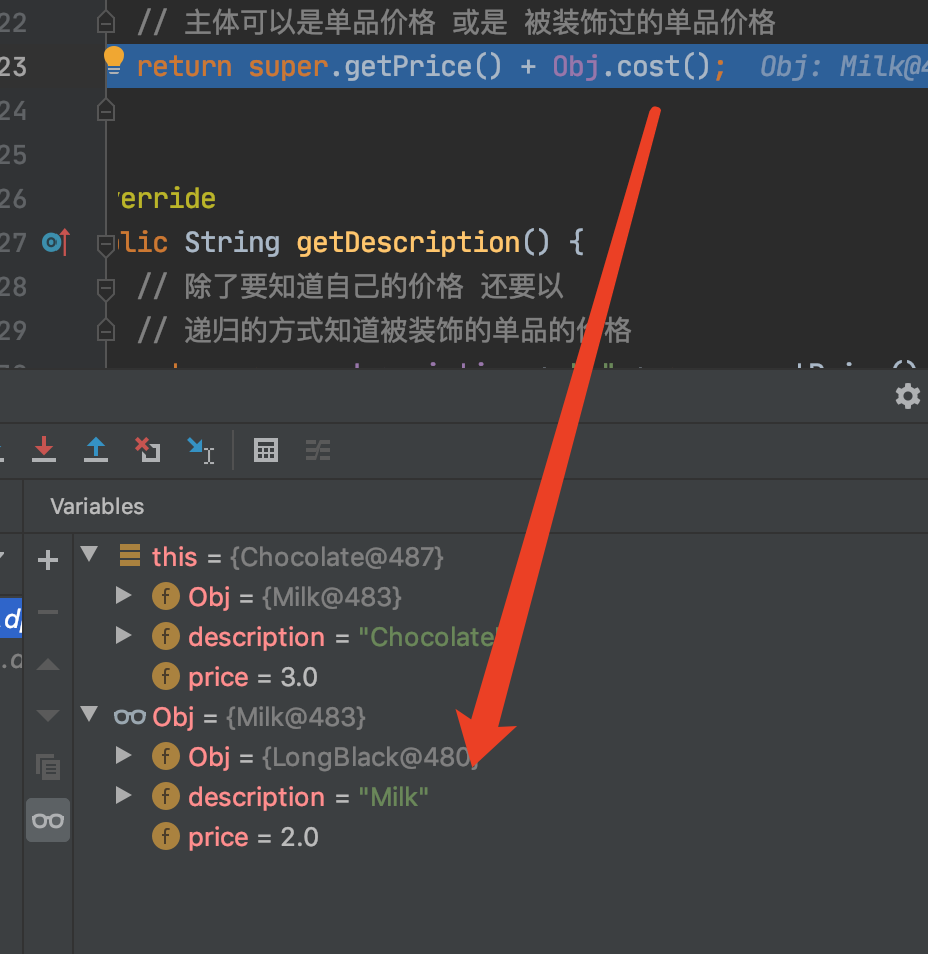

# 设计模式之--装饰模式

​	**装饰模式又名包装(Wrapper)模式。装饰模式以对客户端透明的方式扩展对象的功能，是继承关系的一个替代方案。**

​	**装饰模式以对客户透明的方式动态地给一个对象附加上更多的责任。换言之，客户端并不会觉得对象在装饰前和装饰后有什么不同。装饰模式可以在不使用创造更多子类的情况下，将对象的功能加以扩展。**


　在装饰模式中的角色有：

- **抽象构件(Component)角色：**给出一个抽象接口，以规范准备接收附加责任的对象。

- **具体构件(ConcreteComponent)角色：**定义一个将要接收附加责任的类。

- **装饰(Decorator)角色：**持有一个构件(Component)对象的实例，并定义一个与抽象构件接口一致的接口。

- **具体装饰(ConcreteDecorator)角色：**负责给构件对象“贴上”附加的责任。

### 源代码

抽象构件角色

```java
public interface Component {
    public void sampleOperation();
}
```

具体构件角色

```java
public class ConcreteComponent implements Component {

    @Override
    public void sampleOperation() {
        // 写相关的业务代码
    }
}
```

装饰角色

```java
public class Decorator implements Component{
    private Component component;
    
    public Decorator(Component component){
        this.component = component;
    }

    @Override
    public void sampleOperation() {
        // 委派给构件
        component.sampleOperation();
    }
}
```

具体装饰角色

```java
public class ConcreteDecoratorA extends Decorator {

    public ConcreteDecoratorA(Component component) {
        super(component);
    }
    
    @Override
    public void sampleOperation() {
　　　　　super.sampleOperation();
        // 写相关的业务代码
    }
}
```

```java
public class ConcreteDecoratorB extends Decorator {

    public ConcreteDecoratorB(Component component) {
        super(component);
    }
    
    @Override
    public void sampleOperation() {
　　　　  super.sampleOperation();
        // 写相关的业务代码
    }
}
```

透明的装饰模式也就是理想的装饰模式，要求具体构件角色、装饰角色的接口与抽象构件角色的接口完全一致。相反，如果装饰角色的接口与抽象构件角色接口不一致，也就是说装饰角色的接口比抽象构件角色的接口宽的话，装饰角色实际上已经成了一个适配器角色，这种装饰模式也是可以接受的，称为“半透明”的装饰模式。


案例：

咖啡馆订单项目: 

1)、咖啡种类:Espresso、ShortBlack、LongBlack、Decaf  

2)、调料:Milk、Soy、Chocolate  

3)、扩展性好、改动方便、维护方便


```java
 * @description: 超类 抽象类
 * 分为两个分支 一个是 咖啡单品 一个是调料
public abstract class Drink {
    public String description = "";
    private float price = 0f;

    public String getDescription() {
        return description;
    }

    public void setDescription(String description) {
        this.description = description;
    }

    public float getPrice() {
        return price;
    }

    public void setPrice(float price) {
        this.price = price;
    }

    // 抽象方法，主体单品只要返回价格 调料的返回要加主体单品价格
    public abstract float cost();
}
```


```java
/**
 * @projectName: desinepatterns
 * @description: 咖啡单品，中间层，只需要返回咖啡单品的价格
 * @author: Wangfulin
 * @create: 2020-05-16 15:37
 **/
public class Coffee extends Drink {
    @Override
    public float cost() {
        return super.getPrice();
    }
}
```

LongBlack 咖啡单品

```java
public class LongBlack extends Coffee {
    public LongBlack() {
        super.setDescription("LongBlack");
        super.setPrice(6.0f);
    }
}
```

调料 巧克力

```java
public class Chocolate extends Decorator {
    public Chocolate(Drink obj) {
        super(obj);

        // 设置描述和价格
        super.setDescription("Chocolate");
        super.setPrice(3.0f);
    }
}
```

牛奶 调料

```java
public class Milk extends Decorator {
    public Milk(Drink obj) {
        super(obj);
        super.setDescription("Milk");
        super.setPrice(2.0f);
    }
}
```


```java
public class CoffeeBar {
    public static void main(String[] args) {
        Drink order;
        // 加配料 递归叠加
        order=new LongBlack();
        // 包装 叠加
        order=new Milk(order);
        order=new Chocolate(order);
        System.out.println("order2 price:"+order.cost());
        System.out.println("order2 desc:"+order.getDescription());
    }
}
```

执行过程:

创建一个LongBlack单品订单，在该订单上叠加Milk。在执行Milk构造函数时，会将obj-->LongBlack向上传递。之后再添加Chocolate时，向上传递的是obj - > (Milk ->LongBlack ) 使用Milk包装的LongBlack。


调用cost()时，除了计算当前商品的价格以外，还需要加上obj里面的商品价格，层层递归。




来源：

[《JAVA与模式》之装饰模式](https://www.cnblogs.com/java-my-life/archive/2012/04/20/2455726.html)

[极客时间-设计模式之美](https://time.geekbang.org/column/intro/100039001)

---

代码：

- [设计模式](../../../icoding/desinepatterns/src/main/java/com/wangfulin/dp)

