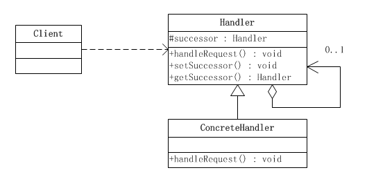

# 设计模式之--责任链模式

　　**责任链模式是一种对象的行为模式。在责任链模式里，很多对象由每一个对象对其下家的引用而连接起来形成一条链。请求在这个链上传递，直到链上的某一个对象决定处理此请求。发出这个请求的客户端并不知道链上的哪一个对象最终处理这个请求，这使得系统可以在不影响客户端的情况下动态地重新组织和分配责任。**

责任链可能是一条直线、一个环链或者一个树结构的一部分。

### 责任链模式的结构



责任链模式涉及到的角色如下所示：

　●**抽象处理者(Handler)角色：**定义出一个处理请求的接口。如果需要，接口可以定义 出一个方法以设定和返回对下家的引用。这个角色通常由一个Java抽象类或者Java接口实现。上图中Handler类的聚合关系给出了具体子类对下家的引用，抽象方法handleRequest()规范了子类处理请求的操作。

　●**具体处理者(ConcreteHandler)角色：**具体处理者接到请求后，可以选择将请求处理掉，或者将请求传给下家。由于具体处理者持有对下家的引用，因此，如果需要，具体处理者可以访问下家。

抽象处理者角色:

```java
public abstract class Handler {
    /**
     * 持有后继的责任对象
     */
    protected Handler successor;
    /**
     * 示意处理请求的方法，虽然这个示意方法是没有传入参数的
     * 但实际是可以传入参数的，根据具体需要来选择是否传递参数
     */
    public abstract void handleRequest();
    /**
     * 取值方法
     */
    public Handler getSuccessor() {
        return successor;
    }
    /**
     * 赋值方法，设置后继的责任对象
     */
    public void setSuccessor(Handler successor) {
        this.successor = successor;
    }
}
```

具体处理者角色:

```java
public class ConcreteHandler extends Handler {
    /**
     * 处理方法，调用此方法处理请求
     */
    @Override
    public void handleRequest() {
        /**
         * 判断是否有后继的责任对象
         * 如果有，就转发请求给后继的责任对象
         * 如果没有，则处理请求
         */
        if(getSuccessor() != null)
        {            
            System.out.println("放过请求");
            getSuccessor().handleRequest();            
        }else
        {            
            System.out.println("处理请求");
        }
    }

}
```

客户端类：

```java
public class Client {

    public static void main(String[] args) {
        //组装责任链
        Handler handler1 = new ConcreteHandler();
        Handler handler2 = new ConcreteHandler();
        handler1.setSuccessor(handler2);
        // handler1 -> handler2
        //提交请求
        handler1.handleRequest();
    }
}
```

​		可以看出，客户端创建了两个处理者对象，并指定第一个处理者对象的下家是第二个处理者对象，而第二个处理者对象没有下家。然后客户端将请求传递给第一个处理者对象。

​		由于本示例的传递逻辑非常简单：只要有下家，就传给下家处理；如果没有下家，就自行处理。因此，第一个处理者对象接到请求后，会将请求传递给第二个处理者对象。由于第二个处理者对象没有下家，于是自行处理请求。活动时序图如下所示。


### 使用场景

​		当某人提出聚餐费用申请的请求后，该请求会在 **项目经理—〉部门经理—〉总经理** 这样一条领导处理链上进行传递，发出请求的人并不知道谁会来处理他的请求，每个领导会根据自己的职责范围，来判断是处理请求还是把请求交给更高级别的领导，只要有领导处理了，传递就结束了。

　　需要把每位领导的处理独立出来，实现成单独的职责处理对象，然后为它们提供一个公共的、抽象的父职责对象，这样就可以在客户端来动态地组合职责链，实现不同的功能要求了。


抽象处理者角色类:

```java
public abstract class Handler {
    /**
     * 持有下一个处理请求的对象
     */
    protected Handler successor = null;
    /**
     * 取值方法
     */
    public Handler getSuccessor() {
        return successor;
    }
    /**
     * 设置下一个处理请求的对象
     */
    public void setSuccessor(Handler successor) {
        this.successor = successor;
    }
    /**
     * 处理聚餐费用的申请
     * @param user    申请人
     * @param fee    	申请的钱数
     * @return        成功或失败的具体通知
     */
    public abstract String handleFeeRequest(String user , double fee);
}
```

部门经理

```java
public class ProjectManager extends Handler {

    @Override
    public String handleFeeRequest(String user, double fee) {

        String res = "";
        //项目经理权限比较小，只能在500以内
        if (fee < 500) {
            //为了测试，简单点，只同意张三的请求
            if ("张三".equals(user)) {
                res = "成功：项目经理同意【" + user + "】的聚餐费用，金额为" + fee + "元";
            } else {
                //其他人一律不同意
                res = "失败：项目经理不同意【" + user + "】的聚餐费用，金额为" + fee + "元";
            }
        } else {
            //超过500，继续传递给级别更高的人处理
            if (getSuccessor() != null) {
                return getSuccessor().handleFeeRequest(user, fee);
            }
        }
        return res;
    }
}
```

部门经理：

```java
public class DeptManager extends Handler {


    @Override
    public String handleFeeRequest(String user, double fee) {

        String res = "";
        //部门经理的权限只能在1000以内
        if (fee < 1000) {
            //为了测试，简单点，只同意张三的请求
            if ("张三".equals(user)) {
                res = "成功：部门经理同意【" + user + "】的聚餐费用，金额为" + fee + "元";
            } else {
                //其他人一律不同意
                res = "失败：部门经理不同意【" + user + "】的聚餐费用，金额为" + fee + "元";
            }
        } else {
            //超过1000，继续传递给级别更高的人处理
            if (getSuccessor() != null) {
                return getSuccessor().handleFeeRequest(user, fee);
            }
        }
        return res;
    }

}
```

client

```java
public class Client {

    public static void main(String[] args) {
        //先要组装责任链 权利大的放后面
        Handler h1 = new GeneralManager();
        Handler h2 = new DeptManager();
        Handler h3 = new ProjectManager();
        h3.setSuccessor(h2);
        h2.setSuccessor(h1);

        //开始测试
        String test1 = h3.handleFeeRequest("张三", 300);
        System.out.println("test1 = " + test1);
        String test2 = h3.handleFeeRequest("李四", 300);
        System.out.println("test2 = " + test2);
        System.out.println("---------------------------------------");

        String test3 = h3.handleFeeRequest("张三", 700);
        System.out.println("test3 = " + test3);
        String test4 = h3.handleFeeRequest("李四", 700);
        System.out.println("test4 = " + test4);
        System.out.println("---------------------------------------");

        String test5 = h3.handleFeeRequest("张三", 1500);
        System.out.println("test5 = " + test5);
        String test6 = h3.handleFeeRequest("李四", 1500);
        System.out.println("test6 = " + test6);
    }

}
```


来源：[《JAVA与模式》之责任链模式](https://www.cnblogs.com/java-my-life/archive/2012/05/28/2516865.html)

