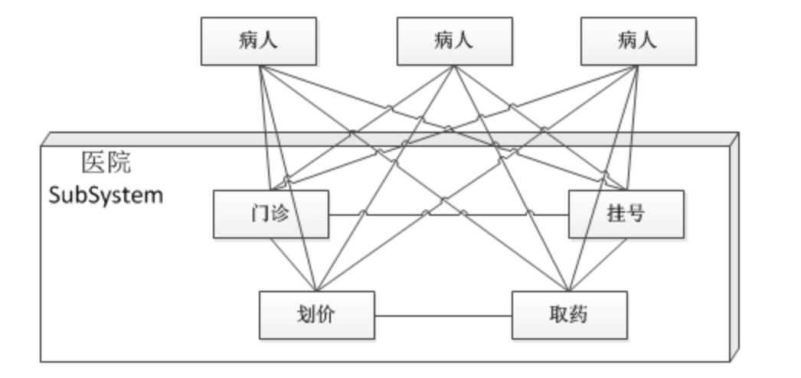
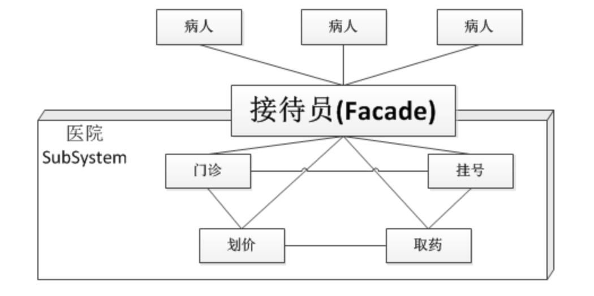
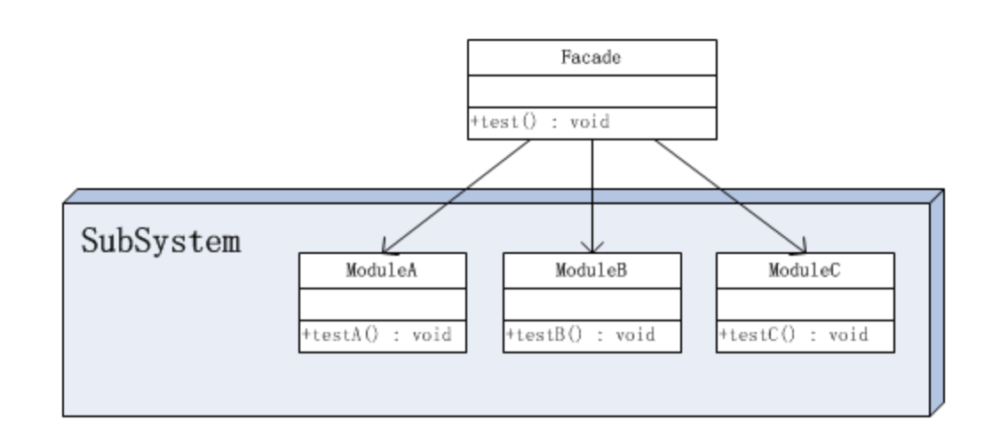

# 设计模式之--门面模式

​	门面模式(Facade)是对象的结构模式，**外部与一个子系统的通信必须通过一个统一的门面对象进行。**门面模式提供一个高层次的接口，使得子系统更易于使用。

### 医院的例子

　　现代的软件系统都是比较复杂的，设计师处理复杂系统的一个常见方法便是将其“分而治之”，把一个系统划分为几个较小的子系统。如果把医院作为一个子系统，按照部门职能，这个系统可以划分为挂号、门诊、划价、化验、收费、取药等。看病的病人要与这些部门打交道，就如同一个子系统的客户端与一个子系统的各个类打交道一样，不是一件容易的事情。

　　首先病人必须先挂号，然后门诊。如果医生要求化验，病人必须首先划价，然后缴费，才可以到化验部门做化验。化验后再回到门诊室。



　解决这种不便的方法便是引进门面模式，医院可以设置一个接待员的位置，由接待员负责代为挂号、划价、缴费、取药等。这个接待员就是门面模式的体现，病人只接触接待员，由接待员与各个部门打交道。



### 门面模式的结构

由于门面模式的结构图过于抽象，因此把它稍稍具体点。假设子系统内有三个模块，分别是ModuleA、ModuleB和ModuleC，它们分别有一个示例方法，那么此时示例的整体结构图如下：



在这个对象图中，出现了两个角色：

- **门面(Facade)角色 ：**客户端可以调用这个角色的方法。此角色知晓相关的（一个或者多个）子系统的功能和责任。在正常情况下，**本角色会将所有从客户端发来的请求委派到相应的子系统去**。

- **子系统(SubSystem)角色 ：**可以同时有一个或者多个子系统。**每个子系统都不是一个单独的类，而是一个类的集合（如上面的子系统就是由ModuleA、ModuleB、ModuleC三个类组合而成）**。每个子系统都可以被客户端直接调用，或者被门面角色调用。子系统并不知道门面的存在，对于子系统而言，门面仅仅是另外一个客户端而已。

### 源代码

子系统角色中的类：

```java
public class ModuleA {
    //示意方法
    public void testA(){
        System.out.println("调用ModuleA中的testA方法");
    }
}
```


```java
public class ModuleB {
    //示意方法
    public void testB(){
        System.out.println("调用ModuleB中的testB方法");
    }
}
```


```java
public class ModuleC {
    //示意方法
    public void testC(){
        System.out.println("调用ModuleC中的testC方法");
    }
}
```

门面角色类：

```java
public class Facade {
    //示意方法，满足客户端需要的功能
    public void test(){
        ModuleA a = new ModuleA();
        a.testA();
        ModuleB b = new ModuleB();
        b.testB();
        ModuleC c = new ModuleC();
        c.testC();
    }
}
```

客户端角色类：

```java
public class Client {

    public static void main(String[] args) {
        Facade facade = new Facade();
        facade.test();
    }
}
```

Facade类其实相当于A、B、C模块的外观界面，有了这个Facade类，那么客户端就不需要亲自调用子系统中的A、B、C模块了，也不需要知道系统内部的实现细节，甚至都不需要知道A、B、C模块的存在，客户端只需要跟Facade类交互就好了，从而更好地实现了客户端和子系统中A、B、C模块的解耦，让客户端更容易地使用系统。


### 门面模式的实现

　　使用门面模式还有一个附带的好处，就是能够有选择性地暴露方法。一个模块中定义的方法可以分成两部分，一部分是给子系统外部使用的，一部分是子系统内部模块之间相互调用时使用的。有了Facade类，那么用于子系统内部模块之间相互调用的方法就不用暴露给子系统外部了。

　　比如，定义如下A、B、C模块。

```java
public class ModuleA {
    /**
     * 提供给子系统外部使用的方法
     */
    public void a1(){};
    
    /**
     * 子系统内部模块之间相互调用时使用的方法
     */
    public void a2(){};
    public void a3(){};
}
```

```java
public class ModuleB {
    /**
     * 提供给子系统外部使用的方法
     */
    public void b1(){};
    
    /**
     * 子系统内部模块之间相互调用时使用的方法
     */
    public void b2(){};
    public void b3(){};
}
```

```java
public class ModuleC {
    /**
     * 提供给子系统外部使用的方法
     */
    public void c1(){};
    
    /**
     * 子系统内部模块之间相互调用时使用的方法
     */
    public void c2(){};
    public void c3(){};
}
```

```java
public class Facade {
    private ModuleA moduleA;
    private ModuleB moduleB;
    private ModuleC moduleC;

    public Facade() {
        moduleA = new ModuleA();
        moduleB = new ModuleB();
        moduleC = new ModuleC();
    }

    public void a1() {
        moduleA.a1();
    }

    public void b1() {
        moduleB.b1();
    }

    public void c1() {
        moduleC.c1();
    }
}
```

客户端

```java
public class Main {
    public static void main(String[] args) {
        Facade facade = new Facade();

        facade.a1();
        facade.b1();
        facade.c1();
    }
}
```

这样定义一个ModuleFacade类可以有效地屏蔽内部的细节，免得客户端去调用Module类时，**发现一些不需要它知道的方法**。比如a2()和a3()方法就不需要让客户端知道，否则既暴露了内部的细节，又让客户端迷惑。对客户端来说，他可能还要去思考a2()、a3()方法用来干什么呢？其实a2()和a3()方法是内部模块之间交互的，原本就不是对子系统外部的，所以干脆就不要让客户端知道。

在门面模式中，通常只需要一个门面类，并且此门面类只有一个实例，换言之**它是一个单例类**。当然这并不意味着在整个系统里只有一个门面类，而仅仅是说对每一个子系统只有一个门面类。或者说，如果一个系统有好几个子系统的话，每一个子系统都有一个门面类，整个系统可以有数个门面类。

### 门面模式的优点

　　门面模式的优点：

- 松散耦合

　　门面模式松散了客户端与子系统的耦合关系，让子系统内部的模块能更容易扩展和维护。

- 简单易用

　　门面模式让子系统更加易用，客户端不再需要了解子系统内部的实现，也不需要跟众多子系统内部的模块进行交互，只需要跟门面类交互就可以了。

- 更好的划分访问层次

　　通过合理使用Facade，可以帮助我们更好地划分访问的层次。有些方法是对系统外的，有些方法是系统内部使用的。把需要暴露给外部的功能集中到门面中，这样既方便客户端使用，也很好地隐藏了内部的细节。


### 门面模式的缺点：

- 不能很好地限制客户使用子系统类，如果对客户访问子系统类做太多的限制则减少了可变性和灵活性。
- 在不引入抽象外观类的情况下，增加新的子系统可能需要修改外观类或客户端的源代码，违背了“开闭原则”。


---

来源：

[《JAVA与模式》之门面模式](https://www.cnblogs.com/java-my-life/archive/2012/05/02/2478101.html)

[设计模式（七）门面模式（Facade Pattern 外观模式）](https://blog.csdn.net/xingjiarong/article/details/50066133)


---

代码：

- [设计模式](../../icoding/desinepatterns/src/main/java/com/wangfulin/dp)

