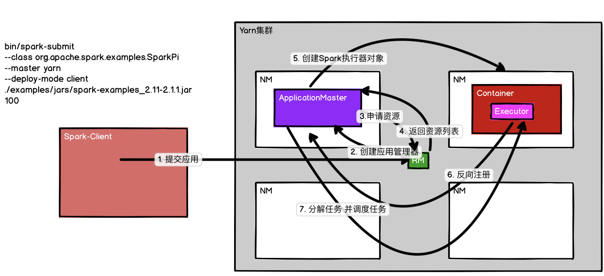
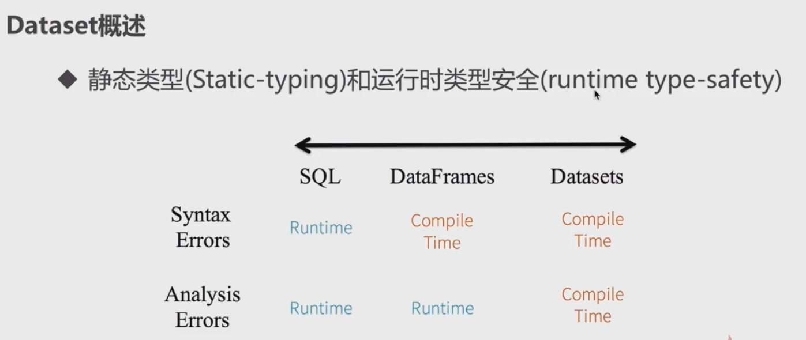
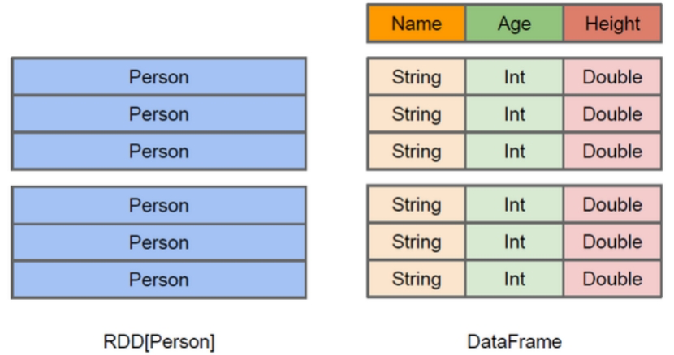
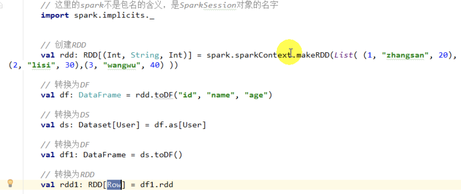
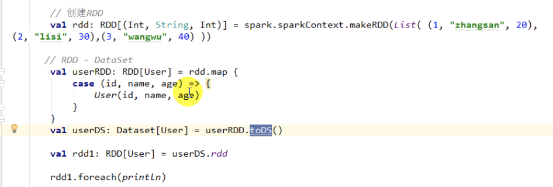
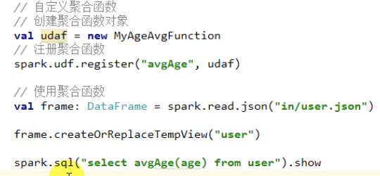
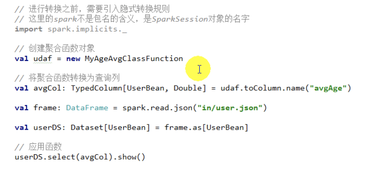
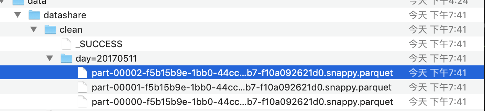
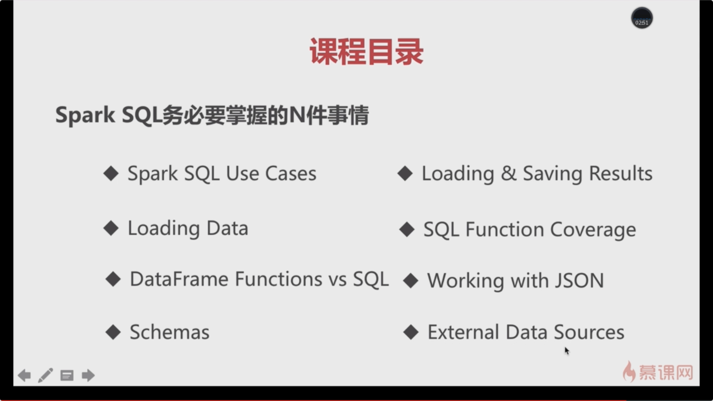

# Spark-SQL

[toc]

### Hadoop环境搭建

1) 下载Hadoop
	http://archive.cloudera.com/cdh5/cdh/5/
	2.6.0-cdh5.7.0

	wget http://archive.cloudera.com/cdh5/cdh/5/hadoop-2.6.0-cdh5.7.0.tar.gz

2）安装jdk
	下载
	解压到app目录：tar -zxvf jdk-7u51-linux-x64.tar.gz -C ~/app/
	验证安装是否成功：~/app/jdk1.7.0_51/bin      ./java -version
	建议把bin目录配置到系统环境变量(~/.bash_profile)中

```shell
		export JAVA_HOME=/home/hadoop/app/jdk1.7.0_51
		export PATH=$JAVA_HOME/bin:$PATH
```

3）机器参数设置
	hostname: hadoop001

```shell
#修改机器名: /etc/sysconfig/network
	NETWORKING=yes
	HOSTNAME=hadoop001

#设置ip和hostname的映射关系: /etc/hosts
	192.168.199.200 hadoop001
	127.0.0.1 localhost

#ssh免密码登陆(本步骤可以省略，但是后面你重启hadoop进程时是需要手工输入密码才行)
	ssh-keygen -t rsa
	cp ~/.ssh/id_rsa.pub ~/.ssh/authorized_keys
```

4）Hadoop配置文件修改: ~/app/hadoop-2.6.0-cdh5.7.0/etc/hadoop
	hadoop-env.sh

```shell
export  JAVA_HOME=/home/hadoop/app/jdk1.7.0_51
```

修改core-site.xml

```xml
<property>
    	<name>fs.defaultFS</name>
    	<value>hdfs://hadoop001:8020</value>
	</property>	

	<property>
    	<name>hadoop.tmp.dir</name>
    	<value>/home/hadoop/app/tmp</value>
	</property>	
```

hdfs-site.xml

```xml
<property>
       <name>dfs.replication</name>
       <value>1</value>
 </property>
```

5）格式化HDFS
	注意：这一步操作，只是在第一次时执行，每次如果都格式化的话，那么HDFS上的数据就会被清空

```shell
	bin/hdfs namenode -format
```

6）启动HDFS

```shell
	sbin/start-dfs.sh
```


```shell
#验证是否启动成功:
	jps
		DataNode
		SecondaryNameNode
		NameNode

#浏览器
		http://hadoop001:50070/
```

7）停止HDFS

```shell
	sbin/stop-dfs.sh
```


### YARN架构

1 RM(ResourceManager) + N个NM(NodeManager)

ResourceManager的职责： 一个集群active状态的RM只有一个，负责整个集群的资源管理和调度
1）处理客户端的请求(启动/杀死)
2）启动/监控ApplicationMaster(一个作业对应一个AM)
3）监控NM
4）系统的资源分配和调度


NodeManager：整个集群中有N个，负责单个节点的资源管理和使用以及task的运行情况
1）定期向RM汇报本节点的资源使用请求和各个Container的运行状态
2）接收并处理RM的container启停的各种命令
3）单个节点的资源管理和任务管理

ApplicationMaster：每个应用/作业对应一个，负责应用程序的管理
1）数据切分
2）为应用程序向RM申请资源(container)，并分配给内部任务
3）与NM通信以启/停task， task是运行在container中的
4）task的监控和容错

Container：
对任务运行情况的描述：cpu、memory、环境变量



#### YARN执行流程

1）用户向YARN提交作业
2）RM为该作业分配第一个container(ApplicationMaster)
3）RM会与对应的NM通信，要求NM在这个container上启动应用程序的AM
4)   AM首先向RM注册，然后AM将为各个任务申请资源，并监控运行情况
5）AM采用轮训的方式通过RPC协议向RM申请和领取资源
6）AM申请到资源以后，便和**相应**的NM通信，要求NM启动任务
7）NM启动我们作业对应的task


#### YARN环境搭建

mapred-site.xml

```xml
	<property>
        <name>mapreduce.framework.name</name>
        <value>yarn</value>
   </property>


```

yarn-site.xml

```xml
	<property>
        <name>yarn.nodemanager.aux-services</name>
        <value>mapreduce_shuffle</value>
    </property>
```

启动yarn：sbin/start-yarn.sh

验证是否启动成功
	jps
		ResourceManager
		NodeManager

	web: http://localhost:8088

停止yarn： sbin/stop-yarn.sh

提交mr作业到yarn上运行： wc(wordcount例子)

/home/hadoop/app/hadoop-2.6.0-cdh5.7.0/share/hadoop/mapreduce/hadoop-mapreduce-examples-2.6.0-cdh5.7.0.jar

```
hadoop jar /home/hadoop/app/hadoop-2.6.0-cdh5.7.0/share/hadoop/mapreduce/hadoop-mapreduce-examples-2.6.0-cdh5.7.0.jar wordcount /input/wc/hello.txt /output/wc/
```

当我们再次执行该作业时，会报错：
FileAlreadyExistsException: 
Output directory hdfs://hadoop001:8020/output/wc already exists


Hive底层的执行引擎有：MapReduce、Tez、Spark
	Hive on MapReduce
	Hive on Tez
	Hive on Spark

压缩：GZIP、LZO、Snappy、BZIP2..
存储：TextFile、SequenceFile、RCFile、ORC、Parquet
UDF：自定义函数


### Hive环境搭建

1）Hive下载：http://archive.cloudera.com/cdh5/cdh/5/
	wget http://archive.cloudera.com/cdh5/cdh/5/hive-1.1.0-cdh5.7.0.tar.gz

2）解压
	tar -zxvf hive-1.1.0-cdh5.7.0.tar.gz -C ~/app/

3）配置
	系统环境变量(~/.bahs_profile)

```shell
export HIVE_HOME=/home/hadoop/app/hive-1.1.0-cdh5.7.0
export PATH=$HIVE_HOME/bin:$PATH
```

实现安装一个mysql， yum install xxx

hive-site.xml ： sparksql数据库名称

```xml
<property>
  		<name>javax.jdo.option.ConnectionURL</name>
    	<value>jdbc:mysql://localhost:3306/sparksql?createDatabaseIfNotExist=true</value>
    </property>
    
 <property>
	<name>javax.jdo.option.ConnectionDriverName</name>
    <value>com.mysql.jdbc.Driver</value>
  </property>
  
  <property>
		<name>javax.jdo.option.ConnectionUserName</name>
    	<value>root</value>
    </property>
    
   <property>
    <name>javax.jdo.option.ConnectionPassword</name>
    	<value>root</value>
    </property>
```
参考：[https://github.com/apache/hive/blob/master/data/conf/hive-site.xml](https://github.com/apache/hive/blob/master/data/conf/hive-site.xml)
    

4）拷贝mysql驱动到$HIVE_HOME/lib/

5）启动hive: $HIVE_HOME/bin/hive

创建表

```hive
CREATE  TABLE table_name 
  [(col_name data_type [COMMENT col_comment])]
create table hive_wordcount(context string);
```

加载数据到hive表

```
LOAD DATA LOCAL INPATH 'filepath' INTO TABLE tablename 

load data local inpath '/home/hadoop/data/hello.txt' into table hive_wordcount;

select word, count(1) from hive_wordcount lateral view explode(split(context,'\t')) wc as word group by word;
```

lateral view explode(): 是把每行记录按照指定分隔符进行拆解

hive ql提交执行以后会生成mr作业，并在yarn上运行

```hive
create table emp(
empno int,
ename string,
job string,
mgr int,
hiredate string,
sal double,
comm double,
deptno int
) ROW FORMAT DELIMITED FIELDS TERMINATED BY '\t';

create table dept(
deptno int,
dname string,
location string
) ROW FORMAT DELIMITED FIELDS TERMINATED BY '\t';

load data local inpath '/home/hadoop/data/dept.txt' into table dept;

求每个部门的人数
select deptno, count(1) from emp group by deptno;
```

### MapReduce 和 Spark

MapReduce的局限性：
1）代码繁琐；
2）只能够支持map和reduce方法；
3）执行效率低下；
4）不适合迭代多次、交互式、流式的处理；

框架多样化：
1）批处理（离线）：MapReduce、Hive、Pig
2）流式处理（实时）： Storm、JStorm
3）交互式计算：Impala

学习、运维成本无形中都提高了很多

===> Spark 


### 提交Spark Application到环境中运行

```shell
spark-submit \
--name SQLContextApp \
--class com.imooc.spark.SQLContextApp \
--master local[2] \
/home/hadoop/lib/sql-1.0.jar \
/home/hadoop/app/spark-2.1.0-bin-2.6.0-cdh5.7.0/examples/src/main/resources/people.json
```

注意：
1）To use a HiveContext, you do not need to have an existing Hive setup
2）hive-site.xml


### Spark SQL执行过程

```sql
create table t(key string, value string);
explain extended select a.key*(2+3), b.value from  t a join t b on a.key = b.key and a.key > 3;

== Parsed Logical Plan ==
'Project [unresolvedalias(('a.key * (2 + 3)), None), 'b.value]
+- 'Join Inner, (('a.key = 'b.key) && ('a.key > 3))
   :- 'UnresolvedRelation `t`, a
   +- 'UnresolvedRelation `t`, b

== Analyzed Logical Plan ==
(CAST(key AS DOUBLE) * CAST((2 + 3) AS DOUBLE)): double, value: string
Project [(cast(key#321 as double) * cast((2 + 3) as double)) AS (CAST(key AS DOUBLE) * CAST((2 + 3) AS DOUBLE))#325, value#324]
+- Join Inner, ((key#321 = key#323) && (cast(key#321 as double) > cast(3 as double)))
   :- SubqueryAlias a
   :  +- MetastoreRelation default, t
   +- SubqueryAlias b
      +- MetastoreRelation default, t

== Optimized Logical Plan ==
Project [(cast(key#321 as double) * 5.0) AS (CAST(key AS DOUBLE) * CAST((2 + 3) AS DOUBLE))#325, value#324]
+- Join Inner, (key#321 = key#323)
   :- Project [key#321]
   :  +- Filter (isnotnull(key#321) && (cast(key#321 as double) > 3.0))
   :     +- MetastoreRelation default, t
   +- Filter (isnotnull(key#323) && (cast(key#323 as double) > 3.0))
      +- MetastoreRelation default, t

== Physical Plan ==
*Project [(cast(key#321 as double) * 5.0) AS (CAST(key AS DOUBLE) * CAST((2 + 3) AS DOUBLE))#325, value#324]
+- *SortMergeJoin [key#321], [key#323], Inner
   :- *Sort [key#321 ASC NULLS FIRST], false, 0
   :  +- Exchange hashpartitioning(key#321, 200)
   :     +- *Filter (isnotnull(key#321) && (cast(key#321 as double) > 3.0))
   :        +- HiveTableScan [key#321], MetastoreRelation default, t
   +- *Sort [key#323 ASC NULLS FIRST], false, 0
      +- Exchange hashpartitioning(key#323, 200)
         +- *Filter (isnotnull(key#323) && (cast(key#323 as double) > 3.0))
            +- HiveTableScan [key#323, value#324], MetastoreRelation default, t
```


### thriftserver/beeline的使用

1)   启动thriftserver: 默认端口是10000 ，可以修改
2）启动beeline
beeline -u jdbc:hive2://localhost:10000 -n hadoop

修改thriftserver启动占用的默认端口号：

```shell
./start-thriftserver.sh  \
--master local[2] \
--jars ~/software/mysql-connector-java-5.1.27-bin.jar  \
--hiveconf hive.server2.thrift.port=14000 

beeline -u jdbc:hive2://localhost:14000 -n hadoop
```

### thriftserver和普通的spark-shell/spark-sql有什么区别

1）spark-shell、spark-sql都是一个spark  application；
2）thriftserver， 不管你启动多少个客户端(beeline/code)，永远都是一个spark application**解决了一个数据共享的问题，多个客户端可以共享数据；**

注意事项：在使用jdbc开发时，一定要先启动thriftserver

```shell
Exception in thread "main" java.sql.SQLException: 
Could not open client transport with JDBC Uri: jdbc:hive2://hadoop001:14000: 
java.net.ConnectException: Connection refused
```

### SQLContext&&HiveContext

​		SparkSQL提供两种SQL查询起始点：一个叫SQLContext，用于Spark自己提供的SQL查询；一个叫HiveContext，用于连接Hive的查询。

​		SparkSession是Spark最新的SQL查询起始点，实质上是SQLContext和HiveContext的组合，所以在SQLContext和HiveContext上可用的API在SparkSession上同样是可以使用的。SparkSession内部封装了sparkContext，所以计算实际上是由sparkContext完成的。

#### SQLContext

```scala
object SQLContextApp {
  def main(args: Array[String]): Unit = {
    val path = "/Users/wangfulin/bigdata/data/people.json"

    //1)创建相应的Context
    val sparkConf = new SparkConf()

    //在测试或者生产中，AppName和Master我们是通过脚本进行指定
    sparkConf.setAppName("SQLContextApp").setMaster("local[2]")

    val sc = new SparkContext(sparkConf)
    val sqlContext = new SQLContext(sc)

    //2)相关的处理: json
    val people = sqlContext.read.format("json").load(path)
    people.printSchema()
    people.show()
    //3)关闭资源
    sc.stop()

  }

}
```

#### HiveContext

```scala
object HiveContextApp {
  def main(args: Array[String]): Unit = {

    val sparkConf = new SparkConf()
    //在测试或者生产中，AppName和Master我们是通过脚本进行指定
    //sparkConf.setAppName("HiveContextApp").setMaster("local[2]")

    val sc = new SparkContext(sparkConf)
    val hiveContext = new HiveContext(sc)

    //2)相关的处理:
    hiveContext.table("emp").show

    //3)关闭资源
    sc.stop()
  }

}

```

**注意**：临时表是Session范围内的，Session退出后，表就失效了。如果想应用范围内有效，可以使用全局表。注意使用全局表时需要全路径访问，如：global_temp.people

```scala
df.createGlobalTempView("people")
// 从全局取数据global_temp
spark.sql("SELECT * FROM global_temp.people").show()
```

#### DSL风格语法

```scala
df.printSchema // 查看结构
df.select("name").show()//show
// 引用要加$符号
df.select($"name", $"age" + 1).show()//age+1
df.filter($"age" > 21).show() //”age”大于”21”的数据
df.groupBy("age").count().show() // 按照”age”分组，查看数据条数
```


### DataFram&&DataSet

​		Spark SQL是Spark用来处理结构化数据的一个模块，它提供了2个编程抽象：**DataFrame和DataSet**，并且作为分布式SQL查询引擎的作用。底层还是RDD。

​		DataFrame它不是Spark SQL提出的，而是早起在R、Pandas语言就已经有了的。


​		A Dataset is a distributed collection of data：分布式的数据集

​		A DataFrame is a Dataset organized into named columns. 
以列（列名、列的类型、列值）的形式构成的分布式数据集，按照列赋予不同的名称

```
student
id:int
name:string
city:string
```


It is conceptually equivalent to a table in a relational database 
or a data frame in R/Python

- RDD： 
  	java/scala  ==> jvm
    	python ==> python runtime

- DataFrame:
  	java/scala/python ==> Logic Plan

**DataFrame和RDD互操作的两种方式：**
1）反射：case class   前提：事先需要知道你的字段、字段类型（优先考虑）    
2）编程：Row 如果第一种情况不能满足你的要求（事先不知道列）
Dataset可以认为是DataFrame的一个特例，主要区别是Dataset每一个record存储的是一个强类型值而不是一个Row。因此具有如下三个特点：

- DataSet可以在编译时检查类型
- 并且是面向对象的编程接口。
- 后面版本DataFrame会继承DataSet，DataFrame是面向Spark SQL的接口。

```scala
val rdd = spark.sparkContext.textFile("file:///home/hadoop/data/student.data")
```

DataFrame = Dataset[Row]
Dataset：强类型  typed  case class
DataFrame：弱类型   Row

SQL: 
	seletc name from person;  compile  ok, result no

DF:
	df.select("name")  compile no
	df.select("nname")  compile ok  

DS:
	ds.map(line => line.itemid)  compile no



#### DataFrame

​		DataFrame也是一个分布式数据容器。然而DataFrame更像传统数据库的二维表格，除了数据以外，还**记录数据的结构信息**，即schema。同时，与Hive类似，DataFrame也支持嵌套数据类型（struct、array和map）。从API易用性的角度上看，DataFrame API提供的是一套高层的关系操作，比函数式的RDD API要更加友好，门槛更低。



​		上图直观地体现了DataFrame和RDD的区别。左侧的RDD[Person]虽然以Person为类型参数，但**Spark框架本身不了解Person类的内部结构**。而右侧的DataFrame却提供了详细的**结构信息**，使得Spark SQL可以清楚地知道该数据集中包含哪些列，每列的名称和类型各是什么。**DataFrame是为数据提供了Schema的视图。**可以把它当做数据库中的一张表来对待，DataFrame也是懒执行的。性能上比RDD要高，主要原因：

优化的执行计划：查询计划通过`Spark catalyst optimiser`进行优化。


​		图中构造了两个DataFrame，将它们join之后又做了一次filter操作。如果原封不动地执行这个执行计划，最终的执行效率是不高的。因为join是一个代价较大的操作，也可能会产生一个较大的数据集。如果我们能将filter下推到 join下方，先对DataFrame进行过滤，再join过滤后的较小的结果集，便可以有效缩短执行时间。而Spark SQL的查询优化器正是这样做的。简而言之，逻辑查询计划优化就是一个利用基于关系代数的等价变换，将高成本的操作替换为低成本操作的过程。

参考：[RDD、DataFrame和DataSet的区别](https://www.jianshu.com/p/c0181667daa0)

```scala
// DataFrame API基本操作
object DataFrameApp {
  def main(args: Array[String]): Unit = {
    val spark = SparkSession.builder().appName("DataFrameApp").master("local[2]").getOrCreate()

    // 将json文件加载成一个dataframe
    val peopleDF = spark.read.format("json").load("file:///Users/wangfulin/bigdata/data/people.json")

    // 输出dataframe对应的schema信息
    peopleDF.printSchema()

    // 输出数据集的前20条记录
    peopleDF.show()

    //查询某列所有的数据： select name from table
    peopleDF.select("name").show()

    // 查询某几列所有的数据，并对列进行计算： select name, age+10 as age2 from table
    peopleDF.select(peopleDF.col("name"), (peopleDF.col("age") + 10).as("age2")).show()

    //根据某一列的值进行过滤： select * from table where age>19
    peopleDF.filter(peopleDF.col("age") > 19).show()

    //根据某一列进行分组，然后再进行聚合操作： select age,count(1) from table group by age
    peopleDF.groupBy("age").count().show()

    spark.stop()
  }
}
```

#### DataFrameCase

```scala
object DataFrameCase {
  def main(args: Array[String]): Unit = {
    val spark = SparkSession.builder().appName("DataFrameRDDApp").master("local[2]").getOrCreate()

    // RDD ==> DataFrame
    val rdd = spark.sparkContext.textFile("file:///Users/wangfulin/bigdata/data/student.data")

    //注意：需要导入隐式转换
    import spark.implicits._
    val studentDF = rdd.map(_.split("\\|")).map(line => Student(line(0).toInt, line(1), line(2), line(3))).toDF()

    //show默认只显示前20条 默认超过一定长度截掉
    studentDF.show
    studentDF.show(30)
    studentDF.show(30, false)

    studentDF.take(10)
    studentDF.first()
    studentDF.head(3)

    studentDF.select("email").show(30, false)


    // 过滤
    studentDF.filter("name=''").show
    studentDF.filter("name='' OR name='NULL'").show
    //name以M开头的人
    studentDF.filter("SUBSTR(name,0,1)='w'").show

    // 排序
    studentDF.sort(studentDF("name")).show
    studentDF.sort(studentDF("name").desc).show

    studentDF.sort("name","id").show
    studentDF.sort(studentDF("name").asc, studentDF("id").desc).show

    // 重命名
    studentDF.select(studentDF("name").as("student_name")).show


    val studentDF2 = rdd.map(_.split("\\|")).map(line => Student(line(0).toInt, line(1), line(2), line(3))).toDF()

    // join 默认 inner join
    studentDF.join(studentDF2, studentDF.col("id") === studentDF2.col("id")).show

    spark.stop()
  }

  case class Student(id: Int, name: String, phone: String, email: String)
}
```

#### DataFrame和RDD的互操作

注意：如果需要RDD与DF或者DS之间操作，那么都需要引入 import spark.implicits._  【spark不是包名，而是sparkSession对象的名称】

有两种方式

toDF

```scala
    val infoRDD = rdd.map(_.split(",")).map(line => Row(line(0).toInt, line(1), line(2).toInt))

    val structType = StructType(Array(StructField("id", IntegerType, true),
      StructField("name", StringType, true),
      StructField("age", IntegerType, true)))

    val infoDF = spark.createDataFrame(infoRDD, structType)
    infoDF.printSchema()
```

或者使用`toDF(字段名称)`

```scala
// 手动创建
peopleRDD.map{x=>val para = x.split(",");(para(0),para(1).trim.toInt)}.toDF("name","age")

// 反射创建 创建样例类
case class People(name:String, age:Int)
peopleRDD.map{ x => val para = x.split(",");People(para(0),para(1).trim.toInt)}.toDF
// 通过编程的方式（了解）

```


```scala
object DataFrameRDDApp {
  def main(args: Array[String]): Unit = {
    val spark = SparkSession.builder().appName("DataFrameRDDApp").master("local[2]").getOrCreate()

    //inferReflection(spark)

    program(spark)

    spark.stop()
  }

  // 第二种方式 编程的方式
  def program(spark: SparkSession): Unit = {
    // RDD ==> DataFrame
    val rdd = spark.sparkContext.textFile("file:///Users/wangfulin/bigdata/data/info.txt")

    val infoRDD = rdd.map(_.split(",")).map(line => Row(line(0).toInt, line(1), line(2).toInt))

    val structType = StructType(Array(StructField("id", IntegerType, true),
      StructField("name", StringType, true),
      StructField("age", IntegerType, true)))
		
    //转换
    val infoDF = spark.createDataFrame(infoRDD, structType)
    infoDF.printSchema()
    infoDF.show()


    //通过df的api进行操作
    infoDF.filter(infoDF.col("age") > 1).show

    //通过sql的方式进行操作
    infoDF.createOrReplaceTempView("infos")
    spark.sql("select * from infos where age > 1").show()
  }


  // 第一种方式，采用反射的方式
  def inferReflection(spark: SparkSession) {
    // RDD ==> DataFrame
    val rdd = spark.sparkContext.textFile("file:///Users/wangfulin/bigdata/data/info.txt")

    //注意：需要导入隐式转换
    import spark.implicits._
    val infoDF = rdd.map(_.split(",")).map(line => Info(line(0).toInt, line(1), line(2).toInt)).toDF()

    infoDF.show()

    infoDF.filter(infoDF.col("age") > 1).show

    infoDF.createOrReplaceTempView("infos")
    spark.sql("select * from infos where age > 1").show()
  }

  case class Info(id: Int, name: String, age: Int)

}
```

##### DateFrame转换为RDD

只能一行一行做

```scala
val df = spark.read.json("/opt/module/spark/examples/src/main/resources/people.json")
val dfToRDD = df.rdd
dfToRDD.collect
```


#### Dataset

1）是Dataframe API的一个扩展，是Spark最新的数据抽象。

2）用户友好的API风格，既具有类型安全检查也具有Dataframe的查询优化特性。

3）Dataset支持编解码器，当需要访问非堆上的数据时可以避免反序列化整个对象，提高了效率。

4）样例类被用来在Dataset中定义数据的结构信息，样例类中每个属性的名称直接映射到DataSet中的字段名称。

5） Dataframe是Dataset的特列，DataFrame=Dataset[Row] ，所以可以通过as方法将Dataframe转换为Dataset。Row是一个类型，跟Car、Person这些的类型一样，所有的表结构信息我都用Row来表示。

6）DataSet是强类型的。比如可以有Dataset[Car]，Dataset[Person].

7）DataFrame只是知道字段，但是不知道字段的类型，所以在执行这些操作的时候是没办法在编译的时候检查是否类型失败的，比如你可以对一个String进行减法操作，在执行的时候才报错，而DataSet不仅仅知道字段，而且知道字段类型，所以有更严格的错误检查。就跟JSON对象和类对象之间的类比。


Rdd添加结构就变成了DataFrame，DataFrame添加类和属性，就变成了DataSet

```scala
// 创建样例类
case class Person(name: String, age: Long)
// 创建DataSet
val caseClassDS = Seq(Person("Andy", 32)).toDS()
```


```scala
object DatasetApp {
  def main(args: Array[String]): Unit = {
    val spark = SparkSession.builder().appName("DatasetApp")
      .master("local[2]").getOrCreate()

    //注意：需要导入隐式转换
    import spark.implicits._

    // csv路径
    val path = "file:///Users/wangfulin/bigdata/data/sales.csv"

    //spark如何解析csv文件？ 返回的是dataframe类型
    val df = spark.read.option("header", "true").option("inferSchema", "true").csv(path)
    df.show

    // df 转成 ds ： as一个类型，就完成转换了
    val ds = df.as[Sales]
    ds.map(line => line.itemId).show
  }

  case class Sales(transactionId: Int, customerId: Int, itemId: Int, amountPaid: Double)

}
```

##### RDD转为DataSet

RDD增加结构 -- 》 DataFrame 增加类型 --  》DataSet

```scala
// 创建样例类
case class Person(name: String, age: Long)
peopleRDD.map(line => {val para = line.split(",");Person(para(0),para(1).trim.toInt)}).toDS()
```

##### DataSet转换为RDD

```scala
DS.rdd
```

#### DataFrame与DataSet的互操作

```scala
// 创建样例类
case class Person(name: String, age: Long)
// df转为ds
df.as[Person]

ds.toDf
```

三者的关系


### 引入外部数据源

#### 通用加载/保存方法

​		Spark SQL的默认数据源为Parquet格式。数据源为Parquet文件时，Spark SQL可以方便的执行所有的操作。

```scala
val df = spark.read.load("examples/src/main/resources/users.parquet") df.select("name", "favorite_color").write.save("namesAndFavColors.parquet")
```

​		当数据源格式不是parquet格式文件时，需要手动指定数据源的格式。数据源格式需要指定全名（例如：org.apache.spark.sql.parquet），如果数据源格式为内置格式，则只需要指定简称定json, parquet, jdbc, orc, libsvm, csv, text来指定数据的格式。

​		可以通过SparkSession提供的read.load方法用于通用加载数据，使用write和save保存数据。加一个format

```scala
val peopleDF = spark.read.format("json").load("examples/src/main/resources/people.json")
peopleDF.write.format("parquet").save("hdfs://hadoop102:9000/namesAndAges.parquet")
```

​		可以采用SaveMode执行存储操作，SaveMode定义了对数据的处理模式。需要注意的是，这些保存模式不使用任何锁定，不是原子操作。此外，当使用Overwrite方式执行时，在输出新数据之前原数据就已经被删除。SaveMode详细介绍如下表：

|           Scala/Java            |   Any Language   |       Meaning        |
| :-----------------------------: | :--------------: | :------------------: |
| SaveMode.ErrorIfExists(default) | "error"(default) | 如果文件存在，则报错 |
|         SaveMode.Append         |     "append"     |         追加         |
|       SaveMode.Overwrite        |   "overwrite"    |         覆写         |
|         SaveMode.Ignore         |     "ignore"     |   数据存在，则忽略   |


#### 处理parquet数据

​		parquet是一种流行的列式存储格式，可以高效地存储具有嵌套字段的记录。Parquet格式经常在Hadoop生态圈中被使用，它也支持Spark SQL的全部数据类型。Spark SQL 提供了直接读取和存储 Parquet 格式文件的方法

```java
object ParquetApp {
  def main(args: Array[String]): Unit = {
    val spark = SparkSession.builder().appName("SparkSessionApp")
      .master("local[2]").getOrCreate()


    /**
     * spark.read.format("parquet").load 这是标准写法
     */
    val userDF = spark.read.format("parquet").load("file:///Users/wangfulin/bigdata/data/users.parquet")

    userDF.printSchema()
    userDF.show()

    userDF.select("name", "favorite_color").show

    userDF.select("name", "favorite_color").write.format("json").save("file:///Users/wangfulin/bigdata/data/tmp/jsonout")

    spark.read.load("file:///Users/wangfulin/bigdata/data/users.parquet").show

    //会报错，因为sparksql默认处理的format就是parquet
    spark.read.load("file:///Users/wangfulin/bigdata/data/people.json").show

    spark.read.format("parquet").option("path", "file:///Users/wangfulin/bigdata/data/users.parquet").load().show
    spark.stop()
  }
}
```

```shell
org.apache.spark.sql.AnalysisException: Attribute name "count(1)" contains invalid character(s) among " ,;{}()\n\t=". Please use alias to rename it.;

spark.sqlContext.setConf("spark.sql.shuffle.partitions","10")
```

在生产环境中一定要注意设置spark.sql.shuffle.partitions，默认是200

#### JSON文件

​		Spark SQL 能够自动推测 JSON数据集的结构，并将它加载为一个Dataset[Row]. 可以通过SparkSession.read.json()去加载一个 一个JSON 文件。

​		注意：这个JSON文件不是一个传统的JSON文件，每一行都得是一个JSON串。

#### 操作MySQL的数据

​		Spark SQL可以通过JDBC从关系型数据库中读取数据的方式创建DataFrame，通过对DataFrame一系列的计算后，还可以将数据再写回关系型数据库中。

**注意:需要将相关的数据库驱动放到spark的类路径下。**

方法一：

```scala
spark.read.format("jdbc").option("url", "jdbc:mysql://localhost:3306/hive").option("dbtable", "hive.TBLS").option("user", "root").option("password", "root").option("driver", "com.mysql.jdbc.Driver").load()
```

需要添加driver：

java.sql.SQLException: No suitable driver 

方法二：

```scala
import java.util.Properties
val connectionProperties = new Properties()
connectionProperties.put("user", "root")
connectionProperties.put("password", "root")
connectionProperties.put("driver", "com.mysql.jdbc.Driver")

val jdbcDF2 = spark.read.jdbc("jdbc:mysql://localhost:3306", "hive.TBLS", connectionProperties)
```

方法三：

```java
CREATE TEMPORARY VIEW jdbcTable
USING org.apache.spark.sql.jdbc
OPTIONS (
  url "jdbc:mysql://localhost:3306",
  dbtable "hive.TBLS",
  user 'root',
  password 'root',
  driver 'com.mysql.jdbc.Driver'
)
```

将数据写入Mysql方式一

```scala
jdbcDF.write
.format("jdbc")
.option("url", "jdbc:mysql://hadoop102:3306/rdd")
.option("dbtable", "dftable")
.option("user", "root")
.option("password", "000000")
.save()
```

将数据写入Mysql方式二

```scala
jdbcDF2.write
.jdbc("jdbc:mysql://hadoop102:3306/rdd", "db", connectionProperties)
```

外部数据源综合案例 -- hive + mysql

```mysql
create database spark;
use spark;

CREATE TABLE DEPT(
DEPTNO int(2) PRIMARY KEY,
DNAME VARCHAR(14) ,
LOC VARCHAR(13) ) ;

INSERT INTO DEPT VALUES(10,'ACCOUNTING','NEW YORK');
INSERT INTO DEPT VALUES(20,'RESEARCH','DALLAS');
INSERT INTO DEPT VALUES(30,'SALES','CHICAGO');
INSERT INTO DEPT VALUES(40,'OPERATIONS','BOSTON');
```

```scala
/**
 * 使用外部数据源综合查询Hive和MySQL的表数据
 */
object HiveMySQLApp {

  def main(args: Array[String]) {
    val spark = SparkSession.builder().appName("HiveMySQLApp")
      .master("local[2]").getOrCreate()

    // 加载Hive表数据
    val hiveDF = spark.table("emp")

    // 加载MySQL表数据
    val mysqlDF = spark.read.format("jdbc").option("url", "jdbc:mysql://localhost:3306").option("dbtable", "spark.DEPT").option("user", "root").option("password", "root").option("driver", "com.mysql.jdbc.Driver").load()

    // JOIN
    val resultDF = hiveDF.join(mysqlDF, hiveDF.col("deptno") === mysqlDF.col("DEPTNO"))
    resultDF.show
    
    resultDF.select(hiveDF.col("empno"), hiveDF.col("ename"),
      mysqlDF.col("deptno"), mysqlDF.col("dname")).show

    spark.stop()
  }
}
```

RDD=》DataFrame=》DataSet




RDD=》DataSet




### 用户自定义函数

#### 用户自定义UDF函数

```scala
val df = spark.read.json("examples/src/main/resources/people.json")
// udf user define function, 将函数注册到spark中
// 函数名为addName
// 输入的是一个字符串，返回的也是一个字符串，只是返回的是加了一个前缀
spark.udf.register("addName", (x:String)=> "Name:"+x)
// 将每一个查询的名称传到 函数名为addName
df.createOrReplaceTempView("people")
spark.sql("Select addName(name), age from people").show()


+-----------------+----+
|UDF:addName(name)| age|
+-----------------+----+
|     Name:Michael|null|
|        Name:Andy|  30|
|      Name:Justin|  19|
+-----------------+----+
```

#### 用户自定义聚合函数

​		强类型的Dataset和弱类型的DataFrame都提供了相关的聚合函数， 如 count()，countDistinct()，avg()，max()，min()。除此之外，用户可以设定自己的自定义聚合函数。

​		弱类型用户自定义聚合函数：通过继承UserDefinedAggregateFunction来实现用户自定义聚合函数。下面展示一个求平均工资的自定义聚合函数。	

弱类型：

```scala
object MyAverage extends UserDefinedAggregateFunction {
// 聚合函数输入参数的数据类型 
def inputSchema: StructType = StructType(StructField("inputColumn", LongType) :: Nil)
// 聚合缓冲区中值得数据类型 计算时的数据结构
def bufferSchema: StructType = {
StructType(StructField("sum", LongType) :: StructField("count", LongType) :: Nil)
}
// 返回值的数据类型 
def dataType: DataType = DoubleType
// 对于相同的输入是否一直返回相同的输出。
def deterministic: Boolean = true
// 初始化
def initialize(buffer: MutableAggregationBuffer): Unit = {
// 存工资的总额
buffer(0) = 0L
// 存工资的个数
buffer(1) = 0L
}
// 相同Execute间的数据合并。 根据查询结果更新缓冲区数据
def update(buffer: MutableAggregationBuffer, input: Row): Unit = {
if (!input.isNullAt(0)) {
  // sum
buffer(0) = buffer.getLong(0) + input.getLong(0)
  // count
buffer(1) = buffer.getLong(1) + 1
}
}
// 不同Execute间的数据合并  多个结点的缓冲区合并
def merge(buffer1: MutableAggregationBuffer, buffer2: Row): Unit = {
buffer1(0) = buffer1.getLong(0) + buffer2.getLong(0)
buffer1(1) = buffer1.getLong(1) + buffer2.getLong(1)
}
// 计算最终结果
def evaluate(buffer: Row): Double = buffer.getLong(0).toDouble / buffer.getLong(1)
}

```

调用：



强类型：

​		强类型用户自定义聚合函数：通过继承Aggregator来实现强类型自定义聚合函数，同样是求平均工资

```scala
// 既然是强类型，可能有case类
case class Employee(name: String, salary: Long)
// 缓冲区对象
case class Average(var sum: Long, var count: Long)

object MyAverage extends Aggregator[Employee, Average, Double] {
// 定义一个数据结构，保存工资总数和工资总个数，初始都为0
def zero: Average = Average(0L, 0L)
	// Combine two values to produce a new value. For performance, the function may modify `buffer`
	// and return it instead of constructing a new object
  // 聚合数据
def reduce(buffer: Average, employee: Employee): Average = {
    buffer.sum += employee.salary
    buffer.count += 1
    buffer // 返回缓冲区
}
// 聚合不同execute的结果
def merge(b1: Average, b2: Average): Average = {
    b1.sum += b2.sum
    b1.count += b2.count
    b1
}
// 计算输出
def finish(reduction: Average): Double = reduction.sum.toDouble / reduction.count
// 设定之间值类型的编码器，要转换成case类
// Encoders.product是进行scala元组和case类转换的编码器 
def bufferEncoder: Encoder[Average] = Encoders.product
// 设定最终输出值的编码器
def outputEncoder: Encoder[Double] = Encoders.scalaDouble
}

```

没办法用sql操作

将聚合函数转换为查询列

调用：



### 日志分析实战 

数据源：[https://pan.baidu.com/s/19KRj1Td_aXff9WZ0Ps694g](https://pan.baidu.com/s/19KRj1Td_aXff9WZ0Ps694g)

[https://github.com/lemonahit/LogAnalysis/issues/1](https://github.com/lemonahit/LogAnalysis/issues/1)

ip地址解析：[https://blog.csdn.net/u010886217/article/details/86764556](https://blog.csdn.net/u010886217/article/details/86764556)

```shell
mvn install:install-file -Dfile="/Users/wangfulin/Desktop/ipdatabase/target/ipdatabase-1.0-SNAPSHOT.jar" '-DgroupId=com.ggstar' '-DartifactId=ipdatabase' '-Dversion=1.0' '-Dpackaging=jar'
```

问题

```java
java.io.FileNotFoundException: file:/Users/wangfulin/.m2/repository/com/ggstar/ipdatabase/1.0/ipdatabase-1.0.jar!/ipRegion.xlsx (No such file or directory)
```

解决方案：需要把ipdatabase 下面ipDatabase.csv,ipRegion.xlsx 两个文件拷贝到resource文件夹下面




用户行为日志：用户每次访问网站时所有的行为数据（访问、浏览、搜索、点击...）
	用户行为轨迹、流量日志


日志数据内容：
1）访问的系统属性： 操作系统、浏览器等等
2）访问特征：点击的url、从哪个url跳转过来的(referer)、页面上的停留时间等
3）访问信息：session_id、访问ip(访问城市)等

```
2013-05-19 13:00:00     http://www.taobao.com/17/?tracker_u=1624169&type=1      B58W48U4WKZCJ5D1T3Z9ZY88RU7QA7B1        http://hao.360.cn/      1.196.34.243   
```

数据处理流程
1）数据采集
	Flume： web日志写入到HDFS

2）数据清洗
	脏数据
	Spark、Hive、MapReduce 或者是其他的一些分布式计算框架  
	清洗完之后的数据可以存放在HDFS(Hive/Spark SQL)

3）数据处理
	按照我们的需要进行相应业务的统计和分析
	Spark、Hive、MapReduce 或者是其他的一些分布式计算框架

4）处理结果入库
	结果可以存放到RDBMS、NoSQL

5）数据的可视化
	通过图形化展示的方式展现出来：饼图、柱状图、地图、折线图
	ECharts、HUE、Zeppelin


一般的日志处理方式，我们是需要进行分区的，
按照日志中的访问时间进行相应的分区，比如：d,h,m5(每5分钟一个分区)


输入：访问时间、访问URL、耗费的流量、访问IP地址信息
输出：URL、cmsType(video/article)、cmsId(编号)、流量、ip、城市信息、访问时间、天


ip解析，使用github上已有的开源项目
1）git clone https://github.com/wzhe06/ipdatabase.git
2）编译下载的项目：mvn clean package -DskipTests
3）安装jar包到自己的maven仓库

```
mvn install:install-file -Dfile=/Users/rocky/source/ipdatabase/target/ipdatabase-1.0-SNAPSHOT.jar -DgroupId=com.ggstar -DartifactId=ipdatabase -Dversion=1.0 -Dpackaging=jar
```


　

**调优点：**
1) 控制文件输出的大小： coalesce
2) 分区字段的数据类型调整：spark.sql.sources.partitionColumnTypeInference.enabled
3) 批量插入数据库数据，提交使用batch操作

```mysql
create table day_video_access_topn_stat (
day varchar(8) not null,
cms_id bigint(10) not null,
times bigint(10) not null,
primary key (day, cms_id)
);


create table day_video_city_access_topn_stat (
day varchar(8) not null,
cms_id bigint(10) not null,
city varchar(20) not null,
times bigint(10) not null,
times_rank int not null,
primary key (day, cms_id, city)
);

create table day_video_traffics_topn_stat (
day varchar(8) not null,
cms_id bigint(10) not null,
traffics bigint(20) not null,
primary key (day, cms_id)
);
```


### Spark SQL重点掌握



```scala
即席查询
普通查询

Load Data
1) RDD    DataFrame/Dataset
2) Local   Cloud(HDFS/S3)


将数据加载成RDD
val masterLog = sc.textFile("file:///home/hadoop/app/spark-2.1.0-bin-2.6.0-cdh5.7.0/logs/spark-hadoop-org.apache.spark.deploy.master.Master-1-hadoop001.out")
val workerLog = sc.textFile("file:///home/hadoop/app/spark-2.1.0-bin-2.6.0-cdh5.7.0/logs/spark-hadoop-org.apache.spark.deploy.worker.Worker-1-hadoop001.out")
val allLog = sc.textFile("file:///home/hadoop/app/spark-2.1.0-bin-2.6.0-cdh5.7.0/logs/*out*")

masterLog.count
workerLog.count
allLog.count

存在的问题：使用使用SQL进行查询呢？

import org.apache.spark.sql.Row
val masterRDD = masterLog.map(x => Row(x))
import org.apache.spark.sql.types._
val schemaString = "line"

val fields = schemaString.split(" ").map(fieldName => StructField(fieldName, StringType, nullable = true))
val schema = StructType(fields)

val masterDF = spark.createDataFrame(masterRDD, schema)
masterDF.show


JSON/Parquet
val usersDF = spark.read.format("parquet").load("file:///home/hadoop/app/spark-2.1.0-bin-2.6.0-cdh5.7.0/examples/src/main/resources/users.parquet")
usersDF.show


spark.sql("select * from  parquet.`file:///home/hadoop/app/spark-2.1.0-bin-2.6.0-cdh5.7.0/examples/src/main/resources/users.parquet`").show

Drill 大数据处理框架


从Cloud读取数据: HDFS/S3
val hdfsRDD = sc.textFile("hdfs://path/file")
val s3RDD = sc.textFile("s3a://bucket/object")
	s3a/s3n

spark.read.format("text").load("hdfs://path/file")
spark.read.format("text").load("s3a://bucket/object")

val df=spark.read.format("json").load("file:///home/hadoop/app/spark-2.1.0-bin-2.6.0-cdh5.7.0/examples/src/main/resources/people.json")

df.show
TPC-DS
spark-packages.org

```

项目实战，主体类

```scala
package com.wangfulin.log.top

import com.wangfulin.log.dao.StatDAO
import com.wangfulin.log.model.{DayCityVideoAccessStat, DayVideoAccessStat, DayVideoTrafficsStat}
import org.apache.spark.sql.expressions.Window
import org.apache.spark.sql.{DataFrame, SparkSession}
import org.apache.spark.sql.functions._

import scala.collection.mutable.ListBuffer

/**
 * TopN统计Spark作业
 */
object TopNStatJob {


  def main(args: Array[String]) {
    val spark = SparkSession.builder().appName("TopNStatJob")
      // 将推算禁用
      //
      .config("spark.sql.sources.partitionColumnTypeInference.enabled", "false")
      .master("local[2]").getOrCreate()


    // 读取清洗后的数据内容
    val accessDF = spark.read.format("parquet").load("file:///Users/wangfulin/bigdata/data/datashare/clean")

    accessDF.printSchema()
    accessDF.show(false)

    val day = "20170511"

    // 先清空表数据
    StatDAO.deleteData(day)
    //最受欢迎的TopN课程
    videoAccessTopNStat(spark, accessDF, day)

    //按照地市进行统计TopN课程
    cityAccessTopNStat(spark, accessDF, day)

    //按照流量进行统计
    videoTrafficsTopNStat(spark, accessDF, day)

    spark.stop()
  }

  /**
   * 按照流量进行统计TopN课程
   */
  def videoTrafficsTopNStat(spark: SparkSession, accessDF: DataFrame, day: String): Unit = {
    import spark.implicits._
    val cityAccessTopNDF = accessDF.filter($"day" === day && $"cmsType" === "video")
      .groupBy("day", "cmsId").agg(sum("traffic").as("traffics"))
      .orderBy($"traffics".desc)
    //.show(false)

    /**
     * 将统计结果写入到MySQL中
     */
    try {
      cityAccessTopNDF.foreachPartition(partitionOfRecords => {
        val list = new ListBuffer[DayVideoTrafficsStat]

        partitionOfRecords.foreach(info => {
          val day = info.getAs[String]("day")
          val cmsId = info.getAs[Long]("cmsId")
          val traffics = info.getAs[Long]("traffics")
          list.append(DayVideoTrafficsStat(day, cmsId, traffics))
        })

        StatDAO.insertDayVideoTrafficsAccessTopN(list)
      })
    } catch {
      case e: Exception => e.printStackTrace()
    }
  }


  /**
   * 按照地市进行统计TopN课程
   */
  def cityAccessTopNStat(spark: SparkSession, accessDF: DataFrame, day: String): Unit = {
    import spark.implicits._

    val cityAccessTopNDF = accessDF.filter($"day" === day && $"cmsType" === "video")
      .groupBy("day", "city", "cmsId")
      .agg(count("cmsId").as("times"))

    // cityAccessTopNDF.show(false)

    //Window函数在Spark SQL的使用
    val top3DF = cityAccessTopNDF.select(
      cityAccessTopNDF("day"),
      cityAccessTopNDF("city"),
      cityAccessTopNDF("cmsId"),
      cityAccessTopNDF("times"),
      row_number().over(Window.partitionBy(cityAccessTopNDF("city"))
        .orderBy(cityAccessTopNDF("times").desc)
      ).as("times_rank")
    ).filter("times_rank <= 3") //.show(false) //Top3

    try {
      top3DF.foreachPartition(partitionOfRecords => {
        val list = new ListBuffer[DayCityVideoAccessStat]

        partitionOfRecords.foreach(info => {
          val day = info.getAs[String]("day")
          val cmsId = info.getAs[Long]("cmsId")
          val city = info.getAs[String]("city")
          val times = info.getAs[Long]("times")
          val timesRank = info.getAs[Int]("times_rank")
          list.append(DayCityVideoAccessStat(day, cmsId, city, times, timesRank))
        })
        StatDAO.insertDayCityVideoAccessTopN(list)
      })
    } catch {
      case e: Exception => e.printStackTrace()
    }

  }


  /**
   * 最受欢迎的TopN课程
   */
  def videoAccessTopNStat(spark: SparkSession, accessDF: DataFrame, day: String): Unit = {
    /**
     * 方法一：使用DataFrame的方式进行统计
     */
    import spark.implicits._

    val videoAccessTopNDF = accessDF.filter($"day" === day && $"cmsType" === "video")
      .groupBy("day", "cmsId")
      .agg(count("cmsId").as("times")).orderBy(col("times").desc)

    videoAccessTopNDF.show(false)

    /**
     * 使用SQL的方式进行统计
     */
    //    accessDF.createOrReplaceTempView("access_logs")
    //    val videoAccessTopNDF = spark.sql("select day,cmsId, count(1) as times from access_logs " +
    //      "where day='20170511' and cmsType='video' " +
    //      "group by day,cmsId order by times desc")

    /**
     * 将统计结果写入到MySQL中
     */
    try {
      // 把每个partition的内容加载进来，添加到list里面去
      videoAccessTopNDF.foreachPartition(partitionOfRecords => {
        val list = new ListBuffer[DayVideoAccessStat]

        partitionOfRecords.foreach(info => {
          val day = info.getAs[String]("day")
          val cmsId = info.getAs[Long]("cmsId")
          val times = info.getAs[Long]("times")

          /**
           * 不建议大家在此处进行数据库的数据插入
           */

          list.append(DayVideoAccessStat(day, cmsId, times))
        })

        StatDAO.insertDayVideoAccessTopN(list)
      })
    } catch {
      case e: Exception => e.printStackTrace()
    }

  }

}

```


----

代码：

- [sparksql](../icoding/spark-examples/sparksql)

