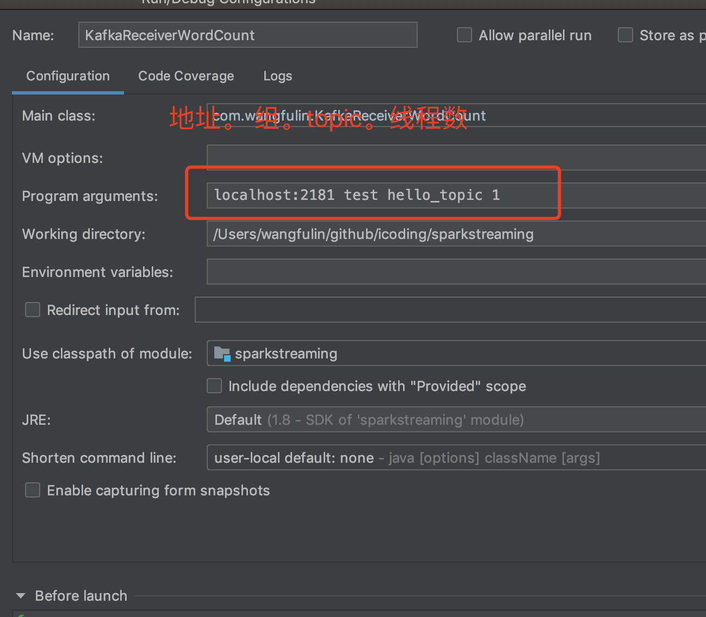

# Spark -Streaming

[toc]

### Flume


#### Flume概述

Flume is a distributed, reliable,
and available service for efficiently collecting(收集),
aggregating(聚合), and moving(移动) large amounts of log data


webserver(源端) => flume => hdfs(目的地)


Flume架构及核心组件

- 1) Source 收集

- 2) Channel 聚集

- 3) Sink 输出


#### Flume安装前置条件

Java Runtime Environment - Java 1.7 or later
Memory - Sufficient memory for configurations used by sources, channels or sinks
Disk Space - Sufficient disk space for configurations used by channels or sinks
Directory Permissions - Read/Write permissions for directories used by agent

#### 安装jdk

下载
解压到~/app
将java配置系统环境变量中: ~/.bash_profile
export JAVA_HOME=/home/hadoop/app/jdk1.8.0_144
export PATH=$JAVA_HOME/bin:$PATH
source下让其配置生效
检测: java -version


#### 安装Flume

下载
解压到~/app
将java配置系统环境变量中: ~/.bash_profile
export FLUME_HOME=/home/hadoop/app/apache-flume-1.6.0-cdh5.7.0-bin
export PATH=$FLUME_HOME/bin:$PATH
source下让其配置生效
**flume-env.sh的配置JAVA_HOME：export JAVA_HOME=/home/hadoop/app/jdk1.8.0_144**
**检测是否安装成功，在bin里面: flume-ng version**

```shell
wangfulindeMacBook-Pro:bin wangfulin$ flume-ng version
Flume 1.6.0-cdh5.7.0
Source code repository: https://git-wip-us.apache.org/repos/asf/flume.git
Revision: 8f5f5143ae30802fe79f9ab96f893e6c54a105d1
Compiled by jenkins on Wed Mar 23 11:38:48 PDT 2016
From source with checksum 50b533f0ffc32db9246405ac4431872e
```


flume配置文件

```
example.conf: A single-node Flume configuration

使用Flume的关键就是写配置文件

A） 配置Source
B） 配置Channel
C） 配置Sink
D） 把以上三个组件串起来

a1: agent名称
r1: source的名称 
k1: sink的名称
c1: channel的名称

\# Name the components on this agent
a1.sources = r1
a1.sinks = k1
a1.channels = c1

\# Describe/configure the source
a1.sources.r1.type = netcat
a1.sources.r1.bind = hadoop000
a1.sources.r1.port = 44444

\# Describe the sink
a1.sinks.k1.type = logger

\# Use a channel which buffers events in memory
a1.channels.c1.type = memory

\# Bind the source and sink to the channel
a1.sources.r1.channels = c1
a1.sinks.k1.channel = c1
```


```
启动agent // a1就是配置文件的名称
flume-ng agent \
--name a1 \
--conf $FLUME_HOME/conf \
--conf-file $FLUME_HOME/conf/example.conf \
-Dflume.root.logger=INFO,console

使用telnet进行测试： telnet localhost 44444
mac使用 nc localhost 44444


Event: { headers:{} body: 68 65 6C 6C 6F 0D hello. }
Event是FLume数据传输的基本单元
Event = 可选的header + byte array
```

 需求二：

实时监控某文件内容 输出到控制台

Agent选型：exec source + memory channel + logger sink

```
example.conf: A single-node Flume configuration

使用Flume的关键就是写配置文件

A） 配置Source
B） 配置Channel
C） 配置Sink
D） 把以上三个组件串起来

a1: agent名称
r1: source的名称 
k1: sink的名称
c1: channel的名称

\# Name the components on this agent
a1.sources = r1
a1.sinks = k1
a1.channels = c1

\# Describe/configure the source
a1.sources.r1.type = exec
a1.sources.r1.command = tail -F /home/hadoop/data..文件路径
a1.sources.r1.shell = /bin/sh -c

\# Describe the sink
a1.sinks.k1.type = logger

\# Use a channel which buffers events in memory
a1.channels.c1.type = memory

\# Bind the source and sink to the channel
a1.sources.r1.channels = c1
a1.sinks.k1.channel = c1
```

```
启动agent
flume-ng agent \
--name a1 \
--conf $FLUME_HOME/conf \
--conf-file $FLUME_HOME/conf/exec-memory-logger.conf \
-Dflume.root.logger=INFO,console
```

 需求三：

将A服务器的日志实时采集到B服务器上


机器A：exec source + memory channel + avro sink
机器B：avro source + memory channel + logger sink

机器A: exec-memory-avro.conf配置

```conf
exec-memory-avro.sources = exec-source
exec-memory-avro.sinks = avro-sink
exec-memory-avro.channels = memory-channel

exec-memory-avro.sources.exec-source.type = exec
exec-memory-avro.sources.exec-source.command = tail -F /Users/wangfulin/bigdata/data/test.log
exec-memory-avro.sources.exec-source.shell = /bin/sh -c

## sink改了
exec-memory-avro.sinks.avro-sink.type = avro
exec-memory-avro.sinks.avro-sink.hostname = localhost
exec-memory-avro.sinks.avro-sink.port = 44444

exec-memory-avro.channels.memory-channel.type = memory

exec-memory-avro.sources.exec-source.channels = memory-channel
exec-memory-avro.sinks.avro-sink.channel = memory-channel
```

机器B，avro-memory-logger.conf配置：

```
avro-memory-logger.sources = avro-source
avro-memory-logger.sinks = logger-sink
avro-memory-logger.channels = memory-channel

avro-memory-logger.sources.avro-source.type = avro
avro-memory-logger.sources.avro-source.bind = localhost
avro-memory-logger.sources.avro-source.port = 44444

avro-memory-logger.sinks.logger-sink.type = logger

avro-memory-logger.channels.memory-channel.type = memory

avro-memory-logger.sources.avro-source.channels = memory-channel
avro-memory-logger.sinks.logger-sink.channel = memory-channel
```


### 单结点单broke

配置server.properties

```
$KAFKA_HOME/config/server.properties
broker.id=0
listeners
host.name
log.dirs
zookeeper.connect
```

#### 启动Kafka

```
kafka-server-start.sh
USAGE: /home/hadoop/app/kafka_2.11-0.9.0.0/bin/kafka-server-start.sh [-daemon] server.properties [--override property=value]*

kafka-server-start.sh $KAFKA_HOME/config/server.properties
```

#### 创建topic: zk

```
kafka-topics.sh --create --zookeeper localhost:2181 --replication-factor 1 --partitions 1 --topic hello_topic
```

#### 查看所有topic

```
kafka-topics.sh --list --zookeeper localhost:2181
```

#### 发送消息:指定 broker地址

```
kafka-console-producer.sh --broker-list localhost:9092 --topic hello_topic
```

#### 消费消息: 指定zk地址

```
kafka-console-consumer.sh --zookeeper localhost:2181 --topic hello_topic --from-beginning
```

#### from-beginning的使用

查看**所有topic**的详细信息：kafka-topics.sh --describe --zookeeper localhost:2181
查看**指定topic**的详细信息：kafka-topics.sh --describe --zookeeper localhost:2181 --topic hello_topic

### 单节点多broker

拷贝server.properties，重新配置

```
server-1.properties
log.dirs=/home/hadoop/app/tmp/kafka-logs-1
listeners=PLAINTEXT://:9093
broker.id=1

server-2.properties
log.dirs=/home/hadoop/app/tmp/kafka-logs-2
listeners=PLAINTEXT://:9094
broker.id=2

server-3.properties
log.dirs=/home/hadoop/app/tmp/kafka-logs-3
listeners=PLAINTEXT://:9095
broker.id=3
```

#### 启动

```
kafka-server-start.sh -daemon $KAFKA_HOME/config/server-1.properties &
kafka-server-start.sh -daemon $KAFKA_HOME/config/server-2.properties &
kafka-server-start.sh -daemon $KAFKA_HOME/config/server-3.properties &
```

#### 创建topic

```
kafka-topics.sh --create --zookeeper localhost:2181 --replication-factor 3 --partitions 1 --topic my-replicated-topic
```

#### 查看topic

所有topic

```
kafka-console-producer.sh --broker-list 
```

生产者

```
kafka-console-producer.sh --broker-list  localhost:9093,localhost:9094,localhost:9095 --topic my-replicated-topic
```

消费者

kafka-console-consumer.sh --zookeeper localhost:2181 --topic my-replicated-topic

查看指定topic

kafka-topics.sh --describe --zookeeper localhost:2181 --topic my-replicated-topic 


### 整合kafka-flume


整合Flume和Kafka的综合使用

avro-memory-kafka.conf

```
avro-memory-kafka.sources = avro-source
avro-memory-kafka.sinks = kafka-sink
avro-memory-kafka.channels = memory-channel

avro-memory-kafka.sources.avro-source.type = avro
avro-memory-kafka.sources.avro-source.bind = localhost
avro-memory-kafka.sources.avro-source.port = 44444

avro-memory-kafka.sinks.kafka-sink.type = org.apache.flume.sink.kafka.KafkaSink
avro-memory-kafka.sinks.kafka-sink.brokerList = localhost:9092
avro-memory-kafka.sinks.kafka-sink.topic = hello_topic
avro-memory-kafka.sinks.kafka-sink.batchSize = 5
avro-memory-kafka.sinks.kafka-sink.requiredAcks =1

avro-memory-kafka.channels.memory-channel.type = memory

avro-memory-kafka.sources.avro-source.channels = memory-channel
avro-memory-kafka.sinks.kafka-sink.channel = memory-channel
```


```
先启动avro-memory-kafka
flume-ng agent \
--name avro-memory-kafka \
--conf $FLUME_HOME/conf \
--conf-file $FLUME_HOME/conf/avro-memory-kafka.conf \
-Dflume.root.logger=INFO,console


flume-ng agent \
--name exec-memory-avro \
--conf $FLUME_HOME/conf \
--conf-file $FLUME_HOME/conf/exec-memory-avro.conf \
-Dflume.root.logger=INFO,console
```


sparkStreaming入门

工作原理：粗粒度

Spark Streaming接收到实时数据流，把数据按照指定的时间段切成一片片小的数据块，
然后把小的数据块传给Spark Engine处理。

 


## 实战

### 基本概念

#### StreamingContext

```java
def this(sparkContext: SparkContext, batchDuration: Duration) = {
this(sparkContext, null, batchDuration)
}

def this(conf: SparkConf, batchDuration: Duration) = {
this(StreamingContext.createNewSparkContext(conf), null, batchDuration)
}
```

batch interval可以根据你的应用程序需求的延迟要求以及集群可用的资源情况来设置


一旦StreamingContext定义好之后，就可以做一些事情

##### Points to remember:

- Once a context has been started, no new streaming computations can be set up or added to it.
- Once a context has been stopped, it cannot be restarted.
- Only one StreamingContext can be active in a JVM at the same time.
- stop() on StreamingContext also stops the SparkContext. To stop only the StreamingContext, set the optional parameter of `stop()` called `stopSparkContext` to false.
- A SparkContext can be re-used to create multiple StreamingContexts, as long as the previous StreamingContext is stopped (without stopping the SparkContext) before the next StreamingContext is created.


#### DStreams

Internally, a DStream is represented by a continuous series of RDDs
Each RDD in a DStream contains data from a certain interval


对DStream操作算子，比如map/flatMap，其实底层会被翻译为对DStream中的每个RDD都做相同的操作；
因为一个DStream是由不同批次的RDD所构成的。


#### Input DStreams and Receivers

Every input DStream (except file stream, discussed later in this section)
is associated with a Receiver object which receives the data from a source and stores it
in Spark’s memory for processing.

 每一个input DStream都需要关联一个Receiver，除了文件系统。因为以网络传输的steam 的返回值是ReceiverInputDStream。ReceiverInputDStream继承InputDStream。而TextFileStream，返回就是DStream。

不要使用local或者local[1],这样意味着，只有一个线程可以使用。

Hence, when running locally, always use “local[*n*]” as the master URL, where *n* > number of receivers to run 


#### 处理socket数据实战

这两个jar包很重要

```xml
    <dependency>
      <groupId>com.fasterxml.jackson.module</groupId>
      <artifactId>jackson-module-scala_2.11</artifactId>
      <version>2.6.5</version>
    </dependency>

    <dependency>
      <groupId>net.jpountz.lz4</groupId>
      <artifactId>lz4</artifactId>
      <version>1.3.0</version>
    </dependency>
```


```scala
import org.apache.spark.SparkConf
import org.apache.spark.streaming.{Seconds, StreamingContext}
object NetworkWordCount {

  def main(args: Array[String]): Unit = {


    val sparkConf = new SparkConf().setMaster("local[4]").setAppName("NetworkWordCount")

    /**
     * 创建StreamingContext需要两个参数：SparkConf和batch interval
     */
    val ssc = new StreamingContext(sparkConf, Seconds(5))

    val lines = ssc.socketTextStream("localhost", 6339)

    val result = lines.flatMap(_.split(" ")).map((_,1)).reduceByKey(_+_)

    result.print()

    ssc.start()
    ssc.awaitTermination()
  }
}

```

#### 处理文件系统数据实战

```scala
import org.apache.spark.SparkConf
import org.apache.spark.streaming.{Seconds, StreamingContext}

object FileWordCount {
  def main(args: Array[String]): Unit = {
    val sparkConf = new SparkConf().setMaster("local").setAppName("FileWordCount")
    val ssc = new StreamingContext(sparkConf, Seconds(5))

    // 监控的是目录
    val lines = ssc.textFileStream("file:///Users/wangfulin/bigdata/ss/")

    val result = lines.flatMap(_.split(" ")).map((_,1)).reduceByKey(_+_)
    result.print()

    ssc.start()
    ssc.awaitTermination()
  }
}
```

#### updateStateByKey算子

带状态的算子

需求：统计到目前为止累积出现的单词的个数(需要保持住以前的状态)

```scala
object StatefulWordCount {
  def main(args: Array[String]): Unit = {
    val sparkConf = new SparkConf().setMaster("local[2]").setAppName("StatefulWordCount")
    val ssc = new StreamingContext(sparkConf, Seconds(5))

    // 如果使用了stateful的算子，必须要设置checkpoint
    // 在生产环境中，建议大家把checkpoint设置到HDFS的某个文件夹中
    ssc.checkpoint(".")

    val lines = ssc.socketTextStream("localhost", 6789)

    val result = lines.flatMap(_.split(" ")).map((_, 1))

    val state = result.updateStateByKey(updateFunction _)
    state.print()

    ssc.start()
    ssc.awaitTermination()
  }

  /**
   * update函数
   * 把当前的数据去更新已有的或者是老的数据
   *
   * @param currentValues 当前的
   * @param preValues     老的
   * @return
   */
  def updateFunction(currentValues: Seq[Int], preValues: Option[Int]): Option[Int] = {
    val current = currentValues.sum
    val pre = preValues.getOrElse(0)

    Some(current + pre)
  }
}
```

官网代码（两个重要参数：newValues、running）：

```scala
def updateFunction(newValues: Seq[Int], runningCount: Option[Int]): Option[Int] = {  val newCount = ... // add the new values with the previous running count to get the new count 
                                                                                   Some(newCount)
}
```

自定义代码

```scala
def updateFunction(currentValues: Seq[Int], preValues: Option[Int]): Option[Int] = {
  val current = currentValues.sum
  val pre = preValues.getOrElse(0)
  Some(current + pre)
 }
```

The update function will be called for each word, with `newValues` having a sequence of 1’s (from the `(word, 1)` pairs) and the `runningCount` having the previous count.

将为每个单词调用update函数，其中newValues的序列为1（从（word，1）对开始），而runningCount具有先前的计数。

Note that using `updateStateByKey` requires the checkpoint directory to be configured, which is discussed in detail in the [checkpointing](https://spark.apache.org/docs/latest/streaming-programming-guide.html#checkpointing) section.

必须配置检查点目录

请注意，使用`updateStateByKey`需要配置检查点目录，这在[checkpointing]（https://spark.apache.org/docs/latest/streaming-programming-guide.html#checkpointing）部分中进行了详细讨论 。


#### 计算到目前为止累计出现的单词个数写到mysql中

表

```mysql
CREATE TABLE wordcount(
word varchar(50) DEFAULT null,
wordcount int(10) DEFAULT null
);
```


```scala
object ForeachRDDApp {
  def main(args: Array[String]): Unit = {
    val sparkConf = new SparkConf().setAppName("ForeachRDDApp").setMaster("local[2]")
    val ssc = new StreamingContext(sparkConf, Seconds(5))


    val lines = ssc.socketTextStream("localhost", 6789)

    val result = lines.flatMap(_.split(" ")).map((_, 1)).reduceByKey(_ + _)

    // 报错 org.apache.spark.SparkException: Task not serializable
    /*    result.foreachRDD(rdd => {
          val connection = createConnection() // executed at the driver
          rdd.foreach { record =>
            val sql = "insert into wordcount(word, wordcount) values('" + record._1 + "'," + record._2 + ")"
            connection.createStatement().execute(sql)
          }
        })*/

    result.print()

    result.foreachRDD(rdd => {
      rdd.foreachPartition(partitionOfRecords => {
        val connection = createConnection()
        partitionOfRecords.foreach(record => {
          val sql = "insert into wordcount(word, wordcount) values('" + record._1 + "'," + record._2 + ")"
          connection.createStatement().execute(sql)
        })

        connection.close()
      })
    })

    ssc.start()
    ssc.awaitTermination()
  }

  /**
   * 获取MySQL的连接
   */
  def createConnection() = {
    Class.forName("com.mysql.jdbc.Driver")
    DriverManager.getConnection("jdbc:mysql://localhost:3306/imooc_project", "root", "123456")
  }
}
```

　　报错分析：

1、connection.createStatement().execute(sql)//没有驱动包，自己引入

2、第一种官网连接会报序列化错误，自己改成partition式连接，如上面代码

3、重复执行，mysql数据库的列名会重复出现，自行使用Hbase或redis等数据库

4、改成连接池的方式

改进版，用set存储key

```scala
object ForeachRDDAppPro {
  def main(args: Array[String]): Unit = {
    val sparkConf = new SparkConf().setAppName("ForeachRDDApp").setMaster("local[2]")
    val ssc = new StreamingContext(sparkConf, Seconds(5))


    val lines = ssc.socketTextStream("localhost", 6789)

    val result = lines.flatMap(_.split(" ")).map((_, 1)).reduceByKey(_ + _)

    result.print()


    var rs: ResultSet = null
    var stmt: PreparedStatement = null
    var supdate: PreparedStatement = null

    result.foreachRDD(rdd => {
      rdd.foreachPartition(partitionOfRecords => {

        partitionOfRecords.foreach(record => {
          val connection = JDBCConnectePools.getConn()
          if (Remenber.keySet.contains(record._1)) {
            var preWordCount = 0
            var newWordCount = 0
            val querySql = "select wordcount from wordcount where word = ?"
            stmt = connection.prepareStatement(querySql)
            stmt.setString(1, record._1)
            rs = stmt.executeQuery()
            if (rs.next()) {
              preWordCount = rs.getInt("wordcount")
              newWordCount = preWordCount + record._2
            }
            val updateSql = "update wordcount set wordcount = ? where word = ?"
            supdate = connection.prepareStatement(updateSql)
            supdate.setInt(1, newWordCount)
            supdate.setString(2, record._1)
            supdate.executeUpdate()
          } else {
            Remenber.keySet += record._1
            val sql = "insert into wordcount(word, wordcount) values('" + record._1 + "'," + record._2 + ")"
            connection.createStatement().execute(sql)
          }
          JDBCConnectePools.returnConn(connection)

        })
      })
    })


    ssc.start()
    ssc.awaitTermination()
  }

  /**
   * 获取MySQL的连接
   */
/*  def createConnection() = {
    Class.forName("com.mysql.jdbc.Driver")
    DriverManager.getConnection("jdbc:mysql://localhost:3306/imooc_project", "root", "123456")
  }*/
}

object Remenber{
  var keySet: Set[String] = Set()
}

object JDBCConnectePools {
  private val max = 10 //设置连接最大数
  private val ConnectionNum = 10 //设置 每次可以获取几个Connection
  private var conNum = 0 //连接数
  private val pool = new util.LinkedList[Connection]() //连接池

  def getDriver(): Unit = { //加载Driver
    //加载
    //这里判断的两个空不能去掉
    //可能有人以为在调用getDriver方法时已经判断过pool.isEmpty了，
    //在进行判断是没有意义的，而且当 连接数已经大于等于max时，会死循环
    //但是要考虑到运行过成中，在spark中是多线程运行的，在调用
    //getConnection方法时，可能当时pool中是空的，但是在调用后，
    //可能其他线程的数据运行完了，会还连接，
    //那么此时再进行判断时pool就不是空了，两个调教都不成立，
    //才能跳出循环，此时的情况是，获取的连接数已经大于等最大（max）的值
    //并且 已经有人把连接换了， 就可以直接取连接了，不用再创建
    //，也不能再创建
    if (conNum < max && pool.isEmpty) { //
      Class.forName("com.mysql.jdbc.Driver")

    } else if (conNum >= max && pool.isEmpty) {
      print("当前暂无可用Connection")
      Thread.sleep(2000)
      getDriver()
    }
  }

  def getConn(): Connection = {
    if (pool.isEmpty) {
      getDriver()
      for (i <- 1 to ConnectionNum) { //创建10个连接
        val conn = DriverManager.getConnection("jdbc:mysql://localhost:3306/imooc_project", "root", "123456")
        pool.push(conn) //  把连接放到连接池中，push是LinkedList中的方法
        conNum += 1
      }
    }
    val conn: Connection = pool.pop() //从线程池所在LinkedList中弹出一个Connection,pop 是LinkedList的方法
    conn //返回一个Connection
  }

  def returnConn(conn: Connection): Unit = { //还连接
    pool.push(conn)
  }

}

```

参考：https://blog.csdn.net/Lu_Xiao_Yue/article/details/83997833


#### 实战：窗口函数的使用

```scala
val windowedWordCounts = pairs.reduceByKeyAndWindow((a:Int,b:Int) => (a + b), Seconds(30), Seconds(10))
```

window：定时的进行一个时间段内的数据处理


- *window length* - The duration of the window (3 in the figure).
- *sliding interval* - The interval at which the window operation is performed (2 in the figure).

需求：黑名单过滤

访问日志 ==> DStream
20180808,zs
20180808,ls
20180808,ww

转成 ==> (zs: 20180808,zs)(ls: 20180808,ls)(ww: 20180808,ww)

黑名单列表 ==> RDD
zs
ls
转成 ==>(zs: true)(ls: true)


==> 20180808,ww

leftjoin
(zs: [<20180808,zs>, <true>]) x
(ls: [<20180808,ls>, <true>]) x
(ww: [<20180808,ww>, <false>]) ==> tuple 1

```scala
/**
 * 黑名单过滤 Transform操作
 */

object TransformApp {
  def main(args: Array[String]): Unit = {
    val sparkConf = new SparkConf().setMaster("local[2]").setAppName("TransformApp")

    /**
     * 创建StreamingContext需要两个参数：SparkConf和batch interval
     */
    val ssc = new StreamingContext(sparkConf, Seconds(5))

    /**
     * 构建黑名单
     */
    val blacks = List("zs", "ls")
    // ==>(zs: true)(ls: true)
    val blacksRDD = ssc.sparkContext.parallelize(blacks).map(x => (x, true))

    val lines = ssc.socketTextStream("localhost", 6789)

    // 输入 20180808,zs
    val clickLog = lines.map(x => (x.split(",")(1), x)) //(zs: 20180808,zs) DStream ==> RDD
      .transform(rdd => {
        rdd.leftOuterJoin(blacksRDD) // (zs: [<20180808,zs>, <true>])
          .filter(x => x._2._2.getOrElse(false) != true) //第二位里面的第二位 不等于true的留下
          .map(x => x._2._1) // 只需要第二个里面的第一个数据
      })
    clickLog.print()

    ssc.start()
    ssc.awaitTermination()
  }
}
```

输入

```
20180808,zs
20180808,ls
20180808,ww
```

Spark Streaming整合Spark SQL完成词频统计操作

```scala
object SqlNetworkWordCount {

  def main(args: Array[String]): Unit = {
    val sparkConf = new SparkConf().setAppName("ForeachRDDApp").setMaster("local[2]")
    val ssc = new StreamingContext(sparkConf, Seconds(5))

    val lines = ssc.socketTextStream("localhost", 6789)
    val words = lines.flatMap(_.split(" "))

    // Convert RDDs of the words DStream to DataFrame and run SQL query
    words.foreachRDD { (rdd: RDD[String], time: Time) =>
      val spark = SparkSessionSingleton.getInstance(rdd.sparkContext.getConf)
      import spark.implicits._

      // Convert RDD[String] to RDD[case class] to DataFrame
      val wordsDataFrame = rdd.map(w => Record(w)).toDF()

      // Creates a temporary view using the DataFrame
      wordsDataFrame.createOrReplaceTempView("words")

      // Do word count on table using SQL and print it
      val wordCountsDataFrame =
        spark.sql("select word, count(*) as total from words group by word")
      println(s"========= $time =========")
      wordCountsDataFrame.show()
    }


    ssc.start()
    ssc.awaitTermination()
  }


  /** Case class for converting RDD to DataFrame */
  case class Record(word: String)


  /** Lazily instantiated singleton instance of SparkSession */
  object SparkSessionSingleton {

    @transient  private var instance: SparkSession = _

    def getInstance(sparkConf: SparkConf): SparkSession = {
      if (instance == null) {
        instance = SparkSession
          .builder
          .config(sparkConf)
          .getOrCreate()
      }
      instance
    }
  }
}
```


### Spark Streaming整合Flume

#### Flume-style Push-based Approach 模式

Due to the push model, **the streaming application needs to be up**, with the receiver scheduled and listening on the chosen port, for Flume to be able to push data.


Push方式整合

Flume Agent的编写： flume_push_streaming.conf

```
simple-agent.sources = netcat-source
simple-agent.sinks = avro-sink
simple-agent.channels = memory-channel

simple-agent.sources.netcat-source.type = netcat
simple-agent.sources.netcat-source.bind = localhost
simple-agent.sources.netcat-source.port = 44444

simple-agent.sinks.avro-sink.type = avro
simple-agent.sinks.avro-sink.hostname = localhost
simple-agent.sinks.avro-sink.port = 41414

simple-agent.channels.memory-channel.type = memory

simple-agent.sources.netcat-source.channels = memory-channel
simple-agent.sinks.avro-sink.channel = memory-channel
```

```
flume-ng agent \
--name simple-agent \
--conf $FLUME_HOME/conf \
--conf-file $FLUME_HOME/conf/flume_push_streaming.conf \
-Dflume.root.logger=INFO,console
```


```scala
object FlumePushWordCount {
  def main(args: Array[String]): Unit = {
    val sparkConf = new SparkConf().setMaster("local[2]").setAppName("FlumePushWordCount")
    val ssc = new StreamingContext(sparkConf, Seconds(5))

    //TODO... 如何使用SparkStreaming整合Flume
    val flumeStream = FlumeUtils.createStream(ssc, "localhost", 41414)

    flumeStream.map(x => new String(x.event.getBody.array()).trim)
      .flatMap(_.split(" ")).map((_, 1)).reduceByKey(_ + _).print()
    
    ssc.start()
    ssc.awaitTermination()

  }
}
```

**注意点：先启动启动Spark Streaming应用程序,后启动flume** 


#### Approach 2: Pull-based Approach using a Custom Sink（推荐）

pull的方式

Pull方式整合

这种方法不是运行Flume将数据直接推送到Spark Streaming，而是运行自定义的Flume接收器，该接收器可以执行以下操作。

- Flume将数据推入接收器，并且数据保持缓冲状态。
- Spark Streaming使用[可靠的Flume接收器](https://spark.apache.org/docs/latest/streaming-programming-guide.html#receiver-reliability) 和事务从[接收器](https://spark.apache.org/docs/latest/streaming-programming-guide.html#receiver-reliability)中提取数据。只有在Spark Streaming接收并复制了数据之后，事务才能成功。

与以前的方法相比，这确保了更强的可靠性和 [容错保证](https://spark.apache.org/docs/latest/streaming-programming-guide.html#fault-tolerance-semantics)。但是，这需要将Flume配置为运行自定义接收器

Flume Agent的编写： flume_pull_streaming.conf

```
simple-agent.sources = netcat-source
simple-agent.sinks = spark-sink
simple-agent.channels = memory-channel

simple-agent.sources.netcat-source.type = netcat
simple-agent.sources.netcat-source.bind = localhost
simple-agent.sources.netcat-source.port = 44444

simple-agent.sinks.spark-sink.type = org.apache.spark.streaming.flume.sink.SparkSink
simple-agent.sinks.spark-sink.hostname = localhost
simple-agent.sinks.spark-sink.port = 41414

simple-agent.channels.memory-channel.type = memory

simple-agent.sources.netcat-source.channels = memory-channel
simple-agent.sinks.spark-sink.channel = memory-channel
```

**注意点：先启动flume 后启动Spark Streaming应用程序**

启动

```
flume-ng agent \
--name simple-agent \
--conf $FLUME_HOME/conf \
--conf-file $FLUME_HOME/conf/flume_pull_streaming.conf \
-Dflume.root.logger=INFO,console
```


### Spark Streaming整合Kafka

#### Approach 1: Receiver-based Approach

The Receiver is implemented using the Kafka high-level consumer API. As with all receivers, the data received from Kafka through a Receiver is stored in Spark executors, and then jobs launched by Spark Streaming processes the data.

接收器是使用Kafka高级消费者API实现的。 与所有接收器一样，通过接收器从Kafka接收的数据存储在Spark执行器中，然后由Spark Streaming启动的作业将处理数据。

但是，在默认配置下，此方法可能会在发生故障时丢失数据（请参阅[接收器可靠性](https://spark.apache.org/docs/latest/streaming-programming-guide.html#receiver-reliability)。为确保零数据丢失，您还必须在Spark Streaming（Spark 1.2中引入）中另外启用预写日志，从而同步保存所有接收到的日志。

操作步骤：

```
1.先启动zk：./zkServer.sh start

2.启动kafka：./kafka-server-start.sh -daemon $KAFKA_HOME/config/server.properties

3.创建topic

./kafka-topics.sh --create --zookeeper localhost:2181 --replication-factor 1 --partitions 1 --topic kafka_streaming_topic

./kafka-topics.sh --list --zookeeper localhost:2181

4.通过控制台测试是否能正常生产与消费

./kafka-console-producer.sh --broker-list localhost:9092 --topic kafka_streaming_topic

./kafka-console-consumer.sh --zookeeper localhost:2181 --topic kafka_streaming_topic

 
```




```scala
object KafkaReceiverWordCount {

  def main(args: Array[String]): Unit = {

    if (args.length != 4) {
      System.err.println("Usage: KafkaReceiverWordCount <zkQuorum> <group> <topics> <numThreads>")
    }

    val Array(zkQuorum, group, topics, numThreads) = args

    val sparkConf = new SparkConf() .setAppName("KafkaReceiverWordCount").setMaster("local[2]")

    val ssc = new StreamingContext(sparkConf, Seconds(5))

    val topicMap = topics.split(",").map((_, numThreads.toInt)).toMap

    // TODO... Spark Streaming如何对接Kafka
    val messages = KafkaUtils.createStream(ssc, zkQuorum, group, topicMap)

    // TODO... 自己去测试为什么要取第二个 注意是第二位参数
    messages.map(_._2).flatMap(_.split(" ")).map((_, 1)).reduceByKey(_ + _).print()

    ssc.start()
    ssc.awaitTermination()
  }
}
```

上生产：


### Direct Approach（常用 spark1.3引入）（推荐）

特点：

- 1、简化了并行度，不需要多个Input Stream，只需要一个DStream

- 2、加强了性能，真正做到了0数据丢失，而Receiver方式需要写到WAL才可以（即副本存储），Direct方式没有Receiver

- 3、只执行一次

缺点：基于ZooKeeper的Kafka监控工具，无法展示出来，所以需要周期性地访问offset才能更新到ZooKeeper去

操作：

参数只需要传brokers与topics，注意查看源码与泛型看返回类型并构造出来

关键代码：

```scala
val topicsSet = topics.split(",").toSet
val kafkaParams = Map[String,String]("metadata.broker.list"-> brokers)
  // TODO... Spark Streaming如何对接Kafka
val messages = KafkaUtils.createDirectStream[String,String,StringDecoder,StringDecoder](ssc,kafkaParams,topicsSet)
```


```scala
import org.apache.spark.SparkConf
import org.apache.spark.streaming.kafka.KafkaUtils
import org.apache.spark.streaming.{Seconds, StreamingContext}
import kafka.serializer.StringDecoder

/**
 * Spark Streaming对接Kafka的方式二
 */
object KafkaDirectWordCount {

  def main(args: Array[String]): Unit = {

    if (args.length != 2) {
      System.err.println("Usage: KafkaDirectWordCount <brokers> <topics>")
      System.exit(1)
    }

    val Array(brokers, topics) = args

    val sparkConf = new SparkConf().setAppName("KafkaReceiverWordCount").setMaster("local[2]")

    val ssc = new StreamingContext(sparkConf, Seconds(5))

    // topic需要set类型
    val topicsSet = topics.split(",").toSet
    // kafkaParams map类型
    val kafkaParams = Map[String, String]("metadata.broker.list" -> brokers)

//    val directKafkaStream = KafkaUtils.createDirectStream[
//      [key class], [value class], [key decoder class], [value decoder class] ](
//      streamingContext, [map of Kafka parameters], [set of topics to consume])
    // TODO... Spark Streaming如何对接Kafka
    val messages = KafkaUtils.createDirectStream[String, String, StringDecoder, StringDecoder](
      ssc, kafkaParams, topicsSet
    )

    // TODO... 自己去测试为什么要取第二个
    messages.map(_._2).flatMap(_.split(" ")).map((_, 1)).reduceByKey(_ + _).print()

    ssc.start()
    ssc.awaitTermination()
  }
}
```

参数


遇到问题

Spark Streaming 报错:kafka.cluster.BrokerEndPoint cannot be cast to kafka.cluster.Broker

解决：

pom文件的问题，版本要对应，再重新reimport一下，参考：https://www.geek-share.com/detail/2662900883.html


整合flume + kafka + spark streaming


#### log4j到flume

flume配置streaming.conf

```
agent1.sources=avro-source
agent1.channels=logger-channel
agent1.sinks=log-sink

\#define source
agent1.sources.avro-source.type=avro
agent1.sources.avro-source.bind=0.0.0.0
agent1.sources.avro-source.port=41414

\#define channel
agent1.channels.logger-channel.type=memory

\#define sink
agent1.sinks.log-sink.type=logger

agent1.sources.avro-source.channels=logger-channel
agent1.sinks.log-sink.channel=logger-channel
```

 启动

```
flume-ng agent \
--conf $FLUME_HOME/conf \
--conf-file $FLUME_HOME/conf/streaming.conf \
--name agent1 \
-Dflume.root.logger=INFO,console
```

日志

Log4j.properties

```
log4j.rootLogger=INFO,stdout,flume

log4j.appender.stdout = org.apache.log4j.ConsoleAppender
log4j.appender.stdout.target = System.out
log4j.appender.stdout.layout=org.apache.log4j.PatternLayout
log4j.appender.stdout.layout.ConversionPattern=%d{yyyy-MM-dd HH:mm:ss,SSS} [%t] [%c] [%p] - %m%n


log4j.appender.flume = org.apache.flume.clients.log4jappender.Log4jAppender
log4j.appender.flume.Hostname = localhost
log4j.appender.flume.Port = 41414
log4j.appender.flume.UnsafeMode = true
```


```java
import org.apache.log4j.Logger;

/**
 * 模拟日志产生
 */
public class LoggerGenerator {

    private static Logger logger = Logger.getLogger(LoggerGenerator.class.getName());

    public static void main(String[] args) throws Exception {

        int index = 0;
        while (true) {
            Thread.sleep(1000);
            logger.info("value : " + index++);
        }
    }
}
```


kafka创建topic

```
/kafka-topics.sh --create --zookeeper hadoop000:2181 --replication-factor 1 --partitions 1 --topic streamingtopic
```

streaming2.conf

```
agent1.sources=avro-source
agent1.channels=logger-channel
agent1.sinks=kafka-sink

#define source
agent1.sources.avro-source.type=avro
agent1.sources.avro-source.bind=localhost
agent1.sources.avro-source.port=41414

#define channel
agent1.channels.logger-channel.type=memory

#define sink
agent1.sinks.kafka-sink.type=org.apache.flume.sink.kafka.KafkaSink
agent1.sinks.kafka-sink.topic = streamingtopic
agent1.sinks.kafka-sink.brokerList = localhost:9092
agent1.sinks.kafka-sink.requiredAcks = 1
agent1.sinks.kafka-sink.batchSize = 20

agent1.sources.avro-source.channels=logger-channel
agent1.sinks.kafka-sink.channel=logger-channel
```

启动

```
flume-ng agent \
--conf $FLUME_HOME/conf \
--conf-file $FLUME_HOME/conf/streaming2.conf \
--name agent1 \
-Dflume.root.logger=INFO,console
```

用kafka消费

```
kafka-console-consumer.sh --zookeeper localhost:2181 --topic streamingtopic
```


Spark Streaming对接Kafka

```scala
object KafkaStreamingApp {

  def main(args: Array[String]): Unit = {

    if(args.length != 4) {
      System.err.println("Usage: KafkaStreamingApp <zkQuorum> <group> <topics> <numThreads>")
    }

    val Array(zkQuorum, group, topics, numThreads) = args

    val sparkConf = new SparkConf().setAppName("KafkaReceiverWordCount")
      .setMaster("local[2]")

    val ssc = new StreamingContext(sparkConf, Seconds(5))

    val topicMap = topics.split(",").map((_, numThreads.toInt)).toMap

    // TODO... Spark Streaming如何对接Kafka
    val messages = KafkaUtils.createStream(ssc, zkQuorum, group,topicMap)

    // TODO... 自己去测试为什么要取第二个
    messages.map(_._2).count().print()

    ssc.start()
    ssc.awaitTermination()
  }
}

```


现在是在本地进行测试的，在IDEA中运行LoggerGenerator，
然后使用Flume、Kafka以及Spark Streaming进行处理操作。

在生产上肯定不是这么干的，怎么干呢？
1) 打包jar，执行LoggerGenerator类
2) Flume、Kafka和我们的测试是一样的
3) Spark Streaming的代码也是需要打成jar包，然后使用spark-submit的方式进行提交到环境上执行
可以根据你们的实际情况选择运行模式：local/yarn/standalone/mesos

在生产上，整个流处理的流程都一样的，区别在于业务逻辑的复杂性


### 综合实战

行为日志分析：

1.访问量的统计

2.网站黏性

3.推荐

Python实时产生数据

访问URL->IP信息->referer和状态码->日志访问时间->写入到文件中

linux crontab 定时

指令为：crontab -e

然后在里面编辑：*/1 * * * *　　　　//“1”代表1分钟

*/1 * * * *  /Users/wangfulin/bigdata/data/project/generate_log.sh


使用Flume实时收集日志信息：

streaming_project.conf(exec-memory-logger)：先输出到控制台测试一下

exec source：

type:exec 从文本文件中抽取数据就是用exec

```
exec-memory-logger.sources = exec-source
exec-memory-logger.sinks = logger-sink
exec-memory-logger.channels = memory-channel

exec-memory-logger.sources.exec-source.type = exec
exec-memory-logger.sources.exec-source.command = tail -F /Users/wangfulin/bigdata/data/project/log/access.log
exec-memory-logger.sources.exec-source.shell = /bin/sh -c


exec-memory-logger.channels.memory-channel.type = memory

exec-memory-logger.sinks.logger-sink.type = logger

exec-memory-logger.sources.exec-source.channels = memory-channel
exec-memory-logger.sinks.logger-sink.channel = memory-channel
```

启动

```
flume-ng agent \
--name exec-memory-logger \
--conf $FLUME_HOME/conf \
--conf-file $FLUME_HOME/conf/streaming_project.conf \
-Dflume.root.logger=INFO,console
```

日志 ==》 Flume ==》kafka

启动zk、启动kafka、终端上确认kafka能消费生产者的东西

启动zk:./zkServer.sh start

启动Kafka server：kafka-server-start.sh -daemon $KAFKA_HOME/config/server.properties

修改flume配置文件，使得flume sink数据到kafka

```
exec-memory-kafka.sources = exec-source
exec-memory-kafka.sinks = kafka-sink
exec-memory-kafka.channels = memory-channel

exec-memory-kafka.sources.exec-source.type = exec
exec-memory-kafka.sources.exec-source.command = tail -F /Users/wangfulin/bigdata/data/project/log/access.log
exec-memory-kafka.sources.exec-source.shell = /bin/sh -c


exec-memory-kafka.channels.memory-channel.type = memory

exec-memory-kafka.sinks.kafka-sink.type = org.apache.flume.sink.kafka.KafkaSink
exec-memory-kafka.sinks.kafka-sink.brokerList = localhost:9092
exec-memory-kafka.sinks.kafka-sink.topic = streamingtopic
exec-memory-kafka.sinks.kafka-sink.batchSize = 5
exec-memory-kafka.sinks.kafka-sink.requiredAcks = 1


exec-memory-kafka.sources.exec-source.channels = memory-channel
exec-memory-kafka.sinks.kafka-sink.channel = memory-channel
```

 启动：

```
flume-ng agent \
--name exec-memory-kafka \
--conf $FLUME_HOME/conf \
--conf-file $FLUME_HOME/conf/streaming_project2.conf \
-Dflume.root.logger=INFO,console
```


对接收的数据清洗

```scala
  // 82.88.45.123 2020-05-23 19:06:00  "GET /class/112.html HTTP/1.1" 404  http://www.sogou.com/web?query=hadoop
  // infos(2) = "GET /class/130.html HTTP/1.1"
  // url = /class/130.html
  val url = infos(2).split(" ")(1)
  var courseId = 0

  if (url.startsWith("/class")) {
    val courseIdHtml = url.split("/")(2)
    courseId = courseIdHtml.substring(0, courseIdHtml.lastIndexOf(".")).toInt
  }
  ClickLog(infos(0), DateUtils.parseToMinute(infos(1)), courseId, infos(3).toInt, infos(4))
}).filter(clicklog => clicklog.courseId != 0)
```

清洗完

```
Time: 1590233400000 ms
-------------------------------------------
ClickLog(6.54.82.88,20200523192900,128,200,-)
ClickLog(34.54.9.23,20200523192900,141,404,-)
ClickLog(67.23.123.82,20200523192900,128,500,-)
ClickLog(54.32.34.9,20200523192900,128,404,-)
ClickLog(32.23.67.76,20200523192900,112,200,-)
ClickLog(1.123.34.6,20200523192900,112,200,-)
ClickLog(32.88.76.9,20200523192900,128,404,-)
ClickLog(1.34.67.32,20200523192900,112,200,-)
```


参数-f使tail不停地去读最新的内容，这样有实时监视的效果

 

map(_._2) 等价于 map(t => t._2) //t是个2项以上的元组
map(_._2, _) 等价与 map(t => t._2, t) //这会返回第二项为首后面项为旧元组的新元组 

 

启动hbase

./start-hbase.sh

./hbase shell

创建数据库

Hbase表设计

创建表：

​	create "cource_clickcount","info"

​	rowkey设计

​		day_courseid

```java
/**
 * HBase操作工具类：Java工具类建议采用单例模式封装
 */
public class HBaseUtils {


    HBaseAdmin admin = null;
    Configuration configuration = null;


    /**
     * 私有改造方法
     */
    private HBaseUtils() {
        configuration = new Configuration();
        // zookeeper地址
        configuration.set("hbase.zookeeper.quorum", "localhost:2181");
        configuration.set("hbase.rootdir", "hdfs://localhost:9000/hbase");

        try {
            admin = new HBaseAdmin(configuration);
        } catch (IOException e) {
            e.printStackTrace();
        }
    }

    private static HBaseUtils instance = null;

    public static synchronized HBaseUtils getInstance() {
        if (null == instance) {
            instance = new HBaseUtils();
        }
        return instance;
    }


    /**
     * 根据表名获取到HTable实例
     */
    public HTable getTable(String tableName) {

        HTable table = null;

        try {
            table = new HTable(configuration, tableName);
        } catch (IOException e) {
            e.printStackTrace();
        }

        return table;
    }

    /**
     * 添加一条记录到HBase表
     *
     * @param tableName HBase表名
     * @param rowkey    HBase表的rowkey
     * @param cf        HBase表的columnfamily
     * @param column    HBase表的列
     * @param value     写入HBase表的值
     */
    public void put(String tableName, String rowkey, String cf, String column, String value) {
        HTable table = getTable(tableName);

        Put put = new Put(Bytes.toBytes(rowkey));
        put.add(Bytes.toBytes(cf), Bytes.toBytes(column), Bytes.toBytes(value));

        try {
            table.put(put);
        } catch (IOException e) {
            e.printStackTrace();
        }
    }

    public static void main(String[] args) {

        //HTable table = HBaseUtils.getInstance().getTable("course_clickcount");
        //System.out.println(table.getName().getNameAsString());

        String tableName = "course_clickcount";
        String rowkey = "20171111_88";
        String cf = "info";
        String column = "click_count";
        String value = "2";

        HBaseUtils.getInstance().put(tableName, rowkey, cf, column, value);
    }
}
```

功能二：功能一+搜索过来的


hbase设计

​	create 'course_search_clickcount','info'

​	rowkey:20171111 +search+ 1

清数据：truncate + '表名'


----

代码：

- [sparkstreaming](../icoding/spark-examples/sparkstreaming)

