## Zookeeper 

### Zookeeper工作机制

​      Zookeeper从设计模式角度来理解：是一个**基于观察者模式设计**的分布式服务管理框架，它负责存储和管理大家都关心的数据，然后接受观察者的注册，一旦这些数据的状态发生变化，Zookeeper就将负责通知已经在Zookeeper上注册的那些观察者做出相应的反应。

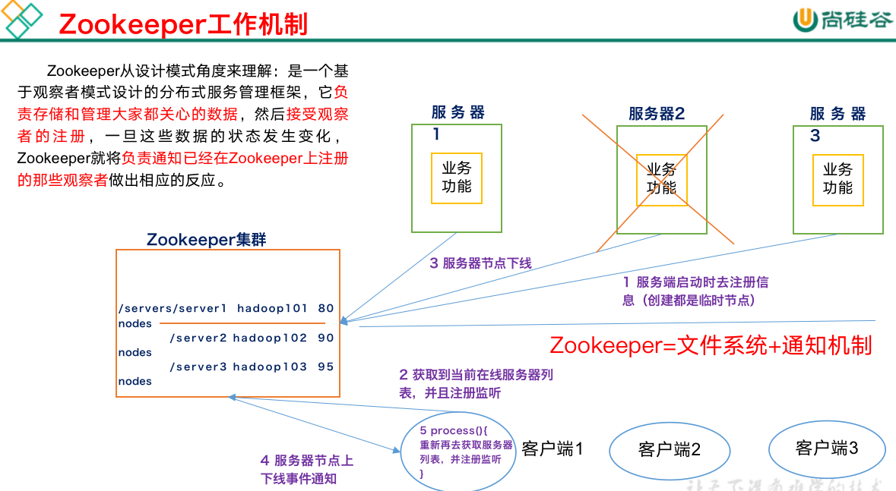

服务器上线状态信息注册到zk中，客户端去监听服务器的状态信息。

### Zookeeper特点

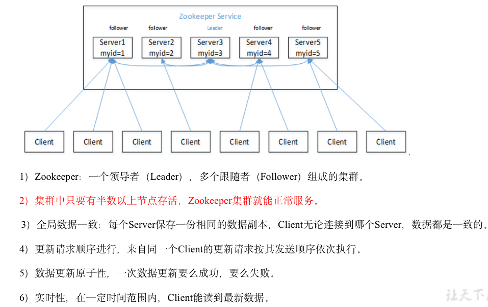

半数存活也不能提供正常的服务。

### 数据结构

​		ZooKeeper数据模型的结构与Unix文件系统很类似，整体上可以看作是一棵树，每个节点称做一个ZNode。每一个ZNode默认能够存储1MB的数据，每个ZNode都可以通过其路径唯一标识。

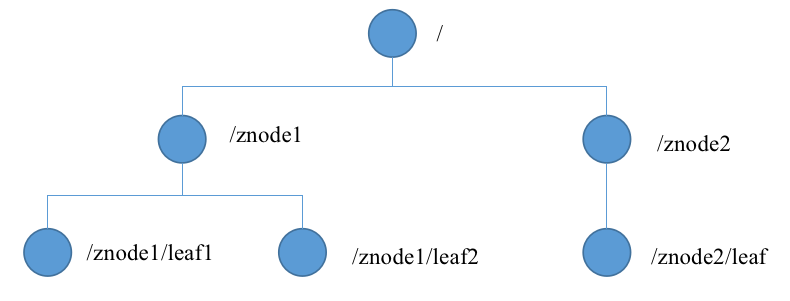

### 应用场景

​		提供的服务包括：统一命名服务、统一配置管理、统一集群管理、服务器节点动态上下线、软负载均衡等。

#### 统一命名服务

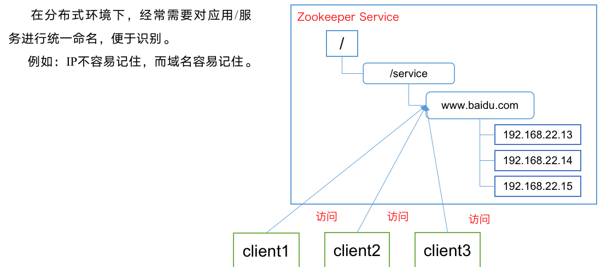

#### 统一配置管理

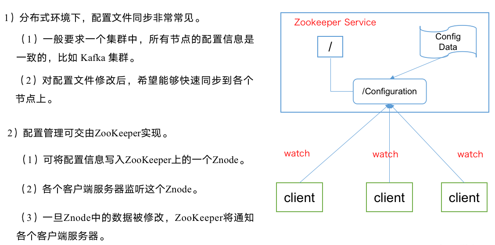

#### 统一集群管理

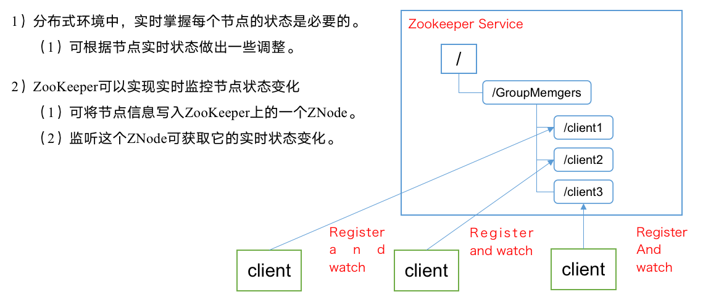

#### 服务器动态上下线

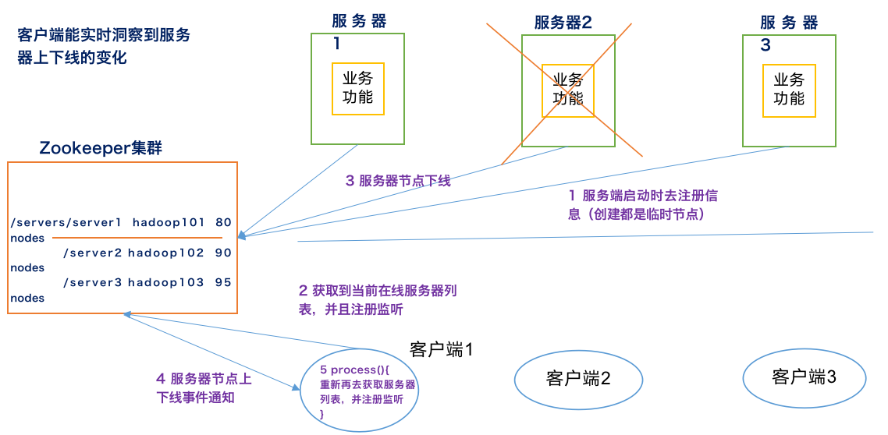

#### 软负载均衡

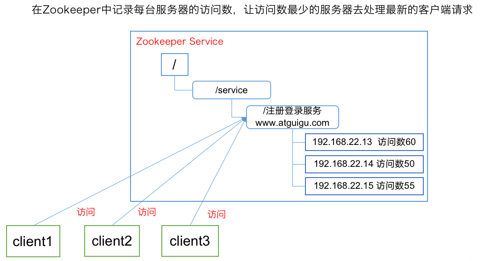

### 配置参数解读

Zookeeper中的配置文件zoo.cfg中参数含义解读如下：

1．tickTime =2000：通信心跳数，Zookeeper服务器与客户端心跳时间，单位毫秒

Zookeeper使用的基本时间，服务器之间或客户端与服务器之间维持心跳的时间间隔，也就是每个tickTime时间就会发送一个心跳，时间单位为毫秒。

它用于心跳机制，并且设置最小的session超时时间为**两倍心跳时间**。(session的最小超时时间是2*tickTime)

2．initLimit =10：LF初始通信时限

集群中的Follower跟随者服务器与Leader领导者服务器之间初始连接时能容忍的最多心跳数（tickTime的数量），用它来限定集群中的Zookeeper服务器连接到Leader的时限。

3．syncLimit =5：LF同步通信时限

集群中Leader与Follower之间的最大响应时间单位，假如响应超过syncLimit * tickTime，Leader认为Follwer死掉，从服务器列表中删除Follwer。

4．dataDir：数据文件目录+数据持久化路径

主要用于保存Zookeeper中的数据。

5．clientPort =2181：客户端连接端口

监听客户端连接的端口。

### Zookeeper内部原理

#### 选举机制

1）半数机制：集群中**半数以上**机器存活，集群可用。所以Zookeeper适合安装奇数台服务器。

2）Zookeeper虽然在配置文件中并没有指定Master和Slave。但是，Zookeeper工作时，是有一个节点为Leader，其他则为Follower，**Leader是通过内部的选举机制临时产生的**。

3）选举过程。

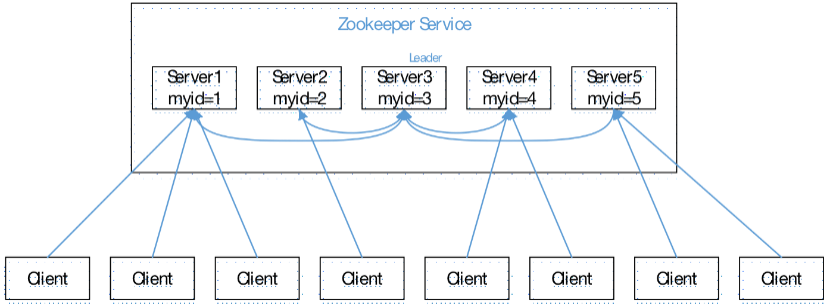

（1）服务器1启动，此时只有它一台服务器启动了，它发出去的报文没有任何响应，所以它的选举状态一直是**LOOKING**状态。

（2）服务器2启动，它与最开始启动的服务器1进行通信，互相交换自己的选举结果，由于两者都没有历史数据，**所以id值较大的服务器2胜出**，但是由于没有达到超过半数以上的服务器都同意选举它(这个例子中的半数以上是3)，所以服务器1、2还是继续保持LOOKING状态。

（3）服务器3启动，根据前面的理论分析，服务器3成为服务器1、2、3中的老大，而与上面不同的是，此时有三台服务器选举了它，所以它成为了这次选举的Leader。

（4）服务器4启动，根据前面的分析，理论上服务器4应该是服务器1、2、3、4中最大的，但是由于前面已经有半数以上的服务器选举了服务器3，所以它只能当follower。

（5）服务器5启动，同4一样当follower。

#### 节点类型

持久（Persistent）：客户端和服务器端断开连接后，创建的节点不删除

短暂（Ephemeral）：客户端和服务器端断开连接后，创建的节点自己删除

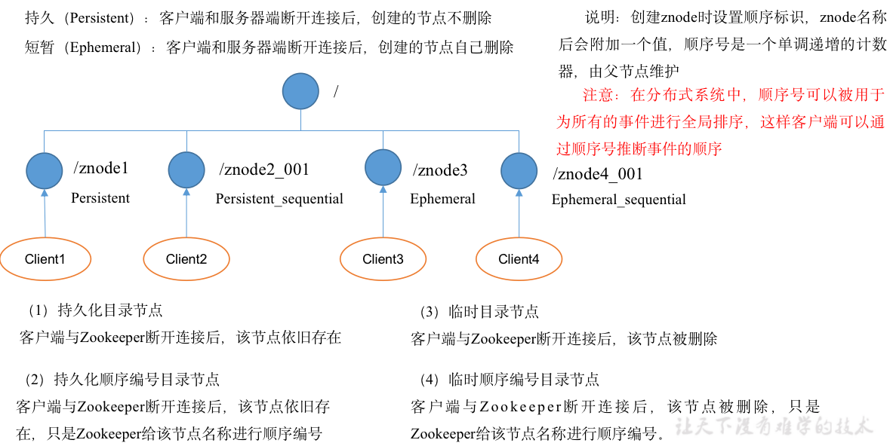

#### Stat结构体

1）czxid-创建节点的事务zxid

每次修改ZooKeeper状态都会收到一个zxid形式的时间戳，也就是ZooKeeper事务ID。

事务ID是ZooKeeper中所有修改总的次序。每个修改都有唯一的zxid，如果zxid1小于zxid2，那么zxid1在zxid2之前发生。

2）ctime - znode被创建的毫秒数(从1970年开始)

3）mzxid - znode最后更新的事务zxid

4）mtime - znode最后修改的毫秒数(从1970年开始)

5）pZxid-znode最后更新的子节点zxid

6）cversion - znode子节点变化号，znode子节点修改次数

7）dataversion - znode数据变化号

8）aclVersion - znode访问控制列表的变化号

9）ephemeralOwner- 如果是临时节点，这个是znode拥有者的session id。如果不是临时节点则是0。

10）dataLength- znode的数据长度

11）numChildren - znode子节点数量

#### 监听器原理

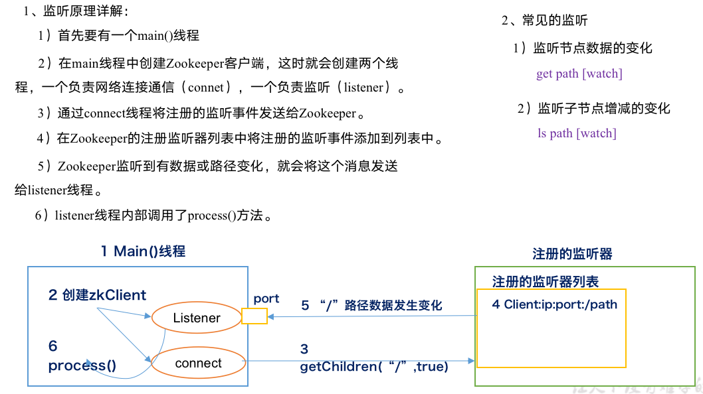

#### 写数据流程

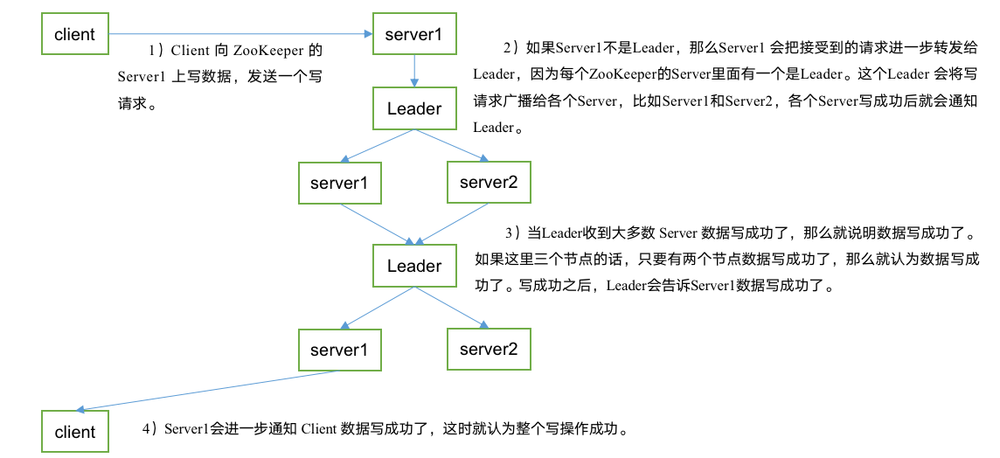

1）Client 向 ZooKeeper 的 Server1 上写数据，发送一个写请求。

2）如果Server1不是Leader，那么Server1 会把接受到的请求进一步转发给Leader，因为每个ZooKeeper的Server里面有一个是Leader。这个Leader 会将写请求广播给各个Server，比如Server1和Server2，各个Server写成功后就会通知Leader。

3）当Leader收到大多数 Server 数据写成功了，那么就说明数据写成功了。如果这里三个节点的话，只要有两个节点数据写成功了，那么就认为数据写成功了。写成功之后，Leader会告诉Server1数据写成功了。

### Zookeeper实战

集群配置参考尚硅谷文档

> ## 分布式安装部署
>
> 1．集群规划
>
> 在hadoop102、hadoop103和hadoop104三个节点上部署Zookeeper。
>
> 2．解压安装
>
> （1）解压Zookeeper安装包到/opt/module/目录下
>
> [atguigu@hadoop102 software]$ tar -zxvf zookeeper-3.4.10.tar.gz -C /opt/module/
>
> （2）同步/opt/module/zookeeper-3.4.10目录内容到hadoop103、hadoop104
>
> [atguigu@hadoop102 module]$ xsync zookeeper-3.4.10/
>
> 3．配置服务器编号
>
> （1）在/opt/module/zookeeper-3.4.10/这个目录下创建zkData
>
> [atguigu@hadoop102 zookeeper-3.4.10]$ mkdir -p zkData
>
> （2）在/opt/module/zookeeper-3.4.10/zkData目录下创建一个myid的文件
>
> [atguigu@hadoop102 zkData]$ touch myid
>
> 添加myid文件，注意一定要在linux里面创建，在notepad++里面很可能乱码
>
> （3）编辑myid文件
>
> [atguigu@hadoop102 zkData]$ vi myid
>
> ​	在文件中添加与server对应的编号：
>
> 2
>
> （4）拷贝配置好的zookeeper到其他机器上
>
> [atguigu@hadoop102 zkData]$ xsync myid
>
> 并分别在hadoop102、hadoop103上修改myid文件中内容为3、4
>
> 4．配置zoo.cfg文件
>
> （1）重命名/opt/module/zookeeper-3.4.10/conf这个目录下的zoo_sample.cfg为zoo.cfg
>
> [atguigu@hadoop102 conf]$ mv zoo_sample.cfg zoo.cfg
>
> （2）打开zoo.cfg文件
>
> [atguigu@hadoop102 conf]$ vim zoo.cfg
>
> 修改数据存储路径配置
>
> dataDir=/opt/module/zookeeper-3.4.10/zkData
>
> 增加如下配置
>
> \#######################cluster##########################
>
> server.2=hadoop102:2888:3888
>
> server.3=hadoop103:2888:3888
>
> server.4=hadoop104:2888:3888
>
> （3）同步zoo.cfg配置文件
>
> [atguigu@hadoop102 conf]$ xsync zoo.cfg
>
> （4）配置参数解读
>
> server.A=B:C:D。
>
> A是一个数字，表示这个是第几号服务器；
>
> 集群模式下配置一个文件myid，这个文件在dataDir目录下，这个文件里面有一个数据就是A的值，Zookeeper启动时读取此文件，拿到里面的数据与zoo.cfg里面的配置信息比较从而判断到底是哪个server。
>
> B是这个服务器的ip地址；
>
> C是这个服务器与集群中的Leader服务器交换信息的端口；
>
> D是万一集群中的Leader服务器挂了，需要一个端口来重新进行选举，选出一个新的Leader，而这个端口就是用来执行选举时服务器相互通信的端口。
>
> 4．集群操作
>
> （1）分别启动Zookeeper
>
> [atguigu@hadoop102 zookeeper-3.4.10]$ bin/zkServer.sh start
>
> [atguigu@hadoop103 zookeeper-3.4.10]$ bin/zkServer.sh start
>
> [atguigu@hadoop104 zookeeper-3.4.10]$ bin/zkServer.sh start
>
> （2）查看状态
>
> [atguigu@hadoop102 zookeeper-3.4.10]# bin/zkServer.sh status
>
> JMX enabled by default
>
> Using config: /opt/module/zookeeper-3.4.10/bin/../conf/zoo.cfg
>
> Mode: follower
>
> [atguigu@hadoop103 zookeeper-3.4.10]# bin/zkServer.sh status
>
> JMX enabled by default
>
> Using config: /opt/module/zookeeper-3.4.10/bin/../conf/zoo.cfg
>
> Mode: leader
>
> [atguigu@hadoop104 zookeeper-3.4.5]# bin/zkServer.sh status
>
> JMX enabled by default
>
> Using config: /opt/module/zookeeper-3.4.10/bin/../conf/zoo.cfg
>
> Mode: follower


|   命令基本语法   |                           功能描述                           |
| :--------------: | :----------------------------------------------------------: |
|       help       |                       显示所有操作命令                       |
| ls path [watch]  |     使用 ls 命令来查看/监听当前znode中所包含的内容的变化     |
| ls2 path [watch] |            查看当前节点数据并能看到更新次数等数据            |
|      create      | 普通创建-s  含有序列-e  临时（重启或者超时消失），不加任何参数就是创建持久结点 |
| get path [watch] |                      监听/获得节点的值                       |
|       set        |                    设置/修改节点的具体值                     |
|       stat       |                         查看节点状态                         |
|      delete      |                           删除节点                           |
|       rmr        |                         递归删除节点                         |

#### API应用

这里使用单机模式：

pom.xml

```xml
    <dependencies>
        <dependency>
            <groupId>junit</groupId>
            <artifactId>junit</artifactId>
            <version>RELEASE</version>
        </dependency>
        <dependency>
            <groupId>org.apache.logging.log4j</groupId>
            <artifactId>log4j-core</artifactId>
            <version>2.8.2</version>
        </dependency>
        <!-- https://mvnrepository.com/artifact/org.apache.zookeeper/zookeeper -->
        <dependency>
            <groupId>org.apache.zookeeper</groupId>
            <artifactId>zookeeper</artifactId>
            <version>3.4.5</version>
        </dependency>
    </dependencies>
```

log4j.properties:

```log
log4j.rootLogger=INFO, stdout
log4j.appender.stdout=org.apache.log4j.ConsoleAppender
log4j.appender.stdout.layout=org.apache.log4j.PatternLayout
log4j.appender.stdout.layout.ConversionPattern=%d %p [%c] - %m%n
log4j.appender.logfile=org.apache.log4j.FileAppender
log4j.appender.logfile.File=target/spring.log
log4j.appender.logfile.layout=org.apache.log4j.PatternLayout
log4j.appender.logfile.layout.ConversionPattern=%d %p [%c] - %m%n

```

```java
public class TeskZookeeper {
    private static String connectString = "localhost:2181";
    // 会话超时时间 2s
    private static int sessionTimeout = 2000;
    private ZooKeeper zkClient = null;

    @Test
    public void init() throws IOException {
        new ZooKeeper(connectString, sessionTimeout, new Watcher() {

            public void process(WatchedEvent event) {

            }
        });
    }
}
```

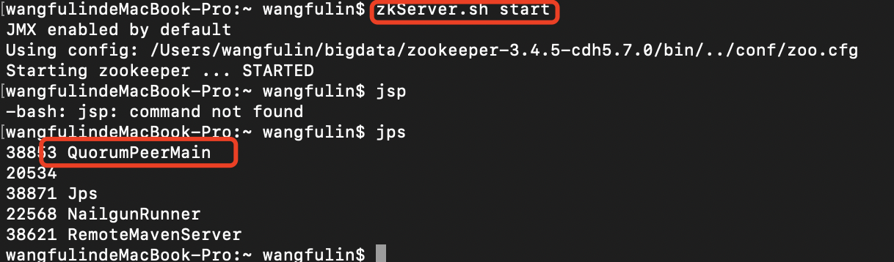

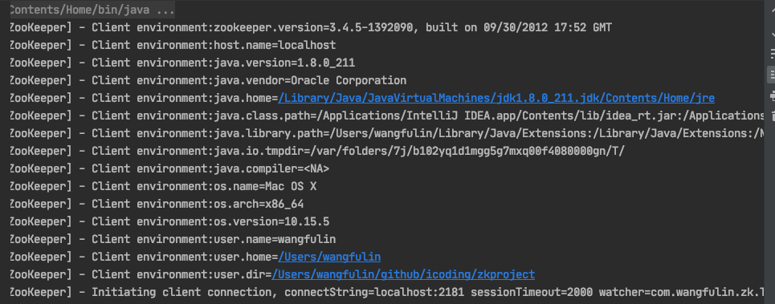


```java
public class TeskZookeeper {
    private static String connectString = "127.0.0.1:2181";
    // 会话超时时间 2s
    private static int sessionTimeout = 2000;
    private ZooKeeper zkClient = null;

    @Before
    public void init() throws IOException {
        new ZooKeeper(connectString, sessionTimeout, new Watcher() {

            public void process(WatchedEvent event) {
                System.out.println("---------start----------");
                List<String> children;
                try {
                    children = zkClient.getChildren("/", true);

                    for (String child : children) {
                        System.out.println(child);
                    }
                    System.out.println("---------end----------");
                } catch (KeeperException e) {
                    // TODO Auto-generated catch block
                    e.printStackTrace();
                } catch (InterruptedException e) {
                    // TODO Auto-generated catch block
                    e.printStackTrace();
                }

            }
        });
    }

    @Test
    public void createNode() throws KeeperException, InterruptedException {
        // 参数1：要创建的节点的路径； 参数2：节点数据 ； 参数3：节点权限 ；参数4：节点的类型
        String nodeCreated = zkClient.create("/wangfulin", "hello".getBytes(),
                Ids.OPEN_ACL_UNSAFE, CreateMode.PERSISTENT);

        System.out.println(nodeCreated);
    }

    // 2 获取子节点 并监控节点的变化
    @Test
    public void getDataAndWatch() throws KeeperException, InterruptedException {

        List<String> children = zkClient.getChildren("/", true);

        for (String child : children) {
            System.out.println(child);
        }

        Thread.sleep(Long.MAX_VALUE);
    }

    // 3 判断节点是否存在
    @Test
    public void exist() throws KeeperException, InterruptedException {

        Stat stat = zkClient.exists("/wangfulin", false);

        System.out.println(stat == null ? "not exist" : "exist");
    }
}

```

### 监听服务器节点动态上下线案例

​		某分布式系统中，主节点可以有多台，可以动态上下线，任意一台客户端都能实时感知到主节点服务器的上下线。

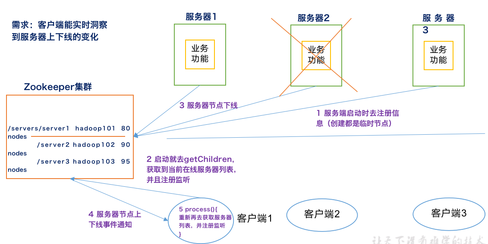

```java
public class DistributeServer {
    private String connectString = "localhost:2181";
    private int sessionTimeout = 2000;
    private ZooKeeper zkClient;

    public static void main(String[] args) throws Exception {

        DistributeServer server = new DistributeServer();

        // 1 连接zookeeper集群
        server.getConnect();

        // 2 注册节点
        server.regist(args[0]);

        // 3 业务逻辑处理
        server.business();
    }

    private void business() throws InterruptedException {
        Thread.sleep(Long.MAX_VALUE);
    }

    // -e -s 类型 带序号且临时的
    private void regist(String hostname) throws KeeperException, InterruptedException {
        String path = zkClient.create("/servers/server", hostname.getBytes(),
                ZooDefs.Ids.OPEN_ACL_UNSAFE, CreateMode.EPHEMERAL_SEQUENTIAL);

        System.out.println(hostname + "is online ");
    }

    private void getConnect() throws IOException {
        zkClient = new ZooKeeper(connectString, sessionTimeout, new Watcher() {

            public void process(WatchedEvent event) {
                // TODO Auto-generated method stub

            }
        });
    }

}

```

```java
public class DistributeClient {
    private String connectString = "localhost:2181";
    private int sessionTimeout = 2000;
    private ZooKeeper zkClient;

    public static void main(String[] args) throws IOException, KeeperException, InterruptedException {

        DistributeClient client = new DistributeClient();

        // 1 获取zookeeper集群连接
        client.getConnect();

        // 2 注册监听
        client.getChlidren();

        // 3 业务逻辑处理
        client.business();

    }

    private void business() throws InterruptedException {
        Thread.sleep(Long.MAX_VALUE);
    }

    // 获取子结点
    private void getChlidren() throws KeeperException, InterruptedException {
        // server1 server2 server3
        List<String> children = zkClient.getChildren("/servers", true);

        // 用集合 存储服务器节点主机名称
        ArrayList<String> hosts = new ArrayList<String>();

        for (String child : children) {

            byte[] data = zkClient.getData("/servers/" + child, false, null);

            hosts.add(new String(data));
        }

        // 将所有在线主机名称打印到控制台
        System.out.println(hosts);
    }


    private void getConnect() throws IOException {
        zkClient = new ZooKeeper(connectString, sessionTimeout, new Watcher() {

            // 监听 不断死循环 Watcher里面的process，因此要把 getChlidren写在Watcher里面
   
            public void process(WatchedEvent event) {

                try {
                    getChlidren();
                } catch (KeeperException e) {
                    e.printStackTrace();
                } catch (InterruptedException e) {
                    e.printStackTrace();
                }
            }
        });
    }
}
```


### 企业面试真题

请简述ZooKeeper的选举机制

ZooKeeper的监听原理是什么？

ZooKeeper的部署方式有哪几种？集群中的角色有哪些？集群最少需要几台机器？

（1）部署方式单机模式、集群模式

（2）角色：Leader和Follower

（3）集群最少需要机器数：3

ZooKeeper的常用命令

ls create get delete set…