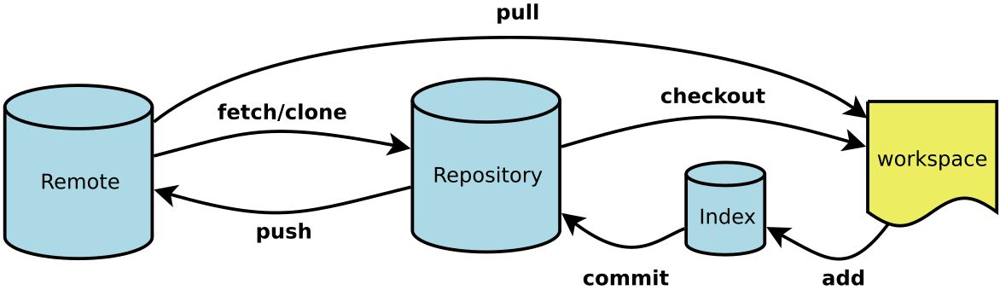

# git命令

[toc]



- Workspace：工作区
- Index / Stage：暂存区
- Repository：仓库区（或本地仓库）
- Remote：远程仓库

## 代码本地仓库

### 创建本地仓库

- 1、进入需要创建代码库的文件夹

  ```bash
  # 在当前目录新建一个Git代码库
  $ cd 文件路径
  ```

- 2、创建/初始化仓库

  ```bash
  # 新建一个目录，将其初始化为Git代码库
  $ git init [project-name]
  # 也可以在目录文件夹下面直接使用git init
  ```

- 3、拉取远程仓库到本地

  ```bash
  # 下载一个项目和它的整个代码历史
  $ git clone [url]
  ```

- 建议使用git clone

### 添加文件到仓库

- 1、添加文件到暂存区

  ```bash
  # 添加指定文件到暂存区
  $ git add [file1] [file2] ...
  
  # 添加指定目录到暂存区，包括子目录
  $ git add [dir]
  
  # 添加当前目录的所有文件到暂存区
  $ git add .
  
  # 添加每个变化前，都会要求确认
  # 对于同一个文件的多处变化，可以实现分次提交
  $ git add -p
  
  # 删除工作区文件，并且将这次删除放入暂存区
  $ git rm [file1] [file2] ...
  
  # 停止追踪指定文件，但该文件会保留在工作区
  $ git rm --cached [file]
  
  # 改名文件，并且将这个改名放入暂存区
  $ git mv [file-original] [file-renamed]
  ```

- 2、提交到本地仓库

  ```bash
  # 提交暂存区到仓库区
  $ git commit -m [message]
  
  # 提交暂存区的指定文件到仓库区
  $ git commit [file1] [file2] ... -m [message]
  
  # 提交工作区自上次commit之后的变化，直接到仓库区
  $ git commit -a
  
  # 提交时显示所有diff信息
  $ git commit -v
  
  # 使用一次新的commit，替代上一次提交
  # 如果代码没有任何新变化，则用来改写上一次commit的提交信息
  $ git commit --amend -m [message]
  
  # 重做上一次commit，并包括指定文件的新变化
  $ git commit --amend [file1] [file2] ...
  ```

  - 填写commit message
  - 保存

  - 不建议使用git commit -m "commit message"
  - 建议提交遵循commit message规范

  补充:

  [git commit 规范工具](https://blog.csdn.net/zhaileilei1/article/details/83186047?depth_1-utm_source=distribute.pc_relevant.none-task-blog-BlogCommendFromBaidu-2&utm_source=distribute.pc_relevant.none-task-blog-BlogCommendFromBaidu-2)

### 仓库配置

​	Git的设置文件为`.gitconfig`，它可以在用户主目录下（全局配置），也可以在项目目录下（项目配置）。

```bash
# 显示当前的Git配置

$ git config --list

# 编辑Git配置文件

$ git config -e [--global]
```

- 1、配置全局用户名和邮箱

  ```bash
  
  $ git config --global user.name "[name]"
  
  比如：git config --global user.name "yousali"
  
  $ git config --global user.email "[email address]"
  
  例如：git config --global user.email "103xxxxx@qq.com"
  ```

  若是个人开发机可以这样配置，若是公共编译机则不能这样配置

- 2、配置当前仓库用户名和邮箱

  ```bash
  $ git config user.name "[name]"
  
  $ git config user.email "[email address]"
  ```

## 代码版本/提交切换

### 查看过去版本/提交

```bash
# 显示有变更的文件
$ git status

# 显示当前分支的版本历史
$ git log

# 显示commit历史，以及每次commit发生变更的文件
$ git log --stat

# 搜索提交历史，根据关键词
$ git log -S [keyword]

# 显示某个commit之后的所有变动，每个commit占据一行
$ git log [tag] HEAD --pretty=format:%s

# 显示某个commit之后的所有变动，其"提交说明"必须符合搜索条件
$ git log [tag] HEAD --grep feature

# 显示某个文件的版本历史，包括文件改名
$ git log --follow [file]
$ git whatchanged [file]

# 显示指定文件相关的每一次diff
$ git log -p [file]

# 显示过去5次提交
$ git log -5 --pretty --oneline

# 显示所有提交过的用户，按提交次数排序
$ git shortlog -sn

# 显示指定文件是什么人在什么时间修改过
$ git blame [file]

# 显示暂存区和工作区的差异
$ git diff

# 显示暂存区和上一个commit的差异
$ git diff --cached [file]

# 显示工作区与当前分支最新commit之间的差异
$ git diff HEAD

# 显示两次提交之间的差异
$ git diff [first-branch]...[second-branch]

# 显示今天你写了多少行代码
$ git diff --shortstat "@{0 day ago}"

# 显示某次提交的元数据和内容变化
$ git show [commit]

# 显示某次提交发生变化的文件
$ git show --name-only [commit]

# 显示某次提交时，某个文件的内容
$ git show [commit]:[filename]

# 显示当前分支的最近几次提交
$ git reflog
```

### 回退版本/提交

```bash
# 恢复暂存区的指定文件到工作区
$ git checkout [file]

# 恢复某个commit的指定文件到暂存区和工作区
$ git checkout [commit] [file]

# 恢复暂存区的所有文件到工作区
$ git checkout .

# 重置暂存区的指定文件，与上一次commit保持一致，但工作区不变
$ git reset [file]

# 重置暂存区与工作区，与上一次commit保持一致
$ git reset --hard

# 回退到当前最新提交
$ git reset --hard HEAD

# 回退到上次提交
$ git reset --hard HEAD^

# 回退到上n次提交
$ git reset --hard HEAD~n

# 重置当前分支的指针为指定commit，同时重置暂存区，但工作区不变
$ git reset [commit]

# 重置当前分支的HEAD为指定commit，同时重置暂存区和工作区，与指定commit一致
$ git reset --hard [commit]

# 重置当前HEAD为指定commit，但保持暂存区和工作区不变
$ git reset --keep [commit]

# 新建一个commit，用来撤销指定commit
# 后者的所有变化都将被前者抵消，并且应用到当前分支
$ git revert [commit]

# 暂时将未提交的变化移除，稍后再移入
$ git stash
$ git stash pop
```

### 重返未来版本

- 1、查看历史提交以及被回退的提交

  ```bash
  $ git reflog             #注意：该记录有时限，且只在本地
  ```

- 2、回到未来版本

  ```bash
  $ git reset --hard commitid
  ```

### 撤销修改

```bash
# 恢复暂存区的指定文件到工作区 没有提交到暂存区
$ git checkout [file]

# 恢复某个commit的指定文件到暂存区和工作区
$ git checkout [commit] [file]

# 恢复暂存区的所有文件到工作区
$ git checkout .

# 撤销修改
$ git checkout 文件名

# 重置暂存区的指定文件，与上一次commit保持一致，但工作区不变
$ git reset [file]

# 重置暂存区与工作区，与上一次commit保持一致
$ git reset --hard

# 将暂存区文件撤销到工作区 不带--hard
$ git reset HEAD 文件

# 重置当前分支的指针为指定commit，同时重置暂存区，但工作区不变
$ git reset [commit]

# 重置当前分支的HEAD为指定commit，同时重置暂存区和工作区，与指定commit一致
$ git reset --hard [commit]

# 重置当前HEAD为指定commit，但保持暂存区和工作区不变
$ git reset --keep [commit]

# 新建一个commit，用来撤销指定commit
# 后者的所有变化都将被前者抵消，并且应用到当前分支
$ git revert [commit]

# 暂时将未提交的变化移除，稍后再移入
$ git stash
$ git stash pop
```


### 删除文件

```bash
# 删除文件
从版本库中删除文件

$ git rm 文件名

# 修改后需要提交
# 恢复删除
# 参考撤销修改

#从版本库中删除文件，但是本地不删除该文件
$ git rm --cached 文件名
```


### 重命名文件

```bash
# 将文件重命名

$ git mv

# 将文件夹重命名

$ git mv
```

### 暂存修改

- 参照分支-暂存修改

### 忽略文件

- 通过git仓库下的.gitignore文件屏蔽某些中间文件/生成文件

### 注意：这里的版本均为本地仓库版本

## 分支

### 创建与合并分支

```bash
# 列出所有本地分支
$ git branch

# 列出所有远程分支
$ git branch -r

# 列出所有本地分支和远程分支
$ git branch -a

# 新建一个分支，但依然停留在当前分支
$ git branch [branch-name]

# 新建一个分支，并切换到该分支
$ git checkout -b [branch]

# 新建一个分支，指向指定commit
$ git branch [branch] [commit]

# 新建一个分支，与指定的远程分支建立追踪关系
$ git branch --track [branch] [remote-branch]

# 切换到指定分支，并更新工作区
$ git checkout [branch-name]

# 切换到上一个分支
$ git checkout -

# 建立追踪关系，在现有分支与指定的远程分支之间
$ git branch --set-upstream [branch] [remote-branch]

# 合并指定分支到当前分支
$ git merge [branch]

# 选择一个commit，合并进当前分支
$ git cherry-pick [commit]

# 删除本地分支

# 删除未合并分支
$ git branch -D [branch-name]
# 删除已合并分支
$ git branch -d [branch-name]

# 删除远程分支
$ git push origin --delete [branch-name]
$ git branch -dr [remote/branch]

# 合并分支，解决分支冲突

- 将要合并的分支更新到最新
- 切换到主分支
- 合并分支
- 解决合并时的conflict
- 提交到版本库
- 合并成功
- 查看分支状态

  $ git log --graph
  $ git log --graph --pretty=oneline --abbrey-commit
```

### 暂存修改

```bash
# 1、暂存工作现场

$ git stash

# 2、恢复工作现场

# 恢复

$ git stash apply

# 删除

$ git stash drop

# 恢复+删除

$ git stash pop
```


### 多人协作

```bash
# 下载远程仓库的所有变动
$ git fetch [remote]

# 显示所有远程仓库 详细
$ git remote -v

# 显示所有远程仓库 不详细
$ git remote -v

# 显示某个远程仓库的信息
$ git remote show [remote]

# 增加一个新的远程仓库，并命名
$ git remote add [shortname] [url]

# git pull可以认为是 git fetch+git merge
# 取回远程仓库的变化，并与本地分支合并
$ git pull [remote] [branch]

# 将本地修改推送到远程库
$ git push origin 分支名

# 上传本地指定分支到远程仓库
$ git push [remote] [branch]

# 强行推送当前分支到远程仓库，即使有冲突
$ git push [remote] --force

# 推送所有分支到远程仓库
$ git push [remote] --all

# 本地分支与远程分支交互
# 使用远程分支A创建本地分支  origin是远程仓库名，若名字一样origin/A可以省略
$ git checkout -b A origin/A

# 将本地分支与远程分支作关联
$ git branch --set-upstream A origin/A
```


### 代码版本tag

tag与branch的操作基本一致，因为tag就是一个仅可读的branch

```bash
# 列出本地tag
$ git tag

# 列出远程tag
$ git tag -r

# 新建一个tag在当前commit
$ git tag [tag]

# 新建一个tag在指定commit
$ git tag [tag] [commit]

# 删除本地tag
$ git tag -d [tag]

# 删除远程tag
$ git push origin :refs/tags/[tagName]

# 删除远程标签

- git push origin -d 标签名

# 查看tag信息
$ git show [tag]

# 提交指定tag
$ git push [remote] [tag]

# 提交所有tag
$ git push [remote] --tags

# 推送到远端仓库

$ git push origin 标签名
# 推送所有未提交的tag

$ git push origin --tags

更新到本地

$ git pull origin --tags

# 新建一个分支，指向某个tag
$ git checkout -b [branch] [tag]
```


## git常用命令

### git log

查看日志，常规操作，必备

```git
# 输出概要日志,这条命令等同于

# git log --pretty=oneline --abbrev-commit

git log --oneline

# 指定最近几个提交可以带上 - + 数字

git log --oneline -5

# 提供类似 GUI 工具的 log 展示

git log --graph --date=relative --pretty=tformat:'%Cred%h%Creset -%C(auto)%d%Creset %s %Cgreen(%an %ad)%Creset'
```


### git status

查看工作区状态

```bash
# 等同 git status --long,查看当前工作区暂存区变动

git status

# 概要信息 (--short)

git status -s

# 查询工作区中是否有stash存在（暂存的东西）,有则提醒该工作区有几个 stash

git status  --show-stash
```

### git checkout

用来切换到对应记录的,可以基于分支,提交,标签。

切提交和标签一般用来热修复或者老版本需要加新特性。

```bash
# 分支切换

git checkout dev # local branch

# 切换远程分支

git checkout origin/test # remote branch

# 基于远程分支创建本地分支，并跟踪对应来自 'origin' 的远程分支

git checkout --track origin/feature-test # new local branch wih remote branch

# 基于本地分支开出新分支

git checkout -b testbranch # new local branch with current branch

# 彻底丢弃某个文件的改动

git checkout -- file

# 放弃本地所有改动

git checkout .

# 切换上一个分支

git checkout -
```

### git commit

天天打交道的命令，这里说一些很常见的姿势

```bash
# 新修改的内容,添加到上次提交中,减少提交的日志
# --no-edit:是跳过进入编辑器，直接提交
# git commit --amend这条命令等同于
# $ git reset --soft HEAD^
# $ ... do something  tree ...
# $ git commit -c ORIG_HEAD
git commit --amend --no-edit

# 跳过校验直接提交,包括任何 githooks
git commit --no-verify -m "xxx"

# 带提交概要信息
git commit -m "xxx"

# 指定目录格式提交
# -t <file>, --template=<file>
# 也可以从全局或者项目级别指定提交的模板文件
# git config [--global] commit.template xxx
# 现在一般都是 用社区的npm规范包，commitizen 和 commitlint 来规范提交
git commit -t templateFile

# 提交信息从文件读取,可以结合上面的一起用
git commit -F
复制代码
```


### git reset

不得不说，代码回滚中这个命令也是用的很多，而且是 `--hard`

```bash
# 硬性回滚,简单粗暴，直接抛弃回滚之后改动(log 还是有保留，内容不要而已)
git reset --hard commit_sha1

# 软性回滚, 跟 rebase 常规用法差不多的效果，可以把提交的东西丢回暂存区和工作区，
# HEAD 的指向改变会对应的 commit,之后再考虑怎么 commit
git reset --soft commit_sha1

# 软回滚一个版本,可以理解为撤销最近一次的 commit
git reset --soft HEAD~1

# 清除暂存区但保留工作区变动。
git reset --mixed commit_sha1

# 保留工作区和暂存区之间的差异。
git reset --merge commit_sha1

# 保留工作区和HEAD之间的差异
git reset --keep commit_sha1

复制代码
```


### git revert

一般用于master 的代码回滚，因为多人在上面协作，

`revert` 可以平稳的回滚代码,但却保留提交记录,不会让协作的人各种冲突！

```bash
# 回滚到某个 commit
git revert commit-sha1
复制代码
```


### git rebase

变基在项目中算是很频繁的，为什么这么说。

比如你开发一个新的 feature, 遵循最小化代码提交的理念。

在整个功能开发完毕的时侯，会有非常多的 commit，用 `rebase` 可以让我们的commit记录很干净

```bash
# 带 -i 可以进入交互模式，效果如下
git rebase -i git-sha1|branch(HEAD)

# 若是中间毫无冲突，变基则一步到位，否则需要逐步调整。
git rebase --continue # 提交变更后继续变基下一步
git rebase --skip # 引起冲突的commits会被丢弃，continue提示没有需要改动的也可以用这个跳过
git rebase --abort # 若是变基改残废了，但是走到一半，可以彻底回滚变基之前的状态
```

pick: 是保留该 commit(采用)

edit: 一般你提交的东西多了,可以用这个把东东拿回工作区拆分更细的 commit

reword: 这个可以重新修改你的 commit msg

squash: 内容保留，把提交信息往上一个 commit 合并进去

fixup: 保留变动内容，但是抛弃 commit msg

drop: 用的比较少，无用的改动你会提交么！！！

### git merge

```
# --ff 是指fast-forward命令,当使用ff模式进行合并时，将不会创造一个新的commit节点。
# --no-ff,保留合并分支的提交记录,一般主干用的比较多.
# --ff-only 除非当前HEAD节点为最新节点或者能够用ff模式进行合并，否则拒绝合并并返回一个失败状态。
# --squash 则类似 rebase squash,可以把合并多个 commit 变成一个
git merge --no-ff branchName
复制代码
```


### git pull

`git pull`中用的最多是带`--rebase(-r)`的方式(变基形式拉取合并代码),保持分支一条线。

默认的`pull`会走`ff`模式,多数情况会产生新的commit,部分参数与 `merge`提供一致。


### git push

当本地分支存在，远程分支不存在的时侯，可以这样推送关联的远程分支

```bash
# 这样会直接新建一个同名的远程分支
git push origin localbranch 


# 删除远程分支(--delete)
git push -d origin branchName

# 推送所有标签
git push --tags

# 推送 commit 关联的 tags
git push --follow-tags

# 强制推送(--force)
git push -f origin branchName # 一般合理的项目，主干都做了分支保护,不会允许强推行为

# 有时候真的需要强推的时侯,但可不可以柔和一点呢？
# 就是当前远程分支和你本地一致,没有别人提交的情况下可以强推
# --force-with-lease: 若是远程有人提交，此次强推失败，反之成功
git push --force-with-lease
复制代码
```


### git remote

这个东西用在你需要考虑维护多个地方仓库的时侯会考虑，或者修改仓库源的时侯

```bash
# 常规关联本地 git init 到远程仓库的姿势
git remote add origin url

# 新增其他上游仓
git remote add github url

# 修改推送源
git remote set-url  origin(或者其他上游域) url
复制代码
```


### git branch

该命令用的最多的就是删除本地分支，重命名分支，删除远程分支了

```bash
# 分支删除，拷贝，重命名，参数若是大写就等同多了--force，强制执行
# -c, --copy : 复制分支，
# -C：等同于 --copy --force
# -d, --delete: 删除分支
# -m, --move：移动或者重命名分支
git branch -d branchName
git branch -M oldBranch newNameBranch


# 手动指定它的当前分支的上游分支,两个写法一致的
# 有关联一般也有取消关联，--unset-upstream
git branch --set-upstream-to=origin/xxx 
git branch --set-upstream-to origin xxx 

复制代码
```


### git stash

暂存用的最多时侯就是你撸代码撸到一半，突然说有个紧急 BUG 要修正。

或者别人在你这里需要帮忙排查代码，你这时候也会用到。

强烈建议给每个 `stash` 添加描述信息！！！

```bash
# 缓存当前工作区的内容到stashName, save 这个现在不怎么推荐用，图方便也能用
# -a|--all: 除了未跟踪的文件，其他变动的文件都会保存
# -u|--include-untracked：包括没有添加到暂存区的文件
git stash save stashName
git stash -u save stashName

# 现在基本推荐用 push,因为有 pop，语义上和维护上更清晰
# 上面有的参数，它也有，还有-m 来备注这个 stash 的大概情况
git stash push -m "更改了 xx" 

# 有保存那肯定也有取用的
# pop: 取会删除对应的保存记录
# apply: 取但保留记录
# 0就是--index,这个东西哪里来的呢？
git stash apply stash@{0}
git stash pop stash@{0}

# 查看stash 保存记录
# eg: stash@{0}: On dev: 测试
git stash list


# 只想删除暂存记录怎么办：
# clear : 清空所有 stash
# drop: 清除指定的 stash
git stash clear # 慎用！
git stash drop stash@{0}

# 想看 stash 做了什么改动，类似简化版的git diff
git stash show stash@{0}
复制代码
```


### git reflog

这个命令的强大之处，是记录了所有行为，包括你 `rebase,merge, reset` 这些

当我们不小心硬回滚的时侯,或变基错了都可以在这里找到行为之前的commit，然后回滚。

当然这个时间回溯也只在本地有用，你推送到远程分支的破坏性改动,该凉还是得凉。

```bash
# 最近五次行为,不带-n 则默认所有
git reflog -5
复制代码
```


### git cherry-pick

这个东西你可以理解为你去买橘子，你会专门挑一些符合心意的橘子放到购物篮中。

你可以从多个分支同时挑取部分需要的 commit 合并到同一个地方去，是不是贼骚。

这货和变基有点类似，但是仅仅类似，挑过来的 commit 若是没有冲突则追加。

有冲突会中断，解决后 `--continue`

```bash
# 在当前分支挑其他分支的 commit，把那部分的变动那过来
git cherry-pick commit-sha1

# 支持一次性拿多个
git cherry-pick master~4 master~2

# 支持区间, 区间中间是 .. 
git cherry-pick startGitSha1..endGitSha1

# --continue：继续 pick,一般有冲突解决后才需要这样
# --skip：跳过这次进入队列下一次行为 
# --abort : 完全放弃 pick，恢复 pick 之前的状态
# --quit: 未冲突的自动变更，冲突的不要，退出这次 pick
# 这几个状态跟变基差不多,解决冲突继续，跳过处理，放弃这次pick,不输出错误
复制代码
```


### git rm

这个命令在旧的版本用的比较最多的姿势是为了重新索引.gitignore 的范围

```bash
# 删除某个文件的索引
# --cache 不会删除硬盘中的文件，只是 git 索引(缓存)的关系！！！
git rm --cache -- file

# 递归清除全部所有索引(也可以理解为缓存吧),这个姿势适合重新让.gitignore 新范围生效
git rm -r --cached .  
git add .
git commit -m "xxx"
复制代码
```


### git rev-parse

这个估计一般人用的不是很多，可以通过这个快速获取部分git 仓库的信息

我在弄脚本的时侯就会从这里拿东西

```bash
# 获取最新有效的commit
# --short：显示七位的 sha1,不带就是全部
# --verify: 校验是否有效commit
# HEAD: 当前分支的head 指向
git rev-parse --short HEAD --verify

# 显示仓库的绝对路径
git rev-parse --show-toplevel #eg: /Users/linqunhe/Code/aozhe/thinking-ui

# 显示版本库.git 目录所在的位置
git rev-parse --git-dir

# 显示所有关联引用的 git sha1
git rev-parse --all
复制代码
```

### git diff

对于这个命令，在终端比对用的不是很频繁，除了少量改动的时侯可能会用这个看看。

其他情况下我更倾向于用 GUI 工具来看，因为比对更加直观。


---------

参考：

[高频使用的 Git 命令](https://juejin.im/post/5de8d849e51d455808332166)

[git思维导图](https://www.processon.com/view/link/5c6e2755e4b03334b523ffc3#map)

[阮一峰的网络日志：常用 Git 命令清单](http://www.ruanyifeng.com/blog/2015/12/git-cheat-sheet.html)

