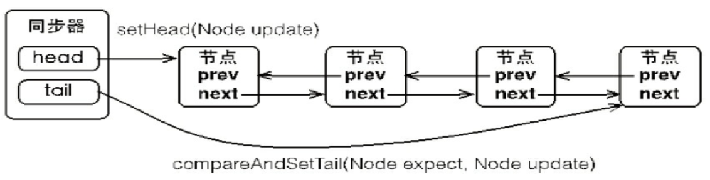
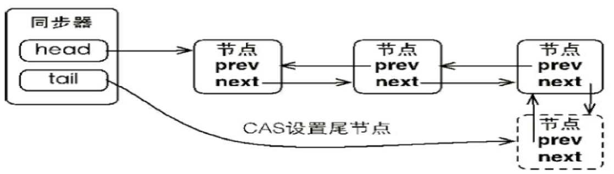
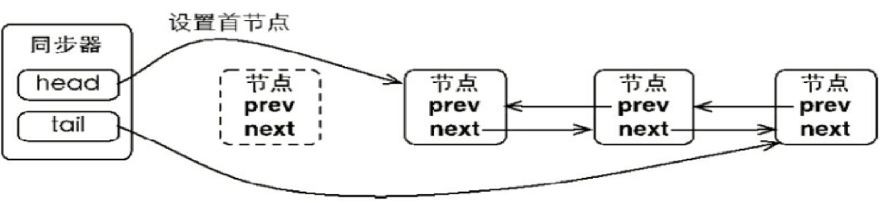
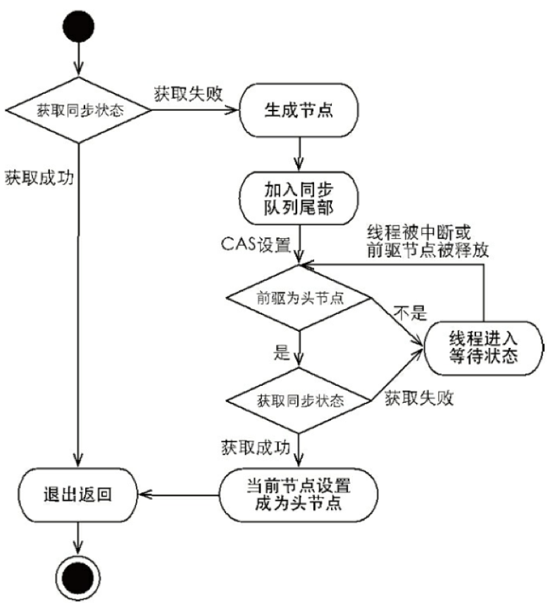
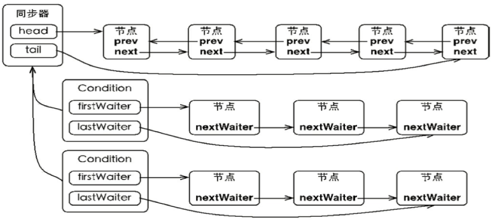
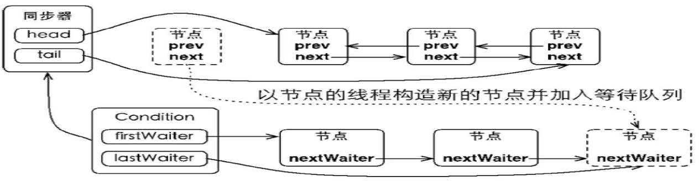
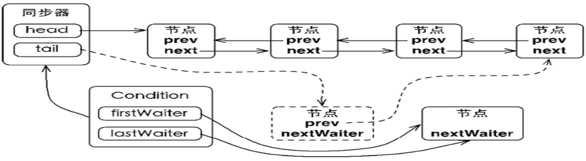
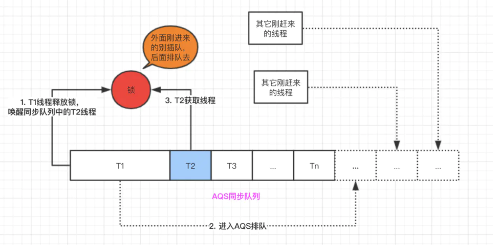
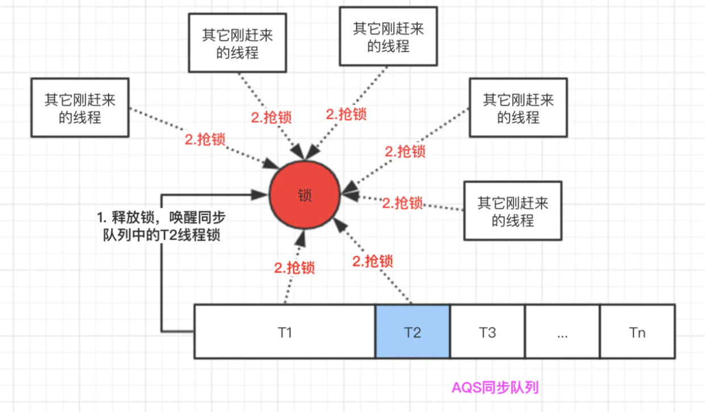

# 显式锁和AQS  

[toc]

## 显式锁

### Lock接口和核心方法

 lock()  

unlock()

tryLock()

### Lock接口和synchronized的比较

synchronized代码简洁，Lock：获取锁可以被中断，超时获取锁，尝试获取锁，读多写少用读写锁

```JAVA
public class BusiApp {
    static final int readWriteRatio = 10;//读写线程的比例
    static final int minthreadCount = 3;//最少线程数
    //static CountDownLatch latch= new CountDownLatch(1);

    //读操作
    private static class GetThread implements Runnable {

        private GoodsService goodsService;

        public GetThread(GoodsService goodsService) {
            this.goodsService = goodsService;
        }

        @Override
        public void run() {
//            try {
//                latch.await();//让读写线程同时运行
//            } catch (InterruptedException e) {
//            }
            long start = System.currentTimeMillis();
            for (int i = 0; i < 100; i++) {//操作100次
                goodsService.getNum();
            }
            System.out.println(Thread.currentThread().getName() + "读取商品数据耗时："
                    + (System.currentTimeMillis() - start) + "ms");

        }
    }

    //写操做
    private static class SetThread implements Runnable {

        private GoodsService goodsService;

        public SetThread(GoodsService goodsService) {
            this.goodsService = goodsService;
        }

        @Override
        public void run() {
//            try {
//                latch.await();//让读写线程同时运行
//            } catch (InterruptedException e) {
//            }
            long start = System.currentTimeMillis();
            Random r = new Random();
            for (int i = 0; i < 10; i++) {//操作10次
                SleepTools.ms(50);
                goodsService.setNum(r.nextInt(10));
            }
            System.out.println(Thread.currentThread().getName()
                    + "写商品数据耗时：" + (System.currentTimeMillis() - start) + "ms---------");

        }
    }

    public static void main(String[] args) throws InterruptedException {
        GoodsInfo goodsInfo = new GoodsInfo("Cup", 100000, 10000);
        GoodsService goodsService = new UseRwLock(goodsInfo);//new UseSyn(goodsInfo);
        for (int i = 0; i < minthreadCount; i++) {
            Thread setT = new Thread(new SetThread(goodsService));
            for (int j = 0; j < readWriteRatio; j++) {
                Thread getT = new Thread(new GetThread(goodsService));
                getT.start();
            }
            SleepTools.ms(100);
            setT.start();
        }
        //latch.countDown();
    }
}
```

```JAVA
public class UseRwLock implements GoodsService{

    private GoodsInfo goodsInfo;
    private final ReadWriteLock lock = new ReentrantReadWriteLock();
    private final Lock getLock = lock.readLock();//读锁
    private final Lock setLock = lock.writeLock();//写锁

    public UseRwLock(GoodsInfo goodsInfo) {
        this.goodsInfo = goodsInfo;
    }

    @Override
    public GoodsInfo getNum() {
        getLock.lock();
        try {
            SleepTools.ms(5);
            return this.goodsInfo;
        }finally {
            getLock.unlock();
        }

    }

    @Override
    public void setNum(int number) {
        setLock.lock();
        try {
            SleepTools.ms(5);
            goodsInfo.changeNumber(number);
        }finally {
            setLock.unlock();
        }
    }
}
```

```java
public class UseSyn implements GoodsService {

    private GoodsInfo goodsInfo;

    public UseSyn(GoodsInfo goodsInfo) {
        this.goodsInfo = goodsInfo;
    }

    @Override
    public synchronized GoodsInfo getNum() {
        SleepTools.ms(5);
        return this.goodsInfo;
    }

    @Override
    public synchronized void setNum(int number) {
        SleepTools.ms(5);
        goodsInfo.changeNumber(number);

    }
}
```

### 可重入锁ReentrantLock、所谓锁的公平和非公平

如果在时间上，**先对锁进行获取的请求，一定先被满足，这个锁就是公平的**，不满足，就是非公平的

非公平的效率一般来讲更高：因为利用了线程挂起到运行的这段时间

### ReadWriteLock接口和读写锁ReentrantReadWriteLock

- ReentrantLock和Syn关键字，都是排他锁，同一时刻，仅运行一个线程获取锁

- 读写锁：同一时刻允许多个读线程同时访问，但是写线程访问的时候，所有的读和写都被阻塞，**最适宜与读多写少的情况**。读的时候不锁，写的时候，读写都锁住。因此读锁不能升级为写锁，但是写锁可以降级为读锁。

ReentrantReadWriteLock实现了ReadWriteLock，同时ReentrantReadWriteLock内部的读锁和写锁，都分别实现了Lock接口。

### Condition接口

Condition 建议使用signal()唤醒。一个Lock支持多个Condition

 用Lock和Condition实现等待通知

```JAVA
public class ExpressCond {
    public final static String CITY = "ShangHai";
    private int km;/*快递运输里程数*/
    private String site;/*快递到达地点*/
    private Lock lock = new ReentrantLock();
    private Condition keCond = lock.newCondition();
    private Condition siteCond = lock.newCondition();

    public ExpressCond() {
    }

    public ExpressCond(int km, String site) {
        this.km = km;
        this.site = site;
    }

    /* 变化公里数，然后通知处于wait状态并需要处理公里数的线程进行业务处理*/
    public void changeKm() {
        lock.lock();
        try {
            this.km = 101;
            keCond.signal();
        } finally {
            lock.unlock();
        }
    }

    /* 变化地点，然后通知处于wait状态并需要处理地点的线程进行业务处理*/
    public void changeSite() {
        lock.lock();
        try {
            this.site = "BeiJing";
            siteCond.signal();
        } finally {
            lock.unlock();
        }
    }

    /*当快递的里程数大于100时更新数据库*/
    public void waitKm() {
        lock.lock();
        try {
            while (this.km <= 100) {
                try {
                    keCond.await();
                    System.out.println("check km thread[" + Thread.currentThread().getId()
                            + "] is be notifed.");
                } catch (InterruptedException e) {
                    // TODO Auto-generated catch block
                    e.printStackTrace();
                }
            }
        } finally {
            lock.unlock();
        }

        System.out.println("the Km is " + this.km + ",I will change db");
    }

    /*当快递到达目的地时通知用户*/
    public void waitSite() {
        lock.lock();
        try {
            while (CITY.equals(this.site)) {
                try {
                    siteCond.await();
                    System.out.println("check site thread[" + Thread.currentThread().getId()
                            + "] is be notifed.");
                } catch (InterruptedException e) {
                    // TODO Auto-generated catch block
                    e.printStackTrace();
                }
            }
        } finally {
            lock.unlock();
        }
        System.out.println("the site is " + this.site + ",I will call user");
    }
}
```

```
public class TestCond {
    private static ExpressCond express = new ExpressCond(0, ExpressCond.CITY);

    /*检查里程数变化的线程,不满足条件，线程一直等待*/
    private static class CheckKm extends Thread {
        @Override
        public void run() {
            express.waitKm();
        }
    }

    /*检查地点变化的线程,不满足条件，线程一直等待*/
    private static class CheckSite extends Thread {
        @Override
        public void run() {
            express.waitSite();
        }
    }

    public static void main(String[] args) throws InterruptedException {
        for (int i = 0; i < 3; i++) {
            new CheckSite().start();
        }
        for (int i = 0; i < 3; i++) {
            new CheckKm().start();
        }

        Thread.sleep(1000);
        express.changeKm();//快递里程变化
    }
}
```

```JAVA
public class TestCond {
    private static ExpressCond express = new ExpressCond(0, ExpressCond.CITY);

    /*检查里程数变化的线程,不满足条件，线程一直等待*/
    private static class CheckKm extends Thread {
        @Override
        public void run() {
            express.waitKm();
        }
    }

    /*检查地点变化的线程,不满足条件，线程一直等待*/
    private static class CheckSite extends Thread {
        @Override
        public void run() {
            express.waitSite();
        }
    }

    public static void main(String[] args) throws InterruptedException {
        for (int i = 0; i < 3; i++) {
            new CheckSite().start();
        }
        for (int i = 0; i < 3; i++) {
            new CheckKm().start();
        }

        Thread.sleep(1000);
        express.changeKm();//快递里程变化
    }
}
```

## 了解LockSupport工具

 作用 ：

- 阻塞一个线程
- 唤醒一个线程
- 构建同步组件的基础工具

**park**开头的方法

**unpark(Thread thread)**方法


## AbstractQueuedSynchronizer深入分析

### 模版方法

父类定义框架

由子类实现

```JAVA
public abstract class SendCustom {

    public abstract void to();

    public abstract void from();

    public abstract void content();

    public void date() {
        System.out.println(new Date());
    }

    public abstract void send();

    // 框架方法
    public void sendMessage() {
        to();
        from();
        content();
        send();
    }
}
```

```JAVA
public class SendSms extends SendCustom {
    @Override
    public void to() {
        System.out.println("Mark");

    }

    @Override
    public void from() {
        System.out.println("Bill");

    }

    @Override
    public void content() {
        System.out.println("Hello world");

    }

    @Override
    public void send() {
        System.out.println("Send sms");

    }

    public static void main(String[] args) {
        SendCustom sendC = new SendSms();
        sendC.sendMessage();
    }

}
```

```JAVA
public class SendMail extends SendCustom{
    @Override
    public void to() {
        System.out.println("Mark");

    }

    @Override
    public void from() {
        System.out.println("Bill");

    }

    @Override
    public void content() {
        System.out.println("Hello world");

    }

    @Override
    public void send() {
        System.out.println("Send mail");

    }

    public static void main(String[] args) {
        // 向上造型
        SendCustom sendC = new SendMail();
        sendC.sendMessage();
    }
}
```

#### AQS使用方式和其中的设计模式

继承，模板方法设计模式

**了解其中的方法**

模板方法：

- 独占式获取

  - accquire

  - acquireInterruptibly

  - tryAcquireNanos

- 共享式获取

  - acquireShared

  - acquireSharedInterruptibly

  - tryAcquireSharedNanos

- 独占式释放锁
  - release

- 共享式释放锁
  - releaseShared

需要子类覆盖的流程方法

- 独占式获取 tryAcquire

- 独占式释放 tryRelease

- 共享式获取 tryAcquireShared

- 共享式释放 tryReleaseShared

这个同步器是否处于独占模式 isHeldExclusively

同步状态state：

- getState:获取当前的同步状态

- setState：设置当前同步状态

- compareAndSetState 使用CAS设置状态，保证状态设置的原子性


实现一个自己的类ReentrantLock：

```JAVA
public class SelfLock implements Lock {

    //state 表示获取到锁 state=1 获取到了锁，state=0，表示这个锁当前没有线程拿到
    private  static class Sync extends AbstractQueuedSynchronizer {

        //是否占用
        protected boolean isHeldExclusively() {
            return getState() == 1;
        }

        protected boolean tryAcquire(int arg) {
            if (compareAndSetState(0, 1)) {
                // 表示当前线程拿到了锁
                setExclusiveOwnerThread(Thread.currentThread());
                return true;
            }
            return false;
        }

        protected boolean tryRelease(int arg) {
            if (getState() == 0) {
                throw new UnsupportedOperationException();
            }
            // 当前没有线程独占
            setExclusiveOwnerThread(null);
            setState(0);
            return true;
        }

        Condition newCondition() {
            return new ConditionObject();
        }
    }

    // 内部实例
    private final Sync sycn = new Sync();

    @Override
    public void lock() {
        sycn.acquire(1);
    }

    @Override
    public void lockInterruptibly() throws InterruptedException {
        sycn.acquireInterruptibly(1);
    }

    @Override
    public boolean tryLock() {
        return sycn.tryAcquire(1);
    }

    @Override
    public boolean tryLock(long time, TimeUnit unit) throws InterruptedException {
        return sycn.tryAcquireNanos(1, unit.toNanos(time));
    }

    @Override
    public void unlock() {
        sycn.release(1);
    }

    @Override
    public Condition newCondition() {
        return sycn.newCondition();
    }
}
```

```JAVA
public class TestMyLock {
    public void test() {
        // final Lock lock = new ReentrantLock();
        final Lock lock = new SelfLock();


        class Worker extends Thread {
            public void run() {
                while (true) {
                    lock.lock();
                    try {
                        SleepTools.second(1);
                        System.out.println(Thread.currentThread().getName());
                        SleepTools.second(1);
                    } finally {
                        lock.unlock();
                    }
                    SleepTools.second(2);
                }
            }
        }
        // 启动10个子线程
        for (int i = 0; i < 10; i++) {
            Worker w = new Worker();
            w.setDaemon(true);
            w.start();
        }
        // 主线程每隔1秒换行
        for (int i = 0; i < 10; i++) {
            SleepTools.second(1);
            System.out.println();
        }
    }

    public static void main(String[] args) {
        TestMyLock testMyLock = new TestMyLock();
        testMyLock.test();
    }
}
```

参考：[AQS 启发--自己实现一个ReentrantLock的一部分]( https://blog.csdn.net/youzi1394046585/article/details/88916838)

###  AQS中的数据结构-节点和同步队列



竞争失败的线程会打包成Node放到同步队列，Node可能的状态里：

CANCELLED = 1：**线程等待超时或者被中断了，需要从队列中移走**

SIGNAL = -1：**后续的节点处于等待状态，当前节点释放后，通知后面的节点去运行**

CONDITION = -2：**当前节点处于等待队列**

PROPAGATE = -3：**共享，表示状态要往后面的节点传播**

0：**表示初始状态**

#### 节点在同步队列中的增加和移出

**节点加入到同步队列** 



**首节点的变化**

 

#### 独占式同步状态获取与释放



#### 其他同步状态获取与释放 

 

#### Condition分析

**一个Condition包含一个等待队列**

都是包装成Node结点


**同步队列与等待队列**

同步队列只有一个

等待队列，每一个Condition对应一个等待队列



**调用await方法**



调用await方法会把同步队列的结点添加到等待队列中去

**调用signal方法**



调用sinal方法，会唤醒Condation，会尝试着去竞争获取锁

#### 锁的可重入

每次获取锁，state加一，每次release，减一，直到为0

#### 公平和非公平锁

公平锁，每次放入队列中，需要挂起和唤醒，有性能损耗



非公平锁，去抢锁，抢不到才放到队列中



性能上：

公平锁和非公平锁的性能是不一样的，非公平锁的性能会优于公平锁。为什么呢？因为公平锁在获取锁时，永远是等待时间最长的线程获取到锁，这样当线程T1释放锁以后，如果还想继续再获取锁，它也得去同步队列尾部排队，这样就会频繁的发生线程的上下文切换，当线程越多，对CPU的损耗就会越严重。

非公平锁性能虽然优于公平锁，但是会存在导致线程`饥饿`的情况。在最坏的情况下，可能存在某个线程一直获取不到锁。不过相比性能而言，`饥饿`问题可以暂时忽略，这可能就是ReentrantLock默认创建非公平锁的原因之一了


来源：[公平锁与非公平锁的对比](https://juejin.im/post/5dbcea3bf265da4cf37683e6)

