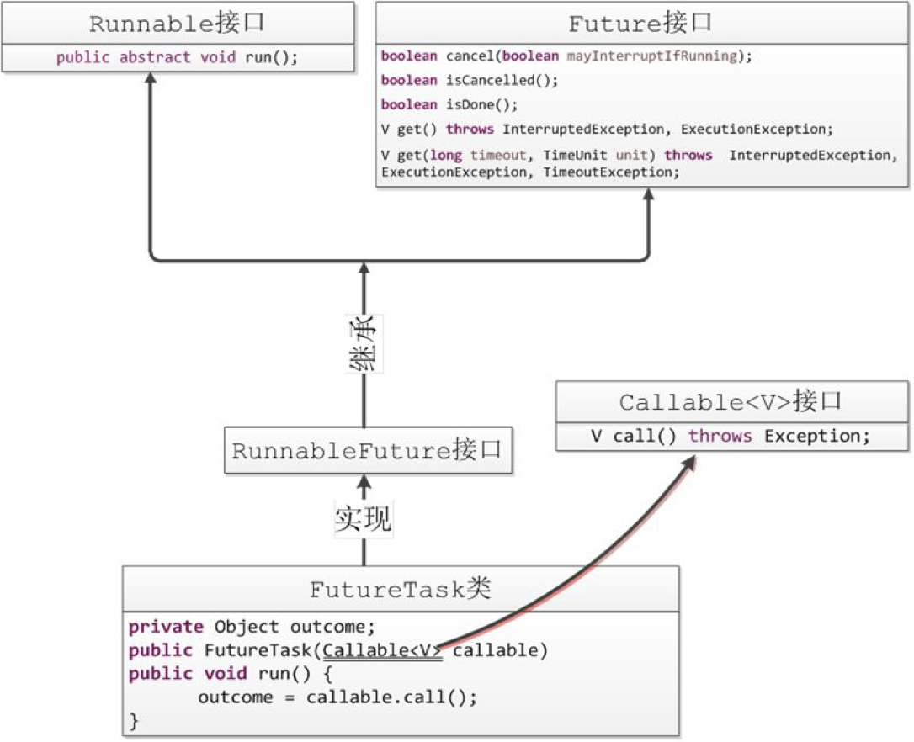

# 线程的并发工具类

[toc]

## Fork-Join 

**什么是分而治之？**

规模为N的问题，N<阈值，直接解决，N>阈值，将N分解为K个小规模子问题，子问题互相对立，与原问题形式相同，将子问题的解合并得到原问题的解

动态规划：子问题之间有联系

**工作密取**

workStealing

 

**Fork/Join****使用的标准范式**

 

RecursiveTask 有返回值时使用

RecursiveAction不要求返回值

都要覆盖compute方法

```JAVA
public class MakeArray {
    public static final int ARRAY_LENGTH = 1000;

    public static int[] makeArray() {
        Random r = new Random();
        int[] result = new int[ARRAY_LENGTH];
        for (int i = 0; i < ARRAY_LENGTH; i++) {
            //用随机数填充数组
            result[i] =  r.nextInt(ARRAY_LENGTH*3);
        }
        return result;
    }
}
```

普通统计方法

```JAVA
public class SumNormal {

    public static void main(String[] args) {
        int count = 0;
        int[] src = MakeArray.makeArray();

        long start = System.currentTimeMillis();
        for(int i= 0;i<src.length;i++){
            //SleepTools.ms(1);
            count = count + src[i];
        }
        System.out.println("The count is "+count
                +" spend time:"+(System.currentTimeMillis()-start)+"ms");
    }

}
```

```JAVA
public class SumArray {
    private static class SumTask extends RecursiveTask<Integer> {

        // 设定为十分之一的阈值
        private final static int THRESHOLD = MakeArray.ARRAY_LENGTH / 10;
        private int[] src; //表示我们要实际统计的数组
        private int fromIndex;//开始统计的下标
        private int toIndex;//统计到哪里结束的下标

        public SumTask(int[] src, int fromIndex, int toIndex) {
            this.src = src;
            this.fromIndex = fromIndex;
            this.toIndex = toIndex;
        }

        // 重写compute方法
        @Override
        protected Integer compute() {
            // 做常规工作
            if (toIndex - fromIndex < THRESHOLD) {
                int count = 0;
                for (int i = fromIndex; i <= toIndex; i++) {
                    SleepTools.ms(1);
                    count = count + src[i];
                }
                return count;
            } else {// 否则继续拆分
                //fromIndex....mid....toIndex
                //1...................70....100
                // 递归 分而治之
                int mid = fromIndex + (toIndex - fromIndex) / 2;
                SumTask left = new SumTask(src, fromIndex, mid);
                SumTask right = new SumTask(src, mid + 1, toIndex);
                invokeAll(left, right);
                return left.join() + right.join();

            }
        }
    }

    public static void main(String[] args) {
        ForkJoinPool pool = new ForkJoinPool();
        int[] src = MakeArray.makeArray();

        SumTask innerFind = new SumTask(src, 0, src.length - 1);
        long start = System.currentTimeMillis();
        pool.invoke(innerFind);//同步调用
        System.out.println("Task is Running.....");

        System.out.println("The count is " + innerFind.join()
                + " spend time:" + (System.currentTimeMillis() - start) + "ms");

    }
}
```

fork join

```JAVA
public class SumArray {
    private static class SumTask extends RecursiveTask<Integer> {

        // 设定为十分之一的阈值
        private final static int THRESHOLD = MakeArray.ARRAY_LENGTH / 10;
        private int[] src; //表示我们要实际统计的数组
        private int fromIndex;//开始统计的下标
        private int toIndex;//统计到哪里结束的下标

        public SumTask(int[] src, int fromIndex, int toIndex) {
            this.src = src;
            this.fromIndex = fromIndex;
            this.toIndex = toIndex;
        }

        // 重写compute方法
        @Override
        protected Integer compute() {
            // 做常规工作
            if (toIndex - fromIndex < THRESHOLD) {
                int count = 0;
                for (int i = fromIndex; i <= toIndex; i++) {
                    SleepTools.ms(1);
                    count = count + src[i];
                }
                return count;
            } else {// 否则继续拆分
                //fromIndex....mid....toIndex
                //1...................70....100
                // 递归 分而治之
                int mid = fromIndex + (toIndex - fromIndex) / 2;
                SumTask left = new SumTask(src, fromIndex, mid);
                SumTask right = new SumTask(src, mid + 1, toIndex);
                invokeAll(left, right);
                return left.join() + right.join();

            }
        }
    }

    public static void main(String[] args) {
        ForkJoinPool pool = new ForkJoinPool();
        int[] src = MakeArray.makeArray();

        SumTask innerFind = new SumTask(src, 0, src.length - 1);
        long start = System.currentTimeMillis();
        pool.invoke(innerFind);//同步调用
        System.out.println("Task is Running.....");

        System.out.println("The count is " + innerFind.join()
                + " spend time:" + (System.currentTimeMillis() - start) + "ms");

    }
}
```

SleepTools.ms(1);注释掉，会发现单线程有时比多线程快，这是因为多线程的上下文切换，当统计量增大时，多线程就更快了

**Fork/Join**的同步用法同时演示返回结果值：统计整形数组中所有元素的和

**Fork/Join**的异步用法同时演示不要求返回值：遍历指定目录（含子目录）寻找指定类型文件

```JAVA
public class FindDirsFiles extends RecursiveAction {

    private File path;

    public FindDirsFiles(File path) {
        this.path = path;
    }

    @Override
    protected void compute() {
        List<FindDirsFiles> subTasks = new ArrayList<>();

        File[] files = path.listFiles();

        if (files != null) {
            for (File file : files) {
                if (file.isDirectory()) {//如果是文件夹，则丢给子任务继续递归
                    subTasks.add(new FindDirsFiles(file));
                } else {
                    // 单纯文件
                    if (file.getAbsolutePath().endsWith(".md")) {
                        System.out.println("文件：" + file.getAbsolutePath());
                    }
                }
            }
            // 当子任务非空 需要搜寻的时候
            if (!subTasks.isEmpty()) { // 如果子任务非空
                // invokeAll返回值是一个集合 把返回值作为循环的主要部分
                for (FindDirsFiles subTask : invokeAll(subTasks)) {
                    subTask.join();//等待子任务执行完成
                }
            }
        }

    }

    public static void main(String[] args) {
        try {
            // 用一个 ForkJoinPool 实例调度总任务
            ForkJoinPool pool = new ForkJoinPool();
            FindDirsFiles task = new FindDirsFiles(new File("/Users/wangfulin"));

            pool.execute(task);//异步调用

            System.out.println("Task is Running......");
            Thread.sleep(1);
            int otherWork = 0;
            for (int i = 0; i < 100; i++) {
                otherWork = otherWork + i;
            }
            System.out.println("Main Thread done sth......,otherWork=" + otherWork);
            task.join();//阻塞的方法 等待task完成工作
            System.out.println("Task end");
        } catch (Exception e) {
            e.printStackTrace();
        }
    }
}
```

## 常用的并发工具类

### CountDownLatch

作用：是一组线程等待其他的线程完成工作以后在执行，加强版join

await用来等待，countDown负责计数器的减一

运用场景：应用启动的时候，主线程等待其他线程加载完成

```JAVA
public class UseCountDownLatch {
    private static CountDownLatch latch = new CountDownLatch(6);

    //初始化线程(只有一步，有4个)
    private static class InitThread implements Runnable {
        @Override
        public void run() {
            System.out.println("Thread_" + Thread.currentThread().getId()
                    + " ready init work......");
            latch.countDown();//初始化线程完成工作了，countDown方法只扣减一次；
            for (int i = 0; i < 2; i++) {
                System.out.println("Thread_" + Thread.currentThread().getId()
                        + " ........continue do its work");
            }
        }
    }

    //业务线程
    private static class BusiThread implements Runnable {

        @Override
        public void run() {
            try {
                latch.await();
            } catch (InterruptedException e) {
                e.printStackTrace();
            }
            for (int i = 0; i < 3; i++) {
                System.out.println("BusiThread_" + Thread.currentThread().getId()
                        + " do business-----");
            }
        }
    }


    // 只有扣减完成 主线程 和业务线程 才开始工作
    public static void main(String[] args) throws InterruptedException {
        //单独的初始化线程,初始化分为2步，需要扣减两次
        new Thread(new Runnable() {
            @Override
            public void run() {
                SleepTools.ms(1);
                System.out.println("Thread_" + Thread.currentThread().getId()
                        + " ready init work step 1st......");
                latch.countDown();//每完成一步初始化工作，扣减一次
                System.out.println("begin step 2nd.......");
                SleepTools.ms(1);
                System.out.println("Thread_" + Thread.currentThread().getId()
                        + " ready init work step 2nd......");
                latch.countDown();//每完成一步初始化工作，扣减一次
            }
        }).start();
        // 业务线程也调用await()，等待扣减完成
        new Thread(new BusiThread()).start();
        // 启动四个初始化线程  加上前面的两个线程 总共六个。
        for (int i = 0; i <= 3; i++) {
            Thread thread = new Thread(new InitThread());
            thread.start();
        }

        latch.await();
        System.out.println("Main do ites work........");
    }
}
```

```JAVA
Thread_13 ready init work......
Thread_16 ready init work......
Thread_15 ready init work......
Thread_14 ready init work......
Thread_15 ........continue do its work
Thread_16 ........continue do its work
Thread_13 ........continue do its work
Thread_16 ........continue do its work
Thread_15 ........continue do its work
Thread_14 ........continue do its work
Thread_13 ........continue do its work
Thread_14 ........continue do its work
Thread_11 ready init work step 1st......
begin step 2nd.......
Thread_11 ready init work step 2nd......
Main do ites work........
BusiThread_12 do business-----
BusiThread_12 do business-----
BusiThread_12 do business-----
```

只有扣减完成 主线程 和业务线程 才开始工作

### CyclicBarrier

**让一组线程达到某个屏障，被阻塞，一直到组内最后一个线程达到屏障时，屏障开放，所有被阻塞的线程会继续运行CyclicBarrier(int parties)或CyclicBarrier(int parties, Runnable barrierAction)，屏障开放，barrierAction定义的任务会执行**

CountDownLatch和CyclicBarrier辨析

- 1、**countdownlatch放行由第三者控制，CyclicBarrier放行由一组线程本身控制**
- 2、**countdownlatch放行条件 》= 线程数，CyclicBarrier放行条件=线程数**

```JAVA
public class UseCyclicBarrier {
    private static CyclicBarrier barrier
            = new CyclicBarrier(5, new CollectThread());


    // 存放子线程工作结果的容器
    private static ConcurrentHashMap<String, Long> resultMap
            = new ConcurrentHashMap<>();


    //负责屏障开放以后的工作 可以在每个线程执行一部分操作，最后由这个线程进行汇总
    private static class CollectThread implements Runnable {

        @Override
        public void run() {
            StringBuilder result = new StringBuilder();
            for (Map.Entry<String, Long> workResult : resultMap.entrySet()) {
                result.append("[" + workResult.getValue() + "]");
            }
            System.out.println(" the result = " + result);
            System.out.println("do other business........");
        }
    }


    //工作线程
    private static class SubThread implements Runnable {
        @Override
        public void run() {
            long id = Thread.currentThread().getId();//线程本身的处理结果
            resultMap.put(Thread.currentThread().getId() + "", id);
            Random r = new Random();//随机决定工作线程的是否睡眠
            try {
                // nextBoolean()方法调用返回下一个伪均匀分布的boolean值。
                if (r.nextBoolean()) {
                    Thread.sleep(2000 + id);
                    System.out.println("Thread_" + id + " ....do something ");
                }
                System.out.println(id + "....is await");
                // 相互等待
                barrier.await();
                Thread.sleep(1000 + id);
                System.out.println("Thread_" + id + " ....do its business ");
            } catch (Exception e) {
                e.printStackTrace();
            }

        }
    }

    public static void main(String[] args) {
        for (int i = 0; i <= 4; i++) {
            Thread thread = new Thread(new SubThread());
            thread.start();
        }

    }
}
```

```JAVA
12....is await
14....is await
15....is await
Thread_11 ....do something 
11....is await
Thread_13 ....do something 
13....is await
 the result = [11][12][13][14][15]
do other business........
Thread_12 ....do its business 
Thread_11 ....do its business 
Thread_13 ....do its business 
Thread_14 ....do its business 
Thread_15 ....do its business
```

线程12 14 15没有进入休眠，等待剩余的线程。11 13 进入休眠，只有等这五个线程都完成之后。才会执行后面的业务线程

### Semaphore

控制同时访问某个特定资源的线程数量，用在流量控制

```JAVA
public class SemaphoreTest {
    private static DBPoolSemaphore dbPool = new DBPoolSemaphore();

    //业务线程
    private static class BusiThread extends Thread {
        @Override
        public void run() {
            Random r = new Random();//让每个线程持有连接的时间不一样
            long start = System.currentTimeMillis();
            try {
                Connection connect = dbPool.takeConnect();
                System.out.println("Thread_" + Thread.currentThread().getId()
                        + "_获取数据库连接共耗时【" + (System.currentTimeMillis() - start) + "】ms.");
                SleepTools.ms(100 + r.nextInt(100));//模拟业务操作，线程持有连接查询数据
                System.out.println("查询数据完成，归还连接！");
                dbPool.returnConnect(connect);
            } catch (InterruptedException e) {
            }
        }
    }

    public static void main(String[] args) {
        for (int i = 0; i < 50; i++) {
            Thread thread = new BusiThread();
            thread.start();
        }
    }
}
```

```JAVA
public class DBPoolSemaphore {
    private final static int POOL_SIZE = 10;
    private final Semaphore useful, useless;//useful表示可用的数据库连接，useless表示已用的数据库连接

    public DBPoolSemaphore() {
        this.useful = new Semaphore(POOL_SIZE); //可用的数据库连接
        this.useless = new Semaphore(0); //已用的数据库连接
    }

    //存放数据库连接的容器
    private static LinkedList<Connection> pool = new LinkedList<Connection>();

    //初始化池
    static {
        for (int i = 0; i < POOL_SIZE; i++) {
            pool.addLast(SqlConnectImpl.fetchConnection());
        }
    }

    /*归还连接*/
    public void returnConnect(Connection connection) throws InterruptedException {
        if (connection != null) {
            System.out.println("当前有" + useful.getQueueLength() + "个线程等待数据库连接！！"
                    + "可用连接数:" + useful.availablePermits());
            useless.acquire(); // 申请已用连接的许可证
            synchronized (pool) {
                pool.addLast(connection);
            }
            useful.release();// 可用连接放回了一个
        }
    }

    /*从池子拿连接*/
    public Connection takeConnect() throws InterruptedException {
        useful.acquire(); //拿连接，需要拿到可用的许可 useful是空的，则可用的连接阻塞，
        Connection conn;
        synchronized (pool) {
            conn = pool.removeFirst(); // 从池中取走一个
        }
        useless.release(); // 已用连接释放，表示已用连接已经多了一个
        return conn;
    }

}
```

### Exchange

两个线程间的数据交换

```JAVA
public class UseExchange {
    private static final Exchanger<Set<String>> exchange
            = new Exchanger<Set<String>>();

    public static void main(String[] args) {

        //第一个线程
        new Thread(new Runnable() {
            @Override
            public void run() {
                Set<String> setA = new HashSet<String>();//存放数据的容器
                try {
                    /*添加数据
                     * set.add(.....)
                     * */
                    setA.add("setA");
                    setA = exchange.exchange(setA);//交换set
                    /*处理交换后的数据*/
                    System.out.println(Thread.currentThread() + "A:" + setA.toString());
                } catch (InterruptedException e) {
                }
            }
        }).start();

        //第二个线程
        new Thread(new Runnable() {
            @Override
            public void run() {
                Set<String> setB = new HashSet<String>();//存放数据的容器
                try {
                    /*添加数据
                     * set.add(.....)
                     * set.add(.....)
                     * */
                    setB.add("setB");
                    setB = exchange.exchange(setB);//交换set
                    System.out.println(Thread.currentThread() + "B:" + setB.toString());
                    /*处理交换后的数据*/
                } catch (InterruptedException e) {
                }
            }
        }).start();

    }
}
```

```JAVA
Thread[Thread-0,5,main]A:[setB]
Thread[Thread-1,5,main]B:[setA]
```

### Callable、Future和FutureTask

isDone()方法，结束，不管是正常还是异常结束，或者自己取消，返回true；

isCancelled() 任务完成前被取消，返回true；

cancel（boolean）：

1、 任务还没开始，返回false

2、 任务已经启动，cancel(true)，中断正在运行的任务，中断成功，返回true，cancel（false），不会去中断已经运行的任务

3、 任务已经结束，返回false

 

包含图片和文字的文档的处理：图片（云上），可以用future去取图片，主线程继续解析文字。

```JAVA
public class UseFuture {

    /*实现Callable接口，允许有返回值*/
    private static class UseCallable implements Callable<Integer> {

        private int sum;

        @Override
        public Integer call() throws Exception {
            System.out.println("Callable子线程开始计算");
            Thread.sleep(2000);
            for (int i = 0; i < 5000; i++) {
                sum = sum + i;
            }
            System.out.println("Callable子线程计算完成，结果=" + sum);
            return sum;
        }

    }

    public static void main(String[] args)
            throws InterruptedException, ExecutionException {

        UseCallable useCallable = new UseCallable();
        FutureTask<Integer> futureTask = new FutureTask<Integer>(useCallable);

        new Thread(futureTask).start();
        Random r = new Random();
        SleepTools.second(1);
        if (r.nextBoolean()) {//随机决定是获得结果还是终止任务
            System.out.println("Get UseCallable result = " + futureTask.get());
        } else {
            System.out.println("中断计算");
            futureTask.cancel(true);
        }
    }
}
```

