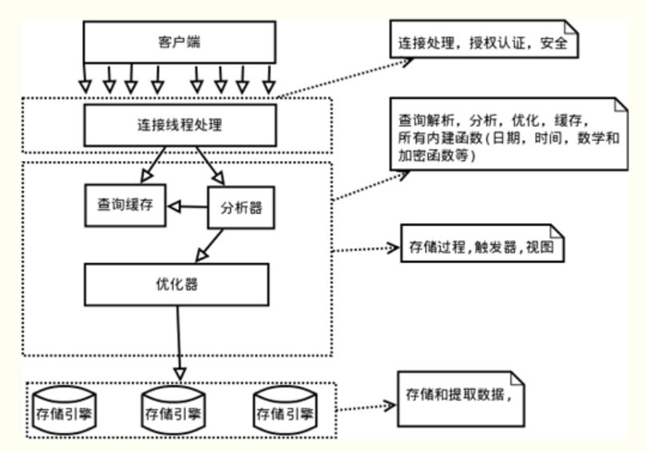
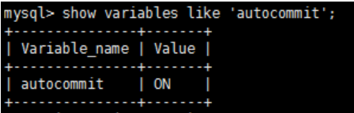
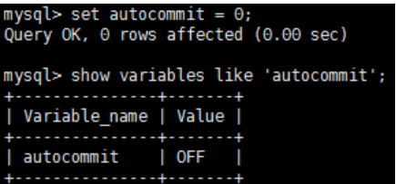
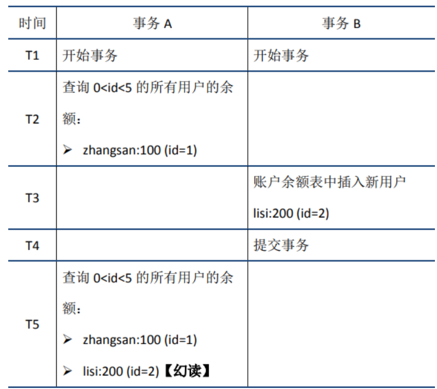
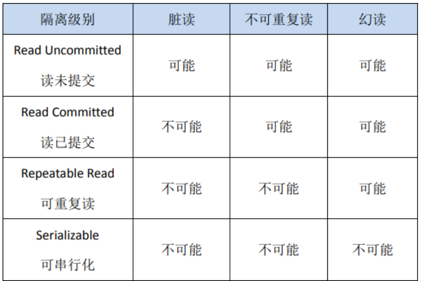
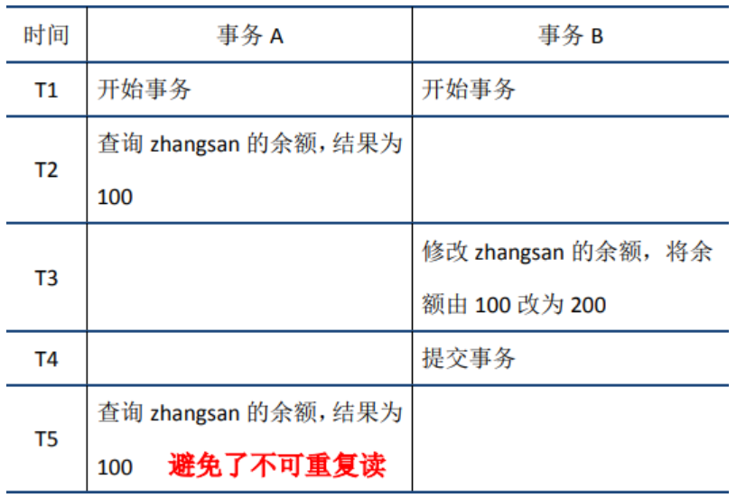
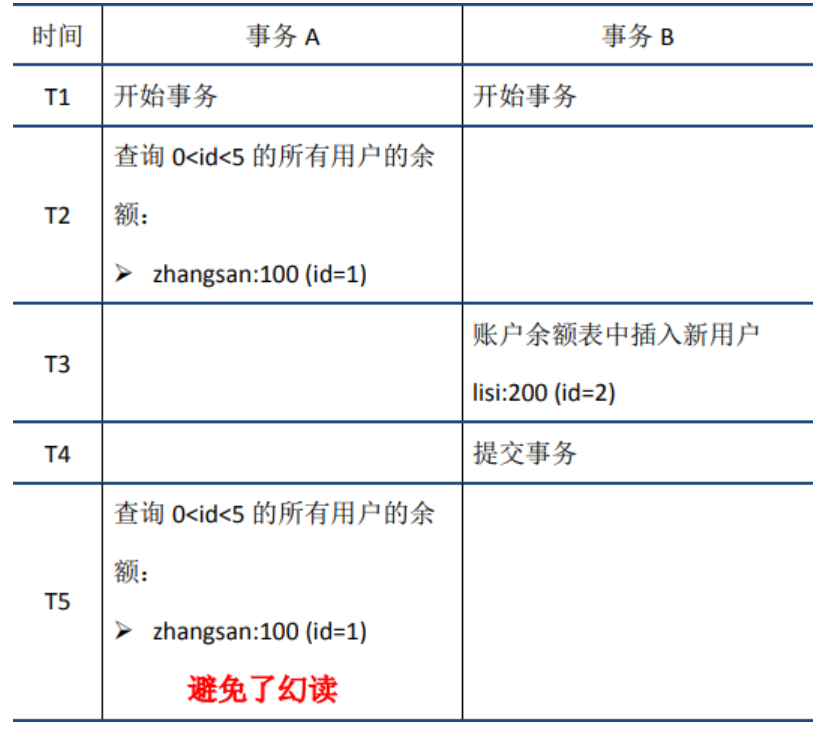
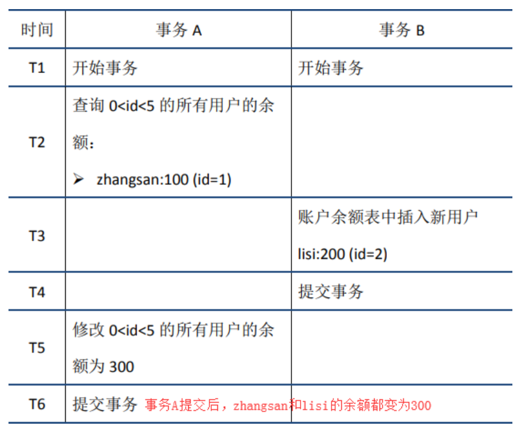
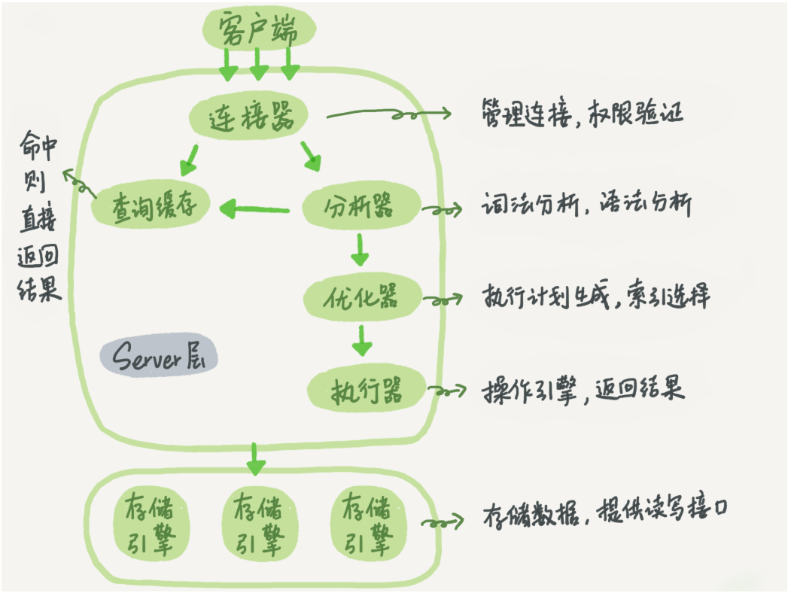
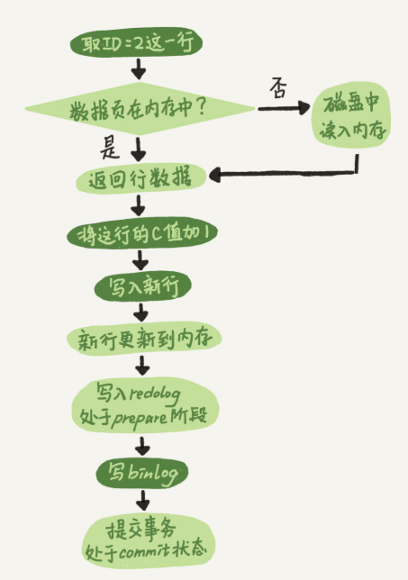

## 数据库 Mysql +分库分表+ Redis + MongDB
目录：
---
[toc]

---

markdown的锚点：
<!-- GFM-TOC -->
* [一. 基础概念](#一-基础概念)
	* [1.1 逻辑架构和存储引擎](#11-逻辑架构和存储引擎)
	* [1.2 提交和回滚](#12-提交和回滚)
	* [1.3 ACID特性](#13-acid特性)
* [二. 原子性](#二-原子性)
	* [2.1 定义](#21-定义)
	* [2.2 实现原理](#22-实现原理)
* [三. 持久性](#三-持久性)
	* [3.1 定义](#31-定义)
	* [3.2 实现原理](#32-实现原理)
	* [3.3 redo log与bin log](#33-redo-log与bin-log)
* [四. 隔离性](#四-隔离性)
	* [4.1 定义](#41-定义)
	* [4.2 锁机制](#42-锁机制)
	* [4.2.1 行锁与表锁](#421-行锁与表锁)
	* [4.3 脏读、不可重复读和幻读](#43-脏读、不可重复读和幻读)
	* [4.4 事务隔离级别](#44-事务隔离级别)
	* [4.5 MVCC](#45-mvcc)
* [五. 一致性](#五-一致性)
	* [5.1 基本概念](#51-基本概念)
	* [5.2 实现](#52-实现)
* [六. 锁和索引](#六-锁和索引)
	* [6.1 读写锁](#61-读写锁)
	* [6.2 数据库中的范式](#62-数据库中的范式)
	* [6.3 存储引擎](#63-存储引擎)
	* [6.3 大表优化](#63-大表优化)
	* [6.4 索引](#64-索引)
		* [6.4.1 B Tree 原理](#641-b-tree-原理)
		* [6.4.2 索引的优点](#642-索引的优点)
		* [6.4.3 索引的缺点](#643-索引的缺点)
		* [6.4.4 索引失效](#644-索引失效)
		* [6.4.5 在什么情况下适合建立索引](#645-在什么情况下适合建立索引)
		* [6.4.6 为什么用B+树做索引而不用B-树或红黑树](#646-为什么用b+树做索引而不用b-树或红黑树)
		* [6.4.7 联合索引](#647-联合索引)
		* [6.4.8 数据库的锁](#648-数据库的锁)
* [第二部分：高性能MySQL实践](#第二部分：高性能mysql实践)
	* [1. 如何解决秒杀的性能问题和超卖的讨论](#1-如何解决秒杀的性能问题和超卖的讨论)
	* [2. 数据库主从不一致，怎么解](#2-数据库主从不一致，怎么解)
	* [3. 一条查询语句执行过程](#3-一条查询语句执行过程)
		* [3.1 结构分层](#31-结构分层)
		* [3.2 一条更新语句的执行过程：分析器会通过词法和语法知道这是一个更新语句](#32-一条更新语句的执行过程：分析器会通过词法和语法知道这是一个更新语句)
		* [3.3 事务隔离](#33-事务隔离)
				* [3.3.1 读未提交](#331-读未提交)
				* [3.3.2 读提交](#332-读提交)
				* [3.3.3 可重复读](#333-可重复读)
				* [3.3.4 串行化](#334-串行化)
	* [4.索引](#4索引)
		* [4.1 哈希表](#41-哈希表)
		* [4.2 InnoDB 的索引模型–主键索引–聚簇索引](#42-innodb-的索引模型–主键索引–聚簇索引)
			* [4.2.1 索引维护](#421-索引维护)
			* [4.2.2 索引规则](#422-索引规则)
	* [5. 锁](#5-锁)
		* [5.1 全局锁](#51-全局锁)
		* [5.2 表级锁](#52-表级锁)
		* [5.3 InnoDB的行锁](#53-innodb的行锁)
	* [6. 事务隔离](#6-事务隔离)
	* [7. 唯一索引还是普通索引](#7-唯一索引还是普通索引)
	* [8. 索引选择异常和处理](#8-索引选择异常和处理)
	* [9. 给字符串字段加索引](#9-给字符串字段加索引)
	* [10. 数据库表的空间回收](#10-数据库表的空间回收)
	* [11. count](#11-count)
	* [12. Order by](#12-order-by)
	* [13. 执行逻辑相同，性能却不同](#13-执行逻辑相同，性能却不同)
	* [14. 幻读](#14-幻读)
	* [15. 加锁规则](#15-加锁规则)
	* [16. 提高性能的几种方案](#16-提高性能的几种方案)
		* [16.1 先处理掉那些占着连接但是不工作的线程。](#161-先处理掉那些占着连接但是不工作的线程。)
		* [16.2 连接过程的消耗。](#162-连接过程的消耗。)
		* [16.3 慢查询性能问题](#163-慢查询性能问题)
	* [17. MySQL是怎么保证数据不丢](#17-mysql是怎么保证数据不丢)
		* [17.1 bin log的写入机制](#171-bin-log的写入机制)
		* [17.2 redo log的写入机制](#172-redo-log的写入机制)
	* [18. 主备一致](#18-主备一致)
	* [19. 备库并行复制能力](#19-备库并行复制能力)
		* [19.1 单线程转变为多线程复制](#191-单线程转变为多线程复制)
		* [19.2 如果不支持多线程复制的改进方案](#192-如果不支持多线程复制的改进方案)
		* [19.3 MySQL 5.6版本的并行复制策略](#193-mysql-56版本的并行复制策略)
		* [19.4 MariaDB的并行复制策略](#194-mariadb的并行复制策略)
		* [19.5 MySQL 5.7的并行复制策略](#195-mysql-57的并行复制策略)


<!-- GFM-TOC -->

### 一. 基础概念
事务（Transaction）是访问和更新数据库的程序执行单元；事务中可能包含一个或多个sql语句，这些语句要么都执行，要么都不执行。作为一个关系型数据库，MySQL支持事务，本文介绍基于MySQL5.6。

#### 1.1 逻辑架构和存储引擎

如上图所示，MySQL服务器逻辑架构从上往下可以分为三层：
（1）第一层：处理客户端连接、授权认证等。
（2）第二层：服务器层，负责查询语句的解析、优化、缓存以及内置函数的实现、存储过程等。
（3）第三层：存储引擎，负责MySQL中数据的存储和提取。MySQL中服务器层不管理事务，事务是由存储引擎实现的。
MySQL支持事务的存储引擎有InnoDB、NDB Cluster等，其中InnoDB的使用最为广泛；其他存储引擎不支持事务，如MyIsam、Memory等。

#### 1.2 提交和回滚
start transaction标识事务开始，commit提交事务，将执行结果写入到数据库。如果sql语句执行出现问题，会调用rollback，回滚所有已经执行成功的sql语句。当然，也可以在事务中直接使用rollback语句进行回滚。
自动提交
MySQL中默认采用的是自动提交（autocommit）模式，如下所示：


在自动提交模式下，如果没有start transaction显式地开始一个事务，那么每个sql语句都会被当做一个事务执行提交操作。
通过如下方式，可以关闭autocommit；需要注意的是，autocommit参数是针对连接的，在一个连接中修改了参数，不会对其他连接产生影响。


如果关闭了autocommit，则所有的sql语句都在一个事务中，直到执行了commit或rollback，该事务结束，同时开始了另外一个事务。
特殊操作
在MySQL中，存在一些特殊的命令，如果在事务中执行了这些命令，会马上强制执行commit提交事务；如DDL语句(create table/drop table/alter/table)、lock tables语句等等。
不过，常用的select、insert、update和delete命令，都不会强制提交事务。
#### 1.3 ACID特性
ACID是衡量事务的四个特性：
- 原子性（Atomicity，或称不可分割性）
- 一致性（Consistency）
- 隔离性（Isolation）
- 持久性（Durability）
按照严格的标准，只有同时满足ACID特性才是事务；但是在各大数据库厂商的实现中，真正满足ACID的事务少之又少。例如MySQL的NDB Cluster事务不满足持久性和隔离性；**InnoDB默认事务隔离级别是可重复读，不满足隔离性；Oracle默认的事务隔离级别为READ** COMMITTED，不满足隔离性……因此**与其说ACID是事务必须满足的条件，不如说它们是衡量事务的四个维度。**

### 二. 原子性
#### 2.1 定义
原子性是指一个事务是一个不可分割的工作单位，其中的操作要么都做，要么都不做；如果事务中一个sql语句执行失败，则已执行的语句也必须回滚，数据库退回到事务前的状态。

#### 2.2 实现原理
实现原理：undo log
在说明原子性原理之前，首先介绍一下MySQL的事务日志。MySQL的日志有很多种，如二进制日志、错误日志、查询日志、慢查询日志等，此外InnoDB存储引擎还提供了两种事务日志：**redo log(重做日志)和undo log(回滚日志)。其中redo log用于保证事务持久性；undo log则是事务原子性和隔离性实现的基础。**
下面说回undo log。实现原子性的关键，是当事务回滚时能够撤销所有已经成功执行的sql语句。InnoDB实现回滚，靠的是undo log：**当事务对数据库进行修改时，InnoDB会生成对应的undo log**；如果事务执行失败或调用了rollback，导致事务需要回滚，便可以利用undo log中的信息将数据回滚到修改之前的样子。
undo log属于逻辑日志，它记录的是sql执行相关的信息。当发生回滚时，InnoDB会根据undo log的内容做与之前相反的工作：对于每个insert，回滚时会执行delete；对于每个delete，回滚时会执行insert；对于每个update，回滚时会执行一个相反的update，把数据改回去。
以update操作为例：当事务执行update时，其生成的undo log中会包含被修改行的主键(以便知道修改了哪些行)、修改了哪些列、这些列在修改前后的值等信息，回滚时便可以使用这些信息将数据还原到update之前的状态。

### 三. 持久性
#### 3.1 定义
持久性是指事务一旦提交，它对数据库的改变就应该是永久性的。接下来的其他操作或故障不应该对其有任何影响。
#### 3.2 实现原理
实现原理：redo log
redo log和undo log都属于InnoDB的事务日志。下面先聊一下redo log存在的背景。
InnoDB作为MySQL的存储引擎，数据是存放在磁盘中的，但如果每次读写数据都需要磁盘IO，效率会很低。为此，InnoDB提供了缓存(Buffer Pool)，Buffer Pool中包含了磁盘中部分数据页的映射，作为访问数据库的缓冲：**当从数据库读取数据时，会首先从Buffer Pool中读取，如果Buffer Pool中没有，则从磁盘读取后放入Buffer Pool；当向数据库写入数据时，会首先写入Buffer Pool，Buffer Pool中修改的数据会定期刷新到磁盘中**（这一过程称为刷脏）。
Buffer Pool的使用大大提高了读写数据的效率，但是也带了新的问题：如果MySQL宕机，而此时Buffer Pool中修改的数据还没有刷新到磁盘，就会导致数据的丢失，事务的持久性无法保证。
于是，redo log被引入来解决这个问题：当数据修改时，除了修改Buffer Pool中的数据，还会在redo log记录这次操作；当事务提交时，会调用fsync接口对redo log进行刷盘。如果MySQL宕机，重启时可以读取redo log中的数据，对数据库进行恢复。**==redo log采用的是WAL（Write-ahead logging，预写式日志），所有修改先写入日志，再更新到Buffer Pool，保证了数据不会因MySQL宕机而丢失，从而满足了持久性要求。==**
既然redo log也需要在事务提交时将日志写入磁盘，为什么它比直接将Buffer Pool中修改的数据写入磁盘(即刷脏)要快呢？主要有以下两方面的原因：
（1）刷脏是随机IO，因为每次修改的数据位置随机，但写redo log是追加操作，属于顺序IO。
（2）刷脏是以数据页（Page）为单位的，MySQL默认页大小是16KB，一个Page上一个小修改都要整页写入；而redo log中只包含真正需要写入的部分，无效IO大大减少。

#### 3.3 redo log与bin log
我们知道，在MySQL中还存在binlog(二进制日志)也可以记录写操作并用于数据的恢复，但二者是有着根本的不同的：
* （1）**作用不同**：redo log是用于crash recovery的，保证MySQL宕机也不会影响持久性；binlog是用于point-in-time recovery的，保证服务器可以基于时间点恢复数据，此外binlog还用于主从复制。
* （2）**层次不同**：redo log是InnoDB存储引擎实现的，而binlog是MySQL的服务器层(可以参考文章前面对MySQL逻辑架构的介绍)实现的，同时支持InnoDB和其他存储引擎。
* （3）**内容不同**：redo log是物理日志，内容基于磁盘的Page；binlog的内容是二进制的，根据binlog_format参数的不同，可能基于sql语句、基于数据本身或者二者的混合。
* （4）**写入时机不同**：binlog在事务提交时写入；redo log的写入时机相对多元：
前面曾提到：当事务提交时会调用fsync对redo log进行刷盘；这是默认情况下的策略，修改innodb_flush_log_at_trx_commit参数可以改变该策略，但事务的持久性将无法保证。
除了事务提交时，还有其他刷盘时机：如master thread每秒刷盘一次redo log等，这样的好处是不一定要等到commit时刷盘，commit速度大大加快。

### 四. 隔离性
#### 4.1 定义
**与原子性、持久性侧重于研究事务本身不同，隔离性研究的是不同事务之间的相互影响。**隔离性是指，事务内部的操作与其他事务是隔离的，并发执行的各个事务之间不能互相干扰。严格的隔离性，对应了事务隔离级别中的Serializable (可串行化)，但实际应用中出于性能方面的考虑很少会使用可串行化。

隔离性追求的是并发情形下事务之间互不干扰。简单起见，我们仅考虑最简单的读操作和写操作(暂时不考虑带锁读等特殊操作)，那么隔离性的探讨，主要可以分为两个方面：
- (一个事务)写操作对(另一个事务)写操作的影响：锁机制保证隔离性
- (一个事务)写操作对(另一个事务)读操作的影响：MVCC保证隔离性

#### 4.2 锁机制
首先来看两个事务的写操作之间的相互影响。隔离性要求同一时刻只能有一个事务对数据进行写操作，InnoDB通过锁机制来保证这一点。
锁机制的基本原理可以概括为：事务在修改数据之前，需要先获得相应的锁；获得锁之后，事务便可以修改数据；该事务操作期间，这部分数据是锁定的，其他事务如果需要修改数据，需要等待当前事务提交或回滚后释放锁。
##### 4.2.1 行锁与表锁
按照粒度，锁可以分为表锁、行锁以及其他位于二者之间的锁。表锁在操作数据时会锁定整张表，并发性能较差；行锁则只锁定需要操作的数据，并发性能好。但是由于加锁本身需要消耗资源(获得锁、检查锁、释放锁等都需要消耗资源)，因此在锁定数据较多情况下使用表锁可以节省大量资源。MySQL中不同的存储引擎支持的锁是不一样的，例如MyIsam只支持表锁，而InnoDB同时支持表锁和行锁，且出于性能考虑，绝大多数情况下使用的都是行锁。
行锁是通过索引实现的
如何查看锁信息
有多种方法可以查看InnoDB中锁的情况，例如：
select * from information_schema.innodb_locks; #锁的概况
show engine innodb status; #InnoDB整体状态，其中包括锁的情况

- 在事务A中执行：
start transaction;
update account SET balance = 1000 where id = 1;
- 在事务B中执行：
start transaction;
update account SET balance = 2000 where id = 1;


#### 4.3 脏读、不可重复读和幻读
首先来看并发情况下，读操作可能存在的三类问题：
（1）脏读：当前事务(A)中可以读到其他事务(B)未提交的数据（脏数据），这种现象是脏读。举例如下（以账户余额表为例）：

解决办法：
　　如果只有在修改事务完全提交之后才可以读取数据，则可以避免该问题。把数据库的事务隔离级别调整到REPEATABLE_READ
（2）不可重复读：在事务A中先后两次读取同一个数据，两次读取的结果不一样，这种现象称为不可重复读。脏读与不可重复读的区别在于：前者读到的是其他事务未提交的数据，后者读到的是其他事务已提交的数据。举例如下：


解决办法：
　　如果在操作事务完成数据处理之前，任何其他事务都不可以添加新数据，则可避免该问题。把数据库的事务隔离级别调整到 SERIALIZABLE_READ
（3）幻读：在事务A中按照某个条件先后两次查询数据库，两次查询结果的条数不同，这种现象称为幻读。不可重复读与幻读的区别可以通俗的理解为：前者是数据变了，后者是数据的行数变了。举例如下：


#### 4.4 事务隔离级别
SQL标准中定义了四种隔离级别，并规定了每种隔离级别下上述几个问题是否存在。一般来说，隔离级别越低，系统开销越低，可支持的并发越高，但隔离性也越差。隔离级别与读问题的关系如下：


在实际应用中，**读未提交**在并发时会导致很多问题，而性能相对于其他隔离级别提高却很有限，因此使用较少。**可串行化**强制事务串行，并发效率很低，只有当对数据一致性要求极高且可以接受没有并发时使用，因此使用也较少。因此在大多数数据库系统中，默认的隔离级别是读已提交(如Oracle)或可重复读（后文简称RR）。

InnoDB默认的隔离级别是RR，后文会重点介绍RR。需要注意的是，在SQL标准中，RR是无法避免幻读问题的，但是InnoDB实现的RR避免了幻读问题。

#### 4.5 MVCC
RR解决脏读，不可重复读、幻读等问题，使用的是MVCC：MVCC全称Multi-Version Concurrency Control，即**多版本的并发控制协议**。下面的例子很好的体现了MVCC的特点：在同一时刻，不同的事务读取到的数据可能是不同的(即多版本)——在T5时刻，事务A和事务C可以读取到不同版本的数据。

**MVCC最大的优点是读不加锁，因此读写不冲突，并发性能好。**InnoDB实现MVCC，多个版本的数据可以共存，主要是依靠数据的隐藏列(也可以称之为标记位)和undo log。其中数据的隐藏列包括了该行数据的版本号、删除时间、指向undo log的指针等等；当读取数据时，MySQL可以通过隐藏列判断是否需要回滚并找到回滚需要的undo log，从而实现MVCC；隐藏列的详细格式不再展开。
下面结合前文提到的几个问题分别说明。
（1）脏读


当事务A在T3时间节点读取zhangsan的余额时，会发现数据已被其他事务修改，且状态为未提交。此时事务A读取最新数据后，根据数据的undo log执行回滚操作，得到事务B修改前的数据，从而避免了脏读。
（2）不可重复读


当事务A在T2节点第一次读取数据时，会记录该数据的版本号（数据的版本号是以row为单位记录的），假设版本号为1；当事务B提交时，该行记录的版本号增加，假设版本号为2；当事务A在T5再一次读取数据时，发现数据的版本号（2）大于第一次读取时记录的版本号（1），因此会根据undo log执行回滚操作，得到版本号为1时的数据，从而实现了可重复读。
（3）幻读
InnoDB实现的RR通过next-key lock机制避免了幻读现象。
next-key lock是行锁的一种，实现相当于record lock(记录锁) + gap lock(间隙锁)；其特点是不仅会锁住记录本身(record lock的功能)，还会锁定一个范围(gap lock的功能)。当然，这里我们讨论的是不加锁读：此时的next-key lock并不是真的加锁，只是为读取的数据增加了标记（标记内容包括数据的版本号等）；准确起见姑且称之为类next-key lock机制。还是以前面的例子来说明：


当事务A在T2节点第一次读取0<id<5数据时，标记的不只是id=1的数据，而是将范围(0,5)进行了标记，这样当T5时刻再次读取0<id<5数据时，便可以发现id=4的数据比之前标记的版本号更高，此时再结合undo log执行回滚操作，避免了幻读。
6. 总结
概括来说，InnoDB实现的RR，通过锁机制、数据的隐藏列、undo log和类next-key lock，实现了一定程度的隔离性，可以满足大多数场景的需要。不过需要说明的是，RR虽然避免了幻读问题，但是毕竟不是Serializable，不能保证完全的隔离，下面是一个例子，大家可以自己验证一下。


### 五. 一致性
#### 5.1 基本概念
一致性是指事务执行结束后，数据库的完整性约束没有被破坏，事务执行的前后都是合法的数据状态。数据库的完整性约束包括但不限于：实体完整性（如行的主键存在且唯一）、列完整性（如字段的类型、大小、长度要符合要求）、外键约束、用户自定义完整性（如转账前后，两个账户余额的和应该不变）。
#### 5.2 实现
可以说，一致性是事务追求的最终目标：前面提到的原子性、持久性和隔离性，都是为了保证数据库状态的一致性。此外，除了数据库层面的保障，一致性的实现也需要应用层面进行保障。
实现一致性的措施包括：
保证原子性、持久性和隔离性，如果这些特性无法保证，事务的一致性也无法保证
数据库本身提供保障，例如不允许向整形列插入字符串值、字符串长度不能超过列的限制等
应用层面进行保障，例如如果转账操作只扣除转账者的余额，而没有增加接收者的余额，无论数据库实现的多么完美，也无法保证状态的一致

### 六. 锁和索引
下面总结一下ACID特性及其实现原理：
- 原子性：语句要么全执行，要么全不执行，是事务最核心的特性，事务本身就是以原子性来定义的；实现主要基于undo log
- 持久性：保证事务提交后不会因为宕机等原因导致数据丢失；实现主要基于redo log
- 隔离性：保证事务执行尽可能不受其他事务影响；InnoDB默认的隔离级别是RR，RR的实现主要基于锁机制、数据的隐藏列、undo log和类next-key lock机制
- 一致性：事务追求的最终目标，一致性的实现既需要数据库层面的保障，也需要应用层面的保障
封锁类型

#### 6.1 读写锁
- 排它锁（Exclusive），简写为 X 锁，又称写锁。
- 共享锁（Shared），简写为 S 锁，又称读锁。
InnoDB 也可以使用特定的语句进行显示锁定：
SELECT ... LOCK In SHARE MODE;
SELECT ... FOR UPDATE;

#### 6.2 数据库中的范式
满足最低要求的范式是第一范式（1NF）。在第一范式的基础上进一步满足更多规范要求的称为第二范式（2NF），其余范式以次类推。一般说来，数据库只需满足第三范式 (3NF）就行了。

　　范式的包含关系。一个数据库设计如果符合第二范式，一定也符合第一范式。如果符合第三范式，一定也符合第二范式…

1NF：属性不可分
2NF：属性完全依赖于主键 [消除部分子函数依赖]
3NF：属性不依赖于其它非主属性 [消除传递依赖]

#### 6.3 存储引擎

- 1 MyISAM
   - MySQL 5.5 版本之前的默认存储引擎，在 5.0 以前最大表存储空间最大 4G，5.0 以后最大 256TB。
   - **Myisam 存储引擎由 .myd（数据）和 .myi（索引文件）组成，.frm文件存储表结构（所以存储引擎都有）**
特性
   - 并发性和锁级别 （对于读写混合的操作不好，为表级锁，写入和读互斥）
表损坏修复
   - Myisam 表支持的索引类型（全文索引）
Myisam 支持表压缩（压缩后，此表为只读，不可以写入。使用 myisampack 压缩）
   - 应用场景
没有事务
只读类应用（插入不频繁，查询非常频繁）
空间类应用（唯一支持空间函数的引擎）
做很多 count 的计算


- 2  InnoDB
   - MySQL 5.5 及之后版本的默认存储引擎

   - 特性
InnoDB为事务性存储引擎
完全支持事物的 ACID 特性
Redo log （实现事务的持久性） 和 Undo log（为了实现事务的原子性，存储未完成事务log，用于回滚）
InnoDB支持行级锁
行级锁可以最大程度的支持并发
行级锁是由存储引擎层实现的
应用场景

   - 可靠性要求比较高，或者要求事务
   - 表更新和查询都相当的频繁，并且行锁定的机会比较大的情况。

**问：MyISAM和InnoDB引擎的区别(重)**
区别：
MyISAM 不支持外键，而 InnoDB 支持
MyISAM 是非事务安全型的，而 InnoDB 是事务安全型的。
MyISAM 锁的粒度是表级，而 InnoDB 支持行级锁定。
MyISAM 支持全文类型索引，而 InnoDB 不支持全文索引。
MyISAM 相对简单，所以在效率上要优于 InnoDB，小型应用可以考虑使用 MyISAM。
MyISAM 表是保存成文件的形式，在跨平台的数据转移中使用 MyISAM 存储会省去不少的麻烦。
InnoDB 表比 MyISAM 表更安全，可以在保证数据不会丢失的情况下，切换非事务表到事务表（alter table tablename type=innodb）。

补:在做读写分离时,常用innodb作为写 myisam作为读

应用场景：
MyISAM 管理非事务表。它提供高速存储和检索，以及全文搜索能力。如果应用中需要执行大量的 SELECT 查询，那么 MyISAM 是更好的选择。
InnoDB 用于事务处理应用程序，具有众多特性，包括 ACID 事务支持。如果应用中需要执行大量的 INSERT 或 UPDATE 操作，则应该使用 InnoDB，这样可以提高多用户并发操作的性能。
主要有 CHAR 和 VARCHAR 两种类型，一种是定长的，一种是变长的。
VARCHAR 这种变长类型能够节省空间，因为只需要存储必要的内容。但是在执行 UPDATE 时可能会使行变得比原来长，当超出一个页所能容纳的大小时，就要执行额外的操作。MyISAM 会将行拆成不同的片段存储，而 InnoDB 则需要分裂页来使行放进页内。
VARCHAR 会保留字符串末尾的空格，而 CHAR 会删除。

索引相关的内容（数据库使用中非常关键的技术，合理正确的使用索引可以大大提高数据库的查询性能）
　　Mysql索引使用的数据结构主要有BTree索引 和 哈希索引 。对于哈希索引来说，底层的数据结构就是哈希表，因此在绝大多数需求为**单条记录查询的时候，可以选择哈希索引，查询性能最快**；其余大部分场景，建议选择BTree索引。

　　Mysql的BTree索引使用的是B数中的B+Tree，但对于主要的两种存储引擎的实现方式是不同的。

　　MyISAM: B+Tree叶节点的data域存放的是数据记录的地址。在索引检索的时候，首先按照B+Tree搜索算法搜索索引，如果指定的Key存在，则取出其 data 域的值，然后以 data 域的值为地址读取相应的数据记录。这被称为“非聚簇索引”。

　　InnoDB: 其数据文件本身就是索引文件。相比MyISAM，索引文件和数据文件是分离的，其表数据文件本身就是按B+Tree组织的一个索引结构，树的叶节点data域保存了完整的数据记录。这个索引的key是数据表的主键，因此InnoDB表数据文件本身就是主索引。这被称为“聚簇索引（或聚集索引）”。而其余的索引都作为辅助索引，辅助索引的data域存储相应记录主键的值而不是地址，这也是和MyISAM不同的地方。在根据主索引搜索时，直接找到key所在的节点即可取出数据；在根据辅助索引查找时，则需要先取出主键的值，再走一遍主索引。 因此，在设计表的时候，不建议使用过长的字段作为主键，也不建议使用非单调的字段作为主键，这样会造成主索引频繁分裂。

锁机制与InnoDB锁算法
MyISAM和InnoDB存储引擎使用的锁：
MyISAM采用表级锁(table-level locking)。
InnoDB支持行级锁(row-level locking)和表级锁,默认为行级锁
表级锁和行级锁对比：
表级锁： Mysql中锁定 粒度最大 的一种锁，对当前操作的整张表加锁，实现简单，资源消耗也比较少，加锁快，不会出现死锁。其锁定粒度最大，触发锁冲突的概率最高，并发度最低，MyISAM和 InnoDB引擎都支持表级锁。
行级锁： Mysql中锁定 粒度最小 的一种锁，只针对当前操作的行进行加锁。 行级锁能大大减少数据库操作的冲突。其加锁粒度最小，并发度高，但加锁的开销也最大，加锁慢，会出现死锁。
InnoDB存储引擎的锁的算法有三种：
Record lock：单个行记录上的锁
Gap lock：间隙锁，锁定一个范围，不包括记录本身
Next-key lock：record+gap 锁定一个范围，包含记录本身

#### 6.3 大表优化
- 限定数据的范围： 务必禁止不带任何限制数据范围条件的查询语句。比如：我们当用户在查询订单历史的时候，我们可以控制在一个月的范围内。；

- 读/写分离： 经典的数据库拆分方案，主库负责写，从库负责读；
- 垂直分区：
根据数据库里面数据表的相关性进行拆分。 例如，用户表中既有用户的登录信息又有用户的基本信息，可以将用户表拆分成两个单独的表，甚至放到单独的库做分库。

简单来说垂直拆分是指数据表列的拆分，把一张列比较多的表拆分为多张表。 如下图所示，这样来说大家应该就更容易理解了。 

**垂直拆分的优点：** 可以使得行数据变小，在查询时减少读取的Block数，减少I/O次数。此外，垂直分区可以简化表的结构，易于维护。

**垂直拆分的缺点：** 主键会出现冗余，需要管理冗余列，并会引起Join操作，可以通过在应用层进行Join来解决。此外，垂直分区会让事务变得更加复杂；

水平分区：
保持数据表结构不变，通过某种策略存储数据分片。这样每一片数据分散到不同的表或者库中，达到了分布式的目的。 水平拆分可以支撑非常大的数据量。

水平拆分是指数据表行的拆分，表的行数超过200万行时，就会变慢，这时可以把一张的表的数据拆成多张表来存放。举个例子：我们可以将用户信息表拆分成多个用户信息表，这样就可以避免单一表数据量过大对性能造成影响。

#### 6.4 索引
##### 6.4.1  B Tree 原理
B-Tree


定义一条数据记录为一个二元组 [key, data]，B-Tree 是满足下列条件的数据结构：
- 所有叶节点具有相同的深度，也就是说 B-Tree 是平衡的；
- 一个节点中的 key 从左到右非递减排列；
- 如果某个指针的左右相邻 key 分别是 keyi 和 keyi+1，且不为 null，则该指针指向节点的（所有 key ≥ keyi） 且（key ≤ keyi+1）。
- 查找算法：首先在根节点进行二分查找，如果找到则返回对应节点的 data，否则在相应区间的指针指向的节点递归进行查找。
- 由于插入删除新的数据记录会破坏 B-Tree 的性质，因此在插入删除时，需要对树进行一个分裂、合并、旋转等操作以保持 B-Tree 性质。
B+Tree


与 B-Tree 相比，B+Tree 有以下不同点：
- 每个节点的指针上限为 2d 而不是 2d+1（d 为节点的出度）；
- 内节点不存储 data，只存储 key；
- 叶子节点不存储指针。
- 顺序访问指针


一般在数据库系统或文件系统中使用的 B+Tree 结构都在经典 B+Tree 基础上进行了优化，在叶子节点增加了顺序访问指针，做这个优化的目的是为了提高区间访问的性能。
优势
红黑树等平衡树也可以用来实现索引，但是文件系统及数据库系统普遍采用 B Tree 作为索引结构，主要有以下两个原因：
**（一）更少的检索次数**
平衡树检索数据的时间复杂度等于树高 h，而树高大致为 O(h)=O(logdN)，其中 d 为每个节点的出度。红黑树的出度为 2，而 B Tree 的出度一般都非常大。红黑树的树高 h 很明显比 B Tree 大非常多，因此检索的次数也就更多。
B+Tree 相比于 B-Tree 更适合外存索引，因为 B+Tree 内节点去掉了 data 域，因此可以拥有更大的出度，检索效率会更高。
**（二）利用计算机预读特性**
为了减少磁盘 I/O，磁盘往往不是严格按需读取，而是每次都会预读。这样做的理论依据是计算机科学中著名的局部性原理：当一个数据被用到时，其附近的数据也通常会马上被使用。预读过程中，磁盘进行顺序读取，顺序读取不需要进行磁盘寻道，并且只需要很短的旋转时间，因此速度会非常快。
操作系统一般将内存和磁盘分割成固态大小的块，每一块称为一页，内存与磁盘以页为单位交换数据。数据库系统将索引的一个节点的大小设置为页的大小，使得一次 I/O 就能完全载入一个节点，并且可以利用预读特性，相邻的节点也能够被预先载入。

更多内容请参考：[MySQL 索引背后的数据结构及算法原理](http://blog.codinglabs.org/articles/theory-of-mysql-index.html)

InnoDB 的 B+Tree 索引分为主索引和辅助索引。
主索引的叶子节点 data 域记录着完整的数据记录，这种索引方式被称为聚簇索引。因为无法把数据行存放在两个不同的地方，所以一个表只能有一个聚簇索引。


辅助索引的叶子节点的 data 域记录着主键的值，因此在使用辅助索引进行查找时，需要先查找到主键值，然后再到主索引中进行查找。


哈希索引
InnoDB 引擎有一个特殊的功能叫 “自适应哈希索引”，当某个索引值被使用的非常频繁时，会在 B+Tree 索引之上再创建一个哈希索引，这样就让 B+Tree 索引具有哈希索引的一些优点，比如快速的哈希查找。
哈希索引能以 O(1) 时间进行查找，但是失去了有序性，它具有以下限制：
- 无法用于排序与分组；
- 只支持精确查找，无法用于部分查找和范围查找；

##### 6.4.2 索引的优点
- 创建唯一性索引，保证数据库表中每一行数据的唯一性
- 大大加快数据的检索速度，这是创建索引的最主要的原因
- 加速数据库表之间的连接，特别是在实现数据的参考完整性方面特别有意义
- 在使用分组和排序子句进行数据检索时，同样可以显著减少查询中分组和排序的时间
- 通过使用索引，可以在查询中使用优化隐藏器，提高系统的性能

##### 6.4.3 索引的缺点
- 创建索引和维护索引要耗费时间，这种时间随着数据量的增加而增加
- 索引需要占用物理空间，除了数据表占用数据空间之外，每一个索引还要占一定的物理空间，如果建立聚簇索引，那么需要的空间就会更大
- 当对表中的数据进行增加、删除和修改的时候，索引也需要维护，降低数据维护的速度

##### 6.4.4 索引失效
美团面经：哪些情况下不会使用索引？
- 如果MySQL估计使用全表扫秒比使用索引快，则不适用索引。
例如，如果列key均匀分布在1和100之间，下面的查询使用索引就不是很好：select * from table_name where key>1 and key<90;
- 如果条件中有or，即使其中有条件带索引也不会使用
例如：select * from table_name where key1='a' or key2='b';如果在key1上有索引而在key2上没有索引，则该查询也不会走索引
- 复合索引，如果索引列不是复合索引的第一部分，则不使用索引（即不符合最左前缀）
例如，复合索引为(key1,key2),则查询select * from table_name where key2='b';将不会使用索引
- 如果like是以 % 开始的，则该列上的索引不会被使用。
例如select * from table_name where key1 like '%a'；该查询即使key1上存在索引，也不会被使用如果列类型是字符串，那一定要在条件中使用引号引起来，否则不会使用索引
- 如果列为字符串，则where条件中必须将字符常量值加引号，否则即使该列上存在索引，也不会被使用。
例如,select * from table_name where key1=1;如果key1列保存的是字符串，即使key1上有索引，也不会被使用。
- 如果使用MEMORY/HEAP表，并且where条件中不使用“=”进行索引列，那么不会用到索引，head表只有在“=”的条件下才会使用索引

##### 6.4.5 在什么情况下适合建立索引
- 为经常出现在关键字order by、group by、distinct后面的字段，建立索引。
- 在union等集合操作的结果集字段上，建立索引。其建立索引的目的同上。
- 为经常用作查询选择 where 后的字段，建立索引。
- 在经常用作表连接 join 的属性上，建立索引。
- 考虑使用索引覆盖。对数据很少被更新的表，如果用户经常只查询其中的几个字段，可以- - - 考虑在这几个字段上建立索引，从而将表的扫描改变为索引的扫描。

##### 6.4.6 为什么用B+树做索引而不用B-树或红黑树
B+ 树只有叶节点存放数据，其余节点用来索引，而 B- 树是每个索引节点都会有 Data 域。所以从 InooDB 的角度来看，B+ 树是用来充当索引的，一般来说索引非常大，尤其是关系性数据库这种数据量大的索引能达到亿级别，所以为了减少内存的占用，索引也会被存储在磁盘上。
- 那么 MySQL如何衡量查询效率呢？答：磁盘 IO 次数
   - B- 树 / B+ 树 的特点就是每层节点数目非常多，层数很少，目的就是为了就少磁盘 IO 次数，但是 B- 树的每个节点都有 data 域（指针），这无疑增大了节点大小，说白了增加了磁盘 IO 次数（磁盘 IO 一次读出的数据量大小是固定的，单个数据变大，每次读出的就少，IO 次数增多，一次 IO 多耗时），而 B+ 树除了叶子节点其它节点并不存储数据，节点小，磁盘 IO 次数就少。
   - B+ 树所有的 Data 域在叶子节点，一般来说都会进行一个优化，就是将所有的叶子节点用指针串起来。这样遍历叶子节点就能获得全部数据，这样就能进行区间访问啦。在数据库中基于范围的查询是非常频繁的，而 B 树不支持这样的遍历操作。

- B 树相对于红黑树的区别
   - AVL 树和红黑树基本都是存储在内存中才会使用的数据结构。在大规模数据存储的时候，红黑树往往出现由于树的深度过大而造成磁盘 IO 读写过于频繁，进而导致效率低下的情况。为什么会出现这样的情况，我们知道要获取磁盘上数据，必须先通过磁盘移动臂移动到数据所在的柱面，然后找到指定盘面，接着旋转盘面找到数据所在的磁道，最后对数据进行读写。磁盘IO代价主要花费在查找所需的柱面上，树的深度过大会造成磁盘IO频繁读写。根据磁盘查找存取的次数往往由树的高度所决定，所以，只要我们通过某种较好的树结构减少树的结构尽量减少树的高度，B树可以有多个子女，从几十到上千，可以降低树的高度。
   - 数据库系统的设计者巧妙利用了磁盘预读原理，将一个节点的大小设为等于一个页，这样每个节点只需要一次 I/O 就可以完全载入。为了达到这个目的，在实际实现 B-Tree 还需要使用如下技巧：每次新建节点时，直接申请一个页的空间，这样就保证一个节点物理上也存储在一个页里，加之计算机存储分配都是按页对齐的，就实现了一个 node 只需一次 I/O。

##### 6.4.7 联合索引
- 1 什么是联合索引
两个或更多个列上的索引被称作联合索引，联合索引又叫复合索引。对于复合索引：Mysql 从左到右的使用索引中的字段，一个查询可以只使用索引中的一部份，但只能是最左侧部分。
例如索引是key index (a,b,c)，可以支持[a]、[a,b]、[a,b,c] 3种组合进行查找，但不支 [b,c] 进行查找。当最左侧字段是常量引用时，索引就十分有效。

- 2 命名规则
需要加索引的字段，要在 where 条件中
数据量少的字段不需要加索引
如果 where 条件中是OR关系，加索引不起作用
符合最左原则
- 3 创建索引
在执行 CREATE TABLE 语句时可以创建索引，也可以单独用 CREATE INDEX 或 ALTER TABLE 来为表增加索引。
ALTER TABLE
ALTER TABLE 用来创建普通索引、UNIQUE 索引或 PRIMARY KEY 索引。
例如：

```
 ALTER TABLE table_name ADD INDEX index_name (column_list)
 ALTER TABLE table_name ADD UNIQUE (column_list)
 ALTER TABLE table_name ADD PRIMARY KEY (column_list)
```

其中 table_name 是要增加索引的表名，column_list 指出对哪些列进行索引，多列时各列之间用逗号分隔。索引名 index_name 可选，缺省时，MySQL将根据第一个索引列赋一个名称。另外，ALTER TABLE 允许在单个语句中更改多个表，因此可以在同时创建多个索引。
CREATE INDEX
CREATE INDEX 可对表增加普通索引或 UNIQUE 索引。
例如：

```
 CREATE INDEX index_name ON table_name (column_list)
 CREATE UNIQUE INDEX index_name ON table_name (column_list)
```

table_name、index_name 和 column_list 具有与 ALTER TABLE 语句中相同的含义，索引名不可选。另外，不能用 CREATE INDEX 语句创建 PRIMARY KEY 索引。

- 4 索引类型
在创建索引时，可以规定索引能否包含重复值。如果不包含，则索引应该创建为 PRIMARY KEY 或 UNIQUE 索引。对于单列惟一性索引，这保证单列不包含重复的值。对于多列惟一性索引，保证多个值的组合不重复。 PRIMARY KEY 索引和 UNIQUE 索引非常类似。
事实上，PRIMARY KEY 索引仅是一个具有名称 PRIMARY 的 UNIQUE 索引。这表示一个表只能包含一个 PRIMARY KEY，因为一个表中不可能具有两个同名的索引。 下面的SQL语句对 students 表在 sid 上添加 PRIMARY KEY 索引。 ​ ALTER TABLE students ADD PRIMARY KEY (sid)

- 5 删除索引
可利用 ALTER TABLE 或 DROP INDEX 语句来删除索引。类似于 CREATE INDEX 语句，DROP INDEX 可以在 ALTER TABLE 内部作为一条语句处理，语法如下。

```
 DROP INDEX index_name ON talbe_name
 ALTER TABLE table_name DROP INDEX index_name
 ALTER TABLE table_name DROP PRIMARY KEY
```

其中，前两条语句是等价的，删除掉 table_name 中的索引 index_name。
第3条语句只在删除 PRIMARY KEY 索引时使用，因为一个表只可能有一个 PRIMARY KEY 索引，因此不需要指定索引名。如果没有创建 PRIMARY KEY 索引，但表具有一个或多个 UNIQUE 索引，则 MySQL 将删除第一个 UNIQUE 索引。
如果从表中删除了某列，则索引会受到影响。对于多列组合的索引，如果删除其中的某列，则该列也会从索引中删除。如果删除组成索引的所有列，则整个索引将被删除。

- 6 什么情况下使用索引
为了快速查找匹配WHERE条件的行。
为了从考虑的条件中消除行。
如果表有一个multiple-column索引，任何一个索引的最左前缀可以通过使用优化器来查找行。
查询中与其它表关联的字，字段常常建立了外键关系
查询中统计或分组统计的字段

```
select max(hbs_bh) from zl_yhjbqk
select qc_bh,count(*) from zl_yhjbqk group by qc_bh
```
锁类型  蚂蚁金服问题:多个线程 只让一个线程读
MySQL/InnoDB 的加锁，一直是一个面试中常问的话题。例如，数据库如果有高并发请求，如何保证数据完整性？产生死锁问题如何排查并解决？在工作过程中，也会经常用到，乐观锁，排它锁等。
注：MySQL 是一个支持插件式存储引擎的数据库系统。下面的所有介绍，都是基于 InnoDB 存储引擎，其他引擎的表现，会有较大的区别。
版本查看

```
select version();
```
存储引擎查看
MySQL 给开发者提供了查询存储引擎的功能，我这里使用的是 MySQL5.6.4，可以使用：
SHOW ENGINES

##### 6.4.8 数据库的锁
- 1. 乐观锁
用数据版本（Version）记录机制实现，这是乐观锁最常用的一种实现方式。何谓数据版本？即为数据增加一个版本标识，一般是通过为数据库表增加一个数字类型的 “version” 字段来实现。当读取数据时，将version字段的值一同读出，数据每更新一次，对此version值加1。当我们提交更新的时候，判断数据库表对应记录的当前版本信息与第一次取出来的version值进行比对，如果数据库表当前版本号与第一次取出来的version值相等，则予以更新，否则认为是过期数据 。
举例
   - 1、数据库表设计
三个字段，分别是 id,value,version
	select id,value,version from TABLE where id=#{id}

   - 2、每次更新表中的value字段时，为了防止发生冲突，需要这样操作
		update TABLE
		set value=2,version=version+1
		where id=#{id} and version=#{version};

- 2 悲观锁
与乐观锁相对应的就是悲观锁了。悲观锁就是在操作数据时，认为此操作会出现数据冲突，所以在进行每次操作时都要通过获取锁才能进行对相同数据的操作，这点跟 Java 中的 synchronized 很相似，所以悲观锁需要耗费较多的时间。另外与乐观锁相对应的，悲观锁是由数据库自己实现了的，要用的时候，我们直接调用数据库的相关语句就可以了。
说到这里，由悲观锁涉及到的另外两个锁概念就出来了，它们就是**共享锁与排它锁**。共享锁和排它锁是悲观锁的不同的实现，它俩都属于悲观锁的范畴。
以排它锁为例：
要使用悲观锁，我们必须关闭 mysql 数据库的自动提交属性，因为 MySQL 默认使用 autocommit 模式，也就是说，当你执行一个更新操作后，MySQL 会立刻将结果进行提交。
我们可以使用命令设置 MySQL 为非 autocommit 模式：
set autocommit=0;

设置完autocommit后，我们就可以执行我们的正常业务了。具体如下：

1 开始事务 (三者选一就可以)
begin; / begin work; / start transaction;
2 查询表信息
select status from TABLE where id=1 for update;
3插入一条数据
insert into TABLE (id,value) values (2,2);
4 修改数据为
update TABLE set value=2 where id=1;
 5 提交事务
commit;/commit work;

- 3 共享锁
共享锁又称读锁（read lock），是读取操作创建的锁。其他用户可以并发读取数据，但任何事务都不能对数据进行修改（获取数据上的排他锁），直到已释放所有共享锁。
如果事务 T 对数据 A 加上共享锁后，则其他事务只能对 A 再加共享锁，不能加排他锁。获得共享锁的事务只能读数据，不能修改数据
打开第一个查询窗口
三者选一就可以
begin; / begin work; / start transaction;
SELECT * from TABLE where id = 1  **lock in share mode**;
然后在另一个查询窗口中，对 id 为 1 的数据进行更新
update TABLE set name="www.souyunku.com" where id =1;
此时，操作界面进入了卡顿状态，过了超时间，提示错误信息
如果在超时前，执行 commit，此更新语句就会成功。
[SQL]update  test_one set name="www.souyunku.com" where id =1;
[Err] 1205 - Lock wait timeout exceeded; try restarting transaction
加上共享锁后，也提示错误信息
update test_one set name="www.souyunku.com" where id =1 lock in share mode;
[SQL]update  test_one set name="www.souyunku.com" where 
    id =1 lock in share mode;
[Err] 1064 - You have an error in your SQL syntax;
 check the manual that corresponds to your MySQL 
 server version for the right syntax to use near 
 'lock in share mode' at line 1

在查询语句后面增加 lock in share mode，MySQL 会对查询结果中的每行都加共享锁，当没有其他线程对查询结果集中的任何一行使用排他锁时，可以成功申请共享锁，否则会被阻塞。其他线程也可以读取使用了共享锁的表，而且这些线程读取的是同一个版本的数据。
加上共享锁后，对于 update,insert,delete 语句会自动加排它锁。

- 4 排它锁
排他锁 exclusive lock（也叫 writer lock）又称写锁。
排它锁是悲观锁的一种实现，在上面悲观锁也介绍过。
名词解释：若某个事物对某一行加上了排他锁，只能这个事务对其进行读写，在此事务结束之前，其他事务不能对其进行加任何锁，其他进程可以读取，不能进行写操作，需等待其释放。
若事务 1 对数据对象 A 加上 X 锁，事务 1 可以读 A 也可以修改 A，其他事务不能再对 A 加任何锁，直到事物 1 释放 A 上的锁。这保证了其他事务在事物 1 释放 A 上的锁之前不能再读取和修改 A。排它锁会阻塞所有的排它锁和共享锁
读取为什么要加读锁呢：防止数据在被读取的时候被别的线程加上写锁
使用方式：在需要执行的语句后面加上 for update 就可以了
select status from TABLE where id=1 for update;

- 5 行锁
行锁又分共享锁和排他锁,由字面意思理解，就是给某一行加上锁，也就是一条记录加上锁。
注意：**行级锁都是基于索引的**，如果一条SQL语句用不到索引是不会使用行级锁的，会使用表级锁。
共享锁：
名词解释：共享锁又叫做读锁，所有的事务只能对其进行读操作不能写操作，加上共享锁后在事务结束之前其他事务只能再加共享锁，除此之外其他任何类型的锁都不能再加了。
**结果集的数据都会加共享锁**
SELECT * from TABLE where id = "1"  lock in share mode;

可以参考之前演示的共享锁，排它锁语句
由于对于表中 id 字段为主键，就也相当于索引。执行加锁时，会将 id 这个索引为 1 的记录加上锁，那么这个锁就是行锁。
- 6 表锁
如何加表锁
innodb 的行锁是在有索引的情况下,没有索引的表是锁定全表的.
Innodb中的行锁与表锁
前面提到过，在 Innodb 引擎中既支持行锁也支持表锁，那么什么时候会锁住整张表，什么时候或只锁住一行呢？ 只有通过索引条件检索数据，InnoDB 才使用行级锁，否则，InnoDB 将使用表锁！
在实际应用中，要特别注意 InnoDB 行锁的这一特性，不然的话，可能导致大量的锁冲突，从而影响并发性能。
行级锁都是基于索引的，如果一条 SQL 语句用不到索引是不会使用行级锁的，会使用表级锁。行级锁的缺点是：由于需要请求大量的锁资源，所以速度慢，内存消耗大。
- 7 死锁
死锁（Deadlock） 所谓死锁：是指两个或两个以上的进程在执行过程中，因争夺资源而造成的一种互相等待的现象，若无外力作用，它们都将无法推进下去。此时称系统处于死锁状态或系统产生了死锁，这些永远在互相等待的进程称为死锁进程。由于资源占用是互斥的，当某个进程提出申请资源后，使得有关进程在无外力协助下，永远分配不到必需的资源而无法继续运行，这就产生了一种特殊现象死锁。

解除正在死锁的状态有两种方法：
第一种：
1.查询是否锁表
show OPEN TABLES where In_use > 0;

2.查询进程（如果您有SUPER权限，您可以看到所有线程。否则，您只能看到您自己的线程）
show processlist

3.杀死进程id（就是上面命令的id列）
kill id

第二种：
1.查看当前的事务
SELECT * FROM INFORMATION_SCHEMA.INNODB_TRX;

2.查看当前锁定的事务
SELECT * FROM INFORMATION_SCHEMA.INNODB_LOCKS;

查看当前等锁的事务
SELECT * FROM INFORMATION_SCHEMA.INNODB_LOCK_WAITS;

杀死进程
kill 进程ID
如果系统资源充足，进程的资源请求都能够得到满足，死锁出现的可能性就很低，否则就会因争夺有限的资源而陷入死锁。其次，进程运行推进顺序与速度不同，也可能产生死锁。 **产生死锁的四个必要条件：**
- 互斥条件：一个资源每次只能被一个进程使用。
- 请求与保持条件：一个进程因请求资源而阻塞时，对已获得的资源保持不放。
- 不剥夺条件：进程已获得的资源，在末使用完之前，不能强行剥夺。
- 循环等待条件：若干进程之间形成一种头尾相接的循环等待资源关系。

虽然不能完全避免死锁，但可以使死锁的数量减至最少。将死锁减至最少可以增加事务的吞吐量并减少系统开销，因为只有很少的事务回滚，而回滚会取消事务执行的所有工作。由于死锁时回滚而由应用程序重新提交。
下列方法有助于最大限度地降低死锁：
- 按同一顺序访问对象
- 避免事务中的用户交互
- 保持事务简短并在一个批处理中
- 使用低隔离级别
- 使用绑定连接

## 第二部分：高性能MySQL之底层理论与性能分析
### 1. 如何解决秒杀的性能问题和超卖的讨论
抢订单环节一般会带来2个问题：
　　1、高并发
　　比较火热的秒杀在线人数都是10w起的，如此之高的在线人数对于网站架构从前到后都是一种考验。
　　2、超卖
　　任何商品都会有数量上限，如何避免成功下订单买到商品的人数不超过商品数量的上限，这是每个抢购活动都要面临的难题。
解决方案1
　　将存库MySQL前移到Redis中，所有的写操作放到内存中，由于Redis中不存在锁故不会出现互相等待，并且由于Redis的写性能和读性能都远高于MySQL，这就解决了高并发下的性能问题。然后通过队列等异步手段，将变化的数据异步写入到DB中。
　　优点：解决性能问题
　　缺点：没有解决超卖问题，同时由于异步写入DB，存在某一时刻DB和Redis中数据不一致的风险。
解决方案2
　　引入队列，然后将所有写DB操作在单队列中排队，完全串行处理。当达到库存阀值的时候就不在消费队列，并关闭购买功能。这就解决了超卖问题。
　　优点：解决超卖问题，略微提升性能。
　　缺点：性能受限于队列处理机处理性能和DB的写入性能中最短的那个，另外多商品同时抢购的时候需要准备多条队列。
解决方案3
　　**将提交操作变成两段式，先申请后确认。然后利用Redis的原子自增操作（相比较MySQL的自增来说没有空洞），同时利用Redis的事务特性来发号，保证拿到小于等于库存阀值的号的人都可以成功提交订单。**然后数据异步更新到DB中。
　　优点：解决超卖问题，库存读写都在内存中，故同时解决性能问题。
　　缺点：由于异步写入DB，可能存在数据不一致。另可能存在少买，也就是如果拿到号的人不真正下订单，可能库存减为0，但是订单数并没有达到库存阀值。
参考资料：

### 2.  数据库主从不一致，怎么解
数据库主库和从库不一致，常见有这么几种优化方案：
（1）业务可以接受，系统不优化
（2）强制读主，高可用主库，用缓存提高读性能
（3）在cache里记录哪些记录发生过写请求，来路由读主还是读从


### 3. 一条查询语句执行过程

#### 3.1 结构分层


- Server层

	- 连接器

		- 管理连接，权限验证

	- 查询缓存

		- 命中则直接返回

			- 大多数情况下我会建议你不要使用查询缓存，为什么呢？因为查询缓存往往弊大于利

	- 分析器

		- 词法分析，语法分析

	- 优化器

		- 执行计划生成，索引选择

			- 优化器是在表里面有多个索引的时候，决定使用哪个索引；或者在一个语句有多表关联（join）的时候，决定各个表的连接顺序

	- 执行器。。。

		- 操作引擎，返回结果

- 存储引擎层

	- 存储数据，提供读写接口

#### 3.2 一条更新语句的执行过程：分析器会通过词法和语法知道这是一个更新语句

- update

	- 1、执行器先找引擎取ID=2这一行。ID是主键，引擎直接用树搜索找到这一行。如果ID=2这一行所在的数据页本来就在内存中，就直接返回给执行器；否则，需要先从磁盘读入内存，然后再返回。
	- 2、执行器拿到引擎给的行数据，把这个值加上1，比如原来是N，现在就是N+1，得到新的一行数据，再调用引擎接口写入这行新数据。
	- 3、引擎将这行新数据更新到内存中，同时将这个更新操作记录到redo log里面，此时redo log处于prepare状态。然后告知执行器执行完成了，随时可以提交事务。
	- 4、执行器生成这个操作的binlog，并把binlog写入磁盘。
	- 5、执行器调用引擎的提交事务接口，引擎把刚刚写入的redo log改成提交（commit）状态，更新完成。

- **为什么两次状态**
	- 1、先写redo log后写binlog。假设在redo log写完，binlog还没有写完的时候，MySQL进程异常重启。由于我们前面说过的，redo log写完之后，系统即使崩溃，仍然能够把数据恢复回来，所以恢复后这一行c的值是1。但是由于binlog没写完就crash了，这时候binlog里面就没有记录这个语句。因此，之后备份日志的时候，存起来的binlog里面就没有这条语句。然后你会发现，如果需要用这个binlog来恢复临时库的话，由于这个语句的binlog丢失，这个临时库就会少了这一次更新，恢复出来的这一行c的值就是0，与原库的值不同。
	- 2、 先写binlog后写redo log。如果在binlog写完之后crash，由于redo log还没写，崩溃恢复以后这个事务无效，所以这一行c的值是0。但是binlog里面已经记录了“把c从0改成1”这个日志。所以，在之后用binlog来恢复的时候就多了一个事务出来，恢复出来的这一行c的值就是1，与原库的值不同。

- redolog、binlog不同点

	- 1、redo log是InnoDB引擎特有的；binlog是MySQL的Server层实现的，所有引擎都可以使用。
	- 2、redo log是物理日志，记录的是“在某个数据页上做了什么修改”；binlog是逻辑日志，记录的是这个语句的原始逻辑，比如“给ID=2这一行的c字段加1 ”。
	- 3、redo log是循环写的，空间固定会用完；binlog是可以追加写入的。“追加写”是指binlog文件写到一定大小后会切换到下一个，并不会覆盖以前的日志。

#### 3.3 事务隔离

隔离得越严实，效率就会越低，不隔离会出现脏读、不可重入读、幻读

##### 3.3.1 读未提交
读未提交（read uncommitted）
- 读未提交是指，一个事务还没提交时，它做的变更就能被别的事务看到。

##### 3.3.2 读提交
读提交（read committed）
- 读提交是指，一个事务提交之后，它做的变更才会被其他事务看到。

##### 3.3.3 可重复读
可重复读（repeatable read）
- 可重复读是指，一个事务执行过程中看到的数据，总是跟这个事务在启动时看到的数据是一致的。当然在可重复读隔离级别下，未提交变更对其他事务也是不可见的。

##### 3.3.4 串行化
串行化（serializable ）
- 串行化，顾名思义是对于同一行记录，“写”会加“写锁”，“读”会加“读锁”。当出现读写锁冲突的时候，后访问的事务必须等前一个事务执行完
成，才能继续执行。

### 4.索引

#### 4.1 哈希表

- 哈希表这种结构适用于只有等值查询的场景

	- 有序数组索引只适用于静态存储引擎


#### 4.2 InnoDB 的索引模型--主键索引--聚簇索引

##### 4.2.1 索引维护

- B+ 树为了维护索引有序性，在插入新值的时候需要做必要的维护。
- 如果 R5 所在的数据页已经满了，根据 B+ 树的算法，这时候需要申请一个新的数据页，然后挪动部分数据过去。这个过程称为页分裂。在这种情况下，性能自然会受影响。除了性能外，页分裂操作还影响数据页的利用率。原本放在一个页的数据，现在分到两个页中，整体空间利用率降低大约 50%

##### 4.2.2 索引规则

- 最左前缀：索引项是按照索引定义里面出现的字段顺序排序的。

	- 因为可以支持最左前缀，所以当已经有了 (a,b) 这个联合索引后，一般就不需要单独在 a 上建立索引了。因此，第一原则是，如果通过调整顺序，可以少维护一个索引，那么这个顺序往往就是需要优先考虑采用的。

- 索引下推

	- MySQL 5.6 引入的索引下推优化（index condition pushdown)， 可以在索引遍历过程中，对索引中包含的字段先做判断，直接过滤掉不满足条件的记录，减少回表次数。

- 覆盖索引可以减少树的搜索次数，显著提升查询性能，所以使用覆盖索引是一个常用的性能优化手段。

	- 如果执行的语句是 select ID from T where k between 3 and 5，这时只需要查 ID 的值，而 ID 的值已经在 k 索引树上了，因此可以直接提供查询结果，不需要回表。也就是说，在这个查询里面，索引 k 已经“覆盖了”我们的查询需求，我们称为覆盖索引。

### 5. 锁

#### 5.1 全局锁
全局锁的典型使用场景是，做全库逻辑备份

- MySQL 提供了一个加全局读锁的方法，命令是 Flush tables with read lock (FTWRL)。之后其他线程的以下语句会被阻塞：数据更新语句（数据的增删改）、数据定义语句（包括建表、修改表结构等）和更新类事务的提交语句。

#### 5.2 表级锁
MySQL 里面表级别的锁有两种：一种是表锁，一种是元数据锁（metadata lock，MDL)。

- 表锁的语法是 lock tables … read/write
- 另一类表级的锁是 MDL（metadata lock)。MDL 不需要显式使用，在访问一个表的时候会被自动加上。MDL 的作用是，保证读写的正确性。

	- 在 MySQL 5.5 版本中引入了 MDL，当对一个表做增删改查操作的时候，加 MDL 读锁；当要对表做结构变更操作的时候，加 MDL 写锁。

#### 5.3 InnoDB的行锁

- 在InnoDB事务中，行锁是在需要的时候才加上的，但并不是不需要了就立刻释放，而是要等到事务结束时才释放
- 循环等待出现死锁

	- 进入等待（默认50s之后释放）
	- 发起死锁检测（默认是打开的），但死锁检测可能会引发并发问题

		- 临时关闭死锁检测（不推荐）
		- 控制并发度
		- 将一行操作变成多行操作，比如一条新增记录是另外几行的总和

### 6. 事务隔离

* 每次事务更新数据的时候，都会生成一个新的数据版本，并且把 transaction id 赋值给这个数据版本的事务 ID，记为 row trx_id。同时，旧的数据版本要保留，并且在新的数据版本中，能够有信息可以直接拿到它。数据表中的一行记录，其实可能有多个版本 (row)，每个版本有自己的 row trx_id。

* InnoDB 利用了“所有数据都有多个版本”的这个特性，实现了“秒级创建快照”的能力。

### 7. 唯一索引还是普通索引

* 对于普通索引来说，查找到满足条件的第一个记录 (5,500) 后，需要查找下一个记录，直到碰到第一个不满足 k=5 条件的记录。

* 对于唯一索引来说，由于索引定义了唯一性，查找到第一个满足条件的记录后，就会停止继续检索。对于唯一索引来说，所有的更新操作都要先判断这个操作是否违反唯一性约束。因此，唯一索引的更新就不能使用 change buffer，实际上也只有普通索引可以使用。

* 在 InnoDB 中，每个数据页的大小默认是 16KB。

* change buffer 对更新过程的加速作用change buffer 只限于用在普通索引的场景下，而不适用于唯一索引

* 对于写多读少的业务来说，页面在写完以后马上被访问到的概率比较小，此时 change buffer 的使用效果最好。这种业务模型常见的就是账单类、日志类的系统

* 这两类索引在查询能力上是没差别的，主要考虑的是对更新性能的影响。如果所有的更新后面，都马上伴随着对这个记录的查询，那么你应该关闭change buffer。而在其他情况下，change buffer 都能提升更新性能。

### 8. 索引选择异常和处理

* 采用 force index 强行选择一个索引，就直接选择这个索引，不再评估其他索引的执行代价。

* 第二种方法就是，考虑修改语句，引导 MySQL 使用期望的索引。比如，把“order by b limit 1” 改成 “order by b,a limit 1” ，语义的逻辑是相同的。

	- 之前优化.选择使用索引 b，是因为它认为使用索引 b 可以避免排序（b本身是索引，已经是有序的了，如果选择索引 b 的话，不需要再做排序，只需要遍历），所以即使扫描行数多，也判定为代价更小。
	- order by b,a 这种写法，要求按照 b,a 排序，就意味着使用这两个索引都需要排序。因此，扫描行数成了影响决策的主要条件，于是此时优化器选了只需要扫描 1000 行的索引 a。

* 第三种方法是，在有些场景下，我们可以新建一个更合适的索引，来提供给优化器做选择，或删掉误用的索引。

### 9. 给字符串字段加索引

* 直接创建完整索引，这样可能比较占用空间；

* 创建前缀索引，节省空间，但会增加查询扫描次数，并且不能使用覆盖索引；

* 倒序存储，再创建前缀索引，用于绕过字符串本身前缀的区分度不够的问题；

*  创建 hash 字段索引，查询性能稳定，有额外的存储和计算消耗，跟第三种方式一样，都不支持范围扫描。


### 10. 数据库表的空间回收

* delete 命令其实只是把记录的位置，或者数据页标记为了“可复用”，但磁盘文件的大小是不会变的。也就说，通过 delete 命令是不能回收表空间的。这些可以复用，而没有被使用的空间，看起来就像是“空洞”。

* 更新索引上的值，可以理解为删除一个旧的值，再插入一个新值。不难理解，这也是会造成空洞的。

* 解决方案

	- 重建表

### 11. count

* MyISAM引擎把一个表的总行数存在了磁盘上，MyISAM表虽然count(*)很快，但是不支持事务；

* show table status命令虽然返回很快，但是不准确；

* 它执行count(*)的时候，需要把数据一行一行地从引擎里面读出来，然后累积计数。InnoDB表直接count(*)会遍历全表，虽然结果准确，但会导致性能问题。

* count(主键id)

- InnoDB引擎会遍历整张表，把每一行的id值都取出来，返回给server层。server层拿到id后，判断是不可能为空的，就按行累加。

* count(字段)
	- 1、如果这个“字段”是定义为not null的话，一行行地从记录里面读出这个字段，判断不能为null，按行累加；
	- 2、 如果这个“字段”定义允许为null，那么执行的时候，判断到有可能是null，还要把值取出来再判断一下，不是null才累加。

* count(1)

	- InnoDB引擎遍历整张表，但不取值。server层对于返回的每一行，放一个数字“1”进去，判断是不可能为空的，按行累加。

* count(*)

	- 并不会把全部字段取出来，而是专门做了优化，不取值。

* 按照效率排序的话，count(字段)<count(主键id)<count(1)≈count(*)

### 12. Order by

 MySQL会给每个线程分配一块内存用于排序，称为sort_buffer。


### 13. 执行逻辑相同，性能却不同

对索引字段做函数操作，可能会破坏索引值的有序性，因此优化器就决定放弃走树搜索功能。

字符集不同只是条件之一，连接过程中要求在被
驱动表的索引字段上加函数操作，是直接导致对被驱动表做全表扫描的原
因。

### 14. 幻读

产生幻读的原因是，行锁只能锁住行，但是新插入记录这个动作，要更新的是记录之间的“间隙”。

间隙锁（gap lock）：在一行行扫描的过程中，不仅将给行加上了行锁，还给行两边的空隙，也加上间隙锁。

间隙锁和行锁合称next-key lock，每个next-key lock是前开后闭区间。

间隙锁的引入，可能会导致同样的语句锁住更大的范围，这其实是影响了并发度的。间隙锁是在可重复读隔离级别下才会生效的。所以，你如果把隔离级别设置为读提交的话，就没有间隙锁了。但同时，你要解决可能出现的数据和日志不一致问题，需要把binlog格式设置
为row。

### 15. 加锁规则

两个“原则”、两个“优化”和一个“bug”

- 原则1：加锁的基本单位是next-key lock。希望你还记得，next-key lock是前开后闭区间。
- 原则2：查找过程中访问到的对象才会加锁。
- 优化1：索引上的等值查询，给唯一索引加锁的时候，next-key lock退化为行锁。
- 优化2：索引上的等值查询，向右遍历时且最后一个值不满足等值条件的时候，next-keylock退化为间隙锁。
- 一个bug：唯一索引上的范围查询会访问到不满足条件的第一个值为止。

lock in share mode只锁覆盖索引，但是如果是for update就不一样了。 执行 for update时，系统会认为你接下来要更新数据，因此会顺便给主键索引上满足条件的行加上行锁。
锁是加在索引上的；同时，它给我们的指导是，如果你要用lock in share mode来给行加读锁避免数据被更新的话，就必须得绕过覆盖索引的优化，在查询字段中加入索引中不存在的字段。

* 在删除数据的时候尽量加limit。这样不仅可以控制删除数据的条数，让操作更安全，还可以减小加锁的范围。

* 语句执行过程中加上的行锁，在语句执行完成后，就要把“不满足条件的行”上的行锁直接释放了，不需要等到事务提交。也就是说，读提交隔离级别下，锁的范围更小，锁的时间更短，这也是不少业务都默认使用读提交隔离级别的原因。

### 16. 提高性能的几种方案

#### 16.1 先处理掉那些占着连接但是不工作的线程。

- show processlist 的结果里，踢掉显示为 sleep 的线程，可能是有损的。
- 可以优先断开事务外空闲太久的连接；如果
这样还不够，再考虑断开事务内空闲太久的连接。

#### 16.2 连接过程的消耗。

- 一种可能的做法，是让数据库跳过权限验证阶段。跳过权限验证的方法是：重启数据库，并使用–skip-grant-tables 参数启动。这样，整个 MySQL 会跳过所有的权限验证阶段，包括连接过程和语句执行过程在内。

#### 16.3 慢查询性能问题

- 1.索引没有设计好；
	- 比较理想的是能够在备库先执行。
		- 在备库 B 上执行 set sql_log_bin=off，也就是不写 binlog，然后执行alter table 语句加上索引；
		- 执行主备切换；
		- 这时候主库是 B，备库是 A。在 A 上执行 set sql_log_bin=off，然后执行 alter table 语句加上索引。

- 2.SQL 语句没写好；

	- call query_rewrite.flush_rewrite_rules() 这个存储过程，是让插入的新规则生效，也就是我们说的“查询重写”。你

- 3.MySQL 选错了索引。

	- 同样地，使用查询重写功能，给原来的语句加上 force index，也可以解决这个问题。

### 17. MySQL是怎么保证数据不丢

#### 17.1 bin log的写入机制

- binlog的写入逻辑比较简单：事务执行过程中，先把日志写到binlog cache，事务提交的
时候，再把binlog cache写到binlog文件中。
- 一个事务的binlog是不能被拆开的，因此不论这个事务多大，也要确保一次性写入。这就涉及到
了binlog cache的保存问题。
- 系统给binlog cache分配了一片内存，每个线程一个，参数 binlog_cache_size用于控制单个线程
内binlog cache所占内存的大小。如果超过了这个参数规定的大小，就要暂存到磁盘。
- 事务提交的时候，执行器把binlog cache里的完整事务写入到binlog中，并清空binlog cache。

#### 17.2 redo log的写入机制

- 事务在执行过程中，生成的redo
log是要先写到redo log buffer的。

### 18. 主备一致

* 备库设置成只读（readonly）模式。
	- 1.有时候一些运营类的查询语句会被放到备库上去查，设置为只读可以防止误操作；
	- 2.防止切换逻辑有 bug，比如切换过程中出现双写，造成主备不一致；
	- 3.可以用 readonly 状态，来判断节点的角色。

### 19. 备库并行复制能力

#### 19.1 单线程转变为多线程复制

- coordinator就是原来的sql_thread, 不过现在它不再直接更新数据了，只负责读取中转日志和分发事务，真正更新日志的，变成了worker线程。

	- 1. 不能造成更新覆盖。这就要求更新同一行的两个事务，必须被分发到同一个worker中。
	- 2. 同一个事务不能被拆开，必须放到同一个worker中。

#### 19.2 如果不支持多线程复制的改进方案

- 按表分发策略，当然，如果有跨表的事务，还是要把两张表放在一起考虑的。
- 按行分发策略。如果两个事务没有更新相同的行，它们在备库上可以并行执行。显然，这个模式要求binlog格式必须是row。

	- 相比于按表并行分发策略，按行并行策略在决定线程分发的时候，需要消耗更多的计算资源。

- 约束

	- 1. 要能够从binlog里面解析出表名、主键值和唯一索引的值。也就是说，主库的binlog格式必须是row；
	- 2. 表必须有主键；
	- 3. 不能有外键。表上如果有外键，级联更新的行不会记录在binlog中，这样冲突检测就不准确。

#### 19.3 MySQL 5.6版本的并行复制策略
MySQL 5.6版本的并行复制策略：按库并行
- 1. 构造hash值的时候很快，只需要库名；而且一个实例上DB数也不会很多，不会出现需要构造100万个项这种情况。
- 2. 不要求binlog的格式。因为statement格式的binlog也可以很容易拿到库名。

#### 19.4 MariaDB的并行复制策略
MariaDB的并行复制策略：基于redo log组提交(group commit)优化
- redo log 组优化

	- 1.能够在同一组里提交的事务，一定不会修改同一行；
	- 2.主库上可以并行执行的事务，备库上也一定是可以并行执行的。

- Maria具体实施

	- 1.在一组里面一起提交的事务，有一个相同的commit_id，下一组就是commit_id+1；
	- 2.commit_id直接写到binlog里面；
	- 3.传到备库应用的时候，相同commit_id的事务分发到多个worker执行；
	- 4.这一组全部执行完成后，coordinator再去取下一批。

#### 19.5 MySQL 5.7的并行复制策略
MySQL 5.7的并行复制策略：由参数slaveparallel-type来控制并行复制策略：
- 1、配置为DATABASE，表示使用MySQL 5.6版本的按库并行策略；
- 2、配置为 LOGICAL_CLOCK，表示的就是类似MariaDB的策略。


## 第二部分：高性能MySQL之分库分表
### 1.具体是如何对数据库如何进行垂直拆分或水平拆分的
水平拆分的意思，就是把一个表的数据给弄到多个库的多个表里去，但是每个库的表结构都一样，只不过每个库表放的数据是不同的，所有库表的数据加起来就是全部数据。**水平拆分的意义，就是将数据均匀放更多的库里，然后用多个库来扛更高的并发，还有就是用多个库的存储容量来进行扩容。**


**垂直拆分的意思，就是把一个有很多字段的表给拆分成多个表，或者是多个库上去。**每个库表的结构都不一样，每个库表都包含部分字段。**一般来说，会将较少的访问频率很高的字段放到一个表里去，然后将较多的访问频率很低的字段放到另外一个表里去。**因为数据库是有缓存的，你访问频率高的行字段越少，就可以在缓存里缓存更多的行，性能就越好。这个一般在表层面做的较多一些。


这个其实挺常见的，不一定我说，大家很多同学可能自己都做过，把一个大表拆开，订单表、订单支付表、订单商品表。

还有表层面的拆分，就是分表，将一个表变成 N 个表，就是让每个表的数据量控制在一定范围内，保证 SQL 的性能。否则单表数据量越大，SQL 性能就越差。一般是 200 万行左右，不要太多，但是也得看具体你怎么操作，也可能是 500 万，或者是 100 万。你的SQL越复杂，就最好让单表行数越少。

好了，无论分库还是分表，上面说的那些数据库中间件都是可以支持的。就是基本上那些中间件可以做到你分库分表之后，中间件可以根据你指定的某个字段值，比如说 userid，自动路由到对应的库上去，然后再自动路由到对应的表里去。

你就得考虑一下，你的项目里该如何分库分表？一般来说，垂直拆分，你可以在表层面来做，对一些字段特别多的表做一下拆分；水平拆分，你可以说是并发承载不了，或者是数据量太大，容量承载不了，你给拆了，按什么字段来拆，你自己想好；分表，你考虑一下，你如果哪怕是拆到每个库里去，并发和容量都 ok 了，但是每个库的表还是太大了，那么你就分表，将这个表分开，保证每个表的数据量并不是很大。

而且这儿还有两种分库分表的方式：

一种是**按照 range 来分**，就是每个库一段连续的数据，这个一般是按比如时间范围来的，但是这种一般较少用，因为很容易产生热点问题，大量的流量都打在最新的数据上了。
**或者是按照某个字段 hash 一下均匀分散**，这个较为常用。

* range 来分，好处在于说，扩容的时候很简单，因为你只要预备好，给每个月都准备一个库就可以了，到了一个新的月份的时候，自然而然，就会写新的库了；缺点，但是大部分的请求，都是访问最新的数据。实际生产用 range，要看场景。

* hash 分发，好处在于说，可以平均分配每个库的数据量和请求压力；坏处在于说扩容起来比较麻烦，会有一个数据迁移的过程，之前的数据需要重新计算 hash 值重新分配到不同的库或表。

### 2.现在有一个未分库分表的系统，未来要分库分表，如何设计才可以让系统从未分库分表动态切换到分库分表上
#### 2.1 停机迁移方案
我先给你说一个最 low 的方案，就是很简单，大家伙儿凌晨 12 点开始运维，网站或者 app 挂个公告，说 0 点到早上 6 点进行运维，无法访问。

接着到 0 点停机，系统停掉，没有流量写入了，此时老的单库单表数据库静止了。然后你之前得写好一个导数的一次性工具，此时直接跑起来，然后将单库单表的数据哗哗哗读出来，写到分库分表里面去。

导数完了之后，就 ok 了，修改系统的数据库连接配置啥的，包括可能代码和 SQL 也许有修改，那你就用最新的代码，然后直接启动连到新的分库分表上去。

验证一下，ok了，完美，大家伸个懒腰，看看看凌晨 4 点钟的北京夜景，打个滴滴回家吧。

但是这个方案比较 low，谁都能干，我们来看看高大上一点的方案。


#### 2.2 双写迁移方案
这个是我们常用的一种迁移方案，比较靠谱一些，不用停机，不用看北京凌晨 4 点的风景。

简单来说，就是在线上系统里面，**之前所有写库的地方，增删改操作，除了对老库增删改，都加上对新库的增删改，这就是所谓的双写，同时写俩库，老库和新库**。

然后系统部署之后，新库数据差太远，用之前说的导数工具，跑起来读老库数据写新库，写的时候要根据 gmt_modified 这类字段判断这条数据最后修改的时间，除非是读出来的数据在新库里没有，或者是比新库的数据新才会写。简单来说，就是不允许用老数据覆盖新数据。

导完一轮之后，有可能数据还是存在不一致，那么就程序自动做一轮校验，比对新老库每个表的每条数据，接着如果有不一样的，就针对那些不一样的，从老库读数据再次写。反复循环，直到两个库每个表的数据都完全一致为止。

接着当数据完全一致了，就 ok 了，基于仅仅使用分库分表的最新代码，重新部署一次，不就仅仅基于分库分表在操作了么，还没有几个小时的停机时间，很稳。所以现在基本玩儿数据迁移之类的，都是这么干的。


### 3. 如何设计可以动态扩容缩容的分库分表方案
对于分库分表来说，主要是面对以下问题：

* 选择一个数据库中间件，调研、学习、测试；
* 设计你的分库分表的一个方案，你要分成多少个库，每个库分成多少个表，比如 3 个库，每个库 4 个表；
* 基于选择好的数据库中间件，以及在测试环境建立好的分库分表的环境，然后测试一下能否正常进行分库分表的读写；
* 完成单库单表到分库分表的迁移，双写方案；
* 线上系统开始基于分库分表对外提供服务；
* 扩容了，扩容成 6 个库，每个库需要 12 个表，你怎么来增加更多库和表呢？
这个是你必须面对的一个事儿，就是你已经弄好分库分表方案了，然后一堆库和表都建好了，基于分库分表中间件的代码开发啥的都好了，测试都 ok 了，数据能均匀分布到各个库和各个表里去，而且接着你还通过双写的方案咔嚓一下上了系统，已经直接基于分库分表方案在搞了。

那么现在问题来了，你现在这些库和表又支撑不住了，要继续扩容咋办？这个可能就是说你的每个库的容量又快满了，或者是你的表数据量又太大了，也可能是你每个库的写并发太高了，你得继续扩容。

这都是玩儿分库分表线上必须经历的事儿。

面试题剖析
#### 3.1 停机扩容（不推荐）
这个方案就跟停机迁移一样，步骤几乎一致，唯一的一点就是那个导数的工具，是把现有库表的数据抽出来慢慢倒入到新的库和表里去。但是最好别这么玩儿，有点不太靠谱，因为既然分库分表就说明数据量实在是太大了，可能多达几亿条，甚至几十亿，你这么玩儿，可能会出问题。

从单库单表迁移到分库分表的时候，数据量并不是很大，单表最大也就两三千万。那么你写个工具，多弄几台机器并行跑，1小时数据就导完了。这没有问题。

如果 3 个库 + 12 个表，跑了一段时间了，数据量都 1~2 亿了。光是导 2 亿数据，都要导个几个小时，6 点，刚刚导完数据，还要搞后续的修改配置，重启系统，测试验证，10 点才可以搞完。所以不能这么搞。

#### 3.2 优化后的方案
**一开始上来就是 32 个库，每个库 32 个表，那么总共是 1024 张表。**

这个分法，第一，基本上国内的互联网肯定都是够用了，第二，无论是并发支撑还是数据量支撑都没问题。

每个库正常承载的写入并发量是 1000，那么 32 个库就可以承载 32 * 1000 = 32000 的写并发，如果每个库承载 1500 的写并发，32 * 1500 = 48000 的写并发，接近 5 万每秒的写入并发，前面再加一个MQ，削峰，每秒写入 MQ 8 万条数据，每秒消费 5 万条数据。

有些除非是国内排名非常靠前的这些公司，他们的最核心的系统的数据库，可能会出现几百台数据库的这么一个规模，128 个库，256 个库，512 个库。

1024 张表，假设每个表放 500 万数据，在 MySQL 里可以放 50 亿条数据。

每秒 5 万的写并发，总共 50 亿条数据，对于国内大部分的互联网公司来说，其实一般来说都够了。

谈分库分表的扩容，第一次分库分表，就一次性给他分个够，32 个库，1024 张表，可能对大部分的中小型互联网公司来说，已经可以支撑好几年了。

**一个实践是利用 32 * 32 来分库分表，即分为 32 个库，每个库里一个表分为 32 张表。**一共就是 1024 张表。根据某个 id 先根据 32 取模路由到库，再根据 32 取模路由到库里的表。

orderId |id % 32 (库)| id / 32 % 32 (表)
---- |---
259 | 3 |	8
1189 |	5	| 5
352	| 0	| 11
4593 |17|15
刚开始的时候，这个库可能就是逻辑库，建在一个数据库上的，就是一个 mysql 服务器可能建了 n 个库，比如 32 个库。后面如果要拆分，就是不断在库和 mysql 服务器之间做迁移就可以了。然后系统配合改一下配置即可。

比如说最多可以扩展到 32 个数据库服务器，每个数据库服务器是一个库。如果还是不够？最多可以扩展到 1024 个数据库服务器，每个数据库服务器上面一个库一个表。因为最多是 1024 个表。

#### 3.3 总结
* 设定好几台数据库服务器，每台服务器上几个库，每个库多少个表，推荐是 32 库 * 32 表，对于大部分公司来说，可能几年都够了。
* 路由的规则，**orderId 模 32 = 库，orderId / 32 模 32 = 表**
* 扩容的时候，申请增加更多的数据库服务器，装好 mysql，**呈倍数扩容**，4 台服务器，扩到 8 台服务器，再到 16 台服务器。
*由 dba 负责将原先数据库服务器的库，迁移到新的数据库服务器上去，库迁移是有一些便捷的工具的。
* 我们这边就是修改一下配置，调整迁移的库所在数据库服务器的地址。
* 重新发布系统，上线，原先的路由规则变都不用变，直接可以基于 n 倍的数据库服务器的资源，继续进行线上系统的提供服务。

### 4. 分库分表之后，id 主键如何处理？
基于数据库的实现方案
#### 4.1 数据库自增 id
这个就是说你的系统里每次得到一个 id，都是往一个库的一个表里插入一条没什么业务含义的数据，然后获取一个数据库自增的一个 id。拿到这个 id 之后再往对应的分库分表里去写入。

这个方案的好处就是方便简单，谁都会用；缺点就是单库生成自增 id，要是高并发的话，就会有瓶颈的；如果你硬是要改进一下，那么就专门开一个服务出来，这个服务每次就拿到当前 id 最大值，然后自己递增几个 id，一次性返回一批 id，然后再把当前最大 id 值修改成递增几个 id 之后的一个值；但是无论如何都是基于单个数据库。

适合的场景：你分库分表就俩原因，要不就是单库并发太高，要不就是单库数据量太大；除非是你并发不高，但是数据量太大导致的分库分表扩容，你可以用这个方案，因为可能每秒最高并发最多就几百，那么就走单独的一个库和表生成自增主键即可。

#### 4.2 设置数据库 sequence 或者表自增字段步长
可以通过设置数据库 sequence 或者表的自增字段步长来进行水平伸缩。

比如说，现在有 8 个服务节点，每个服务节点使用一个 sequence 功能来产生 ID，每个 sequence 的起始 ID 不同，并且依次递增，步长都是 8。


适合的场景：在用户防止产生的 ID 重复时，**这种方案实现起来比较简单，也能达到性能目标**。但是服务节点固定，步长也固定，将来如果还要增加服务节点，就不好搞了。

#### 4.3 UUID
好处就是本地生成，不要基于数据库来了；不好之处就是，**UUID 太长了、占用空间大，作为主键性能太差了；更重要的是，UUID 不具有有序性，会导致 B+ 树索引在写的时候有过多的随机写操作**（连续的 ID 可以产生部分顺序写），还有，由于在写的时候不能产生有顺序的 append 操作，而需要进行 insert 操作，将会读取整个 B+ 树节点到内存，在插入这条记录后会将整个节点写回磁盘，这种操作在记录占用空间比较大的情况下，性能下降明显。

适合的场景：如果你是要随机生成个什么文件名、编号之类的，你可以用 UUID，但是作为主键是不能用 UUID 的。

```
UUID.randomUUID().toString().replace(“-”, “”) -> sfsdf23423rr234sfdaf
```

#### 4.4 获取系统当前时间
这个就是获取当前时间即可，但是问题是，并发很高的时候，比如一秒并发几千，会有重复的情况，这个是肯定不合适的。基本就不用考虑了。

适合的场景：一般如果用这个方案，是将当前时间跟很多其他的业务字段拼接起来，作为一个 id，如果业务上你觉得可以接受，那么也是可以的。你可以将别的业务字段值跟当前时间拼接起来，组成一个全局唯一的编号。

#### 4.5 snowflake 算法
snowflake 算法是 twitter 开源的分布式 id 生成算法，采用 Scala 语言实现，是把一个 **64 位的 long 型的 id，1 个 bit 是不用的，用其中的 41 bit 作为毫秒数，用 10 bit 作为工作机器 id，12 bit 作为序列号。**

1 bit：不用，为啥呢？因为二进制里第一个 bit 为如果是 1，那么都是负数，但是我们生成的 id 都是正数，所以第一个 bit 统一都是 0。
41 bit：**表示的是时间戳**，单位是毫秒。41 bit 可以表示的数字多达 2^41 - 1，也就是可以标识 2^41 - 1 个毫秒值，换算成年就是表示69年的时间。
10 bit：记录工作机器 id，代表的是这个服务最多可以部署在 2^10台机器上哪，也就是1024台机器。但是 10 bit 里 5 个 bit 代表机房 id，5 个 bit 代表机器 id。意思就是最多代表 2^5个机房（32个机房），每个机房里可以代表 2^5 个机器（32台机器）。
12 bit：**这个是用来记录同一个毫秒内产生的不同 id**，12 bit 可以代表的最大正整数是 2^12 - 1 = 4096，也就是说可以用这个 12 bit 代表的数字来区分同一个毫秒内的 4096 个不同的 id。
**`0 | 0001100 10100010 10111110 10001001 01011100 00 | 10001 | 1 1001 | 0000 00000000`**

```
public class IdWorker {

    private long workerId;
    private long datacenterId;
    private long sequence;

    public IdWorker(long workerId, long datacenterId, long sequence) {
        // sanity check for workerId
        // 这儿不就检查了一下，要求就是你传递进来的机房id和机器id不能超过32，不能小于0
        if (workerId > maxWorkerId || workerId < 0) {
            throw new IllegalArgumentException(
                    String.format("worker Id can't be greater than %d or less than 0", maxWorkerId));
        }
        if (datacenterId > maxDatacenterId || datacenterId < 0) {
            throw new IllegalArgumentException(
                    String.format("datacenter Id can't be greater than %d or less than 0", maxDatacenterId));
        }
        System.out.printf(
                "worker starting. timestamp left shift %d, datacenter id bits %d, worker id bits %d, sequence bits %d, workerid %d",
                timestampLeftShift, datacenterIdBits, workerIdBits, sequenceBits, workerId);

        this.workerId = workerId;
        this.datacenterId = datacenterId;
        this.sequence = sequence;
    }

    private long twepoch = 1288834974657L;

    private long workerIdBits = 5L;
    private long datacenterIdBits = 5L;

    // 这个是二进制运算，就是 5 bit最多只能有31个数字，也就是说机器id最多只能是32以内
    private long maxWorkerId = -1L ^ (-1L << workerIdBits);

    // 这个是一个意思，就是 5 bit最多只能有31个数字，机房id最多只能是32以内
    private long maxDatacenterId = -1L ^ (-1L << datacenterIdBits);
    private long sequenceBits = 12L;

    private long workerIdShift = sequenceBits;
    private long datacenterIdShift = sequenceBits + workerIdBits;
    private long timestampLeftShift = sequenceBits + workerIdBits + datacenterIdBits;
    private long sequenceMask = -1L ^ (-1L << sequenceBits);

    private long lastTimestamp = -1L;

    public long getWorkerId() {
        return workerId;
    }

    public long getDatacenterId() {
        return datacenterId;
    }

    public long getTimestamp() {
        return System.currentTimeMillis();
    }

    public synchronized long nextId() {
        // 这儿就是获取当前时间戳，单位是毫秒
        long timestamp = timeGen();

        if (timestamp < lastTimestamp) {
            System.err.printf("clock is moving backwards.  Rejecting requests until %d.", lastTimestamp);
            throw new RuntimeException(String.format(
                    "Clock moved backwards.  Refusing to generate id for %d milliseconds", lastTimestamp - timestamp));
        }

        if (lastTimestamp == timestamp) {
            // 这个意思是说一个毫秒内最多只能有4096个数字
            // 无论你传递多少进来，这个位运算保证始终就是在4096这个范围内，避免你自己传递个sequence超过了4096这个范围
            sequence = (sequence + 1) & sequenceMask;
            if (sequence == 0) {
                timestamp = tilNextMillis(lastTimestamp);
            }
        } else {
            sequence = 0;
        }

        // 这儿记录一下最近一次生成id的时间戳，单位是毫秒
        lastTimestamp = timestamp;

        // 这儿就是将时间戳左移，放到 41 bit那儿；
        // 将机房 id左移放到 5 bit那儿；
        // 将机器id左移放到5 bit那儿；将序号放最后12 bit；
        // 最后拼接起来成一个 64 bit的二进制数字，转换成 10 进制就是个 long 型
        return ((timestamp - twepoch) << timestampLeftShift) | (datacenterId << datacenterIdShift)
                | (workerId << workerIdShift) | sequence;
    }

    private long tilNextMillis(long lastTimestamp) {
        long timestamp = timeGen();
        while (timestamp <= lastTimestamp) {
            timestamp = timeGen();
        }
        return timestamp;
    }

    private long timeGen() {
        return System.currentTimeMillis();
    }

    // ---------------测试---------------
    public static void main(String[] args) {
        IdWorker worker = new IdWorker(1, 1, 1);
        for (int i = 0; i < 30; i++) {
            System.out.println(worker.nextId());
        }
    }

}
```

怎么说呢，大概这个意思吧，就是说 41 bit 是当前毫秒单位的一个时间戳，就这意思；然后 5 bit 是你传递进来的一个机房 id（但是最大只能是 32 以内），另外 5 bit 是你传递进来的机器 id（但是最大只能是 32 以内），剩下的那个 12 bit序列号，就是**如果跟你上次生成 id 的时间还在一个毫秒内，那么会把顺序给你累加，最多在 4096 个序号以内。**

所以你自己利用这个工具类，自己搞一个服务，然后对每个机房的每个机器都初始化这么一个东西，刚开始这个机房的这个机器的序号就是 0。然后每次接收到一个请求，说这个机房的这个机器要生成一个 id，你就找到对应的 Worker 生成。

利用这个 snowflake 算法，你可以开发自己公司的服务，甚至对于机房 id 和机器 id，反正给你预留了 5 bit + 5 bit，你换成别的有业务含义的东西也可以的。

这个 snowflake 算法相对来说还是比较靠谱的，所以你要真是搞分布式 id 生成，如果是高并发啥的，那么用这个应该性能比较好，一般每秒几万并发的场景，也足够你用了。

### 5. 如何实现 MySQL 的读写分离？MySQL 主从复制原理的是啥？如何解决 MySQL 主从同步的延时问题

#### 5.1 如何实现 MySQL 的读写分离？
其实很简单，就是基于主从复制架构，简单来说，就搞一个主库，挂多个从库，然后我们就单单只是写主库，然后主库会自动把数据给同步到从库上去。

* MySQL 主从复制原理的是什么
主库将变更写入 binlog 日志，然后从库连接到主库之后，从库有一个 IO 线程，将主库的 **binlog 日志**拷贝到自己本地，写入一个 **relay 中继日志**中。接着从库中有一个 SQL 线程会从中继日志读取 binlog，然后执行 binlog 日志中的内容，也就是在自己本地再次执行一遍 SQL，这样就可以保证自己跟主库的数据是一样的。


这里有一个非常重要的一点，就是**从库同步主库数据的过程是串行化的**，也就是说主库上并行的操作，在从库上会串行执行。所以这就是一个非常重要的点了，由于从库从主库拷贝日志以及串行执行 SQL 的特点，在高并发场景下，从库的数据一定会比主库慢一些，是有延时的。所以经常出现，刚写入主库的数据可能是读不到的，要过几十毫秒，甚至几百毫秒才能读取到。

而且这里还有另外一个问题，就是如果主库突然宕机，然后恰好数据还没同步到从库，那么有些数据可能在从库上是没有的，有些数据可能就丢失了。

所以 MySQL 实际上在这一块有两个机制，**一个是半同步复制，用来解决主库数据丢失问题；一个是并行复制，用来解决主从同步延时问题。**

这个所谓半同步复制，也叫 semi-sync 复制，指的就是**主库写入 binlog 日志之后，就会将强制此时立即将数据同步到从库**，从库将日志写入自己本地的 relay log 之后，接着会**返回一个 ack** 给主库，主库接收到至少一个从库的 ack 之后才会认为写操作完成了。

所谓并行复制，指的是**从库开启多个线程，并行读取 relay log 中不同库的日志，然后并行重放不同库的日志，这是库级别的并行。**

* MySQL 主从同步延时问题（精华）
以前线上确实处理过因为主从同步延时问题而导致的线上的 bug，属于小型的生产事故。
是这个么场景。有个同学是这样写代码逻辑的。先插入一条数据，再把它查出来，然后更新这条数据。在生产环境高峰期，写并发达到了 2000/s，这个时候，主从复制延时大概是在小几十毫秒。线上会发现，每天总有那么一些数据，我们期望更新一些重要的数据状态，但在高峰期时候却没更新。用户跟客服反馈，而客服就会反馈给我们。

我们通过 MySQL 命令：

```
show status
```

查看 Seconds_Behind_Master，可以看到从库复制主库的数据落后了几 ms。

一般来说，如果主从延迟较为严重，有以下解决方案：

* 分库，将一个主库拆分为多个主库，每个主库的写并发就减少了几倍，此时主从延迟可以忽略不计。
* 打开 MySQL 支持的并行复制，多个库并行复制。如果说某个库的写入并发就是特别高，单库写并发达到了 2000/s，并行复制还是没意义。
* 重写代码，写代码的同学，要慎重，插入数据时立马查询可能查不到。
* 如果确实是存在必须先插入，立马要求就查询到，然后立马就要反过来执行一些操作，对这个查询设置直连主库。不推荐这种方法，你要是这么搞，读写分离的意义就丧失了。


### TODO LIST:
- [ ] redis 
- [ ] mongodb Mysql基础练习