# 高性能库表设计

[toc]

## 范式与反范式

范式是基础规范，反范式是针对性能设计。

### 范式

范式是关系数据库理论基础，也是在数据库设计过程中要遵循的规则和指导方法。

目前有六大范式：

- 第一范式(1NF)
- 第二范式(2NF)
- 第三范式(3NF)
- 巴斯-科德范式(BCNF)
- 第四范式(4NF)
- 第五范式(5NF)

#### 第一范式

第一范式无重复的列，表中的每一列都是拆分的基本数据项，即列不能够再拆分为其他列，强调的是列的原子性。

如姓名 性别 电话中 电话可以拆分成家庭电话、公司电话

#### 第二范式

第二范式属性完全依赖于主键，首先要满足于1NF，还要求

- 表必须有一个主键
- 没有包含在主键中的列必须完全依赖于主键，而不能只依赖于主键的一部分，即要求实体中的属性完全依赖于主键。所谓的完全依赖是指不能存在仅依赖主关键字一部分的属性。

#### 第三范式

第三范式属性不传递依赖于其它非主属性，首先需要满足2NF，另外非主键列必须直接依赖于主键，不能存在传递依赖，即不存在，非主键列A依赖于非主键列B，非主键B依赖于主键的情况。

#### 第二范式和第三范式的区别

- 第二范式：非主键列是否依赖主键（包括一列通过某一列间接依赖主键）
- 第三范式：非主键列是否直接依赖于主键，不能通过传递关系的依赖。

3NF是2NF的子集，2NF是1NF的子集。

#### 设计符合2NF的表

原始订单信息表：

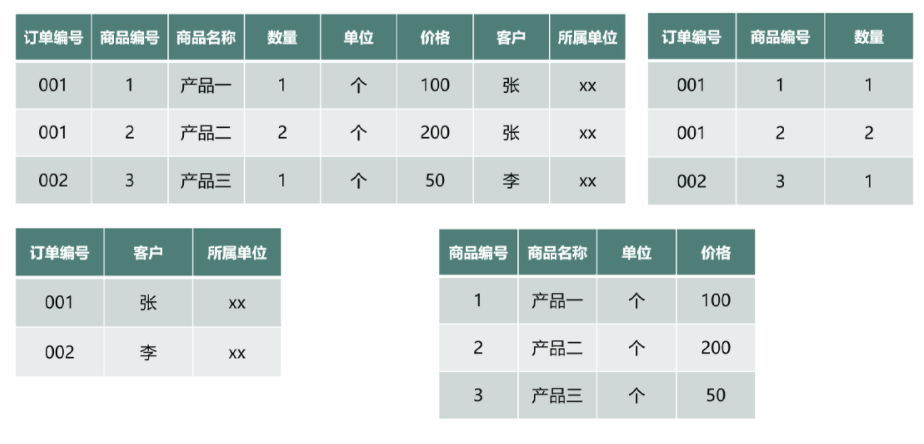

以订单编号和商品编号做关联主键，商品名称、单位、价格不与主键相关，只和编号有关，违反了第二范式（完全依赖主键），拆分为三张表。

- 包含客户信息的订单信息表
- 包含商品详情的商品信息表
- 包含订单详情的订单详情表

#### 范式优缺点

优点：

- 避免数据冗余，减少维护数据完整性的麻烦；
- 减少数据库的空间
- 数据变更数据快

缺点：

- 按照范式设计的表，等级越高，设计出的表的数量越多
- 获取数据时，表关联过多，性能较差。

表的数量越多，查询所需要的时间越多，也就是说，所用的范式越高，对数据的操作性能越低。

### 反范式

根据业务场景，在范式的基础上进行灵活的设计。

反范式设计主要从三个方面：

- 业务场景
- 相应时间
- 字段冗余

反范式设计就是用空间换时间，提高业务场景的响应时间，减少多表关联，主要的优点有：

- 允许适当的数据冗余，业务场景中需要的数据基本都可以在一张表上显示，避免关联；
- 可以设计有效的索引。

### 范式和反范式异同

范式模型：

- 数据没有冗余，更新容易
- 当表的数量比较多，查询数据需要多表关联时，会导致性能低下。

反范式模型：

- 冗余将带来很好的读取性能，因为不需要join很多表
- 虽然需要维护数据的冗余，但是对磁盘空间消耗是可以接受的。

## Mysql使用原则和设计规范

发挥mysql的最佳性能，需要遵循3个基本原则：

- 1.mysql只用于存储数据，不进行数据的复杂计算，不承载业务逻辑，确保存储和计算分离。
- 2.查询时，尽量单表查询，减少跨库查询和多表关联。
- 杜绝大事务，大sql，大批量，大字段等一系列性能杀手。
  - 大事务：运行步骤较多，涉及的表和字段较多，造成资源争抢，形成死锁，一旦事务回滚，会导致资源占用时间较长。
  - 大sql：复杂的sql意味着过多的表关联，mysql的数据库处理关联超过三张表以上的sql时，占用的资源多，性能低下。
  - 大批量：意味着多条sql一次性执行完成，必须确保进行充分的测试，并在业务低峰时段或者非业务时段执行。
  - 大字段，blob、text等大字段，尽量少用，必须用是，尽量于主业务表分离，减少对这类字段的额检索和更新。

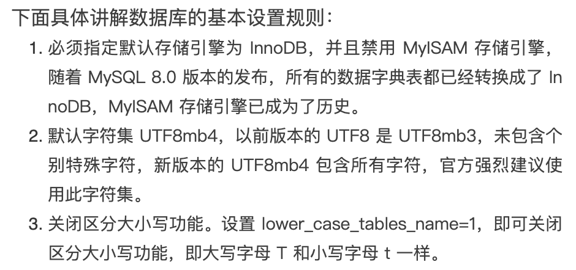

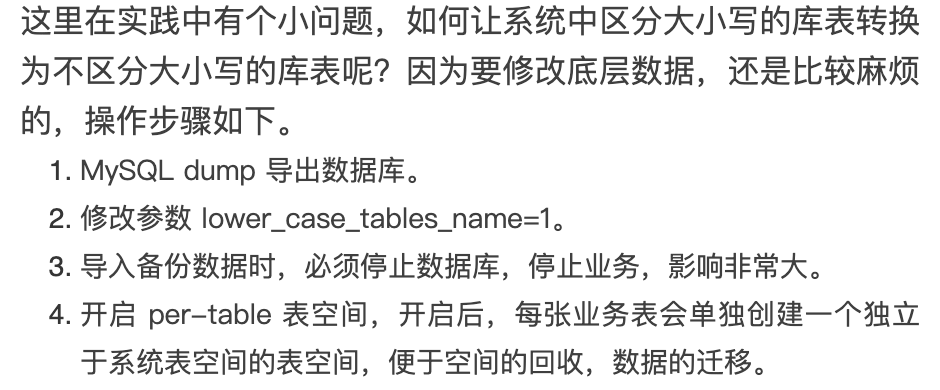

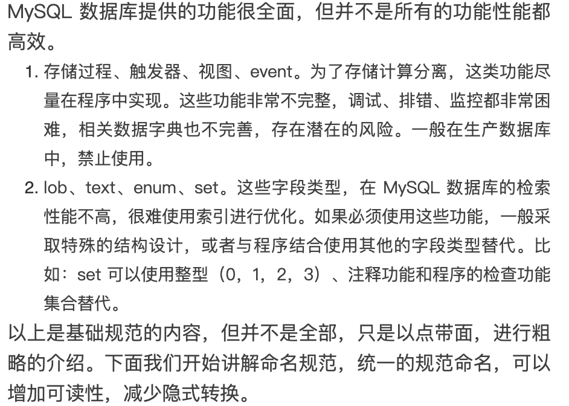

## 规范命名

命名时的字符取值范围时：a-z,0-9和_.

1.所有表名小写，不允许驼峰命名

2.允许使用-（横线）和空格，使用-时，后太转化为@002d

3.不允许使用其它特殊字符作为名称

库名设计遵循“见名知意”原则，即库名规则为:"数据库类型代码+项目名称+识别代码+序号"

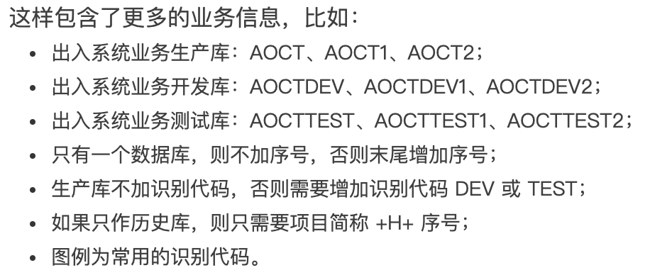

### 表名的命名规范

- 单表仅仅使用a-z _
- 分表名称为“表名_编号”
- 业务表名称代表用途、内容:子系统简称`_业务含义_`后缀

常见业务类型:

- 临时表:tmp
- 备份表:bak
- 字典表:dic
- 日志表:log

### 字段名

遵循"见名知意"原则，格式：名称_后缀

- 避免普遍简单、有歧义的名称

用户表中UserName比Name好

- 布尔型的字段，以助动词（has/is）开头

hasmessage，ischecked

**常见后缀如下：**

- 流水号/无意义主键，后缀为id，如task_id
- 时间，后缀为time，如insert_time

### 索引命名格式

- `前缀_表名（或缩写）_字段名（或缩写）`
- 主键必须使用“pk_”
- UNIQUE约束必须使用“uk_”
- 普通索引必须使用前缀“idx_”

### InnoDB表的注意事项

- 主键列，UNSIGNED整数，使用auto_increment；禁止手动更新auto_increment，可以删除。
- 必须添加comment注释
- 必须显示指定engine
- 表必备三个字段:id、xxx_create、xxx_modified。
  - id为主键，类型为u nisigned bigint类型
  - xxx_create、xxx_modified均为datetime类型，分别记录该条数据的创建时间、修改时间。

### 备份表和临时表常见表设计规范

- 备份表，表名必须加bak和日期，主要用于版本上线时，存原始数据，上线完成则删除
- 临时表：用于存储中间业务的数据，定期优化，及时降低表碎片
- 日志类表：首先考虑不入库，保存成文件，入库则明确其生命周期，保留业务需求的数据，定期清理。
- 大字段表：把主键和大字段单独拆分成表，保持与主键表同步，减少大字段的索引和更新。
- 大表，根据业务需求，从垂直和水平两个维度拆分
  - 垂直拆分：按列关联度
  - 水平拆分
    - 按时间、地域、范围
    - 冷热数据

### 字段设计要求

- 根据业务场景需求，选择适合的类型，最短的长度，确保字段的宽度足够用，不能过宽。所有的字段必须为not null ，空值则指定default值，空值难以优化。
- 表字段数少而精，尽量不加冗余列
- 单实例表个数必须控制在2000以内
- 单表分表个数必须控制在1024以内
- 单表字段数上限为20-50之间。

**禁用ENUM、SET类型-----兼容性不好，性能差**

解决方案，使用TINYINT，在COMMENT信息中标明被枚举的含义。‘is_disbale’ TINYINT UNSIGNED DEFAULT ‘0’ COMMENT ‘0:启用 1:禁用 2:异常’.

禁用列尾NULL 

- 难以优化NULL
- NULL列加索引，需要额外空间
- 含NULL复合索引无效

解决方案：在列上添加NOT NULL DEFAULT 缺省值。

**禁用 VARBINARY、BLOG存储图片、文件等**

- 禁止在数据库中存储大文件，如图片，可以将大文件存储在文件存储系统中，数据库存储路径

**不建议使用TEXT/BLOG：**

- 处理性能差
- 行长度变长
- 全表扫描代价大

解决方案：拆分成单独的表

存储字节越小，占用的空间越小。

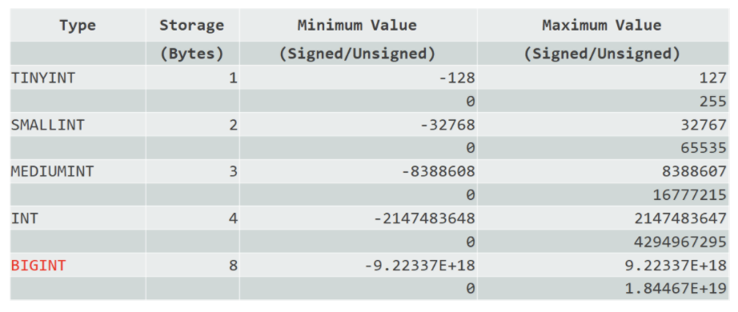

- 主键列，无负数，建议使用INT UNSIGNED 或者BIGINT UNSIGNED;预估字段数字取值会超过42亿，使用BIGINT类型。
- 短数据使用TINYINT或者SMALLINT，比如人类年龄，城市代码。
- 使用UNSIGNED存储非负数值，扩大正数的范围

**int(3)/int(5)区别**

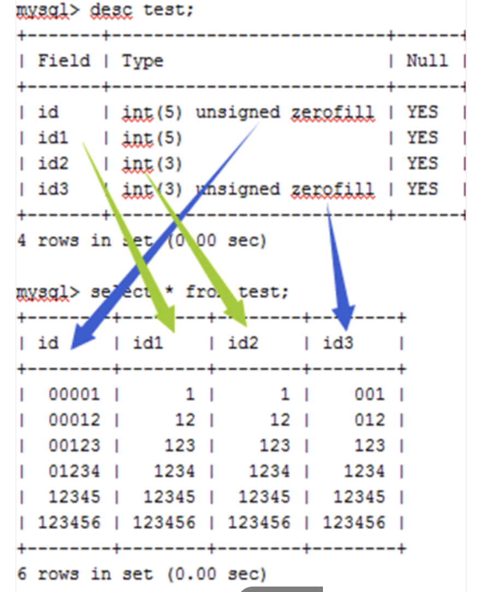

- 正常显示没有区别
- 3和5近视最小显示宽度
- 有zerofill等扩展属性时则显示有区别。

**浮点数和定点数的区别**

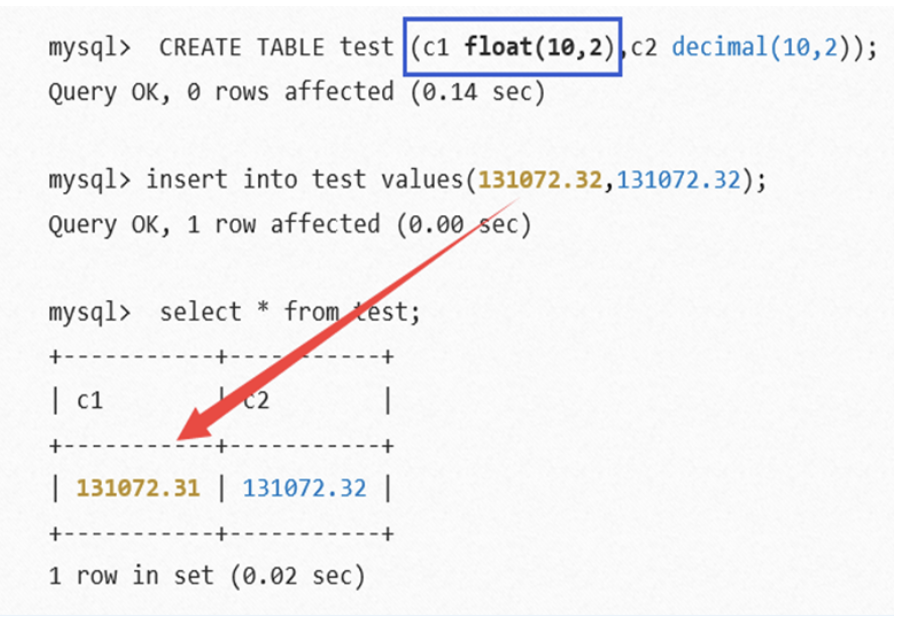

1.浮点数：float、double

2.定点数: decimal

- 浮点数存在误差问题；
- 尽量避免进行浮点数比较
- 对货币等对精度敏感的数据，应该使用定点数。

**Char 和 Varchar类型**

存储字符串长度相同的全部使用Char类型；字符长度不相同的使用Varchar类型，不预先分配存储空间，长度不要超过255.

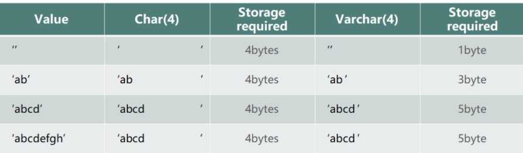

varchar值存储为1字节或者2字节长度前缀数据。如果值不超过255个字节，则列使用一个字节长度；如果值可能需要超过255个字节，则列使用两个字节长度。

### 案例

**IP处理**

- 一般使用Char(15)进行存储，但当进行查找和统计时，字符类型不是很高效。
- Mysql数据库内置了两个IP相关函数INET_ATON()、INET_NTOA(),可以实现IP地址和整数的转换。

因此使用INT UNISIGNED存储IP

IP：192.168.0.1的转换

转换后的数字时连续的，提高了查询的性能，使得查询更快，占用空间更小。

**TIMESTAMP处理**

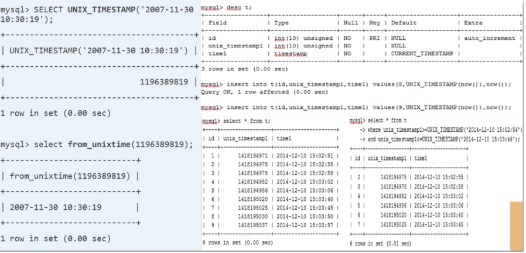

**表大小及使用频率**

主键建议设定为与表名称有关，即 `表名_id`

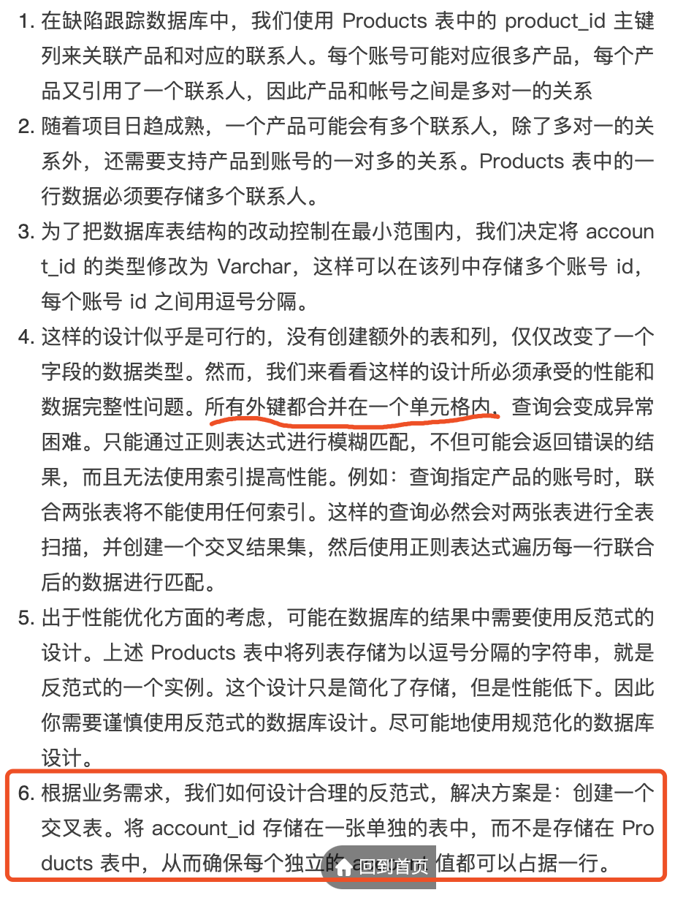

新表Contacts，实现了Products和Account的多对多关系，称为交叉表。