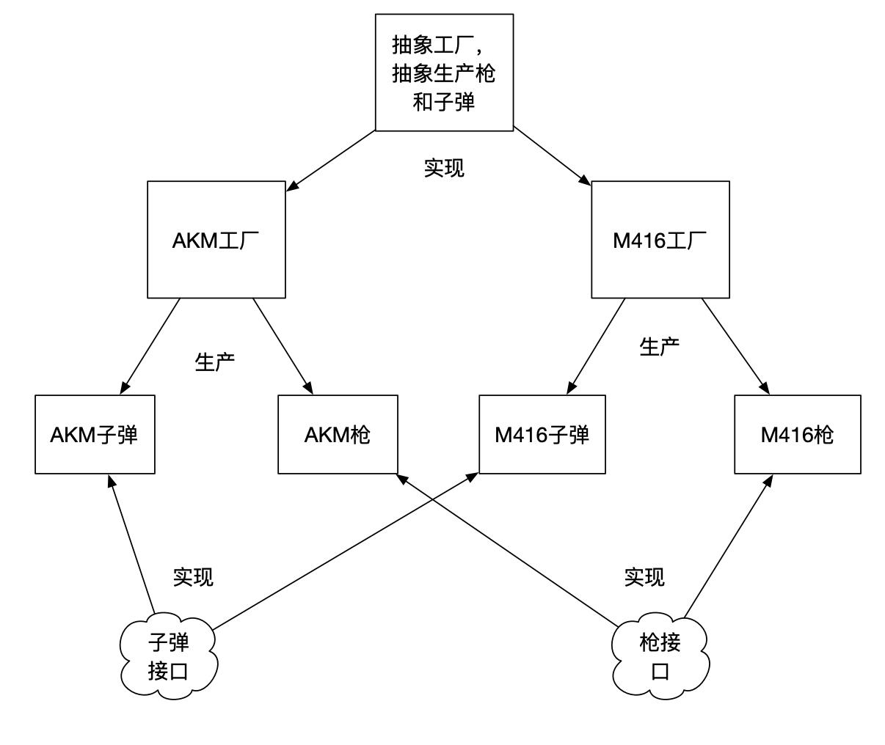

# 设计模式之--工厂模式

- 简单工厂模式

- 工厂方法模式 
-  抽象工厂模式

### 简单工厂模式

#### **定义：**

　　定义**一个**工厂类，根据传入的参数不同返回不同的实例，被创建的实例具有共同的父类或接口。

#### **适用场景：**

首先由于只有一个工厂类，所以工厂类中创建的对象不能太多，否则工厂类的业务逻辑就太复杂了，其次由于工厂类封装了对象的创建过程，所以客户端应该不关心对象的创建。总结一下适用场景：
　　（1）需要创建的对象较少。
　　（2）客户端不关心对象的创建过程。

创建一个可以绘制不同形状的绘图工具，可以绘制圆形，正方形，三角形，每个图形都会有一个draw()方法用于绘图

```java
public interface Shape {
    void draw();
}
```

#### **实例：**

　　创建一个可以绘制不同形状的绘图工具，可以绘制圆形，正方形，三角形，每个图形都会有一个draw()方法用于绘图，不看代码先考虑一下如何通过该模式设计完成此功能。

　　由题可知圆形，正方形，三角形都属于一种图形，并且都具有draw方法，所以首先可以定义一个接口或者抽象类，作为这三个图像的公共父类，并在其中声明一个公共的draw方法。

```
public interface Shape {
    void draw();
}
```

　　这里定义成抽象类也是可以的，只不过接口是更高一级的抽象，所以习惯定义成接口，而且接口支持多实现，方便以后扩展。

下面就是编写具体的图形，每种图形都实现Shape 接口
圆形

```
public class CircleShape implements Shape {

    public CircleShape() {
        System.out.println(  "CircleShape: created");
    }

    @Override
    public void draw() {
        System.out.println(  "draw: CircleShape");
    }

}
```

正方形

```java
public class RectShape implements Shape {
    public RectShape() {
       System.out.println(  "RectShape: created");
    }

    @Override
    public void draw() {
       System.out.println(  "draw: RectShape");
    }

}
```

三角形

```java
public class TriangleShape implements Shape {

    public TriangleShape() {
        System.out.println(  "TriangleShape: created");
    }

    @Override
    public void draw() {
        System.out.println(  "draw: TriangleShape");
    }

}
```

下面是工厂类的具体实现

```java
 public class ShapeFactory {
          public static final String TAG = "ShapeFactory";
          public static Shape getShape(String type) {
              Shape shape = null;
              if (type.equalsIgnoreCase("circle")) {
                  shape = new CircleShape();
              } else if (type.equalsIgnoreCase("rect")) {
                  shape = new RectShape();
              } else if (type.equalsIgnoreCase("triangle")) {
                  shape = new TriangleShape();
              }
              return shape;
          }
   }
```

　　在这个工厂类中通过传入不同的type可以new不同的形状，返回结果为Shape 类型，这个就是简单工厂核心的地方了。

在这个工厂类中通过传入不同的type可以new不同的形状，返回结果为Shape 类型，这个就是简单工厂核心的地方了。
客户端使用

画圆形

```java
    Shape shape= ShapeFactory.getShape("circle");
    shape.draw();
```

画正方形

```java
    Shape shape= ShapeFactory.getShape("rect");
    shape.draw();
```

画三角形

```java
    Shape shape= ShapeFactory.getShape("triangle");
    shape.draw();
```

如果我们新增产品类的话，就需要修改工厂类中的getShape（）方法，这很明显不符合 **开放-封闭原则** 。

### 工厂方法模式 

工厂方法模式中，我们不再提供一个统一的工厂类来创建所有的对象，而是针对不同的对象提供不同的工厂。也就是说每个对象都有一个与之对应的工厂。

#### **定义：**

　　定义一个用于创建对象的接口，让子类决定将哪一个类实例化。工厂方法模式让一个类的实例化延迟到其子类。
　　这次我们先用实例详细解释一下这个定义，最后在总结它的使用场景。

####  **适用场景：**

- 一个类不知道它所需要的对象的类：在工厂方法模式中，**客户端不需要知道具体产品类的类名，只需要知道所对应的工厂即可**，具体的产品对象由具体工厂类创建；客户端需要知道创建具体产品的工厂类。
- 一个类通过其子类来指定创建哪个对象：在工厂方法模式中，对于抽象工厂类只需要提供一个创建产品的接口，而**由其子类来确定具体要创建的对象**，利用面向对象的多态性和里氏
- **将创建对象的任务委托给多个工厂子类中的某一个**，客户端在使用时可以无需关心是哪一个工厂子类创建产品子类，需要时再动态指定，可将具体工厂类的类名存储在配置文件或数据库中。

#### **工厂方法模式角色分配：**

1. **抽象工厂(Abstract Factory)角色**：是工厂方法模式的核心，与应用程序无关。任何在模式中创建的对象的工厂类必须实现这个接口。**对应实例里面的ShapeFactory；**
2. **具体工厂(Concrete Factory)角色** ：这是实现抽象工厂接口的具体工厂类，包含与应用程序密切相关的逻辑，并且受到应用程序调用以创建某一种产品对象。**对应实例里面的CircleShapeFactory；**
3. **抽象产品(AbstractProduct)角色** ：工厂方法模式所创建的对象的超类型，也就是产品对象的共同父类或共同拥有的接口。**对应实例里面的Shape；**
4. **具体产品(Concrete Product)角色** ：这个角色实现了抽象产品角色所定义的接口。某具体产品有专门的具体工厂创建，它们之间往往一一对应。**对应实例里面的CircleShape；**

产品的接口

```java
public interface Shape {
    void draw();
}
```

具体的产品

```java
public class CircleShape implements Shape {

    public CircleShape() {
        System.out.println("CircleShape: created");
    }

    @Override
    public void draw() {
        System.out.println("draw: CircleShape");
    }
}
```

抽象工厂

```java
public interface ShapeFactory {
    Shape getShape();
}
```

具体工厂

```java
public class CircleShapeFactory implements ShapeFactory{
    @Override
    public Shape getShape() {
        return new CircleShape();
    }
}
```

调用

```java
public class Main {
    public static void main(String[] args) {
        // 根据具体的工厂 创建工厂
        ShapeFactory circleFactory = new CircleShapeFactory();

        // 调用具体工厂的方法创建 具体的对象实例
        Shape circle = circleFactory.getShape();

        // 调用实例中的方法
        circle.draw();
    }
}
```

### 抽象工厂模式 

抽象工厂模式是工厂方法的仅一步深化，在这个模式中的工厂类不单单可以创建一种产品，而是可以创建一组产品。

#### **适用场景：**

- 和工厂方法一样客户端不需要知道它所创建的对象的类。
- 需要一组对象共同完成某种功能时，并且可能存在多组对象完成不同功能的情况。（同属于同一个产品族的产品）
- 系统结构稳定，不会频繁的增加对象。（因为一旦增加就需要修改原有代码，不符合开闭原则）

#### 抽象工厂方法模式角色分配：

1. **抽象工厂（AbstractFactory）角色** ：是工厂方法模式的核心，与应用程序无关。任何在模式中创建的对象的工厂类必须实现这个接口。对应这里的Factory。
2. **具体工厂类（ConreteFactory）角色** ：这是实现抽象工厂接口的具体工厂类，**包含与应用程序密切相关的逻辑**，并且受到应用程序调用以创建某一种产品对象。对应这里的AKMFactory，业务逻辑就是生产枪和生产子弹。
3. **抽象产品（Abstract Product）角色** ：工厂方法模式所创建的对象的超类型，也就是产品对象的共同父类或共同拥有的接口。对应这里的Gun，Bullet。
4. **具体产品（Concrete Product）角色** ：抽象工厂模式所创建的任何产品对象都是某一个具体产品类的实例。对应这里的AKM，AKMBullet。

#### 抽象工厂的工厂和工厂方法中的工厂有什么区别呢？

​	**抽象工厂是生产一整套有产品的（至少要生产两个产品)，这些产品必须相互是有关系或有依赖的，而工厂方法中的工厂是生产单一产品的工厂。**

#### 抽象工厂模式实例

假设现在存在AKM、M416两类枪，每一种枪对应一种子弹。我们现在这样考虑生产AKM的工厂可以顺便生产AKM使用的子弹，生产M416的工厂可以顺便生产M416使用的子弹。（AKM工厂生产AKM系列产品包括子弹啊，AKM枪的类型啊这些，M416工厂同理）



**（1）创建相关接口：**

枪

```java
public interface Gun {
    public void shooting();
}
```

子弹

```java
public interface Bullet {
    public void load();
}
```

**（2）创建接口对应实现类：**

AKM类

```java
public class AKM implements Gun{
    @Override
    public void shooting() {
        System.out.println("shooting with AKM");  
    }
}
```

M416类

```java
public class M416 implements Gun {
    @Override
    public void shooting() {
        System.out.println("shooting with M416");
    }
}
```

AKM子弹类

```java
public class AKMBullet implements Bullet{
    @Override
    public void load() {
        System.out.println("Load bullets with AKM");
    }
}
```

M416子弹类

```java
public class M416Bullet implements Bullet{
    @Override
    public void load() {
        System.out.println("Load bullets with M416");
    }
}
```

**（3）创建工厂接口**

抽象工厂，包含制造枪和子弹

```java
public interface Factory {
    public Gun produceGun();
    public Bullet produceBullet();
}
```

**（4）创建具体工厂**

生产AKM和AKM子弹的工厂

```java
public class AKMFactory implements Factory{

    @Override
    public Gun produceGun() {
        return new AKM();
    }

    @Override
    public Bullet produceBullet() {
        return new AKM_Bullet();
    }
}
```

生产M416和M416子弹的工厂

```java
public class M416Factory implements Factory{

    @Override
    public Gun produceGun() {
        return new M416();
    }

    @Override
    public Bullet produceBullet() {
        return new M416_Bullet();
    }
}
```

**（5）测试**

```java
public class Main {
    public static void main(String[] args) {
        Factory factory;
        Gun gun;
        Bullet bullet;

        // 创建AKMM工厂实例
        factory = new AKMMFactory();
        // 创建子弹实例
        bullet = factory.produceBullet();
        bullet.load();

        // 创建枪实例
        gun = factory.produceGun();
        gun.shooting();
    }
}
```

```
Load bullets with AKMM
shooting with AKMM
```

来源：[深入理解工厂模式](https://segmentfault.com/a/1190000015050674)


----

代码：

- [设计模式](../icoding/desinepatterns/src/main/java/com/wangfulin/dp)


