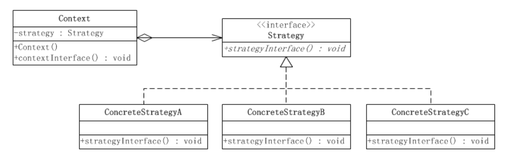
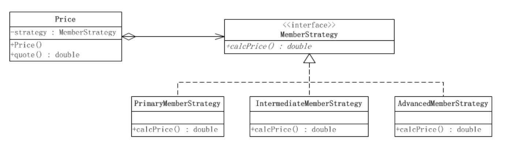

# 设计模式之--策略模式

### 策略模式的结构

​	策略模式属于对象的行为模式。其用意是针对一组算法，将每一个算法封装到具有共同接口的独立的类中，从而使得它们可以相互替换。策略模式使得算法可以在不影响到客户端的情况下发生变化。



这个模式涉及到三个角色：

- **环境(Context)角色**：持有一个Strategy的引用。

- **抽象策略(Strategy)角色：**这是一个抽象角色，通常由一个接口或抽象类实现。此角色给出所有的具体策略类所需的接口。

- **具体策略(ConcreteStrategy)角色：**包装了相关的算法或行为。

环境角色类Context：

```java
public class Context {
    //持有一个具体策略的对象
    private Strategy strategy;
    /**
     * 构造函数，传入一个具体策略对象
     * @param strategy  具体策略对象
     */
    public Context(Strategy strategy){
        this.strategy = strategy;
    }
    /**
     * 策略方法
     */
    public void contextInterface(){
        strategy.strategyInterface();
    }
    
}
```

抽象策略类Strategy：

```java
public interface Strategy {
    /**
     * 策略方法
     */
    public void strategyInterface();
}
```

具体策略类ConcreteStrategy：

```java
public class ConcreteStrategyA implements Strategy {
    @Override
    public void strategyInterface() {
        //相关的业务
    }
}
```

```java
public class ConcreteStrategyB implements Strategy {
    @Override
    public void strategyInterface() {
        //相关的业务
    }
}
```

```java
public class ConcreteStrategyC implements Strategy {
    @Override
    public void strategyInterface() {
        //相关的业务
    }
}
```

### 使用场景

　　假设现在要设计一个贩卖各类书籍的电子商务网站的购物车系统。一个最简单的情况就是把所有货品的单价乘上数量，但是实际情况肯定比这要复杂。比如，本网站可能对所有的高级会员提供每本20%的促销折扣；对中级会员提供每本10%的促销折扣；对初级会员没有折扣。

　　根据描述，折扣是根据以下的几个算法中的一个进行的：

　　算法一：对初级会员没有折扣。

　　算法二：对中级会员提供10%的促销折扣。

　　算法三：对高级会员提供20%的促销折扣。

使用策略模式来实现的结构图如下：



```java
public interface MemberStrategy {

    public double calcPrice(double booksPrice);
}

```


```java
public class PrimaryMemberStrategy implements MemberStrategy{
    @Override
    public double calcPrice(double booksPrice) {
        System.out.println("初级会员没有折扣");
        return booksPrice;
    }
}
```


```java
public class IntermediateMemberStrategy implements MemberStrategy {
    @Override
    public double calcPrice(double booksPrice) {
        System.out.println("对于中级会员的折扣为10%");
        return booksPrice * 0.9;
    }
}
```


```java
public class AdvancedMemberStrategy implements MemberStrategy {
    @Override
    public double calcPrice(double booksPrice) {
        System.out.println("对于高级会员的折扣为20%");
        return booksPrice * 0.8;
    }
}
```


```java
public class Price {
    //持有一个具体的策略对象
    private MemberStrategy strategy;

    /**
    * @Name: Price
    * @Description:  传入具体的策略对象
    * @Param: [strategy]
    * @return:
    * @Author: Wangfulin
    * @Date: 2020/5/11
    */
    public Price(MemberStrategy strategy) {
        this.strategy = strategy;
    }

    /**
     * 计算图书的价格
     * @param booksPrice    图书的原价
     * @return    计算出打折后的价格
     */
    public double quote(double booksPrice){
        return this.strategy.calcPrice(booksPrice);
    }
}

```


```java
public class Main {
    public static void main(String[] args) {
        //选择并创建需要使用的策略对象
        MemberStrategy strategy = new AdvancedMemberStrategy();

        //创建环境
        Price price = new Price(strategy);
        // 计算价格
        double quote = price.quote(300);
        System.out.println("图书的最终价格为："  + quote);
    }
}
```

### 策略模式的优点

　　（1）策略模式提供了管理相关的算法族的办法。策略类的等级结构定义了一个算法或行为族。恰当使用继承可以把公共的代码移到父类里面，从而避免代码重复。

　　（2）使用**策略模式可以避免使用多重条件(if-else)语句**。多重条件语句不易维护，它把采取哪一种算法或采取哪一种行为的逻辑与算法或行为的逻辑混合在一起，统统列在一个多重条件语句里面，比使用继承的办法还要原始和落后。

### 策略模式的缺点

　　（1）客户端必须知道所有的策略类，并自行决定使用哪一个策略类。这就意味着**客户端必须理解这些算法的区别**，以便适时选择恰当的算法类。换言之，策略模式只适用于客户端知道算法或行为的情况。

　　（2）由于策略模式把每个具体的策略实现都单独封装成为类，如果备选的策略很多的话，那么对象的数目就会很可观。

来自：[JAVA与模式之策略模式](https://www.cnblogs.com/java-my-life/archive/2012/05/10/2491891.html)

**策略模式：分别封装行为接口，实现算法族，超类里放行为接口对象，在子类里具体设定行为对象（一般在子类的构造函数里面，行为实例化）。原则就是：分离变化部分，封装接口，基于接口编程各种功能。此模式让行为算法的变化独立于算法的使用者。**

定义成超类的，调用超类的方法，子类如何实现不管，是上层的差别性忽略不计