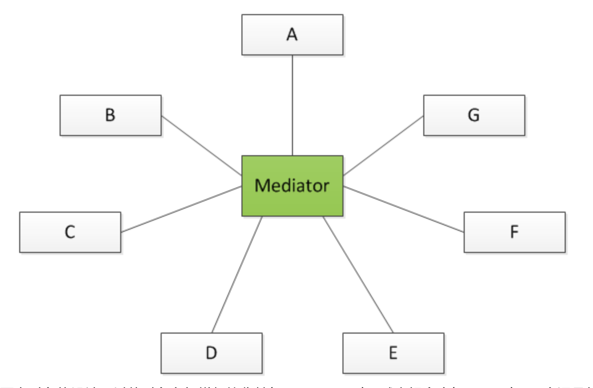
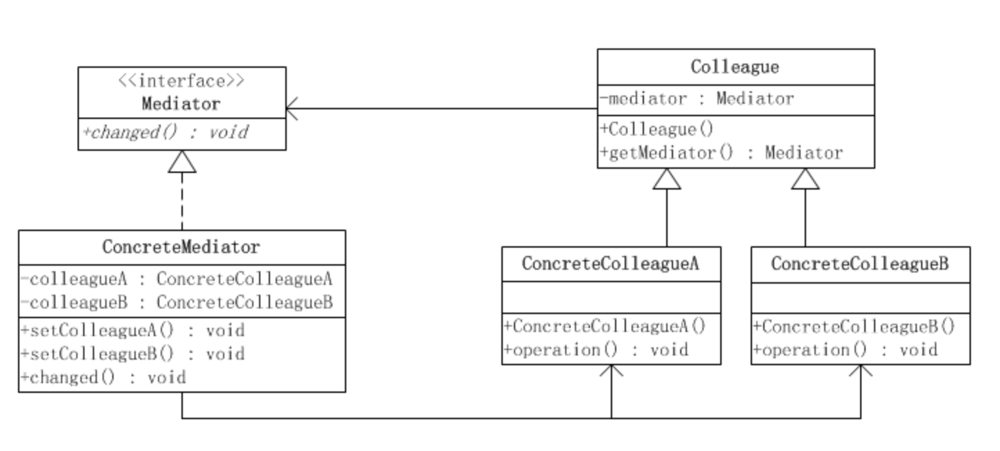

# 设计模式之--调停模式

**调停者模式是对象的行为模式。调停者模式包装了一系列对象相互作用的方式，使得这些对象不必相互明显引用。从而使它们可以较松散地耦合。当这些对象中的某些对象之间的相互作用发生改变时，不会立即影响到其他的一些对象之间的相互作用。从而保证这些相互作用可以彼此独立地变化。**


​	通过引入调停者对象(Mediator)，可以将系统的网状结构变成以中介者为中心的星形结构。在这个星形结构中，同事对象不再通过直接的联系与另一个对象发生相互作用；相反的，它通过调停者对象与另一个对象发生相互作用。调停者对象的存在保证了对象结构上的稳定，也就是说，系统的结构不会因为新对象的引入造成大量的修改工作。



### 调停者模式的结构



**调停者模式包括以下角色：**

**抽象调停者(Mediator)角色：**定义出同事对象到调停者对象的接口，其中主要方法是一个（或多个）事件方法。

**具体调停者(ConcreteMediator)角色：**实现了抽象调停者所声明的事件方法。具体调停者知晓所有的具体同事类，并负责具体的协调各同事对象的交互关系。

**抽象同事类(Colleague)角色：**定义出调停者到同事对象的接口。同事对象只知道调停者而不知道其余的同事对象。

**具体同事类(ConcreteColleague)角色：**所有的具体同事类均从抽象同事类继承而来。实现自己的业务，在需要与其他同事通信的时候，就与持有的调停者通信，调停者会负责与其他的同事交互。

### 源代码

抽象调停者类

```java
public interface Mediator {
    /**
     * 同事对象在自身改变的时候来通知调停者方法
     * 让调停者去负责相应的与其他同事对象的交互
     */
    public void changed(Colleague c);
}
```

具体调停者类

```java
public class ConcreteMediator implements Mediator {
    //持有并维护同事A
    private ConcreteColleagueA colleagueA;
    //持有并维护同事B
    private ConcreteColleagueB colleagueB;    
    
    public void setColleagueA(ConcreteColleagueA colleagueA) {
        this.colleagueA = colleagueA;
    }

    public void setColleagueB(ConcreteColleagueB colleagueB) {
        this.colleagueB = colleagueB;
    }

    @Override
    public void changed(Colleague c) {
        /**
         * 某一个同事类发生了变化，通常需要与其他同事交互
         * 具体协调相应的同事对象来实现协作行为
         */
    }
}
```

抽象同事类

```java
public abstract class Colleague {
    //持有一个调停者对象
    private Mediator mediator;
    /**
     * 构造函数
     */
    public Colleague(Mediator mediator){
        this.mediator = mediator;
    }
    /**
     * 获取当前同事类对应的调停者对象
     */
    public Mediator getMediator() {
        return mediator;
    }
}
```

具体同事类

```java
public class ConcreteColleagueA extends Colleague {

    public ConcreteColleagueA(Mediator mediator) {
        super(mediator);
    }
    /**
     * 示意方法，执行某些操作
     */
    public void operation(){
        //在需要跟其他同事通信的时候，通知调停者对象
        getMediator().changed(this);
    }
}
```

```java
public class ConcreteColleagueB extends Colleague {

    public ConcreteColleagueB(Mediator mediator) {
        super(mediator);
    }
    /**
     * 示意方法，执行某些操作
     */
    public void operation(){
        //在需要跟其他同事通信的时候，通知调停者对象
        getMediator().changed(this);
    }
}
```

### 调停者模式的优点

- **松散耦合**

  　调停者模式通过把多个同事对象之间的交互封装到调停者对象里面，从而使得同事对象之间松散耦合，基本上可以做到互补依赖。这样一来，同事对象就可以独立地变化和复用，而不再像以前那样“牵一处而动全身”了。

- **集中控制交互**

  ​	多个同事对象的交互，被封装在调停者对象里面集中管理，使得这些交互行为发生变化的时候，只需要修改调停者对象就可以了，当然如果是已经做好的系统，那么就扩展调停者对象，而各个同事类不需要做修改。

- **多对多变成一对多**

  ​	没有使用调停者模式的时候，同事对象之间的关系通常是多对多的，引入调停者对象以后，调停者对象和同事对象的关系通常变成双向的一对多，这会让对象的关系更容易理解和实现。

### 调停者模式的缺点

　　调停者模式的一个潜在缺点是，过度集中化。如果同事对象的交互非常多，而且比较复杂，当这些复杂性全部集中到调停者的时候，会导致调停者对象变得十分复杂，而且难于管理和维护。


---

来源：

[《JAVA与模式》之调停者模式](https://www.cnblogs.com/java-my-life/archive/2012/06/20/2554024.html)

---

代码:

[设计模式](../icoding/desinepatterns/src/main/java/com/wangfulin/dp)

